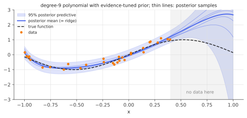

# Bayesian linear regression

!!! tldr "TL;DR"
    Put a Gaussian prior on the coefficients, $\beta\sim N(0,\alpha^{-1}I)$, and keep Gaussian noise with precision $\beta_n = 1/\sigma^2$. The posterior is Gaussian in closed form:
    $$S = (\alpha I + \beta_nX^\top X)^{-1},\qquad m = \beta_nSX^\top y .$$
    The posterior **mean is ridge regression** with $\lambda = \alpha/\beta_n$, but you also get a **full distribution**. The predictive variance $\sigma^2 + x^\top Sx$ separates irreducible noise from parameter uncertainty, which grows away from the data. Hyperparameters can be learned by maximizing the closed-form **marginal likelihood (evidence)**, and the same algebra underlies Kalman filters, Gaussian processes and Thompson sampling.

## Why care?

The [ridge](ridge.md) note showed that ridge is the posterior mean under a Gaussian prior. The other half of the Bayesian answer is the **posterior uncertainty**, and it is useful in practice:

- **Error bars on predictions** that are larger where data are scarce, which is what you want for active learning, Bayesian optimization and safe decision-making.
- **Exploration in bandits and RL.** Thompson sampling draws coefficients from the posterior and acts greedily on the draw. Linear Thompson sampling is a strong, simple contextual-bandit algorithm.
- **Hyperparameter learning without cross-validation.** The evidence trades fit against complexity automatically (an "Occam factor").
- **Online updating.** Each new observation updates the posterior in closed form. With a random-walk prior on $\beta$ this is the **Kalman filter**, used for time-varying betas in quant finance.
- **Uncertainty for deep networks.** "Neural linear" models and Laplace-approximated last layers put Bayesian linear regression on top of learned features, a cheap and often competitive way to quantify predictive uncertainty.

It is also the finite-dimensional version of **Gaussian process regression**: a prior on $\beta$ induces a Gaussian prior on functions $f(x) = \phi(x)^\top\beta$.

## Building blocks

**Model.** $y = \Phi\beta + \varepsilon$ with features $\Phi\in\R^{n\times p}$ (rows $\phi(x_i)^\top$), $\varepsilon\sim N(0,\beta_n^{-1}I)$, and prior $\beta\sim N(m_0, S_0)$ (we mostly take $m_0 = 0$, $S_0 = \alpha^{-1}I$). To avoid confusion with the coefficient vector, write the noise precision as $\beta_n$.

**Gaussian conditioning.** If $(u, v)$ are jointly Gaussian, then $u\mid v$ is Gaussian, with mean and covariance given by Schur complements. For Bayesian regression it is quicker to **complete the square** in the log-posterior.

## The main results

!!! theorem "Theorem (posterior and predictive)"
    With prior $N(m_0, S_0)$ and likelihood $N(\Phi\beta, \beta_n^{-1}I)$, the posterior is $N(m_n, S_n)$ with

    $$
    S_n^{-1} = S_0^{-1} + \beta_n\Phi^\top\Phi,\qquad m_n = S_n\big(S_0^{-1}m_0 + \beta_n\Phi^\top y\big).
    $$

    For a new input $x$ with features $\phi = \phi(x)$, the posterior predictive distribution is

    $$
    y_{\text{new}}\mid y\ \sim\ N\big(\phi^\top m_n,\ \ \underbrace{\beta_n^{-1}}_{\text{noise}} + \underbrace{\phi^\top S_n\phi}_{\text{parameter uncertainty}}\big).
    $$

**Proof.** The log-posterior is, up to constants,

$$
-\frac{\beta_n}{2}\|y - \Phi\beta\|^2 - \frac12(\beta - m_0)^\top S_0^{-1}(\beta - m_0)
= -\frac12\beta^\top\big(S_0^{-1} + \beta_n\Phi^\top\Phi\big)\beta + \beta^\top\big(S_0^{-1}m_0 + \beta_n\Phi^\top y\big) + \text{const}.
$$

A quadratic form $-\frac12\beta^\top A\beta + \beta^\top b$ is the log-density of $N(A^{-1}b, A^{-1})$. The predictive follows from $y_{\text{new}} = \phi^\top\beta + \varepsilon_{\text{new}}$ with independent Gaussian terms. $\square$

**Reading the formulas.**

- With $m_0 = 0$, $S_0 = \alpha^{-1}I$: $m_n = (\Phi^\top\Phi + \frac{\alpha}{\beta_n}I)^{-1}\Phi^\top y$, which is **ridge** with $\lambda = \alpha/\beta_n$, the noise-to-signal ratio from the [ridge note](ridge.md).
- Precisions **add**: posterior precision = prior precision + data precision. Each observation adds $\beta_n\phi_i\phi_i^\top$.
- The parameter-uncertainty term $\phi^\top S_n\phi$ is small for inputs that look like the training data (directions with lots of data precision) and large in unexplored directions. That is why predictive bands widen when extrapolating.

### Learning hyperparameters: the evidence

Integrating out $\beta$, the marginal distribution of the data is Gaussian: $y\sim N\big(0,\ \beta_n^{-1}I + \alpha^{-1}\Phi\Phi^\top\big)$. Its log-density, the **log evidence**, is

$$
\log p(y\mid\alpha,\beta_n) = \frac p2\log\alpha + \frac n2\log\beta_n - E(m_n) - \frac12\log\det S_n^{-1} - \frac n2\log2\pi,\qquad E(m) = \frac{\beta_n}{2}\|y - \Phi m\|^2 + \frac\alpha2\|m\|^2 .
$$

Maximizing over $(\alpha,\beta_n)$ (**type-II maximum likelihood** or empirical Bayes) balances data fit, $E(m_n)$, against model complexity, the $\log\det$ term. Setting derivatives to zero gives MacKay's fixed-point updates (Exercise 5):

$$
\alpha = \frac{\gamma}{\|m_n\|^2},\qquad\beta_n = \frac{n - \gamma}{\|y - \Phi m_n\|^2},\qquad\gamma = \sum_i\frac{\mu_i}{\mu_i + \alpha},
$$

where $\mu_i$ are the eigenvalues of $\beta_n\Phi^\top\Phi$. Here $\gamma$ is the **effective number of well-determined parameters**, the Bayesian twin of ridge's degrees of freedom.

### Sequential updating and the Kalman filter

Because the posterior after $n$ points is the prior for point $n+1$, data can be processed one observation at a time, with rank-one updates of $S_n$ (Sherman–Morrison) and $m_n$. If the coefficients also drift, $\beta_t = \beta_{t-1} + \eta_t$ with $\eta_t\sim N(0,Q)$, you add $Q$ to the covariance before each update. That is exactly the **Kalman filter** for the state-space model $y_t = \phi_t^\top\beta_t + \varepsilon_t$ (Exercise 4).

{ .fig }

## Examples

### Polynomial regression with error bars, tuned by the evidence

```python
import numpy as np
rng = np.random.default_rng(0)

def features(x, degree=9):                         # polynomial features on [-1, 1]
    return np.vander(x, degree + 1, increasing=True)

def posterior(Phi, y, alpha, beta):
    """Prior w ~ N(0, alpha^{-1} I), noise precision beta. Returns posterior mean and covariance."""
    S = np.linalg.inv(alpha * np.eye(Phi.shape[1]) + beta * Phi.T @ Phi)
    return beta * S @ Phi.T @ y, S

def log_evidence(Phi, y, alpha, beta):
    n, p = Phi.shape; m, S = posterior(Phi, y, alpha, beta)
    E = beta / 2 * np.sum((y - Phi @ m) ** 2) + alpha / 2 * m @ m
    return p / 2 * np.log(alpha) + n / 2 * np.log(beta) - E + 0.5 * np.linalg.slogdet(S)[1] - n / 2 * np.log(2 * np.pi)

f = lambda x: np.sin(3 * x)
x = rng.uniform(-1, 0.4, 30); y = f(x) + 0.2 * rng.standard_normal(30)   # note: no data on (0.4, 1]
Phi = features(x)

# Empirical Bayes: maximize the evidence over (alpha, beta) by MacKay's fixed-point updates.
alpha, beta = 1.0, 1.0
for _ in range(200):
    m, S = posterior(Phi, y, alpha, beta)
    lam = np.linalg.eigvalsh(beta * Phi.T @ Phi)
    gamma = np.sum(lam / (lam + alpha))            # effective number of well-determined parameters
    alpha = gamma / (m @ m)
    beta = (len(y) - gamma) / np.sum((y - Phi @ m) ** 2)
print(f"evidence-optimal: alpha = {alpha:.3f}, noise sd = {beta**-0.5:.3f} (true 0.2), "
      f"effective parameters = {gamma:.2f} of {Phi.shape[1]}, log evidence = {log_evidence(Phi, y, alpha, beta):.2f}")

m, S = posterior(Phi, y, alpha, beta)
xt = rng.uniform(-1, 1, 5000); Pt = features(xt)
mean = Pt @ m; sd = np.sqrt(1 / beta + np.einsum("ij,jk,ik->i", Pt, S, Pt))   # predictive sd: noise + parameter uncertainty
yt = f(xt) + 0.2 * rng.standard_normal(5000)
inside = xt <= 0.4
cov = np.abs(yt - mean) <= 1.96 * sd
print(f"95% predictive interval coverage: where data exist {cov[inside].mean():.3f}   extrapolation (x > 0.4) {cov[~inside].mean():.3f}")
print(f"mean predictive sd: inside {sd[inside].mean():.3f}   extrapolation {sd[~inside].mean():.3f}")
# evidence-optimal: alpha = 0.442, noise sd = 0.177 (true 0.2), effective parameters = 4.74 of 10, log evidence = -2.76
# 95% predictive interval coverage: where data exist 0.903   extrapolation (x > 0.4) 0.620
# mean predictive sd: inside 0.191   extrapolation 1.051
```

The evidence picks a sensible model: about 4.7 effective parameters out of 10, and a noise level close to the truth (0.18 vs 0.2). Where data exist, the predictive interval covers about 90%, a bit under 95% because the noise was slightly underestimated. **In the extrapolation region the bands widen fivefold, yet cover only 62%.** Bayesian uncertainty
is honest *relative to the model*. A polynomial prior extrapolates like a polynomial, not like a sine, and no amount of posterior variance fixes a wrong model. That is a key motivation for model-free guarantees such as [conformal prediction](conformal-prediction.md).

## Exercises

!!! question "Exercise 1 · warm-up: one coefficient"
    For $y_i = \beta x_i + \varepsilon_i$ with scalar $\beta\sim N(0,\tau^2)$ and $\varepsilon_i\sim N(0,\sigma^2)$, write the posterior mean and variance. What happens as $n\to\infty$, and as $\tau\to\infty$?

    ??? success "Solution"
        Posterior precision $\frac1{\tau^2} + \frac{\sum x_i^2}{\sigma^2}$, mean $\frac{\sum x_iy_i/\sigma^2}{1/\tau^2 + \sum x_i^2/\sigma^2}$. As $n\to\infty$ the data precision dominates, the mean tends to OLS, and the variance tends to $\sigma^2/\sum x_i^2$, the classical sampling variance (Bernstein–von Mises in miniature). As $\tau\to\infty$ (flat prior), we recover OLS exactly, with posterior variance equal to the frequentist $\Var(\hat\beta_{\text{OLS}})$.

!!! question "Exercise 2 · ridge and the posterior mean"
    Show that the posterior mean with $m_0 = 0$, $S_0 = \alpha^{-1}I$ equals ridge with $\lambda = \alpha\sigma^2$ (unnormalized objective). Is the posterior **mode** also ridge? What would a Laplace prior give?

    ??? success "Solution"
        $m_n = \beta_nS_n\Phi^\top y = (\alpha\beta_n^{-1}I + \Phi^\top\Phi)^{-1}\Phi^\top y$, i.e. ridge with $\lambda = \alpha/\beta_n = \alpha\sigma^2$. For a Gaussian posterior the mode equals the mean, so yes. A Laplace prior $p(\beta)\propto e^{-\lambda\|\beta\|_1}$ gives the [LASSO](lasso.md) as the posterior **mode** (MAP), but its posterior **mean** is not sparse. The "Bayesian LASSO" posterior has no exact zeros.

!!! question "Exercise 3 · where uncertainty lives"
    Using the eigendecomposition $\Phi^\top\Phi = \sum_i d_iv_iv_i^\top$, show that $\phi^\top S_n\phi = \sum_i\frac{(v_i^\top\phi)^2}{\alpha + \beta_nd_i}$. Explain why predictions for inputs whose features point along small-$d_i$ directions are uncertain.

    ??? success "Solution"
        $S_n = (\alpha I + \beta_n\Phi^\top\Phi)^{-1} = \sum_i\frac{v_iv_i^\top}{\alpha + \beta_nd_i}$, so the quadratic form is as stated. Directions with large $d_i$ (well covered by the training inputs) contribute about $\frac{1}{\beta_nd_i}$, which is small. Directions with $d_i\approx0$ (never seen) contribute up to $1/\alpha$, the prior variance. Extrapolating means moving into poorly covered feature directions. This is the same spectral picture as in [ridge](ridge.md), now applied to uncertainty instead of estimation.

!!! question "Exercise 4 · the Kalman filter"
    For the time-varying model $\beta_t = \beta_{t-1} + \eta_t$, $\eta_t\sim N(0,Q)$, and $y_t = \phi_t^\top\beta_t + \varepsilon_t$, show that if $\beta_{t-1}\mid y_{1:t-1}\sim N(m, P)$, then after predicting and updating with $y_t$:
    $P^- = P + Q$, $K = P^-\phi_t/(\phi_t^\top P^-\phi_t + \sigma^2)$, $m^+ = m + K(y_t - \phi_t^\top m)$, $P^+ = P^- - K\phi_t^\top P^-$.

    ??? success "Solution"
        Prediction: $\beta_t = \beta_{t-1} + \eta_t$, so $\beta_t\mid y_{1:t-1}\sim N(m, P + Q)$. Update: $(\beta_t, y_t)$ are jointly Gaussian with $\Cov(\beta_t, y_t) = P^-\phi_t$ and $\Var(y_t) = \phi_t^\top P^-\phi_t + \sigma^2$. Gaussian conditioning gives mean $m + \frac{P^-\phi_t}{\phi_t^\top P^-\phi_t + \sigma^2}(y_t - \phi_t^\top m)$ and covariance $P^- - \frac{P^-\phi_t\phi_t^\top P^-}{\phi_t^\top P^-\phi_t + \sigma^2}$ ✓.
        With $Q = 0$ this is sequential Bayesian linear regression. With $Q > 0$, old data are gradually forgotten. This is how time-varying CAPM betas are estimated, with $Q$ controlling how fast beta may drift.

!!! question "Exercise 5 · stretch: MacKay's evidence updates"
    Differentiate the log evidence with respect to $\alpha$, using $\frac{d}{d\alpha}\log\det(\alpha I + \beta_n\Phi^\top\Phi) = \sum_i\frac{1}{\alpha + \mu_i}$ and the fact that $m_n$ is a stationary point of $E$. Derive $\alpha = \gamma/\|m_n\|^2$ with $\gamma = \sum_i\frac{\mu_i}{\mu_i + \alpha}$, and interpret $\gamma$.

    ??? success "Solution"
        $\frac{\partial}{\partial\alpha}$ of the log evidence: $\frac{p}{2\alpha} - \frac12\|m_n\|^2 - \frac12\sum_i\frac{1}{\alpha + \mu_i}$. (The dependence of $E$ through $m_n$ drops out by stationarity.) Setting this to zero: $\alpha\|m_n\|^2 = p - \sum_i\frac{\alpha}{\alpha + \mu_i} = \sum_i\frac{\mu_i}{\alpha + \mu_i} = \gamma$.
        Each term $\frac{\mu_i}{\mu_i + \alpha}\in(0,1)$ measures how much the data, rather than the prior, determine the coefficient along eigen-direction $i$, so $\gamma$ counts the *well-determined* parameters. The $\beta_n$ update similarly uses $n - \gamma$ as the residual degrees of freedom, just as $n - p$ appears in the unbiased OLS variance estimate.

## Where it shows up

- **Contextual bandits and RL.** Linear Thompson sampling and LinUCB use the posterior covariance $S_n$ to balance exploration and exploitation in recommendation, ads and adaptive experiments.
- **Uncertainty for deep learning.** Bayesian last layers (neural linear models), the linearized Laplace approximation ([next note](laplace-credible.md)) and GP layers on learned features give calibrated-ish predictive uncertainty at the cost of one Bayesian regression.
- **Quant finance.** Kalman-filtered time-varying betas and factor exposures, Bayesian shrinkage of return forecasts, and Black–Litterman (a Bayesian regression that combines an equilibrium prior with investor views) are all instances of this note's algebra.
- **Gaussian processes and Bayesian optimization.** With infinitely many features, $\phi(x)^\top S_0\phi(x')$ becomes a kernel, and the predictive formulas become GP regression, the workhorse of Bayesian optimization for hyperparameter tuning.
- **Automatic relevance determination.** Giving each coefficient its own prior precision $\alpha_j$ and maximizing the evidence drives many $\alpha_j\to\infty$, pruning features (sparse Bayesian learning, relevance vector machines).

## Further reading

- C. M. Bishop, *Pattern Recognition and Machine Learning* (2006), Ch. 3. Evidence maximization in detail.
- D. MacKay, "Bayesian interpolation" (*Neural Computation*, 1992).
- K. Murphy, *Probabilistic Machine Learning: An Introduction* (2022), Ch. 11.
- J. Snoek et al., "Scalable Bayesian optimization using deep neural networks" (ICML 2015). Neural linear models.
