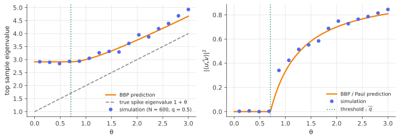

# The BBP transition & spiked covariance

!!! tldr "TL;DR"
    Plant one strong direction in noise: $\Sigma = I + \theta vv^\top$, observed through $T$ samples of $N$ variables ($q = N/T$). There is a sharp **phase transition** at $\theta_c = \sqrt q$. Below it, the top sample eigenvalue sticks to the MP edge $(1+\sqrt q)^2$ and its eigenvector is asymptotically **orthogonal** to $v$. The signal is undetectable by PCA.
    Above it, an outlier separates at $\hat\lambda\to(1+\theta)(1 + q/\theta)$, which is *biased upward*, and the eigenvector overlap is $|\langle\hat u,v\rangle|^2\to\frac{1 - q/\theta^2}{1 + q/\theta} < 1$. These formulas (Baik–Ben Arous–Péché 2005; Paul 2007) tell you when PCA works, how to de-bias eigenvalues, and how much to trust eigenvectors.

## Why care?

"Signal = low-rank structure, noise = everything else" is the default model for PCA, factor models in finance, community detection, recommender systems and representation analysis. [Weyl](courant-fischer-weyl.md) and [Davis–Kahan](davis-kahan.md) give bounds. In high dimension we can do much better and get **exact** answers.

The answers are striking:

- There is a **detectability threshold**. A factor whose strength is below $\sqrt{N/T}$ (in units of the noise variance) is invisible to PCA, however you look at the top eigenvector. That fundamentally limits what can be learned from $T$ samples.
- Even detectable factors are **misestimated**: the eigenvalue is too large and the eigenvector is tilted toward noise. Both biases have closed forms, so they can be **corrected**, which is the basis of [eigenvalue clipping and factor cleaning](clipping-factor-models.md) and of the [RIE](rotational-invariant-estimators.md).
- The same phenomenon appears for spiked **Wigner** matrices (threshold $\theta = 1$), in community detection, in matrix denoising (optimal singular value thresholding), and in the emergence of learned structure in neural-network weight spectra.

## Building blocks

**The spiked covariance model.** $x_t = \Sigma^{1/2}z_t$ with $z_t\sim N(0,I_N)$ i.i.d., $\Sigma = I + \theta vv^\top$ with $\|v\| = 1$ and $\theta > 0$. The sample covariance $E = \frac1T\sum_tx_tx_t^\top$ has $N - 1$ eigenvalues forming the [MP bulk](marchenko-pastur.md) on $[(1-\sqrt q)^2, (1+\sqrt q)^2]$ (one rank-one perturbation can't change the density), plus possibly one outlier.

**A determinant condition.** The nonzero eigenvalues of $E = \Sigma^{1/2}W\Sigma^{1/2}$ equal those of $W\Sigma$, where $W = \frac1T\sum z_tz_t^\top$ is white Wishart. With $W\Sigma = W + \theta Wvv^\top$ and the matrix determinant lemma, for $z$ outside the spectrum of $W$:

$$
\det(z - W\Sigma) = \det(z - W)\,\big(1 - \theta\,v^\top(z - W)^{-1}Wv\big).
$$

Since $(z - W)^{-1}W = z(z-W)^{-1} - I$, the outlier condition is

$$
\theta\,\big(z\,v^\top(z - W)^{-1}v - 1\big) = 1 .
$$

**Isotropy.** $W$ is rotationally invariant, so for a fixed unit vector $v$, $v^\top(z - W)^{-1}v\approx\frac1N\tr(z - W)^{-1} = g(z)$, the MP Stieltjes transform (quadratic-form concentration again).

## The main result

!!! theorem "Theorem (BBP transition; Baik, Ben Arous & Péché 2005; Paul 2007)"
    As $N, T\to\infty$ with $N/T\to q$:

    - If $\theta\le\sqrt q$: $\hat\lambda_1\to(1+\sqrt q)^2$ (the bulk edge) and $|\langle\hat u_1, v\rangle|^2\to0$.
    - If $\theta > \sqrt q$:

    $$
    \hat\lambda_1\to(1+\theta)\Big(1 + \frac q\theta\Big)\ > (1+\sqrt q)^2,
    \qquad
    |\langle\hat u_1, v\rangle|^2\to\frac{1 - q/\theta^2}{1 + q/\theta}.
    $$

    The same holds for each of finitely many spikes separately. For Gaussian data, the outlier's fluctuations are Gaussian of order $T^{-1/2}$ above the threshold, and Tracy–Widom at the threshold.

**Derivation of the outlier location.** With $v^\top(z-W)^{-1}v\approx g(z)$, the condition becomes $zg(z) - 1 = \frac1\theta$. The left side is the **T-transform** $t(z)$ from [free probability II](free-probability-s.md), whose inverse for MP is $\zeta(t) = \frac{(t+1)(1+qt)}{t}$. So

$$
\hat\lambda = \zeta(1/\theta) = \Big(\frac1\theta + 1\Big)\Big(1 + \frac q\theta\Big)\theta = (1+\theta)\Big(1 + \frac q\theta\Big).
$$

**Where does the threshold come from?** For $z > \lambda_+$, $t(z)$ decreases from $t(\lambda_+)$ to $0$. A solution exists iff $\frac1\theta < t(\lambda_+)$. The edge is where $\zeta$ is minimal: $\zeta(t) = qt + (1+q) + \frac1t$ has $\zeta'(t) = q - \frac1{t^2} = 0$ at $t = 1/\sqrt q$, with $\zeta(1/\sqrt q) = (1+\sqrt q)^2 = \lambda_+$ ✓. So an outlier exists iff
$\frac1\theta < \frac1{\sqrt q}$, i.e. $\theta > \sqrt q$. The overlap formula comes from a similar residue computation (the derivative of the same secular equation). $\square$

### Reading the formulas

- **Eigenvalue bias.** $\hat\lambda - (1+\theta) = q\frac{1+\theta}{\theta} > 0$: sample spikes overstate the true factor variance. For $q = 0.5$ and a true spike of $3$ ($\theta = 2$), the sample shows $3.75$. Inverting the map (Exercise 2) recovers $\theta$ from $\hat\lambda$, which is the "de-biasing" step of cleaning methods.
- **Eigenvector tilt.** Even well above the threshold the sample eigenvector is not $v$. At $\theta = 2$, $q = 0.5$, the overlap is $0.70$, an angle of about $33°$. Projections onto the estimated factor are therefore biased too.
- **Universality.** The location formula holds for general (non-Gaussian, finite-fourth-moment) data. For a spiked **Wigner** matrix $X + \theta vv^\top$, the analogous results are threshold $\theta = 1$, outlier at $\theta + 1/\theta$, and overlap $1 - 1/\theta^2$ ([Wigner note](wigner-semicircle.md), Exercise 5).

{ .fig }

## Examples

### The transition, numerically

```python
import numpy as np
rng = np.random.default_rng(0)
N, T = 1000, 2000                                   # q = 0.5, BBP threshold sqrt(q) ≈ 0.707
q = N / T

def predict(theta):
    if theta <= np.sqrt(q):
        return (1 + np.sqrt(q)) ** 2, 0.0           # stuck at the MP edge, no information in the eigenvector
    lam = (1 + theta) * (1 + q / theta)
    overlap = (1 - q / theta**2) / (1 + q / theta)
    return lam, overlap

for theta in [0.3, 0.6, 1.0, 2.0, 5.0]:
    Z = rng.standard_normal((N, T))
    Z[0] *= np.sqrt(1 + theta)                       # Σ = I + θ e1 e1^T
    w, V = np.linalg.eigh(Z @ Z.T / T)
    lam_pred, ov_pred = predict(theta)
    print(f"θ = {theta:3.1f}  top eigenvalue {w[-1]:.3f} (pred {lam_pred:.3f}, true spike {1+theta:.1f})   "
          f"overlap |<u,v>|² {V[0, -1]**2:.3f} (pred {ov_pred:.3f})")
# θ = 0.3  top eigenvalue 2.855 (pred 2.914, true spike 1.3)   overlap |<u,v>|² 0.000 (pred 0.000)
# θ = 0.6  top eigenvalue 2.911 (pred 2.914, true spike 1.6)   overlap |<u,v>|² 0.022 (pred 0.000)
# θ = 1.0  top eigenvalue 2.961 (pred 3.000, true spike 2.0)   overlap |<u,v>|² 0.132 (pred 0.333)
# θ = 2.0  top eigenvalue 3.628 (pred 3.750, true spike 3.0)   overlap |<u,v>|² 0.687 (pred 0.700)
# θ = 5.0  top eigenvalue 6.540 (pred 6.600, true spike 6.0)   overlap |<u,v>|² 0.896 (pred 0.891)
```

Below the threshold, the spike leaves no trace: the top eigenvalue is just the noise edge and the eigenvector overlap is about zero. Well above it, both formulas match. **Near** the threshold ($\theta = 1$ vs $\theta_c = 0.71$) convergence is slow. The predicted outlier is only $0.09$ above the edge, comparable to the
[Tracy–Widom](tracy-widom.md) fluctuations, so at $N = 1000$ the sample is still in the critical window, and the overlap is well below its limit.

### Try it

<div class="widget" data-widget="bbp"></div>

## Exercises

!!! question "Exercise 1 · warm-up: detectability"
    You estimate a 500-stock covariance from 4 years of daily data (about 1000 days), with idiosyncratic volatility $\sigma_\varepsilon = 25\%$ (annualized) for every stock. A factor with volatility $\sigma_f$ loads with exposure 1 on $k$ of the stocks: $\Sigma = \sigma_\varepsilon^2I + \sigma_f^2bb^\top$ with $b$ the indicator of those $k$ stocks.
    What is the smallest $\sigma_f$ that PCA can detect, for a market-wide factor ($k = 500$) and for a narrow industry factor ($k = 10$)?

    ??? success "Solution"
        In units of $\sigma_\varepsilon^2$, $\Sigma/\sigma_\varepsilon^2 = I + \theta vv^\top$ with $v = b/\sqrt k$ and $\theta = \sigma_f^2k/\sigma_\varepsilon^2$. Detection requires $\theta > \sqrt q = \sqrt{0.5} = 0.71$, i.e. $\sigma_f > \sigma_\varepsilon\sqrt{0.71/k}$.
        Market-wide ($k = 500$): $\sigma_f > 25\%\times\sqrt{0.71/500} = 0.94\%$. Any real market factor is far above this. Narrow ($k = 10$): $\sigma_f > 25\%\times\sqrt{0.071} = 6.7\%$. A factor's spike strength grows with the number of assets it touches, so pervasive factors are easy to see and narrow ones can sit below the BBP threshold, invisible to PCA. Those need external information (industry labels, characteristics) or more data.

!!! question "Exercise 2 · de-biasing a sample eigenvalue"
    With $q = 0.25$ you observe an outlier $\hat\lambda = 4$. Invert $\hat\lambda = (1+\theta)(1 + q/\theta)$ to estimate the true spike eigenvalue $1 + \theta$. How big was the bias?

    ??? success "Solution"
        $(1+\theta)(\theta + q) = \hat\lambda\theta$ gives $\theta^2 - (\hat\lambda - 1 - q)\theta + q = 0$, i.e. $\theta^2 - 2.75\theta + 0.25 = 0$, so $\theta = \frac{2.75 + \sqrt{7.5625 - 1}}{2} = 2.656$ (taking the root above $\sqrt q = 0.5$). True spike $1 + \theta = 3.66$ vs observed $4$: the sample overstates the factor variance by about 9%.

!!! question "Exercise 3 · overlap at the edges"
    Show that the overlap $\frac{1 - q/\theta^2}{1 + q/\theta}$ is $0$ at $\theta = \sqrt q$ and tends to $1$ as $\theta\to\infty$. For $\theta = 2\sqrt q$, compute it for $q = 0.1$ and $q = 1$. What angle does the sample eigenvector make with the truth?

    ??? success "Solution"
        At $\theta = \sqrt q$ the numerator vanishes. As $\theta\to\infty$ both $q/\theta^2$ and $q/\theta$ go to 0. For $\theta = 2\sqrt q$: the numerator is $1 - \frac14 = 0.75$ and the denominator is $1 + \frac{\sqrt q}{2}$.
        $q = 0.1$: $0.75/1.158 = 0.648$, angle $\arccos\sqrt{0.648} = 36°$. $q = 1$: $0.75/1.5 = 0.5$, angle $45°$. Even at twice the threshold, the estimated direction is far from the truth.

!!! question "Exercise 4 · the "cleaned" variance along the sample eigenvector"
    For the sample top eigenvector $\hat u$ (above threshold), show that its true variance is $\hat u^\top\Sigma\hat u = 1 + \theta|\langle\hat u, v\rangle|^2$. Compare it with $\hat\lambda$ and with $1 + \theta$ for $q = 0.5$, $\theta = 2$. Which number should a risk model use for a portfolio along $\hat u$?

    ??? success "Solution"
        $\hat u^\top(I + \theta vv^\top)\hat u = 1 + \theta(\hat u^\top v)^2$. With overlap $0.70$: $1 + 2\times0.70 = 2.40$. The sample eigenvalue is $\hat\lambda = 3.75$ and the true spike is $3$.
        A portfolio along $\hat u$ will realize variance about $2.40$, less than the de-biased spike $3$ (because $\hat u$ is tilted away from $v$) and much less than the sample's $3.75$. The right number for the risk model is $2.40$. That is exactly what the [rotationally invariant estimator](rotational-invariant-estimators.md) computes, for every eigenvector, without knowing $v$.

!!! question "Exercise 5 · stretch: why the eigenvector is orthogonal below threshold"
    Below the threshold, the top sample eigenvalue is one of the bulk edge eigenvalues. Argue heuristically, using rotational invariance of $W$ and the fact that the spike contributes only a vanishing fraction of the edge eigenvectors' mass, why $|\langle\hat u_1, v\rangle|^2 = O(1/N)$.

    ??? success "Solution"
        Without the spike, $W$'s eigenvectors are Haar-distributed, so any fixed $v$ has overlap $\approx1/N$ with each one ([high-dim geometry](high-dim-geometry.md)). The weight of $v$ on eigenvectors near any point $x$ of the bulk is described by $-\frac1\pi\operatorname{Im}\,v^\top G(x + i0)v$, a *smooth density* over the spectrum. A subcritical spike reshapes this density, piling up more of $v$'s mass near the edge, but it stays bounded (the secular equation has no solution outside the bulk, so no pole forms).
        A bounded density spread over $N$ eigenvalues gives each individual eigenvector, including the top one, an overlap of order $1/N$. Above the threshold a pole appears outside the bulk, and its residue is the $O(1)$ overlap of the theorem. Rigorous versions of this residue argument are in Paul (2007) and Benaych-Georges & Nadakuditi (2011).

## Where it shows up

- **PCA and the number of factors.** Spiked models justify threshold-based component selection, and they show why "scree plot elbows" mislead for weak factors. Genetics uses this too (Patterson, Price & Reich, 2006, for population structure).
- **Covariance cleaning in finance.** Factor eigenvalues are de-biased by inverting the BBP map. Eigenvector tilt is accounted for by shrinking the variance along sample eigenvectors (Exercise 4). Both are built into [clipping/factor](clipping-factor-models.md) and [RIE](rotational-invariant-estimators.md) estimators.
- **Matrix denoising.** Gavish & Donoho's optimal singular value hard threshold ($4/\sqrt3\cdot\sqrt n\sigma$ for square matrices) and the optimal shrinkage of spiked covariance eigenvalues (Donoho, Gavish & Johnstone, 2018) are derived from BBP-type formulas.
- **Neural networks.** Training creates spikes (outliers) in weight-matrix and Hessian spectra that carry learned features, sitting on top of an MP-like bulk. Analyses of feature learning in two-layer networks (e.g. the large-step-size "spike" analyses of Ba et al., 2022) show a BBP-like transition in which a spike appears after one gradient step and aligns with the target direction.
- **Community detection and signal processing.** The Wigner analogue gives the spectral detectability threshold for planted partitions in dense graphs, and the same phase transition governs detection of a weak source in sensor arrays.

## Further reading

- J. Baik, G. Ben Arous & S. Péché, "Phase transition of the largest eigenvalue for nonnull complex sample covariance matrices" (*Ann. Probab.*, 2005).
- D. Paul, "Asymptotics of sample eigenstructure for a large dimensional spiked covariance model" (*Statistica Sinica*, 2007).
- F. Benaych-Georges & R. R. Nadakuditi, "The eigenvalues and eigenvectors of finite, low rank perturbations of large random matrices" (*Adv. Math.*, 2011).
- D. Donoho, M. Gavish & I. Johnstone, "Optimal shrinkage of eigenvalues in the spiked covariance model" (*Ann. Stat.*, 2018).
