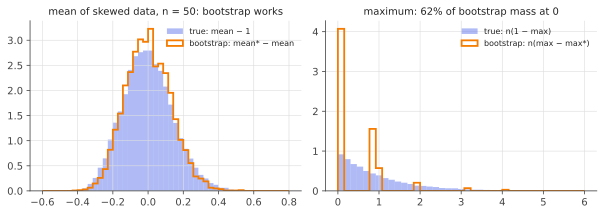

# The bootstrap

!!! tldr "TL;DR"
    To learn how a statistic varies from sample to sample, **resample your own data with replacement** and recompute the statistic many times.
    The spread of those recomputed values approximates the true sampling distribution. This works because the empirical distribution $\hat F_n$
    stands in for the unknown $F$ (the *plug-in principle*), and for smooth statistics it is provably consistent, often more accurate than
    the normal approximation. It fails, sometimes silently, for extremes, heavy tails, dependent data and high-dimensional problems.

## Why care?

You've trained a model and it scores $71.3\%$ on a benchmark. Your strategy backtests at a Sharpe ratio of $1.4$. The top eigenvalue of your
covariance matrix explains $23\%$ of the variance. **How much of each number is luck?**

For a sample mean we have $\sigma/\sqrt n$. For a median, an AUC, a Sharpe ratio, a ratio of eigenvalues, or the accuracy gap between two LLMs
evaluated on the same questions, deriving the standard error by hand is painful or impossible. Efron's 1979 bootstrap replaces the derivation with
computation, and it is now the default way to put error bars on almost anything. It is also the basis of bagging and random forests, and of
several uncertainty methods in deep learning and RL.

## Building blocks

**Sampling distribution.** Data $X_1,\dots,X_n\overset{iid}\sim F$. A statistic $\hat\theta = s(X_1,\dots,X_n)$ estimates $\theta = T(F)$.
Its sampling distribution, the law of $\hat\theta$ over repeated samples from $F$, is what we want, but we only have one sample.

**The empirical distribution.** $\hat F_n$ puts mass $1/n$ on each observed $X_i$. By Glivenko–Cantelli, $\sup_x|\hat F_n(x) - F(x)|\to0$ almost surely.

**The plug-in principle.** Whatever you would compute with $F$, compute it with $\hat F_n$. The bootstrap applies this principle to the
sampling distribution itself:

$$
\underbrace{\text{law of } \hat\theta - \theta \text{ when } X_i\sim F}_{\text{unknown}}
\;\approx\;
\underbrace{\text{law of } \hat\theta^* - \hat\theta \text{ when } X^*_i\sim\hat F_n}_{\text{computable}} .
$$

Sampling $X_i^*\sim\hat F_n$ means drawing $n$ points **with replacement** from the data. Each bootstrap sample contains about $63.2\%$ of
the distinct original points (Exercise 1).

**The algorithm.**

1. For $b = 1,\dots,B$: draw a resample $X^{*b}$ of size $n$ with replacement and compute $\hat\theta^{*b}$.
2. **Standard error:** the standard deviation of $\{\hat\theta^{*b}\}$.
3. **Confidence intervals**, with $q_\alpha$ the $\alpha$-quantile of the $\hat\theta^{*b}$:
    - *percentile:* $[q_{\alpha/2},\, q_{1-\alpha/2}]$;
    - *basic (pivotal):* $[2\hat\theta - q_{1-\alpha/2},\; 2\hat\theta - q_{\alpha/2}]$, which follows from treating $\hat\theta - \theta$ like $\hat\theta^* - \hat\theta$;
    - *studentized (bootstrap-$t$):* bootstrap the pivot $(\hat\theta - \theta)/\widehat{\mathrm{se}}$ instead. This is the most accurate when a standard-error formula exists;
    - *BCa:* percentile with bias and skewness corrections (Efron 1987). This is the usual default in software.

There are two separate approximations: $\hat F_n\approx F$ (statistical error, which needs $n$ large) and Monte Carlo with $B$ resamples
(computational error, which needs $B$ large). $B\approx 1000$–$10000$ is typical for intervals.

## The main result

!!! theorem "Theorem (bootstrap consistency for the mean)"
    Let $X_i$ be i.i.d. with mean $\mu$ and variance $\sigma^2 < \infty$. Then, for almost every data sequence,

    $$
    \sup_x\Big|\,\P^*\big(\sqrt n(\bar X^* - \bar X)\le x\big) - \P\big(\sqrt n(\bar X - \mu)\le x\big)\Big|\;\longrightarrow\;0,
    $$

    where $\P^*$ is the probability over resampling with the data held fixed.

**Proof sketch** (assuming $\E|X|^3 < \infty$, to keep it short). Conditional on the data, $X_1^*,\dots,X_n^*$ are i.i.d. from $\hat F_n$, which has mean
$\bar X$, variance $\hat\sigma^2 = \frac1n\sum_i(X_i - \bar X)^2$ and third absolute central moment $\hat\rho = \frac1n\sum_i|X_i - \bar X|^3$.
The Berry–Esseen theorem, applied in the bootstrap world, gives

$$
\sup_x\Big|\P^*\big(\sqrt n(\bar X^* - \bar X)\le x\big) - \Phi(x/\hat\sigma)\Big|\le\frac{C\,\hat\rho}{\hat\sigma^3\sqrt n}.
$$

By the strong law of large numbers, $\hat\sigma\to\sigma$ and $\hat\rho\to\E|X - \mu|^3$, so the right side goes to $0$. The CLT says the real-world
distribution is also close to $\Phi(x/\sigma)$, and $\Phi(x/\hat\sigma)\to\Phi(x/\sigma)$ uniformly. $\square$

The same argument extends via the delta method to smooth functions of means (variances, correlations, Sharpe ratios, regression coefficients
with $p$ fixed), and more generally to Hadamard-differentiable functionals of $F$.

!!! info "Why the bootstrap can beat the normal approximation"
    For the **studentized** mean, an Edgeworth expansion shows the CLT's error is $O(n^{-1/2})$, driven by skewness. The bootstrap distribution
    reproduces that skewness term, so its error is $O(n^{-1})$ (Singh 1981; Hall 1992). The bootstrap automatically corrects for skewed data. This
    "second-order accuracy" is the theoretical reason to prefer bootstrap-$t$ and BCa intervals.

### When it fails

The proof needed two things: the statistic must depend smoothly on $\hat F_n$, and $\hat F_n$ must capture what matters about $F$. Break either and the bootstrap breaks.

- **Extremes.** For $\hat\theta = \max_iX_i$, the resampled maximum *equals* the observed maximum with probability $1 - (1 - 1/n)^n\to1 - e^{-1}\approx 0.632$.
  The bootstrap distribution has a huge atom at zero, while the true distribution of $n(\theta - \max_iX_i)$ is continuous (exponential for uniform data).
- **Heavy tails.** With infinite variance, the bootstrap of the mean is inconsistent (Athreya 1987). Its distribution stays random even as $n\to\infty$.
- **Dependence.** Resampling individual points destroys autocorrelation. For time series, use the **block** or **stationary** bootstrap, which resamples
  contiguous blocks (Exercise 5).
- **High dimensions.** When $p/n$ is not small, the bootstrap of regression coefficients can be badly miscalibrated (El Karoui & Purdom, 2018). So can
  the bootstrap of sample-covariance eigenvalues: the [Marchenko–Pastur](marchenko-pastur.md) distortion of $\hat F_n$ is not the distortion of $F$.

The usual fixes are **subsampling** and the **$m$-out-of-$n$ bootstrap** (resample $m\ll n$ points), which are consistent under much weaker conditions,
at the cost of efficiency.

{ .fig }

## Examples

### Error bars on a Sharpe ratio

```python
import numpy as np
rng = np.random.default_rng(1)

# Four years of daily returns of a strategy with annualized Sharpe ≈ 1.
T = 4 * 252
r = rng.normal(0.01 / np.sqrt(252), 0.01, T)     # daily vol 1%, true Sharpe exactly 1

def sharpe(x):                                  # annualized
    return np.sqrt(252) * x.mean() / x.std(ddof=1)

B = 10_000
idx = rng.integers(0, T, size=(B, T))           # B resamples of row indices
boot = np.array([sharpe(r[i]) for i in idx])

sr = sharpe(r)
lo, hi = np.percentile(boot, [2.5, 97.5])
se_lo = np.sqrt(252) * np.sqrt((1 + 0.5 * (sr / np.sqrt(252)) ** 2) / T)   # Lo (2002), iid returns
print(f"Sharpe = {sr:.2f}   bootstrap SE = {boot.std():.2f}   analytic SE = {se_lo:.2f}")
print(f"95% percentile interval: [{lo:.2f}, {hi:.2f}]   basic interval: [{2*sr-hi:.2f}, {2*sr-lo:.2f}]")
# Sharpe = 0.12   bootstrap SE = 0.50   analytic SE = 0.50
# 95% percentile interval: [-0.86, 1.09]   basic interval: [-0.84, 1.11]
```

There are two lessons. First, the bootstrap matches the analytic standard error of Lo (2002) without any derivation. Second, the numbers are
sobering: a strategy whose *true* Sharpe is exactly $1$ produced a realized $0.12$ over four years, and the $95\%$ interval spans about two Sharpe
units. The standard error of an annualized Sharpe ratio is roughly $1/\sqrt{\text{years}}$, so even ten years can't separate a Sharpe of $0.5$ from
$1.0$ convincingly. Real returns are also autocorrelated and heavy-tailed, so in practice you would use a block bootstrap.

### Comparing two models on the same test set

To compare two classifiers evaluated on the same $n$ examples, resample **example indices** and recompute both accuracies on each resample. The
paired bootstrap captures the correlation between the two models' errors, which is usually strong, so the paired interval for the difference is
much narrower than what you'd get by treating the two accuracies as independent.

## Exercises

!!! question "Exercise 1 · warm-up: the 63.2% rule"
    Show that the probability that a given observation is absent from a bootstrap sample is $(1 - 1/n)^n\to e^{-1}$. What is the expected number of
    distinct observations in a bootstrap sample of size $n$?

    ??? success "Solution"
        Each of the $n$ draws misses observation $i$ with probability $1 - 1/n$, independently, so $\P(i\notin X^*) = (1-1/n)^n\to e^{-1}\approx 0.368$.
        By linearity of expectation, the expected number of distinct observations is $n[1 - (1-1/n)^n]\approx 0.632\,n$. The left-out $\approx 36.8\%$ are
        the "out-of-bag" points that random forests use for free validation.

!!! question "Exercise 2 · the bootstrap variance of the mean, exactly"
    Without simulation, compute $\Var^*(\bar X^*)$, the variance of the resampled mean conditional on the data. Compare it with the usual unbiased estimate of $\Var(\bar X)$.

    ??? success "Solution"
        The $X_i^*$ are i.i.d. from $\hat F_n$, whose variance is $\hat\sigma^2 = \frac1n\sum_i(X_i - \bar X)^2$. So $\Var^*(\bar X^*) = \hat\sigma^2/n$. The unbiased
        estimate is $s^2/n$ with $s^2 = \frac1{n-1}\sum_i(X_i - \bar X)^2$, so the bootstrap is smaller by the factor $(n-1)/n$. That bias is negligible
        except for tiny $n$. For the mean, the bootstrap reproduces the textbook answer, which is reassuring.

!!! question "Exercise 3 · percentile vs basic"
    Suppose $\hat\theta$ is biased upward, so the bootstrap distribution of $\hat\theta^*$ is centred to the right of $\hat\theta$. Which interval, percentile or
    basic, moves in the right direction to compensate? Derive the basic interval from the approximation "$\hat\theta - \theta$ is distributed like $\hat\theta^* - \hat\theta$".

    ??? success "Solution"
        If $\hat\theta^* - \hat\theta$ has quantiles $q_\alpha - \hat\theta$, the approximation gives
        $\P\big(q_{\alpha/2} - \hat\theta\le\hat\theta - \theta\le q_{1-\alpha/2} - \hat\theta\big)\approx 1-\alpha$. Solving for $\theta$:
        $2\hat\theta - q_{1-\alpha/2}\le\theta\le 2\hat\theta - q_{\alpha/2}$.

        If the bootstrap indicates upward bias ($q$'s shifted right of $\hat\theta$), the basic interval shifts **left**, correcting for the bias. The percentile
        interval shifts right, compounding it. The percentile interval is justified instead when some monotone transformation of $\hat\theta$ has a
        symmetric pivot, and BCa interpolates between these cases.

!!! question "Exercise 4 · the maximum"
    For $X_i\sim\text{Unif}(0,\theta)$, show that $n(\theta - \max_iX_i)/\theta$ converges in distribution to $\text{Exp}(1)$, while the bootstrap statistic
    $n(\max_iX_i - \max_iX_i^*)$ has an atom of mass $\to 1 - e^{-1}$ at $0$. Why doesn't the consistency proof apply?

    ??? success "Solution"
        $\P\big(n(\theta - \max X_i)/\theta > t\big) = \P(\text{all } X_i < \theta(1 - t/n)) = (1 - t/n)^n\to e^{-t}$.

        In the bootstrap world, $\max X^* = \max X$ unless the maximal data point is never drawn, which happens with probability $(1-1/n)^n$. So the atom at $0$ has
        mass $1 - (1 - 1/n)^n\to 1 - e^{-1}$.

        The proof used a CLT for smooth functionals. The maximum depends on the extreme tail of $\hat F_n$, which is exactly where $\hat F_n$ (a step function that
        stops at the sample max) is a poor proxy for $F$. The $m$-out-of-$n$ bootstrap with $m/n\to0$ fixes it.

!!! question "Exercise 5 · stretch: autocorrelation breaks the i.i.d. bootstrap"
    Let $X_t$ be a stationary AR(1), $X_t = \rho X_{t-1} + \varepsilon_t$, with $\Var X_t = \gamma_0$. Show that $n\Var(\bar X)\to\gamma_0\frac{1+\rho}{1-\rho}$, while the
    i.i.d. bootstrap estimates $n\Var^*(\bar X^*)\approx\gamma_0$. By what factor is the standard error underestimated for $\rho = 0.5$? Explain how a block bootstrap
    with block length $\ell$ (with $1\ll\ell\ll n$) fixes this.

    ??? success "Solution"
        $\Cov(X_t, X_{t+k}) = \gamma_0\rho^{|k|}$, so $n\Var(\bar X) = \frac1n\sum_{s,t}\gamma_0\rho^{|s-t|}\to\gamma_0\sum_{k=-\infty}^\infty\rho^{|k|} = \gamma_0\frac{1+\rho}{1-\rho}$.
        The i.i.d. bootstrap only sees the marginal distribution, so it estimates $\gamma_0$. For $\rho = 0.5$ the variance ratio is $3$, so the standard error is
        underestimated by a factor $\sqrt3\approx1.73$.

        A block bootstrap glues together randomly chosen blocks of $\ell$ consecutive observations. Within a block, all autocovariances up to lag $\approx\ell$ are
        preserved, so the resampled mean's variance picks up $\sum_{|k|<\ell}\gamma_k$, which tends to the long-run variance as $\ell\to\infty$. Choosing $\ell$
        involves a bias–variance trade-off, with optimal $\ell\propto n^{1/3}$. The same long-run variance appears in [HAC standard errors](hac-newey-west.md).

## Where it shows up

- **Error bars for model evaluation.** Benchmark scores of LLMs are averages over a few hundred to a few thousand questions, so their sampling
  error is often comparable to the gaps between models. Bootstrap (and clustered or paired variants when questions come in groups) is the standard
  way to report this. Miller (2024), *Adding Error Bars to Evals*, is a good practical guide.
- **Bagging and random forests.** Breiman's bagging trains a model on each bootstrap resample and averages them. That reduces variance for unstable
  learners like deep trees, and the out-of-bag points give a free validation estimate.
- **Uncertainty in deep RL.** Bootstrapped DQN (Osband et al., 2016) trains an ensemble of value heads on bootstrap-masked data and uses their
  disagreement to drive exploration. Deep ensembles follow the same idea, with random initialization replacing resampling.
- **Backtests and data snooping in quant.** The stationary bootstrap (Politis & Romano, 1994) is standard for Sharpe-ratio and drawdown
  confidence intervals. White's *Reality Check* (2000) and Hansen's SPA test use it to ask whether the best of many strategies beats a benchmark,
  or is just the luckiest.

## Further reading

- B. Efron & R. Tibshirani, *An Introduction to the Bootstrap* (1993). The classic, very readable.
- P. Hall, *The Bootstrap and Edgeworth Expansion* (1992). The theory behind second-order accuracy.
- N. El Karoui & E. Purdom, "Can we trust the bootstrap in high dimensions?" (*JMLR*, 2018).
- A. Lo, "The statistics of Sharpe ratios" (*Financial Analysts Journal*, 2002).
