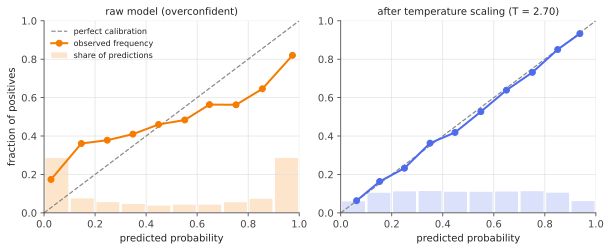

# Calibration & proper scoring rules

!!! tldr "TL;DR"
    A probabilistic forecaster is **calibrated** if, among all the times it says "70%", the event happens about 70% of the time. A **proper scoring rule**
    is a loss that is minimized in expectation by reporting your true belief. The log loss and the Brier score are proper, and the training losses of modern
    classifiers are proper scores. The Brier score decomposes exactly into *miscalibration − resolution + uncertainty*, so good forecasts must be both
    calibrated **and** sharp. Deep networks are often overconfident, and one-parameter **temperature scaling** usually fixes most of it.

## Why care?

A probability is only useful if it means what it says. A model's confidence should decide whether to abstain and defer to a human, how big a position
to take, whether a medical test result triggers treatment, or whether to trust an LLM's answer. If "90% sure" really means "right 70% of the time", every
downstream decision is miscalibrated too.

Two facts make this pressing:

- **Modern neural networks are often overconfident.** Guo et al. (2017) showed that deep image classifiers became *less* calibrated as they got bigger and better,
  even while accuracy improved.
- **LLMs are partially calibrated, and post-training can damage it.** Pretrained language models' token probabilities on multiple-choice questions are
  fairly well calibrated (Kadavath et al., 2022). The GPT-4 technical report showed that RLHF post-training noticeably degraded this.

To discuss either fact precisely, you need to know what calibration is, how to measure it, and how it relates to the loss you train with.

## Building blocks

**Setting.** A binary outcome $Y\in\{0,1\}$ and a forecast $p\in[0,1]$, typically $p = f(X)$ from a model.

**Calibration.** The forecast is calibrated if

$$
\P(Y = 1\mid p) = p\quad\text{for (almost) every value } p.
$$

Define the **calibration function** $c(p) = \P(Y=1\mid p)$. Calibration means $c(p) = p$. Plotting an estimate of $c$ against $p$ gives a **reliability diagram**.

**Calibration is not enough.** The forecaster that always predicts the base rate $\bar y = \P(Y=1)$ ("climatology") is perfectly calibrated and completely useless.
We also want **sharpness** (forecasts near $0$ or $1$) or, more precisely, **resolution**: different forecasts should pick out groups with different outcome rates.

**Scoring rules.** A scoring rule assigns a loss $\ell(p, y)$ to forecast $p$ when $y$ happens. Two classics:

$$
\text{log loss: } \ell(p,y) = -y\log p - (1-y)\log(1-p),
\qquad
\text{Brier score: } \ell(p,y) = (p - y)^2 .
$$

**Propriety.** If you believe $\P(Y=1) = q$, your expected loss from reporting $p$ is $L(p;q) = q\,\ell(p,1) + (1-q)\,\ell(p,0)$. The rule is **proper** if
$L(p;q)\ge L(q;q)$ for all $p, q$: honesty is optimal. It is **strictly proper** if equality forces $p = q$.

The absolute loss $|p - y|$ looks innocent but is *improper*: $L(p;q) = q(1-p) + (1-q)p$ is linear in $p$, so it is minimized at $p\in\{0,1\}$, and it rewards
exaggeration (Exercise 1).

## The main results

### Which losses are proper?

For the Brier score, a direct computation gives

$$
L(p;q) = q(1-p)^2 + (1-q)p^2 = (p - q)^2 + q(1-q),
$$

which is minimized uniquely at $p = q$. For the log loss,

$$
L(p;q) = \underbrace{q\log\frac qp + (1-q)\log\frac{1-q}{1-p}}_{\mathrm{KL}(q\,\|\,p)} + \underbrace{H(q)}_{\text{entropy}},
$$

and KL divergence is nonnegative with equality iff $p = q$. Both are strictly proper. There is a general recipe:

!!! theorem "Theorem (Savage / Gneiting–Raftery characterization, binary case)"
    Let $G:[0,1]\to\R$ be convex and differentiable. Then

    $$
    \ell(p, y) = -G(p) - G'(p)\,(y - p)
    $$

    is a proper scoring rule, strictly proper if $G$ is strictly convex. Conversely, every proper scoring rule has this form (with $G'$ replaced by a subgradient in general).
    The minimum expected loss is $L(q;q) = -G(q)$.

**Proof of propriety.** Taking expectations over $Y\sim\text{Bernoulli}(q)$:

$$
L(p;q) = -\big[G(p) + G'(p)(q - p)\big] \ge -G(q) = L(q;q),
$$

because the tangent line of a convex function at $p$ lies below the function at $q$. For strictly convex $G$ the inequality is strict unless $p = q$. $\square$

$G$ is a "generalized negative entropy". $G(q) = q\log q + (1-q)\log(1-q)$ gives the log loss, and $G(q) = -q(1-q)$ gives the Brier score. Strictly convex $G$ means
strictly proper. **Cross-entropy training is minimizing a strictly proper score**, so at the population optimum a flexible enough model outputs the true
conditional probabilities. Miscalibration in practice comes from finite data, overfitting, distribution shift, and post-hoc changes to the model.

### The Brier decomposition

!!! theorem "Theorem (Murphy decomposition)"
    With $c(p) = \P(Y=1\mid p)$ and $\bar y = \P(Y = 1)$,

    $$
    \E(p - Y)^2 \;=\; \underbrace{\E\big[(p - c(p))^2\big]}_{\text{miscalibration}} \;-\; \underbrace{\E\big[(c(p) - \bar y)^2\big]}_{\text{resolution}} \;+\; \underbrace{\bar y(1-\bar y)}_{\text{uncertainty}} .
    $$

**Proof.** Write $p - Y = (p - c(p)) + (c(p) - Y)$. Since $\E[Y\mid p] = c(p)$, the cross term has zero mean, so $\E(p-Y)^2 = \E(p - c)^2 + \E(c - Y)^2$. For the second term,
$\E(c - Y)^2 = \Var(Y) - \Var(c(p))$, because $c(p) = \E[Y\mid p]$ (law of total variance). Finally $\Var(Y) = \bar y(1-\bar y)$ and $\Var(c) = \E(c - \bar y)^2$. $\square$

The uncertainty term is fixed by the problem. A forecaster improves by **reducing miscalibration** and **increasing resolution**. Climatology has zero
miscalibration and zero resolution. A perfect oracle ($p = Y$) has zero miscalibration and maximal resolution $\bar y(1-\bar y)$. Gneiting's slogan summarizes
it: *maximize sharpness subject to calibration*. Log loss has an analogous decomposition, with KL divergences in place of squares.

### Measuring calibration: ECE and its pitfalls

The popular **expected calibration error** bins predictions by confidence and averages $|\text{accuracy} - \text{confidence}|$ over bins, weighted by bin size.
It is convenient but crude:

- it depends on the binning, and it is a biased estimator (positive even for a perfectly calibrated model, because of noise within each bin);
- it is **not a proper score**, so it can be gamed: predicting the base rate everywhere gets ECE ≈ 0;
- it ignores resolution entirely.

Report ECE together with a proper score (NLL or Brier), and look at the reliability diagram.

### Fixing calibration after training

- **Platt scaling:** fit a logistic regression $\sigma(az + b)$ on held-out logits $z$.
- **Temperature scaling** (multiclass): replace $\operatorname{softmax}(z)$ by $\operatorname{softmax}(z/T)$ and fit the single scalar $T$ by minimizing NLL on a validation set.
  Dividing by $T$ doesn't change the argmax, so **accuracy is unchanged**. $T > 1$ softens overconfident predictions.
- **Isotonic regression:** fit a monotone non-decreasing map $p\mapsto\tilde p$. It is very flexible but needs more data.

All three need a held-out calibration set, and they only guarantee calibration **in distribution**. Under shift, calibration degrades. That is one motivation for
the distribution-free guarantees of [conformal prediction](conformal-prediction.md).

## Examples

### An overconfident classifier and temperature scaling

We simulate data where $\P(Y=1\mid x) = \sigma(s(x))$ and a "model" that ranks examples well but outputs logits $2.5\,s(x) + \text{noise}$, which is far too confident.

```python
import numpy as np
from scipy.optimize import minimize_scalar
rng = np.random.default_rng(0)
sigmoid = lambda z: 1 / (1 + np.exp(-z))

# Ground truth: P(Y=1 | x) = sigmoid(s(x)). The "model" outputs logits 2.5·s + noise: right ranking, overconfident.
n = 20_000
s = rng.normal(0, 1.5, n)
y = rng.uniform(size=n) < sigmoid(s)
z = 2.5 * s + rng.normal(0, 1.0, n)            # model logits
val, test = slice(0, n // 2), slice(n // 2, n)

def nll(p, y):   return -np.mean(np.where(y, np.log(p), np.log(1 - p)))
def brier(p, y): return np.mean((p - y) ** 2)
def ece(p, y, bins=15):
    conf = np.where(p > 0.5, p, 1 - p); correct = (p > 0.5) == y      # top-label confidence
    idx = np.minimum((conf - 0.5) / 0.5 * bins, bins - 1).astype(int)
    return sum(np.abs(correct[idx == b].mean() - conf[idx == b].mean()) * np.mean(idx == b)
               for b in range(bins) if np.any(idx == b))

# Temperature scaling: one parameter, fitted by NLL on the validation split.
T = minimize_scalar(lambda T: nll(sigmoid(z[val] / T), y[val]), bounds=(0.05, 20), method="bounded").x
for name, p in [("raw model", sigmoid(z[test])), (f"temperature T={T:.2f}", sigmoid(z[test] / T)),
                ("true probabilities", sigmoid(s[test]))]:
    print(f"{name:22s} NLL {nll(p, y[test]):.4f}  Brier {brier(p, y[test]):.4f}  ECE {ece(p, y[test]):.4f}  "
          f"accuracy {np.mean((p > 0.5) == y[test]):.4f}")
# raw model              NLL 0.7155  Brier 0.2073  ECE 0.1449  accuracy 0.7237
# temperature T=2.70     NLL 0.5420  Brier 0.1826  ECE 0.0095  accuracy 0.7237
# true probabilities     NLL 0.5315  Brier 0.1786  ECE 0.0122  accuracy 0.7286
```

{ .fig }

Three things to notice:

1. Temperature scaling recovers almost all of the gap in NLL and Brier score, and leaves accuracy unchanged.
2. Recalibrating can't fix the *ranking*. The true probabilities still score better, because the model's noisy logits have less resolution.
3. The true probabilities have a slightly **higher ECE** than the recalibrated model. ECE is a noisy estimate and not a proper score, so it can't reliably separate
   two nearly calibrated forecasts. The proper scores rank them correctly.

## Exercises

!!! question "Exercise 1 · warm-up: an improper loss"
    Show that the absolute loss $\ell(p,y) = |p - y|$ is not proper. If your true belief is $q = 0.6$, what does it tell you to report?

    ??? success "Solution"
        $L(p;q) = q(1-p) + (1-q)p = q + p(1 - 2q)$, linear in $p$. For $q > 1/2$ the coefficient of $p$ is negative, so the minimizer is $p = 1$. With $q = 0.6$ you should report
        $1$: the absolute loss elicits the **median** of $Y$, not its probability. More generally, a loss elicits whatever functional minimizes its expectation (mean for squared
        loss, median for absolute loss, quantiles for the pinball loss used in [quantile regression](quantile-regression.md)).

!!! question "Exercise 2 · log loss and KL"
    Verify the identity $L_{\log}(p;q) = \mathrm{KL}(q\|p) + H(q)$ and deduce that the expected log loss of a model equals the entropy of the data plus the average KL from the
    true conditional distribution to the model. What is the minimum achievable expected log loss?

    ??? success "Solution"
        $-q\log p - (1-q)\log(1-p) = \big[q\log\frac qp + (1-q)\log\frac{1-q}{1-p}\big] - \big[q\log q + (1-q)\log(1-q)\big] = \mathrm{KL}(q\|p) + H(q)$.
        Averaging over $X$ with $q = q(X)$ the true conditional probability: $\E[\text{log loss}] = \E_X H(q(X)) + \E_X\mathrm{KL}(q(X)\|p(X))$. The minimum, achieved by
        $p = q$, is the conditional entropy $H(Y\mid X)$. That is the irreducible part of an LLM's cross-entropy loss that scaling laws asymptote to.

!!! question "Exercise 3 · climatology"
    For the constant forecast $p\equiv\bar y$, compute the three terms of the Brier decomposition. Then consider a forecaster that is right but timid: it outputs
    $0.6$ when $Y=1$ is certain and $0.4$ when $Y=0$ is certain, with $\bar y = 1/2$. Compute its decomposition and compare.

    ??? success "Solution"
        Climatology: $c(\bar y) = \bar y$, so miscalibration $= 0$ and resolution $= 0$. Brier $=\bar y(1-\bar y)$, the uncertainty term.

        Timid forecaster: $c(0.6) = 1$ and $c(0.4) = 0$, each with probability $1/2$. Miscalibration $= \frac12(0.6-1)^2 + \frac12(0.4-0)^2 = 0.16$. Resolution $= \frac12(1 - 0.5)^2 + \frac12(0-0.5)^2 = 0.25$.
        Uncertainty $= 0.25$. Brier $= 0.16 - 0.25 + 0.25 = 0.16$ (check: $(0.4)^2 = 0.16$ in every case ✓). It has perfect resolution but is badly calibrated. Recalibrating
        ($0.6\mapsto1$, $0.4\mapsto0$) would bring the Brier score to $0$.

!!! question "Exercise 4 · temperature and entropy"
    For logits $z\in\R^K$ and $p_T = \operatorname{softmax}(z/T)$, show that the argmax doesn't depend on $T > 0$, that $p_T\to$ one-hot on the argmax as $T\to0$, and
    $p_T\to$ uniform as $T\to\infty$. Then show that the NLL of a single example with label $k$, $-\log p_T(k)$, can be either increasing or decreasing in $T$. Why does fitting $T$ on many examples then make sense?

    ??? success "Solution"
        $p_T(j)\propto e^{z_j/T}$ is increasing in $z_j$ for any $T > 0$, so the ordering, and the argmax, is preserved. As $T\to0$ the largest $z_j/T$ dominates exponentially. As
        $T\to\infty$ all $e^{z_j/T}\to1$.

        $-\log p_T(k) = -z_k/T + \log\sum_je^{z_j/T}$. If $k$ is the argmax, sharpening ($T\downarrow$) lowers the loss, and in the limit the loss is $0$. If $k$ is not the argmax,
        sharpening pushes the loss to $+\infty$. Over a validation set, the average NLL balances the confident-and-right against the confident-and-wrong examples. The
        optimal $T$ makes the confidence match the accuracy, which is what calibration asks for.

!!! question "Exercise 5 · stretch: log loss and the Kelly gambler"
    A market offers fair odds on a binary event according to its probability $m$: one unit staked on outcome $y$ pays $1/m(y)$, where $m(1) = m$ and $m(0) = 1-m$. You bet all your
    wealth, a fraction $p$ on $Y=1$ and $1-p$ on $Y = 0$. Show that your wealth is multiplied by $p(Y)/m(Y)$, and that if $Y\sim\text{Bernoulli}(q)$, your expected log-growth is

    $$
    \E\log\frac{p(Y)}{m(Y)} = \mathrm{KL}(q\|m) - \mathrm{KL}(q\|p).
    $$

    Interpret this in terms of log scores.

    ??? success "Solution"
        The stake on the realized outcome is $p(Y)$ times your wealth and pays $1/m(Y)$ per unit, while the other stake is lost. So wealth multiplies by $p(Y)/m(Y)$. Then
        $\E\log\frac{p(Y)}{m(Y)} = \E\log\frac{q(Y)}{m(Y)} - \E\log\frac{q(Y)}{p(Y)} = \mathrm{KL}(q\|m) - \mathrm{KL}(q\|p)$.

        It equals the market's expected log loss minus yours. **Your growth rate is exactly how much better your log score is than the market's.** It is maximized by
        $p = q$ (the Kelly bet), and you lose money whenever your forecast is further from the truth, in KL, than the market's. This is the classic link between information theory,
        betting and proper scoring (Kelly 1956).

## Where it shows up

- **LLM confidence and abstention.** Calibrated token probabilities let models abstain or ask for help when unsure. Work on verbalized confidence ("I'm 80% sure")
  and on calibration after RLHF uses reliability diagrams, ECE and proper scores.
- **Selective prediction and deferral.** Production systems (content moderation, medical triage, autonomous driving) route low-confidence inputs to humans. That
  only works if confidence is calibrated.
- **Training objectives.** Cross-entropy is the log score. Label smoothing and focal loss change the effective scoring rule and affect calibration. Knowledge
  distillation transfers soft, often better-calibrated, probabilities.
- **Forecasting and prediction markets.** Weather services (where Brier introduced his score in 1950), forecasting platforms and prediction markets all reward
  forecasters with proper scores, so that honest forecasts are the best strategy.
- **Quant: position sizing.** Exercise 5 is the Kelly criterion. Miscalibrated probabilities lead to over-betting, and the drawdowns from overconfidence are
  far worse than the gains from slight underconfidence. That's one reason practitioners bet "fractional Kelly".

## Further reading

- T. Gneiting & A. Raftery, "Strictly proper scoring rules, prediction, and estimation" (*JASA*, 2007).
- C. Guo, G. Pleiss, Y. Sun & K. Weinberger, "On calibration of modern neural networks" (ICML 2017).
- S. Kadavath et al., "Language models (mostly) know what they know" (2022).
- A. H. Murphy, "A new vector partition of the probability score" (*J. Applied Meteorology*, 1973).
