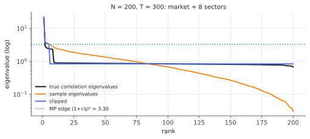

# Eigenvalue clipping & factor models

!!! tldr "TL;DR"
    The two workhorse cleaning methods for large covariance matrices turn RMT insights directly into estimators. **Eigenvalue clipping** (Laloux, Cizeau, Bouchaud & Potters, 1999) keeps the eigenvalues above the Marchenko–Pastur edge as signal and replaces all the others by their average, preserving the trace.
    **Factor models** write $\Sigma = BB^\top + D$ (a few common factors plus diagonal idiosyncratic risk), estimated by PCA, from asset characteristics or from macro series. Both say: trust the few eigen-directions that stand out from the noise, and treat everything inside the bulk as isotropic. They routinely cut the out-of-sample risk of optimized portfolios by large factors.

## Why care?

The previous notes diagnosed the problem. The sample covariance spreads noise eigenvalues over the MP bulk ([Marchenko–Pastur](marchenko-pastur.md)). Optimizers lean hardest on the deflated small eigenvalues ([Markowitz](markowitz-estimation-error.md)). Bulk eigenvectors carry no information ([Davis–Kahan](davis-kahan.md), [BBP](bbp-spiked.md)). [Ledoit–Wolf](ledoit-wolf.md) shrinks everything linearly, which helps but treats signal and noise eigenvalues alike.

Clipping and factor models act on the RMT picture directly: **separate the few signal directions from the noise bulk, keep the former, flatten the latter.** They are simple, fast, interpretable and robust, which is why some version of them sits inside essentially every commercial equity risk model (Barra/Axioma-style fundamental factor models, statistical PCA models). In ML, the same "low-rank plus diagonal" structure appears in factor analysis, probabilistic PCA, Gaussian-process approximations and preconditioners.

## Building blocks

**Work with correlations.** Volatilities are estimated well from a few weeks of data. Correlations are the hard part. So clean the correlation matrix $C$ and rescale: $\hat\Sigma = \hat D^{1/2}\hat C\hat D^{1/2}$, where $\hat D$ holds the sample variances.

**What is signal?** For a correlation matrix (unit diagonal) estimated from $T$ observations of $N$ assets, pure noise produces eigenvalues up to $\lambda_+ = (1+\sqrt q)^2$, with $q = N/T$. Eigenvalues above $\lambda_+$, adjusted for [Tracy–Widom](tracy-widom.md) fluctuations, are evidence of structure. In equity data there is typically one huge eigenvalue (the market mode, often $\approx0.2$–$0.4N$) and a handful of sector modes.

**Why flatten the bulk?** If a block of eigenvectors carries no information about $\Sigma$, meaning they are effectively random rotations within the noise subspace, then the best guess for $\Sigma$ restricted to that subspace is a **multiple of the identity**. Any structure you impose there is fitted noise. The natural multiple is the average eigenvalue, which preserves the trace (total variance).

## The main results

### Clipping

Diagonalize $C = \sum_i\lambda_iu_iu_i^\top$, and let $K = \{i : \lambda_i > \lambda_+\}$ be the signal set. Define

$$
\hat C_{\text{clip}} = \sum_{i\in K}\lambda_iu_iu_i^\top + \bar\lambda\sum_{i\notin K}u_iu_i^\top,
\qquad
\bar\lambda = \frac{1}{N - |K|}\sum_{i\notin K}\lambda_i .
$$

**Properties.** It has the same trace as $C$ ($\tr\hat C = N$), the same eigenvectors, and it is positive definite with smallest eigenvalue $\bar\lambda$, so its condition number is bounded and it is invertible even when $T < N$. In the portfolio optimizer, all bulk directions get the same "price of risk", so the optimizer stops chasing directions whose low sample variance is a noise artefact.

**Refinements.**

- The edge can account for the variance already explained by the factors: the bulk variance is $\sigma^2\approx1 - \frac1N\sum_{i\in K}\lambda_i$, so the edge is $\sigma^2(1+\sqrt q)^2$. Beware that heterogeneous idiosyncratic variances widen the bulk beyond the homogeneous MP edge. Iterating this correction can then cascade into labelling noise as factors. A conservative edge (with $\sigma^2 = 1$) plus a TW margin is safer.
- Clipping leaves signal eigenvalues **uncorrected**, but by [BBP](bbp-spiked.md) they are biased upward and their eigenvectors are tilted. De-biasing them (BBP inversion) and accounting for eigenvector overlap leads to the [RIE](rotational-invariant-estimators.md).

### Factor models

A $k$-factor model posits $r_t = Bf_t + \varepsilon_t$, with factor returns $f_t$ (covariance $F$), exposures $B\in\R^{N\times k}$, and idiosyncratic returns $\varepsilon_t$ (diagonal covariance $D$), so

$$
\Sigma = BFB^\top + D .
$$

There are three flavours:

1. **Statistical (PCA).** Take the top $k$ eigenvectors of $C$ as factors. $B = U_k\Lambda_k^{1/2}$ and $D = \diag(C - BB^\top)$. This is almost clipping, except that the idiosyncratic part is diagonal (asset-specific) rather than a constant on the noise subspace.
2. **Fundamental.** Exposures come from characteristics (industry dummies, size, value, momentum, ...), and factor returns are estimated by cross-sectional regression each period. This is the structure of commercial equity risk models.
3. **Macroeconomic.** Factors are observed series (rates, oil, FX), and exposures are estimated by time-series regression.

!!! theorem "Theorem (consistency for pervasive factors; Fan, Liao & Mincheva 2013, informally)"
    If the $k$ factor eigenvalues of $\Sigma$ grow proportionally to $N$ ("pervasive" factors) and the idiosyncratic covariance is sparse (approximately diagonal), then as $N, T\to\infty$ the PCA-estimated factor model (with thresholding of the residual covariance, i.e. **POET**) estimates $\Sigma$ and $\Sigma^{-1}$ consistently in suitable norms, even when $N\gg T$.

The intuition is that pervasive factors are far above the BBP threshold (their spike strength grows with $N$), so their eigenvectors are estimated accurately ([BBP note](bbp-spiked.md), Exercise 1). Whatever is left is idiosyncratic, sparse and estimable entry by entry.

**Computational bonus.** Woodbury's identity gives $\Sigma^{-1} = D^{-1} - D^{-1}B(F^{-1} + B^\top D^{-1}B)^{-1}B^\top D^{-1}$, which costs $O(Nk^2)$ instead of $O(N^3)$ and is essential for universes with thousands of assets (Exercise 2).

{ .fig }

## Examples

### Comparing cleaners on a simulated market

```python
import numpy as np
rng = np.random.default_rng(0)

def clip(C, q):
    """RMT clipping of a correlation matrix: keep eigenvalues above the MP edge, flatten the rest (trace kept)."""
    lam, U = np.linalg.eigh(C)
    edge = (1 + np.sqrt(q)) ** 2                               # MP edge for a correlation matrix (bulk variance <= 1)
    keep = lam > edge
    lam_c = np.where(keep, lam, lam[~keep].mean())
    return (U * lam_c) @ U.T, keep.sum()

def factor_model(C, k):
    """k principal-component factors + diagonal idiosyncratic part, unit diagonal (correlation)."""
    lam, U = np.linalg.eigh(C)
    B = U[:, -k:] * np.sqrt(lam[-k:])
    return B @ B.T + np.diag(1 - np.sum(B**2, 1))

def ledoit_wolf(X):
    n, p = X.shape; S = X.T @ X / n; m = np.trace(S) / p
    d2 = np.sum((S - m * np.eye(p)) ** 2) / p
    b2 = min(sum(np.sum((np.outer(x, x) - S) ** 2) for x in X) / p / n**2, d2)
    return (1 - b2 / d2) * S + b2 / d2 * m * np.eye(p)

def risk_ratio(C_hat, Sigma):
    w = np.linalg.solve(C_hat, np.ones(len(Sigma))); w /= w.sum()
    w0 = np.linalg.solve(Sigma, np.ones(len(Sigma))); w0 /= w0.sum()
    return (w @ Sigma @ w) / (w0 @ Sigma @ w0)

N = 200
for T in [300, 600, 2000]:
    q = N / T; res = {k: [] for k in ["sample", "Ledoit-Wolf", "clipping", "factor model"]}; nf = []
    for _ in range(20):
        beta = 1 + 0.25 * rng.standard_normal(N); sector = rng.integers(0, 8, N)
        load = np.zeros((N, 9)); load[:, 0] = 0.3 * beta; load[np.arange(N), 1 + sector] = 0.25
        Sigma = load @ load.T + np.diag(rng.uniform(0.6, 1.0, N))
        d = np.sqrt(np.diag(Sigma)); Sigma = Sigma / np.outer(d, d)              # true correlation matrix
        X = rng.multivariate_normal(np.zeros(N), Sigma, size=T)
        C = X.T @ X / T; dd = np.sqrt(np.diag(C)); C = C / np.outer(dd, dd)
        Cc, k = clip(C, q); nf.append(k)
        res["sample"].append(risk_ratio(C, Sigma)); res["Ledoit-Wolf"].append(risk_ratio(ledoit_wolf(X), Sigma))
        res["clipping"].append(risk_ratio(Cc, Sigma)); res["factor model"].append(risk_ratio(factor_model(C, k), Sigma))
    print(f"T = {T:4d} (q = {q:.2f}), factors found ≈ {np.mean(nf):.1f}:  " +
          "  ".join(f"{k} {np.mean(v):.2f}" for k, v in res.items()))
# T =  300 (q = 0.67), factors found ≈ 4.3:  sample 2.92  Ledoit-Wolf 1.43  clipping 1.22  factor model 1.22
# T =  600 (q = 0.33), factors found ≈ 6.8:  sample 1.49  Ledoit-Wolf 1.30  clipping 1.11  factor model 1.11
# T = 2000 (q = 0.10), factors found ≈ 8.0:  sample 1.10  Ledoit-Wolf 1.10  clipping 1.04  factor model 1.04
```

The numbers are realized variance of the minimum-variance portfolio relative to the true optimum. With $T = 300$ for 200 assets, the plug-in portfolio is almost **3×** riskier than necessary. Ledoit–Wolf cuts the excess to 43%, and clipping and the PCA factor model to 22%. They beat LW because they shrink only the noise eigenvalues and keep the strong factor eigenvalues intact.

The detected number of factors is also instructive. The truth has 9 (market + 8 sectors), but at $q = 0.67$ only about 4 are found. The weaker sector factors are **below the BBP threshold** at this sample size, so no method based on the sample spectrum can see them. With more data they appear one by one.

## Exercises

!!! question "Exercise 1 · warm-up: trace preservation"
    Show that clipping preserves the trace of $C$, and that $\bar\lambda < 1$ whenever $K$ is non-empty. What is the condition number of $\hat C_{\text{clip}}$?

    ??? success "Solution"
        $\tr\hat C = \sum_{i\in K}\lambda_i + (N - |K|)\bar\lambda = \sum_{i\in K}\lambda_i + \sum_{i\notin K}\lambda_i = \tr C = N$. Since the signal eigenvalues exceed $\lambda_+ > 1$ and the total is $N$, the remaining average must be below 1: $\bar\lambda = \frac{N - \sum_K\lambda_i}{N - |K|} < 1$. Condition number: $\lambda_{\max}/\bar\lambda$, bounded, versus $\lambda_{\max}/\lambda_{\min}$ for the sample matrix, which blows up as $q\to1$.

!!! question "Exercise 2 · Woodbury for factor models"
    Verify $(D + BFB^\top)^{-1} = D^{-1} - D^{-1}B(F^{-1} + B^\top D^{-1}B)^{-1}B^\top D^{-1}$, and count the cost of computing the minimum-variance portfolio $\Sigma^{-1}\mathbf 1$ for $N = 5000$ assets and $k = 50$ factors.

    ??? success "Solution"
        Multiply $(D + BFB^\top)$ by the right-hand side and simplify, using $(F^{-1} + B^\top D^{-1}B)^{-1}(F^{-1} + B^\top D^{-1}B) = I$. Cost: $D^{-1}\mathbf 1$ is $O(N)$, $B^\top D^{-1}B$ is $O(Nk^2)$, and inverting a $k\times k$ matrix is $O(k^3)$. That is about $5000\cdot2500 = 1.25\times10^7$ operations, versus $\frac13N^3\approx4\times10^{10}$ for a dense solve. That is $3000\times$ faster, and the storage is $O(Nk)$ instead of $O(N^2)$.

!!! question "Exercise 3 · what clipping does to the min-variance portfolio"
    Let $\hat C = \sum_{i\in K}\lambda_iu_iu_i^\top + \bar\lambda P_\perp$ with $P_\perp$ the projector onto the bulk. Show that $\hat C^{-1}\mathbf 1 = \sum_{i\in K}\frac{u_i^\top\mathbf 1}{\lambda_i}u_i + \frac{1}{\bar\lambda}P_\perp\mathbf 1$, and interpret: what happens to the portfolio's exposure to bulk directions compared with using the sample $C$?

    ??? success "Solution"
        $\hat C$ is diagonal in the basis $\{u_i\}$, so its inverse acts by $1/\lambda_i$ on $u_i$ ($i\in K$) and by $1/\bar\lambda$ on the bulk subspace. The bulk component of the portfolio, $\frac1{\bar\lambda}P_\perp\mathbf 1$, is proportional to the plain projection of the equal-weight portfolio: diversified, with no preference among noise directions.
        With the sample $C$, the bulk component is $\sum_{i\notin K}\frac{u_i^\top\mathbf 1}{\lambda_i}u_i$, heavily weighted toward the smallest (most deflated) sample eigenvalues. That is exactly the estimation-error maximization from the [Markowitz note](markowitz-estimation-error.md), and clipping removes it.

!!! question "Exercise 4 · factors from characteristics vs PCA"
    Give one advantage and one disadvantage of fundamental (characteristic-based) factor models relative to statistical PCA factors, in light of the BBP threshold.

    ??? success "Solution"
        Advantage: characteristics supply exposures from **outside** the return covariance, so weak factors below the BBP threshold (a small industry, a style factor with modest variance) can still be modelled. PCA can't see them at all. Fundamental factors are also interpretable and stable over time.
        Disadvantage: they impose structure that may be misspecified (missing factors leak into the "idiosyncratic" part, which is then not diagonal), and estimated exposures carry their own noise. PCA adapts to whatever strong structure is in the data. In practice the two are combined (fundamental factors plus statistical factors on the residuals).

!!! question "Exercise 5 · stretch: clipping as an oracle-optimal estimator for the bulk"
    Suppose the bulk eigenvectors $\{u_i\}_{i\notin K}$ are uniformly random within the bulk subspace $\mathcal S$ (independent of $\Sigma$ restricted to $\mathcal S$). Among estimators of the form $\sum_{i\in K}\xi_iu_iu_i^\top + \sum_{i\notin K}\xi_iu_iu_i^\top$, show that the Frobenius-optimal choice for $i\notin K$ is $\xi_i = u_i^\top\Sigma u_i$, and that its expectation is $\frac{1}{|\mathcal S|}\tr(P_{\mathcal S}\Sigma)$, the same for all $i$. Conclude that flattening the bulk is (approximately) optimal, and identify what clipping gets wrong for $i\in K$.

    ??? success "Solution"
        For fixed eigenvectors, $\|\sum_i\xi_iu_iu_i^\top - \Sigma\|_F^2$ is minimized coordinate-wise at $\xi_i = u_i^\top\Sigma u_i$ (project $\Sigma$ onto the span of $\{u_iu_i^\top\}$). If $u_i$ is uniform on the unit sphere of $\mathcal S$, then $\E[u_i^\top\Sigma u_i] = \frac{\tr(P_{\mathcal S}\Sigma)}{\dim\mathcal S}$, independent of $i$. So the oracle values are (approximately) constant on the bulk, and estimating that constant by the trace-preserving average $\bar\lambda$ is what clipping does.
        For $i\in K$, the oracle is $u_i^\top\Sigma u_i$, which by [BBP](bbp-spiked.md) (Exercise 4 there) is **smaller** than the sample $\lambda_i$, because sample spikes are inflated and their eigenvectors tilted. Clipping keeps $\lambda_i$ unchanged and so overstates the factor variances. Estimating $u_i^\top\Sigma u_i$ for **every** $i$ from the data alone is the rotationally invariant estimator of the next note.

## Where it shows up

- **Commercial and in-house risk models.** Fundamental multi-factor models (industries plus styles) and statistical PCA models are the backbone of equity risk systems. Hybrid models add statistical factors on residuals. RMT-based clipping is a standard sanity check and baseline.
- **Portfolio construction at scale.** Low-rank-plus-diagonal structure makes optimization over thousands of assets fast (Woodbury) and stable (bounded condition number).
- **ML covariance models.** Factor analysis and probabilistic PCA are Gaussian latent factor models with exactly this structure. Low-rank-plus-diagonal covariances parametrize Gaussian outputs in deep probabilistic models and approximate posteriors in Bayesian deep learning (e.g. SWAG's low-rank-plus-diagonal Gaussian).
- **Preconditioning.** Optimizers and natural-gradient approximations often keep the top eigen-directions of a curvature estimate and replace the rest by a constant, which is clipping applied to Hessians and Fishers.
- **Signal processing and genomics.** Eigenvalue thresholding at the MP edge (sometimes with TW margins) separates signal subspaces from noise in array processing, and population structure from noise in genotype data.

## Further reading

- L. Laloux, P. Cizeau, J.-P. Bouchaud & M. Potters, "Random matrix theory and financial correlations" (*Int. J. Theor. Appl. Finance*, 2000).
- J. Fan, Y. Liao & M. Mincheva, "Large covariance estimation by thresholding principal orthogonal complements" (*JRSS-B*, 2013).
- J. Bun, J.-P. Bouchaud & M. Potters, "Cleaning large correlation matrices: tools from random matrix theory" (*Physics Reports*, 2017).
- R. Grinold & R. Kahn, *Active Portfolio Management* (2nd ed., 2000), Ch. 3 (factor risk models).
