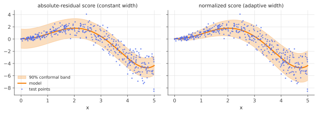

# Split conformal prediction

!!! tldr "TL;DR"
    Take **any** trained model, a held-out calibration set of $n$ points, and a "nonconformity score" such as the absolute residual. The prediction set
    $\{y : s(x, y)\le\hat q\}$, where $\hat q$ is the $\lceil(n+1)(1-\alpha)\rceil$-th smallest calibration score, contains the true label with probability at least $1-\alpha$.
    This holds **in finite samples, for any distribution and any model**, assuming only that calibration and test points are exchangeable. The guarantee is *marginal*,
    averaged over $x$ and over the calibration draw, and a good score function is what makes the sets useful.

## Why care?

Modern predictors (gradient-boosted trees, deep networks, LLMs) output point predictions or uncalibrated scores. Classical prediction intervals need a correct parametric
model. Bayesian intervals need a correct prior and likelihood. The bootstrap needs a smooth statistic and enough data. None of these come with guarantees for a
billion-parameter black box.

Conformal prediction (Vovk, Gammerman & Shafer, early 2000s) gives a guarantee that holds **no matter how wrong the model is**. A bad model gives wide sets, not invalid
ones. The method is a few lines of code on top of any predictor. It is used for medical diagnosis sets, uncertainty in protein and molecule property prediction, safe
planning in robotics, and, more recently, for making LLMs abstain or return sets of answers with guaranteed coverage.

## Building blocks

**Exchangeability.** Random variables $Z_1,\dots,Z_m$ are exchangeable if their joint law is invariant under permutations. I.i.d. implies exchangeable. Exchangeability is weaker
(sampling without replacement is exchangeable but not independent), but it rules out distribution shift and time trends.

**The rank lemma.** If $S_1,\dots,S_{n+1}$ are exchangeable and almost surely distinct, the rank of $S_{n+1}$ among them is uniform on $\{1,\dots,n+1\}$ (Exercise 2). So

$$
\P\big(S_{n+1}\text{ is among the } k \text{ smallest}\big) = \frac{k}{n+1}.
$$

All of conformal prediction is built on this.

**Nonconformity scores.** A function $s(x, y)$, built from the model, that is large when $y$ looks unusual for $x$:

- regression: $s(x,y) = |y - \hat\mu(x)|$, or the normalized $|y - \hat\mu(x)|/\hat\sigma(x)$;
- classification: $s(x,y) = 1 - \hat p_y(x)$, one minus the model's probability for label $y$;
- quantile-based scores give [conformalized quantile regression](conformalized-quantile-regression.md).

The score can come from any model, fitted in any way, **as long as it was not fitted on the calibration data**.

## The main result

**Split conformal procedure.**

1. Split the data into a training set (fit $\hat\mu$, $\hat\sigma$, the classifier, …) and a calibration set $(X_1,Y_1),\dots,(X_n,Y_n)$.
2. Compute calibration scores $S_i = s(X_i, Y_i)$.
3. Let $\hat q$ be the $k$-th smallest $S_i$, with $k = \lceil(n+1)(1-\alpha)\rceil$ (and $\hat q = +\infty$ if $k > n$).
4. For a new $x$, output $C(x) = \{y : s(x,y)\le\hat q\}$. For the absolute residual this is the interval $[\hat\mu(x) - \hat q,\ \hat\mu(x) + \hat q]$.

!!! theorem "Theorem (coverage of split conformal)"
    If $(X_1,Y_1),\dots,(X_n,Y_n),(X_{n+1},Y_{n+1})$ are exchangeable and the score function was fitted independently of them, then

    $$
    \P\big(Y_{n+1}\in C(X_{n+1})\big)\;\ge\;1 - \alpha .
    $$

    If the scores are almost surely distinct, then also $\P\big(Y_{n+1}\in C(X_{n+1})\big)\le 1 - \alpha + \frac{1}{n+1}$.

**Proof.** Since $s$ is fixed (trained on separate data), the scores $S_1,\dots,S_{n+1}$ are exchangeable. Now $Y_{n+1}\in C(X_{n+1})$ iff $S_{n+1}\le\hat q = S_{(k)}$, the $k$-th smallest
calibration score. With distinct scores, that happens iff $S_{n+1}$ is among the $k$ smallest of all $n+1$ scores. By the rank lemma this has probability
$\frac{k}{n+1}\ge 1-\alpha$, and $\frac{k}{n+1} < \frac{(n+1)(1-\alpha) + 1}{n+1} = 1 - \alpha + \frac1{n+1}$. Ties can only increase coverage. $\square$

The **$(n+1)$ in place of $n$** is the finite-sample correction: the test point is one of $n+1$ exchangeable points. For small $n$ and small $\alpha$ it matters. With $n = 10$
and $\alpha = 0.05$, $k = 11 > n$ and the honest answer is an infinite interval.

### What the guarantee does and doesn't say

**It is marginal.** The probability is over the calibration data *and* the test point. It is **not** $\P(Y\in C(x)\mid X = x)\ge1-\alpha$ for each $x$. A constant-width interval
can over-cover easy regions and under-cover hard ones while still averaging $1-\alpha$, as the example below shows. In fact, exact distribution-free conditional coverage is
impossible with finite-length sets (Vovk 2012; Lei & Wasserman 2014). What you *can* do is pick scores that adapt to difficulty (normalized residuals, CQR), or guarantee
coverage within chosen groups (Exercise 5).

**It is averaged over the calibration draw.** Conditional on a particular calibration set, the coverage $\P(Y\in C(X)\mid\text{calibration data})$ is random. With continuous scores
it follows exactly a $\text{Beta}(k,\,n+1-k)$ distribution, with mean $\frac{k}{n+1}$ and standard deviation $\approx\sqrt{\alpha(1-\alpha)/n}$ (Exercise 4). With $n = 1000$ and
$\alpha = 0.1$ the realized coverage is typically within $\pm0.01$ of $0.9$, but with $n = 50$ it can easily be $0.83$.

**It needs exchangeability.** Under distribution shift (covariate shift, time series, feedback loops) the guarantee can fail. Weighted and adaptive variants handle these cases
([conformal under shift](conformal-under-shift.md)).

**Efficiency is up to you.** Validity is automatic, and the **size** of the sets depends on how good the model and score are. A useless model gives valid but uselessly wide sets.

## Examples

### Constant vs adaptive bands

Heteroskedastic data, with noise growing with $x$, a polynomial fit, and two scores:

```python
import numpy as np
rng = np.random.default_rng(0)

def make(n):                                       # heteroskedastic: noise grows with x
    x = rng.uniform(0, 5, n)
    y = np.sin(x) * x + rng.normal(0, 0.1 + 0.3 * x, n)
    return x, y

x_tr, y_tr = make(1000); x_cal, y_cal = make(1000); x_te, y_te = make(100_000)
mu = np.poly1d(np.polyfit(x_tr, y_tr, 5))                          # any model works
sig = np.poly1d(np.polyfit(x_tr, np.abs(y_tr - mu(x_tr)), 2))      # rough scale model

def conformal_quantile(scores, alpha):
    n = len(scores)
    k = int(np.ceil((n + 1) * (1 - alpha)))                        # finite-sample correction
    return np.sort(scores)[k - 1]

alpha = 0.1
q_abs = conformal_quantile(np.abs(y_cal - mu(x_cal)), alpha)
q_nrm = conformal_quantile(np.abs(y_cal - mu(x_cal)) / sig(x_cal), alpha)
for name, lo, hi in [("absolute residual", mu(x_te) - q_abs, mu(x_te) + q_abs),
                     ("normalized residual", mu(x_te) - q_nrm * sig(x_te), mu(x_te) + q_nrm * sig(x_te))]:
    cov = (y_te >= lo) & (y_te <= hi)
    print(f"{name:20s} coverage {cov.mean():.3f}   x<1: {cov[x_te < 1].mean():.3f}   x>4: {cov[x_te > 4].mean():.3f}   "
          f"mean width {np.mean(hi - lo):.2f}")
# absolute residual    coverage 0.895   x<1: 1.000   x>4: 0.716   mean width 3.15
# normalized residual  coverage 0.905   x<1: 0.861   x>4: 0.882   mean width 2.90
```

{ .fig }

Both methods have $\approx90\%$ marginal coverage, as guaranteed. (The $0.895$ is within the Beta fluctuation for $n = 1000$.) But the constant band covers **100%** of points with
$x < 1$ and only **72%** with $x > 4$. The normalized score fixes most of this imbalance and gives *narrower* bands on average. Same guarantee, much better sets.

### Watch the calibration randomness

Each trial draws a fresh calibration set, computes $\hat q$, and records the exact test coverage. Averaged over trials, coverage is at least $1-\alpha$. Any single trial can
fall short, especially for small $n$. The orange curve is the exact $\text{Beta}(k, n+1-k)$ law.

<div class="widget" data-widget="conformal"></div>

## Exercises

!!! question "Exercise 1 · warm-up: the index $k$"
    Compute $k = \lceil(n+1)(1-\alpha)\rceil$ for $(n,\alpha) = (99, 0.1)$, $(19, 0.05)$, $(10, 0.05)$. What is the smallest $n$ for which $\alpha = 0.01$ gives a finite interval?

    ??? success "Solution"
        $(99, 0.1)$: $k = \lceil 90\rceil = 90$, the 90th of 99 scores. $(19, 0.05)$: $k = \lceil19\rceil = 19$, the **largest** score. $(10, 0.05)$: $k = \lceil10.45\rceil = 11 > 10$, so the interval is infinite.
        A finite interval needs $(n+1)(1-\alpha)\le n$, i.e. $n\ge\frac{1-\alpha}{\alpha}$. For $\alpha = 0.01$ that is $n\ge99$.

!!! question "Exercise 2 · the rank lemma"
    Prove that if $S_1,\dots,S_{n+1}$ are exchangeable and almost surely distinct, then $\P(\operatorname{rank}(S_{n+1}) = j) = \frac1{n+1}$ for every $j$.

    ??? success "Solution"
        By exchangeability, $(S_1,\dots,S_{n+1})$ has the same law as $(S_{\pi(1)},\dots,S_{\pi(n+1)})$ for any permutation $\pi$. Hence $\P(\operatorname{rank}(S_i) = j)$ is the same for every $i$.
        For fixed $j$, exactly one index has rank $j$ (distinctness), so $\sum_i\P(\operatorname{rank}(S_i) = j) = 1$, and each term equals $\frac1{n+1}$.

!!! question "Exercise 3 · classification sets"
    With score $s(x,y) = 1 - \hat p_y(x)$, show that $C(x) = \{y : \hat p_y(x)\ge1 - \hat q\}$. A model outputs $\hat p(x) = (0.55, 0.30, 0.10, 0.05)$ for a test input and $\hat q = 0.8$.
    What is the set? What would it be for $\hat p(x) = (0.15, 0.15, 0.10, 0.60)$? Can $C(x)$ be empty?

    ??? success "Solution"
        $s(x,y)\le\hat q\iff1 - \hat p_y(x)\le\hat q\iff\hat p_y(x)\ge1 - \hat q = 0.2$. First input: $\{1, 2\}$. Second input: $\{4\}$, a confident prediction gives a singleton.
        The set is empty if all $\hat p_y(x) < 1 - \hat q$, which can happen for small $\hat q$ (very accurate models). This score gives the smallest average set size among valid
        methods (Sadinle, Lei & Wasserman, 2019), but it tends to under-cover hard inputs. Adaptive Prediction Sets (APS) use cumulative probabilities to fix that.

!!! question "Exercise 4 · coverage given the calibration set"
    Assume continuous scores with CDF $F$. Show that the conditional coverage is $F(S_{(k)})$ and that it has a $\text{Beta}(k, n+1-k)$ distribution. Compute its mean and approximate standard
    deviation. How large must $n$ be for the standard deviation to be below $0.005$ at $\alpha = 0.1$?

    ??? success "Solution"
        Given the calibration data, the test score is an independent draw from $F$, so $\P(S_{n+1}\le S_{(k)}\mid\text{calib}) = F(S_{(k)})$. The values $U_i = F(S_i)$ are i.i.d. uniform, and $F(S_{(k)}) = U_{(k)}$,
        the $k$-th uniform order statistic, which is $\text{Beta}(k, n+1-k)$.

        Mean: $\frac{k}{n+1}$. Variance: $\frac{k(n+1-k)}{(n+1)^2(n+2)}\approx\frac{(1-\alpha)\alpha}{n}$. For a standard deviation of $0.005$ at $\alpha = 0.1$: $\sqrt{0.09/n}\le0.005\Rightarrow n\ge3600$.

!!! question "Exercise 5 · stretch: group-conditional (Mondrian) conformal"
    Suppose each point has a known group label $G\in\{1,\dots,m\}$ (a demographic, an asset class, a hospital). Run split conformal **separately** within each group, using that group's
    calibration points. Show that $\P(Y_{n+1}\in C(X_{n+1})\mid G_{n+1} = g)\ge1-\alpha$ for every $g$. What does this cost, and why can't you do it for "every $x$"?

    ??? success "Solution"
        Conditional on the group labels, the calibration and test points within group $g$ remain exchangeable (exchangeability is preserved by conditioning on a symmetric function
        such as the multiset of labels). Applying the theorem within group $g$, with its $n_g$ calibration points, gives coverage $\ge1-\alpha$ conditional on $G_{n+1} = g$.

        The cost is data: each group needs $n_g\ge(1-\alpha)/\alpha$ points for a finite set, and small groups get noisy, wide sets (Exercise 4 with $n = n_g$). Conditioning on "every $x$"
        means groups of size zero for continuous $X$, which is the impossibility result in another guise. Recent work (e.g. Gibbs, Cherian & Candès, 2023) interpolates, giving coverage
        over a whole *class* of groups or covariate shifts at once.

## Where it shows up

- **LLMs.** Conformal methods produce answer *sets* for multiple-choice QA with guaranteed coverage (Kumar et al., 2023), sample-and-filter procedures that stop generating once a
  correct answer is in the set with high probability (Quach et al., *Conformal Language Modeling*, 2024), and "conformal factuality" filters that drop claims until the remaining
  text is correct with probability $1-\alpha$ (Mohri & Hashimoto, 2024).
- **Conformal risk control.** Replacing "miscoverage" by any bounded monotone loss (false-negative rate in segmentation, recall in retrieval) gives the same finite-sample control
  (Angelopoulos et al., 2022). It is used for tumour segmentation masks and retrieval systems.
- **Safety in robotics and autonomy.** Conformal regions around predicted pedestrian trajectories feed into motion planners, giving probabilistic collision guarantees without trusting
  the predictor's own uncertainty.
- **Science.** Drug discovery and protein design use conformal sets to decide which candidates to synthesize, with coverage guarantees that survive model misspecification.
- **Quant risk.** Conformal intervals for returns or P&L give model-free VaR-like bands. Exchangeability fails for financial time series, though, so in practice one uses the adaptive
  versions in [conformal under shift](conformal-under-shift.md).

## Further reading

- A. Angelopoulos & S. Bates, "A gentle introduction to conformal prediction and distribution-free uncertainty quantification" (2021/2023). The best starting point, with code.
- V. Vovk, A. Gammerman & G. Shafer, *Algorithmic Learning in a Random World* (2005; 2nd ed. 2022).
- J. Lei, M. G'Sell, A. Rinaldo, R. Tibshirani & L. Wasserman, "Distribution-free predictive inference for regression" (*JASA*, 2018).
- I. Gibbs, J. Cherian & E. Candès, "Conformal prediction with conditional guarantees" (2023).
