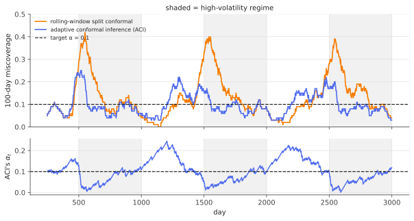

# Conformal under distribution shift

!!! tldr "TL;DR"
    Conformal guarantees rest on exchangeability, which fails when the test distribution differs from the calibration distribution. There are two main fixes.
    **Weighted conformal prediction** handles *covariate shift* (the inputs change, $P(Y\mid X)$ doesn't) by reweighting calibration scores with the likelihood ratio $w(x) = dP_{\text{test}}/dP_{\text{train}}$.
    It keeps exact validity if $w$ is known. **Adaptive conformal inference (ACI)** handles *arbitrary* drift in sequential data with a one-line feedback rule,
    $\alpha_{t+1} = \alpha_t + \gamma(\alpha - \text{err}_t)$, and guarantees that long-run miscoverage converges to $\alpha$ **for any sequence**, even an adversarial one.

## Why care?

Models are deployed into a world that changes. A credit model meets a recession, a medical model moves to a new hospital, an LLM is used on a domain it wasn't calibrated for, and a
volatility forecast goes through a crisis. A conformal band calibrated in calm markets covers 90% in calm markets and far less when volatility triples, as the example below shows.

The two fixes cover two kinds of change:

- **You can model the change.** You know (or can estimate) how the input distribution shifted. Reweight, and keep finite-sample guarantees.
- **You can't model the change, but you observe outcomes as you go.** Let the method learn from its mistakes online, and get a guarantee that holds without any probabilistic assumptions.

Quant practitioners will recognize the second as risk-model recalibration ("VaR exceptions"), now with a theorem attached.

## Building blocks

**Kinds of shift.**

- *Covariate shift:* $P_X$ changes, $P_{Y\mid X}$ is fixed. For example, the patient population changes but the disease mechanism doesn't.
- *Label shift:* $P_Y$ changes, $P_{X\mid Y}$ is fixed. For example, disease prevalence changes.
- *Concept drift / non-stationarity:* everything may change, often gradually, as in markets, user behaviour and adversarial settings.

**Likelihood ratios.** For covariate shift with densities $p_{\text{train}}(x)$ and $p_{\text{test}}(x)$, the ratio $w(x) = p_{\text{test}}(x)/p_{\text{train}}(x)$ converts expectations:
$\E_{\text{test}}[f(X)] = \E_{\text{train}}[w(X)f(X)]$. If you have unlabelled test inputs, $w$ can be estimated with a classifier that predicts "is this point from the test set?" (Exercise 4).

**Weighted quantiles.** For values $s_i$ with probability weights $p_i$ summing to 1, the $(1-\alpha)$-quantile of $\sum_ip_i\delta_{s_i}$ is the smallest $s$ with $\sum_{i: s_i\le s}p_i\ge1-\alpha$.

## The main results

### Weighted conformal prediction (covariate shift)

!!! theorem "Theorem (Tibshirani, Barber, Candès & Ramdas, 2019)"
    Suppose calibration points $(X_i,Y_i)_{i\le n}$ are i.i.d. from $P_X\times P_{Y\mid X}$, the test point is from $\tilde P_X\times P_{Y\mid X}$, and $w = d\tilde P_X/dP_X$ is known. For a test input $x$, define

    $$
    p_i(x) = \frac{w(X_i)}{\sum_{j=1}^nw(X_j) + w(x)},\qquad p_{n+1}(x) = \frac{w(x)}{\sum_{j=1}^nw(X_j) + w(x)},
    $$

    and let $\hat q(x)$ be the $(1-\alpha)$-quantile of $\sum_{i\le n}p_i(x)\delta_{S_i} + p_{n+1}(x)\delta_{+\infty}$. Then $C(x) = \{y : s(x,y)\le\hat q(x)\}$ satisfies $\P\big(Y_{n+1}\in C(X_{n+1})\big)\ge1-\alpha$.

**Idea of the proof.** The $n+1$ points are no longer exchangeable, but they are *weighted exchangeable*: their joint density is a symmetric function times $\prod_iw(x_i)$ for the test point's factor.
Conditional on the unordered set of the $n+1$ data points, the probability that the test point is the one at position $i$ is proportional to $w(X_i)$. So, conditionally, the test score is a draw from
$\sum_ip_i\delta_{S_i}$, which includes its own score. Taking the $(1-\alpha)$-quantile of that distribution, with the test point's own unknown score conservatively replaced by $+\infty$, gives coverage $\ge1-\alpha$.
With $w\equiv1$ it reduces to split conformal (Exercise 3). $\square$

Calibration points that look like the test point get more say. The method pays for this with variance: if the weights are very uneven, the effective calibration sample shrinks (Exercise 5).

### Adaptive conformal inference (arbitrary drift)

In a sequential setting, at each time $t$ we form a set $C_t$ using some miscoverage level $\alpha_t$ (with any underlying conformal method, for example rolling-window split conformal), observe $Y_t$, and record
$\text{err}_t = \mathbf 1\{Y_t\notin C_t\}$. Then update

$$
\alpha_{t+1} = \alpha_t + \gamma\,(\alpha - \text{err}_t).
$$

After a miss, $\alpha_t$ drops (wider sets). After a hit, it creeps up (narrower sets). Two conventions: $\alpha_t\le0$ means "output everything" ($\text{err}_t = 0$), and $\alpha_t\ge1$ means "output the empty set" ($\text{err}_t = 1$).

!!! theorem "Theorem (Gibbs & Candès, 2021)"
    For **any** sequence of data, with no distributional assumptions at all, the ACI iterates satisfy

    $$
    \Big|\frac1T\sum_{t=1}^T\text{err}_t - \alpha\Big|\;\le\;\frac{\max\{\alpha_1,\,1-\alpha_1\} + \gamma}{\gamma\,T}\;\xrightarrow[T\to\infty]{}\;0 .
    $$

**Proof.** *Step 1: $\alpha_t\in[-\gamma, 1+\gamma]$ for all $t$.* If $\alpha_t < 0$, the set is everything, so $\text{err}_t = 0$ and $\alpha_t$ increases by $\gamma\alpha > 0$. If $\alpha_t > 1$, the set is empty, $\text{err}_t = 1$, and $\alpha_t$ decreases by $\gamma(1-\alpha)$.
Each step moves by at most $\gamma$, so starting in $[0,1]$ the iterates can overshoot $[0,1]$ by at most $\gamma$ before being pushed back.

*Step 2: telescoping.* Summing the update, $\alpha_{T+1} - \alpha_1 = \gamma\sum_{t=1}^T(\alpha - \text{err}_t)$. Hence

$$
\Big|\frac1T\sum_t\text{err}_t - \alpha\Big| = \frac{|\alpha_{T+1} - \alpha_1|}{\gamma T}\le\frac{\max\{\alpha_1, 1-\alpha_1\} + \gamma}{\gamma T}. \qquad\square
$$

That is the whole proof. The guarantee is about the **long-run frequency** of misses, which is what a risk manager counting VaR exceptions cares about. It says nothing about coverage at any particular time, and it holds
even if the data are chosen by an adversary. The step size $\gamma$ trades adaptivity (large $\gamma$ reacts fast) against stability (small $\gamma$ gives smoother sets). Later work (for example *conformal PID control*,
Angelopoulos, Candès & Tibshirani, 2023) adds integral and derivative terms and scale-free updates.

### Fixed weights without knowing the shift

Barber, Candès, Ramdas & Tibshirani (2023) analyse conformal prediction with **fixed, data-independent weights** (for example, more weight on recent calibration points). With no assumptions, the coverage loss is
bounded by a weighted sum of total-variation distances between each calibration point's distribution and the test point's. If the recent past resembles the present, recency weighting loses little. If it doesn't, nothing can save you, but the bound says how much you lost.

## Examples

### Volatility regimes and a covariate shift

```python
import numpy as np
rng = np.random.default_rng(0)

# Daily returns whose volatility jumps between calm (1%) and stressed (3%) regimes.
T = 3000
vol = np.where((np.arange(T) // 500) % 2 == 0, 0.01, 0.03)
r = vol * rng.standard_t(5, T) / np.sqrt(5 / 3)

alpha, window, gamma = 0.1, 250, 0.01
def quantile(scores, level):                       # conformal quantile, level may leave [0, 1]
    if level >= 1: return np.inf
    if level <= 0: return 0.0
    n = len(scores); k = int(np.ceil((n + 1) * level))
    return np.inf if k > n else np.sort(scores)[k - 1]

err_split, err_aci, alpha_t = [], [], alpha
for t in range(window, T):
    past = np.abs(r[t - window:t])                 # scores: |return| (model: predict 0)
    err_split.append(abs(r[t]) > quantile(past, 1 - alpha))
    e = abs(r[t]) > quantile(past, 1 - alpha_t)
    err_aci.append(e)
    alpha_t += gamma * (alpha - e)                 # adaptive conformal inference update
err_split, err_aci = np.array(err_split), np.array(err_aci)
print(f"long-run miscoverage: rolling split {err_split.mean():.3f}   ACI {err_aci.mean():.3f}   (target {alpha})")
blocks = err_aci.reshape(-1, 250).mean(1), err_split.reshape(-1, 250).mean(1)
print("miscoverage per 250-day block, split:", np.round(blocks[1], 2))
print("miscoverage per 250-day block, ACI:  ", np.round(blocks[0], 2))

# Covariate shift: train x ~ N(0,1), test x ~ N(1.5,1); noise grows with |x|; weights w(x) = p_test(x)/p_train(x).
def draw(n, mu):
    x = rng.normal(mu, 1, n); return x, np.sin(x) + (0.2 + 0.5 * np.abs(x)) * rng.standard_normal(n)
x_cal, y_cal = draw(2000, 0.0); x_te, y_te = draw(20000, 1.5)
s_cal = np.abs(y_cal - np.sin(x_cal))              # model = true mean, score = |residual|
w = lambda x: np.exp(1.5 * x - 1.5**2 / 2)
q_plain = quantile(s_cal, 1 - alpha)
order = np.argsort(s_cal); s_sorted = s_cal[order]; w_sorted = w(x_cal)[order]
def weighted_q(x):                                 # quantile of sum_i p_i δ_{s_i} + p_{n+1} δ_∞
    p = np.append(w_sorted, w(x)); p = p / p.sum()
    cum = np.cumsum(p[:-1]); k = np.searchsorted(cum, 1 - alpha)
    return np.inf if k >= len(s_sorted) else s_sorted[k]
s_te = np.abs(y_te - np.sin(x_te))
cov_plain = np.mean(s_te <= q_plain)
cov_w = np.mean([s <= weighted_q(x) for s, x in zip(s_te[:5000], x_te[:5000])])
print(f"covariate shift: unweighted coverage {cov_plain:.3f}   weighted coverage {cov_w:.3f}   (target {1-alpha})")
# long-run miscoverage: rolling split 0.131   ACI 0.099   (target 0.1)
# miscoverage per 250-day block, split: [0.07 0.25 0.09 0.03 0.13 0.26 0.09 0.03 0.12 0.25 0.11]
# miscoverage per 250-day block, ACI:   [0.09 0.13 0.08 0.06 0.17 0.1  0.08 0.06 0.14 0.11 0.08]
# covariate shift: unweighted coverage 0.727   weighted coverage 0.893   (target 0.9)
```

{ .fig }

A rolling 250-day window adapts *eventually*, but each time volatility jumps it misses 25% of days for months. Then, when calm returns, it over-covers. ACI reacts within days: $\alpha_t$ dives right after a regime change,
widening the band, and recovers afterwards. Its long-run miss rate is $0.099$, as the theorem promises.

In the covariate-shift example, test inputs sit where the noise is larger. Unweighted conformal covers only 73%. Reweighting by the (here known) likelihood ratio restores 89%. The small shortfall is Monte Carlo noise around $\ge0.9$,
inflated by the uneven weights.

## Exercises

!!! question "Exercise 1 · warm-up: what ACI does not promise"
    Construct a sequence where ACI has long-run miscoverage exactly $\alpha$, but miscoverage is $0$ on even days and $2\alpha$ on odd days (in a suitable sense). Why can't any method based only on past errors avoid this in general?

    ??? success "Solution"
        The guarantee is about the average of $\text{err}_t$, so any pattern with the right average satisfies it. For instance, if data alternate between an easy regime (predictable) and a hard one, and the hard days are chosen adversarially after
        seeing $C_t$, ACI still matches the long-run frequency. But nothing forces the misses to spread evenly across regimes. Distinguishing regimes requires *features* that predict them. That is conditional coverage again, which needs
        modelling (e.g. regime-dependent scores or group-wise calibration as in [Mondrian conformal](conformal-prediction.md)).

!!! question "Exercise 2 · the boundedness lemma"
    Show carefully that if $\alpha_1\in[0,1]$ and $\gamma\le1$, then $\alpha_t\in[-\gamma, 1+\gamma]$ for all $t$. Where exactly do the conventions "$\alpha_t\le0\Rightarrow$ full set" and "$\alpha_t\ge1\Rightarrow$ empty set" enter?

    ??? success "Solution"
        Induction. If $\alpha_t\in[0,1]$, one step changes it by $\gamma(\alpha - \text{err}_t)\in[-\gamma(1-\alpha),\gamma\alpha]$, so $\alpha_{t+1}\in[-\gamma, 1+\gamma]$. If $\alpha_t\in[-\gamma, 0)$, the set is the full space, $\text{err}_t = 0$, and $\alpha_{t+1} = \alpha_t + \gamma\alpha > \alpha_t$,
        still $\le\gamma\alpha < 1$. If $\alpha_t\in(1, 1+\gamma]$, the set is empty, $\text{err}_t = 1$, and $\alpha_{t+1} = \alpha_t - \gamma(1-\alpha) < \alpha_t$ and $> 0$. The conventions guarantee that out-of-range levels produce the error that pushes back toward $[0,1]$.

!!! question "Exercise 3 · uniform weights"
    Show that with $w\equiv1$, the weighted quantile $\hat q(x)$ equals the split-conformal quantile (the $\lceil(n+1)(1-\alpha)\rceil$-th smallest calibration score).

    ??? success "Solution"
        All $p_i = \frac1{n+1}$. The cumulative weight up to the $k$-th smallest calibration score is $\frac{k}{n+1}$, so the smallest $k$ with $\frac{k}{n+1}\ge1-\alpha$ is $k = \lceil(n+1)(1-\alpha)\rceil$. If $k > n$, the mass $\frac1{n+1}$ at $+\infty$ is needed, and $\hat q = \infty$, as in split conformal.

!!! question "Exercise 4 · estimating the likelihood ratio with a classifier"
    Pool $n_0$ training inputs (label $L = 0$) and $n_1$ unlabelled test inputs ($L = 1$) and fit a probabilistic classifier $\hat\pi(x)\approx\P(L = 1\mid x)$. Show that $w(x) = \frac{p_1(x)}{p_0(x)} = \frac{n_0}{n_1}\cdot\frac{\pi(x)}{1 - \pi(x)}$.

    ??? success "Solution"
        In the pooled data, $\P(L=1) = \frac{n_1}{n_0+n_1}$ and the conditional densities are $p_1$, $p_0$. By Bayes, $\frac{\pi(x)}{1-\pi(x)} = \frac{\P(L=1)p_1(x)}{\P(L=0)p_0(x)} = \frac{n_1}{n_0}\cdot\frac{p_1(x)}{p_0(x)}$. Rearranging gives the claim. Validity then depends on
        how well $\hat\pi$ is calibrated (see [calibration](calibration-scoring.md)). Errors in $\hat w$ translate into coverage errors bounded by the total-variation distance between the true and estimated weighted distributions.

!!! question "Exercise 5 · stretch: the price of reweighting"
    Define the effective sample size $n_{\text{eff}} = (\sum_iw_i)^2/\sum_iw_i^2$. For a Gaussian mean shift, train $N(0,1)$ and test $N(\mu,1)$, compute $w(x)$ and show $n_{\text{eff}}\approx n\,e^{-\mu^2}$. What is $n_{\text{eff}}$ for $n = 2000$ and $\mu = 1.5$, as in the example? What does this imply for the variability of weighted conformal coverage?

    ??? success "Solution"
        $w(x) = \exp(\mu x - \mu^2/2)$. Under the training distribution, $\E w = 1$ and $\E w^2 = \E e^{2\mu X - \mu^2} = e^{2\mu^2 - \mu^2} = e^{\mu^2}$. By the law of large numbers, $n_{\text{eff}}\approx n\frac{(\E w)^2}{\E w^2} = ne^{-\mu^2}$.
        For $\mu = 1.5$: $e^{-2.25}\approx0.105$, so $n_{\text{eff}}\approx210$. The 2000 calibration points act like about 210. From the Beta law of [split conformal](conformal-prediction.md), coverage then fluctuates by about $\sqrt{0.09/210}\approx\pm0.02$, consistent with the 0.893 observed.
        Large shifts quickly make reweighting statistically useless, because the calibration set barely covers the test region.

## Where it shows up

- **Risk management and trading.** ACI-style recalibration gives VaR and prediction bands whose exception rate is guaranteed in the long run, even through crises. It is used with volatility, price and P&L forecasts. The theorem
  formalizes what risk managers do informally after a run of VaR breaches.
- **Energy and demand forecasting.** Electricity prices and loads are non-stationary with abrupt regime changes. Adaptive and recency-weighted conformal methods are common in forecasting competitions and production.
- **Domain adaptation and deployment monitoring.** Weighted conformal (with classifier-estimated weights) gives valid uncertainty when moving a model to a new site, population or time period, provided the shift is mostly in the inputs.
  The effective sample size from Exercise 5 doubles as a diagnostic for "too much shift to trust anything".
- **LLM systems.** Online conformal methods calibrate abstention thresholds as the query distribution drifts, for example when a product launches in a new market. Coverage is then tracked and corrected in production.

## Further reading

- R. Tibshirani, R. F. Barber, E. Candès & A. Ramdas, "Conformal prediction under covariate shift" (NeurIPS 2019).
- I. Gibbs & E. Candès, "Adaptive conformal inference under distribution shift" (NeurIPS 2021).
- R. F. Barber, E. Candès, A. Ramdas & R. Tibshirani, "Conformal prediction beyond exchangeability" (*Ann. Stat.*, 2023).
- A. Angelopoulos, E. Candès & R. Tibshirani, "Conformal PID control for time series prediction" (NeurIPS 2023).
