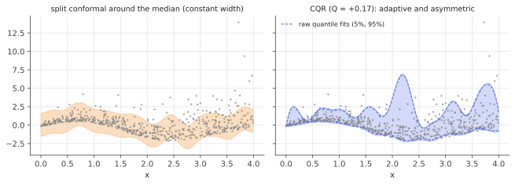

# Conformalized quantile regression

!!! tldr "TL;DR"
    Quantile regression gives intervals that adapt to heteroskedasticity and skew, but **no coverage guarantee**: overfit or misspecified quantile models routinely under-cover. Split conformal gives a guarantee, but with plain residual scores it gives constant-width intervals. **CQR** (Romano, Patterson & Candès, 2019) combines the two.
    Fit lower and upper quantile models, score calibration points by how far they fall **outside** the band, $E_i = \max\{\hat q_{lo}(X_i) - Y_i,\ Y_i - \hat q_{hi}(X_i)\}$, and widen (or shrink) the band by the conformal quantile $\hat Q$ of these scores. The result has finite-sample marginal coverage and shape-adaptive, asymmetric intervals.

## Why care?

Two earlier notes give two halves of a good interval:

- [Quantile regression](quantile-regression.md) learns where the 5% and 95% conditional quantiles are, so intervals are narrow where the data are tight and wide and asymmetric where the noise is large or skewed. But the estimated quantiles are only as good as the model. With a flexible model and limited data they overfit and the band is too narrow. With a rigid model they are biased. In both cases coverage is wrong, and you can't tell how wrong without held-out data.
- [Split conformal](conformal-prediction.md) guarantees coverage, but with the absolute-residual score every interval has the same width, over-covering easy regions and under-covering hard ones.

CQR keeps the adaptivity of quantile regression and adds the guarantee of conformal prediction, at no extra modelling cost. It is the default regression method in many conformal libraries.

## Building blocks

**Ingredients.** A quantile regression method (linear, gradient boosting, neural network with two quantile heads, quantile forests) fitted on a training split at levels $\alpha_{lo} = \alpha/2$ and $\alpha_{hi} = 1 - \alpha/2$, giving $\hat q_{lo}(x)$ and $\hat q_{hi}(x)$. A separate calibration split $(X_i,Y_i)_{i=1}^n$.

**The CQR score.** For a calibration point,

$$
E_i = \max\big\{\hat q_{lo}(X_i) - Y_i,\ \ Y_i - \hat q_{hi}(X_i)\big\}.
$$

$E_i$ is **negative** when $Y_i$ lies inside the band (its magnitude is the distance to the nearer edge) and **positive** when it lies outside (its value is the distance to the band). It is a signed distance to the band.

## The main result

**Procedure.** Let $\hat Q$ be the $\lceil(n+1)(1-\alpha)\rceil$-th smallest of $E_1,\dots,E_n$, and output

$$
C(x) = \big[\hat q_{lo}(x) - \hat Q,\ \ \hat q_{hi}(x) + \hat Q\big].
$$

!!! theorem "Theorem (Romano, Patterson & Candès, 2019)"
    If the calibration and test points are exchangeable and the quantile models were fitted on separate data, then

    $$
    \P\big(Y_{n+1}\in C(X_{n+1})\big)\ge1-\alpha,
    $$

    and, if the scores are almost surely distinct, $\P\big(Y_{n+1}\in C(X_{n+1})\big)\le1 - \alpha + \frac{1}{n+1}$.

**Proof.** $Y_{n+1}\in C(X_{n+1})\iff\hat q_{lo}(X_{n+1}) - \hat Q\le Y_{n+1}\le\hat q_{hi}(X_{n+1}) + \hat Q\iff E_{n+1}\le\hat Q$. That is split conformal with the nonconformity score $s(x,y) = \max\{\hat q_{lo}(x) - y,\ y - \hat q_{hi}(x)\}$, so the [split conformal theorem](conformal-prediction.md) applies directly. $\square$

**Reading $\hat Q$.** If the quantile models under-cover on calibration data, $\hat Q > 0$ and the band is widened by the same amount everywhere. If they over-cover, $\hat Q < 0$ and the band is *shrunk*. CQR corrects the quantile model's miscalibration while keeping its shape: the band stays wide where the model thinks the noise is large and narrow where it thinks the noise is small.

### Variants and properties

- **Asymmetric CQR.** Calibrate the two ends separately: $\hat Q_{lo}$ from $\hat q_{lo}(X_i) - Y_i$ at level $1-\alpha/2$, and $\hat Q_{hi}$ from $Y_i - \hat q_{hi}(X_i)$ at level $1-\alpha/2$. Each tail then has miscoverage $\le\alpha/2$ (Exercise 3), which is useful when the two tails matter differently (losses vs gains). It is slightly wider.
- **Asymptotic conditional coverage.** If the quantile estimates are consistent, then $\hat Q\to0$ and CQR's intervals converge to the oracle conditional intervals, so conditional coverage holds asymptotically. Finite-sample, distribution-free conditional coverage remains impossible, but CQR gets as close as the quantile model allows (Sesia & Candès, 2020).
- **Works with anything.** The quantile model can be any method, even badly tuned. Validity never depends on it, only efficiency (width) does.

{ .fig }

In the figure, the raw quantile fits (dashed) come from a flexible model trained on only 200 points. They wiggle where the data are sparse and are systematically too narrow. CQR widens them by $\hat Q = 0.17$ to reach exact coverage, while keeping their asymmetry: much more room above the data than below, matching the right-skewed noise.

## Examples

### Overfit quantiles, rescued

Skewed (exponential) noise whose scale grows with $x$, and a flexible quantile model (21 Gaussian-bump features) trained on only 200 points:

```python
import numpy as np
from scipy.optimize import linprog
rng = np.random.default_rng(0)

def qreg(F, y, tau):                                   # linear quantile regression on features F (LP)
    n, p = F.shape
    c = np.r_[np.zeros(p), tau * np.ones(n), (1 - tau) * np.ones(n)]
    res = linprog(c, A_eq=np.hstack([F, np.eye(n), -np.eye(n)]), b_eq=y,
                  bounds=[(None, None)] * p + [(0, None)] * (2 * n), method="highs")
    return res.x[:p]

def make(n):                                           # skewed, heteroskedastic noise
    x = rng.uniform(0, 4, n)
    y = np.sin(2 * x) + (0.2 + 0.4 * x) * (rng.exponential(1.0, n) - 1.0)
    return x, y
centers = np.linspace(0, 4, 20)
feats = lambda x: np.column_stack([np.ones_like(x)] + [np.exp(-(x - c) ** 2 / 0.08) for c in centers])  # flexible: 21 features

x_tr, y_tr = make(200); x_cal, y_cal = make(1000); x_te, y_te = make(50_000)   # small training set: quantiles overfit
alpha = 0.1
b_lo, b_hi = qreg(feats(x_tr), y_tr, alpha / 2), qreg(feats(x_tr), y_tr, 1 - alpha / 2)
lo = lambda x: feats(x) @ b_lo; hi = lambda x: feats(x) @ b_hi
b_mid = qreg(feats(x_tr), y_tr, 0.5); mid = lambda x: feats(x) @ b_mid

def conf_q(s):
    k = int(np.ceil((len(s) + 1) * (1 - alpha))); return np.sort(s)[k - 1]
Q_cqr = conf_q(np.maximum(lo(x_cal) - y_cal, y_cal - hi(x_cal)))        # CQR score
Q_abs = conf_q(np.abs(y_cal - mid(x_cal)))                              # split conformal around the median fit

methods = {"raw quantile regression": (lo(x_te), hi(x_te)),
           "split conformal (|resid|)": (mid(x_te) - Q_abs, mid(x_te) + Q_abs),
           "CQR": (lo(x_te) - Q_cqr, hi(x_te) + Q_cqr)}
for name, (L, U) in methods.items():
    cov = (y_te >= L) & (y_te <= U)
    print(f"{name:26s} coverage {cov.mean():.3f}   x<1: {cov[x_te < 1].mean():.3f}   x>3: {cov[x_te > 3].mean():.3f}   "
          f"mean width {np.mean(U - L):.2f}")
print(f"CQR correction Q = {Q_cqr:+.3f}")
# raw quantile regression    coverage 0.801   x<1: 0.786   x>3: 0.811   mean width 3.02
# split conformal (|resid|)  coverage 0.896   x<1: 0.992   x>3: 0.823   mean width 3.15
# CQR                        coverage 0.899   x<1: 0.925   x>3: 0.882   mean width 3.36
# CQR correction Q = +0.168
```

- The raw quantile model promises 90% but delivers **80%**, a typical symptom of overfitting.
- Split conformal fixes the average (0.896), but it does so by covering 99% of the easy region ($x < 1$) and only 82% of the hard one ($x > 3$).
- CQR reaches 0.899 overall **and** keeps coverage roughly balanced across regions (0.93 and 0.88), because it inherits the quantile model's sense of where the noise is large.

## Exercises

!!! question "Exercise 1 · warm-up: what $E_i$ measures"
    For a band $[\hat q_{lo}, \hat q_{hi}] = [1, 3]$ at some $x$, compute $E$ for $y = 2$, $y = 2.8$, $y = 0$ and $y = 5$. What is the smallest $\hat Q$ for which all four points would be covered?

    ??? success "Solution"
        $y = 2$: $\max(1-2, 2-3) = -1$. $y = 2.8$: $\max(-1.8, -0.2) = -0.2$. $y = 0$: $\max(1, -3) = 1$. $y = 5$: $\max(-4, 2) = 2$. The band $[1 - \hat Q, 3 + \hat Q]$ covers $y$ iff $E\le\hat Q$, so $\hat Q = 2$ is needed. Negative $E$ means "inside, with room to spare".

!!! question "Exercise 2 · negative corrections"
    Explain how $\hat Q < 0$ can happen and what it means. Can the CQR interval become empty?

    ??? success "Solution"
        If the quantile models are too wide (over-covering), most calibration points lie well inside the band, so most $E_i$ are negative and their $(1-\alpha)$ quantile can be negative. The band shrinks to the width needed. It becomes empty at $x$ if $\hat q_{hi}(x) - \hat q_{lo}(x) < -2\hat Q$, which can happen where the model's band is
        very narrow. Coverage is still guaranteed on average, so an empty interval is a valid (if odd) output. In practice it signals a poorly fitted quantile model in that region.

!!! question "Exercise 3 · asymmetric calibration"
    With $\hat Q_{lo}$ = the $\lceil(n+1)(1-\alpha/2)\rceil$-th smallest of $\hat q_{lo}(X_i) - Y_i$ and $\hat Q_{hi}$ defined similarly for $Y_i - \hat q_{hi}(X_i)$, show that $\P(Y < \hat q_{lo}(X) - \hat Q_{lo})\le\alpha/2$ and $\P(Y > \hat q_{hi}(X) + \hat Q_{hi})\le\alpha/2$, hence coverage $\ge1-\alpha$.

    ??? success "Solution"
        Each is split conformal with a one-sided score at level $\alpha/2$. For example, $Y < \hat q_{lo}(X) - \hat Q_{lo}\iff\hat q_{lo}(X) - Y > \hat Q_{lo}$, which has probability $\le\alpha/2$ by the conformal theorem. A union bound over the two tails gives miscoverage $\le\alpha$. Each tail is controlled separately, at the cost of
        slightly wider intervals than symmetric CQR, which only controls the total.

!!! question "Exercise 4 · homoskedastic case"
    Suppose $Y = \mu(X) + \varepsilon$ with $\varepsilon$ independent of $X$, and the quantile models are perfect: $\hat q_{lo} = \mu + z_{\alpha/2}$ and $\hat q_{hi} = \mu + z_{1-\alpha/2}$ (noise quantiles $z$). What is $\hat Q$ (approximately), and how do CQR and split conformal with the absolute residual compare?

    ??? success "Solution"
        Exactly a fraction $\alpha$ of points falls outside the true quantile band, so the $(1-\alpha)$-quantile of $E$ is about 0, i.e. $\hat Q\approx0$. CQR returns the oracle interval $[\mu + z_{\alpha/2}, \mu + z_{1-\alpha/2}]$. Split conformal with $|Y - \mu|$ gives $\mu\pm q_{1-\alpha}(|\varepsilon|)$, symmetric. For symmetric noise the two coincide.
        For skewed noise CQR is shorter, because it places the interval asymmetrically (for exponential noise, much of the symmetric interval is wasted on the short tail).

!!! question "Exercise 5 · stretch: consistency implies conditional coverage"
    Assume $\sup_x|\hat q_{lo}(x) - q_{\alpha/2}(x)|\to0$ and similarly for $\hat q_{hi}$, as the training size grows, and that the conditional distributions have continuous densities. Argue that $\hat Q\to0$ and that $\P(Y\in C(X)\mid X = x)\to1-\alpha$ for (almost) every $x$.

    ??? success "Solution"
        Under the oracle quantiles, $E = \max(q_{\alpha/2}(X) - Y,\ Y - q_{1-\alpha/2}(X))$ satisfies $\P(E > 0\mid X) = \alpha$ for every $X$. Its distribution is continuous at 0, so its marginal $(1-\alpha)$-quantile is exactly 0. With uniformly consistent estimates, the estimated scores converge uniformly to the oracle ones, so the calibration quantile $\hat Q\to0$ (also using $n\to\infty$).
        Then $C(x)\to[q_{\alpha/2}(x), q_{1-\alpha/2}(x)]$, whose conditional coverage is exactly $1-\alpha$ at every $x$. In finite samples, the marginal guarantee holds regardless, and the conditional behaviour is only as good as the quantile estimates.

## Where it shows up

- **Production prediction intervals.** CQR with gradient-boosted quantile models (LightGBM/XGBoost quantile objectives) is a common recipe for ETAs, demand forecasts, house prices and insurance claim sizes. Libraries such as MAPIE implement it.
- **Medicine and science.** Length-of-stay prediction, dose–response and property prediction in chemistry use CQR to report patient- or molecule-specific intervals that are valid on average and adaptive to difficulty.
- **Finance.** Return or P&L intervals that widen in volatile regimes and are skewed in the direction of crash risk come from quantile models. CQR calibrates them, and [adaptive conformal inference](conformal-under-shift.md) keeps them calibrated as regimes change.
- **Deep learning.** Two-headed (or multi-quantile) neural networks trained with pinball loss, then conformalized, are a simple and strong uncertainty baseline compared with ensembles or Bayesian approximations for regression tasks.

## Further reading

- Y. Romano, E. Patterson & E. Candès, "Conformalized quantile regression" (NeurIPS 2019).
- M. Sesia & E. Candès, "A comparison of some conformal quantile regression methods" (*Stat*, 2020).
- A. Angelopoulos & S. Bates, "A gentle introduction to conformal prediction" (2021/2023), §2.2.
