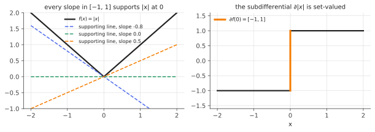

# Convexity, subgradients & KKT conditions

!!! tldr "TL;DR"
    For convex problems, local optimality is global optimality. Nonsmooth convex functions ($|x|$, the hinge loss, the $\ell_1$ norm) have **subgradients**, sets of slopes of supporting lines, and $x^*$ is optimal iff $0\in\partial f(x^*)$. Constrained convex problems are solved by the
    **KKT conditions**: stationarity of the Lagrangian, primal and dual feasibility, and complementary slackness. Under a mild condition (Slater), they are both necessary and sufficient. These conditions explain why the LASSO gives exact zeros, why only support vectors matter in an SVM, and why long-only portfolios hold few assets.

## Why care?

Several of the most useful estimators in this curriculum have **kinks**: the [LASSO](lasso.md)'s $\ell_1$ penalty, [quantile regression](quantile-regression.md)'s pinball loss, [robust regression](robust-m-estimators.md)'s Huber loss, the SVM's hinge. Many practical problems also have **constraints**: portfolios that can't short, budgets, probability simplices,
fairness constraints, KL trust regions. Gradients alone can't characterize their solutions, and "set the derivative to zero" fails.

Convex analysis gives the right replacements. They do more than certify optimality. They also explain the **structure** of solutions (sparsity, active sets, support vectors), give **dual** problems that are often easier and come with optimality certificates, and underpin the algorithms ([proximal methods](proximal-operators.md), coordinate descent, interior point) used everywhere in ML and quant.

## Building blocks

**Convexity.** A set $C$ is convex if it contains the segment between any two of its points. A function $f$ is convex if $f(\theta x + (1-\theta)y)\le\theta f(x) + (1-\theta)f(y)$. For differentiable $f$ this is equivalent to the **first-order condition**

$$
f(y)\ge f(x) + \nabla f(x)^\top(y - x)\quad\text{for all } x, y,
$$

so the tangent plane is a global under-estimator. Hence $\nabla f(x^*) = 0$ implies a **global** minimum. For twice-differentiable $f$, convexity means $\nabla^2f\succeq0$.

**Strong convexity and smoothness.** $f$ is $\mu$-strongly convex if $f(y)\ge f(x) + \nabla f(x)^\top(y-x) + \frac\mu2\|y-x\|^2$, and $L$-smooth if $\nabla f$ is $L$-Lipschitz. The ratio $\kappa = L/\mu$ (the condition number) governs how fast gradient methods converge: linearly at rate $1 - 1/\kappa$ per step for gradient descent.

**Subgradients.** $g$ is a subgradient of convex $f$ at $x$ if $f(y)\ge f(x) + g^\top(y-x)$ for all $y$. The set of them is the **subdifferential** $\partial f(x)$. It equals $\{\nabla f(x)\}$ where $f$ is differentiable.

- $\partial|x| = \{\operatorname{sign}(x)\}$ for $x\neq0$, and $[-1,1]$ at $0$.
- $\partial\|x\|_1 = \{g : g_i = \operatorname{sign}(x_i)\text{ if }x_i\neq0,\ g_i\in[-1,1]\text{ if }x_i = 0\}$.
- Hinge $\max(0, 1-t)$: $\{-1\}$ for $t < 1$, $[-1, 0]$ at $t = 1$, and $\{0\}$ for $t > 1$.
- Calculus: $\partial(f + g) = \partial f + \partial g$ (under mild conditions), and $\partial f(Ax + b) = A^\top\partial f$.

{ .fig }

## The main results

### Unconstrained: zero must be a subgradient

!!! theorem "Theorem (Fermat's rule for convex functions)"
    For convex $f$, $x^*$ is a global minimizer if and only if $0\in\partial f(x^*)$.

**Proof.** $0\in\partial f(x^*)$ means $f(y)\ge f(x^*) + 0^\top(y - x^*)$ for all $y$, which is the definition of a global minimum. $\square$

**Example: soft-thresholding.** Minimize $\frac12(x - y)^2 + \lambda|x|$. The condition $0\in x - y + \lambda\partial|x|$ gives: if $x > 0$, then $x = y - \lambda$ (valid when $y > \lambda$); if $x < 0$, then $x = y + \lambda$ (valid when $y < -\lambda$); if $x = 0$, then $y\in\lambda[-1,1]$. So

$$
x^* = \operatorname{sign}(y)\,(|y| - \lambda)_+ .
$$

Every $|y|\le\lambda$ maps to **exactly zero**, because the kink at zero has a whole interval of slopes that can absorb the data's pull. This is the mechanism behind the LASSO's sparsity.

### Constrained: the KKT conditions

Consider

$$
\min_x f(x)\quad\text{s.t.}\quad g_i(x)\le0\ (i = 1..m),\quad Ax = b,
$$

with $f, g_i$ convex. The **Lagrangian** is $\mathcal L(x,\lambda,\nu) = f(x) + \sum_i\lambda_ig_i(x) + \nu^\top(Ax - b)$ with multipliers $\lambda\ge0$.

!!! theorem "Theorem (Karush–Kuhn–Tucker)"
    Suppose Slater's condition holds (some strictly feasible point exists: $g_i(\tilde x) < 0$ for all $i$, $A\tilde x = b$). Then $x^*$ is optimal if and only if there exist $\lambda^*\ge0$ and $\nu^*$ such that

    1. **Stationarity:** $0\in\partial f(x^*) + \sum_i\lambda_i^*\partial g_i(x^*) + A^\top\nu^*$;
    2. **Primal feasibility:** $g_i(x^*)\le0$ and $Ax^* = b$;
    3. **Dual feasibility:** $\lambda^*\ge0$;
    4. **Complementary slackness:** $\lambda_i^*g_i(x^*) = 0$ for every $i$.

**Proof of sufficiency.** By stationarity, $x^*$ minimizes the convex function $x\mapsto\mathcal L(x,\lambda^*,\nu^*)$. For any feasible $x$:
$f(x)\ge f(x) + \sum_i\lambda_i^*g_i(x) + \nu^{*\top}(Ax - b) = \mathcal L(x,\lambda^*,\nu^*)\ge\mathcal L(x^*,\lambda^*,\nu^*) = f(x^*)$. The last equality uses complementary slackness and feasibility. Necessity uses strong duality, which is where Slater's condition comes in. $\square$

**Complementary slackness** is the structural insight: each constraint is either **active** ($g_i = 0$, and its multiplier can be positive) or **inactive** ($g_i < 0$, and its multiplier is zero). The multiplier $\lambda_i^*$ is the **shadow price**, the rate at which the optimal value would improve if constraint $i$ were relaxed.

### Duality

The **dual function** $q(\lambda,\nu) = \inf_x\mathcal L(x,\lambda,\nu)$ is concave and always gives a lower bound: $q(\lambda,\nu)\le f(x)$ for feasible $x$ and $\lambda\ge0$ (**weak duality**). Under Slater's condition the best lower bound is tight, $\max_{\lambda\ge0,\nu}q = \min f$ (**strong duality**). Dual problems are
often easier (the SVM dual is a QP over a box, the optimal transport dual is unconstrained in potentials), and any feasible primal–dual pair certifies how far from optimal you are (the **duality gap**).

## Examples

### The long-only minimum-variance portfolio

Minimize $\frac12w^\top\Sigma w$ subject to $\sum_iw_i = 1$, $w_i\ge0$. The KKT conditions read, with $\gamma$ the budget multiplier and $\lambda_i\ge0$ for $w_i\ge0$:

$$
(\Sigma w)_i = \gamma + \lambda_i,\qquad\lambda_iw_i = 0
\quad\Longrightarrow\quad
(\Sigma w)_i = \gamma\ \text{if } w_i > 0,\qquad(\Sigma w)_i\ge\gamma\ \text{if } w_i = 0 .
$$

Every **held** asset has the same marginal contribution to risk, and every **excluded** asset would add at least that much. Here is a check on an estimated covariance:

```python
import numpy as np
rng = np.random.default_rng(0)

def project_simplex(v):
    """Euclidean projection onto {w >= 0, sum w = 1} (sort-based algorithm; itself derived from KKT)."""
    u = np.sort(v)[::-1]; css = np.cumsum(u)
    k = np.nonzero(u * np.arange(1, len(v) + 1) > css - 1)[0][-1]
    tau = (css[k] - 1) / (k + 1)
    return np.maximum(v - tau, 0)

def long_only_min_var(S, iters=20000):
    w = np.ones(len(S)) / len(S); step = 1 / np.linalg.eigvalsh(S)[-1]
    for _ in range(iters):
        w = project_simplex(w - step * S @ w)      # projected gradient descent on w'Sw / 2
    return w

# True covariance: one market factor + idiosyncratic risk; estimated from T = 60 observations of N = 50 assets.
N, T = 50, 60
beta = 1 + 0.3 * rng.standard_normal(N)
Sigma = 0.04 * np.outer(beta, beta) + np.diag(rng.uniform(0.01, 0.09, N))
X = rng.multivariate_normal(np.zeros(N), Sigma, size=T)
S = X.T @ X / T

w = long_only_min_var(S)
mr = S @ w                                         # marginal risk contributions (gradient of w'Sw / 2)
held = w > 1e-8
gamma = mr[held].mean()
print(f"assets held: {held.sum()} of {N}")
print(f"KKT stationarity on held assets: max |(Sw)_i - γ| = {np.max(np.abs(mr[held] - gamma)):.2e}")
print(f"KKT dual feasibility on excluded assets: min (Sw)_i - γ = {np.min(mr[~held] - gamma):.2e}  (must be >= 0)")

w_unc = np.linalg.solve(S, np.ones(N)); w_unc /= w_unc.sum()
w_true = np.linalg.solve(Sigma, np.ones(N)); w_true /= w_true.sum()
risk = lambda v: np.sqrt(v @ Sigma @ v)
print(f"true (out-of-sample) volatility: unconstrained {risk(w_unc):.4f}   long-only {risk(w):.4f}   optimum {risk(w_true):.4f}")
# assets held: 8 of 50
# KKT stationarity on held assets: max |(Sw)_i - γ| = 4.16e-17
# KKT dual feasibility on excluded assets: min (Sw)_i - γ = 1.18e-03  (must be >= 0)
# true (out-of-sample) volatility: unconstrained 0.2628   long-only 0.1317   optimum 0.0921
```

The KKT conditions hold to machine precision, which certifies optimality. The solution is **sparse**: 8 of 50 assets, the non-negativity constraints acting like an $\ell_1$ penalty. With $T = 60$ observations for $N = 50$ assets ($q = 0.83$, so badly estimated), the unconstrained optimizer's true volatility is 0.26, while the constrained portfolio
halves it. Jagannathan & Ma (2003) showed that the long-only constraint is equivalent to shrinking the covariance matrix: the multipliers $\lambda_i$ adjust exactly the entries the optimizer was overexploiting.

## Exercises

!!! question "Exercise 1 · warm-up: subdifferentials"
    Compute $\partial f(x)$ for $f(x) = \max(x_1, x_2)$ at $x = (1,1)$ and at $x = (2,1)$, and for the hinge $h(t) = \max(0, 1-t)$ at $t = 1$.

    ??? success "Solution"
        For a max of differentiable functions, $\partial f(x)$ is the convex hull of the gradients of the active pieces. At $(1,1)$ both are active, so $\partial f = \{(\theta, 1-\theta) : \theta\in[0,1]\}$. At $(2,1)$ only $x_1$ is active: $\{(1,0)\}$. Hinge at $t = 1$: the pieces $0$ (slope 0) and $1 - t$ (slope $-1$) are both active, so $\partial h(1) = [-1, 0]$.

!!! question "Exercise 2 · projection onto the $\ell_2$ ball"
    Solve $\min_x\frac12\|x - y\|^2$ s.t. $\|x\|^2\le r^2$ using KKT. Interpret the multiplier.

    ??? success "Solution"
        Lagrangian: $\frac12\|x - y\|^2 + \frac\lambda2(\|x\|^2 - r^2)$. Stationarity gives $x = \frac{y}{1+\lambda}$. If $\|y\|\le r$, take $\lambda = 0$ and $x = y$ (inactive constraint). Otherwise the constraint is active: $\|x\| = r$ gives $1 + \lambda = \|y\|/r$ and $x = ry/\|y\|$.
        The multiplier $\lambda = \|y\|/r - 1$ measures how hard the constraint pushes back. The same computation is the projection step in gradient clipping and in trust-region methods.

!!! question "Exercise 3 · water-filling"
    Allocate a unit budget across channels to maximize $\sum_i\log(\alpha_i + x_i)$ subject to $x\ge0$, $\sum_ix_i = 1$ ($\alpha_i > 0$ are noise levels). Show that the solution is $x_i = (\mu - \alpha_i)_+$ for a "water level" $\mu$ chosen so that the budget is used.

    ??? success "Solution"
        Minimize $-\sum\log(\alpha_i + x_i)$. KKT: $-\frac{1}{\alpha_i + x_i} - \lambda_i + \nu = 0$, $\lambda_i\ge0$, $\lambda_ix_i = 0$. If $x_i > 0$, then $\lambda_i = 0$ and $x_i = \frac1\nu - \alpha_i$. If $x_i = 0$, then $\nu\ge\frac{1}{\alpha_i}$, i.e. $\alpha_i\ge\frac1\nu$. With $\mu = 1/\nu$: $x_i = (\mu - \alpha_i)_+$.
        Pour water over terrain of heights $\alpha_i$: deep spots (low noise) get filled and high spots get nothing. This is the capacity-optimal power allocation in communications, and structurally the same "threshold and keep the rest" as soft-thresholding.

!!! question "Exercise 4 · when KKT fails without Slater"
    Minimize $f(x) = x$ subject to $g(x) = x^2\le0$. Find the optimum and show that no KKT multiplier exists. Which hypothesis fails?

    ??? success "Solution"
        The feasible set is $\{0\}$, so $x^* = 0$. Stationarity would need $1 + \lambda\cdot2x^* = 1 = 0$, which is impossible. Slater fails: no point has $x^2 < 0$. Without a constraint qualification, an optimum need not satisfy KKT. For convex problems Slater is easy to check and almost always holds in practice.

!!! question "Exercise 5 · stretch: SVM dual and support vectors"
    The hard-margin SVM solves $\min_{w,b}\frac12\|w\|^2$ s.t. $y_i(w^\top x_i + b)\ge1$. Derive the dual $\max_{\alpha\ge0}\sum_i\alpha_i - \frac12\sum_{i,j}\alpha_i\alpha_jy_iy_jx_i^\top x_j$ s.t. $\sum_i\alpha_iy_i = 0$, and use complementary slackness to show that $w = \sum_i\alpha_iy_ix_i$ depends only on points **on the margin**.

    ??? success "Solution"
        $\mathcal L = \frac12\|w\|^2 - \sum_i\alpha_i[y_i(w^\top x_i + b) - 1]$. Stationarity in $w$: $w = \sum\alpha_iy_ix_i$. In $b$: $\sum\alpha_iy_i = 0$. Substituting gives the dual objective. Complementary slackness: $\alpha_i[y_i(w^\top x_i + b) - 1] = 0$, so $\alpha_i > 0$ only for points with $y_i(w^\top x_i + b) = 1$, exactly on the margin. These are the **support vectors**. All other points could be deleted without changing the solution.
        The dual depends on the data only through inner products $x_i^\top x_j$, which is the kernel trick. Soft margins add the box constraint $\alpha_i\le C$.

## Where it shows up

- **Sparse estimation.** LASSO's optimality conditions $X^\top(y - X\hat\beta) = \lambda s$, $s\in\partial\|\hat\beta\|_1$, drive the LARS path ([LARS](lars.md)), the "strong rules" that let glmnet discard most features cheaply, and the analysis of when the LASSO selects the right variables.
- **Constrained portfolio optimization.** Long-only, leverage, turnover and sector constraints all enter through KKT multipliers. Shadow prices tell the PM what each constraint costs in risk, and the sparsity of solutions comes from complementary slackness.
- **Support vector machines and kernels.** Complementary slackness gives the sparse dual solution, and the dual's reliance on inner products gives the kernel trick.
- **Constrained RL and alignment.** Constrained MDPs (safety constraints) and KL-constrained policy optimization are solved through Lagrangian relaxations. PPO-Lagrangian adapts the multiplier like a shadow price, and the closed-form RLHF optimum $\pi\propto\pi_{\text{ref}}e^{r/\beta}$ is a KKT solution.
- **Optimization algorithms.** Projected gradient, proximal methods, ADMM and interior-point methods are all built around these conditions, and duality gaps are the standard stopping criterion.

## Further reading

- S. Boyd & L. Vandenberghe, *Convex Optimization* (2004), Ch. 3–5. The classic, free online.
- R. T. Rockafellar, *Convex Analysis* (1970).
- R. Jagannathan & T. Ma, "Risk reduction in large portfolios: why imposing the wrong constraints helps" (*J. Finance*, 2003).
- Y. Nesterov, *Lectures on Convex Optimization* (2nd ed., 2018).
