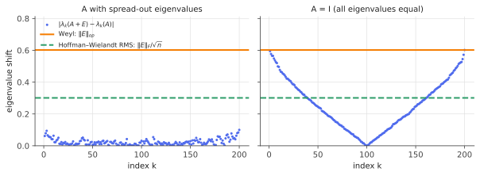

# Eigenvalue variational principles: Courant–Fischer & Weyl

!!! tldr "TL;DR"
    Each eigenvalue of a symmetric matrix is the answer to an optimization problem over subspaces
    (Courant–Fischer). As a direct consequence, eigenvalues are **1-Lipschitz** in the operator norm:
    perturbing $A$ by $E$ moves every eigenvalue by at most $\|E\|_{op}$ (Weyl). Eigenvalues are stable
    under perturbation, but eigenvectors may not be.

## Why care?

Every matrix you meet in data science is a noisy version of the one you want:

- a **sample covariance** $\hat\Sigma = \Sigma + (\text{estimation noise})$;
- a **mini-batch Hessian** $H_B = H + (\text{sampling noise})$;
- a **quantized weight matrix** $W_q = W + (\text{rounding noise})$;
- a **graph Laplacian** with a few edges missing.

You care about spectral quantities: the variance captured by the top principal components, the sharpness
$\lambda_{\max}(H)$ of a loss landscape, the singular values that survive compression. So the basic question is:

> If I perturb a symmetric matrix by $E$, how far can its eigenvalues move?

Weyl's inequality gives a clean and sharp answer: never more than $\|E\|_{op}$. Much of random matrix theory can be
read as refining this worst-case statement for *random* $E$, where much more precise answers are possible.
Weyl's bound is the baseline those refinements improve on.

## Building blocks

Throughout, $A \in \R^{n\times n}$ is symmetric, with eigenvalues in **decreasing** order
$\lambda_1(A) \ge \lambda_2(A) \ge \dots \ge \lambda_n(A)$ and orthonormal eigenvectors $u_1,\dots,u_n$.
By the spectral theorem, $A = \sum_k \lambda_k u_k u_k^\top$.

**The Rayleigh quotient.** For $x \neq 0$,

$$
R_A(x) = \frac{x^\top A x}{x^\top x}.
$$

Write $x = \sum_k c_k u_k$. Then

$$
R_A(x) = \frac{\sum_k \lambda_k c_k^2}{\sum_k c_k^2},
$$

a **weighted average of the eigenvalues** with weights $c_k^2 / \sum_j c_j^2$. Two facts follow immediately:

$$
\lambda_1(A) = \max_{x\neq 0} R_A(x), \qquad \lambda_n(A) = \min_{x\neq 0} R_A(x),
$$

with the max attained at $x = u_1$ and the min at $x = u_n$. A weighted average of numbers can't exceed the largest one.

**The operator norm.** For symmetric $E$, $\|E\|_{op} = \max_{\|x\|=1}\|Ex\| = \max_k |\lambda_k(E)|$. By the
facts above, $-\|E\|_{op} \le R_E(x) \le \|E\|_{op}$ for all $x$.

What about the *middle* eigenvalues? $\lambda_2$ is the max of $R_A$ over vectors orthogonal to $u_1$. That
description depends on the eigenvector $u_1$, which itself moves when $A$ is perturbed. We need a characterization that
doesn't mention eigenvectors at all.

## The main result

!!! theorem "Theorem (Courant–Fischer min-max)"
    For $k = 1,\dots,n$,

    $$
    \lambda_k(A) \;=\; \max_{\substack{S \subseteq \R^n \\ \dim S = k}} \; \min_{\substack{x\in S\\ x\neq 0}} R_A(x)
    \;=\; \min_{\substack{S \subseteq \R^n \\ \dim S = n-k+1}} \; \max_{\substack{x\in S\\ x\neq 0}} R_A(x).
    $$

**Intuition.** You choose a $k$-dimensional subspace, and an adversary picks the worst (smallest-$R_A$) direction in it.
Your best move is $\operatorname{span}(u_1,\dots,u_k)$, where the worst direction is $u_k$. Any other subspace of the
same dimension must contain some direction with a component outside the top $k$ eigenvectors, and the adversary exploits it.

**Proof (first equality).**

*($\ge$)* Take $S = \operatorname{span}(u_1,\dots,u_k)$. For $x = \sum_{j\le k} c_j u_j \in S$, $R_A(x)$ is a weighted average of
$\lambda_1,\dots,\lambda_k$, so it is $\ge \lambda_k$. Hence $\min_{x\in S} R_A(x) \ge \lambda_k$.

*($\le$)* Let $S$ be any subspace of dimension $k$, and let $T = \operatorname{span}(u_k,\dots,u_n)$, of dimension $n-k+1$.
Since $\dim S + \dim T = n+1 > n$, the two subspaces intersect in a nonzero vector $x$. Being in $T$, $R_A(x)$ is a weighted
average of $\lambda_k,\dots,\lambda_n$, so $R_A(x) \le \lambda_k$. Hence $\min_{x\in S} R_A(x) \le \lambda_k$ for *every* $S$. $\square$

The second equality is the first one applied to $-A$. That dimension-counting step ($\dim S + \dim T > n \Rightarrow S\cap T \ne \{0\}$)
is the only real idea, and it powers everything below.

### Weyl's inequality

!!! theorem "Theorem (Weyl)"
    For symmetric $A, E$ and every $k$:

    $$
    \lambda_k(A) + \lambda_n(E) \;\le\; \lambda_k(A+E) \;\le\; \lambda_k(A) + \lambda_1(E).
    $$

    In particular $\;|\lambda_k(A+E) - \lambda_k(A)| \le \|E\|_{op}$.

**Proof.** For every $x \ne 0$, $R_{A+E}(x) = R_A(x) + R_E(x)$ and $\lambda_n(E) \le R_E(x) \le \lambda_1(E)$. So

$$
R_A(x) + \lambda_n(E) \le R_{A+E}(x) \le R_A(x) + \lambda_1(E) \quad\text{for all } x.
$$

The map $f \mapsto \max_{\dim S = k}\min_{x\in S} f(x)$ is **monotone** (if $f\le g$ pointwise, the max-min of $f$ is at most that of $g$)
and commutes with adding a constant. Applying it to the three functions above gives the claim via Courant–Fischer. $\square$

Two useful corollaries:

- **Monotonicity.** If $E \succeq 0$, then $\lambda_k(A+E) \ge \lambda_k(A)$ for all $k$. Adding a PSD matrix pushes every eigenvalue up.
- **The general form.** $\lambda_{i+j-1}(A+B) \le \lambda_i(A) + \lambda_j(B)$ whenever $i+j-1\le n$. (Proof: intersect three subspaces, the
  bottom $n-i+1$ eigenvectors of $A$, the bottom $n-j+1$ of $B$, and the top $i+j-1$ of $A+B$. Their dimensions sum to $2n+1$, so they
  share a nonzero vector. Evaluate the three Rayleigh quotients on it.)

### Two relatives worth knowing

!!! info "Cauchy interlacing"
    If $B$ is the $m\times m$ top-left block of $A$ (or more generally $B = P^\top A P$ with $P^\top P = I_m$), then

    $$
    \lambda_k(A) \;\ge\; \lambda_k(B) \;\ge\; \lambda_{k+n-m}(A), \qquad k=1,\dots,m.
    $$

    For $m = n-1$ the eigenvalues of $B$ sit in the gaps between consecutive eigenvalues of $A$. Proof: restrict
    Courant–Fischer to subspaces of $\operatorname{range}(P)$.

!!! info "Hoffman–Wielandt"
    Weyl controls the *worst* eigenvalue. The Frobenius norm controls them *all at once*:

    $$
    \sum_{k=1}^n \big(\lambda_k(A+E) - \lambda_k(A)\big)^2 \;\le\; \|E\|_F^2 .
    $$

    Dividing by $n$: the root-mean-square shift is at most $\|E\|_F/\sqrt n$.

## Examples

### Eigenvalues move a little, eigenvectors can swing wildly

Take

$$
A = \begin{pmatrix}\delta & 0\\ 0 & -\delta\end{pmatrix}, \qquad
E = \begin{pmatrix}0 & \varepsilon\\ \varepsilon & 0\end{pmatrix}, \qquad \|E\|_{op} = \varepsilon.
$$

The eigenvalues of $A+E$ are $\pm\sqrt{\delta^2 + \varepsilon^2}$. They moved by $\sqrt{\delta^2+\varepsilon^2} - \delta \le \varepsilon$,
as Weyl promises. When $\varepsilon \ll \delta$ they barely moved at all: about $\varepsilon^2/(2\delta)$, second order.

The eigenvectors behave very differently. The top eigenvector of $A+E$ makes an angle $\theta$ with $e_1$ where
$\tan 2\theta = \varepsilon/\delta$. If $\delta \ll \varepsilon$, the eigenvector rotates by nearly $45°$ even though the matrix
changed by only $\varepsilon$. **Eigenvector stability depends on the gap** between eigenvalues, the subject of
[Davis–Kahan](davis-kahan.md).

### Random noise vs. the worst case

The bound $\|E\|_{op}$ is attained by $E = \varepsilon I$, which shifts everything equally. What happens for *random* noise?
Below, $E$ is a $200\times 200$ symmetric Gaussian matrix with $\|E\|_{op}\approx 0.6$.

```python
import numpy as np
rng = np.random.default_rng(0)
n, sigma = 200, 0.3
G = rng.standard_normal((n, n))
E = sigma * (G + G.T) / np.sqrt(2 * n)          # ||E||_op ≈ 2·sigma = 0.6

for A in [np.diag(np.linspace(-3, 3, n)), np.eye(n)]:
    shift = np.abs(np.linalg.eigvalsh(A + E) - np.linalg.eigvalsh(A))
    print(f"max shift {shift.max():.3f}   bound {np.linalg.norm(E, 2):.3f}")
# max shift 0.100   bound 0.602     <- spread-out spectrum
# max shift 0.602   bound 0.602     <- degenerate spectrum: Weyl is tight
```

{ .fig }

When the spectrum of $A$ is spread out, each eigenvalue moves by roughly $u_k^\top E u_k$ (first-order perturbation theory),
which is tiny because a random matrix's diagonal entries in any fixed basis are small. When $A = I$, every direction is an eigenvector,
so $A+E$ has the eigenvalues $1 + \lambda_k(E)$. The shifts trace out the full spectrum of $E$ and Weyl is tight. *Random matrix theory
is the study of the spectrum of $E$ in the right panel.*

### Watch it happen

Below are the six eigenvalues of $A + tE$ as $t$ grows, with $\|E\|_{op} = 1$. Every curve stays inside its Weyl cone.
Notice also that the sorted curves never touch: they approach and then repel. These *avoided crossings* are the subject of
the [Gaussian ensembles](gaussian-ensembles.md) note.

<div class="widget" data-widget="weyl"></div>

## Exercises

!!! question "Exercise 1 · warm-up"
    Show that $\lambda_1(A+B) \le \lambda_1(A) + \lambda_1(B)$ and $\lambda_n(A+B) \ge \lambda_n(A) + \lambda_n(B)$
    using only the Rayleigh quotient (no Courant–Fischer).

    ??? success "Solution"
        $\lambda_1(A+B) = \max_x [R_A(x) + R_B(x)] \le \max_x R_A(x) + \max_x R_B(x) = \lambda_1(A) + \lambda_1(B)$.
        The max of a sum is at most the sum of the maxes. The second claim is the same with min. So $\lambda_1$ is
        convex and $\lambda_n$ is concave as functions of the matrix. More generally, the sum of the top $k$ eigenvalues
        is convex (Ky Fan).

!!! question "Exercise 2 · first-order shift"
    Let $A = \begin{pmatrix}2&1\\1&2\end{pmatrix}$ and $E = \begin{pmatrix}0.1&0\\0&-0.1\end{pmatrix}$.
    (a) What does Weyl guarantee? (b) Compute the eigenvalues of $A+E$ exactly. (c) Explain the gap between (a) and (b)
    using the first-order perturbation formula $\lambda_k(A+E) \approx \lambda_k(A) + u_k^\top E u_k$.

    ??? success "Solution"
        (a) $\lambda(A) = \{3, 1\}$ and $\|E\|_{op}=0.1$, so each eigenvalue moves by at most $0.1$.

        (b) $A+E$ has trace $4$ and determinant $2.1\cdot 1.9 - 1 = 2.99$, so $\lambda = 2 \pm \sqrt{4 - 2.99} = 2\pm\sqrt{1.01}$,
        i.e. $3.00499$ and $0.99501$. They moved by only $\approx 0.005$.

        (c) $u_1 = (1,1)/\sqrt2$ and $u_2 = (1,-1)/\sqrt2$, so $u_k^\top E u_k = (0.1 - 0.1)/2 = 0$. The first-order shift vanishes.
        What's left is second order: $\frac{(u_1^\top E u_2)^2}{\lambda_1 - \lambda_2} = \frac{0.1^2}{2} = 0.005$. ✓
        Weyl is a worst case over all $E$ with the same norm. This $E$ is "orthogonal" to the eigenbasis.

!!! question "Exercise 3 · rank-one updates interlace"
    Let $B = A + vv^\top$. Show that $\lambda_{k+1}(A) \le \lambda_{k+1}(B) \le \lambda_k(A)$ for $k = 1,\dots,n-1$.
    (So adding a rank-one "spike" can move each eigenvalue at most one slot up. This is the starting point of the
    [BBP transition](bbp-spiked.md).)

    ??? success "Solution"
        Lower bound: $vv^\top \succeq 0$, so by monotonicity $\lambda_{k+1}(B) \ge \lambda_{k+1}(A)$.

        Upper bound: use the general Weyl inequality $\lambda_{i+j-1}(A + vv^\top) \le \lambda_i(A) + \lambda_j(vv^\top)$
        with $i = k$, $j = 2$: $\lambda_{k+1}(B) \le \lambda_k(A) + \lambda_2(vv^\top) = \lambda_k(A) + 0$, since a rank-one PSD matrix
        has only one nonzero eigenvalue.

!!! question "Exercise 4 · singular values"
    For a rectangular $M \in \R^{m\times p}$, consider the symmetric dilation $\mathcal D(M) = \begin{pmatrix}0 & M\\ M^\top & 0\end{pmatrix}$.
    Show that its eigenvalues are $\pm\sigma_1(M),\dots,\pm\sigma_r(M)$ together with zeros ($r = \min(m,p)$). Deduce that
    $|\sigma_k(M+E) - \sigma_k(M)| \le \|E\|_{op}$.

    ??? success "Solution"
        If $M = \sum_i \sigma_i a_i b_i^\top$ (SVD), then $\mathcal D(M)\begin{pmatrix}a_i\\ \pm b_i\end{pmatrix} = \pm\sigma_i\begin{pmatrix}a_i\\ \pm b_i\end{pmatrix}$.
        That gives $2r$ eigenpairs. The remaining $m+p-2r$ eigenvalues are $0$ (vectors $(a,0)$ with $a\perp$ range of $M$, or $(0,b)$ with $b\in\ker M$).
        So the top $r$ eigenvalues of $\mathcal D(M)$ are exactly $\sigma_1 \ge\dots\ge\sigma_r$. Now $\mathcal D$ is linear, $\mathcal D(M+E) = \mathcal D(M) + \mathcal D(E)$,
        and $\|\mathcal D(E)\|_{op} = \sigma_1(E) = \|E\|_{op}$. Apply Weyl to the $k$-th eigenvalue for $k \le r$.

!!! question "Exercise 5 · stretch: the lower half of Eckart–Young"
    Show that for any matrix $B$ of rank at most $k$, $\|M - B\|_{op} \ge \sigma_{k+1}(M)$. (Truncating the SVD achieves this bound,
    so the truncated SVD is the best rank-$k$ approximation in operator norm.)

    ??? success "Solution"
        Via the dilation of Exercise 4, the general Weyl inequality holds for singular values:
        $\sigma_{i+j-1}(X+Y) \le \sigma_i(X) + \sigma_j(Y)$. Take $X = M - B$, $Y = B$, $i = 1$, $j = k+1$:

        $$\sigma_{k+1}(M) \le \sigma_1(M-B) + \sigma_{k+1}(B) = \|M-B\|_{op} + 0.$$

        Alternative direct proof: $\ker B$ has dimension $\ge p - k$ and $\operatorname{span}(b_1,\dots,b_{k+1})$ has dimension $k+1$.
        They intersect in a unit vector $x$, and $\|(M-B)x\| = \|Mx\| \ge \sigma_{k+1}$.

## Where it shows up

- **Robustness of PCA and spectral methods.** The variance explained by the top-$k$ components of a sample covariance is within
  $k\|\hat\Sigma - \Sigma\|_{op}$ of the truth. Bounding $\|\hat\Sigma - \Sigma\|_{op}$ is exactly what [matrix Bernstein](matrix-bernstein.md) is for.
- **Signal vs. noise in RMT.** If data = low-rank signal + noise, Weyl says a signal eigenvalue survives roughly when it exceeds
  the noise level $\|E\|_{op}$. The [BBP transition](bbp-spiked.md) sharpens this to an exact threshold. This threshold is the logic
  behind [eigenvalue clipping](clipping-factor-models.md) in quant covariance cleaning.
- **Compression of neural networks.** Low-rank factorization of LLM weight matrices (and LoRA adapters) relies on Eckart–Young
  (Exercise 5) for the best approximation, and on Weyl (Exercise 4) to show that quantization noise of norm $\varepsilon$ moves every
  singular value by at most $\varepsilon$.
- **Sharpness estimates in deep learning.** "Edge of stability" analyses track $\lambda_{\max}$ of the loss Hessian, usually estimated
  from a mini-batch. Weyl turns a bound on $\|H_B - H\|_{op}$ into a bound on the error of the sharpness estimate.

## Further reading

- R. Bhatia, *Matrix Analysis*, Ch. III. The definitive treatment of variational principles and perturbation inequalities.
- T. Tao, *Topics in Random Matrix Theory*, §1.3. A compact tour of Weyl, interlacing and Hoffman–Wielandt with RMT in mind.
- G. W. Stewart & J.-G. Sun, *Matrix Perturbation Theory*.
