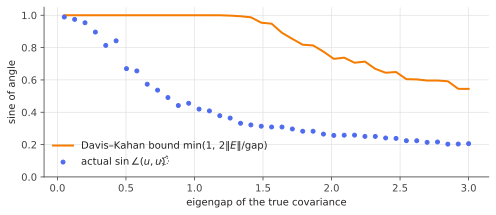

# Davis–Kahan: how eigenvectors move

!!! tldr "TL;DR"
    Eigenvalues move by at most $\|E\|$ under a perturbation ([Weyl](courant-fischer-weyl.md)), but eigenvectors can rotate a lot. How much depends on the **eigengap**:
    the Davis–Kahan $\sin\Theta$ theorem says the angle between an eigenvector (or eigenspace) and its perturbed version satisfies
    $\sin\theta\lesssim\|E\|/\text{gap}$. Well-separated eigenvectors are stable, and nearly degenerate ones are not. This one inequality underlies the
    guarantees for PCA, spectral clustering, community detection and low-rank matrix estimation.

## Why care?

In the Weyl note we saw a $2\times2$ example where a tiny perturbation rotated an eigenvector by $45°$. That happened because the two eigenvalues were nearly equal.
In practice we often care more about **eigenvectors** than eigenvalues:

- **PCA** gives principal *directions*: loadings, eigenportfolios, the axes of an embedding.
- **Spectral clustering** and community detection read cluster labels off the signs of eigenvector entries.
- **Recommender systems** and matrix completion estimate a low-rank *subspace*.
- **Representation similarity** between neural networks (for example after fine-tuning) is often measured by angles between top singular subspaces.

Each time, the question is how close the estimated eigenvector is to the true one, given that the estimated matrix differs from the true one by $E$.
Davis and Kahan (1970) answered it, and with modern concentration inequalities for $\|E\|$ their theorem became the workhorse of high-dimensional spectral methods.

## Building blocks

**Angles between vectors and subspaces.** For unit vectors $u, \hat u$, $\sin\angle(u,\hat u) = \sqrt{1 - (u^\top\hat u)^2} = \|(I - \hat u\hat u^\top)u\|$. The sign of an eigenvector
is arbitrary, so only $|u^\top\hat u|$ matters.

For $r$-dimensional subspaces with orthonormal bases $U, \hat U\in\R^{N\times r}$, the **principal angles** $\theta_1,\dots,\theta_r$ are defined by $\cos\theta_i = \sigma_i(U^\top\hat U)$.
Writing $\hat U_\perp$ for an orthonormal basis of the complement of $\hat U$,

$$
\|\sin\Theta(U,\hat U)\| = \|\hat U_\perp^\top U\|
$$

in operator or Frobenius norm. This measures how much of $U$ sticks out of $\hat U$.

**First-order perturbation theory.** If $A$ has simple eigenvalues $\lambda_j$ with eigenvectors $u_j$, then for small $E$

$$
\hat u_k\approx u_k + \sum_{j\neq k}\frac{u_j^\top E\,u_k}{\lambda_k - \lambda_j}\,u_j .
$$

The eigenvector tilts toward $u_j$ by the coupling $u_j^\top Eu_k$ **divided by the gap** $\lambda_k - \lambda_j$ (Exercise 3). Small gaps mean large rotations. Davis–Kahan turns this
heuristic into a non-asymptotic inequality that holds for any size of $E$.

## The main result

### One eigenvector: a three-line proof

!!! theorem "Theorem (Davis–Kahan, single eigenvector)"
    Let $A$ and $\hat A = A + E$ be symmetric. Let $Au = \lambda u$ with $\|u\| = 1$, and let $\hat u$ be a unit eigenvector of $\hat A$. Suppose all the *other* eigenvalues
    $\hat\lambda_j$ of $\hat A$ satisfy $|\hat\lambda_j - \lambda|\ge\delta > 0$. Then

    $$
    \sin\angle(u,\hat u)\;\le\;\frac{\|E\,u\|}{\delta}\;\le\;\frac{\|E\|}{\delta}.
    $$

**Proof.** Let $\hat U_\perp$ hold the other eigenvectors of $\hat A$, with eigenvalues $\hat\Lambda_\perp$, so $\hat U_\perp^\top\hat A = \hat\Lambda_\perp\hat U_\perp^\top$. Since $(A - \lambda)u = 0$,

$$
(\hat A - \lambda)u = Eu
\quad\Longrightarrow\quad
(\hat\Lambda_\perp - \lambda I)\,\hat U_\perp^\top u = \hat U_\perp^\top Eu .
$$

The diagonal matrix $\hat\Lambda_\perp - \lambda I$ has all entries of absolute value at least $\delta$, so $\|\hat U_\perp^\top u\|\le\|\hat U_\perp^\top Eu\|/\delta\le\|Eu\|/\delta$. Finally
$\sin\angle(u,\hat u) = \|\hat U_\perp^\top u\|$. $\square$

The hypothesis mixes the two matrices: an eigenvalue of $A$ and the eigenvalues of $\hat A$. A version in terms of $A$ alone (Yu, Wang & Samworth, 2015) is often more convenient.

!!! theorem "Corollary (gap in $A$ only)"
    If $\lambda_k$ is a simple eigenvalue of $A$ with gap $g = \min_{j\neq k}|\lambda_j - \lambda_k|$, and $u_k,\hat u_k$ are the $k$-th eigenvectors of $A$ and $A+E$, then

    $$
    \sin\angle(u_k,\hat u_k)\le\frac{2\|E\|}{g}.
    $$

**Proof.** If $\|E\|\ge g/2$ the right side is $\ge1$ and there is nothing to prove. Otherwise, by Weyl, $|\hat\lambda_j - \lambda_j|\le\|E\|$ for every $j$, so for $j\neq k$,
$|\hat\lambda_j - \lambda_k|\ge g - \|E\|\ge g/2$. Apply the theorem with $\delta = g/2$. $\square$

### Subspaces

The same argument works for a block of eigenvectors. If $U$ spans the eigenvectors of $A$ for eigenvalues in an interval $[a,b]$ and the eigenvalues of $\hat A$ for $\hat U_\perp$
lie outside $[a - \delta, b+\delta]$, then

$$
\|\sin\Theta(U,\hat U)\|_F\le\frac{\|EU\|_F}{\delta}.
$$

*Proof for the Frobenius norm.* As above, $\hat\Lambda_\perp X - X\Lambda = R$ with $X = \hat U_\perp^\top U$ and $R = \hat U_\perp^\top EU$. Entrywise $X_{ij}(\hat\lambda_i - \lambda_j) = R_{ij}$ with
$|\hat\lambda_i - \lambda_j|\ge\delta$, so $\|X\|_F\le\|R\|_F/\delta$. The operator-norm version requires a slightly more delicate Sylvester-equation argument, but the conclusion is the same.

!!! warning "Why the gap is unavoidable"
    If $\lambda_k$ is degenerate ($g = 0$), its eigenvector isn't even well defined: any vector in the eigenspace works, and an arbitrarily small $E$ selects one arbitrarily
    (Exercise 4). Davis–Kahan says this instability fades out continuously as the gap opens. **Eigenvectors inside a bulk of nearly equal eigenvalues are essentially meaningless.**
    Only isolated eigenvectors can be estimated. That is why quants trust the market-mode eigenportfolio but not the 37th one.

## Examples

### PCA of a spiked covariance

True covariance $\Sigma = I + \theta uu^\top$ (one "factor" of strength $\theta$, so the gap is $\theta$). How close is the top sample eigenvector to $u$?

```python
import numpy as np
rng = np.random.default_rng(0)
p, theta = 50, 4.0
u = np.ones(p) / np.sqrt(p)                       # true top eigenvector
Sigma = np.eye(p) + theta * np.outer(u, u)        # eigenvalues 1 + theta, 1, ..., 1  -> gap = theta
L = np.linalg.cholesky(Sigma)

for n in [100, 1000, 10000, 100000]:
    X = L @ rng.standard_normal((p, n))
    S = X @ X.T / n
    w, V = np.linalg.eigh(S)
    uhat = V[:, -1]
    sin_true = np.sqrt(1 - (uhat @ u) ** 2)
    E = np.linalg.norm(S - Sigma, 2)
    print(f"n = {n:6d}   sin(angle) = {sin_true:.4f}   Davis-Kahan bound 2||E||/gap = {2 * E / theta:.4f}   "
          f"sharper ||E u|| / delta_hat = {np.linalg.norm((S - Sigma) @ u) / (1 + theta - w[-2]):.4f}")
# n =    100   sin(angle) = 0.3357   Davis-Kahan bound 2||E||/gap = 0.9124   sharper ||E u|| / delta_hat = 0.6099
# n =   1000   sin(angle) = 0.1249   Davis-Kahan bound 2||E||/gap = 0.3763   sharper ||E u|| / delta_hat = 0.1742
# n =  10000   sin(angle) = 0.0371   Davis-Kahan bound 2||E||/gap = 0.0865   sharper ||E u|| / delta_hat = 0.0386
# n = 100000   sin(angle) = 0.0098   Davis-Kahan bound 2||E||/gap = 0.0277   sharper ||E u|| / delta_hat = 0.0114
```

Both bounds hold and decay at the right rate, $\sin\theta\propto n^{-1/2}$, because $\|S - \Sigma\|_{op}\approx C\sqrt{p/n}$ (see [matrix Bernstein](matrix-bernstein.md)).
The two-sided version is loose by a factor of 2–3. The sharper form, which uses $\|Eu\|$ instead of $\|E\|$, is nearly tight for large $n$.

Now fix $n = 500$ ($p/n = 0.1$) and vary the gap:

{ .fig }

As the gap shrinks the estimated eigenvector becomes useless: $\sin\theta\to1$, meaning it is essentially orthogonal to the truth. Davis–Kahan captures the trend but not the precise shape.
For a spiked covariance in the proportional regime, the [BBP transition](bbp-spiked.md) gives the **exact** limiting overlap, including a sharp threshold at
$\theta = \sqrt{p/n}\approx0.32$ below which the sample eigenvector carries no information at all.

## Exercises

!!! question "Exercise 1 · warm-up: two formulas for the sine"
    For unit vectors, show $\|(I - \hat u\hat u^\top)u\|^2 = 1 - (u^\top\hat u)^2$. For an orthonormal basis $[\hat u, \hat U_\perp]$ of $\R^N$, show this also equals $\|\hat U_\perp^\top u\|^2$.

    ??? success "Solution"
        $\|(I - \hat u\hat u^\top)u\|^2 = u^\top(I - \hat u\hat u^\top)u = 1 - (u^\top\hat u)^2$, since $I - \hat u\hat u^\top$ is an orthogonal projector. Expanding $u$ in the basis:
        $1 = \|u\|^2 = (\hat u^\top u)^2 + \|\hat U_\perp^\top u\|^2$, which gives the second formula.

!!! question "Exercise 2 · the 2×2 example, revisited"
    For $A = \operatorname{diag}(\delta,-\delta)$ and $E = \begin{pmatrix}0&\varepsilon\\\varepsilon&0\end{pmatrix}$ (gap $g = 2\delta$, $\|E\| = \varepsilon$), compute $\sin\angle(e_1,\hat u_1)$ exactly and compare
    with $2\|E\|/g$ and with the single-eigenvector bound $\|Ee_1\|/\delta_{\hat A}$, where $\delta_{\hat A} = |\delta + \sqrt{\delta^2+\varepsilon^2}|$.

    ??? success "Solution"
        The top eigenvector makes angle $\theta$ with $\tan2\theta = \varepsilon/\delta$, so $\sin\theta = \sqrt{\frac12\big(1 - \frac{\delta}{\sqrt{\delta^2+\varepsilon^2}}\big)}$. For $\varepsilon\ll\delta$ this is
        $\approx\frac{\varepsilon}{2\delta} = \frac{\varepsilon}{g}$.

        The corollary gives $2\varepsilon/g$, off by a factor of 2. The single-eigenvector bound gives $\frac{\varepsilon}{\delta+\sqrt{\delta^2+\varepsilon^2}}\approx\frac{\varepsilon}{2\delta}$, essentially tight.
        For $\varepsilon\gg\delta$, $\theta\to45°$: the eigenvector is determined by $E$, not $A$.

!!! question "Exercise 3 · first-order perturbation"
    Write $\hat A = A + tE$ with eigenpair $(\lambda_k(t), u_k(t))$, $\|u_k(t)\| = 1$. Differentiate $\hat Au_k = \lambda_ku_k$ at $t = 0$ and show that $\lambda_k'(0) = u_k^\top Eu_k$ and
    $u_k'(0) = \sum_{j\neq k}\frac{u_j^\top Eu_k}{\lambda_k - \lambda_j}u_j$, assuming simple eigenvalues.

    ??? success "Solution"
        Differentiating: $Eu_k + Au_k' = \lambda_k'u_k + \lambda_ku_k'$. Take the inner product with $u_k$, using $u_k^\top A = \lambda_ku_k^\top$: $u_k^\top Eu_k = \lambda_k'$.
        With $u_j$ for $j\neq k$: $u_j^\top Eu_k + \lambda_ju_j^\top u_k' = \lambda_ku_j^\top u_k'$, so $u_j^\top u_k' = \frac{u_j^\top Eu_k}{\lambda_k - \lambda_j}$. Normalization gives $u_k^\top u_k' = 0$. Expanding $u_k'$
        in the eigenbasis gives the formula. The eigenvalue derivative is the Rayleigh quotient of $E$, consistent with Weyl. The eigenvector derivative has the gap in the denominator.

!!! question "Exercise 4 · degenerate eigenvalues"
    Let $A = I_2$ and $E = \varepsilon\begin{pmatrix}\cos2\phi & \sin2\phi\\ \sin2\phi & -\cos2\phi\end{pmatrix}$. Find the top eigenvector of $A + E$ for any $\varepsilon > 0$. What does this say about estimating
    eigenvectors of a matrix with repeated eigenvalues?

    ??? success "Solution"
        $E = \varepsilon R$, where $R$ is a reflection with eigenvalues $\pm1$ and top eigenvector $(\cos\phi, \sin\phi)$. Since $A + E = I + \varepsilon R$ has the same eigenvectors as $R$, the top
        eigenvector is $(\cos\phi,\sin\phi)$ for every $\varepsilon > 0$, however small. By choosing $\phi$, an arbitrarily small perturbation can put the top eigenvector anywhere.
        With a repeated eigenvalue, only the eigen*space* is stable (here it is all of $\R^2$, trivially). Individual eigenvectors are determined by the noise.

!!! question "Exercise 5 · stretch: spectral clustering guarantee"
    Let $u\in\R^n$ have entries $\pm1/\sqrt n$ (cluster labels), and let $\hat u$ be an estimate with $\hat u^\top u\ge0$ and $\sin\angle(u,\hat u)\le s$. Show that the number of indices with
    $\operatorname{sign}(\hat u_i)\neq\operatorname{sign}(u_i)$ is at most $2ns^2$. Combine with Davis–Kahan to bound the fraction of misclassified nodes in terms of $\|E\|/g$.

    ??? success "Solution"
        If the signs differ at $i$, then $|\hat u_i - u_i|\ge|u_i| = 1/\sqrt n$. So $\#\text{mistakes}\cdot\frac1n\le\|\hat u - u\|^2 = 2 - 2u^\top\hat u$. With $c = u^\top\hat u\in[0,1]$:
        $2 - 2c\le2(1-c)(1+c) = 2(1 - c^2) = 2s^2$. So $\#\text{mistakes}\le2ns^2$.

        With the corollary, the misclassified fraction is at most $2\big(\frac{2\|E\|}{g}\big)^2 = \frac{8\|E\|^2}{g^2}$. In a two-community stochastic block model with $n$ nodes and edge probabilities $a$ (within) and
        $b$ (between), the relevant gap is $\approx n(a-b)/2$ and the noise is $\|A - \E A\|\lesssim\sqrt{na}$ (by matrix concentration). The misclassified fraction is then $\lesssim\frac{a}{n(a-b)^2}$, which
        vanishes once $n(a-b)^2/a\to\infty$.

## Where it shows up

- **PCA and eigenportfolios.** Factor loadings estimated from returns are trustworthy only for eigenvalues separated from the rest. The market mode is very stable,
  sector modes less so, and the bulk not at all. Davis–Kahan, together with $\|\hat\Sigma - \Sigma\|\approx\|\Sigma\|\sqrt{p/n}$, gives the required sample size.
- **Spectral clustering and community detection.** Exercise 5 is the template for consistency proofs of spectral clustering on graphs and in stochastic block models.
- **Low-rank estimation.** Matrix completion (recommender systems), phase retrieval and synchronization problems use Davis–Kahan (or its singular-vector cousin, Wedin's
  theorem) to show that a spectral initialization lands close to the truth, after which gradient methods refine it.
- **Comparing neural representations.** Principal angles between the top singular subspaces of weight matrices or activations are used to measure what fine-tuning
  changes. LoRA analyses, for example, study how much of the update lies in the top singular directions of the pre-trained weights. Davis–Kahan explains why only
  well-separated directions can be compared meaningfully.
- **Stability of embeddings.** Spectral embeddings (Laplacian eigenmaps, classical MDS) are stable to noise only up to rotations within eigenspaces of nearly equal eigenvalues.

## Further reading

- C. Davis & W. M. Kahan, "The rotation of eigenvectors by a perturbation. III" (*SIAM J. Numer. Anal.*, 1970).
- Y. Yu, T. Wang & R. J. Samworth, "A useful variant of the Davis–Kahan theorem for statisticians" (*Biometrika*, 2015).
- R. Vershynin, *High-Dimensional Probability*, §4.5 (application to spectral clustering).
- Y. Chen, Y. Chi, J. Fan & C. Ma, "Spectral methods for data science: a statistical perspective" (*Found. Trends ML*, 2021).
