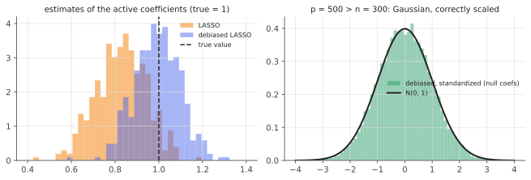

# The debiased LASSO

!!! tldr "TL;DR"
    The LASSO is good at estimation but bad for inference: its coefficients are shrunk toward zero and their distribution has point masses at 0, so there are no valid confidence intervals. The **debiased (desparsified) LASSO** adds back a one-step correction,
    
    $$\hat b = \hat\beta + \frac1nM X^\top(y - X\hat\beta),$$
    
    where $M$ is an approximate inverse of $\hat\Sigma = X^\top X/n$ (e.g. from nodewise LASSO regressions). If the truth is sparse enough ($s\log p\ll\sqrt n$), each coordinate is approximately Gaussian, $\sqrt n(\hat b_j - \beta_j)\approx N\big(0,\ \sigma^2(M\hat\Sigma M^\top)_{jj}\big)$, which gives confidence intervals and $p$-values for **every** coefficient even when $p > n$.

## Why care?

High-dimensional regression is rarely just about prediction. A biologist wants to know whether a particular gene is associated with a disease *controlling for* all others. An economist wants the effect of one policy variable with hundreds of controls. A quant wants to know whether a candidate factor has a nonzero premium given the factor zoo. These are questions about individual coefficients, with uncertainty.

With $p > n$, OLS doesn't exist. The [LASSO](lasso.md) estimates well, but naive intervals around it are invalid (it is biased by about $\lambda$, and its sampling distribution is non-Gaussian). [Post-selection inference](post-selection-inference.md) handles selected coefficients only, conditionally. The debiased LASSO (Zhang & Zhang 2014; van de Geer, Bühlmann, Ritov & Dezeure 2014; Javanmard & Montanari 2014) offers classical-looking, unconditional inference for all coefficients. It is also a direct ancestor of [double/debiased machine learning](double-ml.md).

## Building blocks

**Where the bias comes from.** The LASSO's KKT conditions say $\frac1nX^\top(y - X\hat\beta) = \lambda\hat s$ with $\hat s\in\partial\|\hat\beta\|_1$. Substituting $y = X\beta + \varepsilon$ and $\hat\Sigma = X^\top X/n$:

$$
\hat\Sigma(\hat\beta - \beta) = \frac1nX^\top\varepsilon - \lambda\hat s .
$$

If $\hat\Sigma$ were invertible we could solve for $\hat\beta - \beta$ and see a Gaussian term plus a bias $-\lambda\hat\Sigma^{-1}\hat s$. When $p > n$ it isn't invertible. The idea is to multiply by an *approximate* inverse $M$ anyway, and to show that the error from the approximation is negligible.

**The one-step correction.** Define $\hat b = \hat\beta + \frac1nMX^\top(y - X\hat\beta) = \hat\beta + M\lambda\hat s$. Then

$$
\hat b - \beta = \underbrace{\frac1nMX^\top\varepsilon}_{\text{Gaussian}} + \underbrace{(I - M\hat\Sigma)(\hat\beta - \beta)}_{\text{remainder } \Delta/\sqrt n} .
$$

This is a Newton-type step: one step of Newton's method on the least-squares loss, starting from the LASSO, with $M$ in place of the (non-existent) inverse Hessian.

**Choosing $M$.** Two requirements: (i) $\|M\hat\Sigma - I\|_{\max}$ small, so the remainder is small, and (ii) the variance $(M\hat\Sigma M^\top)_{jj}$ small, for efficiency. Options:

- **Nodewise LASSO** (van de Geer et al.): regress each column $x_j$ on all other columns with a LASSO, and assemble the coefficients and residual variances into an approximate precision matrix, as in neighbourhood selection for Gaussian graphical models (Exercise 4).
- **A convex program** (Javanmard & Montanari): for each $j$, minimize $m^\top\hat\Sigma m$ subject to $\|\hat\Sigma m - e_j\|_\infty\le\mu$.
- **Known design distribution**: if $\Sigma$ is known, take $M = \Sigma^{-1}$ (used in the simulation below for speed).

## The main result

!!! theorem "Theorem (asymptotic normality of the debiased LASSO; van de Geer et al., 2014)"
    Assume Gaussian noise with variance $\sigma^2$, sub-Gaussian rows of $X$ with covariance $\Sigma$ whose inverse has sparse rows, a sparse truth with $s$ nonzeros, and $\lambda\asymp\sigma\sqrt{\log p/n}$. If

    $$
    \frac{s\log p}{\sqrt n}\to0,
    $$

    then for each $j$,

    $$
    \frac{\sqrt n\,(\hat b_j - \beta_j)}{\hat\sigma\sqrt{(M\hat\Sigma M^\top)_{jj}}}\ \Rightarrow\ N(0,1),
    $$

    uniformly over sparse $\beta$, and the variance $(M\hat\Sigma M^\top)_{jj}\to(\Sigma^{-1})_{jj}$ attains the semiparametric efficiency bound.

**Why the remainder vanishes.** By Hölder,

$$
\|\Delta\|_\infty = \sqrt n\,\|(I - M\hat\Sigma)(\hat\beta - \beta)\|_\infty\le\sqrt n\,\|M\hat\Sigma - I\|_{\max}\,\|\hat\beta - \beta\|_1 .
$$

Nodewise LASSO gives $\|M\hat\Sigma - I\|_{\max}\lesssim\sqrt{\log p/n}$, and the LASSO oracle inequality gives $\|\hat\beta - \beta\|_1\lesssim s\sigma\sqrt{\log p/n}$. So $\|\Delta\|_\infty\lesssim\frac{s\log p}{\sqrt n}\to0$. Meanwhile $\frac{1}{\sqrt n}MX^\top\varepsilon$ is exactly Gaussian (given $X$) with covariance $\sigma^2M\hat\Sigma M^\top$. $\square$

The sparsity requirement $s\ll\sqrt n/\log p$ is stronger than what *estimation* needs ($s\ll n/\log p$). Inference is harder than estimation. In the "moderately sparse" regime between the two, the debiased LASSO can undercover.

### Reading it as Neyman orthogonality

For coordinate $j$, the debiased estimate is essentially the regression of the LASSO residual (with $x_j$'s contribution added back) on the part of $x_j$ not explained by the other columns, which is the [Frisch–Waugh–Lovell](ols-gauss-markov.md) partialling-out, done with LASSOs. Errors in the nuisance parts (the other coefficients, and how $x_j$ depends on the other columns) enter the final estimate only
through **products** of two small errors, so they are second order. That insensitivity is *Neyman orthogonality*, the organizing principle of [double/debiased ML](double-ml.md).

{ .fig }

## Examples

### Confidence intervals for every coefficient with $p > n$

```python
import numpy as np
rng = np.random.default_rng(0)

def lasso_cd(X, y, lam, iters=100):
    n, p = X.shape; b = np.zeros(p); r = y.copy(); col = (X**2).sum(0) / n
    for _ in range(iters):
        for j in range(p):
            r += X[:, j] * b[j]; z = X[:, j] @ r / n
            b[j] = np.sign(z) * max(abs(z) - lam, 0) / col[j]; r -= X[:, j] * b[j]
    return b

n, p, s, rho = 300, 500, 10, 0.5                     # more variables than observations
Sigma = rho ** np.abs(np.subtract.outer(np.arange(p), np.arange(p)))
Theta = np.linalg.inv(Sigma)                          # precision matrix (tridiagonal for AR(1)); in practice: nodewise LASSO
L = np.linalg.cholesky(Sigma)
beta = np.zeros(p); beta[:s] = 1.0
lam = 2 * np.sqrt(2 * np.log(p) / n)

cover_act, cover_null, z_null, bias_lasso, bias_deb = [], [], [], [], []
for rep in range(100):
    X = rng.standard_normal((n, p)) @ L.T
    y = X @ beta + rng.standard_normal(n)
    b = lasso_cd(X, y, lam)
    resid = y - X @ b
    sigma_hat = np.sqrt(resid @ resid / (n - np.sum(b != 0)))
    b_deb = b + Theta @ X.T @ resid / n               # one-step correction: b + M X'(y - Xb)/n
    Sig_hat = X.T @ X / n
    se = sigma_hat * np.sqrt(np.einsum("ij,jk,ik->i", Theta, Sig_hat, Theta) / n)   # sqrt of sigma^2 (M Σ̂ M')_jj / n
    covered = np.abs(b_deb - beta) <= 1.96 * se
    cover_act.append(covered[:s].mean()); cover_null.append(covered[s:].mean())
    z_null.extend(((b_deb - beta) / se)[s:]); bias_lasso.append((b - beta)[:s].mean()); bias_deb.append((b_deb - beta)[:s].mean())
print(f"lambda = {lam:.3f}")
print(f"mean bias on the 10 active coefs:  LASSO {np.mean(bias_lasso):+.3f}   debiased {np.mean(bias_deb):+.3f}")
print(f"95% CI coverage:  active coefs {np.mean(cover_act):.3f}   null coefs {np.mean(cover_null):.3f}")
print(f"standardized null estimates: mean {np.mean(z_null):+.3f}  sd {np.std(z_null):.3f}  (N(0,1) would be 0, 1)")
# lambda = 0.407
# mean bias on the 10 active coefs:  LASSO -0.172   debiased -0.009
# 95% CI coverage:  active coefs 0.931   null coefs 0.955
# standardized null estimates: mean +0.000  sd 0.983  (N(0,1) would be 0, 1)
```

With 500 variables and 300 observations, the LASSO underestimates the true coefficients (1.0) by 0.17 on average. The one-step correction removes the bias almost entirely, and the standardized errors are essentially $N(0,1)$, so 95% intervals cover about 95% of the time. Coverage on the active coefficients (93%) is slightly below nominal, a finite-sample effect of the remainder term
$s\log p/\sqrt n = 10\cdot6.2/17.3\approx3.6$, which is not small here. The theory's sparsity condition is demanding.

## Exercises

!!! question "Exercise 1 · warm-up: when $p < n$"
    If $\hat\Sigma$ is invertible and you choose $M = \hat\Sigma^{-1}$, show that $\hat b$ equals the OLS estimator, regardless of $\hat\beta$.

    ??? success "Solution"
        $\hat b = \hat\beta + \hat\Sigma^{-1}\frac1nX^\top(y - X\hat\beta) = \hat\beta + (X^\top X)^{-1}X^\top y - \hat\beta = (X^\top X)^{-1}X^\top y$. The debiased LASSO is a high-dimensional generalization of OLS. When OLS exists and $M$ is its exact inverse, the LASSO step is completely undone.

!!! question "Exercise 2 · the decomposition"
    Derive $\hat b - \beta = \frac1nMX^\top\varepsilon + (I - M\hat\Sigma)(\hat\beta - \beta)$ from the definition of $\hat b$ and $y = X\beta + \varepsilon$.

    ??? success "Solution"
        $y - X\hat\beta = X(\beta - \hat\beta) + \varepsilon$, so $\frac1nMX^\top(y - X\hat\beta) = M\hat\Sigma(\beta - \hat\beta) + \frac1nMX^\top\varepsilon$. Adding $\hat\beta - \beta$ to both sides of $\hat b - \beta = (\hat\beta - \beta) + \frac1nMX^\top(y - X\hat\beta)$ gives $(I - M\hat\Sigma)(\hat\beta - \beta) + \frac1nMX^\top\varepsilon$.

!!! question "Exercise 3 · sparsity requirements"
    For $n = 10{,}000$ and $p = 20{,}000$, compare the largest sparsity $s$ allowed (up to constants) by the estimation rate $s\log p/n\to0$ and by the inference condition $s\log p/\sqrt n\to0$.

    ??? success "Solution"
        $\log p\approx9.9$. Estimation: $s\ll n/\log p\approx1000$. Inference: $s\ll\sqrt n/\log p\approx10$. With tens of relevant variables, individual-coefficient inference is already at the edge of the theory, even with 10,000 observations. Refinements (e.g. sample splitting, or knowledge of $\Sigma$) relax the condition somewhat.

!!! question "Exercise 4 · nodewise LASSO and the precision matrix"
    For a Gaussian vector $x\sim N(0,\Sigma)$ with $\Theta = \Sigma^{-1}$, show that the population regression of $x_j$ on $x_{-j}$ has coefficients $\gamma_j = -\Theta_{j,-j}/\Theta_{jj}$ and residual variance $\tau_j^2 = 1/\Theta_{jj}$. Explain how nodewise LASSO regressions estimate the rows of $\Theta$.

    ??? success "Solution"
        For Gaussians, $\E[x_j\mid x_{-j}] = \Sigma_{j,-j}\Sigma_{-j,-j}^{-1}x_{-j}$, and by the block-inverse formula $\Sigma_{j,-j}\Sigma_{-j,-j}^{-1} = -\Theta_{j,-j}/\Theta_{jj}$, with conditional variance (the Schur complement) $1/\Theta_{jj}$. So $\Theta_{jj} = 1/\tau_j^2$ and $\Theta_{j,-j} = -\gamma_j/\tau_j^2$.
        Nodewise LASSO estimates $\gamma_j$ by a LASSO of $x_j$ on the other columns (sparse if $\Theta$ has sparse rows) and $\tau_j^2$ from its residuals, then fills row $j$ of $M$ accordingly. These are the same regressions used for Gaussian graphical model selection (Meinshausen & Bühlmann, 2006).

!!! question "Exercise 5 · stretch: efficiency"
    Show that the debiased estimator's asymptotic variance $\sigma^2(\Sigma^{-1})_{jj}/n$ equals the asymptotic variance of the OLS coefficient $\hat\beta_j$ in the classical regime ($p$ fixed, $n\to\infty$). Interpret $(\Sigma^{-1})_{jj} = 1/\tau_j^2$ in terms of how much of $x_j$ is "unique", and compare with the variance you would get if all the other coefficients $\beta_{-j}$ were known.

    ??? success "Solution"
        Classically, $\Cov(\hat\beta_{\text{OLS}})\approx\sigma^2(X^\top X)^{-1}\approx\frac{\sigma^2}{n}\Sigma^{-1}$, so $\Var(\hat\beta_j)\approx\sigma^2(\Sigma^{-1})_{jj}/n$, the same as the debiased LASSO. In high dimension the debiased LASSO recovers the efficiency OLS would have if it existed. By [FWL](ols-gauss-markov.md), $\hat\beta_j$ is the regression of $y$ on the residual of $x_j$ after projecting out $x_{-j}$. That residual has variance $\tau_j^2 = 1/(\Sigma^{-1})_{jj}$ per observation: the part of $x_j$ the other covariates can't explain.

        If $\beta_{-j}$ were known, you could regress $y - X_{-j}\beta_{-j} = x_j\beta_j + \varepsilon$ on $x_j$ directly, with variance $\sigma^2/(n\Sigma_{jj})\le\sigma^2/(n\tau_j^2)$. The gap is the price of not knowing the other coefficients, and it is large exactly when $x_j$ is highly collinear with the others (small $\tau_j^2$).

## Where it shows up

- **Genomics and biomedicine.** Gene-level $p$-values in high-dimensional regressions (expression, methylation) via the debiased LASSO, implemented e.g. in the R packages `hdi` and `SSLasso`.
- **Economics and finance.** Inference on a treatment or factor coefficient with many controls ("does this characteristic predict returns, given hundreds of others?"). Double-selection LASSO (Belloni, Chernozhukov & Hansen, 2014) is a closely related, widely used approach.
- **Causal ML.** The debiasing idea (a first-stage regularized estimate plus a correction that makes the estimate insensitive to first-stage errors) generalizes to arbitrary ML first stages in [double/debiased ML](double-ml.md).
- **Graphical models.** Debiased graphical LASSO gives confidence intervals for partial correlations, for example for edges in gene networks or connectivity in neuroscience.
- **Model auditing.** Testing whether a specific input has a nonzero effect in a high-dimensional linear (or GLM) surrogate model of a complex system.

## Further reading

- S. van de Geer, P. Bühlmann, Y. Ritov & R. Dezeure, "On asymptotically optimal confidence regions and tests for high-dimensional models" (*Ann. Stat.*, 2014).
- C.-H. Zhang & S. Zhang, "Confidence intervals for low dimensional parameters in high dimensional linear models" (*JRSS-B*, 2014).
- A. Javanmard & A. Montanari, "Confidence intervals and hypothesis testing for high-dimensional regression" (*JMLR*, 2014).
- A. Belloni, V. Chernozhukov & C. Hansen, "Inference on treatment effects after selection among high-dimensional controls" (*Rev. Econ. Stud.*, 2014).
