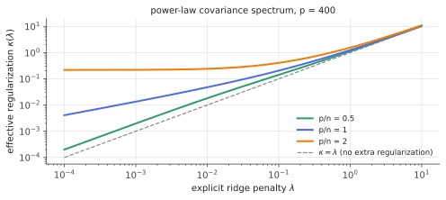

# Deterministic equivalents

!!! tldr "TL;DR"
    Random-matrix quantities that are smooth functionals of a resolvent, such as normalized traces $\frac1p\tr A(\hat\Sigma + \lambda)^{-1}$ and quadratic forms $u^\top(\hat\Sigma + \lambda)^{-1}v$, concentrate around **deterministic** values computable from the population covariance alone. For a sample covariance $\hat\Sigma$ of $n$ samples, the key statement is
    $$\lambda(\hat\Sigma + \lambda I)^{-1}\ \asymp\ \kappa\,(\Sigma + \kappa I)^{-1},\qquad\kappa - \lambda = \frac{\kappa}{n}\tr\big[\Sigma(\Sigma + \kappa I)^{-1}\big].$$
    Sampling noise acts like **extra ridge regularization**: the effective penalty $\kappa$ exceeds $\lambda$, and stays positive even at $\lambda = 0$ when $p > n$. This one fixed-point equation yields exact formulas for the test error of ridge regression, random features and kernel methods in high dimension.

## Why care?

The [Marchenko–Pastur](marchenko-pastur.md) law describes the *spectrum* of a sample covariance. Learning theory needs more: the test error of a ridge regression depends on how the sample covariance interacts with the *true* covariance and the *true* coefficients, through expressions like $\beta^\top\Sigma(\hat\Sigma + \lambda)^{-2}\Sigma\beta$. Deterministic equivalents are the tool that turns such expressions into explicit formulas.

They are behind:

- the exact asymptotic risk of ridge and min-norm least squares, including **double descent** ([next note](ridge-high-dim.md));
- the analysis of random-feature models and of kernel ridge regression in high dimension, where "effective regularization" explains much of the behaviour of overparametrized models;
- why **generalized cross-validation** works in high dimension, and why the optimal ridge penalty can be zero or even negative;
- scaling-law calculations for linear models with power-law spectra, a popular toy model for neural scaling laws.

## Building blocks

**Setting.** Rows $x_i = \Sigma^{1/2}z_i$, $i = 1..n$, with $z_i$ having i.i.d. standardized entries. $\hat\Sigma = \frac1n\sum_ix_ix_i^\top$ (a $p\times p$ matrix), $p/n\to\gamma\in(0,\infty)$, and $\Sigma$ has a bounded, converging spectrum. Write $Q(\lambda) = (\hat\Sigma + \lambda I)^{-1}$, the resolvent at $z = -\lambda$, where everything is smooth ([Stieltjes note](stieltjes-resolvent.md), Exercise 4).

**What "equivalent" means.** A deterministic matrix $\bar Q$ is a deterministic equivalent of the random $Q$, written $Q\asymp\bar Q$, if for every deterministic $A$ with bounded trace norm (normalized traces, rank-one quadratic forms, ...), $\tr A(Q - \bar Q)\to0$ almost surely. Note that $\bar Q\neq\E Q$ in general, and $Q - \bar Q$ is *not* small in operator norm. Only these "averaged" functionals agree.

## The main result

!!! theorem "Theorem (deterministic equivalent of the ridge resolvent)"
    Under the assumptions above, for every $\lambda > 0$,

    $$
    \lambda(\hat\Sigma + \lambda I)^{-1}\ \asymp\ \kappa(\Sigma + \kappa I)^{-1},
    $$

    where the **effective regularization** $\kappa = \kappa(\lambda) > \lambda$ is the unique positive solution of

    $$
    \kappa - \lambda = \frac{\kappa}{n}\,\tr\big[\Sigma(\Sigma + \kappa I)^{-1}\big] = \kappa\,\frac{\operatorname{df}_1(\kappa)}{n},\qquad\operatorname{df}_1(\kappa) = \tr\big[\Sigma(\Sigma + \kappa I)^{-1}\big].
    $$

    As $\lambda\to0^+$: $\kappa\to0$ if $p < n$, and $\kappa\to\kappa_0 > 0$ solving $\operatorname{df}_1(\kappa_0) = n$ if $p > n$.

**Derivation (Sherman–Morrison, as for the MP law).** Start from $Q(\hat\Sigma + \lambda) = I$, i.e. $\lambda Q = I - Q\hat\Sigma = I - \frac1n\sum_iQx_ix_i^\top$. With $Q_{-i}$ the resolvent without sample $i$ (independent of $x_i$),

$$
Qx_i = \frac{Q_{-i}x_i}{1 + \frac1nx_i^\top Q_{-i}x_i}\approx\frac{Q_{-i}x_i}{1 + \delta},\qquad\delta = \frac1n\tr(\Sigma Q),
$$

by quadratic-form concentration. Averaging over $i$, $\frac1n\sum_iQ_{-i}x_ix_i^\top\asymp\frac{Q\Sigma}{1+\delta}$. So $\lambda Q\asymp I - \frac{Q\Sigma}{1+\delta}$, i.e. $Q\big(\lambda + \frac{\Sigma}{1+\delta}\big)\asymp I$, or

$$
\lambda Q\asymp\lambda(1+\delta)\big(\lambda(1+\delta) + \Sigma\big)^{-1} = \kappa(\kappa + \Sigma)^{-1},\qquad\kappa := \lambda(1+\delta).
$$

Self-consistency: $\delta = \frac1n\tr\Sigma Q\asymp\frac{\kappa}{\lambda}\cdot\frac1n\tr\Sigma(\Sigma + \kappa)^{-1}$, and since $\frac\kappa\lambda = 1 + \delta$ this gives $\kappa = \lambda + \frac\kappa n\tr\Sigma(\Sigma + \kappa)^{-1}$. $\square$

### What the theorem says, in words

The random matrix $\lambda(\hat\Sigma + \lambda)^{-1}$ is a "noisy shrinkage operator". On average it acts like the **population** shrinkage operator $\kappa(\Sigma + \kappa)^{-1}$, but with a **larger** penalty. Directions of $\Sigma$ with eigenvalue $s\gg\kappa$ are kept, and directions with $s\ll\kappa$ are killed. Finite samples push the cutoff up from $\lambda$ to $\kappa$, by an amount proportional to the fraction
$\operatorname{df}_1(\kappa)/n$ of the sample "used up" by the fit.

When $p > n$ and $\lambda\to0$, the minimum-norm interpolator still behaves like population ridge with penalty $\kappa_0 > 0$. That is the **implicit regularization** of interpolation in overparametrized linear models, and the reason benign overfitting is possible.

**Useful identities that follow:**

- *Degrees of freedom.* $\operatorname{df}(\lambda) = \tr\hat\Sigma(\hat\Sigma + \lambda)^{-1}\asymp\operatorname{df}_1(\kappa) = n\big(1 - \frac\lambda\kappa\big)$.
- *Second-order equivalents.* Quantities quadratic in $Q$ (needed for variances) involve $\operatorname{df}_2(\kappa) = \tr\big[\Sigma^2(\Sigma + \kappa)^{-2}\big]$ and the factor $\frac{1}{1 - \operatorname{df}_2/n}$, obtained by differentiating the first-order equivalent in $\lambda$.

{ .fig }

## Examples

### Checking the equivalent on a power-law spectrum

```python
import numpy as np
from scipy.optimize import brentq
rng = np.random.default_rng(0)

def effective_reg(lam, s, n):
    """kappa solving  kappa - lam = (kappa / n) * sum_i s_i / (s_i + kappa)   (s = eigenvalues of Σ)."""
    f = lambda k: k - lam - k * np.sum(s / (s + k)) / n
    if lam == 0 and len(s) <= n:
        return 0.0                                                   # p <= n: no implicit regularization
    return brentq(f, max(lam, 1e-12), lam + 1e3 * s.sum())

p = 400
s = 1.0 / np.arange(1, p + 1) ** 1.2; s *= p / s.sum()             # power-law covariance spectrum, trace p
for n in [200, 800]:                                                 # p/n = 2 (overparametrized) and 0.5
    X = rng.standard_normal((n, p)) * np.sqrt(s)                     # rows ~ N(0, diag(s))
    Sh = X.T @ X / n
    for lam in [0.0, 0.01, 0.1, 1.0]:
        k = effective_reg(lam, s, n)
        emp_lam = max(lam, 1e-6)                                     # λ -> 0+ limit: use a tiny λ on the empirical side
        R = emp_lam * np.linalg.inv(Sh + emp_lam * np.eye(p))       # λ(Σ̂ + λ)^{-1}
        D = k / (s + k)                                              # its deterministic equivalent κ(Σ + κ)^{-1} (diagonal)
        print(f"n = {n}, lambda = {lam:<5}: kappa = {k:.4f}   tr/p: empirical {np.trace(R)/p:.4f}  equivalent {D.mean():.4f}   "
              f"tr(Σ·)/p: empirical {np.sum(s * np.diag(R))/p:.4f}  equivalent {np.mean(s * D):.4f}")
# n = 200, lambda = 0.0  : kappa = 0.2176   tr/p: empirical 0.5000  equivalent 0.5000   tr(Σ·)/p: empirical 0.1096  equivalent 0.1088
# n = 200, lambda = 0.01 : kappa = 0.2407   tr/p: empirical 0.5208  equivalent 0.5208   tr(Σ·)/p: empirical 0.1162  equivalent 0.1153
# n = 200, lambda = 0.1  : kappa = 0.4054   tr/p: empirical 0.6234  equivalent 0.6233   tr(Σ·)/p: empirical 0.1535  equivalent 0.1527
# n = 200, lambda = 1.0  : kappa = 1.5469   tr/p: empirical 0.8233  equivalent 0.8232   tr(Σ·)/p: empirical 0.2748  equivalent 0.2734
# n = 800, lambda = 0.0  : kappa = 0.0000   tr/p: empirical 0.0000  equivalent 0.0000   tr(Σ·)/p: empirical 0.0000  equivalent 0.0000
# n = 800, lambda = 0.01 : kappa = 0.0182   tr/p: empirical 0.0968  equivalent 0.0972   tr(Σ·)/p: empirical 0.0164  equivalent 0.0165
# n = 800, lambda = 0.1  : kappa = 0.1417   tr/p: empirical 0.4105  equivalent 0.4111   tr(Σ·)/p: empirical 0.0833  equivalent 0.0835
# n = 800, lambda = 1.0  : kappa = 1.1206   tr/p: empirical 0.7843  equivalent 0.7847   tr(Σ·)/p: empirical 0.2408  equivalent 0.2413
```

A **single** random sample of size $n = 200$ already matches the deterministic prediction to three or four digits, which shows how strongly these functionals concentrate. At $\lambda = 0$ with $p = 2n$, the normalized trace is exactly $1 - n/p = 0.5$ (the null-space fraction of $\hat\Sigma$), and the equivalent reproduces it with $\kappa_0 = 0.22$: the minimum-norm solution behaves like ridge with penalty $0.22$.

## Exercises

!!! question "Exercise 1 · warm-up: isotropic covariance"
    For $\Sigma = I$ with $p/n = \gamma$, solve the fixed-point equation explicitly. Show $\kappa = \frac{(\lambda + \gamma - 1) + \sqrt{(\lambda + \gamma - 1)^2 + 4\lambda}}{2}$, and evaluate $\kappa(0)$ for $\gamma < 1$ and $\gamma > 1$.

    ??? success "Solution"
        $\frac1n\tr(I + \kappa I)^{-1} = \frac{\gamma}{1+\kappa}$, so $\kappa - \lambda = \frac{\kappa\gamma}{1+\kappa}$, i.e. $\kappa^2 + \kappa(1 - \lambda - \gamma) - \lambda = 0$. The positive root is as stated. At $\lambda = 0$: $\kappa = \frac{(\gamma - 1) + |\gamma - 1|}{2} = \max(\gamma - 1, 0)$. For $\gamma > 1$, the min-norm interpolator acts like ridge with penalty $\gamma - 1$.

!!! question "Exercise 2 · degrees of freedom"
    Show that the deterministic equivalent implies $\operatorname{df}(\lambda) = \tr\hat\Sigma(\hat\Sigma + \lambda)^{-1}\asymp n(1 - \lambda/\kappa)$. Check it against the code output for $n = 200$, $\lambda = 0.1$.

    ??? success "Solution"
        $\tr\hat\Sigma(\hat\Sigma + \lambda)^{-1} = p - \lambda\tr(\hat\Sigma + \lambda)^{-1}\asymp p - \tr\kappa(\Sigma + \kappa)^{-1} = \tr\Sigma(\Sigma + \kappa)^{-1} = \operatorname{df}_1(\kappa)$, and by the fixed-point equation $\operatorname{df}_1(\kappa) = n(\kappa - \lambda)/\kappa$.
        Check: $n(1 - 0.1/0.4054) = 200\times0.753 = 150.7$. Empirically, $\operatorname{df} = p(1 - 0.6234) = 150.6$ ✓. The ridge fit uses about 151 of the 200 available degrees of freedom.

!!! question "Exercise 3 · implicit regularization"
    For $p > n$, show that $\kappa_0 = \lim_{\lambda\to0}\kappa(\lambda)$ solves $\operatorname{df}_1(\kappa_0) = n$. For a covariance with $k\ll n$ large eigenvalues (all equal to $L$) and $p - k$ small ones ($\epsilon$), approximate $\kappa_0$ and interpret.

    ??? success "Solution"
        Dividing the fixed-point equation by $\kappa$: $1 - \lambda/\kappa = \operatorname{df}_1(\kappa)/n$. As $\lambda\to0$ with $\kappa\to\kappa_0 > 0$, we get $\operatorname{df}_1(\kappa_0) = n$.
        With the spiky spectrum, $\operatorname{df}_1(\kappa)\approx\frac{kL}{L+\kappa} + \frac{(p-k)\epsilon}{\epsilon + \kappa}$. If $\kappa\gg\epsilon$, the second term is $\approx(p-k)\epsilon/\kappa$, and with $\kappa\ll L$ the first is $\approx k$. So $k + (p-k)\epsilon/\kappa_0\approx n$, giving $\kappa_0\approx\frac{(p-k)\epsilon}{n - k}$.
        The many small directions jointly act like a ridge penalty of size about "total small variance / remaining samples". That is the mechanism of **benign overfitting**: the interpolator fits noise using the many weak directions, which spread it thin, while the strong directions are estimated almost as if regularized optimally (Bartlett et al., 2020).

!!! question "Exercise 4 · GCV is consistent"
    Generalized cross-validation estimates the prediction risk of ridge by $\mathrm{GCV}(\lambda) = \frac{\frac1n\|y - \hat y\|^2}{(1 - \operatorname{df}(\lambda)/n)^2}$. Using $1 - \operatorname{df}/n\asymp\lambda/\kappa$, rewrite GCV as $\frac{\kappa^2}{\lambda^2}\cdot\frac1n\|y - \hat y\|^2$, and explain heuristically why this corrects the optimism of the training error.

    ??? success "Solution"
        $1 - \operatorname{df}/n\asymp\lambda/\kappa$ (Exercise 2), so $\mathrm{GCV}\asymp\big(\frac\kappa\lambda\big)^2\cdot\text{training MSE}$. The training residual is $\lambda Q y$ (scaled), which looks like population ridge with penalty $\kappa$ shrunk further by the factor $\lambda/\kappa$. Multiplying by $(\kappa/\lambda)^2$ undoes exactly this in-sample shrinkage. Patil et al. (2021) proved that GCV is uniformly consistent for the ridge risk in the proportional regime, even for $\lambda\to0$ with $p > n$. This is how $\lambda$ can be tuned reliably in high dimension without a validation set.

!!! question "Exercise 5 · stretch: quadratic forms and the bias term"
    The theorem also gives $u^\top\lambda Q v\asymp u^\top\kappa(\Sigma + \kappa)^{-1}v$ for fixed vectors. For ridge with $y = X\beta + \varepsilon$, show that $\E_\varepsilon[\hat\beta_\lambda] = (\hat\Sigma + \lambda)^{-1}\hat\Sigma\beta = \beta - \lambda Q\beta$, and deduce the deterministic equivalent of the **bias** $\E\hat\beta - \beta\asymp-\kappa(\Sigma + \kappa)^{-1}\beta$ (in the sense of linear functionals). What does the bias of high-dimensional ridge look like?

    ??? success "Solution"
        $\hat\beta_\lambda = (X^\top X + n\lambda)^{-1}X^\top y = Q\hat\Sigma\beta + \frac1nQX^\top\varepsilon$. Its noise-average is $Q\hat\Sigma\beta = Q(\hat\Sigma + \lambda - \lambda)\beta = \beta - \lambda Q\beta$. Applying the quadratic-form equivalent with $u$ arbitrary and $v = \beta$: $\E_\varepsilon\hat\beta - \beta\asymp-\kappa(\Sigma + \kappa)^{-1}\beta$.
        The bias is the population-ridge bias **with penalty $\kappa$ instead of $\lambda$**: components of $\beta$ along eigen-directions with $s_i\ll\kappa$ are lost, and those with $s_i\gg\kappa$ are kept. The squared bias seen through the test error, $\beta^\top\kappa^2(\Sigma + \kappa)^{-1}\Sigma(\Sigma + \kappa)^{-1}\beta$ (times the variance-inflation factor $1/(1 - \operatorname{df}_2/n)$), is one half of the double-descent formula ([next note](ridge-high-dim.md)).

## Where it shows up

- **Double descent and benign overfitting.** Exact risk curves for ridge and min-norm regression (Hastie, Montanari, Rosset & Tibshirani, 2022; Bartlett, Long, Lugosi & Tsigler, 2020) are built from these equivalents.
- **Random features and kernels.** Random-feature regression and kernel ridge regression in high dimension have test errors given by similar fixed-point equations with extra "effective regularization" from the features (Mei & Montanari, 2022; Bach, 2023). That explains why kernel methods can interpolate and still generalize.
- **Scaling laws.** Power-law spectra in these equations give power-law learning curves, the linear-model "solvable" toy models of neural scaling laws (e.g. Bahri et al., 2021; Maloney, Roberts & Sully, 2022).
- **Covariance estimation and signal processing.** Deterministic equivalents underpin consistent estimators of quadratic forms of $\Sigma^{-1}$, used in robust beamforming, portfolio risk with shrinkage (the [Markowitz](markowitz-estimation-error.md) formulas are special cases), and RMT-improved estimators (Couillet & Liao's monograph).
- **Hyperparameter selection.** Consistency of GCV and LOO in high dimension, and the observation that optimal ridge penalties can be negative when the signal lies in high-variance directions, come straight from these formulas.

## Further reading

- R. Couillet & Z. Liao, *Random Matrix Methods for Machine Learning* (2022), Ch. 2–4.
- F. Bach, "High-dimensional analysis of double descent for linear regression with random projections" (*SIAM J. Math. Data Sci.*, 2024). A clean derivation of $\kappa$ and its uses.
- T. Hastie, A. Montanari, S. Rosset & R. Tibshirani, "Surprises in high-dimensional ridgeless least squares interpolation" (*Ann. Stat.*, 2022).
- P. Patil, Y. Wei, A. Rinaldo & R. Tibshirani, "Uniform consistency of cross-validation estimators for high-dimensional ridge regression" (AISTATS 2021).
