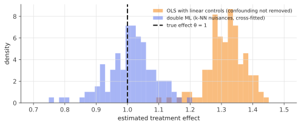

# Neyman orthogonality & double/debiased ML

!!! tldr "TL;DR"
    To estimate one causal or structural parameter $\theta$ (a treatment effect, an elasticity, a factor premium) while flexibly controlling for many confounders with machine learning, don't plug ML predictions into a naive formula: regularization bias and overfitting leak into $\hat\theta$.
    Instead, use a **Neyman-orthogonal score**, an estimating equation whose expectation is **insensitive to first-order errors** in the ML-estimated nuisance functions, and **cross-fit** (estimate nuisances on one part of the data, evaluate the score on another). Then $\hat\theta$ is $\sqrt n$-consistent and asymptotically normal as long as the ML errors are $o(n^{-1/4})$. For the partially linear model this is just [Frisch–Waugh–Lovell](ols-gauss-markov.md) with ML: residualize $Y$ and $D$ on $X$, then regress residual on residual.

## Why care?

Causal questions with observational data, such as "what is the effect of a price change on demand?", "does this feature cause users to stay?", or "what is the return premium of this characteristic controlling for 100 others?", require adjusting for confounders $X$. With many confounders entering nonlinearly, linear regression is misspecified (the example below shows a 31% bias) and the classical semiparametric theory is hard to apply.

ML methods (forests, boosting, neural networks, LASSO) can learn $\E[Y\mid X]$ and $\E[D\mid X]$ well, but they are biased by design (regularization) and converge more slowly than $n^{-1/2}$. Chernozhukov, Chetverikov, Demirer, Duflo, Hansen, Newey & Robins (2018) showed how to use them anyway: make the final estimating equation *orthogonal* to the nuisance errors, so the ML bias only enters at second order. This is the core of modern causal ML. The [debiased LASSO](debiased-lasso.md) is a special case, and the packages DoubleML and EconML implement it.

## Building blocks

**The partially linear model.**

$$
Y = \theta D + g(X) + \varepsilon,\qquad D = m(X) + V,\qquad\E[\varepsilon\mid X, D] = 0,\quad\E[V\mid X] = 0 .
$$

$D$ is a treatment or variable of interest, $X$ are high-dimensional confounders, and $g$, $m$ are unknown **nuisance functions**.

**The naive approach and its problem.** Estimate $g$ by ML, then regress $Y - \hat g(X)$ on $D$. The error $\hat g - g$ is correlated with $D$ (because $D$ depends on $X$), and its bias (regularization shrinks $\hat g$) passes **linearly** into $\hat\theta$. With ML rates slower than $n^{-1/2}$, the bias dominates the standard error and $\sqrt n(\hat\theta - \theta)$ diverges.

**Moment conditions.** $\theta$ solves $\E[\psi(W;\theta,\eta)] = 0$ for a score $\psi$ that depends on the data $W = (Y, D, X)$, the parameter $\theta$, and nuisances $\eta$.

## The main result

**Neyman orthogonality.** A score is Neyman-orthogonal if, at the true values $(\theta_0,\eta_0)$, its expectation has **zero derivative** with respect to the nuisance in every direction:

$$
\frac{\partial}{\partial r}\E\big[\psi(W;\theta_0,\eta_0 + r(\eta - \eta_0))\big]\Big|_{r=0} = 0 .
$$

Small errors in $\hat\eta$ then change the moment only at second order.

**For the partially linear model**, with $\ell(X) = \E[Y\mid X] = \theta m(X) + g(X)$, the "partialling-out" score

$$
\psi(W;\theta,\ell,m) = \big(Y - \ell(X) - \theta(D - m(X))\big)\big(D - m(X)\big)
$$

is orthogonal (Exercise 1). Its root is the residual-on-residual regression

$$
\hat\theta = \frac{\sum_i\hat V_i\,\hat U_i}{\sum_i\hat V_i^2},\qquad\hat U_i = Y_i - \hat\ell(X_i),\quad\hat V_i = D_i - \hat m(X_i).
$$

**Cross-fitting.** Split the sample into $K$ folds. For each fold, fit $\hat\ell$ and $\hat m$ on the **other** folds and compute residuals on this fold, then pool. This keeps each residual independent of the nuisance fit that produced it, removing the "own-observation" overfitting bias of flexible learners, without losing efficiency (every observation is used in the final step).

!!! theorem "Theorem (Chernozhukov et al., 2018)"
    Suppose the score is Neyman-orthogonal, the nuisance estimators are cross-fitted, and they satisfy the **product rate** condition

    $$
    \|\hat m - m\|_2\cdot\big(\|\hat m - m\|_2 + \|\hat\ell - \ell\|_2\big) = o_p(n^{-1/2})
    $$

    (implied by each converging at rate $o(n^{-1/4})$), plus mild regularity. Then

    $$
    \sqrt n(\hat\theta - \theta_0)\Rightarrow N\big(0,\ \sigma^2_\theta\big),\qquad\sigma^2_\theta = \frac{\E[V^2\varepsilon^2]}{(\E V^2)^2},
    $$

    and $\sigma^2_\theta$ is consistently estimated by the plug-in [sandwich](delta-sandwich.md) from the cross-fitted residuals.

**Why the product rate.** Expand the empirical moment around the true nuisances. The first-order terms vanish by orthogonality (and cross-fitting removes the empirical-process term). What's left is a product of the two nuisance errors, roughly $\E[(\hat m - m)(\hat\ell - \ell - \theta(\hat m - m))]$, which is $o(n^{-1/2})$ under the condition. So it is negligible relative to the $n^{-1/2}$ sampling error. ML only needs to be *moderately* good, $n^{-1/4}$ rates, which many methods achieve in reasonable settings. $\square$

**Double robustness.** For binary treatments, the analogous orthogonal score for the average treatment effect is the AIPW (augmented inverse-probability-weighting) score. It is consistent if *either* the outcome model *or* the propensity model is correct, and $\sqrt n$-normal if both are estimated at the product rate (Exercise 5).

{ .fig }

## Examples

### Nonlinear confounding

$X\in[-1,1]^2$ affects both the treatment and the outcome through nonlinear functions. The true effect is $\theta = 1$. The nuisance learner is $k$-nearest-neighbours regression ($k = 10$).

```python
import numpy as np
rng = np.random.default_rng(0)

def knn_predict(Xtr, ytr, Xte, k=10):
    """k-nearest-neighbour regression (a simple flexible ML learner)."""
    d = ((Xte[:, None, :] - Xtr[None, :, :]) ** 2).sum(-1)
    idx = np.argpartition(d, k, axis=1)[:, :k]
    return ytr[idx].mean(1)

def dml(Y, D, X, cross_fit=True, folds=2, k=10):
    """Partially linear model Y = theta*D + g(X) + eps: residualize Y and D on X, then regress residual on residual."""
    n = len(Y); rY, rD = np.empty(n), np.empty(n)
    if cross_fit:
        fold = np.arange(n) % folds
        for f in range(folds):
            tr, te = fold != f, fold == f                        # nuisances fitted on the OTHER folds
            rY[te] = Y[te] - knn_predict(X[tr], Y[tr], X[te], k)
            rD[te] = D[te] - knn_predict(X[tr], D[tr], X[te], k)
    else:                                                        # same data for fitting and residualizing
        rY = Y - knn_predict(X, Y, X, k); rD = D - knn_predict(X, D, X, k)
    theta = rD @ rY / (rD @ rD)
    psi = (rY - theta * rD) * rD                                 # orthogonal score -> sandwich standard error
    se = np.sqrt(np.mean(psi**2) / np.mean(rD**2) ** 2 / n)
    return theta, se

theta0, n = 1.0, 1000
res = {"OLS (linear in X)": [], "DML, no cross-fitting": [], "DML, cross-fitted": []}
for rep in range(200):
    X = rng.uniform(-1, 1, (n, 2))
    m = np.sin(np.pi * X[:, 0]) + X[:, 1] ** 2                   # treatment depends nonlinearly on X (confounding)
    g = np.cos(np.pi * X[:, 0]) + 2 * np.abs(X[:, 1])            # outcome also depends nonlinearly on X
    D = m + 0.5 * rng.standard_normal(n)
    Y = theta0 * D + g + rng.standard_normal(n)
    Z = np.column_stack([np.ones(n), D, X])
    b, *_ = np.linalg.lstsq(Z, Y, rcond=None); e = Y - Z @ b
    V = np.linalg.inv(Z.T @ Z) @ (Z.T * e**2) @ Z @ np.linalg.inv(Z.T @ Z)
    res["OLS (linear in X)"].append((b[1], np.sqrt(V[1, 1])))
    res["DML, no cross-fitting"].append(dml(Y, D, X, cross_fit=False))
    res["DML, cross-fitted"].append(dml(Y, D, X, cross_fit=True))
for name, r in res.items():
    r = np.array(r); cover = np.mean(np.abs(r[:, 0] - theta0) <= 1.96 * r[:, 1])
    print(f"{name:22s} mean estimate {r[:, 0].mean():.3f} (true 1)   sd {r[:, 0].std():.3f}   mean SE {r[:, 1].mean():.3f}   95% coverage {cover:.2f}")
# OLS (linear in X)      mean estimate 1.315 (true 1)   sd 0.052   mean SE 0.057   95% coverage 0.00
# DML, no cross-fitting  mean estimate 1.006 (true 1)   sd 0.072   mean SE 0.063   95% coverage 0.92
# DML, cross-fitted      mean estimate 1.006 (true 1)   sd 0.071   mean SE 0.062   95% coverage 0.91
```

Linear controls can't capture the nonlinear confounding. OLS is biased by 31% and its confidence interval **never** covers the truth, despite robust standard errors: precise and wrong. Double ML removes the bias and gives near-nominal coverage (the standard error is slightly optimistic at $n = 1000$).

Here, residualizing *without* cross-fitting also works, because $k$-NN is a **linear smoother** that doesn't adapt to the noise in $Y$. With adaptive learners (deep trees, boosting, neural networks) that can memorize their training data, in-sample residuals are artificially small and correlated with the noise, and cross-fitting becomes essential. It costs little, so it is the default.

## Exercises

!!! question "Exercise 1 · warm-up: orthogonality of the partialling-out score"
    Perturb the nuisances, $m\to m + r\,h_m$ and $\ell\to\ell + r\,h_\ell$, and show that $\frac{d}{dr}\E\psi\big|_{r=0} = 0$ for $\psi = (Y - \ell - \theta(D - m))(D - m)$ at the true values.

    ??? success "Solution"
        Write $U = Y - \ell(X)$ and $V = D - m(X)$. At the truth, $U - \theta V = \varepsilon$. Perturbed score: $(U - rh_\ell - \theta(V - rh_m))(V - rh_m)$. Its $r$-derivative at 0 is $(-h_\ell + \theta h_m)V - (U - \theta V)h_m = (-h_\ell + \theta h_m)V - \varepsilon h_m$. Taking expectations: $\E[(-h_\ell + \theta h_m)(X)\,V] = 0$ because $\E[V\mid X] = 0$, and $\E[\varepsilon h_m(X)] = 0$ because $\E[\varepsilon\mid X] = 0$. Both vanish ✓.

!!! question "Exercise 2 · a non-orthogonal score"
    Show that the naive score $\psi = (Y - g(X) - \theta D)D$ is **not** orthogonal in $g$: compute $\frac{d}{dr}\E[(Y - g - rh - \theta D)D]$ and explain why the bias of $\hat g$ passes linearly into $\hat\theta$.

    ??? success "Solution"
        The derivative is $-\E[h(X)D] = -\E[h(X)m(X)]$, which is nonzero whenever $D$ depends on $X$. An error $\hat g - g$ shifts the moment by $-\E[(\hat g - g)(X)m(X)]$, first order in the nuisance error. If $\hat g$ is regularized (biased) with error of order $n^{-\rho}$, $\rho < 1/2$, then $\hat\theta - \theta$ is of order $n^{-\rho}$, larger than its standard error, so inference is invalid. Orthogonalizing (also residualizing $D$) removes exactly this term.

!!! question "Exercise 3 · the $n^{-1/4}$ rule"
    If both nuisances are estimated with root-mean-square error $\asymp n^{-a}$, for which $a$ is the product condition satisfied? Give examples of methods that achieve such rates.

    ??? success "Solution"
        The product is of order $n^{-2a}$, which is $o(n^{-1/2})$ iff $a > 1/4$. The LASSO in sparse linear models achieves $\sqrt{s\log p/n}$ (so $a\approx1/2$ when $s\log p$ is small). Regression trees, forests and boosting achieve $n^{-1/4}$ or better under smoothness or structure assumptions, and neural networks under compositional structure. Nonparametric smoothers in low dimension with enough smoothness also qualify. None needs to be $\sqrt n$-consistent itself.

!!! question "Exercise 4 · why cross-fitting helps"
    Consider in-sample residuals with an estimator that can memorize, e.g. $\hat m(X_i)$ depends strongly on $D_i$ itself. Show that $\hat V_i = D_i - \hat m(X_i)$ is then shrunk toward 0 and correlated with $V_i$, and explain why fitting $\hat m$ on other folds removes this dependence.

    ??? success "Solution"
        If $\hat m(X_i) = m(X_i) + cV_i + (\text{other error})$ with $c > 0$ (partial memorization), then $\hat V_i = (1-c)V_i - (\text{other error})$: the treatment variation is shrunk, and the same thing happens to $\hat U_i$. Worse, with adaptive learners the shrinkage depends on the noise $\varepsilon_i$ (through $Y_i$ in $\hat\ell$), creating a correlation between the residuals and the noise that biases $\hat\theta$.
        With cross-fitting, $\hat m$ is a function of other observations only, so conditional on the training fold, $\hat m(X_i)$ is a fixed function of $X_i$, independent of $(V_i,\varepsilon_i)$. The "own-observation" terms disappear, and the remainder is just the product of nuisance errors.

!!! question "Exercise 5 · stretch: AIPW is doubly robust"
    For a binary treatment $D\in\{0,1\}$, outcome regressions $\mu_d(X) = \E[Y\mid D = d, X]$ and propensity $e(X) = \P(D = 1\mid X)$, the AIPW score for the ATE $\tau = \E[\mu_1(X) - \mu_0(X)]$ is

    $$
    \psi = \mu_1(X) - \mu_0(X) + \frac{D(Y - \mu_1(X))}{e(X)} - \frac{(1-D)(Y - \mu_0(X))}{1 - e(X)} - \tau .
    $$

    Show that $\E\psi = 0$ if either the $\mu_d$ are correct (with $e$ arbitrary) or $e$ is correct (with $\mu_d$ arbitrary).

    ??? success "Solution"
        If the $\mu_d$ are correct: $\E[D(Y - \mu_1(X))/e(X)\mid X] = \frac{e_0(X)}{e(X)}\E[Y - \mu_1(X)\mid D = 1, X] = 0$, and likewise for the control term. What remains is $\E[\mu_1 - \mu_0] - \tau = 0$.
        If $e$ is correct but $\mu_d$ arbitrary: $\E\big[\frac{D(Y - \mu_1)}{e}\mid X\big] = \E[Y\mid D = 1, X] - \mu_1(X)$, so the $\mu_1$ terms cancel and leave $\E[Y(1)\mid X]$. Similarly for the control arm. So $\E\psi = \E[Y(1) - Y(0)] - \tau = 0$.
        The bias with both models wrong is a product of the two errors, $\E\big[(e - \hat e)(\mu_1 - \hat\mu_1)/\hat e\big] + \dots$, which is orthogonality in its doubly robust form.

## Where it shows up

- **Causal inference in tech and economics.** Treatment effects from observational data, heterogeneous effects (causal forests, DR-learners) and price elasticities in demand estimation are routinely estimated with DML/AIPW using flexible ML nuisances (DoubleML, EconML, grf).
- **A/B testing with covariates.** Regression adjustment and CUPED-style variance reduction are linear special cases of orthogonal estimation. With ML predictions of the outcome from pre-experiment data, they reduce variance further while staying unbiased under randomization.
- **Empirical finance.** Estimating the premium of a characteristic while controlling flexibly for many others, or testing whether a new factor adds to an ML-learned model of expected returns, can be framed as partially linear models with ML nuisances (e.g. Chernozhukov et al.'s applications, and double-selection approaches to the factor zoo).
- **Prediction-powered inference.** Using an ML model's predictions on unlabelled data to sharpen estimates while keeping validity on a small labelled set (Angelopoulos et al., 2023) relies on the same "prediction plus correction" orthogonal structure.
- **Off-policy evaluation in RL.** Doubly robust estimators of a policy's value combine a learned Q-function with importance weights, which is AIPW for sequential decisions.

## Further reading

- V. Chernozhukov, D. Chetverikov, M. Demirer, E. Duflo, C. Hansen, W. Newey & J. Robins, "Double/debiased machine learning for treatment and structural parameters" (*Econometrics Journal*, 2018).
- V. Chernozhukov et al., *Applied Causal Inference Powered by ML and AI* (2024). Free online book.
- A. Belloni, V. Chernozhukov & C. Hansen, "Inference on treatment effects after selection among high-dimensional controls" (*Rev. Econ. Stud.*, 2014).
- S. Wager & S. Athey, "Estimation and inference of heterogeneous treatment effects using random forests" (*JASA*, 2018).
