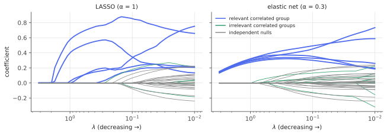

# The elastic net

!!! tldr "TL;DR"
    The elastic net penalizes $\lambda\big(\alpha\|\beta\|_1 + \frac{1-\alpha}{2}\|\beta\|_2^2\big)$, a mix of LASSO and ridge. The $\ell_1$ part still produces exact zeros, and the $\ell_2$ part makes the problem strictly convex. That has three consequences: a unique solution, no cap of $n$ selected variables, and a **grouping effect** in which highly correlated predictors get similar coefficients and enter or leave together, instead of the LASSO's arbitrary pick of one.
    Computationally it is a LASSO on augmented data, and its prox is a scaled soft-threshold. It is the default in glmnet for good reason.

## Why care?

The [LASSO](lasso.md) has two practical weaknesses, both caused by correlated predictors:

1. **Arbitrary selection within groups.** If several features are nearly collinear (genes in a pathway, overlapping technical indicators, different maturities of the same yield curve, n-grams that co-occur), the LASSO tends to pick one of them and zero the others. Which one it picks can flip with tiny changes in the data, so selections are unstable and hard to interpret.
2. **Saturation.** With $p > n$, the LASSO selects at most $n$ variables ([LARS](lars.md), Exercise 3), even when more are relevant.

Ridge has neither problem, but it never selects anything. Zou & Hastie (2005) combined the two penalties to get sparsity *and* grouping, at the cost of one extra tuning parameter.

## Building blocks

**The estimator.**

$$
\hat\beta = \arg\min_\beta\ \frac{1}{2n}\|y - X\beta\|^2 + \lambda\Big(\alpha\|\beta\|_1 + \frac{1-\alpha}{2}\|\beta\|_2^2\Big),\qquad\alpha\in[0,1].
$$

$\alpha = 1$ is the LASSO and $\alpha = 0$ is ridge. Equivalently, write $\lambda_1 = \lambda\alpha$ and $\lambda_2 = \lambda(1-\alpha)$.

**Coordinate update.** With standardized columns, the 1-D problem gives

$$
\hat\beta_j\leftarrow\frac{\operatorname{soft}(z_j,\ \lambda\alpha)}{1 + \lambda(1-\alpha)},\qquad z_j = \frac1nx_j^\top r^{(-j)},
$$

i.e. soft-threshold (LASSO) and then shrink proportionally (ridge). That is exactly the elastic-net prox from the [proximal note](proximal-operators.md).

**Augmented-data view.** For the unscaled objective $\|y - X\beta\|^2 + \lambda_2\|\beta\|^2 + \lambda_1\|\beta\|_1$,

$$
\tilde X = \begin{pmatrix}X\\ \sqrt{\lambda_2}I_p\end{pmatrix},\qquad\tilde y = \begin{pmatrix}y\\ 0\end{pmatrix}
\quad\Longrightarrow\quad\|\tilde y - \tilde X\beta\|^2 = \|y - X\beta\|^2 + \lambda_2\|\beta\|^2 .
$$

So the elastic net is a **LASSO on $n + p$ observations**. Any LASSO solver (including LARS) applies, and since $\tilde X$ has rank $p$, up to $p$ variables can be selected.

## The main result

!!! theorem "Theorem (grouping effect; Zou & Hastie, 2005)"
    Consider $\|y - X\beta\|^2 + \lambda_2\|\beta\|^2 + \lambda_1\|\beta\|_1$ with $\lambda_2 > 0$, centred $y$, and standardized columns ($\|x_j\| = 1$). Let $\rho = x_i^\top x_j$ be the sample correlation of two predictors. If $\hat\beta_i\hat\beta_j > 0$ (same sign, both active), then

    $$
    |\hat\beta_i - \hat\beta_j|\le\frac{\sqrt{2(1-\rho)}}{\lambda_2}\,\|y\| .
    $$

    In particular, as $\rho\to1$, the two coefficients become equal.

**Proof.** The objective is strictly convex, so the solution is unique. Stationarity for coordinates $i$ and $j$ (both active, same sign $s$) reads $-2x_i^\top r + 2\lambda_2\hat\beta_i + \lambda_1s = 0$ and the same for $j$, where $r = y - X\hat\beta$. Subtracting cancels the $\lambda_1$ terms:

$$
\hat\beta_i - \hat\beta_j = \frac{(x_i - x_j)^\top r}{\lambda_2}\quad\Longrightarrow\quad|\hat\beta_i - \hat\beta_j|\le\frac{\|x_i - x_j\|\,\|r\|}{\lambda_2}.
$$

Now $\|x_i - x_j\|^2 = 2 - 2\rho$, and $\|r\|\le\|y\|$ because the objective at $\hat\beta$ is at most its value at $\beta = 0$, which is $\|y\|^2$. $\square$

For the LASSO ($\lambda_2 = 0$) there is no such bound. With two identical columns the LASSO solution isn't even unique: any split of the coefficient between the two copies is optimal. The ridge term breaks the tie in favour of equal splitting.

### Practical notes

- **Two tuning parameters.** Usually $\alpha$ is fixed (0.5, 0.9, ...) or chosen from a small grid, and $\lambda$ is tuned by cross-validation along the path (glmnet's default workflow).
- **Double shrinkage.** The naive elastic net shrinks twice (soft-threshold, then divide by $1 + \lambda_2$), which can over-shrink. Zou & Hastie rescale by $(1 + \lambda_2)$ (the "corrected" elastic net). Others refit on the support, as with the relaxed LASSO.
- **Standardization matters.** As with ridge and LASSO, penalties compare coefficients across features, so features should be on comparable scales.

{ .fig }

## Examples

### A correlated group of relevant features

Three groups of 5 nearly collinear features (correlation about 0.95), plus 25 independent nulls. Only group 0 matters, with all five members contributing equally.

```python
import numpy as np
rng = np.random.default_rng(0)

def enet_cd(X, y, lam, alpha, iters=300):
    """(1/2n)||y - Xb||^2 + lam * (alpha ||b||_1 + (1-alpha)/2 ||b||^2); alpha = 1 is the LASSO."""
    n, p = X.shape; b = np.zeros(p); r = y.copy(); col = (X**2).sum(0) / n
    for _ in range(iters):
        for j in range(p):
            r += X[:, j] * b[j]; z = X[:, j] @ r / n
            b[j] = np.sign(z) * max(abs(z) - lam * alpha, 0) / (col[j] + lam * (1 - alpha))
            r -= X[:, j] * b[j]
    return b

# Three groups of 5 nearly collinear features (corr ≈ 0.95); only group 0 matters, equally through all members.
n, p = 100, 40
Z = rng.standard_normal((n, 3))
X = np.hstack([Z[:, [g]] + 0.23 * rng.standard_normal((n, 5)) for g in range(3)] + [rng.standard_normal((n, p - 15))])
X = (X - X.mean(0)) / X.std(0)
y = X[:, :5].sum(1) * 0.4 + rng.standard_normal(n)

for name, alpha, lam in [("LASSO", 1.0, 0.1), ("elastic net", 0.3, 0.3)]:
    b = enet_cd(X, y, lam, alpha)
    freq = np.zeros(p)
    for _ in range(100):                                    # selection stability under bootstrap resampling
        i = rng.integers(0, n, n); freq += np.abs(enet_cd(X[i], y[i], lam, alpha, iters=100)) > 1e-8
    print(f"{name:11s} group-0 coefs {np.round(b[:5], 2)}   #selected {np.sum(np.abs(b) > 1e-8):2d}   "
          f"bootstrap selection freq of group 0: {np.round(freq[:5] / 100, 2)}")
# LASSO       group-0 coefs [0.21 0.35 0.35 0.17 0.83]   #selected 12   bootstrap selection freq of group 0: [0.62 0.67 0.81 0.64 0.96]
# elastic net group-0 coefs [0.34 0.38 0.37 0.32 0.43]   #selected 18   bootstrap selection freq of group 0: [1. 1. 1. 1. 1.]
```

The true coefficients are all $0.4$. The LASSO piles weight on one member (0.83) and gives the others uneven scraps. Across bootstrap resamples, members drop in and out of its selected set 20–40% of the time. The elastic net spreads the weight evenly (0.32–0.43) and selects every member in every resample. It also selects a few more nulls (18 vs 12 variables). That is the usual trade-off: **stability and grouping at the cost of some extra false positives**.

## Exercises

!!! question "Exercise 1 · warm-up: orthogonal design"
    For $X^\top X/n = I$, show that the elastic-net solution is $\hat\beta_j = \frac{\operatorname{soft}(z_j,\lambda\alpha)}{1 + \lambda(1-\alpha)}$ with $z_j = x_j^\top y/n$. Compare with ridge and the LASSO on a coefficient $z_j = 1$, with $\lambda = 0.4$ and $\alpha = 0.5$.

    ??? success "Solution"
        The problem separates by coordinate: $\min_b\frac12(b - z)^2 + \lambda\alpha|b| + \frac{\lambda(1-\alpha)}{2}b^2$. Stationarity gives $b(1 + \lambda(1-\alpha)) = z - \lambda\alpha\operatorname{sign}(b)$, i.e. a soft-threshold divided by the ridge factor.
        Numbers: elastic net $\frac{(1 - 0.2)}{1.2} = 0.667$. LASSO (with the full $\lambda$ on $\ell_1$): $1 - 0.4 = 0.6$. Ridge (with the full $\lambda$ on $\ell_2$): $1/1.4 = 0.714$.

!!! question "Exercise 2 · the augmented LASSO"
    Verify the augmented-data identity, and explain why the augmented design always has rank $p$. What does this imply for the maximum number of selected variables?

    ??? success "Solution"
        $\|\tilde y - \tilde X\beta\|^2 = \|y - X\beta\|^2 + \|0 - \sqrt{\lambda_2}\beta\|^2$ ✓. The block $\sqrt{\lambda_2}I_p$ alone has rank $p$, so $\tilde X$ (with $n + p$ rows) has rank $p$. The LASSO on $\tilde X$ can therefore activate up to $p$ variables, no longer capped by $n$.

!!! question "Exercise 3 · identical columns"
    Suppose $x_1 = x_2$. Show that the LASSO solution set contains every split $(\beta_1, \beta_2) = (t, c - t)$ with $t\in[0, c]$ for some $c$, while the elastic net with $\lambda_2 > 0$ gives $\beta_1 = \beta_2 = c/2$ (under the corresponding total).

    ??? success "Solution"
        With identical columns, the fit depends only on $\beta_1 + \beta_2 = c$, and for same-sign splits $|\beta_1| + |\beta_2| = |c|$, so the LASSO objective is constant along $\{(t, c - t) : t\in[0,c]\}$: there are infinitely many solutions. Adding $\lambda_2(\beta_1^2 + \beta_2^2)$, which for a fixed sum is minimized at equal values, selects the even split. This is the limiting case $\rho = 1$ of the grouping theorem.

!!! question "Exercise 4 · effective degrees of freedom"
    For the elastic net with active set $A$ (at a given $\lambda$), show that $\operatorname{df} = \tr\big[X_A(X_A^\top X_A + n\lambda(1-\alpha)I)^{-1}X_A^\top\big]$ (holding the active set fixed). How does this interpolate between the LASSO's $|A|$ and ridge's $\operatorname{df}$?

    ??? success "Solution"
        On a fixed active set with fixed signs, the elastic-net solution solves $X_A^\top(y - X_A\beta_A) = n\lambda\alpha s_A + n\lambda(1-\alpha)\beta_A$, so $\hat y = X_A(X_A^\top X_A + n\lambda(1-\alpha)I)^{-1}(X_A^\top y - n\lambda\alpha s_A)$. Differentiating in $y$, the constant term drops and $\operatorname{df} = \tr$ of the hat-matrix part. This is the ridge df restricted to the active set (Zou & Hastie). With $\alpha = 1$ it is $\tr(\text{projection}) = |A|$, the LASSO count. With $\alpha = 0$ every variable is "active", giving ridge's $\operatorname{df}$.

!!! question "Exercise 5 · stretch: grouping without equal signs"
    In the grouping theorem, what happens if two highly correlated predictors have **opposite** signs in the truth? Use the KKT conditions to argue that the elastic net then tends to set one of them to zero or keep both small, and relate this to the identifiability of the difference $x_i - x_j$.

    ??? success "Solution"
        With opposite signs, subtracting the stationarity equations gives $\hat\beta_i - \hat\beta_j = \frac{(x_i - x_j)^\top r - \lambda_1}{\lambda_2}$, roughly (the $\ell_1$ terms now add instead of cancelling). When $\rho\approx1$, $x_i - x_j$ is a tiny-norm direction. The data barely inform the contrast $\beta_i - \beta_j$, which is a near-unidentifiable direction, while the penalty charges for it. The penalties then dominate and shrink the contrast toward zero, so the estimator reports either one variable or a small symmetric pair.
        Large opposite-sign coefficients on near-collinear predictors (a classic overfitting symptom in OLS) are exactly what the $\ell_2$ term suppresses.

## Where it shows up

- **Genomics and biomarkers.** Genes act in correlated pathways. The elastic net selects whole groups and gives stable signatures, which made it a standard tool for expression-based prediction.
- **Finance.** Many candidate signals and factors are strongly correlated (different lookback windows of momentum, valuation ratios, yield-curve points). Elastic-net regressions give stable combinations instead of arbitrarily picking one variant, and $\ell_1+\ell_2$ penalized portfolios balance sparsity with diversification.
- **Text and recommendation.** Sparse linear models over correlated n-gram or interaction features. In glmnet, scikit-learn and Spark ML, elastic-net logistic regression is a strong, interpretable baseline.
- **Neural networks.** Combined $\ell_1$/$\ell_2$ weight penalties (the $\ell_2$ part being weight decay) are sometimes used in sparse model training. The grouping intuition also explains why plain $\ell_1$ pruning of redundant units can be unstable.
- **Group-structured extensions.** The group LASSO, sparse group LASSO and fused LASSO extend the same "mix of penalties" idea to known group or ordering structure.

## Further reading

- H. Zou & T. Hastie, "Regularization and variable selection via the elastic net" (*JRSS-B*, 2005).
- J. Friedman, T. Hastie & R. Tibshirani, "Regularization paths for generalized linear models via coordinate descent" (*J. Stat. Softw.*, 2010). glmnet.
- T. Hastie, R. Tibshirani & M. Wainwright, *Statistical Learning with Sparsity* (2015), Ch. 4.
