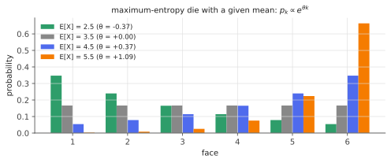

# Exponential families

!!! tldr "TL;DR"
    An exponential family has densities $p_\theta(x) = h(x)\exp\big(\theta^\top T(x) - A(\theta)\big)$. Gaussian, Bernoulli, Poisson, categorical (softmax), gamma, beta and many more are all of this form.
    Everything follows from the **log-partition function** $A$: it is convex, its gradient is the mean of the sufficient statistic, $\nabla A(\theta) = \E_\theta T$, and its Hessian is the covariance, $\nabla^2A = \Cov_\theta T$,
    which is also the Fisher information. Maximum likelihood is **moment matching**, the log-likelihood is concave, and exponential families are exactly the **maximum-entropy** distributions subject to moment
    constraints. Softmax outputs, GLMs, energy-based models and natural gradients all build on this.

## Why care?

You have met many distributions separately. Seen as exponential families they share one set of results, which explains a lot:

- why logistic regression and Poisson regression have **concave** log-likelihoods and unique MLEs (and why the gradient is always "prediction minus target");
- why the gradient of cross-entropy with respect to a network's logits is simply $p - y$;
- why the Fisher information, and hence the [Cramér–Rao bound](fisher-kl-cramer-rao.md) and the natural gradient, is the Hessian of a single convex function;
- why softmax with temperature, Boltzmann distributions, Gibbs measures in physics and maximum-entropy RL policies all look the same;
- why conjugate priors exist (Beta–Bernoulli, Gamma–Poisson, Normal–Normal) and make Bayesian updating a matter of adding counts.

The [GLM](glm.md) note builds directly on this one.

## Building blocks

**Definition.** A family $\{p_\theta\}_{\theta\in\Theta}$ on a space $\mathcal X$ is an exponential family if

$$
p_\theta(x) = h(x)\,\exp\big(\langle\theta, T(x)\rangle - A(\theta)\big),\qquad A(\theta) = \log\int h(x)\,e^{\langle\theta, T(x)\rangle}dx,
$$

with **natural parameter** $\theta\in\R^k$, **sufficient statistic** $T(x)\in\R^k$, base measure $h$, and **log-partition** (cumulant) function $A$. The natural parameter space is $\Theta = \{\theta : A(\theta) < \infty\}$, which is convex.

**Examples.**

| distribution | $T(x)$ | natural parameter $\theta$ | $A(\theta)$ |
|---|---|---|---|
| Bernoulli($p$) | $x$ | $\log\frac{p}{1-p}$ (logit) | $\log(1 + e^\theta)$ |
| Poisson($\lambda$) | $x$ | $\log\lambda$ | $e^\theta$ |
| $N(\mu,\sigma^2)$, $\sigma$ known | $x$ | $\mu/\sigma^2$ | $\sigma^2\theta^2/2$ |
| $N(\mu,\sigma^2)$ | $(x, x^2)$ | $(\mu/\sigma^2,\,-1/2\sigma^2)$ | $-\frac{\theta_1^2}{4\theta_2} - \frac12\log(-2\theta_2)$ |
| Categorical (one-hot $x$) | $x$ | logits $z$ | $\log\sum_je^{z_j}$ (log-sum-exp) |

The last row is the **softmax**: $p(x = e_j) = e^{z_j - \operatorname{LSE}(z)}$. A language model's output layer is an exponential family whose natural parameters are the logits.

## The main results

### The log-partition function generates the moments

!!! theorem "Theorem (properties of $A$)"
    On the interior of $\Theta$, $A$ is infinitely differentiable and convex, with

    $$
    \nabla A(\theta) = \E_\theta[T(X)],\qquad\nabla^2A(\theta) = \Cov_\theta[T(X)]\succeq0 .
    $$

    More generally, $A$ is the cumulant generating function of $T$: $\log\E_\theta e^{\langle s, T\rangle} = A(\theta + s) - A(\theta)$.

**Proof.** Differentiate $e^{A(\theta)} = \int h\,e^{\langle\theta, T\rangle}$ under the integral sign: $\nabla A\,e^A = \int T\,h\,e^{\langle\theta,T\rangle}$, so $\nabla A = \E_\theta T$. Differentiate again:
$\nabla^2A = \E_\theta[TT^\top] - \E_\theta T\,\E_\theta T^\top = \Cov_\theta T$. A covariance matrix is PSD, so $A$ is convex. For the cumulant identity, $\E_\theta e^{\langle s,T\rangle} = \int h\,e^{\langle\theta+s,T\rangle - A(\theta)} = e^{A(\theta+s) - A(\theta)}$. $\square$

### Maximum likelihood is moment matching

For i.i.d. data $x_1,\dots,x_n$, the log-likelihood is

$$
\ell(\theta) = \Big\langle\theta,\ \sum_iT(x_i)\Big\rangle - nA(\theta) + \text{const},
$$

a linear function minus a convex one, hence **concave**. Its gradient is $\sum_iT(x_i) - n\nabla A(\theta)$, so the MLE solves

$$
\E_{\hat\theta}[T(X)] = \frac1n\sum_iT(x_i) :
$$

**choose the parameter whose model moments equal the empirical moments.** The data enter only through $\bar T = \frac1n\sum_iT(x_i)$ (sufficiency). The Hessian $-n\nabla^2A = -n\Cov_\theta T$ is the negative Fisher information, so Newton's method
here is also Fisher scoring.

### Maximum entropy

!!! theorem "Theorem (exponential families maximize entropy)"
    Among all densities $q$ (relative to $h$) with $\E_q[T(X)] = \tau$, the entropy $H(q) = -\int q\log(q/h)$ is maximized by the exponential-family member $p_\theta$ with $\nabla A(\theta) = \tau$ (if it exists).

**Proof.** For any such $q$, $0\le\mathrm{KL}(q\|p_\theta) = \int q\log\frac{q}{h} - \int q\,[\langle\theta,T\rangle - A(\theta)] = -H(q) - \langle\theta,\tau\rangle + A(\theta)$. The last two terms depend on $q$ only through $\tau$, and for $q = p_\theta$ the KL is zero.
So $H(q)\le A(\theta) - \langle\theta,\tau\rangle = H(p_\theta)$. $\square$

If all you know is a few expected values, the least-committal distribution consistent with them is exponential. A known mean and variance on $\R$ give the Gaussian, a known mean on $\{0,1,2,\dots\}$ gives the geometric, and a known mean energy
gives the Boltzmann distribution.

### Duality: natural and mean parameters

The map $\theta\mapsto\mu = \nabla A(\theta)$ (natural to mean parameters) is one-to-one when $\Cov_\theta T\succ0$ (a *minimal* family). Its inverse is the gradient of the convex conjugate
$A^*(\mu) = \sup_\theta\{\langle\theta,\mu\rangle - A(\theta)\}$, which equals the **negative entropy** of $p_{\theta(\mu)}$. KL divergences become **Bregman divergences** of $A$ (Exercise 3):

$$
\mathrm{KL}(p_{\theta_1}\|p_{\theta_2}) = A(\theta_2) - A(\theta_1) - \langle\nabla A(\theta_1),\,\theta_2 - \theta_1\rangle .
$$

This dual geometry underlies the natural gradient (steepest descent in the Fisher metric $\nabla^2A$) and mirror descent (gradient steps in mean parameters).

### Conjugate priors

The likelihood depends on $\theta$ through $\exp(\langle\theta,\sum T(x_i)\rangle - nA(\theta))$. A prior of the same shape, $\pi(\theta)\propto\exp(\langle\theta,\chi\rangle - \nu A(\theta))$, gives a posterior with $\chi\leftarrow\chi + \sum_iT(x_i)$ and $\nu\leftarrow\nu + n$.
The prior acts like $\nu$ pseudo-observations with total statistic $\chi$. For Bernoulli this is the Beta distribution, for Poisson the Gamma, for a Gaussian mean the Gaussian.

## Examples

### Jaynes' Brandeis dice

A die is known to average $4.5$ instead of $3.5$. What probabilities should you assign to the faces? Maximum entropy says $p_k\propto e^{\theta k}$, a one-parameter exponential family on $\{1,\dots,6\}$, with $\theta$ fixed by moment matching.

```python
import numpy as np

# Jaynes' Brandeis dice: a die whose long-run average is 4.5 instead of 3.5.
# Max-entropy distribution with E[X] = 4.5 is an exponential family p_k ∝ exp(θ k); fit θ by Newton's method.
k = np.arange(1, 7)

def A(theta):    return np.log(np.sum(np.exp(theta * k)))           # log-partition
def mean(theta): p = np.exp(theta * k - A(theta)); return p @ k     # A'(θ)  = E[X]
def var(theta):  p = np.exp(theta * k - A(theta)); return p @ k**2 - (p @ k) ** 2   # A''(θ) = Var[X]

theta, target = 0.0, 4.5
for it in range(5):                                  # Newton on the concave log-likelihood = moment matching
    theta -= (mean(theta) - target) / var(theta)
    print(f"iter {it}: theta = {theta:.6f}   E[X] = {mean(theta):.6f}")
p = np.exp(theta * k - A(theta))
print("max-entropy probabilities:", np.round(p, 4), "  entropy:", round(-p @ np.log(p), 4), " (uniform:", round(np.log(6), 4), ")")

# Check A'(θ) and A''(θ) against finite differences
h = 1e-5
print(f"A'  numeric {(A(theta+h)-A(theta-h))/(2*h):.6f}  vs E[X] {mean(theta):.6f}")
print(f"A'' numeric {(A(theta+h)-2*A(theta)+A(theta-h))/h**2:.5f}  vs Var[X] {var(theta):.5f}")
# iter 0: theta = 0.342857   E[X] = 4.434121
# iter 1: theta = 0.370594   E[X] = 4.498955
# iter 2: theta = 0.371049   E[X] = 4.500000
# iter 3: theta = 0.371049   E[X] = 4.500000
# iter 4: theta = 0.371049   E[X] = 4.500000
# max-entropy probabilities: [0.0544 0.0788 0.1142 0.1654 0.2398 0.3475]   entropy: 1.6136  (uniform: 1.7918 )
# A'  numeric 4.500000  vs E[X] 4.500000
# A'' numeric 2.29817  vs Var[X] 2.29818
```

Newton converges quadratically (three iterations to machine precision), thanks to the concavity, and the derivatives of $A$ are the mean and variance, as the theorem says.

{ .fig }

## Exercises

!!! question "Exercise 1 · warm-up: Poisson and Bernoulli"
    Write the Poisson($\lambda$) pmf in exponential-family form and verify that $A'(\theta)$ and $A''(\theta)$ give the mean and variance. Do the same for Bernoulli($p$).

    ??? success "Solution"
        Poisson: $\frac{\lambda^xe^{-\lambda}}{x!} = \frac1{x!}\exp(x\log\lambda - \lambda)$, so $\theta = \log\lambda$ and $A = e^\theta$. Then $A' = A'' = e^\theta = \lambda$: mean = variance = $\lambda$ ✓.
        Bernoulli: $p^x(1-p)^{1-x} = \exp\big(x\log\frac{p}{1-p} + \log(1-p)\big)$, so $\theta = \operatorname{logit}p$ and $A = \log(1 + e^\theta)$. Then $A' = \sigma(\theta) = p$ and $A'' = \sigma(\theta)(1-\sigma(\theta)) = p(1-p)$ ✓.

!!! question "Exercise 2 · the Gaussian, both parameters"
    For $N(\mu,\sigma^2)$ with $T(x) = (x, x^2)$, derive $\theta = (\mu/\sigma^2, -1/(2\sigma^2))$ and $A(\theta) = -\frac{\theta_1^2}{4\theta_2} - \frac12\log(-2\theta_2)$ (dropping constants). Check that $\partial A/\partial\theta_1 = \mu$ and $\partial A/\partial\theta_2 = \mu^2 + \sigma^2$.

    ??? success "Solution"
        $\log p = -\frac{(x-\mu)^2}{2\sigma^2} - \frac12\log(2\pi\sigma^2) = \frac{\mu}{\sigma^2}x - \frac{1}{2\sigma^2}x^2 - \frac{\mu^2}{2\sigma^2} - \frac12\log\sigma^2 + c$. With $\theta_1 = \mu/\sigma^2$ and $\theta_2 = -1/(2\sigma^2)$: $\frac{\mu^2}{2\sigma^2} = -\frac{\theta_1^2}{4\theta_2}$ and $\frac12\log\sigma^2 = -\frac12\log(-2\theta_2)$.
        Then $\partial_{\theta_1}A = -\frac{\theta_1}{2\theta_2} = \mu$ and $\partial_{\theta_2}A = \frac{\theta_1^2}{4\theta_2^2} - \frac{1}{2\theta_2} = \mu^2 + \sigma^2 = \E X^2$ ✓.

!!! question "Exercise 3 · KL is a Bregman divergence"
    Show $\mathrm{KL}(p_{\theta_1}\|p_{\theta_2}) = A(\theta_2) - A(\theta_1) - \langle\nabla A(\theta_1),\theta_2 - \theta_1\rangle$. Apply it to two Poissons.

    ??? success "Solution"
        $\mathrm{KL} = \E_{\theta_1}\big[\log\frac{p_{\theta_1}}{p_{\theta_2}}\big] = \E_{\theta_1}\big[\langle\theta_1 - \theta_2, T\rangle - A(\theta_1) + A(\theta_2)\big] = \langle\theta_1 - \theta_2, \nabla A(\theta_1)\rangle - A(\theta_1) + A(\theta_2)$ ✓. This is the gap between $A(\theta_2)$ and
        the tangent of $A$ at $\theta_1$, which is nonnegative by convexity.

        Poisson: $A = e^\theta$, so $\mathrm{KL} = \lambda_2 - \lambda_1 - \lambda_1(\log\lambda_2 - \log\lambda_1) = \lambda_1\log\frac{\lambda_1}{\lambda_2} - \lambda_1 + \lambda_2$, the familiar Poisson deviance.

!!! question "Exercise 4 · Beta–Bernoulli conjugacy"
    With prior $p\sim\text{Beta}(a, b)$ and $n$ Bernoulli observations with $s$ successes, derive the posterior and the posterior mean. Interpret $a$ and $b$ as pseudo-counts and connect this to [James–Stein](james-stein.md)-style shrinkage.

    ??? success "Solution"
        Posterior $\propto p^{a-1}(1-p)^{b-1}\cdot p^s(1-p)^{n-s}$, i.e. $\text{Beta}(a + s, b + n - s)$, with mean $\frac{a+s}{a+b+n} = \frac{a+b}{a+b+n}\cdot\frac{a}{a+b} + \frac{n}{a+b+n}\cdot\frac{s}{n}$. That is a convex combination of the prior mean and the empirical frequency,
        with weight on the data growing as $n/(n + a + b)$. Choosing $a, b$ from many related units (batting averages, click-through rates per ad) is empirical-Bayes shrinkage, the discrete cousin of James–Stein. It is also the basis of
        Thompson sampling for Bernoulli bandits.

!!! question "Exercise 5 · stretch: softmax and cross-entropy"
    For logits $z\in\R^K$, let $\operatorname{LSE}(z) = \log\sum_je^{z_j}$ and $p = \operatorname{softmax}(z)$. Show that $\nabla\operatorname{LSE} = p$ and $\nabla^2\operatorname{LSE} = \diag(p) - pp^\top$, and that the cross-entropy loss $-\log p_y = \operatorname{LSE}(z) - z_y$ has gradient
    $p - e_y$. Why is $\nabla^2\operatorname{LSE}$ singular, and what does that say about the parametrization?

    ??? success "Solution"
        $\partial_{z_j}\operatorname{LSE} = e^{z_j}/\sum_ke^{z_k} = p_j$, and $\partial_{z_k}p_j = p_j(\delta_{jk} - p_k)$. So the Hessian is $\diag(p) - pp^\top = \Cov(e_Y)$ for $Y\sim p$, as the theorem predicts (the one-hot vector is the sufficient statistic).
        The loss gradient is $\nabla\operatorname{LSE} - e_y = p - e_y$: prediction minus target, the same form as for every exponential family (and every [GLM](glm.md)).

        The Hessian has $\mathbf 1$ in its null space ($(\diag(p) - pp^\top)\mathbf 1 = p - p = 0$), because adding a constant to all logits doesn't change $p$. The parametrization is not minimal, since one logit is redundant. That is why the Fisher
        information of softmax models is singular and natural-gradient methods need damping or a reduced parametrization.

## Where it shows up

- **Every classifier's output layer.** Softmax/sigmoid outputs are categorical/Bernoulli exponential families in natural parameters. The gradient $p - y$, temperature scaling ($\theta\to\theta/T$) and label smoothing are all statements
  in this language. LLM sampling with temperature and top-$k$ manipulates the natural parameters of a categorical family.
- **Generalized linear models.** Make the natural parameter linear in features, $\theta = x^\top\beta$, and you get logistic, Poisson and gamma regression with concave likelihoods and "prediction minus target" gradients ([GLM note](glm.md)).
- **Energy-based models and physics.** Boltzmann machines, Ising models and modern EBMs define $p(x)\propto e^{-E_\theta(x)}$. When the energy is linear in $\theta$ they are exponential families, and learning matches data moments to model moments
  ("positive phase minus negative phase").
- **Variational inference and natural gradients.** Mean-field updates and stochastic VI are simplest in natural parameters. The natural gradient in exponential families is just a gradient step in mean parameters.
- **Maximum-entropy RL.** Soft Q-learning and SAC use Boltzmann policies $\pi(a\mid s)\propto e^{Q(s,a)/\tau}$, the maximum-entropy distributions given expected value.

## Further reading

- M. Wainwright & M. Jordan, *Graphical Models, Exponential Families, and Variational Inference* (2008), Ch. 3. The definitive treatment of duality.
- L. D. Brown, *Fundamentals of Statistical Exponential Families* (1986).
- E. T. Jaynes, *Probability Theory: The Logic of Science* (2003), Ch. 11. Maximum entropy and the Brandeis dice.
