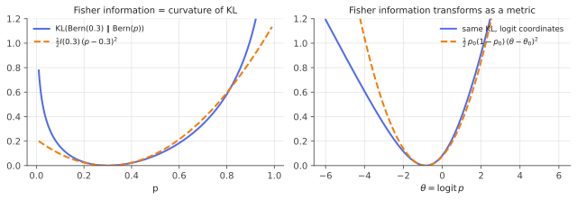

# Fisher information, KL divergence & Cramér–Rao

!!! tldr "TL;DR"
    The **score** $s_\theta(x) = \nabla_\theta\log p_\theta(x)$ has mean zero, and its covariance is the **Fisher information** $I(\theta) = \E[ss^\top] = -\E[\nabla^2\log p_\theta]$. Fisher information is the **curvature of the KL divergence**:
    $\mathrm{KL}(p_\theta\|p_{\theta+\delta})\approx\frac12\delta^\top I(\theta)\delta$. It measures how distinguishable nearby parameters are, and so it limits how precisely they can be estimated. The **Cramér–Rao bound** says
    $\Var(\hat\theta)\succeq I(\theta)^{-1}/n$ for unbiased estimators, and the MLE attains it asymptotically. The same matrix is the metric behind natural gradients, trust regions and Laplace approximations.

## Why care?

Every estimation problem has a **speed limit**: some parameters can be pinned down quickly from data and others need enormous samples. Fisher information quantifies this limit. It answers questions like:

- How many days of returns do I need to estimate volatility to 5%? (Few.) And the mean return? (Decades. The Fisher information for the mean is tiny relative to its size.)
- Is my estimator efficient, or am I wasting data? (The sample mean is efficient for Gaussians but useless for Cauchy data.)
- Which parameters of a trained network matter most? Fisher-weighted importance is used to prune weights (Optimal Brain Damage), protect old tasks in continual learning (EWC), and merge fine-tuned models.

Fisher information also defines the natural **geometry** on a family of distributions. In that geometry, steepest descent is the natural gradient, trust regions are KL balls (TRPO/PPO and the KL penalty in RLHF), and Bayesian posteriors are approximately Gaussian with covariance $I^{-1}/n$.

## Building blocks

**Score.** For a smooth family $p_\theta(x)$, $s_\theta(x) = \nabla_\theta\log p_\theta(x)$. Differentiating $\int p_\theta = 1$ under the integral:

$$
\E_\theta[s_\theta] = \int\nabla_\theta p_\theta = \nabla_\theta\int p_\theta = 0 .
$$

**Fisher information.** $I(\theta) = \E_\theta[s_\theta s_\theta^\top] = \Cov_\theta(s_\theta)$. Differentiating $\E_\theta[s_\theta] = 0$ once more gives the **information equality**

$$
I(\theta) = -\E_\theta\big[\nabla_\theta^2\log p_\theta(X)\big],
$$

the expected curvature of the log-likelihood. For $n$ i.i.d. observations the information adds: $I_n = nI$.

**KL divergence.** $\mathrm{KL}(p\|q) = \E_p[\log(p/q)]\ge0$, with equality iff $p = q$ (Jensen). It is asymmetric and not a metric, but locally it behaves like a squared distance.

**Examples.** Bernoulli($p$): $I = \frac{1}{p(1-p)}$. Poisson($\lambda$): $I = 1/\lambda$. $N(\mu,\sigma^2)$: $I_{\mu\mu} = 1/\sigma^2$, $I_{\sigma\sigma} = 2/\sigma^2$, $I_{\mu\sigma} = 0$. Cauchy location: $I = 1/2$. Exponential families: $I(\theta) = \nabla^2A(\theta)$ in natural parameters ([exponential families](exponential-families.md)).

## The main results

### Fisher information is the curvature of KL

!!! theorem "Theorem (local KL)"
    For a smooth family, as $\delta\to0$,

    $$
    \mathrm{KL}(p_\theta\,\|\,p_{\theta+\delta}) = \tfrac12\,\delta^\top I(\theta)\,\delta + O(\|\delta\|^3).
    $$

**Proof.** Expand $\log p_{\theta+\delta} = \log p_\theta + \delta^\top s_\theta + \frac12\delta^\top\nabla^2\log p_\theta\,\delta + O(\|\delta\|^3)$. Then

$$
\mathrm{KL} = -\E_\theta\big[\log p_{\theta+\delta} - \log p_\theta\big] = -\delta^\top\E_\theta[s_\theta] - \tfrac12\delta^\top\E_\theta[\nabla^2\log p_\theta]\,\delta + O(\|\delta\|^3) = \tfrac12\delta^\top I(\theta)\delta + O(\|\delta\|^3). \qquad\square
$$

Directions in which $I$ is large are directions in which a small parameter change makes the distribution very different, so they are easy to detect from data. Under reparametrization $\theta = \theta(\eta)$, KL is unchanged, so $I$ transforms like a metric
tensor, $I_\eta = J^\top I_\theta J$ with $J = \partial\theta/\partial\eta$. This makes $I$ a Riemannian metric on the space of distributions: the **Fisher–Rao metric**.

{ .fig }

### The Cramér–Rao bound

!!! theorem "Theorem (Cramér–Rao)"
    Let $T(X)$ be an unbiased estimator of $\psi(\theta)\in\R$ from $n$ i.i.d. observations, with regularity allowing differentiation under the integral. Then

    $$
    \Var_\theta(T)\;\ge\;\frac{\nabla\psi(\theta)^\top I(\theta)^{-1}\,\nabla\psi(\theta)}{n}.
    $$

    In particular, any unbiased estimator of $\theta$ has $\Cov(\hat\theta)\succeq I(\theta)^{-1}/n$.

**Proof (scalar $\theta$).** Let $S = \sum_is_\theta(X_i)$ be the total score, with $\E S = 0$ and $\Var S = nI$. Differentiating $\E_\theta T = \psi(\theta)$ under the integral gives $\psi'(\theta) = \E_\theta[T\cdot S] = \Cov(T, S)$. By Cauchy–Schwarz,
$\psi'(\theta)^2 = \Cov(T,S)^2\le\Var(T)\Var(S) = \Var(T)\,nI(\theta)$. $\square$

Equality requires $T - \psi(\theta)$ to be proportional to the score, which happens essentially only in exponential families with $T$ the sufficient statistic.

### The MLE attains the bound asymptotically

Under regularity conditions, the MLE satisfies

$$
\sqrt n\,(\hat\theta_{\text{MLE}} - \theta)\;\Rightarrow\;N\big(0,\ I(\theta)^{-1}\big).
$$

*Sketch:* expand the score equation $0 = S(\hat\theta)\approx S(\theta) + S'(\theta)(\hat\theta - \theta)$. The CLT gives $S(\theta)/\sqrt n\Rightarrow N(0, I)$, and the LLN gives $-S'(\theta)/n\to I$, so $\sqrt n(\hat\theta - \theta)\approx I^{-1}S(\theta)/\sqrt n\Rightarrow N(0, I^{-1})$. Asymptotically, nothing beats the MLE (Hájek–Le Cam).
Practical standard errors are $\sqrt{[\hat I^{-1}]_{jj}/n}$, using either the expected or the observed information. When the model is misspecified, the right covariance is the **sandwich** $I^{-1}JI^{-1}$ ([next note](delta-sandwich.md)).

## Examples

### Three estimators of a Cauchy location

For Cauchy data, $I = 1/2$, so the bound is $n\Var\ge2$. The sample mean is itself Cauchy, with infinite variance, and never improves with $n$. The median has asymptotic variance $\frac{\pi^2}{4n}$. The MLE should reach $\frac2n$.

```python
import numpy as np
rng = np.random.default_rng(0)

# Location of a Cauchy distribution: Fisher information I = 1/2, so the Cramér–Rao bound is Var >= 2/n.
def cauchy_mle(x, iters=20):
    theta = np.median(x)                                # start at the median, then Newton on the log-likelihood
    for _ in range(iters):
        u = x - theta
        score = np.sum(2 * u / (1 + u**2))
        hess = np.sum(2 * (u**2 - 1) / (1 + u**2) ** 2)
        theta -= score / hess
    return theta

n, reps = 200, 5000
est = {"mean": [], "median": [], "MLE": []}
for _ in range(reps):
    x = rng.standard_cauchy(n)                          # true location 0
    est["mean"].append(x.mean()); est["median"].append(np.median(x)); est["MLE"].append(cauchy_mle(x))
print(f"Cramér–Rao bound: n·Var >= {2:.3f}")
for k, v in est.items():
    v = np.array(v)
    print(f"{k:6s}  n·Var = {n * v.var():10.3f}   (median |error| {np.median(np.abs(v)):.4f})")
print(f"theory for the median: n·Var -> pi^2/4 = {np.pi**2 / 4:.3f}")
# Cramér–Rao bound: n·Var >= 2.000
# mean    n·Var = 183233.225   (median |error| 1.0282)
# median  n·Var =      2.572   (median |error| 0.0767)
# MLE     n·Var =      2.092   (median |error| 0.0684)
# theory for the median: n·Var -> pi^2/4 = 2.467
```

The MLE essentially attains the bound ($2.09$ vs $2$; the remainder is finite-$n$ effects and simulation noise). The median loses about 20% efficiency, and the mean is catastrophic. Efficiency is a property of the estimator **and** the model. The sample mean is optimal for Gaussians and worthless here.
This is the motivation for [robust M-estimators](robust-m-estimators.md).

## Exercises

!!! question "Exercise 1 · warm-up: Bernoulli and Poisson"
    Compute $I(p)$ for Bernoulli and $I(\lambda)$ for Poisson, and show that the sample mean attains the Cramér–Rao bound in both cases.

    ??? success "Solution"
        Bernoulli: $\log p(x) = x\log p + (1-x)\log(1-p)$ and $s = \frac{x}{p} - \frac{1-x}{1-p} = \frac{x - p}{p(1-p)}$, so $I = \frac{\Var X}{p^2(1-p)^2} = \frac{1}{p(1-p)}$. The bound is $\frac{p(1-p)}{n} = \Var(\bar X)$ ✓.
        Poisson: $s = \frac x\lambda - 1$ and $I = \frac{\Var X}{\lambda^2} = \frac1\lambda$. The bound $\frac\lambda n = \Var(\bar X)$ ✓. In both, the score is linear in $x$ (exponential families), so the bound is attained exactly.

!!! question "Exercise 2 · mean vs volatility"
    Daily returns are $N(\mu,\sigma^2)$ with $\sigma = 1\%$ and $\mu = 0.04\%$ (about 10% a year). Using $I_{\mu\mu} = 1/\sigma^2$ and $I_{\sigma\sigma} = 2/\sigma^2$, how many days are needed for a standard error of 10% of the true value for each of $\mu$ and $\sigma$?

    ??? success "Solution"
        For $\mu$: $\mathrm{SE} = \sigma/\sqrt n\le0.1\mu$ requires $n\ge\big(\frac{\sigma}{0.1\mu}\big)^2 = \big(\frac{1}{0.004}\big)^2 = 62{,}500$ days, about **250 years**.
        For $\sigma$: $\mathrm{SE} = \sigma/\sqrt{2n}\le0.1\sigma$ requires $n\ge50$ days. Volatility is learnable in weeks, expected returns essentially never. This information asymmetry is why quant risk models are much better than return forecasts, and why
        [shrinking means](james-stein.md) matters so much.

!!! question "Exercise 3 · reparametrization"
    Show that if $\eta$ is a smooth one-to-one reparametrization of a scalar $\theta$, then $I_\eta(\eta) = I_\theta(\theta)\,(d\theta/d\eta)^2$. Apply it to the Bernoulli in logit coordinates $\eta = \log\frac{p}{1-p}$ and compare with $\nabla^2A$ from the exponential-families note.

    ??? success "Solution"
        $s_\eta = \frac{\partial\log p}{\partial\eta} = s_\theta\frac{d\theta}{d\eta}$, so $I_\eta = \E s_\eta^2 = I_\theta(d\theta/d\eta)^2$. For the logit, $dp/d\eta = p(1-p)$, so $I_\eta = \frac{1}{p(1-p)}\cdot p^2(1-p)^2 = p(1-p) = A''(\eta)$ with $A(\eta) = \log(1 + e^\eta)$ ✓.
        In logit coordinates, information is *largest* at $p = 1/2$. In probability coordinates it is *smallest* there. Same geometry, different coordinates (compare the two panels of the figure).

!!! question "Exercise 4 · Jeffreys prior"
    The Jeffreys prior is $\pi(\theta)\propto\sqrt{\det I(\theta)}$. Show it is invariant under reparametrization (it transforms like a density), and compute it for the Bernoulli.

    ??? success "Solution"
        From Exercise 3 (and its matrix version $I_\eta = J^\top I_\theta J$), $\sqrt{\det I_\eta} = \sqrt{\det I_\theta}\,|\det J|$, exactly the change-of-variables rule for densities. So "Jeffreys in $\theta$" and "Jeffreys in $\eta$" describe the same distribution.
        Bernoulli: $\pi(p)\propto(p(1-p))^{-1/2}$, the Beta(1/2, 1/2) (arcsine) distribution, which puts extra mass near 0 and 1, where the data are most informative per unit of $p$.

!!! question "Exercise 5 · stretch: natural gradient as a KL trust region"
    You want to improve an objective $L(\theta)$ by a small step $\delta$, using its linearization $L(\theta + \delta)\approx L(\theta) + g^\top\delta$, while keeping the model distribution close: $\mathrm{KL}(p_\theta\|p_{\theta+\delta})\le\varepsilon$. Using the quadratic KL approximation, show that the optimal step is

    $$
    \delta^* = \sqrt{\frac{2\varepsilon}{g^\top I^{-1}g}}\;I(\theta)^{-1}g .
    $$

    Why is this direction invariant to reparametrization, while the ordinary gradient $g$ is not?

    ??? success "Solution"
        Maximize $g^\top\delta$ subject to $\frac12\delta^\top I\delta\le\varepsilon$. The Lagrangian condition gives $g = \nu I\delta$, so $\delta\propto I^{-1}g$. Saturating the constraint, $\frac12c^2g^\top I^{-1}g = \varepsilon$ with $\delta = cI^{-1}g$, which gives $c = \sqrt{2\varepsilon/(g^\top I^{-1}g)}$.

        Under $\theta = \theta(\eta)$, $g_\eta = J^\top g_\theta$ and $I_\eta = J^\top I_\theta J$, so $\delta_\eta = I_\eta^{-1}g_\eta = J^{-1}I_\theta^{-1}g_\theta$, which maps back to the same $\delta_\theta$. The step is the same distributional change whatever coordinates you use. The ordinary gradient $g_\eta = J^\top g_\theta$ points in a coordinate-dependent direction.
        This is Amari's natural gradient. TRPO enforces exactly this KL constraint, PPO approximates it by clipping, K-FAC approximates $I^{-1}$ with Kronecker factors, and the KL penalty in RLHF is the soft version of the same trust region.

## Where it shows up

- **Natural gradient and second-order optimizers.** K-FAC, Shampoo-style methods and natural-gradient VI precondition with (approximations of) the Fisher. For softmax outputs the Fisher equals the generalized Gauss–Newton matrix $J^\top(\diag p - pp^\top)J$.
- **Trust regions in RL and RLHF.** TRPO and PPO constrain policy updates in KL, and RLHF objectives subtract $\beta\,\mathrm{KL}(\pi\|\pi_{\text{ref}})$. Locally both are Fisher-metric constraints, which is why the "size" of an update is measured in KL rather than in parameter norm.
- **Importance of parameters.** Elastic Weight Consolidation penalizes changes to weights with large Fisher information when learning a new task. Fisher-weighted model merging averages fine-tuned models with Fisher weights. Pruning and quantization rank weights by the
  Fisher-based saliency $\frac12F_{ii}\theta_i^2$ (Optimal Brain Damage).
- **Uncertainty.** The Laplace approximation ([credible intervals note](laplace-credible.md)) approximates posteriors by $N(\hat\theta, (nI)^{-1})$, and standard errors in every GLM output come from the inverse Fisher information.
- **Experimental design and finance.** Optimal designs maximize $\det I$ (D-optimality) or other functionals. In finance, the Fisher information for drift vs volatility (Exercise 2) explains why risk can be estimated while expected returns can't.

## Further reading

- E. L. Lehmann & G. Casella, *Theory of Point Estimation* (2nd ed., 1998), Ch. 2 and 6.
- S. Amari, *Information Geometry and Its Applications* (2016).
- J. Martens, "New insights and perspectives on the natural gradient method" (*JMLR*, 2020).
- J. Kirkpatrick et al., "Overcoming catastrophic forgetting in neural networks" (*PNAS*, 2017).
