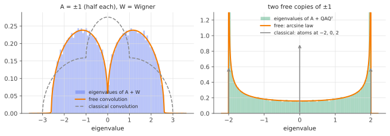

# Free probability I: freeness & the R-transform

!!! tldr "TL;DR"
    If two large random matrices are in "generic relative position" (one has Haar-random eigenvectors relative to the other, or one is a Wigner matrix), then the spectrum of $A + B$ depends **only** on the spectra of $A$ and $B$.
    It is given by **free additive convolution**, not by the classical convolution of their eigenvalue distributions. The **R-transform**, defined through the functional inverse of the Stieltjes transform by $z = R(g(z)) + 1/g(z)$,
    linearizes it: $R_{A+B} = R_A + R_B$. The semicircle ($R(\omega) = \sigma^2\omega$) is the free Gaussian, Marchenko–Pastur ($R(\omega) = \frac{1}{1-q\omega}$) is the free Poisson, and a free central limit theorem holds.

## Why care?

Many matrices of interest are **sums**: signal + noise (a low-rank structure buried in a Wigner or Wishart matrix), a true covariance plus estimation error, a neural-network Hessian written as Gauss–Newton term plus residual term, or a
sum of independent layer contributions. Eigenvalues of sums are generally hopeless, since $\lambda(A + B)\neq\lambda(A) + \lambda(B)$ because the eigenvectors don't align. Weyl's inequalities only give bounds.

Voiculescu's discovery (around 1985–1991) was that for **large, randomly oriented** matrices the problem becomes exactly solvable, with a calculus as clean as characteristic functions in classical probability. The theory gives exact limiting
spectra of sums and products, explains why the semicircle and MP laws are universal, and is the engine behind covariance cleaning ([RIE](rotational-invariant-estimators.md)) and deterministic equivalents ([next notes](deterministic-equivalents.md)). Pennington and Bahri used it to
predict Hessian spectra of neural networks.

## Building blocks

**Noncommutative expectation.** For $N\times N$ matrices, set $\varphi(M) = \frac1N\tr M$ (in the large-$N$ limit, with an expectation for random matrices). The "moments" of $A$ are $\varphi(A^k)$, the moments of its eigenvalue distribution.

**Why classical independence is the wrong notion.** If $A$ and $B$ commuted and were "independent", we'd have $\varphi(ABAB) = \varphi(A^2B^2) = \varphi(A^2)\varphi(B^2)$. For randomly rotated matrices instead, $\varphi(ABAB)\approx\varphi(A^2)\varphi(B)^2 + \varphi(A)^2\varphi(B^2) - \varphi(A)^2\varphi(B)^2$,
which is zero when both are centred (Exercise 1). Random rotations destroy mixed alignment, so the rules for mixed moments are different.

**Freeness.** $A$ and $B$ are **free** (with respect to $\varphi$) if

$$
\varphi\big(p_1(A)\,q_1(B)\,p_2(A)\,q_2(B)\cdots\big) = 0\quad\text{whenever}\quad\varphi(p_i(A)) = 0 = \varphi(q_j(B))\ \text{for all } i, j,
$$

for polynomials $p_i, q_j$ and any alternating product. This determines all mixed moments of $A$ and $B$ from their individual moments, just as independence does classically.

!!! theorem "Theorem (Voiculescu: asymptotic freeness)"
    Let $A_N, B_N$ be deterministic (or random) $N\times N$ symmetric matrices with converging spectra and bounded norm, and let $O_N$ be Haar-distributed orthogonal, independent of them. Then $A_N$ and $O_NB_NO_N^\top$ are **asymptotically free**. Also, a Wigner
    matrix is asymptotically free from any independent deterministic matrix, and independent Wigner or Wishart matrices are asymptotically free from each other.

## The main result

### The R-transform

Recall the Stieltjes transform $g(z) = \varphi\big((z - A)^{-1}\big) = \int\frac{\rho(x)}{z-x}dx$, which behaves like $1/z$ at infinity and is invertible near $z = \infty$. Define $R_A$ by

$$
z = R_A\big(g_A(z)\big) + \frac{1}{g_A(z)},\qquad\text{i.e.}\qquad R_A(\omega) = g_A^{-1}(\omega) - \frac1\omega .
$$

!!! theorem "Theorem (free additive convolution)"
    If $A$ and $B$ are free, then

    $$
    R_{A+B}(\omega) = R_A(\omega) + R_B(\omega).
    $$

    The spectrum of $A + B$, written $\rho_A\boxplus\rho_B$, is obtained by adding R-transforms, inverting to get $g_{A+B}$, and applying Stieltjes inversion.

It is the analogue of adding log-characteristic functions (cumulant generating functions) for independent random variables. Indeed $R_A(\omega) = \sum_{k\ge1}\kappa_k\omega^{k-1}$, where the $\kappa_k$ are the **free cumulants**: free cumulants add under free
convolution, like classical cumulants under classical convolution.

**Proof idea.** One of several arguments: when $W$ is Wigner, the [Schur-complement computation](wigner-semicircle.md) applied to $A + W$ gives $G_{ii}\approx\frac{1}{z - a_i - \sigma^2g(z)}$, i.e.

$$
g_{A+W}(z) = g_A\big(z - \sigma^2g_{A+W}(z)\big)\qquad\text{(subordination / Pastur's equation)}.
$$

Writing $\omega = g_{A+W}(z)$: $z - \sigma^2\omega = g_A^{-1}(\omega) = R_A(\omega) + 1/\omega$, so $z = R_A(\omega) + \sigma^2\omega + 1/\omega$. That is $R_{A+W} = R_A + R_W$ with $R_W(\omega) = \sigma^2\omega$. The general case (both matrices arbitrary but free) uses the same idea
via a random rotation, or a combinatorial argument with non-crossing partitions. $\square$

### A small dictionary

| law | $g(z)$ satisfies | $R(\omega)$ |
|---|---|---|
| point mass at $a$ | $g = \frac{1}{z-a}$ | $a$ |
| semicircle, variance $\sigma^2$ | $\sigma^2g^2 - zg + 1 = 0$ | $\sigma^2\omega$ |
| Marchenko–Pastur, ratio $q$, mean 1 | $qzg^2 - (z-1+q)g + 1 = 0$ | $\dfrac{1}{1 - q\omega}$ |
| $\frac12(\delta_{-1} + \delta_1)$ | $g = \frac{z}{z^2-1}$ | $\dfrac{\sqrt{1+4\omega^2} - 1}{2\omega}$ |

Simple rules: $R_{A + c}(\omega) = R_A(\omega) + c$, and $R_{aA}(\omega) = aR_A(a\omega)$ (Exercise 2).

### Free central limit theorem

Let $X_1,\dots,X_n$ be free, identically distributed, centred, with variance $\sigma^2$. Then $R_{(X_1+\dots+X_n)/\sqrt n}(\omega) = n\cdot\frac{1}{\sqrt n}R_X\big(\frac{\omega}{\sqrt n}\big) = \sqrt n\big[\sigma^2\frac{\omega}{\sqrt n} + \kappa_3\frac{\omega^2}{n} + \dots\big]\to\sigma^2\omega$.
**Free sums converge to the semicircle**, so the semicircle is the free Gaussian. Likewise, the free analogue of the Poisson limit (sums of many small rank-one projections) is Marchenko–Pastur. That explains why the semicircle and MP are universal:
a Wigner matrix is a free sum of many tiny pieces, and a Wishart matrix $\frac1T\sum_tx_tx_t^\top$ is a free sum of $T$ rank-one pieces.

{ .fig }

## Examples

### Free sums are not classical sums

$A$ has eigenvalues $\pm1$ (half each). Add either a Wigner matrix $W$ (semicircle, variance 1) or a randomly rotated copy of $A$ itself.

```python
import numpy as np
rng = np.random.default_rng(0)
N = 2000

A = np.diag(np.where(np.arange(N) < N // 2, -1.0, 1.0))      # eigenvalues ±1
G = rng.standard_normal((N, N)); W = (G + G.T) / np.sqrt(2 * N)  # semicircle, variance 1
Q, _ = np.linalg.qr(rng.standard_normal((N, N)))
B = Q @ A @ Q.T                                               # same spectrum as A, random eigenvectors

for name, M in [("A + W  (W Wigner)", A + W), ("A + Q A Q^T (Haar Q)", A + B)]:
    lam = np.linalg.eigvalsh(M)
    print(f"{name:22s} m2 = {np.mean(lam**2):.3f}   m4 = {np.mean(lam**4):.3f}")
print("free prediction for A + W: m2 = 2, m4 = 7   |   commuting/classical sum would give m4 = 9")
print("free prediction for A + QAQ^T: m2 = 2, m4 = 6   |   independent scalars ±1 ± 1 would give m4 = 8")

# Subordination: g_{A+W}(z) = g_A(z - g_{A+W}(z)) for W semicircle of variance 1
def g_free(z, iters=2000):
    g = 1 / z
    for _ in range(iters):
        w = z - g
        g = 0.5 * g + 0.5 * 0.5 * (1 / (w - 1) + 1 / (w + 1))
    return g
lam = np.linalg.eigvalsh(A + W)
for z in [0.5 + 0.1j, 2.0 + 0.1j]:
    print(f"z = {z}:  empirical g = {np.mean(1/(z - lam)):.4f}   free subordination g = {g_free(z):.4f}")
# A + W  (W Wigner)      m2 = 2.001   m4 = 7.012
# A + Q A Q^T (Haar Q)   m2 = 2.002   m4 = 6.012
# free prediction for A + W: m2 = 2, m4 = 7   |   commuting/classical sum would give m4 = 9
# free prediction for A + QAQ^T: m2 = 2, m4 = 6   |   independent scalars ±1 ± 1 would give m4 = 8
# z = (0.5+0.1j):  empirical g = -0.0445-0.6230j   free subordination g = -0.0469-0.6209j
# z = (2+0.1j):  empirical g = 0.5428-0.5625j   free subordination g = 0.5427-0.5623j
```

The variances add in both cases ($m_2 = 2$), as they would classically. The fourth moments don't: free probability predicts $7$ and $6$, simulation gives $7.01$ and $6.01$, and the classical guesses ($9$ and $8$) are wrong.
The figure makes the difference vivid. Two free copies of a $\pm1$ spectrum don't give atoms at $\{-2, 0, 2\}$ but the continuous **arcsine law** on $[-2,2]$.

## Exercises

!!! question "Exercise 1 · warm-up: an alternating moment"
    Let $A, B$ be free with $\varphi(A) = \varphi(B) = 0$. Using the definition of freeness, show $\varphi(ABAB) = 0$. Compare with commuting independent variables, where $\varphi(ABAB) = \varphi(A^2)\varphi(B^2)$.

    ??? success "Solution"
        $A$ and $B$ are centred, so the alternating product $A\cdot B\cdot A\cdot B$ has all factors centred, and freeness gives $\varphi(ABAB) = 0$ directly. For commuting independent variables, $ABAB = A^2B^2$, and the expectation factorizes to $\varphi(A^2)\varphi(B^2) > 0$.
        Free matrices "don't see" each other's eigenvectors, so terms that alternate between them average to zero.

!!! question "Exercise 2 · scaling and shifting"
    Show that $R_{A + cI}(\omega) = R_A(\omega) + c$ and $R_{aA}(\omega) = aR_A(a\omega)$ for $a > 0$. Deduce the R-transform of the semicircle of variance $\sigma^2$ from that of variance 1.

    ??? success "Solution"
        Shift: $g_{A+c}(z) = g_A(z - c)$, so $g_{A+c}^{-1}(\omega) = g_A^{-1}(\omega) + c$, and subtracting $1/\omega$ gives the claim. Scale: $g_{aA}(z) = \frac1ag_A(z/a)$, so if $\omega = g_{aA}(z)$ then $a\omega = g_A(z/a)$, i.e. $z = ag_A^{-1}(a\omega)$. So
        $R_{aA}(\omega) = ag_A^{-1}(a\omega) - \frac1\omega = a\big[R_A(a\omega) + \frac{1}{a\omega}\big] - \frac1\omega = aR_A(a\omega)$. The semicircle of variance $\sigma^2$ is $\sigma\cdot$(standard): $R(\omega) = \sigma\cdot\sigma\omega = \sigma^2\omega$ ✓.

!!! question "Exercise 3 · Marchenko–Pastur's R-transform"
    Check that $R(\omega) = \frac{1}{1-q\omega}$ reproduces the MP equation $qzg^2 - (z - 1 + q)g + 1 = 0$. Expand $R$ in powers of $\omega$ to read off the free cumulants of MP. What is special about them?

    ??? success "Solution"
        $z = \frac{1}{1-qg} + \frac1g$. Multiplying by $g(1 - qg)$: $zg - qzg^2 = g + 1 - qg$, i.e. $qzg^2 - (z - 1 + q)g + 1 = 0$ ✓.
        $R(\omega) = \sum_{k\ge0}q^k\omega^k$, so $\kappa_{n} = q^{n-1} = \frac1q\cdot q^n$. That is the **free Poisson** law with rate $\lambda = 1/q$ and jump size $\alpha = q$, whose free cumulants are $\kappa_n = \lambda\alpha^n$. It parallels the classical compound Poisson law, whose
        classical cumulants are $\lambda\alpha^n$. A Wishart matrix is a sum of $T = N/q$ rank-one "jumps" $\frac1Tx_tx_t^\top$, each of norm $\approx N/T = q$, hence rate $1/q$ per dimension and jump size $q$.

!!! question "Exercise 4 · signal plus noise"
    Let $A$ have spectrum $\delta_0$ except for a small fraction at value $\theta$ (a low-rank signal), and add a Wigner matrix of variance 1. Using subordination, $g_{A+W}(z) = g_A(z - g_{A+W}(z))$, explain why the *bulk* of $A+W$ is still a semicircle, and how this connects to the outlier condition $\theta > 1$ from the [Wigner note](wigner-semicircle.md).

    ??? success "Solution"
        If $A$ has rank $r\ll N$, then $g_A(z) = \frac{1 - r/N}{z} + \frac{r/N}{z - \theta}\to\frac1z$, so subordination gives $g = \frac{1}{z - g}$, the semicircle equation. A vanishing fraction of eigenvalues can't change the limiting density.
        The outliers live at the level of individual eigenvalues, and come from the $O(1/N)$ correction: a solution of $\theta g(z) = 1$ outside $[-2,2]$, which exists iff $\theta > 1$. Free convolution describes bulks, and the spiked-model analysis ([BBP](bbp-spiked.md)) describes outliers. Both use the same Stieltjes transform.

!!! question "Exercise 5 · stretch: fourth moments via free cumulants"
    For a centred distribution, the moment–free-cumulant relation up to order 4 is $m_2 = \kappa_2$ and $m_4 = \kappa_4 + 2\kappa_2^2$ (versus classically $m_4 = k_4 + 3k_2^2$). Compute the free cumulants of $\frac12(\delta_{-1} + \delta_1)$ and of the standard semicircle, and verify the predictions $m_4 = 7$ for $A + W$ and $m_4 = 6$ for $A + QAQ^\top$.
    Where do the "2" and the "3" come from?

    ??? success "Solution"
        $\pm1$: $m_2 = 1$ and $m_4 = 1$, so $\kappa_2 = 1$ and $\kappa_4 = 1 - 2 = -1$. Semicircle: $m_2 = 1$ and $m_4 = 2$, so $\kappa_2 = 1$ and $\kappa_4 = 0$ (all its free cumulants beyond the second vanish, like a Gaussian's classical cumulants).
        $A + W$: $\kappa_2 = 2$, $\kappa_4 = -1$, so $m_4 = -1 + 2\cdot4 = 7$ ✓. $A + QAQ^\top$: $\kappa_2 = 2$, $\kappa_4 = -2$, so $m_4 = -2 + 8 = 6$ ✓.
        The coefficient counts pair partitions of 4 points: classically all 3 pairings count, while freely only the 2 **non-crossing** ones do (the crossing pairing $\{1,3\},\{2,4\}$ is excluded). Free probability is classical probability with "partitions" replaced by "non-crossing partitions", the same
        combinatorics that produced the Catalan numbers in the semicircle's moments.

## Where it shows up

- **Neural-network Hessians.** Pennington & Bahri (2017) wrote the Hessian of a squared loss as $H = H_0 + H_1$ (a positive Gauss–Newton/Wishart-like part plus a residual-dependent part), treated them as free, and used R-transform addition to predict how the spectrum, and the fraction of
  negative eigenvalues, depends on the loss value.
- **Covariance cleaning.** "Sample = truth ⊠ noise" for covariances (a free *product*, next note) and "observed = signal ⊞ noise" for additive models. Free **deconvolution** inverts these relations to estimate the true spectrum. It underlies
  RIE and nonlinear shrinkage.
- **Spectra of random features and kernels.** Gram matrices of random-feature models decompose into free pieces, and their spectra (hence the test error of random-feature regression) are computed with free convolutions ([deterministic equivalents](deterministic-equivalents.md)).
- **Telecommunications.** Capacity of MIMO channels with structured or correlated fading uses free convolution and the R/S-transforms (Tulino & Verdú's monograph).
- **Ensembles and averaging.** Spectra of averages of independently trained, randomly oriented matrices (for example in model averaging or sketching) are free convolutions, which explains how averaging reshapes eigenvalue distributions.

## Further reading

- J. A. Mingo & R. Speicher, *Free Probability and Random Matrices* (2017). A thorough modern text.
- J.-P. Bouchaud & M. Potters, *A First Course in Random Matrix Theory* (2020), Ch. 11–14. Physicists' approach with the conventions used here.
- J. Pennington & Y. Bahri, "Geometry of neural network loss surfaces via random matrix theory" (ICML 2017).
- D. Voiculescu, K. Dykema & A. Nica, *Free Random Variables* (1992). The original monograph.
