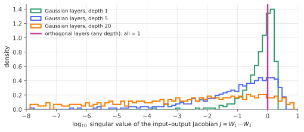

# Free probability II: the S-transform & products

!!! tldr "TL;DR"
    For free positive matrices $A$ and $B$, the spectrum of the product $A^{1/2}BA^{1/2}$ (the same as that of $AB$) depends only on the two spectra, through **free multiplicative convolution**. The **S-transform** linearizes it:
    $S_{AB} = S_AS_B$. Two applications follow. A sample covariance is the true covariance freely multiplied by a white Wishart ($S_E = S_\Sigma\cdot\frac{1}{1+qt}$), which recovers the general Marchenko–Pastur equation. And the Jacobian of a deep network is a product of layer
    matrices, so its singular values spread out with depth for Gaussian weights and stay at 1 for orthogonal weights. That is the theory of **dynamical isometry**.

## Why care?

The [previous note](free-probability-r.md) handled sums. Products are just as common:

- **Sample covariances**: $E = \Sigma^{1/2}W\Sigma^{1/2}$ with $W$ a white Wishart matrix. Estimation noise acts *multiplicatively* on the true covariance.
- **Deep networks**: the input–output Jacobian is $J = D_LW_L\cdots D_1W_1$ (weights times diagonal matrices of activation derivatives). Exploding and vanishing gradients are statements about the singular values of this product.
- **Recurrent networks and dynamical systems**: products of many random matrices control stability (Lyapunov exponents).
- **Communication channels**: cascaded or correlated MIMO channels.

The S-transform turns all of these into multiplication of scalar functions. It explains, for example, why **orthogonal initialization** lets very deep networks train while Gaussian initialization of the same variance struggles (Saxe et al., 2014; Pennington, Schoenholz & Ganguli, 2017).

## Building blocks

**The T-transform (moment generating function).** For a positive matrix $A$ with Stieltjes transform $g_A(z) = \varphi\big((z - A)^{-1}\big)$, define

$$
t_A(z) = z\,g_A(z) - 1 = \sum_{k\ge1}\frac{m_k(A)}{z^k},\qquad m_k = \varphi(A^k).
$$

It is invertible near $z = \infty$ (where $t_A\approx m_1/z$). Write $\zeta_A(t)$ for its inverse: $t_A(\zeta_A(t)) = t$.

**The S-transform.**

$$
S_A(t) = \frac{t + 1}{t\,\zeta_A(t)} .
$$

**Sanity checks.** For $A = aI$: $t = \frac{a}{z - a}$, so $\zeta = a\frac{1+t}{t}$ and $S = \frac1a$. A multiple of the identity has a constant S-transform, and $S_{aA} = S_A/a$. Expanding around $t = 0$:

$$
S_A(t) = \frac{1}{m_1} - \frac{m_2 - m_1^2}{m_1^3}\,t + O(t^2),
$$

so $S(0) = 1/(\text{mean})$ and the slope encodes the variance (Exercise 3).

## The main result

!!! theorem "Theorem (Voiculescu: free multiplicative convolution)"
    If $A, B\succeq0$ are free (for instance $B\to OBO^\top$ with Haar $O$), then the spectrum of $A^{1/2}BA^{1/2}$ (equivalently of $AB$) has S-transform

    $$
    S_{AB}(t) = S_A(t)\,S_B(t).
    $$

We take this as given. Proofs go via combinatorics of non-crossing partitions, or via subordination functions as for sums. The important part is how to use it.

### The white Wishart and the MP equation

For a white Wishart $W = \frac1TXX^\top$ with ratio $q = N/T$, substituting $g = (t+1)/z$ into the [Marchenko–Pastur](marchenko-pastur.md) equation $qzg^2 - (z - 1 + q)g + 1 = 0$ gives $\zeta_W(t) = \frac{(t+1)(1+qt)}{t}$, hence (Exercise 2)

$$
S_W(t) = \frac{1}{1 + q\,t}.
$$

**Sample covariance = truth ⊠ noise.** Since $E = \Sigma^{1/2}W\Sigma^{1/2}$ and $W$ is rotationally invariant (hence free from $\Sigma$),

$$
S_E(t) = \frac{S_\Sigma(t)}{1 + q\,t}.
$$

This compact formula is equivalent to the general MP (Silverstein) equation. It also shows how to *invert* the noise: given $S_E$ estimated from data, $S_\Sigma(t) = (1 + qt)S_E(t)$. That is **free deconvolution**, the idea behind [rotationally invariant estimators](rotational-invariant-estimators.md) and [nonlinear shrinkage](nonlinear-shrinkage.md).

At first order: $m_1(E) = m_1(\Sigma)$ (the sample covariance is unbiased), and the variance of the sample eigenvalues equals the variance of the true eigenvalues plus $q\,m_1(\Sigma)^2$ (Exercise 5). That is exactly the "extra dispersion" that [Ledoit–Wolf](ledoit-wolf.md) shrinkage removes.

### Deep linear networks and dynamical isometry

Consider a deep **linear** network with $N\times N$ layers, $J = W_L\cdots W_1$. The singular values of $J$ are the square roots of the eigenvalues of $J^\top J$, a product of free factors.

- **Gaussian layers** ($W_{ij}\sim N(0, 1/N)$, so $\E\|Wx\|^2 = \|x\|^2$): each $W_l^\top W_l$ is a white Wishart with $q = 1$, so

    $$
    S_{J^\top J}(t) = \Big(\frac{1}{1+t}\Big)^L .
    $$

    The mean of $J^\top J$ stays 1, so signals keep their average norm. The variance grows linearly, $m_2 = L + 1$, and the moments are the **Fuss–Catalan numbers** $m_k = \frac{1}{Lk+1}\binom{(L+1)k}{k}$. Many singular values collapse toward 0 and a few grow (the largest approaches $\sqrt{(L+1)^{L+1}/L^L}\approx\sqrt{e(L+1)}$). Gradients get squeezed into a few
    directions: the network is badly conditioned even though "the variance is preserved".
- **Orthogonal layers**: $W_l^\top W_l = I$, $S = 1$, and $J^\top J = I$ at any depth. All singular values equal 1, a perfect **isometry**.

With nonlinearities, $J = D_LW_L\cdots D_1W_1$, and $S_{J^\top J} = \prod_lS_{D_l^2}S_{W_l^\top W_l}$. Pennington, Schoenholz & Ganguli (2017) used this to show that sigmoid/tanh networks with **orthogonal** weights, initialized near the edge of chaos, can achieve *dynamical isometry*
(Jacobian singular values concentrated near 1 at any depth), while ReLU networks and Gaussian weights cannot. This predicts much faster training of very deep networks. Xiao et al. (2018) trained 10,000-layer vanilla CNNs this way.

{ .fig }

## Examples

### Fuss–Catalan moments, checked

```python
import numpy as np
from math import comb
rng = np.random.default_rng(0)
N = 400

def gaussian(N):   return rng.standard_normal((N, N)) / np.sqrt(N)         # E||Wx||^2 = ||x||^2
def orthogonal(N): return np.linalg.qr(rng.standard_normal((N, N)))[0]

# Input-output Jacobian of a deep LINEAR network: J = W_L ... W_1. Free probability: S_{J^T J}(t) = (1/(1+t))^L
# for Gaussian layers, so the moments of J^T J are Fuss–Catalan numbers: m_k = C((L+1)k, k) / (Lk + 1).
for L in [1, 2, 5, 10]:
    for name, layer in [("Gaussian", gaussian), ("orthogonal", orthogonal)]:
        J = np.eye(N)
        for _ in range(L):
            J = layer(N) @ J
        ev = np.linalg.eigvalsh(J.T @ J)
        fc = [comb((L + 1) * k, k) / (L * k + 1) for k in (1, 2, 3)] if name == "Gaussian" else [1, 1, 1]
        print(f"L = {L:2d} {name:10s}  m1 {ev.mean():6.2f} (pred {fc[0]:.0f})   m2 {np.mean(ev**2):7.2f} (pred {fc[1]:.0f})   "
              f"m3 {np.mean(ev**3):8.1f} (pred {fc[2]:.0f})   largest singular value {np.sqrt(ev.max()):.2f}")
# L =  1 Gaussian    m1   1.00 (pred 1)   m2    2.00 (pred 2)   m3      5.0 (pred 5)   largest singular value 1.98
# L =  1 orthogonal  m1   1.00 (pred 1)   m2    1.00 (pred 1)   m3      1.0 (pred 1)   largest singular value 1.00
# L =  2 Gaussian    m1   1.00 (pred 1)   m2    3.06 (pred 3)   m3     12.5 (pred 12)   largest singular value 2.54
# L =  2 orthogonal  m1   1.00 (pred 1)   m2    1.00 (pred 1)   m3      1.0 (pred 1)   largest singular value 1.00
# L =  5 Gaussian    m1   1.00 (pred 1)   m2    6.04 (pred 6)   m3     51.1 (pred 51)   largest singular value 3.64
# L =  5 orthogonal  m1   1.00 (pred 1)   m2    1.00 (pred 1)   m3      1.0 (pred 1)   largest singular value 1.00
# L = 10 Gaussian    m1   0.98 (pred 1)   m2   10.65 (pred 11)   m3    170.2 (pred 176)   largest singular value 5.15
# L = 10 orthogonal  m1   1.00 (pred 1)   m2    1.00 (pred 1)   m3      1.0 (pred 1)   largest singular value 1.00
```

The free-probability predictions match closely. Small deviations at $L = 10$ are finite-$N$ effects, since high moments of products are dominated by a few large singular values. In the figure, the singular values of a depth-20 Gaussian network spread over many orders of magnitude (the smallest ones fall below
$10^{-8}$, off the plot), while orthogonal layers give exactly 1.

## Exercises

!!! question "Exercise 1 · warm-up: scalars and the identity"
    Verify $S_{aI}(t) = 1/a$, and deduce from the theorem that $S_{aA} = S_A/a$. What does $S_{AB} = S_AS_B$ say when $B = cI$?

    ??? success "Solution"
        Computed above: $t = \frac{a}{z-a}$ gives $\zeta = \frac{a(1+t)}{t}$ and $S = \frac{t+1}{t\zeta} = \frac1a$. Scalars are free from everything, so $S_{aA} = S_A\,S_{aI} = S_A/a$. With $B = cI$, the product $cA$ has $S_A/c$, consistent with scaling. Multiplying by a scalar just rescales the spectrum.

!!! question "Exercise 2 · the Wishart S-transform"
    Starting from $qzg^2 - (z - 1 + q)g + 1 = 0$, substitute $g = (t+1)/z$ and solve for $z = \zeta(t)$. Conclude $S_W(t) = \frac{1}{1+qt}$.

    ??? success "Solution"
        $qz\frac{(t+1)^2}{z^2} - (z - 1 + q)\frac{t+1}{z} + 1 = 0$. Multiply by $z$: $q(t+1)^2 - (t+1)(q-1) - z(t+1) + z = 0$, so $-zt = (t+1)\big[(q-1) - q(t+1)\big] = -(t+1)(1 + qt)$. Thus $\zeta = \frac{(t+1)(1+qt)}{t}$ and $S = \frac{t+1}{t\zeta} = \frac{1}{1+qt}$.

!!! question "Exercise 3 · mean and variance of a free product"
    Show that $S_A(t) = \frac1{m_1} - \frac{m_2 - m_1^2}{m_1^3}t + O(t^2)$. Using $S_{AB} = S_AS_B$, express the mean and the variance of the spectrum of $AB$ (for free $A, B$) in terms of the means and variances of the spectra of $A$ and $B$.
    How does the answer differ from the classical formula for commuting independent variables?

    ??? success "Solution"
        $t = \frac{m_1}{z} + \frac{m_2}{z^2} + \dots$ Inverting, $\frac1z = \frac{t}{m_1} - \frac{m_2t^2}{m_1^3} + O(t^3)$, so $S = \frac{t+1}{t}\cdot\frac1z = (t+1)\big(\frac1{m_1} - \frac{m_2t}{m_1^3}\big) + O(t^2) = \frac{1}{m_1} + t\big(\frac{1}{m_1} - \frac{m_2}{m_1^3}\big) + O(t^2) = \frac{1}{m_1} - \frac{m_2 - m_1^2}{m_1^3}t + \dots$

        Write $v = m_2 - m_1^2$ for the variance. Multiplying the expansions: $\frac{1}{m_1(AB)} = \frac{1}{m_1(A)m_1(B)}$, so the means multiply. The $t$-coefficients give $\frac{v_{AB}}{m_1(AB)^3} = \frac{v_A}{m_1(A)^3m_1(B)} + \frac{v_B}{m_1(B)^3m_1(A)}$, hence
        $v_{AB} = v_A\,m_1(B)^2 + v_B\,m_1(A)^2$. (Compare commuting independent variables, which give an extra $+v_Av_B$. Freeness removes the cross term at this order, consistent with $\varphi(abab) = \varphi(a^2)\varphi(b)^2 + \varphi(a)^2\varphi(b^2) - \varphi(a)^2\varphi(b)^2$.)

!!! question "Exercise 4 · depth and conditioning"
    Using $S_{J^\top J} = (1+t)^{-L}$ and Exercise 3, show $m_1 = 1$ and $m_2 = L + 1$ for the deep linear Gaussian network. Interpret the growth of $m_2$ for gradient propagation.

    ??? success "Solution"
        $(1+t)^{-L} = 1 - Lt + O(t^2)$, so $m_1 = 1$ and $\frac{m_2 - m_1^2}{m_1^3} = L$, giving $m_2 = L + 1$. Backpropagated gradients are $J^\top$ times the output gradient. Their *average* squared norm is preserved ($m_1 = 1$), but the spread of squared singular values grows linearly with depth. A typical gradient
        direction is attenuated while a few are amplified, so the effective conditioning worsens with depth. Orthogonal initialization keeps $m_2 = 1$ (zero spread).

!!! question "Exercise 5 · stretch: sample-eigenvalue dispersion"
    Using $S_E(t) = S_\Sigma(t)/(1+qt)$ and the expansion of Exercise 3, show that the sample covariance eigenvalues have mean $m_1(\Sigma)$ and variance $\Var_\Sigma + q\,m_1(\Sigma)^2$ (where $\Var_\Sigma$ is the variance of the true eigenvalues). Connect this to the [Ledoit–Wolf](ledoit-wolf.md) decomposition $\delta^2 = \alpha^2 + \beta^2$ with $\beta^2\approx q\mu^2$.

    ??? success "Solution"
        $\frac{1}{1+qt} = 1 - qt + \dots$, which corresponds to mean 1 and variance $q$ (the white Wishart). By Exercise 3 with $B = W$: $m_1(E) = m_1(\Sigma)\cdot1$ and $v_E = v_\Sigma\cdot1^2 + q\cdot m_1(\Sigma)^2$.
        In Ledoit–Wolf language, $\delta^2$ (sample dispersion) $= \alpha^2$ (true dispersion, $v_\Sigma$) $+\ \beta^2$ (noise, $q\mu^2$). That is exactly the asymptotic $\beta^2\approx q\mu^2$ derived there, now obtained from free probability in one line.

## Where it shows up

- **Initialization and signal propagation.** Orthogonal initialization (Saxe, McClelland & Ganguli, 2014), dynamical isometry (Pennington et al., 2017, 2018) and "mean-field" signal-propagation theory explain which architectures and initializations train at extreme depth. They influenced the design of very deep CNNs, and the analysis of rank collapse in transformers.
- **RNN stability.** Exploding and vanishing gradients in recurrent networks come from products of Jacobians over time. Unitary/orthogonal RNNs constrain weights to have all singular values 1 for exactly this reason.
- **Covariance cleaning.** $S_E = S_\Sigma/(1+qt)$ is the starting point of free deconvolution, which estimates the true spectrum from the sample one. The Bouchaud–Potters RIE and Ledoit–Wolf nonlinear shrinkage are refined versions.
- **Time-lagged and cross-covariances in finance.** Spectra of products such as $C_{XY}C_{XY}^\top$ (lead–lag relations between assets) under the null of no relation are free products, which gives significance thresholds for "signal" singular values.
- **Wireless and MIMO.** Cascaded channels and correlated fading use S-transforms for capacity calculations.

## Further reading

- J.-P. Bouchaud & M. Potters, *A First Course in Random Matrix Theory* (2020), Ch. 11–13 (T- and S-transforms, conventions used here).
- J. Pennington, S. Schoenholz & S. Ganguli, "Resurrecting the sigmoid in deep learning through dynamical isometry: theory and practice" (NeurIPS 2017).
- A. Saxe, J. McClelland & S. Ganguli, "Exact solutions to the nonlinear dynamics of learning in deep linear neural networks" (ICLR 2014).
- J. A. Mingo & R. Speicher, *Free Probability and Random Matrices* (2017), Ch. 2–3.
