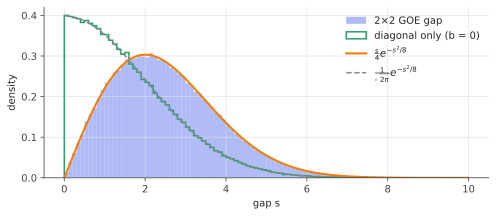
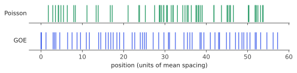

# Gaussian ensembles & eigenvalue repulsion

!!! tldr "TL;DR"
    The Gaussian Orthogonal/Unitary/Symplectic Ensembles (GOE/GUE/GSE) are the simplest random symmetric matrices that look the same in every basis.
    Their eigenvalues have joint density $\propto\prod_{i<j}|\lambda_i-\lambda_j|^\beta e^{-\frac\beta4\sum\lambda_i^2}$. They behave like
    charged particles that **repel**: small gaps are rare, with probability $\propto s^\beta$, and the spectrum is far more regular than
    independent points. These local statistics are **universal**, and they show up everywhere from nuclear physics to neural-network Hessians.

## Why care?

In the 1950s Eugene Wigner faced an impossible problem: computing the energy levels of heavy nuclei like uranium, whose Hamiltonians
are far too complex to write down. His idea was to stop trying. Model the Hamiltonian as a *random* symmetric matrix that respects only the
system's symmetries, and ask which spectral features are **typical**. The surprise was that the *spacings* between neighbouring levels
matched experiment beautifully.

The same statistics were later found in the zeros of the Riemann zeta function (Montgomery–Dyson), in chaotic quantum billiards, in bus
arrival times in Cuernavaca, in eigenvalues of stock correlation matrices, and in the Hessians of trained neural networks. Whenever a large
system is complex enough, its spectrum "forgets" the details and keeps only RMT statistics.

For us this gives two things:

1. a **null model**: if your spectrum looks like this, it is (locally) indistinguishable from noise;
2. the **basic mechanism**, eigenvalue repulsion, behind the rigidity of every spectrum in the rest of the RMT track.

## Building blocks

**What do "random" and "symmetric" mean together?** We want a distribution on real symmetric $n\times n$ matrices that

- (a) has **independent** entries (up to symmetry), and
- (b) is **orthogonally invariant**: $QHQ^\top \overset{d}{=} H$ for every fixed orthogonal $Q$, so no basis is special.

A classical theorem says that (a) + (b) force the entries to be Gaussian. The resulting ensemble is the **GOE**:

$$
H = \frac{G + G^\top}{\sqrt 2}, \quad G_{ij}\overset{iid}{\sim}N(0,1)
\qquad\Longleftrightarrow\qquad
p(H) \propto \exp\!\Big(-\tfrac14 \tr H^2\Big).
$$

Off-diagonal entries are $N(0,1)$ and diagonal entries are $N(0,2)$. Invariance is visible in the density: $\tr (QHQ^\top)^2 = \tr H^2$.

Changing the number field gives three ensembles, indexed by the **Dyson index** $\beta$ (the number of real parameters per off-diagonal entry):

| Ensemble | Matrices | Invariance | $\beta$ |
|---|---|---|---|
| GOE | real symmetric | orthogonal | 1 |
| GUE | complex Hermitian | unitary | 2 |
| GSE | quaternionic self-dual | symplectic | 4 |

With off-diagonal entries normalized to $\E|H_{ij}|^2 = 1$ (and diagonal variance $2/\beta$), all three have density $\propto e^{-\frac\beta4\tr H^2}$.

## The main result

!!! theorem "Theorem (joint eigenvalue density)"
    The unordered eigenvalues of the Gaussian $\beta$-ensemble have joint density

    $$
    p(\lambda_1,\dots,\lambda_n) \;=\; \frac{1}{Z_{n,\beta}}\;\prod_{i<j}|\lambda_i - \lambda_j|^{\beta}\;\exp\!\Big(-\frac{\beta}{4}\sum_{i=1}^n \lambda_i^2\Big).
    $$

The Gaussian factor is no surprise: $\tr H^2 = \sum_i\lambda_i^2$. The interesting part is the **Vandermonde factor** $\prod|\lambda_i-\lambda_j|^\beta$,
which vanishes whenever two eigenvalues collide. Where does it come from?

### Start with $n = 2$: the whole story in miniature

Take $H = \begin{pmatrix} a & b\\ b & c\end{pmatrix}$ with $a, c\sim N(0,2)$ and $b\sim N(0,1)$, all independent. The eigenvalues are
$\frac{a+c}{2}\pm\sqrt{\big(\frac{a-c}{2}\big)^2 + b^2}$, so the gap is

$$
s = \sqrt{(a-c)^2 + (2b)^2}.
$$

Now $a - c\sim N(0,4)$ and $2b\sim N(0,4)$ are independent, so $s = 2\sqrt{Z_1^2 + Z_2^2}$, a **Rayleigh** variable:

$$
p(s) = \frac{s}{4}\,e^{-s^2/8}.
$$

Near $s = 0$ the density vanishes linearly. **Why?** A degeneracy needs *two* independent accidents at once: $a = c$ **and** $b = 0$. The set of
degenerate matrices (multiples of $I$) has codimension 2 in the 3-dimensional space of $2\times2$ symmetric matrices. In polar coordinates
around that set, the probability of being within $s$ of it scales as $s^2$, so the density scales as $s^1$.

If you drop the off-diagonal term ($b = 0$), you need only one accident, and $s = |a - c|$ has a density that is *maximal* at $0$:

{ .fig }

For complex Hermitian $H$, $b$ has two real components, so degeneracy needs three accidents and $p(s)\propto s^2$. For quaternions, five accidents
and $s^4$. That is the meaning of $\beta$: **codimension of degeneracy minus one**. Rescaling the $n=2$ result to mean spacing 1 gives the
**Wigner surmise**, which turns out to be an excellent approximation for large $n$ too:

$$
p_{\beta=1}(s) = \frac{\pi}{2}\,s\,e^{-\pi s^2/4},\qquad
p_{\beta=2}(s) = \frac{32}{\pi^2}\,s^2\,e^{-4s^2/\pi}.
$$

### General $n$: the Jacobian

Diagonalize $H = Q\Lambda Q^\top$ and ask how a small change $dH$ splits into changes $d\Lambda$ of the eigenvalues and $dQ$ of the eigenvectors.
Set $d\Omega = Q^\top dQ$. It is antisymmetric, because differentiating $Q^\top Q = I$ gives $dQ^\top Q + Q^\top dQ = 0$. Then

$$
Q^\top\, dH\, Q \;=\; d\Lambda + d\Omega\,\Lambda - \Lambda\,d\Omega,
\qquad\text{so}\qquad
(Q^\top dH\,Q)_{ii} = d\lambda_i,\quad (Q^\top dH\,Q)_{ij} = (\lambda_j - \lambda_i)\,d\Omega_{ij}.
$$

Conjugation by $Q$ preserves volume, so the volume element is

$$
dH \;=\; \prod_{i<j}|\lambda_i - \lambda_j|\;\prod_i d\lambda_i\;\prod_{i<j}d\Omega_{ij}.
$$

When two eigenvalues are close, a large rotation of their eigenvectors produces only a small change in $H$, so little volume of
matrix space corresponds to near-degenerate spectra. Integrating out $Q$ (the density doesn't depend on it) leaves $\prod|\lambda_i-\lambda_j|$.
In the complex case each $d\Omega_{ij}$ has 2 real components, giving $|\lambda_i-\lambda_j|^2$, and so on.

### The Coulomb gas picture

Write the density as $e^{-\beta\, \mathcal H(\lambda)}$ with

$$
\mathcal H(\lambda) = \sum_i \frac{\lambda_i^2}{4} \;-\; \sum_{i<j}\log|\lambda_i - \lambda_j|.
$$

This is the Gibbs measure of $n$ charged particles on a line, confined by a quadratic potential and repelling each other through a logarithmic
(2D Coulomb) interaction, at inverse temperature $\beta$. Two consequences:

- **Global shape.** For large $n$ the energy is dominated by its minimizer. Balancing confinement ($\sim n\lambda^2$) against repulsion ($\sim n^2$)
  gives $\lambda\sim\sqrt n$, and the equilibrium density of $\lambda/\sqrt n$ is the **semicircle** on $[-2,2]$. We derive this properly in the
  [semicircle law](wigner-semicircle.md) note.
- **Local rigidity.** The particles form an almost-crystal. The number of eigenvalues in an interval containing $L$ of them on average has variance
  only $\sim\frac{2}{\beta\pi^2}\log L$, versus $L$ for independent (Poisson) points.

{ .fig }

!!! info "Universality"
    The Gaussian assumption is a convenience. For **Wigner matrices** (independent entries with mean 0, variance 1, any distribution with enough
    moments), the local eigenvalue statistics in the bulk converge to the same GOE/GUE limits. This was conjectured by Wigner, Dyson and Mehta,
    and proven around 2010 by Erdős–Schlein–Yau and Tao–Vu. This is why the Gaussian ensembles are worth studying.

## Examples

### Measuring repulsion without unfolding

To compare spacings with the Wigner surmise, you must first **unfold** the spectrum: map eigenvalues through the cumulative global density
so that the mean spacing is 1 everywhere. A neat trick avoids this. The ratio of consecutive gaps $r_i = \min(s_i,s_{i+1})/\max(s_i,s_{i+1})$
doesn't depend on the local density, and its mean is a fingerprint: $\langle r\rangle\approx 0.386$ (Poisson), $0.531$ (GOE), $0.600$ (GUE).

```python
import numpy as np
rng = np.random.default_rng(0)

def goe(n):
    G = rng.standard_normal((n, n))
    return (G + G.T) / np.sqrt(2)          # off-diagonal N(0,1), diagonal N(0,2)

def gue(n):
    G = rng.standard_normal((n, n)) + 1j * rng.standard_normal((n, n))
    return (G + G.conj().T) / 2            # E|H_ij|^2 = 1 off the diagonal

def mean_r(levels):
    """Average gap ratio <min(s_i, s_i+1) / max(s_i, s_i+1)>: needs no unfolding."""
    s = np.diff(np.sort(levels))
    return np.mean(np.minimum(s[1:], s[:-1]) / np.maximum(s[1:], s[:-1]))

n = 1000
bulk = slice(n // 4, 3 * n // 4)                       # stay away from the edges
print("Poisson:", round(mean_r(rng.uniform(size=n)[bulk]), 3))   # 0.388
print("GOE    :", round(mean_r(np.linalg.eigvalsh(goe(n))[bulk]), 3))   # 0.536
print("GUE    :", round(mean_r(np.linalg.eigvalsh(gue(n))[bulk]), 3))   # 0.599
```

This is a practical diagnostic: compute $\langle r\rangle$ for the bulk eigenvalues of *your* matrix (a correlation matrix, a Hessian, a weight matrix)
and see which class it falls into.

### Play with $\beta$

The widget samples Gaussian $\beta$-ensembles of size 300 using the Dumitriu–Edelman tridiagonal model, which works for *any* $\beta>0$
(including the non-physical ones). It unfolds the bulk with the semicircle and histograms the spacings. Switch between $\beta = 0, 1, 2, 4$ and
watch the gap at $s=0$ open up.

<div class="widget" data-widget="beta-spacing"></div>

## Exercises

!!! question "Exercise 1 · warm-up: reading off the variances"
    Expand $\tr H^2$ in terms of the entries of a symmetric $H$, and check that $p(H)\propto e^{-\tr H^2/4}$ means $H_{ii}\sim N(0,2)$ and $H_{ij}\sim N(0,1)$ for $i<j$, all independent.

    ??? success "Solution"
        $\tr H^2 = \sum_{i,j} H_{ij}H_{ji} = \sum_i H_{ii}^2 + 2\sum_{i<j}H_{ij}^2$. So
        $e^{-\tr H^2/4} = \prod_i e^{-H_{ii}^2/4}\prod_{i<j}e^{-H_{ij}^2/2}$. The density factorizes (independence), with variance $2$ on the diagonal
        and $1$ off it.

!!! question "Exercise 2 · invariance"
    Show that if $H\sim$ GOE and $Q$ is a fixed orthogonal matrix, then $QHQ^\top\sim$ GOE. Then show that the eigenvector matrix of a GOE matrix
    is Haar-distributed (uniform on the orthogonal group) and independent of the eigenvalues. You may argue informally.

    ??? success "Solution"
        The map $\phi(H) = QHQ^\top$ is linear on the space of symmetric matrices and preserves the Frobenius inner product
        $\langle H, K\rangle = \tr(HK)$. So it is an orthogonal transformation of that space, with $|\det| = 1$. The density $e^{-\tr H^2/4}$ is unchanged,
        so $\phi(H)$ has the same law.

        For the eigenvectors: $QHQ^\top$ has the same eigenvalues as $H$ and eigenvectors $QU$. Since $QHQ^\top \overset d= H$, the pair
        $(\Lambda, QU)$ has the same law as $(\Lambda, U)$ for every $Q$. So, conditional on $\Lambda$, the law of $U$ is invariant under left multiplication,
        which characterizes Haar measure. (Sign/ordering ambiguities are fixed by convention.) Upshot: **GOE eigenvectors are uniformly random
        directions**, the "delocalization" that RMT tests in real data.

!!! question "Exercise 3 · general $\beta$ for $n=2$"
    Starting from the joint density with $n = 2$, change variables to the centre $m = (\lambda_1+\lambda_2)/2$ and gap $s = |\lambda_1-\lambda_2|$, and show
    $p(s)\propto s^\beta e^{-\beta s^2/8}$. Check that $\beta = 1$ recovers the Rayleigh law above.

    ??? success "Solution"
        $\lambda_{1,2} = m\pm s/2$, so $\lambda_1^2+\lambda_2^2 = 2m^2 + s^2/2$, and the Jacobian of $(\lambda_1,\lambda_2)\mapsto(m,s)$ is constant.
        The density becomes $\propto s^\beta\, e^{-\beta m^2/2}\,e^{-\beta s^2/8}$. It factorizes, and integrating out $m$ leaves
        $p(s)\propto s^\beta e^{-\beta s^2/8}$. For $\beta = 1$: $s\,e^{-s^2/8}$, normalized to $\frac s4 e^{-s^2/8}$. ✓

!!! question "Exercise 4 · avoided crossings"
    Consider a smooth one-parameter family $H(t) = A + tB$ of real symmetric matrices with $A, B$ "generic". Using the codimension count, argue why
    the eigenvalue curves generically **never cross**. Then explain what changes for a family of *complex Hermitian* matrices with **two** real parameters.
    (Compare with the eigenvalue curves in the [Weyl widget](courant-fischer-weyl.md#watch-it-happen).)

    ??? success "Solution"
        For real symmetric matrices, degeneracy of a pair of eigenvalues is a codimension-2 condition (in the $2\times 2$ block of the two eigenvectors:
        equal diagonal entries **and** zero off-diagonal entry). A generic curve, which has dimension 1, misses a codimension-2 set, just as a generic line
        in $\R^3$ misses a given line. So the sorted curves approach and then veer apart. This is the von Neumann–Wigner "no-crossing rule".

        For complex Hermitian matrices the codimension is 3. A generic one-parameter family still avoids crossings, and even a two-parameter family
        (a surface) generically misses a codimension-3 set. Degeneracies appear only in 3-parameter families, as isolated points: the "Dirac cones"
        and "Weyl points" of condensed-matter physics.

!!! question "Exercise 5 · stretch: the largest eigenvalue's scale"
    Use the Coulomb-gas energy $\mathcal H(\lambda) = \sum_i\lambda_i^2/4 - \sum_{i<j}\log|\lambda_i-\lambda_j|$ to argue *heuristically* that the
    eigenvalues of a GOE matrix are of order $\sqrt n$. (Hint: substitute $\lambda_i = L x_i$ with $x_i = O(1)$ and find the $L$ that balances the two terms.)

    ??? success "Solution"
        With $\lambda_i = Lx_i$: the confinement term is $\approx \frac{L^2}{4}\sum_i x_i^2 \sim L^2 n$. The repulsion term is
        $-\sum_{i<j}\log|x_i-x_j| - \binom n2\log L$. The $\log L$ piece is just a constant shift, and the remaining part is $\sim n^2$ (there are $\sim n^2$ pairs,
        each contributing $O(1)$). Balancing $L^2 n\sim n^2$ gives $L\sim\sqrt n$. The precise minimization (next notes) gives the semicircle on
        $[-2\sqrt n, 2\sqrt n]$. A sanity check: $\E\tr H^2 = \sum_i 2 + \sum_{i\neq j}1 = n(n+1)$, so the "average" $\lambda_i^2$ is about $n$. ✓

## Where it shows up

- **Signal vs. noise in finance.** Laloux et al. and Plerou et al. (1999) found that most eigenvalues of stock-return correlation matrices
  have GOE spacing statistics and a bulk density consistent with pure noise. Only a handful of outliers (the market mode, sectors) carry information.
  This observation started the RMT approach to [covariance cleaning](clipping-factor-models.md).
- **Loss landscapes.** Baskerville et al. (2022) found GOE-like local spacing statistics in the Hessians of trained deep networks, which supports
  modelling the Hessian bulk as a random matrix (and justifies RMT-based analyses of optimization).
- **Weight spectra.** The bulk of a trained layer's singular values often matches random-matrix predictions, while deviations (heavy tails, outliers)
  correlate with learned structure. This is the basis of [heavy-tailed self-regularization](heavy-tailed-rmt.md) diagnostics.
- **Diverse sampling.** GUE eigenvalues are the prototypical **determinantal point process** (DPP). DPPs are used in ML to select diverse subsets,
  for example diverse mini-batches, recommendations, or summaries, because they inherit exactly this repulsion.
- **Quantum chaos and number theory.** The Bohigas–Giannoni–Schmit conjecture (chaotic systems have GOE/GUE statistics) and Montgomery's pair
  correlation of zeta zeros (matching the GUE) are two of the most striking appearances of universality.

## Further reading

- M. L. Mehta, *Random Matrices*. The classic, encyclopedic.
- G. Livan, M. Novaes & P. Vivo, *Introduction to Random Matrices: Theory and Practice* (2018). Short, friendly, with code. Chapters 1–5 cover this note.
- I. Dumitriu & A. Edelman, "Matrix models for beta ensembles" (2002). The tridiagonal model used in the widget.
- Y. Y. Atas et al., "Distribution of the ratio of consecutive level spacings in random matrix ensembles" (PRL 2013).
