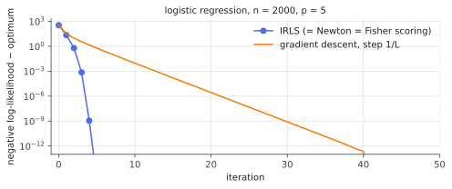

# Generalized linear models & IRLS

!!! tldr "TL;DR"
    A GLM models a response from an [exponential family](exponential-families.md) whose mean is tied to a linear predictor through a **link function**: $g(\E[y\mid x]) = x^\top\beta$. Logistic, Poisson and gamma regression
    are all GLMs. With the **canonical link** the log-likelihood is concave, the score is $X^\top(y - \mu)$ ("prediction minus target", again), and the Fisher information is $X^\top WX$. The standard fitting algorithm, **iteratively
    reweighted least squares** (IRLS), is Newton's method written as a sequence of weighted least-squares problems, and it converges in a handful of iterations.

## Why care?

Linear regression assumes continuous, unbounded, homoskedastic responses. Real targets are often binary (default/no default, click/no click), counts (insurance claims, trades per minute, spikes per bin), or positive and skewed
(claim sizes, durations). GLMs extend least squares to all of these while keeping its interpretability, its fast and reliable fitting, and its inference machinery.

They are also everywhere in ML. Logistic regression is the last layer of every binary classifier trained with cross-entropy. Large-scale click-through-rate models are (enormous, sparse) GLMs. Insurance pricing is built almost entirely on
Poisson and gamma GLMs. Many results that look specific to neural networks ("the gradient of cross-entropy is $p - y$", "the Fisher is $J^\top WJ$") are GLM facts.

## Building blocks

**Three ingredients.**

1. *Random component:* $y_i\mid x_i$ follows an exponential dispersion family
   $p(y\mid\theta,\phi) = \exp\Big(\frac{y\theta - b(\theta)}{\phi} + c(y,\phi)\Big)$, with mean $\mu = b'(\theta)$ and variance $\phi\,b''(\theta) = \phi\,V(\mu)$.
2. *Linear predictor:* $\eta_i = x_i^\top\beta$ (plus an optional known **offset**).
3. *Link function:* $g(\mu_i) = \eta_i$, a monotone map from the mean's range to $\R$.

**Variance functions** characterize the family:

| family | range of $y$ | $V(\mu)$ | canonical link $g(\mu) = \theta$ |
|---|---|---|---|
| Gaussian | $\R$ | $1$ | identity |
| Bernoulli/binomial | $\{0,1\}$ | $\mu(1-\mu)$ | logit $\log\frac{\mu}{1-\mu}$ |
| Poisson | $\{0,1,\dots\}$ | $\mu$ | $\log\mu$ |
| Gamma | $(0,\infty)$ | $\mu^2$ | $-1/\mu$ (the log link is more common in practice) |

**Canonical link.** If $g = (b')^{-1}$, the natural parameter itself is linear: $\theta_i = x_i^\top\beta$. This choice gives the cleanest algebra, though non-canonical links (probit, the log link for gamma) are also used.

## The main results

### Likelihood, score and information

With the canonical link (and $\phi = 1$ for simplicity), the log-likelihood is

$$
\ell(\beta) = \sum_i\big[y_i\,x_i^\top\beta - b(x_i^\top\beta)\big] + \text{const}.
$$

!!! theorem "Theorem (canonical-link GLMs)"
    $\ell$ is concave in $\beta$, with

    $$
    \nabla\ell(\beta) = X^\top(y - \mu),\qquad -\nabla^2\ell(\beta) = X^\top WX,\qquad W = \diag\big(V(\mu_i)\big),
    $$

    where $\mu_i = b'(x_i^\top\beta)$. The observed and expected information coincide. If $X$ has full column rank and the MLE exists, it is unique, and under standard regularity conditions
    $\hat\beta\approx N\big(\beta,\ \phi\,(X^\top WX)^{-1}\big)$.

**Proof.** Since $\frac{d}{d\beta}b(x_i^\top\beta) = b'(x_i^\top\beta)\,x_i = \mu_ix_i$, the gradient is $\sum_i(y_i - \mu_i)x_i$. Differentiating again, $d\mu_i = b''(\eta_i)x_i^\top d\beta = V(\mu_i)x_i^\top d\beta$, so the Hessian is $-\sum_iV(\mu_i)x_ix_i^\top = -X^\top WX\preceq0$.
It doesn't involve $y$, so it equals its expectation. The asymptotic normality is the usual MLE theory with Fisher information $X^\top WX/\phi$ ([Fisher information](fisher-kl-cramer-rao.md)). $\square$

The **score equations** $X^\top(y - \hat\mu) = 0$ say that residuals are orthogonal to every feature, just like OLS's normal equations. With an intercept, the fitted means sum to the observed total. That is the "balance property"
actuaries rely on when pricing.

### IRLS: Newton's method as weighted least squares

Newton's step is $\beta^{+} = \beta + (X^\top WX)^{-1}X^\top(y - \mu)$. Multiply through by $X^\top WX$ and regroup:

$$
\beta^{+} = (X^\top WX)^{-1}X^\top W\,z,\qquad z = \eta + W^{-1}(y - \mu)\quad(\text{the "working response"}).
$$

Each Newton step is a **weighted least-squares regression** of the working response $z$ on $X$ with weights $W$. Then $\mu$, $W$ and $z$ are recomputed and the regression repeated, hence the name. For a general (non-canonical) link,
the same derivation with Fisher scoring gives $W_{ii} = \big[V(\mu_i)g'(\mu_i)^2\big]^{-1}$ and $z_i = \eta_i + (y_i - \mu_i)g'(\mu_i)$.

Why weights? Observations with small variance $V(\mu)$ are more informative and get more weight. The working response linearizes the link around the current fit. Because it's Newton's method, convergence is **quadratic** near the optimum,
typically 5–10 iterations regardless of $n$.

{ .fig }

### Deviance, offsets and overdispersion

- **Deviance** $D = 2[\ell_{\text{saturated}} - \ell(\hat\beta)]$ generalizes the residual sum of squares. For Poisson, $D = 2\sum_i\big[y_i\log\frac{y_i}{\hat\mu_i} - (y_i - \hat\mu_i)\big]$, a sum of the KL divergences from the [exponential-families](exponential-families.md) note.
  Differences in deviance between nested models give likelihood-ratio tests.
- **Offsets** handle exposure. If policy $i$ is observed for $e_i$ years, model $\mu_i = e_i\exp(x_i^\top\beta)$, i.e. $\log\mu_i = x_i^\top\beta + \log e_i$, with $\log e_i$ as a fixed offset. Then $e^{\beta_j}$ is a **rate ratio**.
- **Overdispersion.** Real counts often have variance larger than the Poisson mean. The *quasi-likelihood* fix keeps the score equations (which only need the mean and variance function), estimates
  $\phi$ from Pearson residuals, and inflates standard errors by $\sqrt{\hat\phi}$ (Exercise 5). Alternatively, use negative binomial regression or [sandwich](delta-sandwich.md) standard errors.

!!! warning "Separation in logistic regression"
    If a hyperplane perfectly separates the 0s from the 1s, the logistic likelihood keeps increasing as $\|\beta\|\to\infty$ along the separating direction, and **no MLE exists** (Exercise 3). IRLS then diverges and reports huge
    coefficients and standard errors. This happens easily with many features or rare events. The cures are regularization (ridge or LASSO logistic regression) or Firth's bias-reduced likelihood. In high dimensions even non-separable data give
    badly biased MLEs ([high-dimensional MLE](high-dim-mle.md)).

## Examples

### Insurance claims with exposure

```python
import numpy as np
rng = np.random.default_rng(0)

def irls(X, y, family, offset=None, tol=1e-10, max_iter=50):
    """Canonical-link GLM by iteratively reweighted least squares. Returns beta, covariance, iterations."""
    n, p = X.shape
    offset = np.zeros(n) if offset is None else offset
    mean_fn, var_fn = {"poisson": (np.exp, lambda m: m),
                       "logistic": (lambda e: 1 / (1 + np.exp(-e)), lambda m: m * (1 - m))}[family]
    beta = np.zeros(p)
    for it in range(1, max_iter + 1):
        eta = X @ beta + offset
        mu = mean_fn(eta)
        W = var_fn(mu)                                   # canonical link: weights = variance function
        z = (eta - offset) + (y - mu) / W                # working response
        beta_new = np.linalg.solve(X.T @ (W[:, None] * X), X.T @ (W * z))
        if np.max(np.abs(beta_new - beta)) < tol:
            beta = beta_new; break
        beta = beta_new
    mu = mean_fn(X @ beta + offset)
    cov = np.linalg.inv(X.T @ (var_fn(mu)[:, None] * X))  # inverse Fisher information
    return beta, cov, it

# Insurance-style claim counts: each policy observed for a different exposure (years); log(exposure) is an offset.
n = 5000
age = rng.uniform(18, 80, n); urban = rng.integers(0, 2, n); exposure = rng.uniform(0.2, 1.0, n)
X = np.column_stack([np.ones(n), (age - 50) / 10, urban])
beta_true = np.array([-2.0, -0.15, 0.5])                 # baseline rate e^-2 ≈ 0.135 claims/year
y = rng.poisson(exposure * np.exp(X @ beta_true))
beta, cov, iters = irls(X, y, "poisson", offset=np.log(exposure))
for name, b, s, bt in zip(["intercept", "age/10", "urban"], beta, np.sqrt(np.diag(cov)), beta_true):
    print(f"{name:10s} estimate {b:+.3f}  (SE {s:.3f})   true {bt:+.3f}   rate ratio e^b = {np.exp(b):.2f}")
print(f"converged in {iters} IRLS iterations")
# intercept  estimate -1.983  (SE 0.069)   true -2.000   rate ratio e^b = 0.14
# age/10     estimate -0.127  (SE 0.024)   true -0.150   rate ratio e^b = 0.88
# urban      estimate +0.481  (SE 0.087)   true +0.500   rate ratio e^b = 1.62
# converged in 7 IRLS iterations
```

All estimates are within about one standard error of the truth. Urban policies have $e^{0.48}\approx1.6$ times the claim rate, and each extra decade of age multiplies the rate by about $0.88$. Without the offset, policies observed for short periods
would look artificially safe.

## Exercises

!!! question "Exercise 1 · warm-up: variance functions"
    From $\mu = b'(\theta)$ and $V(\mu) = b''(\theta)$, derive $V(\mu)$ for Poisson ($b = e^\theta$), Bernoulli ($b = \log(1+e^\theta)$) and Gaussian ($b = \theta^2/2$).

    ??? success "Solution"
        Poisson: $\mu = e^\theta$ and $b'' = e^\theta = \mu$. Bernoulli: $\mu = \sigma(\theta)$ and $b'' = \sigma(1-\sigma) = \mu(1-\mu)$. Gaussian: $\mu = \theta$ and $b'' = 1$. The variance function tells you how noise scales with the mean: constant, proportional, or binomial.

!!! question "Exercise 2 · IRLS is Newton"
    Show algebraically that $(X^\top WX)^{-1}X^\top Wz$ with $z = \eta + W^{-1}(y - \mu)$ equals $\beta + (X^\top WX)^{-1}X^\top(y-\mu)$ for the canonical link.

    ??? success "Solution"
        $X^\top Wz = X^\top W\eta + X^\top(y - \mu) = X^\top WX\beta + X^\top(y - \mu)$, using $\eta = X\beta$ (no offset). Multiplying by $(X^\top WX)^{-1}$ gives $\beta + (X^\top WX)^{-1}X^\top(y - \mu)$, the Newton step with gradient $X^\top(y-\mu)$ and Hessian $-X^\top WX$.

!!! question "Exercise 3 · separation"
    Suppose some $v$ satisfies $x_i^\top v > 0$ whenever $y_i = 1$ and $x_i^\top v < 0$ whenever $y_i = 0$. Show that the logistic log-likelihood $\ell(tv)$ is increasing in $t$ and tends to $0$, its supremum, as $t\to\infty$. Conclude that the MLE doesn't exist.

    ??? success "Solution"
        $\ell(\beta) = \sum_i[y_i\log\sigma(x_i^\top\beta) + (1-y_i)\log(1 - \sigma(x_i^\top\beta))]\le0$. Along $\beta = tv$: for $y_i = 1$, $\sigma(tx_i^\top v)\uparrow1$, and for $y_i = 0$, $\sigma(tx_i^\top v)\downarrow0$. Each term increases to $0$. The supremum $0$ is not attained at any finite $\beta$,
        so no maximizer exists. Gradient-based fitting runs off to infinity. A ridge penalty makes the objective coercive and restores a unique solution. (Without regularization, gradient descent on separable data converges *in direction* to the max-margin SVM solution.
        That is the implicit bias result of Soudry et al., 2018.)

!!! question "Exercise 4 · reading Poisson coefficients"
    In the model $\log\mu_i = \log e_i + \beta_0 + \beta_1x_i$, show that $e^{\beta_1}$ is the multiplicative change in the expected claim *rate* (claims per unit exposure) per unit increase in $x$. Why would leaving out the offset bias $\beta_1$ if exposure is correlated with $x$?

    ??? success "Solution"
        The rate is $\mu_i/e_i = \exp(\beta_0 + \beta_1x_i)$, and increasing $x$ by 1 multiplies it by $e^{\beta_1}$. Without the offset, the model fits $\log\mu_i = \beta_0 + \beta_1x_i$, so $\beta_1$ absorbs any association between $x$ and exposure. If, say, older policyholders tend to be observed
        longer, the coefficient on age would mix the genuine rate effect with the exposure effect. This is omitted-variable bias with a coefficient that is known to be 1.

!!! question "Exercise 5 · stretch: quasi-Poisson and overdispersion"
    Suppose $\E[y_i\mid x_i] = \mu_i = \exp(x_i^\top\beta)$ correctly, but $\Var(y_i\mid x_i) = \phi\mu_i$ with $\phi > 1$. Show that the Poisson score equations still give a consistent estimate of $\beta$, that its covariance is $\approx\phi(X^\top WX)^{-1}$, and that
    $\hat\phi = \frac{1}{n-p}\sum_i\frac{(y_i - \hat\mu_i)^2}{\hat\mu_i}$ is a sensible estimate. What goes wrong if you ignore $\phi$?

    ??? success "Solution"
        The score $U(\beta) = X^\top(y - \mu)$ has mean zero at the true $\beta$ whenever the mean model is right, so its root is consistent (an estimating-equation argument). Linearizing, $\hat\beta - \beta\approx(X^\top WX)^{-1}U(\beta)$ with $\Cov U = X^\top\Cov(y)X = \phi X^\top WX$, giving
        $\Cov\hat\beta\approx\phi(X^\top WX)^{-1}$. Pearson residuals $(y_i - \mu_i)/\sqrt{\mu_i}$ have variance $\phi$, hence $\hat\phi$ (with $n - p$ for the degrees of freedom used). Ignoring $\phi$ makes standard errors too small by $\sqrt\phi$, so confidence intervals
        undercover and spurious effects look significant. That is a common failure with real count data. The general fix, robust to any variance misspecification, is the [sandwich estimator](delta-sandwich.md).

## Where it shows up

- **Classification heads and cross-entropy.** A neural network with a sigmoid or softmax head is a GLM on learned features. The "prediction minus target" gradient, the Gauss–Newton/Fisher matrix $J^\top WJ$ (used by K-FAC and natural-gradient methods)
  and temperature calibration are all GLM structure.
- **Click-through-rate and recommendation models.** Industrial CTR systems trained logistic regression with billions of sparse features (for example FTRL-Proximal at Google, McMahan et al., 2013) before deep models took over. They remain
  strong baselines and feature-interaction layers.
- **Insurance and credit.** Actuarial pricing uses Poisson GLMs for claim frequency and gamma GLMs for claim severity, with exposure offsets. Credit scoring uses logistic regression for regulatory interpretability.
- **Market microstructure.** Counts of trades, quotes or order arrivals per time bin are modelled with Poisson-type GLMs (or Hawkes processes, their self-exciting cousins) with intraday seasonality as covariates.
- **Neuroscience.** Poisson GLMs of spike trains, with stimulus filters and spike-history terms, are the standard encoding model.

## Further reading

- P. McCullagh & J. A. Nelder, *Generalized Linear Models* (2nd ed., 1989). The classic.
- A. Agresti, *Foundations of Linear and Generalized Linear Models* (2015).
- E. Ohlsson & B. Johansson, *Non-Life Insurance Pricing with Generalized Linear Models* (2010).
- D. Soudry, E. Hoffer, M. S. Nacson, S. Gunasekar & N. Srebro, "The implicit bias of gradient descent on separable data" (*JMLR*, 2018).
