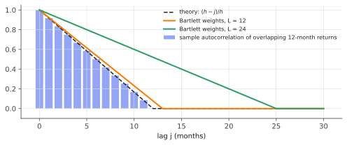

# HAC standard errors (Newey–West)

!!! tldr "TL;DR"
    With time-series data, the terms of a sum are correlated, and $\Var(\sum_t\psi_t)\approx T\,\Omega$, where $\Omega = \sum_{k=-\infty}^{\infty}\Gamma_k$ is the **long-run variance** (the sum of all autocovariances), not $T\Gamma_0$. The **Newey–West** estimator
    $\hat\Omega = \hat\Gamma_0 + \sum_{k=1}^{L}\big(1 - \frac{k}{L+1}\big)(\hat\Gamma_k + \hat\Gamma_k^\top)$ estimates it consistently and is always positive semidefinite. Plugged into the [sandwich](delta-sandwich.md), it gives heteroskedasticity-and-autocorrelation-consistent (**HAC**) standard errors.
    They are essential for overlapping returns, persistent regressors and autocorrelated strategy returns. In small samples they are still too optimistic.

## Why care?

Most uncertainty formulas assume independent observations. Time series rarely cooperate:

- **Overlapping returns.** Regress 12-month-ahead returns on a predictor using monthly data, and consecutive observations share 11 months of returns. The "600 observations" carry the information of about 50.
- **Autocorrelated strategy returns.** Smoothed or illiquid assets (private equity, some hedge funds) show positive autocorrelation, which makes Sharpe ratios look much better than they are (Lo, 2002).
- **Forecast evaluation.** Comparing two forecasting models with the Diebold–Mariano test needs the long-run variance of loss differences, which are serially correlated whenever the forecast horizon exceeds one step.
- **MCMC.** The Monte Carlo error of an average over a Markov chain is governed by exactly the same long-run variance. "Effective sample size" is $T\Gamma_0/\Omega$.

Using i.i.d. formulas in these settings produces t-statistics that are far too large. The simulation below finds a 56% false-positive rate for a nominal 5% test.

## Building blocks

**Stationary series.** $\{\psi_t\}$ (scalar or vector) with mean zero and autocovariances $\Gamma_k = \E[\psi_t\psi_{t-k}^\top]$, $\Gamma_{-k} = \Gamma_k^\top$.

**Variance of a sum.** $\Var\big(\sum_{t=1}^T\psi_t\big) = \sum_{s,t}\Gamma_{t-s} = T\sum_{|k|<T}\big(1 - \frac{|k|}{T}\big)\Gamma_k$. If the autocovariances are summable,

$$
\frac1T\Var\Big(\sum_{t=1}^T\psi_t\Big)\;\to\;\Omega = \sum_{k=-\infty}^{\infty}\Gamma_k = 2\pi f(0),
$$

the **long-run variance**, equal to $2\pi$ times the spectral density at frequency zero. Positive autocorrelation inflates it and negative autocorrelation deflates it.

**Example: AR(1).** $\psi_t = \rho\psi_{t-1} + \varepsilon_t$ has $\Gamma_k = \gamma_0\rho^{|k|}$ and $\Omega = \gamma_0\frac{1+\rho}{1-\rho}$. With $\rho = 0.5$ the variance of the mean is 3 times the i.i.d. formula, and with $\rho = 0.9$ it is 19 times.

**Example: overlapping sums.** If $y_t = r_{t+1} + \dots + r_{t+h}$ with i.i.d. $r$, then $\operatorname{corr}(y_t, y_{t-j}) = \frac{h-j}{h}$ for $j < h$. The triangle in the figure below shows this, and $\Omega = h^2\Var(r)$, i.e. $h$ times $\Gamma_0 = h\Var(r)$.

## The main result

!!! theorem "Theorem (Newey & West, 1987)"
    Let $\hat\Gamma_k = \frac1T\sum_{t=k+1}^T\hat\psi_t\hat\psi_{t-k}^\top$, and define

    $$
    \hat\Omega_{\text{NW}} = \hat\Gamma_0 + \sum_{k=1}^{L}w_k\big(\hat\Gamma_k + \hat\Gamma_k^\top\big),\qquad w_k = 1 - \frac{k}{L+1}\quad\text{(Bartlett weights)}.
    $$

    Then (i) $\hat\Omega_{\text{NW}}$ is positive semidefinite for every sample and every $L$, and (ii) under mixing and moment conditions, $\hat\Omega_{\text{NW}}\to\Omega$ in probability if $L\to\infty$ with $L/T\to0$ (and $\psi_t$ estimated at a consistent parameter).

**Why the weights?** The naive truncated sum $\sum_{|k|\le L}\hat\Gamma_k$ can be **negative** (Exercise 3), which is an absurd variance. With Bartlett weights, $\hat\Omega$ is (up to end effects) the average outer product of block sums,

$$
\hat\Omega_{\text{NW}}\approx\frac{1}{T(L+1)}\sum_t\Big(\sum_{j=0}^{L}\psi_{t+j}\Big)\Big(\sum_{j=0}^{L}\psi_{t+j}\Big)^\top\succeq0 .
$$

That expression is also intuitive: it measures how much a **block** of $L+1$ consecutive observations varies, which is what independent-looking chunks of a dependent series do. It is the same idea as the block bootstrap and as "batch means" in MCMC.

**Choosing $L$.** Truncating at lag $L$ ignores autocovariances beyond $L$, and the Bartlett weights shrink those below $L$, so the bias is $O(1/L)$. Estimating more autocovariances adds variance $O(L/T)$. Balancing gives $L\propto T^{1/3}$. Common rules are
$L = \lfloor4(T/100)^{2/9}\rfloor$ and Andrews' (1991) data-driven bandwidth. With overlapping $h$-period returns, $L\ge h - 1$ is the bare minimum, since the MA($h-1$) structure is known.

**HAC regression standard errors.** For OLS with $\psi_t = x_te_t$:

$$
\widehat\Cov(\hat\beta) = (X^\top X)^{-1}\big(T\,\hat\Omega_{\text{NW}}\big)(X^\top X)^{-1}.
$$

With $L = 0$ this is White's heteroskedasticity-robust estimator.

{ .fig }

### Small samples: still too optimistic

HAC standard errors are consistent but often **too small in finite samples**, especially with persistent regressors and long overlaps. $\hat\Omega$ is biased downward, and the t-statistic's distribution has fatter tails than $N(0,1)$. Remedies include
**fixed-$b$** critical values (Kiefer & Vogelsang, 2005, which treat $L/T$ as fixed), Hodrick (1992) standard errors for overlapping returns, using non-overlapping data, or a block bootstrap.

## Examples

### Long-horizon return predictability, under the null

```python
import numpy as np
rng = np.random.default_rng(0)

def newey_west(psi, L):
    """Long-run covariance of the rows of psi (T x k) with Bartlett weights 1 - j/(L+1)."""
    T = len(psi); psi = psi - psi.mean(0)
    omega = psi.T @ psi / T
    for j in range(1, L + 1):
        G = psi[j:].T @ psi[:-j] / T
        omega += (1 - j / (L + 1)) * (G + G.T)
    return omega

def slope_t_stats(y, x, lags):
    X = np.column_stack([np.ones_like(x), x]); T = len(y)
    XtX_inv = np.linalg.inv(X.T @ X); b = XtX_inv @ X.T @ y; e = y - X @ b
    out = {"classical": np.sqrt(XtX_inv[1, 1] * e @ e / (T - 2))}
    for L in lags:
        V = T * XtX_inv @ newey_west(X * e[:, None], L) @ XtX_inv     # HAC sandwich
        out[f"NW L={L}"] = np.sqrt(V[1, 1])
    return {k: b[1] / s for k, s in out.items()}

# Monthly returns are unpredictable (null true). We regress 12-month OVERLAPPING future returns
# on a persistent predictor (like the dividend yield, AR(1) with phi = 0.98) — a classic setup.
T, h, reps = 600, 12, 2000
lags = [0, 12, 24]
rejections = {k: 0 for k in ["classical"] + [f"NW L={L}" for L in lags]}
for _ in range(reps):
    r = rng.standard_normal(T + h)                                  # monthly returns, iid
    x = np.zeros(T + h)
    for t in range(1, T + h): x[t] = 0.98 * x[t - 1] + rng.standard_normal()
    y = np.array([r[t + 1:t + 1 + h].sum() for t in range(T)])      # overlapping 12-month future return
    for k, tstat in slope_t_stats(y, x[:T], lags).items():
        rejections[k] += abs(tstat) > 1.96
for k, v in rejections.items():
    print(f"{k:10s}  rejection rate under the null: {v / reps:.3f}   (nominal 0.05)")
# classical   rejection rate under the null: 0.560   (nominal 0.05)
# NW L=0      rejection rate under the null: 0.565   (nominal 0.05)
# NW L=12     rejection rate under the null: 0.143   (nominal 0.05)
# NW L=24     rejection rate under the null: 0.130   (nominal 0.05)
```

Returns here are *truly unpredictable*, yet the classical t-test "finds" predictability 56% of the time, and heteroskedasticity-robust standard errors ($L = 0$) don't help at all, because the problem is autocorrelation. Newey–West with $L\ge12$ removes most of the distortion, but
**not all**: a 13–14% false-positive rate remains at $T = 600$ months (50 years!) because the predictor is so persistent. Much of the long-horizon predictability literature has been reassessed in this light (Ang & Bekaert, 2007; Boudoukh, Richardson & Whitelaw, 2008).

## Exercises

!!! question "Exercise 1 · warm-up: AR(1) long-run variance"
    For $\psi_t = \rho\psi_{t-1} + \varepsilon_t$ with $\Var(\varepsilon_t) = \sigma^2$, show $\Omega = \frac{\sigma^2}{(1-\rho)^2} = \gamma_0\frac{1+\rho}{1-\rho}$. What is the effective sample size $T\gamma_0/\Omega$ for $T = 1000$ and $\rho = 0.8$?

    ??? success "Solution"
        $\gamma_0 = \frac{\sigma^2}{1-\rho^2}$ and $\Gamma_k = \gamma_0\rho^{|k|}$, so $\Omega = \gamma_0\big(1 + \frac{2\rho}{1-\rho}\big) = \gamma_0\frac{1+\rho}{1-\rho} = \frac{\sigma^2}{(1-\rho^2)}\cdot\frac{1+\rho}{1-\rho} = \frac{\sigma^2}{(1-\rho)^2}$.
        Effective sample size: $1000\cdot\frac{1-\rho}{1+\rho} = 1000\cdot\frac{0.2}{1.8}\approx111$. A chain or series with $\rho = 0.8$ carries about one-ninth of the information of an i.i.d. sample.

!!! question "Exercise 2 · overlapping returns"
    Show that for $y_t = \sum_{i=1}^hr_{t+i}$ with i.i.d. $r$ (variance $s^2$), $\operatorname{corr}(y_t, y_{t-j}) = \frac{h-j}{h}$ for $0\le j < h$ and $0$ beyond, and that $\Omega_y = h^2s^2$. If you regress overlapping $h$-period returns over $T$ months, what is the rough effective number of independent observations?

    ??? success "Solution"
        $y_t$ and $y_{t-j}$ share $h - j$ of the $r$'s, so $\Cov = (h-j)s^2$, while $\Var(y_t) = hs^2$. Then $\Omega = \sum_{|j|<h}(h - |j|)s^2 = s^2\big[h + 2\sum_{j=1}^{h-1}(h-j)\big] = s^2h^2$.
        The ratio $\Omega/\Gamma_0 = h$, so the effective sample size is about $T/h$: 600 months of overlapping annual returns are worth about 50 independent years.

!!! question "Exercise 3 · why not just truncate?"
    Find a stationary series and a sample where the truncated estimator $\hat\Gamma_0 + 2\hat\Gamma_1$ (lag $L = 1$, uniform weights) is negative. Then show that the Bartlett version $\hat\Gamma_0 + \hat\Gamma_1$ is always $\ge0$.

    ??? success "Solution"
        Take an alternating sample $\psi = (1,-1,1,-1,\dots)$ of length $T$ (mean zero). Then $\hat\Gamma_0 = 1$ and $\hat\Gamma_1 = -\frac{T-1}{T}$, so the truncated estimate is $1 - 2\frac{T-1}{T} < 0$ for $T\ge3$.
        Bartlett with $L = 1$: $\hat\Gamma_0 + \hat\Gamma_1 = \frac1T\big[\sum_t\psi_t^2 + \sum_{t\ge2}\psi_t\psi_{t-1}\big] = \frac{1}{2T}\big[\psi_1^2 + \psi_T^2 + \sum_{t\ge2}(\psi_t + \psi_{t-1})^2\big]\ge0$. That is the block-sum representation for blocks of length 2.

!!! question "Exercise 4 · Sharpe ratios of smoothed returns"
    Reported returns $r^{obs}_t = (1-\theta)r_t + \theta r_{t-1}$ are a smoothed version of true i.i.d. returns (an illiquid asset). Show that the observed volatility is too low, by the factor $\sqrt{(1-\theta)^2 + \theta^2}$, while the long-run volatility is unchanged. What happens to the naive annualized Sharpe ratio?

    ??? success "Solution"
        $\Var(r^{obs}) = [(1-\theta)^2 + \theta^2]\sigma^2 < \sigma^2$ for $0 < \theta < 1$. Long-run variance: the sum over $k$ of the autocovariances is $\Var\big((1-\theta) + \theta\big)\sigma^2 = \sigma^2$, since the MA coefficients sum to 1. The mean is unchanged.
        The naive Sharpe (mean over observed volatility) is inflated by $1/\sqrt{(1-\theta)^2 + \theta^2}$, which is up to $\sqrt2\approx1.41$ at $\theta = 1/2$. Annualizing with $\sqrt{12}$ makes this worse unless the long-run (HAC) variance is used. This is Getmansky, Lo & Makarov's (2004) explanation of the suspiciously smooth returns of some hedge funds.

!!! question "Exercise 5 · stretch: the bias and the $T^{1/3}$ rule"
    Show that $\E\hat\Omega_{\text{NW}} - \Omega\approx-\frac{1}{L+1}\sum_{k}|k|\Gamma_k$ (ignoring $O(L/T)$ terms and truncation beyond $L$), and that $\Var(\hat\Omega)\propto L/T$. Minimize bias$^2$ + variance to get $L^*\propto T^{1/3}$.

    ??? success "Solution"
        $\E\hat\Gamma_k\approx\Gamma_k$, so $\E\hat\Omega\approx\sum_{|k|\le L}\big(1 - \frac{|k|}{L+1}\big)\Gamma_k$. With summable $|k|\Gamma_k$, the difference from $\Omega$ is $-\frac{1}{L+1}\sum_{|k|\le L}|k|\Gamma_k - \sum_{|k|>L}\Gamma_k\approx-\frac{C_1}{L}$.
        The variance is a sum over $\sim L$ estimated autocovariances, each with variance $O(1/T)$, weighted roughly equally: $\approx C_2L/T$. Minimizing $\frac{C_1^2}{L^2} + \frac{C_2L}{T}$ gives $L^* = (2C_1^2T/C_2)^{1/3}\propto T^{1/3}$, and the MSE then decays like $T^{-2/3}$, slower than the parametric $T^{-1}$. This
        is the price of estimating a spectral density nonparametrically.

## Where it shows up

- **Empirical finance.** Predictive regressions, alpha t-statistics for factor portfolios, Fama–MacBeth second-stage standard errors and event studies with overlapping windows routinely use Newey–West (often with fixed-$b$ or Hodrick corrections).
- **Forecast comparison.** The Diebold–Mariano test of equal predictive accuracy between two models (including ML forecasters) uses a HAC estimate of the variance of the loss-difference series.
- **Performance analysis of strategies.** Lo's (2002) autocorrelation-adjusted Sharpe ratio and the smoothing-adjusted measures of Getmansky, Lo & Makarov use the long-run variance, and they matter a lot for illiquid strategies and for daily strategies with momentum or mean reversion.
- **MCMC diagnostics.** Effective sample size and Monte Carlo standard errors (batch means, spectral variance estimators) estimate the same $\Omega$ for chains of posterior samples. The Bartlett/batch-means connection is exact.
- **Online experiments.** Metrics computed daily over a running experiment are serially correlated (day-of-week effects, persistent users). HAC or cluster-by-time standard errors keep sequential dashboards honest.

## Further reading

- W. K. Newey & K. D. West, "A simple, positive semi-definite, heteroskedasticity and autocorrelation consistent covariance matrix" (*Econometrica*, 1987).
- D. W. K. Andrews, "Heteroskedasticity and autocorrelation consistent covariance matrix estimation" (*Econometrica*, 1991).
- N. Kiefer & T. Vogelsang, "A new asymptotic theory for heteroskedasticity-autocorrelation robust tests" (*Econometric Theory*, 2005).
- M. Getmansky, A. Lo & I. Makarov, "An econometric model of serial correlation and illiquidity in hedge fund returns" (*J. Financial Economics*, 2004).
