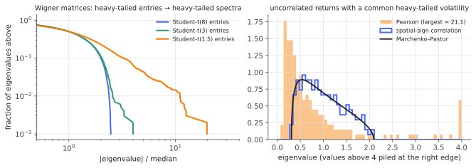

# Heavy-tailed random matrices

!!! tldr "TL;DR"
    The semicircle and Marchenko–Pastur laws assume light-tailed entries. Heavy tails change the picture in two stages. With **finite variance but no fourth moment** (tail index $2 < \nu < 4$), the bulk is still semicircle/MP, but the **largest eigenvalues are set by the largest individual entries** and escape far beyond the edge, with Poisson (not Tracy–Widom) statistics.
    With **infinite variance** ($\nu < 2$), even the bulk changes: Lévy matrices have heavy-tailed limiting spectra with power-law tails. In practice this matters twice. Heavy-tailed or volatility-clustered returns create **spurious "factors"** in correlation matrices, which robust (Tyler, spatial-sign) estimators remove. And trained neural networks develop **power-law spectra** in their weight matrices, whose exponent is used to diagnose training quality.

## Why care?

Everything in the RMT track so far rested on the entries being "nice". Real data often aren't:

- **Financial returns** have tail exponents around 3–5, and their volatility moves together across assets (calm days vs crisis days). Fed into a correlation matrix, both effects can manufacture eigenvalues far above the MP edge without any genuine correlation. That would mislead the cleaning methods of the covariance track.
- **Trained neural networks.** Martin & Mahoney found that weight matrices of well-trained networks have spectra whose tails follow power laws, unlike the MP spectra of random initializations. The fitted exponent correlates with test accuracy across many pretrained models (the WeightWatcher tool), even without access to any data.
- **Gradient noise and activations.** SGD gradient noise and transformer activations contain heavy-tailed outliers, which affect optimization, quantization and the spectra of the matrices built from them.

## Building blocks

**Tail index.** A variable has tail index $\nu$ if $\P(|X| > t)\approx ct^{-\nu}$. Moments $\E|X|^k$ exist only for $k < \nu$. Student-$t$ with $\nu$ degrees of freedom has tail index $\nu$.

**Which moments the classical laws need.**

- The **bulk** semicircle/MP law needs only finite variance (Lindeberg-type conditions).
- The **edge** (largest eigenvalue converging to $2$, or to $(1+\sqrt q)^2$, with Tracy–Widom fluctuations) needs a finite **fourth** moment ([Wigner note](wigner-semicircle.md)).

**Why the fourth moment?** An $N\times N$ matrix has about $N^2/2$ independent entries. Their maximum is of order $N^{2/\nu}$ (unscaled), while the bulk edge is of order $\sqrt N$ (Exercise 2). For $\nu < 4$, $N^{2/\nu}\gg\sqrt N$: a single huge entry $A_{ij}$ creates an eigenvalue $\approx\pm|A_{ij}|$, with eigenvector concentrated on coordinates $i$ and $j$, sticking far out of the bulk.

## The main results

!!! theorem "Theorem (largest eigenvalues without a fourth moment; Soshnikov 2004, Auffinger, Ben Arous & Péché 2009)"
    For Wigner matrices whose entries have tail index $\nu\in(0,4)$, the largest eigenvalues, normalized by the scale $b_N\sim N^{2/\nu}$ of the largest entries, converge to the points of a **Poisson process** with intensity $\propto x^{-1-\nu}$, the same limit as the largest entries themselves. The top eigenvalues are essentially the top entries, and their eigenvectors are localized on a few coordinates.

!!! theorem "Theorem (Lévy matrices; Ben Arous & Guionnet 2008)"
    If the entries are in the domain of attraction of an $\alpha$-stable law with $\alpha\in(0,2)$ (infinite variance), then the empirical spectral distribution of $A/N^{1/\alpha}$ converges to a deterministic law $\mu_\alpha$, which is **not** the semicircle. It has unbounded support and power-law tails, $\mu_\alpha(|x| > t)\sim t^{-\alpha}$.

The second theorem says that heavy tails are not just a few outliers: when the variance is infinite, every scale of the spectrum is affected. The limits are characterized by fixed-point equations for resolvent entries that, unlike the Gaussian case, don't close on a single scalar $g(z)$, because individual entries matter.

### Elliptical heavy tails in finance

Independent heavy-tailed entries are one model. Financial returns are better described as **elliptical**: $r_t = s_t\,\Sigma^{1/2}z_t$, with a scalar volatility $s_t$ that is common to all assets on day $t$ (calm vs turbulent days). Then the sample covariance is $\frac1T\sum_ts_t^2\Sigma^{1/2}z_tz_t^\top\Sigma^{1/2}$, a **weighted** Wishart matrix. Its spectrum is the MP-type law of the weights $s_t^2$, which can be much wider than MP (El Karoui, 2009; Couillet et al.). High-volatility days dominate, and the spectrum spreads, producing eigenvalues far above the MP edge even when $\Sigma = I$.

**The fix.** Remove the common scale before estimating. The **spatial sign** $r_t/\|r_t\|$ and **Tyler's M-estimator** (which iteratively reweights observations by $1/r_t^\top\hat\Sigma^{-1}r_t$) are scale-invariant per observation, so they eliminate $s_t$, and their spectra return to MP behaviour. Combined with shrinkage they give robust large covariance estimates (e.g. Chen, Wiesel & Hero, 2011; Ollila & Tyler).

{ .fig }

## Examples

### Entries that take over, and factors that aren't there

```python
import numpy as np
rng = np.random.default_rng(0)

# 1) Wigner matrices with heavy-tailed entries: who sets the largest eigenvalue?
N = 2000
for nu in [8.0, 3.0, 1.5]:
    A = np.triu(rng.standard_t(nu, size=(N, N)), 1); A = A + A.T          # symmetric, unscaled
    lam_max = np.max(np.abs(np.linalg.eigvalsh(A)))
    edge = 2 * np.sqrt(N * nu / (nu - 2)) if nu > 2 else np.inf           # semicircle edge if the variance is finite
    print(f"Student-t({nu}) entries:  largest |eigenvalue| {lam_max:8.1f}   largest |entry| {np.max(np.abs(A)):8.1f}   "
          f"semicircle edge {edge:7.1f}")

# 2) Correlation matrix of UNcorrelated returns with a COMMON heavy-tailed volatility (multivariate t, 3 dof):
#    each day all assets share one random scale, as in calm vs turbulent markets.
n_assets, T = 200, 1000; q = n_assets / T
scale = 1 / np.sqrt(rng.chisquare(3, size=(T, 1)) / 3)                       # one volatility draw per day
R = scale * rng.standard_normal((T, n_assets))
pearson = np.corrcoef(R, rowvar=False)
S = R / np.linalg.norm(R, axis=1, keepdims=True)                             # "spatial sign": normalize each day's return vector
spatial = np.corrcoef(S, rowvar=False)
print(f"MP edge (1+sqrt(q))^2 = {(1 + np.sqrt(q))**2:.3f}")
for name, C in [("Pearson", pearson), ("spatial-sign", spatial)]:
    ev = np.linalg.eigvalsh(C)
    print(f"{name:13s} largest eigenvalue {ev[-1]:.3f}   smallest {ev[0]:.3f}   #eigenvalues above the MP edge {np.sum(ev > (1 + np.sqrt(q))**2)}")
# Student-t(8.0) entries:  largest |eigenvalue|    103.7   largest |entry|     14.0   semicircle edge   103.3
# Student-t(3.0) entries:  largest |eigenvalue|    296.6   largest |entry|    274.3   semicircle edge   154.9
# Student-t(1.5) entries:  largest |eigenvalue|   6938.1   largest |entry|   6926.7   semicircle edge     inf
# MP edge (1+sqrt(q))^2 = 2.094
# Pearson       largest eigenvalue 15.183   smallest 0.161   #eigenvalues above the MP edge 14
# spatial-sign  largest eigenvalue 2.032   smallest 0.305   #eigenvalues above the MP edge 0
```

**Part 1.** With $\nu = 8$ (finite fourth moment), the largest eigenvalue sits at the semicircle edge and has nothing to do with the largest entry (14 vs 104). With $\nu = 3$, the variance is finite, so the bulk is still semicircular, but the top eigenvalue (297) is twice the edge and essentially equals the largest single entry (274). With $\nu = 1.5$, the top eigenvalue *is* the largest entry.

**Part 2.** The 200 "assets" are **truly uncorrelated**, yet the Pearson correlation matrix shows 14 eigenvalues above the MP edge, the largest at 15. A naive analyst would report a strong market factor and a dozen sector factors. Normalizing each day's return vector removes the common volatility, and the spectrum falls back inside the MP band.

## Exercises

!!! question "Exercise 1 · warm-up: the moment method needs variance"
    In the moment-method proof of the [semicircle law](wigner-semicircle.md), where exactly is finite variance used? What goes wrong for $\E\frac1N\tr X^2$ when the entries have infinite variance?

    ??? success "Solution"
        The leading term of $\E\frac1N\tr X^{2k}$ counts tree walks, each contributing $\prod\E A_{ij}^2 = 1$. With infinite variance, already $\E\frac1N\tr X^2 = \frac{1}{N^2}\sum_{ij}\E A_{ij}^2 = \infty$, so the moments of the spectrum don't exist and the moment method fails at the first step. One needs a different normalization ($N^{1/\alpha}$ instead of $\sqrt N$) and different tools (Ben Arous–Guionnet use resolvent recursions with stable laws).

!!! question "Exercise 2 · largest entry vs bulk edge"
    For $N^2/2$ i.i.d. entries with $\P(|A| > t)\approx t^{-\nu}$, show that the maximum is of order $N^{2/\nu}$. Compare with the unscaled semicircle edge $2\sqrt{N\Var(A)}$ and find the critical $\nu$.

    ??? success "Solution"
        $\P(\max\le t)\approx(1 - t^{-\nu})^{N^2/2}\approx\exp(-\frac{N^2}{2}t^{-\nu})$, which is non-degenerate when $t\sim N^{2/\nu}$. The edge is of order $N^{1/2}$. The maximum dominates iff $2/\nu > 1/2$, i.e. $\nu < 4$. That is exactly the fourth-moment threshold of Bai–Yin. For $\nu = 3$ and $N = 2000$: $N^{2/3}\approx159$ times a constant, comparable to the observed largest entry of 274, while the edge is about 155.

!!! question "Exercise 3 · localized eigenvectors"
    Suppose one entry $A_{12} = A_{21} = M$ is huge compared with everything else. Argue that $A$ has eigenvalues $\approx\pm M$ with eigenvectors $\approx(e_1\pm e_2)/\sqrt2$. How does this contrast with the delocalized eigenvectors of light-tailed Wigner matrices, and why does it matter for PCA-type interpretations?

    ??? success "Solution"
        Write $A = M(e_1e_2^\top + e_2e_1^\top) + B$ with $\|B\|\ll M$. The first term has eigenvalues $\pm M$ with eigenvectors $(e_1\pm e_2)/\sqrt2$, and by [Weyl](courant-fischer-weyl.md)/[Davis–Kahan](davis-kahan.md) the perturbation $B$ moves them only slightly when $M$ exceeds $\|B\|$ by a large gap. These eigenvectors live on two coordinates. Light-tailed Wigner eigenvectors are spread over all coordinates (entries of size $1/\sqrt N$).
        In PCA or factor analysis on heavy-tailed data, top "components" can be artefacts of a single extreme observation or pair of variables, not collective structure. Checking eigenvector localization (e.g. the inverse participation ratio) is a useful diagnostic.

!!! question "Exercise 4 · why the spatial sign works"
    For elliptical returns $r_t = s_t\Sigma^{1/2}z_t$, show that $r_t/\|r_t\|$ does not depend on $s_t$. For $\Sigma = I$, what is the covariance of $u_t = r_t/\|r_t\|$, and why does its sample correlation matrix follow (approximately) the MP law?

    ??? success "Solution"
        $\frac{r_t}{\|r_t\|} = \frac{s_t\Sigma^{1/2}z_t}{s_t\|\Sigma^{1/2}z_t\|}$, and $s_t$ cancels. For $\Sigma = I$, $u_t = z_t/\|z_t\|$ is uniform on the sphere, with covariance $\frac1NI$. Its coordinates are uncorrelated and, by [high-dimensional concentration](high-dim-geometry.md), nearly independent with nearly equal norms. So $\frac1T\sum u_tu_t^\top$ behaves like a white Wishart matrix (scaled by $1/N$), and its correlation spectrum is MP. For general $\Sigma$, Tyler's estimator generalizes this by also estimating the shape of $\Sigma$.

!!! question "Exercise 5 · stretch: tail exponents of weight spectra"
    If the entries of an $m\times n$ matrix $W$ have tail index $\mu < 4$, the largest eigenvalues of $W^\top W$ are of order (largest entry)$^2$. Show that the tail index of the eigenvalue distribution of $W^\top W$ (in its upper tail) is then $\mu/2$. Martin & Mahoney report fitted ESD tail exponents (in density form, $\rho(\lambda)\sim\lambda^{-\alpha}$) between 2 and 4 for well-trained layers. What entry tail index $\mu$ would that correspond to, if the tails came from individual entries?

    ??? success "Solution"
        If $\P(|W_{ij}| > t)\sim t^{-\mu}$, then $\P(W_{ij}^2 > s) = \P(|W_{ij}| > \sqrt s)\sim s^{-\mu/2}$. The top eigenvalues of $W^\top W$ track the largest squared entries, so their counting function has tail index $\mu/2$, i.e. density $\rho(\lambda)\sim\lambda^{-1-\mu/2}$. A density exponent $\alpha\in[2,4]$ means $1 + \mu/2\in[2,4]$, so $\mu\in[2,6]$.
        In practice the heavy tails of trained weight spectra are believed to come from **correlations** learned across many entries (collective spikes and a power-law bulk), not from individual heavy-tailed weights, so this is an interpretation through an analogy. That's why WeightWatcher fits power laws to the spectrum rather than to the raw weights.

## Where it shows up

- **Diagnosing neural networks without data.** Martin & Mahoney's "heavy-tailed self-regularization" (JMLR 2021, *Nature Communications* 2021) fits power laws to the spectra of each layer's $W^\top W$. Smaller exponents (heavier tails, within a range) correlate with better test accuracy across families of pretrained models. Layers that look MP-like are under-trained.
- **Robust covariance in finance.** Tyler's estimator, spatial-sign covariances and rank-based correlations, often combined with shrinkage, avoid volatility-driven spurious factors. GARCH-type standardization (dividing returns by forecast volatility) serves a similar purpose.
- **Optimization.** Heavy-tailed gradient noise motivates gradient clipping and analyses of SGD as a Lévy-driven process (Şimşekli et al.). Heavy-tailed Hessian and gradient-covariance spectra affect preconditioners.
- **LLM quantization.** A few activation dimensions with huge values (outlier features) dominate the spectra of activation covariances and break naive low-precision quantization. Methods such as LLM.int8() and SmoothQuant treat these outlier channels separately.
- **Networks and physics.** Adjacency matrices of graphs with heavy-tailed degree distributions have localized top eigenvectors on hubs, which spectral community detection must correct for (e.g. by regularization or non-backtracking operators).

## Further reading

- C. Martin & M. Mahoney, "Implicit self-regularization in deep neural networks: evidence from random matrix theory and implications for learning" (*JMLR*, 2021).
- G. Ben Arous & A. Guionnet, "The spectrum of heavy tailed random matrices" (*Comm. Math. Phys.*, 2008).
- A. Auffinger, G. Ben Arous & S. Péché, "Poisson convergence for the largest eigenvalues of heavy tailed random matrices" (*Ann. IHP*, 2009).
- N. El Karoui, "Concentration of measure and spectra of random matrices: applications to correlation matrices, elliptical distributions and beyond" (*Ann. Appl. Probab.*, 2009).
