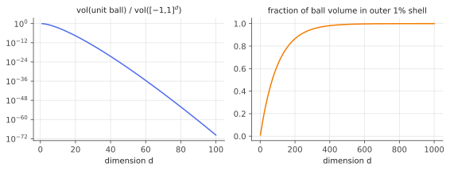
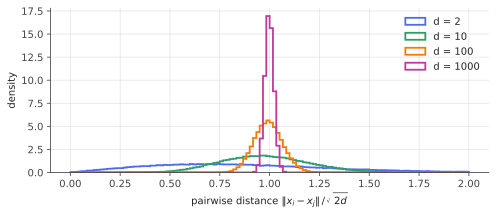

# The strange geometry of high dimensions

!!! tldr "TL;DR"
    In $\R^d$ with $d$ large: a Gaussian vector has length $\sqrt d \pm O(1)$, two random vectors are orthogonal up to $O(1/\sqrt d)$,
    all pairwise distances between random points are nearly equal, and the volume of a ball lies almost entirely near its surface.
    These facts look strange, but they all follow from one principle: **sums of many independent terms concentrate**.

## Why care?

Your geometric intuition was trained in $d = 2$ and $d = 3$. Machine learning lives in $d = 768$, $4096$, or $10^6$:
token embeddings, hidden activations, gradient vectors, portfolios of thousands of assets. In those spaces several "obvious"
pictures are wrong:

- *"Most points of a Gaussian cloud are near the mean."* No. Almost none are. The cloud is a thin **shell**.
- *"Two random directions are at some random angle."* No. They are almost exactly **perpendicular**.
- *"The nearest neighbour is much closer than the farthest point."* No. All distances are nearly **the same**.

Each of these has practical consequences: why transformers divide attention logits by $\sqrt{d_k}$, why a 4096-dimensional model can
store far more than 4096 "features", why $k$-NN degrades in high dimension, and why random matrices have such rigid, predictable spectra.
This note builds the intuition used in every later note.

## Building blocks

**Volume of the ball.** The unit ball in $\R^d$ has volume

$$
V_d = \frac{\pi^{d/2}}{\Gamma(d/2 + 1)},
$$

which peaks at $d=5$ and then decays super-exponentially. The ball of radius $1-\varepsilon$ has volume $(1-\varepsilon)^d V_d$, so the
fraction of the unit ball's volume in the outer shell of thickness $\varepsilon$ is

$$
1 - (1-\varepsilon)^d \approx 1 - e^{-\varepsilon d} \;\xrightarrow{d\to\infty}\; 1.
$$

In $d=1000$, the outer 1% shell holds $99.996\%$ of the volume. Compare with the cube $[-1,1]^d$, which contains the unit ball. Its
corners are at distance $\sqrt d$ from the centre, and the ball's share of the cube's volume, $V_d/2^d$, vanishes: a high-dimensional
cube is almost all corners.

{ .fig }

**Independent sums concentrate.** If $X = (X_1,\dots,X_d)$ has i.i.d. $N(0,1)$ coordinates, then
$\|X\|^2 = \sum_i X_i^2$ is a sum of $d$ i.i.d. terms with mean $1$ and variance $2$ (since $\E X_i^4 = 3$). So

$$
\E\|X\|^2 = d, \qquad \operatorname{sd}(\|X\|^2) = \sqrt{2d}.
$$

The fluctuations ($\sqrt{2d}$) are tiny compared with the mean ($d$). Everything below is a variation on this.

## The main ideas

### 1. The Gaussian annulus

Write $\|X\|^2 = d + \sqrt{2d}\,Z_d$ with $Z_d \Rightarrow N(0,1)$ by the CLT. A first-order Taylor expansion of the square root gives

$$
\|X\| = \sqrt d\,\sqrt{1 + \sqrt{2/d}\,Z_d} \;\approx\; \sqrt d + \frac{Z_d}{\sqrt 2}.
$$

The length of a standard Gaussian vector is $\sqrt d$, give or take a **constant** ($\operatorname{Var}\|X\| \to 1/2$), no matter
how large $d$ is. Non-asymptotically, there is an absolute constant $c>0$ with

$$
\P\big(\,\big|\|X\| - \sqrt d\big| \ge t\big) \le 2e^{-ct^2} \qquad \text{for all } t \ge 0,
$$

a sub-Gaussian tail that we will prove in the [sub-Gaussian](subgaussian-subexponential.md) note.

!!! warning "The soap-bubble paradox"
    The Gaussian density $\propto e^{-\|x\|^2/2}$ is largest at the origin, yet essentially no samples land near it. The radius
    $R = \|X\|$ has density $\propto r^{d-1}e^{-r^2/2}$. The factor $r^{d-1}$ is the surface area of the sphere of radius $r$, and in
    high dimension that growth overwhelms the decay of the density until $r \approx \sqrt{d-1}$. **High density ≠ high probability**
    once volume is taken into account. This is why the "mode" of a high-dimensional distribution is often an unrepresentative point
    (think of the blurry "average face", or MAP decoding in generative models).

### 2. Random vectors are nearly orthogonal

Let $X, Y$ be independent standard Gaussian vectors in $\R^d$. Then

$$
\cos\theta = \frac{\langle X, Y\rangle}{\|X\|\,\|Y\|} \approx \frac{\sum_i X_iY_i}{d}.
$$

The numerator is a sum of $d$ i.i.d. terms with mean $0$ and variance $1$, so $\langle X,Y\rangle \approx \sqrt d\, Z$, and

$$
\cos\theta \approx \frac{Z}{\sqrt d}, \qquad \theta \approx 90° \pm \frac{57.3°}{\sqrt d}.
$$

The exact distribution is clean too. $X/\|X\|$ is uniform on the sphere $S^{d-1}$, and the angle between two independent uniform
directions has density proportional to $\sin^{d-2}\theta$ on $[0,\pi]$. As $d$ grows, $\sin^{d-2}\theta$ becomes a sharp spike at $\pi/2$.

A quantitative form: for uniform $u, v$ on $S^{d-1}$,

$$
\P\big(|\langle u, v\rangle| \ge \varepsilon\big) \le 2e^{-d\varepsilon^2/2}.
$$

(Geometrically, a spherical cap at angular distance $\arccos\varepsilon$ from the equator has tiny area.) So you can fit
**exponentially many** nearly orthogonal directions into $\R^d$ (Exercise 4), even though only $d$ can be exactly orthogonal.

### 3. Concentration of measure on the sphere

Lengths and inner products are special cases of a general principle (Lévy's isoperimetric inequality). If $u$ is uniform on
$S^{d-1}$ and $f$ is $L$-Lipschitz, then

$$
\P\big(|f(u) - \E f(u)| \ge t\big) \le 2\exp\!\big(-c\,d\,t^2/L^2\big).
$$

Any reasonable function of a high-dimensional random point is **essentially constant**. Equivalently, almost all of the sphere's area
lies within $O(1/\sqrt d)$ of *any* fixed equator. Random matrix theory relies on this constantly: the spectrum of a large random matrix
is a Lipschitz function of its entries, so it is nearly deterministic.

### 4. Distances concentrate

For independent $X, Y \sim N(0, I_d)$, $\|X-Y\|^2 \sim 2\chi^2_d$, so $\|X - Y\| = \sqrt{2d}\,(1 + O(1/\sqrt d))$.
With $n$ random points, the ratio between the farthest and nearest neighbour of a query tends to $1$ as $d\to\infty$
(Beyer et al., 1999). Nearest-neighbour search on unstructured high-dimensional data becomes meaningless. It works on real data
only because real data has low *intrinsic* dimension.

{ .fig }

## Examples

### Simulation

```python
import numpy as np
rng = np.random.default_rng(0)
for d in [3, 30, 300, 3000]:
    X = rng.standard_normal((2000, d))
    Y = rng.standard_normal((2000, d))
    nx, ny = np.linalg.norm(X, axis=1), np.linalg.norm(Y, axis=1)
    cos = (X * Y).sum(1) / (nx * ny)
    print(f"d={d:5d}  ||X||-sqrt(d): mean {np.mean(nx-np.sqrt(d)):+.3f} sd {nx.std():.3f}   "
          f"cos: sd {cos.std():.4f} (1/sqrt(d) = {1/np.sqrt(d):.4f})")
# d=    3  ||X||-sqrt(d): mean -0.136 sd 0.654   cos: sd 0.5838 (1/sqrt(d) = 0.5774)
# d=   30  ||X||-sqrt(d): mean -0.046 sd 0.682   cos: sd 0.1784 (1/sqrt(d) = 0.1826)
# d=  300  ||X||-sqrt(d): mean -0.005 sd 0.678   cos: sd 0.0565 (1/sqrt(d) = 0.0577)
# d= 3000  ||X||-sqrt(d): mean -0.024 sd 0.712   cos: sd 0.0180 (1/sqrt(d) = 0.0183)
```

The standard deviation of the norm stays near $1/\sqrt2 \approx 0.707$ for every $d$ (sampling error with 2000 draws is about $\pm 0.01$), while the cosine's spread shrinks like $1/\sqrt d$.

### Try it

Drag the dimension. The orange curves are the exact densities ($\propto\sin^{d-2}\theta$ for the angle, a rescaled $\chi_d$ for the norm).

<div class="widget" data-widget="hd-geometry"></div>

## Exercises

!!! question "Exercise 1 · warm-up"
    Let $X\sim N(0,I_d)$. Show $\E\|X\|^2 = d$ and $\operatorname{Var}\|X\|^2 = 2d$.

    ??? success "Solution"
        $\E\|X\|^2 = \sum_i \E X_i^2 = d$. By independence, $\operatorname{Var}\|X\|^2 = \sum_i \operatorname{Var}(X_i^2) = d\,(\E X_i^4 - (\E X_i^2)^2) = d(3-1) = 2d$.

!!! question "Exercise 2 · the outer shell"
    In $d = 1000$, what fraction of the unit ball's volume lies at distance $\ge 0.99$ from the centre? What about $d = 100$?

    ??? success "Solution"
        $1 - 0.99^{d}$. For $d=1000$: $1 - e^{1000\ln 0.99} = 1 - e^{-10.05} \approx 0.99996$. For $d = 100$: $1 - 0.99^{100} \approx 1 - 0.366 = 0.634$.

!!! question "Exercise 3 · symmetry does the work"
    Let $u$ be uniform on $S^{d-1}$. Without computing any integrals, show $\E[u_1^2] = 1/d$. Deduce $\E[\langle u, v\rangle^2] = 1/d$
    for $v$ independent and uniform (or any fixed unit vector).

    ??? success "Solution"
        By symmetry all $\E[u_i^2]$ are equal, and $\sum_i u_i^2 = 1$, so each is $1/d$. For a fixed unit $v$, rotate coordinates so $v = e_1$:
        rotation invariance of $u$ gives $\E\langle u, v\rangle^2 = \E u_1^2 = 1/d$. For random independent $v$, condition on $v$ first.
        So the typical $|\cos\theta|$ is $1/\sqrt d$.

!!! question "Exercise 4 · exponentially many almost-orthogonal vectors"
    Using $\P(|\langle u,v\rangle|\ge\varepsilon)\le 2e^{-d\varepsilon^2/2}$ and a union bound, show that $N = e^{d\varepsilon^2/8}$ independent uniform
    unit vectors have all pairwise $|\cos| < \varepsilon$ with probability at least $1 - e^{-d\varepsilon^2/4}$.
    How many vectors with pairwise $|\cos| < 0.1$ does this give in $d = 4096$?

    ??? success "Solution"
        There are fewer than $N^2/2$ pairs, so $\P(\text{some pair fails}) \le \frac{N^2}{2}\cdot 2e^{-d\varepsilon^2/2} = e^{d\varepsilon^2/4 - d\varepsilon^2/2} = e^{-d\varepsilon^2/4}$.

        For $d = 4096$, $\varepsilon = 0.1$: $d\varepsilon^2/8 = 5.12$, so $N \approx 167$. That's a weak guarantee, because the union bound and the
        constants are pessimistic. The exponent scales as $d\varepsilon^2$, so the count becomes astronomically large for moderately larger $d$
        or $\varepsilon$. For $\varepsilon = 0.3$, $N = e^{46}\approx 10^{20}$. That is the geometric fact behind *superposition* (see below).

!!! question "Exercise 5 · stretch: how empty is the middle?"
    Use the Chernoff method to show that for $X\sim N(0,I_d)$ and $0<a<1$,
    $\P(\|X\|^2 \le a d) \le \big(a\,e^{1-a}\big)^{d/2}$. Evaluate for $a = 1/4$, $d = 100$. You'll need $\E e^{-\lambda X_1^2} = (1+2\lambda)^{-1/2}$.

    ??? success "Solution"
        For $\lambda>0$, Markov's inequality applied to $e^{-\lambda\|X\|^2}$:

        $$\P(\|X\|^2 \le ad) = \P\big(e^{-\lambda\|X\|^2} \ge e^{-\lambda a d}\big) \le e^{\lambda a d}\,(1+2\lambda)^{-d/2}.$$

        Minimize $\lambda a - \tfrac12\ln(1+2\lambda)$: setting the derivative to zero gives $1+2\lambda = 1/a$. Plugging in:
        $\exp\{d[(1-a)/2 + \tfrac12\ln a]\} = (a e^{1-a})^{d/2}$.

        For $a=1/4$: $a e^{1-a} = e^{0.75}/4 \approx 0.529$, and $0.529^{50}\approx 1.5\times 10^{-14}$. The ball of radius $\sqrt d/2$, which
        has the highest density, carries essentially zero probability.

## Where it shows up

- **Attention scaling in transformers.** With queries and keys having $d_k$ roughly independent unit-variance coordinates,
  $q\cdot k$ has standard deviation $\sqrt{d_k}$ (idea 2). Without the $1/\sqrt{d_k}$ in $\operatorname{softmax}(QK^\top/\sqrt{d_k})$,
  the logits grow with width and the softmax saturates into a hard argmax, killing gradients.
- **Initialization.** Xavier/He initialization scales weights by $1/\sqrt{\text{fan-in}}$ precisely so that $\|Wx\|\approx\|x\|$
  layer after layer, using the annulus phenomenon for $Wx$.
- **Superposition and feature geometry in LLMs.** Exercise 4 says $\R^d$ holds $e^{\Theta(d\varepsilon^2)}$ nearly orthogonal directions.
  Mechanistic-interpretability work (Elhage et al., *Toy Models of Superposition*, 2022) argues that networks exploit this to represent
  many more sparse features than they have neurons. That is also why sparse autoencoders are used to pull the features apart.
- **Embedding similarity baselines.** For $d = 4096$, two unrelated random directions have cosine similarity $0 \pm 0.016$, so even a
  cosine of $0.1$ is a strong signal. (Real embeddings are anisotropic, so in practice baselines should be estimated, not assumed.)
- **Random projections and sketching.** Because distances concentrate, projecting to $k \approx \log n/\varepsilon^2$ random directions
  preserves all pairwise distances. That is the [Johnson–Lindenstrauss lemma](johnson-lindenstrauss.md).
- **Diversification in quant.** The variance of an equal-weighted portfolio of $N$ uncorrelated assets is $\sigma^2/N$. That is the
  annulus phenomenon in disguise, and it breaks down once correlations matter (see [Markowitz](markowitz-estimation-error.md)).

## Further reading

- R. Vershynin, *High-Dimensional Probability*, Ch. 3. The modern standard reference.
- A. Blum, J. Hopcroft & R. Kannan, *Foundations of Data Science*, Ch. 2. Very readable, with lots of pictures.
- K. Ball, "An Elementary Introduction to Modern Convex Geometry" (1997). The classic on spherical caps and concentration.
