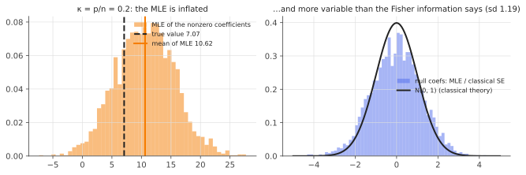

# When classical inference breaks: the high-dimensional MLE

!!! tldr "TL;DR"
    The textbook theory of maximum likelihood (consistency, $\hat\beta\approx N(\beta, I^{-1}/n)$, likelihood-ratio statistics $\sim\chi^2$) assumes the number of parameters $p$ is fixed while $n\to\infty$. With $p/n = \kappa$ fixed, as in modern data, it fails for logistic regression even at moderate $\kappa$.
    Sur & Candès (2019) showed that the MLE is **biased away from zero** by a factor $\alpha > 1$ (about 1.5 at $\kappa = 0.2$ in a typical setting), that its variability **exceeds** what the Fisher information predicts, that the likelihood-ratio test is **anti-conservative** (needs a rescaled $\chi^2$), and that beyond a phase transition the **MLE doesn't exist at all**. Exact corrections come from the same high-dimensional machinery as the rest of this track (AMP, Gaussian comparison, deterministic equivalents).

## Why care?

Logistic regression is the default model for binary outcomes in medicine, credit, marketing and the social sciences, and it is the last layer of every neural classifier. Its software output (coefficients, standard errors, $p$-values) is computed from classical asymptotics. Those numbers are trusted whenever "$n$ is large".

But $n$ being large is not enough: what matters is $n$ *relative to $p$*. A study with 4000 patients and 800 covariates ($\kappa = 0.2$) looks comfortably large, yet the MLE overstates every effect by about 50%, nominal 95% intervals cover far less, and $p$-values are too small. This is not a small-sample effect that goes away. It persists as $n, p\to\infty$ together.

Similar issues affect ML evaluation of high-dimensional probes, sparse-model inference, and any GLM fitted to many features. The fix is not to give up on likelihood, but to use the correct high-dimensional theory.

## Building blocks

**Setting.** $y_i\in\{0,1\}$ with $\P(y_i = 1\mid x_i) = \sigma(x_i^\top\beta)$, $x_i\sim N(0, \frac1nI_p)$ (so that $x_i^\top\beta = O(1)$), $p/n\to\kappa$, and **signal strength** $\gamma^2 = \lim\Var(x_i^\top\beta) = \lim\|\beta\|^2/n$.

**Classical predictions.** $\hat\beta$ unbiased to first order, $\Cov(\hat\beta)\approx I(\beta)^{-1} = (X^\top WX)^{-1}$ ([GLM note](glm.md)), and $2(\ell(\hat\beta) - \ell(\hat\beta_{-j}))\Rightarrow\chi^2_1$ for a null coefficient.

**What can go wrong.** The MLE's score equation $X^\top(y - \sigma(X\hat\beta)) = 0$ involves $p$ unknowns fitted from $n$ noisy binary labels. When $p/n$ is not small, the fitted probabilities become too extreme (overfitting the labels), which pushes $\|\hat\beta\|$ up. In the extreme, the data become **linearly separable** and the MLE runs off to infinity ([GLM note](glm.md), separation).

## The main results

!!! theorem "Theorem (existence of the MLE; Candès & Sur, 2020)"
    In the model above, there is a curve $\kappa = h(\gamma)$, decreasing in the signal strength $\gamma$, such that as $n, p\to\infty$ with $p/n\to\kappa$:

    - if $\kappa < h(\gamma)$, the MLE exists with probability $\to1$;
    - if $\kappa > h(\gamma)$, the data are linearly separable and the MLE does not exist, with probability $\to1$.

    For $\gamma = 0$ (no signal), $h(0) = 1/2$, a classical result of Cover (1965) on separability of random points.

!!! theorem "Theorem (distribution of the MLE; Sur & Candès, 2019)"
    For $\kappa < h(\gamma)$, there are constants $(\alpha_\star, \sigma_\star, \lambda_\star)$, the solution of a system of three nonlinear equations depending only on $(\kappa, \gamma)$, such that for a coordinate $j$ (with $x$ isotropic):

    $$
    \hat\beta_j\approx\alpha_\star\beta_j + \frac{\sigma_\star}{\sqrt{p}}\,Z,\qquad Z\sim N(0,1),
    $$

    in the sense that $\frac1p\sum_j\psi(\hat\beta_j - \alpha_\star\beta_j,\ \beta_j)$ converges to the corresponding Gaussian average for test functions $\psi$. Moreover, for a null coefficient the likelihood-ratio statistic satisfies

    $$
    2\big(\ell(\hat\beta) - \ell(\hat\beta_{-j})\big)\ \Rightarrow\ \frac{\kappa\sigma_\star^2}{\lambda_\star}\,\chi^2_1,
    $$

    a **rescaled** chi-square, with scale factor $> 1$.

The constants come from an approximate message passing (AMP) analysis, or equivalently Gaussian-comparison (CGMT) or leave-one-out arguments, all of which reduce the high-dimensional problem to a scalar problem with an **effective** noise level, much like the effective regularization $\kappa$ of [deterministic equivalents](deterministic-equivalents.md).

**Interpreting $\alpha_\star > 1$.** The coefficients are systematically **inflated**: at $\kappa = 0.2$ and $\gamma^2 = 5$, $\alpha_\star\approx1.5$. Fitted probabilities are too confident, which ties this to [calibration](calibration-scoring.md): an unregularized high-dimensional logistic model is overconfident even in-distribution.

### Practical remedies

- **Correct the MLE.** Estimate $(\alpha_\star, \sigma_\star, \lambda_\star)$ (via ProbeFrontier, proposed by Sur & Candès, or the leave-one-out estimator SLOE of Yadlowsky et al., 2021), then divide by $\alpha_\star$ and use $\sigma_\star$ for standard errors and the rescaled $\chi^2$ for tests.
- **Regularize.** Ridge or LASSO logistic regression avoids non-existence and reduces variance. Inference then needs debiasing ([debiased LASSO](debiased-lasso.md) generalizes to GLMs) or high-dimensional theory for the regularized estimator.
- **Bootstrap with care.** The ordinary bootstrap is also unreliable in this regime (El Karoui & Purdom). Resampling doesn't fix proportional-asymptotics bias.

{ .fig }

## Examples

### Logistic regression with $p/n = 0.2$

```python
import numpy as np
from scipy import stats
rng = np.random.default_rng(0)
sig = lambda t: 1 / (1 + np.exp(-t))

def logistic_mle(X, y, iters=50):
    b = np.zeros(X.shape[1])
    for _ in range(iters):
        p = sig(X @ b); W = p * (1 - p)
        step = np.linalg.solve(X.T @ (W[:, None] * X), X.T @ (y - p))
        b += step
        if np.max(np.abs(step)) < 1e-8: break
    eta = X @ b; p = sig(eta)
    ll = np.sum(y * eta - np.logaddexp(0, eta))                      # stable log-likelihood
    return b, np.linalg.inv(X.T @ ((p * (1 - p))[:, None] * X)), ll

# Sur & Candès-style design: x_ij ~ N(0, 1/n), kappa = p/n = 0.2, signal strength gamma^2 = Var(x'beta) = 5.
n, p = 1000, 200
beta = np.r_[np.full(p // 2, np.sqrt(5 * n / (p // 2))), np.zeros(p // 2)]   # half nonzero (≈ 7.07), half zero
slopes, cov_nonnull, cov_null, lrt_reject = [], [], [], []
for rep in range(100):
    X = rng.standard_normal((n, p)) / np.sqrt(n)
    y = (rng.uniform(size=n) < sig(X @ beta)).astype(float)
    b, V, ll = logistic_mle(X, y)
    se = np.sqrt(np.diag(V))
    slopes.append(np.mean(b[: p // 2]) / beta[0])                         # inflation of the nonzero coefficients
    cov_nonnull.append(np.mean(np.abs(b[: p // 2] - beta[0]) <= 1.96 * se[: p // 2]))
    cov_null.append(np.mean(np.abs(b[p // 2:]) <= 1.96 * se[p // 2:]))
    _, _, ll0 = logistic_mle(X[:, :-1], y)                            # LRT for the last (null) coefficient
    lrt_reject.append(2 * (ll - ll0) > stats.chi2.ppf(0.95, 1))
print(f"mean MLE / true value for nonzero coefficients: {np.mean(slopes):.3f}   (classical theory: 1)")
print(f"95% Wald CI coverage:  nonzero coefs {np.mean(cov_nonnull):.3f}   null coefs {np.mean(cov_null):.3f}")
print(f"LRT (chi^2_1 cutoff) rejection rate for a null coefficient: {np.mean(lrt_reject):.3f}   (nominal 0.05)")
# mean MLE / true value for nonzero coefficients: 1.546   (classical theory: 1)
# 95% Wald CI coverage:  nonzero coefs 0.789   null coefs 0.894
# LRT (chi^2_1 cutoff) rejection rate for a null coefficient: 0.110   (nominal 0.05)
```

With 1000 observations and 200 covariates, which would usually count as "plenty of data", every nonzero coefficient is overstated by about 55%, close to the theoretical $\alpha_\star\approx1.5$ for these parameters. Wald intervals for the true coefficients cover 79% instead of 95%, and the standard likelihood-ratio test **doubles** its nominal false-positive rate.
The null coefficients are unbiased (inflation multiplies zero by $\alpha_\star$), but they are more variable than the Fisher information claims.

## Exercises

!!! question "Exercise 1 · warm-up: Cover's separability threshold"
    Cover (1965) showed that $n$ points in general position in $\R^p$ with random labels are linearly separable (through the origin) with probability $\frac{1}{2^{n-1}}\sum_{k=0}^{p-1}\binom{n-1}{k}$. Explain why this tends to 1 if $p/n > 1/2$ and to 0 if $p/n < 1/2$, and what it implies for the MLE with no signal.

    ??? success "Solution"
        The sum counts the lower $p$ terms of a $\mathrm{Binomial}(n-1, \frac12)$ distribution, i.e. it is $\P(\mathrm{Bin}(n-1,\frac12)\le p - 1)$. By the law of large numbers, that probability is near 1 when $p/n > 1/2$ and near 0 when $p/n < 1/2$. With random labels ($\gamma = 0$), the logistic MLE exists iff the data are *not* separable, so it exists asymptotically iff $\kappa < 1/2$. Signal makes the labels more predictable and separability easier, so the threshold $h(\gamma)$ decreases with $\gamma$.

!!! question "Exercise 2 · why inflation?"
    Give an intuitive argument for why the high-dimensional logistic MLE overstates coefficients, by comparing in-sample and out-of-sample fitted probabilities. Relate it to the [OLS optimism](ols-gauss-markov.md) $\|e\|^2 = \sigma^2(n - p)$.

    ??? success "Solution"
        With many parameters, the MLE partly fits the noise in the labels: in-sample, the fitted probabilities move toward the observed 0/1 labels, which requires larger $|x_i^\top\hat\beta|$. In OLS, the analogous effect is that residuals are too small by a factor $(n-p)/n$, but OLS coefficients stay unbiased because the model is linear in the noise. In logistic regression, the nonlinearity of $\sigma$ turns this "fitting the noise" into systematically larger linear predictors, so all coefficients scale up by $\alpha_\star > 1$. The optimism grows with $\kappa$ and diverges at the separability threshold.

!!! question "Exercise 3 · what "large $n$" means"
    Explain why doubling both $n$ and $p$ (keeping $\kappa$ fixed) does **not** fix the problems in the code example, while doubling $n$ with $p$ fixed does. What is the right "sample size" to look at?

    ??? success "Solution"
        The limiting constants $(\alpha_\star,\sigma_\star,\lambda_\star)$ depend only on $(\kappa,\gamma)$, so scaling $n$ and $p$ together leaves the bias and the miscalibrated variance unchanged. Only the Monte Carlo noise around them shrinks. Doubling $n$ with $p$ fixed halves $\kappa$, moving toward the classical regime ($\alpha_\star\to1$ as $\kappa\to0$). The relevant quantity is **observations per parameter**, $n/p = 1/\kappa$. Rules of thumb such as "10 events per variable" in medical statistics are crude attempts to keep $\kappa$ small.

!!! question "Exercise 4 · the linear analogue"
    For linear regression with Gaussian errors, classical inference remains **exact** for any $p < n$ ($t$- and $F$-tests have exact finite-sample distributions). Why doesn't the same failure happen there? What is the high-dimensional "price" in linear regression?

    ??? success "Solution"
        In the Gaussian linear model, $\hat\beta = \beta + (X^\top X)^{-1}X^\top\varepsilon$ is *exactly* Gaussian and unbiased, and $\|e\|^2/\sigma^2\sim\chi^2_{n-p}$ independently, so $t$/$F$ distributions are exact. The degrees-of-freedom correction $n - p$ automatically accounts for dimension. The price is **variance**: $\Var(\hat\beta_j)$ inflates like $\frac{1}{1-\kappa}$ ([OLS note](ols-gauss-markov.md)), and predictions suffer the $\frac{\kappa}{1-\kappa}$ blow-up, but the reported standard errors are correct. Nonlinear models lose this exactness, which is why GLMs need the new theory.

!!! question "Exercise 5 · stretch: the rescaled LRT"
    Suppose, under the null, $2\Lambda_j\approx c\,\chi^2_1$ with $c = \kappa\sigma_\star^2/\lambda_\star > 1$. If you use the $\chi^2_1$ cutoff $3.84$, what is the actual size as a function of $c$? What value of $c$ is consistent with the simulated rejection rate of 0.11, and how should the test be corrected?

    ??? success "Solution"
        Actual size $= \P(c\chi^2_1 > 3.84) = \P(\chi^2_1 > 3.84/c) = 2\big(1 - \Phi(\sqrt{3.84/c})\big)$. Setting this to 0.11 gives $\sqrt{3.84/c} = \Phi^{-1}(0.945)\approx1.60$, so $3.84/c\approx2.56$ and $c\approx1.50$. The corrected test rejects when $2\Lambda_j > 3.84\,\hat c$, using an estimate of $c$ from the Sur–Candès equations, which restores the nominal 5% level.

## Where it shows up

- **Medical and social-science studies.** Logistic models with many covariates relative to the number of events (genetic panels, EHR features, survey items) are in the high-dimensional regime. Inflated odds ratios and small $p$-values are a known reproducibility hazard, and the corrections apply directly.
- **Calibration of ML classifiers.** The inflation $\alpha_\star > 1$ is a mechanism for **overconfidence** in unregularized high-dimensional linear classifiers, and partly for the miscalibration of overparametrized networks (fitted logits too large), which [temperature scaling](calibration-scoring.md) then shrinks back.
- **Probing representations.** Logistic probes on high-dimensional embeddings with limited labelled data report inflated coefficients and overconfident significance unless regularized and properly evaluated.
- **Theory of high-dimensional estimation.** The same AMP/CGMT toolbox gives exact asymptotics for regularized GLMs, robust regression (where M-estimators need modified losses in high dimension, El Karoui et al.), max-margin classifiers (the separable regime) and benign overfitting in classification.
- **Credit and insurance.** Large scorecards with many interacting features, if fitted by unpenalized MLE, systematically exaggerate risk differences between applicants. Regularization or high-dimensional corrections are needed for honest risk estimates.

## Further reading

- P. Sur & E. Candès, "A modern maximum-likelihood theory for high-dimensional logistic regression" (*PNAS*, 2019).
- E. Candès & P. Sur, "The phase transition for the existence of the maximum likelihood estimate in high-dimensional logistic regression" (*Ann. Stat.*, 2020).
- P. Sur, Y. Chen & E. Candès, "The likelihood ratio test in high-dimensional logistic regression is asymptotically a rescaled chi-square" (*PTRF*, 2019).
- T. Cover, "Geometrical and statistical properties of systems of linear inequalities with applications in pattern recognition" (*IEEE Trans. Electron. Comput.*, 1965).
