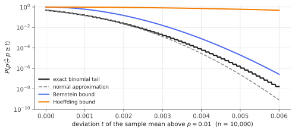

# Hoeffding & Bernstein inequalities

!!! tldr "TL;DR"
    For a sum of independent bounded variables, **Hoeffding** gives Gaussian-type tails that depend only on the ranges:
    $\P(|S_n - \E S_n|\ge t)\le2\exp\big(-2t^2/\sum_i(b_i-a_i)^2\big)$. **Bernstein** also uses the variance: $\P(|S_n - \E S_n|\ge t)\le2\exp\big(-\frac{t^2/2}{\sigma^2 + Mt/3}\big)$. That is Gaussian with the *true* variance for small $t$
    and exponential for large $t$. When the variance is much smaller than the range allows (rare events, sparse signals, importance weights), Bernstein is better by orders of magnitude. Both are non-asymptotic: they hold for every $n$, with
    no CLT approximation.

## Why care?

"How many samples do I need?" is the most practical question in statistics. How many test questions to compare two LLMs, how many impressions to estimate a click rate, how many episodes to evaluate a policy, how many Monte Carlo paths to price
an option?

The CLT gives an approximate answer that can be badly wrong for small samples, rare events or skewed data. Concentration inequalities give answers that are **guaranteed**: the bound holds exactly, for every $n$. They are also the building blocks of
learning theory (generalization bounds), bandit algorithms (confidence bonuses) and every high-probability statement in later notes ([matrix Bernstein](matrix-bernstein.md), [Johnson–Lindenstrauss](johnson-lindenstrauss.md)).

## Building blocks

From the [sub-Gaussian note](subgaussian-subexponential.md): the **Chernoff method** $\P(S\ge t)\le\inf_{\lambda>0}e^{-\lambda t}\E e^{\lambda S}$, and the fact that for independent summands the MGF factorizes, $\E e^{\lambda S_n} = \prod_i\E e^{\lambda X_i}$.
Every inequality below comes from bounding a single summand's MGF and optimizing over $\lambda$.

**Notation.** $X_1,\dots,X_n$ independent, $S_n = \sum_iX_i$, centred summands $\tilde X_i = X_i - \E X_i$, total variance $\sigma^2 = \sum_i\Var(X_i)$.

## The main results

### Hoeffding

!!! theorem "Hoeffding's lemma"
    If $X\in[a,b]$ almost surely and $\E X = 0$, then $\E e^{\lambda X}\le\exp\big(\lambda^2(b-a)^2/8\big)$ for all $\lambda\in\R$. A bounded variable is $\frac{b-a}{2}$-sub-Gaussian.

**Proof.** By convexity of $x\mapsto e^{\lambda x}$ on $[a,b]$: $e^{\lambda x}\le\frac{b-x}{b-a}e^{\lambda a} + \frac{x-a}{b-a}e^{\lambda b}$. Take expectations (with $\E X = 0$) and write $h = \lambda(b-a)$, $\pi = -a/(b-a)\in[0,1]$:

$$
\E e^{\lambda X}\le(1-\pi)e^{\lambda a} + \pi e^{\lambda b} = e^{L(h)},\qquad L(h) = -h\pi + \log(1 - \pi + \pi e^h).
$$

Then $L(0) = 0$, $L'(0) = 0$, and $L''(h) = u(1-u)\le\frac14$ with $u = \frac{\pi e^h}{1-\pi+\pi e^h}$. By Taylor's theorem, $L(h)\le h^2/8$. $\square$

!!! theorem "Hoeffding's inequality"
    If $X_i\in[a_i,b_i]$ are independent, then for all $t\ge0$,

    $$
    \P\big(S_n - \E S_n\ge t\big)\le\exp\Big(-\frac{2t^2}{\sum_i(b_i - a_i)^2}\Big).
    $$

    For i.i.d. variables in $[0,1]$, the sample mean satisfies $\P(|\bar X - \mu|\ge\varepsilon)\le2e^{-2n\varepsilon^2}$.

**Proof.** The lemma for each $\tilde X_i$ gives $\E e^{\lambda(S_n - \E S_n)}\le\exp\big(\frac{\lambda^2}{8}\sum_i(b_i-a_i)^2\big)$. Chernoff with $\lambda = 4t/\sum_i(b_i-a_i)^2$ finishes it. $\square$

**Sample size.** To get $|\bar X - \mu|\le\varepsilon$ with probability $1-\delta$ for $[0,1]$-valued data, $n\ge\frac{\log(2/\delta)}{2\varepsilon^2}$ suffices: about $18{,}400$ samples for $\pm1\%$ at 95%. Hoeffding uses only the range, so it effectively assumes the worst-case variance $(b-a)^2/4$.

### Bernstein

!!! theorem "Bernstein's inequality"
    If the $X_i$ are independent with $|X_i - \E X_i|\le M$ almost surely, then for all $t\ge0$,

    $$
    \P\big(S_n - \E S_n\ge t\big)\le\exp\Big(-\frac{t^2/2}{\sigma^2 + Mt/3}\Big).
    $$

**Proof.** For a centred variable with $|X|\le M$ and variance $v$: $\E|X|^k\le vM^{k-2}$ for $k\ge2$. Using $k!\ge2\cdot3^{k-2}$, for $0 < \lambda < 3/M$,

$$
\E e^{\lambda X} = 1 + \sum_{k\ge2}\frac{\lambda^k\E X^k}{k!}\le1 + \frac{\lambda^2v}{2}\sum_{k\ge2}\Big(\frac{\lambda M}{3}\Big)^{k-2} = 1 + \frac{\lambda^2v}{2(1 - \lambda M/3)}\le\exp\Big(\frac{\lambda^2v}{2(1-\lambda M/3)}\Big).
$$

Multiply over $i$ to get the bound with $v\to\sigma^2$. Chernoff with $\lambda = \frac{t}{\sigma^2 + Mt/3}$ gives $1 - \lambda M/3 = \frac{\sigma^2}{\sigma^2 + Mt/3}$, and the exponent becomes $-\frac{t^2}{\sigma^2+Mt/3} + \frac{t^2}{2(\sigma^2 + Mt/3)} = -\frac{t^2/2}{\sigma^2 + Mt/3}$. $\square$

**Two regimes.** For small deviations ($Mt\ll\sigma^2$) the bound is $\approx e^{-t^2/2\sigma^2}$, exactly the Gaussian tail with the *true* variance, i.e. the CLT scale. For large deviations ($Mt\gg\sigma^2$) it is $\approx e^{-3t/2M}$, an exponential tail set by the
range. This is the sub-exponential behaviour of the [previous note](subgaussian-subexponential.md), now proved for bounded variables.

**Hoeffding vs Bernstein for rare events.** For Bernoulli($p$) summands, Hoeffding's exponent is $2t^2/n$ and Bernstein's is $\approx t^2/(2np(1-p))$, better by a factor $\frac{1}{4p(1-p)}$, which is about $25\times$ for $p = 0.01$.

### Relatives worth knowing

- **Empirical Bernstein** (Maurer & Pontil, 2009): replaces the unknown $\sigma^2$ by the sample variance at a small cost. It is the practical version used in bandits (UCB-V) and in off-policy evaluation.
- **McDiarmid (bounded differences):** if changing the $i$-th input changes $f(X_1,\dots,X_n)$ by at most $c_i$, then $\P(f - \E f\ge t)\le e^{-2t^2/\sum c_i^2}$. Hoeffding for *functions*, not just sums. It is the workhorse for generalization bounds.
- **Bennett's inequality:** the sharper bound that Bernstein simplifies. It matters for very rare events.

## Examples

### Estimating a click-through rate

```python
import numpy as np
from scipy import stats
rng = np.random.default_rng(0)

# How many impressions to estimate a 1% click-through rate within ±0.1% with probability 95%?
p, eps, delta = 0.01, 0.001, 0.05
n_hoeffding = np.log(2 / delta) / (2 * eps**2)                         # 2 exp(-2 n eps^2) <= delta
n_bernstein = 2 * (p * (1 - p) + eps / 3) * np.log(2 / delta) / eps**2  # 2 exp(-n eps^2 / (2(σ² + eps/3))) <= delta
n_clt = stats.norm.ppf(1 - delta / 2) ** 2 * p * (1 - p) / eps**2       # normal approximation (no guarantee)
print(f"Hoeffding {n_hoeffding:,.0f}   Bernstein {n_bernstein:,.0f}   CLT {n_clt:,.0f}")

# Check: with n = Bernstein's n, how often is the estimate off by more than eps?
n = int(np.ceil(n_bernstein))
phat = rng.binomial(n, p, size=200_000) / n
print(f"n = {n:,}: empirical P(|phat - p| > eps) = {np.mean(np.abs(phat - p) > eps):.4f}  (guaranteed <= {delta})")
# Hoeffding 1,844,440   Bernstein 75,499   CLT 38,030
# n = 75,500: empirical P(|phat - p| > eps) = 0.0059  (guaranteed <= 0.05)
```

Hoeffding asks for 1.8 million impressions, Bernstein for 75 thousand, about $24\times$ fewer, with a guarantee. The CLT suggests 38 thousand but guarantees nothing. Bernstein is conservative by about a factor of 2 relative to the
normal approximation, which is a fair price for a non-asymptotic guarantee.

{ .fig }

Notice in the figure that the normal approximation **underestimates** the true right tail for this skewed, rare-event sum, so CLT-based intervals undercover there. Bernstein stays above the truth everywhere, and Hoeffding is useless at this scale.

## Exercises

!!! question "Exercise 1 · warm-up: benchmark size"
    You evaluate an LLM on $n$ independent benchmark questions (accuracy in $[0,1]$). Using Hoeffding, how large must $n$ be to know the accuracy within $\pm2$ percentage points with 95% confidence? What half-width do you get with $n = 500$?

    ??? success "Solution"
        $n\ge\frac{\log(2/0.05)}{2\times0.02^2} = \frac{3.689}{0.0008}\approx4612$. With $n = 500$: $\varepsilon = \sqrt{\log(40)/(1000)}\approx0.061$, i.e. $\pm6.1$ points. (The CLT with the worst-case variance $0.25$ gives $\pm4.4$. Bernstein or exact binomial intervals help when accuracy is near 0 or 1.)
        Differences of a few points between models on a 500-question benchmark are within noise.

!!! question "Exercise 2 · Hoeffding's lemma for signs"
    For a Rademacher variable ($\pm1$ with probability 1/2), compare the lemma's bound $e^{\lambda^2/2}$ (from $(b-a)^2/8 = 1/2$) with the exact MGF $\cosh\lambda$. Is the lemma tight here?

    ??? success "Solution"
        $\cosh\lambda\le e^{\lambda^2/2}$ ([sub-Gaussian note](subgaussian-subexponential.md), Exercise 1), with $\cosh\lambda = 1 + \lambda^2/2 + O(\lambda^4)$ matching $e^{\lambda^2/2}$ to second order. So the lemma is tight for the symmetric two-point distribution, which has the largest variance, $(b-a)^2/4$, on the interval.
        For any other distribution on $[a,b]$ the true variance is smaller, and Hoeffding is loose. Bernstein captures that slack.

!!! question "Exercise 3 · solving Bernstein for $t$"
    Invert Bernstein's bound: show that with probability at least $1-\delta$,

    $$
    S_n - \E S_n\le\sqrt{2\sigma^2\log(1/\delta)} + \frac{2M}{3}\log(1/\delta).
    $$

    ??? success "Solution"
        Set $\frac{t^2/2}{\sigma^2 + Mt/3} = L := \log(1/\delta)$, so $t^2 - \frac{2ML}{3}t - 2\sigma^2L = 0$ and $t = \frac{ML}{3} + \sqrt{\frac{M^2L^2}{9} + 2\sigma^2L}\le\frac{2ML}{3} + \sqrt{2\sigma^2L}$ (using $\sqrt{a+b}\le\sqrt a + \sqrt b$). The deviation is a "CLT term" plus a "range term". The second
        dominates only when $\sigma^2\lesssim M^2\log(1/\delta)$. This is the form used in learning-theory and bandit proofs.

!!! question "Exercise 4 · a first generalization bound"
    A finite class $\mathcal H$ of classifiers is evaluated by the empirical error $\hat R(h)$ on $n$ i.i.d. labelled points. Show that with probability $\ge1-\delta$, **simultaneously** for all $h\in\mathcal H$:
    $|\hat R(h) - R(h)|\le\sqrt{\frac{\log(2|\mathcal H|/\delta)}{2n}}$. Why does this justify picking the empirical-risk minimizer?

    ??? success "Solution"
        For a fixed $h$, $\hat R(h)$ is a mean of $n$ i.i.d. $\{0,1\}$ losses, so Hoeffding gives $\P(|\hat R - R|\ge\varepsilon)\le2e^{-2n\varepsilon^2}$. A union bound over $|\mathcal H|$ classifiers gives total failure probability $\le2|\mathcal H|e^{-2n\varepsilon^2}$. Set it to $\delta$ and solve for $\varepsilon$.
        Since all empirical risks are uniformly close to the true ones, the ERM $\hat h$ satisfies $R(\hat h)\le\hat R(\hat h) + \varepsilon\le\hat R(h^*) + \varepsilon\le R(h^*) + 2\varepsilon$. The cost of choosing among $|\mathcal H|$ options is only $\sqrt{\log|\mathcal H|}$, the same $\sqrt{\log}$ as for
        [maxima of sub-Gaussians](subgaussian-subexponential.md).

!!! question "Exercise 5 · stretch: entrywise covariance estimation"
    Let $x_1,\dots,x_n\in\R^p$ be i.i.d. with sub-Gaussian coordinates ($\|x_{kj}\|_{\psi_2}\le K$). Each entry $S_{ij} - \Sigma_{ij}$ of the sample covariance is an average of $n$ i.i.d. centred **sub-exponential** variables (products of sub-Gaussians). Using the sub-exponential Bernstein inequality,
    $\P(|S_{ij} - \Sigma_{ij}|\ge t)\le2\exp(-cn\min(t^2/K^4, t/K^2))$, show that $\max_{i,j}|S_{ij} - \Sigma_{ij}|\lesssim K^2\sqrt{\log p/n}$ with high probability when $n\gtrsim\log p$. Contrast this with the operator-norm error $\|S - \Sigma\|\approx\sqrt{p/n}$.

    ??? success "Solution"
        Union bound over $p^2$ entries: $\P(\max|S_{ij} - \Sigma_{ij}|\ge t)\le2p^2\exp(-cn\min(t^2/K^4, t/K^2))$. Choose $t = CK^2\sqrt{\log p/n}$. When $n\gtrsim\log p$, $t\le K^2$, so the quadratic branch applies and the bound is $2p^2e^{-cC^2\log p} = 2p^{2-cC^2}$, which is small for large $C$.

        Each **entry** is estimated to accuracy $\sqrt{\log p/n}$, very good even when $p\gg n$, but the operator norm adds up $p$ small errors coherently and is of order $\sqrt{p/n}$. That gap is why sparse covariance estimators (thresholding small entries, the graphical LASSO) can succeed in high dimension
        when the true covariance is sparse, while the full sample covariance fails ([Marchenko–Pastur](marchenko-pastur.md)).

## Where it shows up

- **Learning theory.** Hoeffding plus a union bound (Exercise 4), McDiarmid plus Rademacher complexity, and Bernstein-based "fast rates" are the backbone of PAC-style generalization bounds.
- **Bandits and RL.** UCB adds a confidence bonus $\sqrt{2\log t/n}$ (Hoeffding). UCB-V and many off-policy evaluation bounds use empirical Bernstein so that low-variance arms or policies get tighter intervals.
- **A/B testing and rare events.** Conversion and click rates of a few percent are where Bernstein-type (or exact binomial) analysis matters. Guaranteed-coverage sequential tests use martingale versions of these inequalities.
- **Monte Carlo and evaluation.** Guarantees on the error of simulation estimates (option prices, integrals, LLM benchmark accuracies with $n$ in the hundreds) come from these bounds, preferably the variance-aware ones.
- **Importance sampling and off-policy learning.** Importance weights are bounded but can have a huge range. Bernstein's use of the *variance* rather than the range is what makes clipped importance-weighting analyses informative.

## Further reading

- W. Hoeffding, "Probability inequalities for sums of bounded random variables" (*JASA*, 1963).
- S. Boucheron, G. Lugosi & P. Massart, *Concentration Inequalities* (2013), Ch. 2.
- R. Vershynin, *High-Dimensional Probability* (2018), §2.2 and §2.8.
- A. Maurer & M. Pontil, "Empirical Bernstein bounds and sample variance penalization" (COLT 2009).
