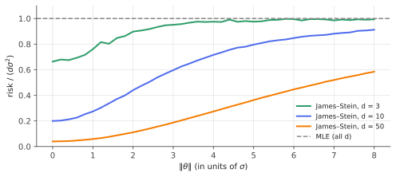

# The James–Stein estimator

!!! tldr "TL;DR"
    Observe $X\sim N(\theta,\sigma^2I_d)$ and estimate the vector $\theta$. The obvious estimator, $X$ itself (the MLE, unbiased and minimax), is **beaten everywhere** when $d\ge3$ by
    
    $$\hat\theta_{\text{JS}} = \Big(1 - \frac{(d-2)\sigma^2}{\|X\|^2}\Big)X .$$
    
    Shrinking all coordinates toward a common point lowers the *total* squared error for every $\theta$, even when the coordinates are unrelated. The proof is a
    two-line integration by parts (Stein's lemma), and the intuition is empirical Bayes: the data estimate how much to shrink. This is the seed of all shrinkage
    estimation, from Ledoit–Wolf covariance cleaning to Tweedie's formula in diffusion models.

## Why care?

In 1956 Charles Stein proved something that statisticians at first refused to believe. Suppose you want to estimate the batting averages of 18 baseball players, the
true alphas of 50 fund managers, or the effects of 200 A/B tests, each from its own noisy measurement. The natural approach is to estimate each by its own
measurement. Stein showed that as soon as there are **three or more** quantities, you can do strictly better in total squared error by pulling all estimates toward a
common value, **regardless of what the true values are**.

This "Stein paradox" is the conceptual foundation for:

- **Shrinkage in quant**: shrinking expected returns toward a grand mean (Jorion's Bayes–Stein portfolios) and covariance matrices toward a target ([Ledoit–Wolf](ledoit-wolf.md));
- **Empirical Bayes in ML and tech**: borrowing strength across many related estimates (A/B tests, per-user models, multi-task learning, small-area statistics);
- **Regularization in general**: ridge, weight decay and the LASSO are all ways of trading a little bias for a lot of variance, and James–Stein is the cleanest demonstration that the
  trade is worth it in high dimension.

## Building blocks

**Setup.** $X = (X_1,\dots,X_d)\sim N(\theta,\sigma^2I_d)$ with $\sigma^2$ known. Loss $\|\hat\theta - \theta\|^2$, and risk $R(\theta,\hat\theta) = \E_\theta\|\hat\theta(X) - \theta\|^2$.

**The MLE.** $\hat\theta = X$ has risk $d\sigma^2$ for every $\theta$. It is unbiased, it is minimax (no estimator has smaller worst-case risk), and for $d = 1$ it is admissible.

**Admissibility.** An estimator is *inadmissible* if another estimator has risk $\le$ its risk for all $\theta$ and $<$ for some. Stein's result: **for $d\ge3$, the MLE is inadmissible.**

**Stein's lemma.** If $Z\sim N(\mu,\sigma^2)$ and $g$ is weakly differentiable with $\E|g'(Z)| < \infty$, then

$$
\E\big[(Z - \mu)\,g(Z)\big] = \sigma^2\,\E\big[g'(Z)\big].
$$

(Integrate by parts, using $\frac{d}{dz}\varphi_\sigma(z-\mu) = -\frac{z-\mu}{\sigma^2}\varphi_\sigma(z-\mu)$.) In $d$ dimensions, applied coordinatewise: for $g:\R^d\to\R^d$,
$\E[(X - \theta)^\top g(X)] = \sigma^2\,\E[\nabla\!\cdot g(X)]$. **Covariance with the noise becomes a divergence.**

## The main result

!!! theorem "Theorem (James & Stein, 1961)"
    For $d\ge3$, the estimator $\hat\theta_{\text{JS}} = \Big(1 - \frac{(d-2)\sigma^2}{\|X\|^2}\Big)X$ has risk

    $$
    R(\theta,\hat\theta_{\text{JS}}) = d\sigma^2 - (d-2)^2\sigma^4\,\E_\theta\Big[\frac{1}{\|X\|^2}\Big]\;<\;d\sigma^2\qquad\text{for every }\theta\in\R^d.
    $$

**Proof.** Write $\hat\theta = X - g(X)$ with $g(x) = c\,x/\|x\|^2$, where we will choose $c$. Expanding,

$$
\|\hat\theta - \theta\|^2 = \|X - \theta\|^2 - 2(X - \theta)^\top g(X) + \|g(X)\|^2 .
$$

Take expectations. The first term gives $d\sigma^2$. For the second, use Stein's lemma with $\nabla\!\cdot\frac{x}{\|x\|^2} = \sum_i\Big(\frac{1}{\|x\|^2} - \frac{2x_i^2}{\|x\|^4}\Big) = \frac{d-2}{\|x\|^2}$:

$$
\E[(X-\theta)^\top g(X)] = \sigma^2c\,(d-2)\,\E\Big[\frac1{\|X\|^2}\Big].
$$

The third term is $c^2\E[1/\|X\|^2]$. So

$$
R = d\sigma^2 - \big[2c(d-2)\sigma^2 - c^2\big]\,\E\Big[\frac1{\|X\|^2}\Big],
$$

which is minimized at $c = (d-2)\sigma^2$, giving the stated risk. $\E[1/\|X\|^2]$ is finite and positive precisely when $d\ge3$ (a noncentral $\chi^2_d$ has a finite inverse
moment only for $d\ge3$). $\square$

**How big is the gain?** At $\theta = 0$, $\|X\|^2/\sigma^2\sim\chi^2_d$ and $\E[1/\chi^2_d] = 1/(d-2)$, so $R = d\sigma^2 - (d-2)\sigma^2 = 2\sigma^2$. That is a factor $d/2$ improvement. As $\|\theta\|\to\infty$ the
gain fades and the risk approaches $d\sigma^2$ from below, but it never crosses.

{ .fig }

### Where does $d - 2$ come from? Empirical Bayes

Suppose the $\theta_i$ were themselves drawn i.i.d. from $N(0,\tau^2)$. The Bayes estimator (posterior mean) is

$$
\E[\theta\mid X] = \Big(1 - \frac{\sigma^2}{\sigma^2+\tau^2}\Big)X,
$$

which shrinks by the factor $\sigma^2/(\sigma^2+\tau^2)$. We don't know $\tau^2$, but the data do. Marginally $X_i\sim N(0,\sigma^2+\tau^2)$, so $\|X\|^2\sim(\sigma^2+\tau^2)\chi^2_d$ and

$$
\E\Big[\frac{(d-2)}{\|X\|^2}\Big] = \frac{1}{\sigma^2+\tau^2}.
$$

Plugging this unbiased estimate of $1/(\sigma^2+\tau^2)$ into the Bayes rule gives exactly James–Stein. This is Efron & Morris's interpretation. **James–Stein is Bayes with the prior
estimated from the data**, and the theorem says it never loses to the MLE, even when the "prior" story is false.

### Refinements that matter in practice

- **Shrink toward something sensible.** Any fixed target $\theta_0$ works: replace $X$ by $X - \theta_0$. Shrinking toward the **grand mean** $\bar X\mathbf 1$ (estimated) uses
  $(d-3)$ instead of $(d-2)$ and requires $d\ge4$:
  $\hat\theta_i = \bar X + \big(1 - \frac{(d-3)\sigma^2}{\sum_j(X_j - \bar X)^2}\big)(X_i - \bar X)$.
- **Positive part.** If $\|X\|^2 < (d-2)\sigma^2$ the factor is negative, which overshoots past the target. Truncating at zero, $\big(1 - \frac{(d-2)\sigma^2}{\|X\|^2}\big)_+X$,
  dominates plain James–Stein.
- **Unknown $\sigma^2$.** Replace it by an independent estimate (for example from replicates), with a slightly adjusted constant.

### Resolving the paradox

James–Stein improves the **sum** of squared errors, not each coordinate. Individual coordinates, especially genuinely extreme ones, can be estimated worse. It may feel absurd
that the price of tea should help estimate a batting average. The resolution is that the loss function lumps them together. If you really care about the total error over many
estimates, you are implicitly treating them as an ensemble, and an ensemble *does* tell you something about its members' typical spread.

## Examples

### Estimating many fund alphas

Fifty managers, each with a true annual alpha (spread around 1%) estimated from three years of returns with 6% tracking error:

```python
import numpy as np
rng = np.random.default_rng(0)

# 50 fund managers. True annual alphas spread around 1%; each measured over 3 years with 6% tracking error.
d, years, te = 50, 3, 0.06
sigma = te / np.sqrt(years)                         # std. error of each estimated alpha ≈ 3.5%

def james_stein_to_mean(x, sigma):
    xbar = x.mean()
    shrink = 1 - (len(x) - 3) * sigma**2 / np.sum((x - xbar) ** 2)
    return xbar + max(shrink, 0.0) * (x - xbar)      # positive-part, shrinks toward the grand mean

mse_raw, mse_js, worse = [], [], []
for _ in range(5000):
    alpha = rng.normal(0.01, 0.02, d)                # true alphas
    x = alpha + sigma * rng.standard_normal(d)       # estimated alphas
    js = james_stein_to_mean(x, sigma)
    mse_raw.append(np.mean((x - alpha) ** 2)); mse_js.append(np.mean((js - alpha) ** 2))
    worse.append(np.mean((js - alpha) ** 2 > (x - alpha) ** 2))
print(f"RMSE raw estimates: {np.sqrt(np.mean(mse_raw)):.4f}   RMSE James-Stein: {np.sqrt(np.mean(mse_js)):.4f}")
print(f"fraction of individual funds where James-Stein is worse: {np.mean(worse):.2f}")
# RMSE raw estimates: 0.0347   RMSE James-Stein: 0.0187
# fraction of individual funds where James-Stein is worse: 0.28
```

Shrinkage almost halves the error, close to the Bayes-optimal RMSE $\sqrt{\sigma^2\tau^2/(\sigma^2+\tau^2)}\approx0.0173$ that you'd get by knowing the true spread $\tau = 2\%$. Yet in $28\%$ of
individual cases the shrunk estimate is worse. Those are mostly the managers whose true alpha really is extreme.

There's a selection lesson here too. The fund with the highest *estimated* alpha is usually a lucky fund. Its raw estimate is biased upward, the "winner's curse", and shrinkage
corrects exactly this.

## Exercises

!!! question "Exercise 1 · warm-up: Stein's lemma"
    Prove $\E[(Z - \mu)g(Z)] = \sigma^2\E[g'(Z)]$ for $Z\sim N(\mu,\sigma^2)$ and smooth $g$ with suitable growth. Check it on $g(z) = z$ and $g(z) = z^2$.

    ??? success "Solution"
        With $\varphi$ the $N(\mu,\sigma^2)$ density, $(z-\mu)\varphi(z) = -\sigma^2\varphi'(z)$. So $\E[(Z-\mu)g(Z)] = -\sigma^2\int g\varphi' = \sigma^2\int g'\varphi$, by parts (the boundary terms vanish under
        the growth condition). Check with $g(z) = z$: $\E[(Z-\mu)Z] = \Var Z = \sigma^2 = \sigma^2\E[1]$ ✓. With $g(z) = z^2$: $\E[(Z-\mu)Z^2] = 2\mu\sigma^2$ (expand $Z = \mu + \sigma W$) and
        $\sigma^2\E[2Z] = 2\mu\sigma^2$ ✓.

!!! question "Exercise 2 · the divergence"
    Verify $\nabla\!\cdot\big(x/\|x\|^2\big) = (d-2)/\|x\|^2$ for $x\in\R^d\setminus\{0\}$. What happens for $d = 2$, and what does it say about James–Stein in two dimensions?

    ??? success "Solution"
        $\partial_i(x_i/\|x\|^2) = 1/\|x\|^2 - 2x_i^2/\|x\|^4$. Summing over $i$ gives $d/\|x\|^2 - 2/\|x\|^2$. For $d = 2$ the divergence is $0$ away from the origin (it is the planar Coulomb field,
        with a point source at $0$). The optimal constant $c = (d-2)\sigma^2$ is then $0$: no gain is possible, and indeed the MLE is admissible in $d = 1$ and $d = 2$. The threshold $d = 3$ is the
        same as for transience of random walks, and that is not a coincidence (Brown, 1971).

!!! question "Exercise 3 · the inverse chi-square moment"
    Show $\E[1/\chi^2_d] = 1/(d-2)$ for $d\ge3$ and that it is infinite for $d\le2$. Deduce the risk of James–Stein at $\theta = 0$.

    ??? success "Solution"
        The $\chi^2_d$ density is $\propto u^{d/2-1}e^{-u/2}$, so $\E[1/U] = \frac{\int u^{d/2-2}e^{-u/2}du}{\int u^{d/2-1}e^{-u/2}du} = \frac{\Gamma(d/2-1)2^{d/2-1}}{\Gamma(d/2)2^{d/2}} = \frac{1}{2(d/2-1)} = \frac1{d-2}$.
        The numerator diverges at $u = 0$ when $d/2 - 2\le-1$, i.e. $d\le2$. At $\theta = 0$: $R = d\sigma^2 - (d-2)^2\sigma^4\cdot\frac{1}{\sigma^2(d-2)} = 2\sigma^2$.

!!! question "Exercise 4 · when does shrinkage help most?"
    In the empirical-Bayes model ($\theta_i\sim N(0,\tau^2)$), compute the Bayes risk of the MLE and of the oracle Bayes estimator, and their ratio. For which signal-to-noise ratio $\tau^2/\sigma^2$
    is shrinkage most valuable? Relate this to the fund example.

    ??? success "Solution"
        MLE: $d\sigma^2$. Oracle Bayes: posterior variance $\frac{\sigma^2\tau^2}{\sigma^2+\tau^2}$ per coordinate, total $d\frac{\sigma^2\tau^2}{\sigma^2+\tau^2}$. The ratio is $\frac{\tau^2}{\sigma^2+\tau^2}$, so the gain is largest when
        $\tau^2\ll\sigma^2$, i.e. when the measurement noise is large compared with the true spread. In the fund example $\tau^2/\sigma^2 = 0.0004/0.0012 = 1/3$, ratio $0.25$, RMSE ratio $0.5$, which matches the
        simulation. In finance, noise usually dominates signal, so shrinkage is essential there.

!!! question "Exercise 5 · stretch: SURE and Mallows' $C_p$"
    For any weakly differentiable estimator $\hat\theta(X) = X + h(X)$, show that

    $$
    \operatorname{SURE}(X) = -d\sigma^2 + \|\hat\theta(X) - X\|^2 + 2\sigma^2\,\nabla\!\cdot\hat\theta(X)
    $$

    is an unbiased estimate of the risk $\E\|\hat\theta - \theta\|^2$. Evaluate it for a linear smoother $\hat\theta = HX$, and connect the result with ridge's effective degrees of freedom.

    ??? success "Solution"
        $\|\hat\theta - \theta\|^2 = \|X - \theta\|^2 + 2(X-\theta)^\top h + \|h\|^2$. Taking expectations with Stein's lemma: $d\sigma^2 + 2\sigma^2\E[\nabla\!\cdot h] + \E\|h\|^2$. Since $\nabla\!\cdot\hat\theta = d + \nabla\!\cdot h$,
        this equals $\E[-d\sigma^2 + \|h\|^2 + 2\sigma^2\nabla\!\cdot\hat\theta]$ ✓.

        For $\hat\theta = HX$: $\nabla\!\cdot\hat\theta = \tr H$, so $\operatorname{SURE} = \|HX - X\|^2 - d\sigma^2 + 2\sigma^2\tr H$. That is Mallows' $C_p$: training error plus $2\sigma^2\times$ degrees of freedom, with
        $\operatorname{df} = \tr H$, the [ridge](ridge.md) effective degrees of freedom. In general $\operatorname{df} = \frac1{\sigma^2}\sum_i\Cov(\hat\theta_i, X_i)$, Efron's definition, which also covers nonlinear methods such as the
        [LASSO](lasso.md), whose df equals the number of nonzero coefficients.

## Where it shows up

- **Covariance shrinkage.** [Ledoit–Wolf](ledoit-wolf.md) applies the same logic to covariance matrices, shrinking the sample covariance toward a structured target with a data-driven
  intensity. Nonlinear shrinkage then shrinks eigenvalue by eigenvalue.
- **Portfolio inputs.** Jorion's (1986) Bayes–Stein estimator shrinks each asset's expected return toward the minimum-variance portfolio's return. Michaud-style resampling and
  Black–Litterman are cousins.
- **Many experiments at once.** Tech companies running thousands of A/B tests, and analysts of per-region or per-customer metrics, use empirical-Bayes shrinkage so that small noisy
  segments don't produce spurious "winners". In genomics, *limma*'s moderated $t$-statistics shrink per-gene variances.
- **Tweedie's formula and diffusion models.** For $X = \theta + \sigma Z$ with *any* prior, $\E[\theta\mid X = x] = x + \sigma^2\nabla\log p(x)$, where $p$ is the marginal density of $X$. James–Stein is this
  formula with a fitted Gaussian $p$. Score-based diffusion models learn $\nabla\log p_\sigma(x)$ with a neural network at every noise level, so each denoising step is an empirical-Bayes
  shrinkage step (Efron, 2011; Song & Ermon, 2019).
- **Model averaging and personalization.** Federated and multi-task learning often shrink per-client or per-task models toward a global model. Fine-tuning with a penalty toward the
  pre-trained weights is ridge toward a non-zero target, the same idea.

## Further reading

- B. Efron & C. Morris, "Stein's paradox in statistics" (*Scientific American*, 1977). The famous baseball example, very accessible.
- B. Efron, *Large-Scale Inference* (2010), Ch. 1. Empirical Bayes and James–Stein in modern dress.
- C. Stein, "Estimation of the mean of a multivariate normal distribution" (*Ann. Stat.*, 1981). Stein's lemma and SURE.
- B. Efron, "Tweedie's formula and selection bias" (*JASA*, 2011).
