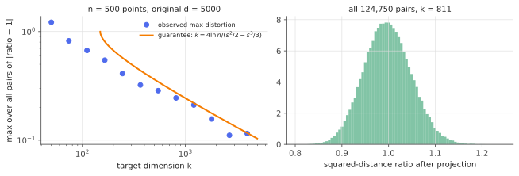

# Johnson–Lindenstrauss

!!! tldr "TL;DR"
    Any $n$ points in $\R^d$, however large $d$ is, can be mapped into $k = O(\varepsilon^{-2}\log n)$ dimensions by a **random linear map** so that every pairwise distance is preserved up to a factor $1\pm\varepsilon$. The target dimension depends on the *number* of points, not on the original dimension.
    The proof is two lines: a random projection preserves one squared norm up to a chi-square fluctuation (sub-exponential concentration), and a union bound over the $\binom n2$ pairs costs only a $\log n$. Gaussian, $\pm1$ and sparse random matrices all work. This is the basis of sketching, random-projection nearest-neighbour search and randomized linear algebra.

## Why care?

High-dimensional data is expensive: storing 100-million-dimensional bag-of-words vectors, computing all pairwise distances between millions of embeddings, or keeping per-example gradients of a billion-parameter model for data attribution. Often what we need is only the **geometry**: distances, inner products, angles.

Johnson and Lindenstrauss (1984) proved, almost as a side lemma in a functional-analysis paper, that this geometry survives a drastic, *data-oblivious* compression. A random matrix chosen without looking at the data will, with high probability, preserve all pairwise distances among any $n$ points. In the [geometry of high dimensions](high-dim-geometry.md) we saw that random vectors behave predictably. JL is the most useful consequence of that predictability.

## Building blocks

**Random projection.** Let $A\in\R^{k\times d}$ have i.i.d. $N(0, 1/k)$ entries (or $\pm1/\sqrt k$, or sparse variants). For a fixed $x$, each coordinate of $Ax$ is $N(0,\|x\|^2/k)$, independently across coordinates, so

$$
\frac{\|Ax\|^2}{\|x\|^2}\sim\frac{\chi^2_k}{k},\qquad\E\|Ax\|^2 = \|x\|^2,\qquad\operatorname{sd}\Big(\frac{\|Ax\|^2}{\|x\|^2}\Big) = \sqrt{2/k}.
$$

The projection is unbiased for squared norms, with relative fluctuations of order $1/\sqrt k$, **independent of $d$**.

**Chi-square concentration.** From the [sub-exponential](subgaussian-subexponential.md) tail of $Z^2 - 1$ (or a direct Chernoff computation), for $0 < \varepsilon < 1$,

$$
\P\Big(\Big|\frac{\chi^2_k}{k} - 1\Big|\ge\varepsilon\Big)\le2\exp\Big(-\frac k2\Big(\frac{\varepsilon^2}{2} - \frac{\varepsilon^3}{3}\Big)\Big).
$$

## The main result

!!! theorem "Theorem (Johnson–Lindenstrauss lemma)"
    Let $0 < \varepsilon < 1$, let $x_1,\dots,x_n\in\R^d$, and let

    $$
    k\ \ge\ \frac{4\ln n}{\varepsilon^2/2 - \varepsilon^3/3}\qquad(\text{e.g. }k\ge\tfrac{8\ln n}{\varepsilon^2}\text{ for small }\varepsilon).
    $$

    Then a random $A\in\R^{k\times d}$ with i.i.d. $N(0,1/k)$ entries satisfies, with probability at least $1 - 1/n$,

    $$
    (1-\varepsilon)\|x_i - x_j\|^2\le\|Ax_i - Ax_j\|^2\le(1+\varepsilon)\|x_i - x_j\|^2\qquad\text{for all } i, j .
    $$

**Proof.** Apply the chi-square bound to each difference vector $x_i - x_j$ (linearity: $Ax_i - Ax_j = A(x_i - x_j)$). Each pair fails with probability at most $2\exp(-\frac k2(\varepsilon^2/2 - \varepsilon^3/3))\le2\exp(-2\ln n) = 2/n^2$ under the stated $k$. A union bound over fewer than $n^2/2$ pairs gives a total failure probability $\le1/n$. $\square$

**Remarks.**

- **Only $\log n$.** The union bound is cheap because tails are exponential ([maxima of sub-Gaussians](subgaussian-subexponential.md)). Preserving $n$ distances costs $\log n$ dimensions, and the original dimension $d$ never appears.
- **Optimality.** Larsen & Nelson (2017) showed that $k = \Omega(\varepsilon^{-2}\log n)$ is necessary for *any* map, linear or not, in the worst case. JL can't be improved.
- **Other matrices.** Any sub-Gaussian entries work (Rademacher $\pm1$). **Sparse** JL (Achlioptas: entries in $\{-\sqrt3, 0, \sqrt3\}$ with probabilities $\frac16,\frac23,\frac16$; Kane–Nelson with $O(\varepsilon^{-1}\log n)$ nonzeros per column) speeds up the multiplication. The **fast JL transform** (randomized Hadamard + sampling) computes $Ax$ in $O(d\log d)$.
- **Inner products and angles.** Distances determine inner products by polarization, so $\langle Ax, Ay\rangle$ is within $\frac\varepsilon2(\|x\|^2 + \|y\|^2)$ of $\langle x, y\rangle$ (Exercise 4).
- **Subspaces, not just points.** A union bound over an $\varepsilon$-net of a $r$-dimensional subspace (about $(3/\varepsilon)^r$ points) shows $k = O(r/\varepsilon^2)$ suffices to preserve **all** vectors in it. This is a *subspace embedding*, the basis of sketched least squares (Exercise 5) and of the RIP for compressed sensing.

{ .fig }

## Examples

### Compressing 10,000 dimensions

```python
import numpy as np
rng = np.random.default_rng(0)

def pairwise_sq(Y):
    sq = (Y**2).sum(1)
    D = sq[:, None] + sq[None, :] - 2 * Y @ Y.T
    return D[np.triu_indices(len(Y), 1)]

n, d = 1000, 10_000
X = rng.standard_normal((n, d)) * rng.uniform(0.1, 3, d)        # 1000 points in 10,000 dimensions, anisotropic
D0 = pairwise_sq(X)

def jl_epsilon(k, n):
    # smallest eps < 1 with k >= 4 ln n / (eps^2/2 - eps^3/3): all pairs within (1 ± eps), w.p. >= 1 - 1/n
    eps = np.linspace(1e-3, 1, 100000); ok = 4 * np.log(n) / (eps**2 / 2 - eps**3 / 3) <= k
    return eps[ok][0] if ok.any() else None
for k in [50, 200, 800, 3200]:
    for name, A in [("Gaussian", rng.standard_normal((d, k))),
                    ("sparse ±1", rng.choice([-1.0, 0.0, 1.0], size=(d, k), p=[1/6, 2/3, 1/6]) * np.sqrt(3))]:
        ratio = pairwise_sq(X @ A / np.sqrt(k)) / D0                 # squared-distance distortion for all 499,500 pairs
        print(f"k = {k:4d} {name:9s}  max distortion |ratio - 1| = {np.max(np.abs(ratio - 1)):.3f}   "
              f"JL guarantee: {('%.3f' % jl_epsilon(k, n)) if jl_epsilon(k, n) else 'none (k too small)'}")
# k =   50 Gaussian   max distortion |ratio - 1| = 1.238   JL guarantee: none (k too small)
# k =   50 sparse ±1  max distortion |ratio - 1| = 1.293   JL guarantee: none (k too small)
# k =  200 Gaussian   max distortion |ratio - 1| = 0.533   JL guarantee: 0.737
# k =  200 sparse ±1  max distortion |ratio - 1| = 0.559   JL guarantee: 0.737
# k =  800 Gaussian   max distortion |ratio - 1| = 0.247   JL guarantee: 0.293
# k =  800 sparse ±1  max distortion |ratio - 1| = 0.258   JL guarantee: 0.293
# k = 3200 Gaussian   max distortion |ratio - 1| = 0.115   JL guarantee: 0.138
# k = 3200 sparse ±1  max distortion |ratio - 1| = 0.115   JL guarantee: 0.138
```

Projecting from 10,000 to 800 dimensions (12× smaller) keeps **every one** of the 499,500 squared distances within ±25%. With 3200 dimensions, within ±12%. The theorem's guarantee is within about 20% of the observed worst case, so the union bound is not very loose. The sparse matrix (two-thirds zeros) performs just as well at a third of the cost.
Note that the guarantee ignores the data's anisotropy and the ambient dimension entirely.

## Exercises

!!! question "Exercise 1 · warm-up: how small can you go?"
    Using $k\ge8\ln n/\varepsilon^2$, how many dimensions do you need to preserve all pairwise distances among $n = 10^6$ points to within 10%? Among $n = 10^9$? Does the original dimension matter?

    ??? success "Solution"
        $n = 10^6$: $8\times13.8/0.01\approx11{,}000$. $n = 10^9$: $8\times20.7/0.01\approx16{,}600$. A thousand-fold increase in the number of points costs only 50% more dimensions, and the original dimension (a million, a billion) doesn't enter at all. In practice the constant is often smaller, since the worst case is pessimistic for typical data.

!!! question "Exercise 2 · Rademacher projections are unbiased"
    Let $A$ have i.i.d. entries $\pm1/\sqrt k$. Show $\E\|Ax\|^2 = \|x\|^2$ and compute $\Var(\|Ax\|^2)$. Is it smaller or larger than the Gaussian variance $2\|x\|^4/k$?

    ??? success "Solution"
        Row $i$ gives $(Ax)_i = \frac1{\sqrt k}\sum_j\varepsilon_{ij}x_j$, with $\E(Ax)_i^2 = \frac1k\|x\|^2$, so $\E\|Ax\|^2 = \|x\|^2$. Also $\E(Ax)_i^4 = \frac{1}{k^2}\big[3\|x\|^4 - 2\sum_jx_j^4\big]$ (from $\E\varepsilon^4 = 1$ instead of 3), so $\Var((Ax)_i^2) = \frac{1}{k^2}(2\|x\|^4 - 2\|x\|_4^4)$ and $\Var\|Ax\|^2 = \frac{2}{k}(\|x\|^4 - \|x\|_4^4)$. That is **slightly smaller** than Gaussian. Sign matrices are at least as good, and cheaper.

!!! question "Exercise 3 · where the union bound goes"
    Redo the proof's arithmetic: with $k = 4\ln n/(\varepsilon^2/2 - \varepsilon^3/3)$, show that each pair fails with probability $\le2/n^2$ and all pairs succeed with probability $\ge1 - 1/n$. How would you change $k$ to get success probability $1 - \delta$?

    ??? success "Solution"
        $2\exp(-\frac k2(\varepsilon^2/2 - \varepsilon^3/3)) = 2\exp(-2\ln n) = 2/n^2$. Over $\binom n2 < n^2/2$ pairs, the failure probability is $< 1/n$. For general $\delta$, require $2\binom n2e^{-\frac k2c(\varepsilon)}\le\delta$ with $c(\varepsilon) = \varepsilon^2/2 - \varepsilon^3/3$, i.e. $k\ge\frac{2\ln(n^2/\delta)}{c(\varepsilon)}$. The dependence on $\delta$ is logarithmic.

!!! question "Exercise 4 · inner products"
    If $A$ preserves the squared norms of $x + y$, $x - y$ (and $x$, $y$) up to $1\pm\varepsilon$, show $|\langle Ax, Ay\rangle - \langle x, y\rangle|\le\frac\varepsilon2(\|x\|^2 + \|y\|^2)$. What does this imply for cosine similarities of unit vectors?

    ??? success "Solution"
        Polarization: $\langle u, v\rangle = \frac14(\|u + v\|^2 - \|u - v\|^2)$. Then $\langle Ax, Ay\rangle - \langle x, y\rangle = \frac14\big[(\|A(x+y)\|^2 - \|x+y\|^2) - (\|A(x-y)\|^2 - \|x-y\|^2)\big]$, so its absolute value is at most $\frac\varepsilon4(\|x+y\|^2 + \|x-y\|^2) = \frac\varepsilon2(\|x\|^2 + \|y\|^2)$.
        For unit vectors, cosines are preserved to within about $\varepsilon$ in **absolute** terms, which is fine for large similarities but useless for distinguishing near-orthogonal pairs whose cosines are themselves $O(1/\sqrt d)$.

!!! question "Exercise 5 · stretch: sketch-and-solve least squares"
    Let $X\in\R^{n\times p}$ with $n\gg p$, and let $S\in\R^{k\times n}$ be a subspace embedding for the column space of $[X\ y]$: $(1-\varepsilon)\|v\|^2\le\|Sv\|^2\le(1+\varepsilon)\|v\|^2$ for all $v$ in that $(p+1)$-dimensional space. Show that $\tilde\beta = \arg\min\|S(y - X\beta)\|$ satisfies $\|y - X\tilde\beta\|^2\le\frac{1+\varepsilon}{1-\varepsilon}\min_\beta\|y - X\beta\|^2$.

    ??? success "Solution"
        For any $\beta$, $y - X\beta$ lies in the column space of $[X\ y]$. So $(1-\varepsilon)\|y - X\tilde\beta\|^2\le\|S(y - X\tilde\beta)\|^2\le\|S(y - X\hat\beta)\|^2\le(1+\varepsilon)\|y - X\hat\beta\|^2$, where $\hat\beta$ is the true OLS solution and the middle inequality is the optimality of $\tilde\beta$ for the sketched problem. Rearranging gives the claim.
        A subspace embedding needs only $k = O(p/\varepsilon^2)$ rows (independent of $n$), so a regression with $n = 10^8$ rows can be solved on a sketch of a few thousand rows. With the fast JL transform the sketch itself costs $O(np\log n)$.

## Where it shows up

- **Nearest-neighbour search.** Random projections are the basis of locality-sensitive hashing (sign of random projections for cosine similarity, SimHash) and of dimensionality reduction before approximate NN indexes for embedding retrieval.
- **Randomized linear algebra.** Randomized SVD/PCA (Halko, Martinsson & Tropp), sketched least squares and preconditioners, and streaming sketches all rely on JL-type embeddings ([matrix Bernstein](matrix-bernstein.md) covers the row-sampling variant).
- **Data attribution for large models.** Methods such as TRAK project per-example gradients of very large networks to a few thousand dimensions with random matrices. JL guarantees that inner products between gradients, the core of influence estimates, are approximately preserved.
- **Compressed sensing.** The restricted isometry property needed for sparse recovery follows from JL plus a union bound over all sparse supports (Baraniuk, Davenport, DeVore & Wakin, 2008).
- **Privacy and federated learning.** Random projections compress updates and can contribute to privacy guarantees. Count-sketch-style compression of gradients reduces communication in distributed training.

## Further reading

- S. Dasgupta & A. Gupta, "An elementary proof of a theorem of Johnson and Lindenstrauss" (*Random Struct. Algorithms*, 2003).
- D. Achlioptas, "Database-friendly random projections" (*J. Comput. Syst. Sci.*, 2003).
- D. Woodruff, "Sketching as a tool for numerical linear algebra" (*Found. Trends TCS*, 2014).
- K. G. Larsen & J. Nelson, "Optimality of the Johnson–Lindenstrauss lemma" (FOCS 2017).
