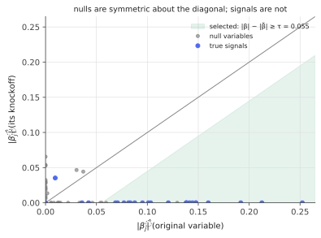

# Model-X knockoffs

!!! tldr "TL;DR"
    To select variables with a guaranteed false discovery rate, give every feature $X_j$ a **knockoff twin** $\tilde X_j$: a fake variable that mimics the correlation structure of the real ones but is, by construction, unrelated to the response. Fit any model to the augmented data $[X, \tilde X]$ and compute, for each $j$, a statistic $W_j$ measuring how much more important $X_j$ looks than its knockoff.
    For null variables the sign of $W_j$ is a fair coin flip, so the number of large negative $W_j$'s estimates the number of false positives among the large positive ones. Thresholding with the **knockoff+** rule controls the FDR at level $q$ **in finite samples, for any model of $y\mid X$**, provided the distribution of $X$ is known.

## Why care?

[Multiple testing](multiple-testing-fdr.md) with Benjamini–Hochberg needs valid $p$-values for each variable. In high-dimensional regression ($p$ close to or above $n$, nonlinear models, logistic or tree-based fits), valid per-variable $p$-values are hard or impossible to get. Meanwhile "the variables the LASSO selected" have no error guarantee at all. In the simulation below, half of them are false.

Knockoffs (Barber & Candès 2015 for fixed designs; Candès, Fan, Janson & Lv 2018 for the "model-X" version) solve this differently. They don't model $y\mid X$ at all, which can be a deep network or a random forest. They need only that we know (or can model well) the distribution of the **features**, which is often easier: genotypes follow population-genetic models, and asset exposures and engineered features can be modelled from abundant unlabelled data. In exchange, you get FDR control with essentially any feature-importance measure.

## Building blocks

**The goal.** Find variables $j$ such that $X_j$ is *not* conditionally independent of $y$ given the other features. Null variables satisfy $y\perp X_j\mid X_{-j}$. We want a selected set $\hat S$ with $\mathrm{FDR} = \E\Big[\frac{|\hat S\cap\mathcal H_0|}{\max(|\hat S|, 1)}\Big]\le q$.

**Knockoffs.** A random vector $\tilde X\in\R^p$ is a model-X knockoff for $X$ if

1. **Swap exchangeability:** for any subset $S$, swapping $X_j\leftrightarrow\tilde X_j$ for all $j\in S$ leaves the joint distribution of $(X,\tilde X)$ unchanged;
2. **Ignores the response:** $\tilde X\perp y\mid X$ (construct $\tilde X$ without looking at $y$).

**Gaussian construction.** If $X\sim N(0,\Sigma)$, then for any diagonal $D = \diag(s)\succeq0$ with $2\Sigma - D\succeq0$,

$$
\tilde X\mid X\sim N\big(X - X\Sigma^{-1}D,\ \ 2D - D\Sigma^{-1}D\big)
$$

(rows as observations) gives a valid knockoff. The joint covariance is $\begin{pmatrix}\Sigma & \Sigma - D\\ \Sigma - D & \Sigma\end{pmatrix}$ (Exercise 1). Knockoffs have the same correlations with the *other* variables as the originals, but correlation $1 - s_j$ with their own original. Larger $s_j$ makes the knockoff more distinguishable from the original and so gives more power. The
**equicorrelated** choice $s_j = \min(2\lambda_{\min}(\Sigma), 1)$ (for a correlation matrix) is simple, and an SDP choice maximizes $\sum s_j$.

**Feature statistics.** Fit any method to $[X,\tilde X]$ and $y$, producing importances $Z_j$ and $\tilde Z_j$, then set $W_j = f(Z_j,\tilde Z_j)$ with $f$ **antisymmetric**: swapping $X_j$ with $\tilde X_j$ flips the sign of $W_j$. A popular choice is the LASSO coefficient difference $W_j = |\hat\beta_j| - |\hat\beta_{\tilde j}|$. Others include the difference in entry times on the [LASSO path](lars.md) and differences in random-forest importances.

## The main result

**The coin-flip property.** Conditional on $|W|$, the signs of the null $W_j$'s are i.i.d. fair coins, independent of everything else. This follows from swap exchangeability: swapping a null variable with its knockoff doesn't change the joint law of $(X,\tilde X, y)$, because $y$ depends on $X$ only through the non-nulls, but it flips $W_j$.

**Knockoff+ selection.** For a target $q$, let

$$
\tau = \min\Big\{t > 0 : \frac{1 + \#\{j : W_j\le -t\}}{\#\{j : W_j\ge t\}\vee1}\le q\Big\},\qquad\hat S = \{j : W_j\ge\tau\}.
$$

!!! theorem "Theorem (Barber & Candès 2015; Candès, Fan, Janson & Lv 2018)"
    If $\tilde X$ is a valid model-X knockoff and $W$ satisfies the antisymmetry property, then the knockoff+ selection satisfies

    $$
    \mathrm{FDR} = \E\Big[\frac{|\hat S\cap\mathcal H_0|}{|\hat S|\vee1}\Big]\le q,
    $$

    for any sample size, any dimension, and any conditional distribution of $y$ given $X$.

**Why it works.** Because null signs are fair coins, $\#\{\text{null } j : W_j\le-t\}$ has the same distribution as $\#\{\text{null } j : W_j\ge t\}$. So $\#\{j : W_j\le-t\}$, which counts only nulls plus possibly a few signals, is a (conservative) estimate of the number of false positives among $\{W_j\ge t\}$. The ratio in the definition of $\tau$ is therefore an estimate of the FDP, and $\tau$ is the most liberal threshold whose estimated FDP is at most $q$.
The "+1" makes the estimate slightly conservative, and with it a supermartingale/optional-stopping argument over the coin flips turns "estimated FDP $\le q$" into "true FDR $\le q$" exactly. Without the +1 one gets control of a slightly modified FDR. $\square$

### What you need, and what can go wrong

- **The feature distribution must be known.** If the knockoffs are built from a misspecified model of $X$, exchangeability fails and FDR control becomes approximate. Robustness results bound the inflation by how well the model of $X$ fits. With lots of unlabelled $X$, this is easier to get right than a model of $y\mid X$.
- **Highly correlated features** force small $s_j$ (knockoffs nearly identical to originals), and power drops: the method can't tell which of two near-duplicates matters. Group knockoffs select correlated groups instead.
- **Randomness.** The selected set depends on the random knockoff draw. Derandomized versions (aggregating over several draws, e.g. with e-values) stabilize it.

{ .fig }

## Examples

### Selecting variables with a guarantee

```python
import numpy as np
rng = np.random.default_rng(0)

def lasso_cd(X, y, lam, iters=100):
    n, p = X.shape; b = np.zeros(p); r = y.copy(); col = (X**2).sum(0) / n
    for _ in range(iters):
        for j in range(p):
            r += X[:, j] * b[j]; z = X[:, j] @ r / n
            b[j] = np.sign(z) * max(abs(z) - lam, 0) / col[j]; r -= X[:, j] * b[j]
    return b

def gaussian_knockoffs(X, Sigma):
    """Equicorrelated model-X knockoffs for rows X_i ~ N(0, Sigma) (Sigma a correlation matrix)."""
    p = len(Sigma); s = min(2 * np.linalg.eigvalsh(Sigma)[0], 1.0) * 0.999
    D = s * np.eye(p); Si_D = np.linalg.solve(Sigma, D)
    mean = X - X @ Si_D                                        # E[X~ | X] = X - X Σ^{-1} D
    cov = 2 * D - D @ Si_D                                     # Cov[X~ | X] = 2D - D Σ^{-1} D
    return mean + rng.standard_normal(X.shape) @ np.linalg.cholesky(cov).T

def knockoff_plus_threshold(W, q):
    for t in np.sort(np.abs(W[W != 0])):
        if (1 + np.sum(W <= -t)) / max(1, np.sum(W >= t)) <= q:
            return t
    return np.inf

n, p, k, q = 600, 150, 25, 0.1
Sigma = 0.5 ** np.abs(np.subtract.outer(np.arange(p), np.arange(p)))   # AR(1) correlated features
L = np.linalg.cholesky(Sigma)
fdp, power, fdp_naive, power_naive = [], [], [], []
for rep in range(20):
    X = rng.standard_normal((n, p)) @ L.T
    beta = np.zeros(p); S = rng.choice(p, k, replace=False); beta[S] = rng.choice([-1, 1], k) * 0.18
    y = X @ beta + rng.standard_normal(n)
    Xk = gaussian_knockoffs(X, Sigma)
    b = lasso_cd(np.hstack([X, Xk]), y, lam=0.05)
    W = np.abs(b[:p]) - np.abs(b[p:])                          # antisymmetric "who wins" statistic
    sel = np.flatnonzero(W >= knockoff_plus_threshold(W, q))
    true = np.isin(sel, S)
    fdp.append((len(sel) - true.sum()) / max(1, len(sel))); power.append(true.sum() / k)
    naive = np.flatnonzero(np.abs(lasso_cd(X, y, lam=0.05)) > 1e-8)    # "whatever the LASSO selects"
    fdp_naive.append(np.mean(~np.isin(naive, S))); power_naive.append(np.isin(S, naive).mean())
print(f"knockoff+ at q = {q}:  mean FDP {np.mean(fdp):.3f}   mean power {np.mean(power):.2f}   "
      f"(min/max FDP over runs {np.min(fdp):.2f}/{np.max(fdp):.2f})")
print(f"plain LASSO selection:   mean FDP {np.mean(fdp_naive):.3f}   mean power {np.mean(power_naive):.2f}")
# knockoff+ at q = 0.1:  mean FDP 0.084   mean power 0.72   (min/max FDP over runs 0.00/0.23)
# plain LASSO selection:   mean FDP 0.487   mean power 0.99
```

The LASSO alone finds almost every true variable, but nearly half of what it reports is noise. Knockoff+ keeps the average false-discovery proportion at $0.084\le0.1$ and still finds 72% of the signals. Note that the guarantee is on the **average**: individual runs had FDP up to 0.23, which is normal for FDR control.

## Exercises

!!! question "Exercise 1 · warm-up: the joint covariance"
    Using $\tilde X\mid X\sim N(X - X\Sigma^{-1}D,\ 2D - D\Sigma^{-1}D)$ (per row, with $X\sim N(0,\Sigma)$), compute $\Cov(\tilde X)$ and $\Cov(X,\tilde X)$. Why must $2\Sigma - D\succeq0$?

    ??? success "Solution"
        $\Cov(X,\tilde X) = \Cov(X, X(I - \Sigma^{-1}D)) = \Sigma(I - \Sigma^{-1}D) = \Sigma - D$. $\Cov(\tilde X) = (I - D\Sigma^{-1})\Sigma(I - \Sigma^{-1}D) + 2D - D\Sigma^{-1}D = \Sigma - 2D + D\Sigma^{-1}D + 2D - D\Sigma^{-1}D = \Sigma$. So the joint covariance is $\begin{pmatrix}\Sigma & \Sigma - D\\ \Sigma - D & \Sigma\end{pmatrix}$, which is invariant under swapping any $j$ with $\tilde j$. That gives exchangeability for Gaussians.
        It must be PSD. Its Schur complement is $\Sigma - (\Sigma - D)\Sigma^{-1}(\Sigma - D) = 2D - D\Sigma^{-1}D$, which is PSD iff $2\Sigma - D\succeq0$ (for $D\succ0$).

!!! question "Exercise 2 · antisymmetry"
    Check that $W_j = |\hat\beta_j| - |\hat\beta_{\tilde j}|$ (LASSO on $[X,\tilde X]$) changes sign when columns $j$ and $\tilde j$ are swapped, and that swapping other pairs doesn't change $W_j$. Why would $W_j = |\hat\beta_j|$ alone not work?

    ??? success "Solution"
        The LASSO is invariant to permuting columns: swapping columns $j$ and $\tilde j$ swaps their coefficients, so $|\hat\beta_j|\leftrightarrow|\hat\beta_{\tilde j}|$ and $W_j\to-W_j$. Swapping another pair permutes other coefficients and leaves these two unchanged.
        With $W_j = |\hat\beta_j|\ge0$ there are no negative values to estimate false positives from. The knockoff is what provides a matched, exchangeable "control" for each variable.

!!! question "Exercise 3 · why the +1?"
    Suppose there are no signals at all and $p = 10$ nulls, with $q = 0.1$. Show that without the "+1" the threshold could select a variable whenever the largest $|W_j|$ is positive, i.e. with probability $1/2$, while with it nothing can ever be selected. Compute the FDR in each case.

    ??? success "Solution"
        Without +1, at $t = \max|W_j|$, if the top $W$ is positive, the estimate is $\frac{0}{1} = 0\le q$, so it's selected. This happens with probability $1/2$ (coin flip), and every selection is false, so FDR $= 1/2\gg0.1$. With +1 the estimate is at least $\frac{1}{\#\{W\ge t\}}$. To get below $0.1$ requires at least 10 positives with no negatives above them, impossible with 10 nulls unless all ten signs are $+$ (probability $2^{-10}$). The FDR is then $\le2^{-10}$, comfortably below $q$. The +1 is a finite-sample correction, like the $(n+1)$ in [conformal prediction](conformal-prediction.md).

!!! question "Exercise 4 · the price of correlation"
    For an equicorrelated design $\Sigma = (1-\rho)I + \rho\mathbf 1\mathbf 1^\top$, $\lambda_{\min} = 1 - \rho$. What is the equicorrelated $s$, and the correlation $1 - s$ between each variable and its knockoff, for $\rho = 0.3$ and $\rho = 0.9$? Interpret for power.

    ??? success "Solution"
        $s = \min(2(1-\rho), 1)$. For $\rho = 0.3$: $s = 1$, so the correlation with the knockoff is $0$ and the knockoffs are easy to tell apart. For $\rho = 0.9$: $s = 0.2$, so the correlation is $0.8$ and each knockoff is nearly a copy of its original. Any fitting method will split importance between them, $|W_j|$ is small, and power collapses. That is the honest answer: with features this correlated, the data can't say which one matters, given the others.

!!! question "Exercise 5 · stretch: the FDP estimate as a martingale"
    Let $m_0$ be the number of nulls, $V^+(t) = \#\{\text{null } j : W_j\ge t\}$ and $V^-(t) = \#\{\text{null } j : W_j\le-t\}$. Raise the threshold $t$ from 0 upward, so that nulls drop out one at a time, and condition at each stage on the magnitudes $|W_j|$ and on the current counts $(V^+, V^-) = (a, b)$, but not on which nulls are positive.
    Show that $M(t) = \frac{V^+(t)}{1 + V^-(t)}$ is a martingale in this filtration (as long as $b\ge1$; for $b = 0$ it is a supermartingale). Use optional stopping at $\tau$ and $\E M(0)\le1$ to conclude $\mathrm{FDR}\le q$.

    ??? success "Solution"
        By the coin-flip property, given the counts, the remaining null signs are exchangeable, so the next null to drop out is a positive one with probability $\frac{a}{a+b}$. The new value of $M$ is $\frac{a-1}{1+b}$ with probability $\frac{a}{a+b}$, or $\frac{a}{b}$ with probability $\frac{b}{a+b}$. Its expectation is
        $\frac{1}{a+b}\Big[\frac{a(a-1)}{1+b} + a\Big] = \frac{a(a - 1 + 1 + b)}{(1+b)(a+b)} = \frac{a}{1+b} = M$, a martingale. (When $b = 0$ the only move is $a\to a-1$, which decreases $M$.)

        The threshold $\tau$ is a stopping time for this filtration (it depends only on counts at levels $\ge t$), so optional stopping gives $\E M(\tau)\le\E M(0)$. At $t = 0$, $V^+\sim\mathrm{Bin}(m_0, \frac12)$ and $V^- = m_0 - V^+$, and $\E\frac{V^+}{1 + m_0 - V^+} = 1 - 2^{-m_0}\le1$.
        Finally, since $V^-(\tau)\le\#\{j : W_j\le-\tau\}$, the definition of $\tau$ gives
        $\mathrm{FDP} = \frac{V^+(\tau)}{\#\{W\ge\tau\}\vee1} = \frac{V^+(\tau)}{1 + V^-(\tau)}\cdot\frac{1 + V^-(\tau)}{\#\{W\ge\tau\}\vee1}\le M(\tau)\,q$. Taking expectations, $\mathrm{FDR}\le q$.

## Where it shows up

- **Genome-wide association studies.** HMM-based knockoffs for genotypes (Sesia, Sabatti & Candès, 2019) give FDR-controlled discoveries of genetic variants with any machine-learning model of the phenotype. This is the flagship application.
- **Interpretable ML.** "Which inputs matter?" for black-box models (random forests, gradient boosting, neural networks) with error control. Deep knockoffs use generative models to build knockoffs for complex feature distributions.
- **Quant research.** Selecting predictive signals or factors from hundreds of candidates with FDR guarantees, using models of the joint distribution of characteristics, as a principled antidote to backtest overfitting ([multiple testing](multiple-testing-fdr.md)).
- **Conditional independence testing.** The conditional randomization test, a close relative, uses the same "known $X$-distribution" idea to produce valid $p$-values for $y\perp X_j\mid X_{-j}$ with any test statistic.
- **Causal discovery and neuroscience.** Selecting brain regions, proteins or interacting variables with FDR control when the number of candidates exceeds the sample size.

## Further reading

- R. F. Barber & E. Candès, "Controlling the false discovery rate via knockoffs" (*Ann. Stat.*, 2015).
- E. Candès, Y. Fan, L. Janson & J. Lv, "Panning for gold: model-X knockoffs for high dimensional controlled variable selection" (*JRSS-B*, 2018).
- M. Sesia, C. Sabatti & E. Candès, "Gene hunting with hidden Markov model knockoffs" (*Biometrika*, 2019).
- Y. Romano, M. Sesia & E. Candès, "Deep knockoffs" (*JASA*, 2020).
