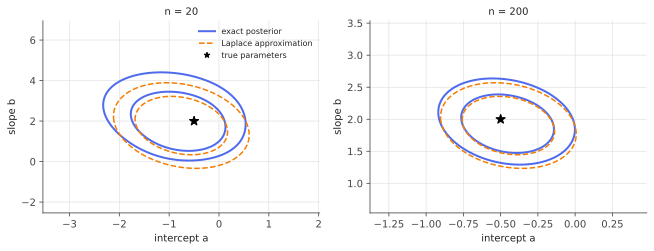

# Credible intervals & the Laplace approximation

!!! tldr "TL;DR"
    A Bayesian **credible interval** is an interval that contains the parameter with a stated posterior probability, given the data. Computing it needs the posterior, which is rarely available in closed form. The **Laplace approximation** replaces the posterior by a Gaussian centred at the posterior mode, with covariance equal to the inverse Hessian of the negative log-posterior: $p(\theta\mid y)\approx N(\hat\theta_{\text{MAP}}, H^{-1})$.
    The **Bernstein–von Mises** theorem says that, for regular models with $p$ fixed and $n\to\infty$, the posterior really is approximately $N(\hat\theta, I^{-1}/n)$, so credible intervals are asymptotically **valid frequentist confidence intervals**. The Laplace approximation also gives the evidence (and hence BIC), and in its "linearized" form it is one of the cheapest ways to add uncertainty to deep networks. It fails when posteriors are skewed, multimodal, on a boundary, or high-dimensional relative to the data.

## Why care?

A point estimate says nothing about how sure you should be. Bayesian inference answers with a full posterior distribution, but for anything beyond conjugate models ([Bayesian linear regression](bayesian-linear-regression.md)) the posterior has no closed form. MCMC is the gold standard but can be slow, especially for large models.

The Laplace approximation is the cheapest alternative. It needs only an optimizer (to find the mode) and a Hessian (to measure the curvature there), the same two things you compute when fitting by maximum likelihood. It gives:

- approximate **credible intervals** for logistic regression, GLMs, and nonlinear models;
- an approximate **model evidence** for model comparison and hyperparameter tuning, and the derivation of the **BIC**;
- **uncertainty for neural networks**: the (linearized) Laplace approximation turns a trained network into an approximate Bayesian one post hoc, improving calibration and out-of-distribution detection at little cost.

And Bernstein–von Mises explains when Bayesian and frequentist uncertainty agree, a recurring question in this UQ track.

## Building blocks

**Credible intervals.** Given the posterior of a scalar $\theta$:

- **equal-tailed** interval: from the $\alpha/2$ to the $1-\alpha/2$ posterior quantile;
- **highest posterior density (HPD)** interval: the shortest interval with posterior mass $1-\alpha$ (all points inside have higher density than all points outside). For skewed posteriors it is shifted toward the mode.

Interpretation: "given this model, prior and data, $\P(\theta\in C\mid y) = 1-\alpha$." This is a probability statement about $\theta$, unlike a confidence interval, which is a statement about the procedure over repeated samples.

**Second-order Taylor expansion of the log-posterior.** Let $\Psi(\theta) = -\log p(\theta\mid y) = -\log p(y\mid\theta) - \log p(\theta) + \text{const}$, with minimizer $\hat\theta$ (the MAP) and Hessian $H = \nabla^2\Psi(\hat\theta)$. Since $\nabla\Psi(\hat\theta) = 0$,

$$
\Psi(\theta)\approx\Psi(\hat\theta) + \tfrac12(\theta - \hat\theta)^\top H(\theta - \hat\theta)\quad\Longrightarrow\quad p(\theta\mid y)\approx N(\hat\theta, H^{-1}).
$$

For a likelihood with $n$ observations, $H\approx nI(\hat\theta)$ + (prior curvature): **curvature equals precision**, the same Fisher information as in the [Cramér–Rao note](fisher-kl-cramer-rao.md).

## The main results

!!! theorem "Theorem (Bernstein–von Mises)"
    Let $X_1,\dots,X_n$ be i.i.d. from a regular parametric model $p_{\theta_0}$ with fixed dimension $p$, Fisher information $I(\theta_0)$ positive definite, and a prior with continuous positive density near $\theta_0$. Then

    $$
    \big\|\,p(\theta\mid X_{1:n}) - N\big(\hat\theta_{\text{MLE}},\ \tfrac1nI(\theta_0)^{-1}\big)\big\|_{TV}\ \to\ 0\quad\text{in probability}.
    $$

    Consequently, $(1-\alpha)$ credible intervals have frequentist coverage $\to1-\alpha$.

The prior washes out (its influence is $O(1/n)$ relative to the likelihood), the posterior becomes Gaussian, and its spread matches the sampling distribution of the MLE. The asymptotic Bayesian and frequentist answers agree. The fine print matters, though. BvM can fail when $p$ grows with $n$ (cf. the [high-dimensional MLE](high-dim-mle.md)), for non-regular models (parameters on a boundary, mixtures), with priors that put zero mass near the truth, and for infinite-dimensional parameters.

**The Laplace approximation to the evidence.** Integrating the Gaussian approximation,

$$
p(y) = \int p(y\mid\theta)p(\theta)\,d\theta\ \approx\ p(y\mid\hat\theta)\,p(\hat\theta)\,(2\pi)^{p/2}\det(H)^{-1/2}.
$$

With $\det H\approx n^p\det I$ for large $n$, taking logs and keeping the terms that grow with $n$ gives

$$
\log p(y)\approx\log p(y\mid\hat\theta) - \frac p2\log n\qquad(\text{the Bayesian information criterion, up to a factor }-2).
$$

The $-\frac p2\log n$ term is the "Occam factor": each extra parameter costs a factor of about $\sqrt n$ in evidence, because the posterior volume shrinks relative to the prior volume.

### When the Gaussian is a poor approximation

The Laplace approximation is local: it sees only the mode and the curvature there. It misses **skewness** (small samples, parameters near a boundary such as probabilities near 0 or variances near 0, which is often fixed by reparametrizing, e.g. log-variance or logit), **multimodality** (mixtures, symmetric neural-network weight spaces), and **heavy tails**. Alternatives include variational inference (Gaussian fitted to minimize KL rather than at the mode), MCMC, integrated nested Laplace approximations (INLA), and Laplace in a better parametrization.

{ .fig }

With $n = 20$ the exact posterior of a logistic regression is visibly skewed (a longer tail toward large slopes), and the Laplace Gaussian is centred too low. With $n = 200$ the two nearly coincide, as BvM predicts.

## Examples

### Bayesian logistic regression: Laplace vs exact

```python
import numpy as np
rng = np.random.default_rng(0)
sig = lambda t: 1 / (1 + np.exp(-t))
tau = 3.0                                                   # prior: (a, b) ~ N(0, tau^2 I)

def log_post(a, b, x, y):                                   # intercept a, slope b (vectorized over grids)
    eta = a[..., None] + b[..., None] * x
    return np.sum(y * eta - np.logaddexp(0, eta), -1) - (a**2 + b**2) / (2 * tau**2)

def laplace(x, y):
    """MAP by Newton, covariance = inverse Hessian of the negative log-posterior at the MAP."""
    X = np.column_stack([np.ones_like(x), x]); w = np.zeros(2)
    for _ in range(50):
        p = sig(X @ w)
        H = X.T @ ((p * (1 - p))[:, None] * X) + np.eye(2) / tau**2
        w = w + np.linalg.solve(H, X.T @ (y - p) - w / tau**2)
    p = sig(X @ w); H = X.T @ ((p * (1 - p))[:, None] * X) + np.eye(2) / tau**2
    return w, np.linalg.inv(H)

def exact_slope_interval(x, y, level=0.95):                 # exact posterior on a grid, marginal of the slope
    w, S = laplace(x, y); sa, sb = np.sqrt(np.diag(S))       # grid centred on the mode, 10 sd wide each way
    A, B = np.meshgrid(np.linspace(w[0] - 10 * sa, w[0] + 10 * sa, 301),
                       np.linspace(w[1] - 10 * sb, w[1] + 10 * sb, 601), indexing="ij")
    lp = log_post(A, B, x, y); post = np.exp(lp - lp.max()); marg = post.sum(0); marg /= marg.sum()
    cdf = np.cumsum(marg); b = B[0]
    return b[np.searchsorted(cdf, (1 - level) / 2)], b[np.searchsorted(cdf, (1 + level) / 2)], np.sum(b * marg)

a0, b0 = -0.5, 2.0
for n in [20, 50, 500]:
    hits_lap, hits_exact = [], []
    for rep in range(100):                                   # same datasets for both methods
        x = rng.standard_normal(n); y = (rng.uniform(size=n) < sig(a0 + b0 * x)).astype(float)
        w, S = laplace(x, y); half = 1.96 * np.sqrt(S[1, 1])
        hits_lap.append(abs(w[1] - b0) <= half)
        lo, hi, _ = exact_slope_interval(x, y); hits_exact.append(lo <= b0 <= hi)
    print(f"n = {n:3d}: coverage of 95% credible intervals for the slope  Laplace {np.mean(hits_lap):.3f}   exact posterior {np.mean(hits_exact):.3f}")

x = rng.standard_normal(20); y = (rng.uniform(size=20) < sig(a0 + b0 * x)).astype(float)
w, S = laplace(x, y); lo, hi, mean = exact_slope_interval(x, y)
print(f"one dataset, n = 20: Laplace slope {w[1]:.2f} ± {1.96*np.sqrt(S[1,1]):.2f} -> [{w[1]-1.96*np.sqrt(S[1,1]):.2f}, {w[1]+1.96*np.sqrt(S[1,1]):.2f}]"
      f"   exact posterior mean {mean:.2f}, 95% interval [{lo:.2f}, {hi:.2f}]")
# n =  20: coverage of 95% credible intervals for the slope  Laplace 0.980   exact posterior 0.970
# n =  50: coverage of 95% credible intervals for the slope  Laplace 0.980   exact posterior 0.980
# n = 500: coverage of 95% credible intervals for the slope  Laplace 0.940   exact posterior 0.940
# one dataset, n = 20: Laplace slope 2.05 ± 1.73 -> [0.32, 3.79]   exact posterior mean 2.43, 95% interval [0.79, 4.59]
```

For a single small dataset ($n = 20$), the exact posterior interval for the slope is $[0.79, 4.59]$, skewed to the right, while the symmetric Laplace interval $[0.32, 3.79]$ is shifted down by about 0.5. The posterior mean (2.43) differs from the MAP (2.05). Across repeated datasets, both kinds of intervals have roughly nominal frequentist coverage here. At small $n$ they slightly over-cover, because the
$N(0, 3^2)$ prior adds information. By $n = 500$ they agree and match the 95% target within simulation error, as Bernstein–von Mises predicts.

## Exercises

!!! question "Exercise 1 · warm-up: Laplace for a Beta posterior"
    With a uniform prior and $s$ successes in $n$ Bernoulli trials, the posterior is Beta$(s+1, n-s+1)$. Find the Laplace approximation (mode and variance). For $s = 2$, $n = 10$, compare the Laplace 95% interval with the exact equal-tailed interval $[0.06, 0.52]$ (rounded).

    ??? success "Solution"
        $\Psi(\theta) = -s\log\theta - (n-s)\log(1-\theta)$, with mode $\hat\theta = s/n$ and $H = \frac{s}{\hat\theta^2} + \frac{n-s}{(1-\hat\theta)^2} = \frac{n}{\hat\theta(1-\hat\theta)}$. So the approximation is $N\big(\frac sn,\frac{\hat\theta(1-\hat\theta)}{n}\big)$, the Wald interval.
        For $s = 2$, $n = 10$: $0.2\pm1.96\sqrt{0.016} = 0.2\pm0.248 = [-0.05, 0.45]$. It includes impossible negative values and misses the long right tail of the true posterior. Applying Laplace to $\operatorname{logit}\theta$ instead gives an asymmetric interval much closer to the exact one, the "reparametrize toward Gaussianity" trick.

!!! question "Exercise 2 · BIC from Laplace"
    Starting from the Laplace evidence formula and $H\approx nI(\hat\theta)$, show that $\log p(y) = \log p(y\mid\hat\theta) - \frac p2\log n + O(1)$. Which terms are dropped, and why does BIC therefore favour smaller models as $n$ grows?

    ??? success "Solution"
        $\log p(y)\approx\log p(y\mid\hat\theta) + \log p(\hat\theta) + \frac p2\log2\pi - \frac12\log\det(nI) = \log p(y\mid\hat\theta) - \frac p2\log n + \big[\log p(\hat\theta) + \frac p2\log2\pi - \frac12\log\det I\big]$. The bracket is $O(1)$ and is dropped (along with the difference between MAP and MLE). Each extra parameter costs $\frac12\log n$ in log evidence, a penalty that grows with $n$, while AIC's penalty is constant. So BIC selects the true model consistently (if it is among the candidates), and AIC tends to over-select.

!!! question "Exercise 3 · credible vs confidence"
    Describe a situation where a 95% credible interval and a 95% confidence interval differ substantially, even for large $n$. (Hint: think about strong priors, or the [high-dimensional MLE](high-dim-mle.md).)

    ??? success "Solution"
        Strong informative priors: if the prior is concentrated away from the truth, posterior credible intervals will be pulled toward the prior and may have poor frequentist coverage until $n$ is large enough to overwhelm it. Conversely, a well-calibrated prior helps (shrinkage). High dimension: with $p/n$ fixed, BvM fails, posteriors don't concentrate around the MLE at the classical rate, and both naive Bayesian and naive frequentist intervals can be badly off. Non-regular problems (a parameter at the boundary, like a variance component equal to zero) also break the correspondence.

!!! question "Exercise 4 · HPD vs equal-tailed"
    For a posterior Exponential$(\lambda = 1)$, compute the 90% equal-tailed interval and the 90% HPD interval. Which is shorter, and why?

    ??? success "Solution"
        Equal-tailed: $[-\log0.95, -\log0.05] = [0.051, 2.996]$, length 2.94. HPD: the density is decreasing, so the HPD interval starts at 0: $[0, -\log0.1] = [0, 2.303]$, length 2.30. The HPD interval is shorter because it spends its probability where the density is highest. For skewed posteriors the two can differ a lot, and the Laplace (symmetric) interval matches neither.

!!! question "Exercise 5 · stretch: linearized Laplace for neural networks"
    A trained network $f(x;\theta)$ with MAP weights $\hat\theta$ and a Gaussian likelihood with noise $\sigma^2$. Linearize $f(x;\theta)\approx f(x;\hat\theta) + J(x)(\theta - \hat\theta)$ with $J(x) = \nabla_\theta f(x;\hat\theta)$. Show that, with a Laplace posterior $N(\hat\theta, \Sigma)$, the predictive distribution is $N\big(f(x;\hat\theta),\ \sigma^2 + J(x)\Sigma J(x)^\top\big)$. Using the generalized Gauss–Newton approximation $H\approx\frac{1}{\sigma^2}\sum_iJ(x_i)^\top J(x_i) + \frac1{\tau^2}I$, what familiar model is this?

    ??? success "Solution"
        Under the linearization, $f(x;\theta)$ is an affine function of a Gaussian $\theta$, so it is Gaussian with mean $f(x;\hat\theta)$ and variance $J\Sigma J^\top$. Adding independent observation noise gives the predictive.
        With the GGN Hessian, $\Sigma = \big(\frac{1}{\sigma^2}\sum_iJ_i^\top J_i + \frac{1}{\tau^2}I\big)^{-1}$, which is exactly the posterior covariance of [Bayesian linear regression](bayesian-linear-regression.md) with features $\phi(x) = J(x)^\top$, the neural tangent features. The linearized Laplace approximation is Bayesian linear regression on the network's Jacobian features, a GP with the empirical NTK as kernel. That is why it gives sensible, data-dependent uncertainties, and why last-layer-only versions (features = last hidden layer) are cheap and popular.

## Where it shows up

- **Uncertainty for deep learning.** The Laplace library for PyTorch (Daxberger et al., 2021) provides last-layer and Kronecker-factored (K-FAC) Laplace approximations. They improve calibration and out-of-distribution detection of pretrained networks post hoc, with no retraining.
- **GLMs and mixed models.** Standard errors in logistic regression are Laplace/BvM in disguise. Generalized linear mixed models and INLA use nested Laplace approximations for fast approximate Bayesian inference in large spatial and hierarchical models.
- **Model selection.** BIC (and its use in choosing the number of components, factors or lags) is the Laplace evidence. MacKay's evidence framework for neural networks used Laplace to set weight-decay hyperparameters.
- **Bayesian optimization and active learning.** Laplace-approximated Bayesian neural networks and GP classifiers (with Laplace for the non-Gaussian likelihood) provide the uncertainty that acquisition functions need.
- **Finance and econometrics.** Quick posterior intervals for nonlinear models (e.g. option-pricing calibrations, structural models) via the curvature at the optimum, with the caveat that skewed or multimodal likelihood surfaces need MCMC.

## Further reading

- A. W. van der Vaart, *Asymptotic Statistics* (1998), Ch. 10. Bernstein–von Mises.
- D. MacKay, *Information Theory, Inference, and Learning Algorithms* (2003), Ch. 27–28. The Laplace method and Occam factors.
- E. Daxberger, A. Kristiadi, A. Immer, R. Eschenhagen, M. Bauer & P. Hennig, "Laplace Redux: effortless Bayesian deep learning" (NeurIPS 2021).
- H. Rue, S. Martino & N. Chopin, "Approximate Bayesian inference for latent Gaussian models by using integrated nested Laplace approximations" (*JRSS-B*, 2009).
