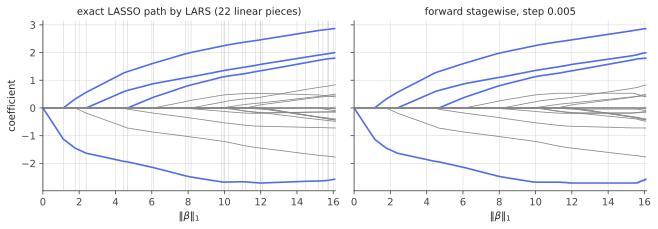

# LARS & the LASSO path

!!! tldr "TL;DR"
    The LASSO solution $\hat\beta(\lambda)$ is **piecewise linear** in $\lambda$: between "events" (a variable entering or leaving) the active set and signs are fixed, and the coefficients move along straight lines. **Least Angle Regression** (LARS) follows this path exactly.
    Start at $\beta = 0$, move the coefficient of the predictor most correlated with the residual, and whenever another predictor becomes equally correlated, move all active coefficients in the "equiangular" direction that keeps their correlations tied. With one modification (drop a variable when its coefficient crosses zero) it gives the **entire LASSO path** for roughly the cost of one least-squares fit. Forward stagewise regression, i.e. boosting with tiny steps, traces almost the same path.

## Why care?

The [LASSO](lasso.md) has one tuning parameter, and choosing it (by cross-validation, $C_p$, or a theory-guided rule) requires solutions at many values of $\lambda$. Re-solving from scratch at each value is wasteful. The KKT conditions tell us the solution changes in a very structured way, so we can compute **all** solutions at once.

LARS (Efron, Hastie, Johnstone & Tibshirani, 2004) made this practical and gave several insights along the way:

- the LASSO path, forward stagewise regression (and hence $\varepsilon$-boosting) and "least angle" regression are close cousins, which helps explain why boosting with small learning rates regularizes like an $\ell_1$ penalty;
- the order in which variables enter is a natural measure of importance, used for example by [knockoff](knockoffs.md) statistics;
- homotopy ideas of this kind became standard in compressed sensing and in path algorithms for many other penalized problems.

In practice, coordinate descent on a grid of $\lambda$'s (glmnet) is usually faster for very large problems, but LARS's exact, event-driven path is the clearest way to understand what the LASSO does as $\lambda$ varies.

## Building blocks

Throughout, use the unscaled objective $\frac12\|y - X\beta\|^2 + \lambda\|\beta\|_1$ with standardized columns ($\|x_j\| = 1$), so $\lambda$ is on the scale of the correlations $c_j = x_j^\top(y - X\beta)$.

**KKT conditions** ([convexity note](convexity-kkt.md)): $c_j = \lambda\operatorname{sign}(\hat\beta_j)$ for active $j$, and $|c_j|\le\lambda$ for inactive $j$.

**Where the path starts.** At $\beta = 0$, the correlations are $c = X^\top y$, so $\beta = 0$ is optimal iff $\lambda\ge\lambda_{\max} = \|X^\top y\|_\infty$. The first variable to enter is the most correlated one.

## The main result

!!! theorem "Theorem (piecewise linearity of the LASSO path)"
    Suppose the LASSO solution is unique along the path (true for columns in general position). On any interval of $\lambda$ over which the active set $A$ and the sign vector $s_A$ are constant,

    $$
    \hat\beta_A(\lambda) = (X_A^\top X_A)^{-1}\big(X_A^\top y - \lambda s_A\big),\qquad\hat\beta_{A^c} = 0,
    $$

    so $\hat\beta(\lambda)$ is affine in $\lambda$, with slope $-(X_A^\top X_A)^{-1}s_A$. The path is continuous and piecewise linear, with breakpoints where a variable enters ($|c_j|$ reaches $\lambda$) or leaves (an active coefficient hits zero).

**Proof.** The active KKT equations read $X_A^\top(y - X_A\beta_A) = \lambda s_A$, a linear system in $\beta_A$. Solving it gives the formula. It remains valid as long as (i) the solved coefficients keep their signs $s_A$, and (ii) the inactive correlations stay below $\lambda$ in absolute value. Each condition fails at the first $\lambda$ where some linear function of $\lambda$ crosses a threshold, which defines the next breakpoint. $\square$

### The algorithm

Going along the path as $\lambda$ decreases by $\gamma$:

1. **Direction.** $d_A = (X_A^\top X_A)^{-1}s_A$, so that $\beta_A\leftarrow\beta_A + \gamma d_A$ changes the active correlations by exactly $-\gamma s_A$. All active $|c_j|$ shrink at the same rate: the fitted vector moves along the bisector ("least angle") of the active predictors.
2. **Rates.** All correlations change at rates $a = X^\top X_Ad_A$, i.e. $c\leftarrow c - \gamma a$.
3. **Next event.** An inactive $j$ catches up when $c_j - \gamma a_j = \pm(\lambda - \gamma)$, i.e. at
   $\gamma_j = \min^+\Big\{\frac{\lambda - c_j}{1 - a_j},\ \frac{\lambda + c_j}{1 + a_j}\Big\}$. An active coefficient hits zero at $\gamma_j = -\beta_j/d_j$ (if positive).
4. **Step** to the smallest $\gamma$, then add the entering variable or (the *lasso modification*) drop the one that hit zero. Repeat until $\lambda = 0$ or the active set has $\min(n,p)$ variables.

Each step needs one solve with $X_A^\top X_A$, which can be updated by a rank-one Cholesky change. The whole path with $k$ steps costs about $O(npk)$, comparable to one least-squares fit when $k\approx\min(n,p)$. Without the lasso modification you get plain LARS, a slightly different path in which variables never leave.

### Forward stagewise and boosting

**Forward stagewise**: repeatedly find the variable most correlated with the residual and move its coefficient by a tiny $\varepsilon$ in the direction of the correlation. It looks like crude coordinate descent, but as $\varepsilon\to0$ its path coincides with the LASSO path whenever the coefficient paths are monotone, and in general with a closely related "monotone LASSO" path (Efron et al., 2004; Hastie et al., 2007).
Gradient boosting with a small learning rate on a dictionary of base learners is forward stagewise in function space. That is the precise sense in which **boosting with shrinkage behaves like $\ell_1$-regularized fitting** (Rosset, Zhu & Hastie, 2004), and it is an early example of the implicit regularization of small-step iterative methods.

{ .fig }

## Examples

### Computing the whole path, and checking it

```python
import numpy as np
rng = np.random.default_rng(0)

def lars_lasso(X, y):
    """Exact LASSO path for 0.5||y - Xb||^2 + lam ||b||_1 (homotopy / LARS with the lasso modification).
    Returns breakpoints lams[k] and coefficients B[k]."""
    n, p = X.shape
    b = np.zeros(p); c = X.T @ y; lam = np.max(np.abs(c))
    A = [int(np.argmax(np.abs(c)))]
    lams, B = [lam], [b.copy()]
    while lam > 1e-10:
        XA = X[:, A]; s = np.sign(c[A])
        d = np.linalg.solve(XA.T @ XA, s)                # move so that all active correlations shrink together
        a = X.T @ (XA @ d)                               # rate at which every correlation changes
        gam, event = lam, None                           # default: run all the way to lam = 0
        for j in range(p):                               # next variable to enter
            if j in A: continue
            for g in ((lam - c[j]) / (1 - a[j]), (lam + c[j]) / (1 + a[j])):
                if 1e-12 < g < gam: gam, event = g, ("in", j)
        for k, j in enumerate(A):                        # next active coefficient to hit zero (lasso modification)
            g = -b[j] / d[k]
            if 1e-12 < g < gam: gam, event = g, ("out", j)
        b[A] += gam * d; c -= gam * a; lam -= gam
        lams.append(lam); B.append(b.copy())
        if event is None or len(A) == min(n, p) and event[0] == "in": break
        A.append(event[1]) if event[0] == "in" else A.remove(event[1])
    return np.array(lams), np.array(B)

def lasso_cd(X, y, lam, iters=2000):                     # same objective, by coordinate descent
    b = np.zeros(X.shape[1]); r = y.copy(); col = (X**2).sum(0)
    for _ in range(iters):
        for j in range(X.shape[1]):
            r += X[:, j] * b[j]; z = X[:, j] @ r
            b[j] = np.sign(z) * max(abs(z) - lam, 0) / col[j]; r -= X[:, j] * b[j]
    return b

n, p = 50, 20
X = rng.standard_normal((n, p)); X /= np.linalg.norm(X, axis=0)
beta = np.zeros(p); beta[:4] = [4, -3, 2, 1.5]
y = X @ beta + 0.5 * rng.standard_normal(n)
lams, B = lars_lasso(X, y)
print(f"path has {len(lams) - 1} linear pieces; lambda_max = {lams[0]:.3f} = max|X'y| = {np.max(np.abs(X.T @ y)):.3f}")
for lam in [lams[0] * 0.6, lams[0] * 0.2, lams[0] * 0.02]:
    k = np.searchsorted(-lams, -lam)                      # interpolate linearly between breakpoints
    t = (lams[k - 1] - lam) / (lams[k - 1] - lams[k])
    b_path = (1 - t) * B[k - 1] + t * B[k]
    print(f"lambda = {lam:.3f}: max |LARS - coordinate descent| = {np.max(np.abs(b_path - lasso_cd(X, y, lam))):.2e}   "
          f"active = {np.flatnonzero(np.abs(b_path) > 1e-10).tolist()}")
# path has 22 linear pieces; lambda_max = 3.328 = max|X'y| = 3.328
# lambda = 1.997: max |LARS - coordinate descent| = 6.66e-16   active = [0, 1]
# lambda = 0.666: max |LARS - coordinate descent| = 1.51e-15   active = [0, 1, 2, 3, 9, 18, 19]
# lambda = 0.067: max |LARS - coordinate descent| = 9.10e-15   active = [0, 1, 2, 3, 5, 6, 7, 9, 10, 11, 12, 14, 15, 16, 17, 18, 19]
```

Twenty-two linear pieces describe the solution for **every** $\lambda$. There are more pieces than variables because some variables enter, leave and re-enter. Linear interpolation between breakpoints matches an independent coordinate-descent solver to machine precision. The four true variables (0–3) enter first, and noise variables join as $\lambda$ shrinks. The figure shows that forward
stagewise with small steps traces the same path.

## Exercises

!!! question "Exercise 1 · warm-up: the start of the path"
    Show that $\hat\beta(\lambda) = 0$ iff $\lambda\ge\|X^\top y\|_\infty$, and that just below $\lambda_{\max}$ the solution is $\hat\beta_{j^*} = \operatorname{sign}(c_{j^*})(\lambda_{\max} - \lambda)$ for the most correlated variable $j^*$ (with unit-norm columns).

    ??? success "Solution"
        $\beta = 0$ satisfies KKT iff $|x_j^\top y|\le\lambda$ for all $j$. Just below $\lambda_{\max}$, only $j^*$ is active, and its KKT equation $x_{j^*}^\top(y - x_{j^*}\beta_{j^*}) = \lambda s$ gives $\beta_{j^*} = x_{j^*}^\top y - \lambda s = s(\lambda_{\max} - \lambda)$, using $\|x_{j^*}\| = 1$. The coefficient grows linearly at unit rate as $\lambda$ decreases.

!!! question "Exercise 2 · equiangular directions"
    Show that with $d_A = (X_A^\top X_A)^{-1}s_A$, the vector $u = X_Ad_A$ satisfies $x_j^\top u = s_j$ for every $j\in A$. Why is $u$ "equiangular" (after normalization) with the sign-adjusted active predictors?

    ??? success "Solution"
        $X_A^\top u = X_A^\top X_A(X_A^\top X_A)^{-1}s_A = s_A$. So the signed inner products $s_jx_j^\top u$ all equal 1. Normalizing $u$, every sign-adjusted active column makes the same angle with it, the "least angle" direction that bisects them. Moving the fit along $u$ decreases all active correlations at the same rate, which keeps them tied, as KKT requires.

!!! question "Exercise 3 · when the path stops"
    Show that the LASSO active set never exceeds $\min(n,p)$ variables (for columns in general position), so for $p > n$ the LASSO selects at most $n$ variables. Why can this be a limitation, and which method fixes it?

    ??? success "Solution"
        On the active set, the KKT system $X_A^\top X_A\beta_A = X_A^\top y - \lambda s_A$ must have a unique solution, which needs $X_A$ to have full column rank, so $|A|\le n$. (With general position, a non-full-rank active set would contradict uniqueness.) With $p\gg n$ and many true signals, or with groups of correlated relevant variables, the LASSO saturates at $n$ variables and drops arbitrary group members.
        The [elastic net](elastic-net.md) adds an $\ell_2$ term that makes $X_A^\top X_A + \lambda_2I$ always invertible, removing the cap and selecting correlated groups together.

!!! question "Exercise 4 · entry times"
    Derive the entering step $\gamma_j = \min^+\{\frac{\lambda - c_j}{1 - a_j}, \frac{\lambda + c_j}{1 + a_j}\}$ from the condition that inactive variable $j$'s correlation reaches the current level $\pm(\lambda - \gamma)$.

    ??? success "Solution"
        After moving by $\gamma$, $c_j(\gamma) = c_j - \gamma a_j$ and the active level is $\lambda - \gamma$. Variable $j$ enters when $c_j - \gamma a_j = \lambda - \gamma$ (reaching $+$), i.e. $\gamma = \frac{\lambda - c_j}{1 - a_j}$, or when $c_j - \gamma a_j = -(\lambda - \gamma)$ (reaching $-$), i.e. $\gamma = \frac{\lambda + c_j}{1 + a_j}$. Only positive values (in the future) count, and the smallest over all $j$ is the next event.

!!! question "Exercise 5 · stretch: stagewise and $\ell_1$"
    Consider forward stagewise with step $\varepsilon$. Show that each step increases $\|\beta\|_1$ by exactly $\varepsilon$ while decreasing the squared loss by approximately $\varepsilon\cdot2\|X^\top r\|_\infty$ (to first order). Conclude that, infinitesimally, stagewise is steepest descent of the loss **per unit of $\ell_1$ norm**, and explain why this suggests a connection with the LASSO path.

    ??? success "Solution"
        Moving coordinate $j$ by $\varepsilon\operatorname{sign}(c_j)$ changes $\|\beta\|_1$ by at most $\varepsilon$ (exactly $\varepsilon$ if the sign agrees with $\beta_j$'s, the typical case). The loss $\|y - X\beta\|^2$ changes by $-2\varepsilon|c_j| + \varepsilon^2$, so the decrease per unit $\ell_1$ is $2|c_j|$, maximized by picking $j$ with the largest $|c_j|$, which is what stagewise does.
        So stagewise follows the direction of steepest descent with respect to the $\ell_1$ geometry. The LASSO path $\{\hat\beta(t) : \|\beta\|_1\le t\}$ is the set of best fits at each $\ell_1$ budget, and when the coefficient paths are monotone, greedily spending the budget in the steepest direction reaches exactly those solutions (Efron et al., 2004). This is the backbone of the "boosting ≈ $\ell_1$ regularization" story.

## Where it shows up

- **Path algorithms.** Homotopy methods for the LASSO in compressed sensing (Osborne et al.; Donoho & Tsaig), solution paths for SVMs, generalized LASSO and fused LASSO, and "regularization path" visualizations in software.
- **Model selection.** With the whole path in hand, $C_p$/AIC (df = number of active variables) or cross-validation can be evaluated at every breakpoint cheaply.
- **Boosting.** The stagewise connection explains why gradient boosting with small learning rates and early stopping is a strong, implicitly $\ell_1$-regularized learner, still among the best methods for tabular data.
- **Variable importance and knockoffs.** The $\lambda$ at which a variable first enters the path is a natural importance score. Knockoff filters use the signed difference of entry times of a variable and its knockoff as their test statistic.
- **Interpretability.** Watching variables enter one by one gives an ordering of predictors by how strongly the data demand them, which is useful when presenting sparse models in credit, healthcare or factor research.

## Further reading

- B. Efron, T. Hastie, I. Johnstone & R. Tibshirani, "Least angle regression" (*Ann. Stat.*, 2004), with discussion.
- S. Rosset, J. Zhu & T. Hastie, "Boosting as a regularized path to a maximum margin classifier" (*JMLR*, 2004).
- T. Hastie, J. Taylor, R. Tibshirani & G. Walther, "Forward stagewise regression and the monotone lasso" (*EJS*, 2007).
- R. Tibshirani, "The lasso problem and uniqueness" (*EJS*, 2013).
