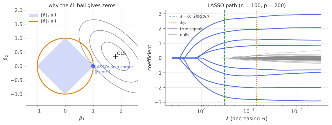

# The LASSO: geometry & soft thresholding

!!! tldr "TL;DR"
    The LASSO adds an $\ell_1$ penalty to least squares, $\hat\beta = \arg\min\frac{1}{2n}\|y - X\beta\|^2 + \lambda\|\beta\|_1$, and produces **exactly sparse** estimates. Geometrically, the $\ell_1$ ball has corners on the axes. Analytically, the kink of $|\beta_j|$ at zero absorbs small correlations, and the 1-D solution is soft-thresholding.
    With $\lambda\asymp\sigma\sqrt{\log p/n}$ and a restricted-eigenvalue condition on $X$, it estimates an $s$-sparse $\beta$ at rate $\|\hat\beta - \beta\|_2\lesssim\sigma\sqrt{s\log p/n}$, which works even when $p\gg n$. The price is shrinkage bias, and variable-selection consistency needs stronger conditions. Those two weak points drive [LARS](lars.md), the [elastic net](elastic-net.md), [debiasing](debiased-lasso.md) and [post-selection inference](post-selection-inference.md).

## Why care?

When there are more candidate predictors than observations (genes vs patients, candidate factors vs years of returns, features vs labelled examples), least squares is not even defined, and [ridge](ridge.md) keeps every variable with a small weight. Often we believe that **only a few predictors matter**, and we want a method that finds them.

Best-subset selection (choose the best $s$ variables) is combinatorial and NP-hard in general. Tibshirani (1996) replaced the $\ell_0$ "count" penalty by its closest convex relaxation, the $\ell_1$ norm. The result is a convex problem, solvable for millions of features, that still produces exact zeros. The same idea, independently, gave **compressed sensing** (Candès, Romberg, Tao; Donoho, 2006): sparse signals can be recovered from far fewer measurements than their dimension.

Today the LASSO and its relatives appear everywhere: sparse linear models in genomics and credit, factor selection in empirical finance, compressed MRI, the $\ell_1$ penalty that makes **sparse autoencoders** pull interpretable features out of LLM activations, and pruning.

## Building blocks

**Two equivalent forms.** For each $\lambda$ there is a $t$ (and vice versa) such that

$$
\min_\beta\frac{1}{2n}\|y - X\beta\|^2 + \lambda\|\beta\|_1
\qquad\Longleftrightarrow\qquad
\min_\beta\|y - X\beta\|^2\ \text{ s.t. }\ \|\beta\|_1\le t .
$$

**Geometry.** The constrained form asks for the first point where the elliptical contours of the squared loss, centred at the OLS solution, touch the $\ell_1$ ball. The ball is a cross-polytope whose **corners lie on the coordinate axes**, and in high dimension most of its "surface" is near low-dimensional faces. So contours generically first touch at a corner or low-dimensional face, where many coordinates are exactly zero. The $\ell_2$ ball of ridge is round and has no such preference.

{ .fig }

**Orthogonal design: soft-thresholding.** If $X^\top X/n = I$, the problem separates by coordinate, and with $z_j = x_j^\top y/n$ (the OLS coefficient),

$$
\hat\beta_j = \operatorname{sign}(z_j)\,(|z_j| - \lambda)_+ .
$$

Coefficients smaller than $\lambda$ in magnitude are set to zero, and the rest are **shrunk by $\lambda$**. Compare ridge, $z_j/(1+\lambda)$ (shrink everything, zero nothing), and best subset, $z_j\mathbf 1\{|z_j| > \sqrt{2\lambda}\}$ (hard-thresholding: zero or keep untouched).

**KKT conditions.** From the [subgradient optimality condition](convexity-kkt.md):

$$
\frac1nx_j^\top(y - X\hat\beta) = \lambda\operatorname{sign}(\hat\beta_j)\ \ \text{if }\hat\beta_j\neq0,\qquad
\Big|\frac1nx_j^\top(y - X\hat\beta)\Big|\le\lambda\ \ \text{if }\hat\beta_j = 0.
$$

Every active variable has the same absolute correlation $\lambda$ with the residual, and every inactive variable has smaller correlation. The solution path is piecewise linear in $\lambda$, which [LARS](lars.md) exploits. The **degrees of freedom** of the LASSO fit equal the expected number of nonzero coefficients (Zou, Hastie & Tibshirani, 2007).

## The main result

How well does the LASSO estimate a sparse $\beta$ when $p\gg n$? Let $S = \operatorname{supp}(\beta)$ with $|S| = s$, and $y = X\beta + \varepsilon$ with $\varepsilon\sim N(0,\sigma^2I)$.

**Restricted eigenvalue (RE) condition.** For $\kappa > 0$:

$$
\frac1n\|X\Delta\|^2\ge\kappa\|\Delta\|^2\quad\text{for all }\Delta\text{ in the cone } \mathcal C = \{\Delta : \|\Delta_{S^c}\|_1\le3\|\Delta_S\|_1\}.
$$

When $p > n$, $X^\top X$ is singular, so it can't be well-conditioned in *all* directions. RE asks for curvature only in the cone of "approximately sparse" directions, which is all the LASSO error can ever explore. Random designs satisfy RE with high probability once $n\gtrsim s\log p$.

!!! theorem "Theorem (oracle inequality; Bickel, Ritov & Tsybakov, 2009)"
    If $\lambda\ge\frac2n\|X^\top\varepsilon\|_\infty$ and $X$ satisfies RE$(\kappa)$ on $\mathcal C$, then

    $$
    \|\hat\beta - \beta\|_2\le\frac{3\sqrt s\,\lambda}{\kappa},\qquad\frac1n\|X(\hat\beta - \beta)\|^2\le\frac{9\,s\,\lambda^2}{\kappa}.
    $$

    With columns normalized to $\|x_j\|^2 = n$, the condition $\lambda\ge\frac2n\|X^\top\varepsilon\|_\infty$ holds with probability $\ge1 - 2p^{1-c^2/2}$ for $\lambda = 2c\sigma\sqrt{\log p/n}$, giving $\|\hat\beta - \beta\|_2\lesssim\sigma\sqrt{s\log p/n}$.

**Proof.** Let $\Delta = \hat\beta - \beta$. Optimality of $\hat\beta$ against $\beta$ (the **basic inequality**) gives

$$
\frac{1}{2n}\|X\Delta\|^2\le\frac1n\varepsilon^\top X\Delta + \lambda\big(\|\beta\|_1 - \|\hat\beta\|_1\big).
$$

By Hölder and the choice of $\lambda$, $\frac1n\varepsilon^\top X\Delta\le\frac1n\|X^\top\varepsilon\|_\infty\|\Delta\|_1\le\frac\lambda2\|\Delta\|_1$. Since $\beta$ is supported on $S$, the triangle inequality gives $\|\beta\|_1 - \|\hat\beta\|_1\le\|\Delta_S\|_1 - \|\Delta_{S^c}\|_1$. Together:

$$
0\le\frac{1}{2n}\|X\Delta\|^2\le\frac{3\lambda}{2}\|\Delta_S\|_1 - \frac\lambda2\|\Delta_{S^c}\|_1 .
$$

So $\Delta\in\mathcal C$ (the cone condition), and $\frac{1}{2n}\|X\Delta\|^2\le\frac{3\lambda}{2}\sqrt s\|\Delta\|_2$. RE gives $\frac\kappa2\|\Delta\|^2\le\frac{3\lambda}{2}\sqrt s\|\Delta\|$, hence $\|\Delta\|\le3\sqrt s\lambda/\kappa$. Plugging back gives the prediction bound. The probability statement is a union bound over $p$ Gaussian coordinates ([sub-Gaussian maxima](subgaussian-subexponential.md)). $\square$

The rate $s\log p/n$ is remarkable. Up to the logarithm it is what you'd get if an **oracle** told you the support ($s/n$). The $\log p$ is the price of searching among $p$ candidates.

### What the LASSO does not guarantee

- **Bias.** Selected coefficients are shrunk toward zero by about $\lambda$. Refitting least squares on the selected support ("relaxed LASSO") removes the bias when selection is good.
- **Exact support recovery** needs more: an *irrepresentable condition* (inactive variables can't be too correlated with active ones) and a *beta-min condition* (true nonzero coefficients exceed about $\lambda$). With correlated features, the LASSO tends to pick one of a group arbitrarily (the [elastic net](elastic-net.md) fixes this).
- **Inference.** The LASSO's sampling distribution is non-Gaussian and has point masses at zero, so naive confidence intervals after selection are invalid. See [debiased LASSO](debiased-lasso.md) and [post-selection inference](post-selection-inference.md).
- **Choosing $\lambda$.** Cross-validation targets *prediction* and tends to choose a $\lambda$ that admits many false positives. Theory-guided values ($\sigma\sqrt{2\log p/n}$, or the scaled/square-root LASSO when $\sigma$ is unknown) select more sparsely.

## Examples

### Prediction-tuned vs selection-tuned LASSO

```python
import numpy as np
rng = np.random.default_rng(1)

def lasso_cd(X, y, lam, b=None, iters=200):
    """Coordinate descent for (1/2n)||y - Xb||^2 + lam ||b||_1."""
    n, p = X.shape; b = np.zeros(p) if b is None else b.copy()
    col = (X**2).sum(0) / n; r = y - X @ b
    for _ in range(iters):
        for j in range(p):
            r += X[:, j] * b[j]
            z = X[:, j] @ r / n
            b[j] = np.sign(z) * max(abs(z) - lam, 0) / col[j]          # 1-D soft-thresholding
            r -= X[:, j] * b[j]
    return b

n, p, s, sigma = 100, 200, 8, 1.0
X = rng.standard_normal((n, p))
beta = np.zeros(p); beta[:s] = [3, -3, 2, -2, 1.5, -1.5, 1, -1]
y = X @ beta + sigma * rng.standard_normal(n)

# 5-fold cross-validation over a grid of lambdas (warm starts along the path)
lams = np.logspace(0, -2.5, 40); folds = np.arange(n) % 5
cv = np.zeros(len(lams))
for f in range(5):
    tr, te = folds != f, folds == f; b = None
    for i, lam in enumerate(lams):
        b = lasso_cd(X[tr], y[tr], lam, b, iters=50)
        cv[i] += np.mean((y[te] - X[te] @ b) ** 2) / 5
lam_cv = lams[np.argmin(cv)]
lam_th = sigma * np.sqrt(2 * np.log(p) / n)                      # theory-guided level (σ known here)
lam_r = 10.0; b_ridge = np.linalg.solve(X.T @ X + lam_r * np.eye(p), X.T @ y)
print(f"ridge (lambda=10)        ||b - beta|| = {np.linalg.norm(b_ridge - beta):.3f}")
for label, lam in [("CV", lam_cv), ("theory", lam_th)]:
    b = lasso_cd(X, y, lam)
    supp = np.flatnonzero(np.abs(b) > 1e-8)
    b_rel = np.zeros(p); b_rel[supp] = np.linalg.lstsq(X[:, supp], y, rcond=None)[0]   # refit OLS on the support
    print(f"LASSO, lambda_{label:6s} = {lam:.3f}: selects {len(supp):2d} vars ({np.isin(np.arange(s), supp).sum()}/{s} true)   "
          f"||b - beta|| = {np.linalg.norm(b - beta):.3f}   relaxed refit {np.linalg.norm(b_rel - beta):.3f}   "
          f"b[:4] = {np.round(b[:4], 2)}")
# ridge (lambda=10)        ||b - beta|| = 4.220
# LASSO, lambda_CV     = 0.070: selects 49 vars (8/8 true)   ||b - beta|| = 0.826   relaxed refit 1.162   b[:4] = [ 2.77 -2.81  1.94 -2.03]
# LASSO, lambda_theory = 0.326: selects 10 vars (8/8 true)   ||b - beta|| = 1.064   relaxed refit 0.342   b[:4] = [ 2.57 -2.61  1.75 -1.84]
```

With $p = 2n$, ridge is hopeless (error 4.2): it spreads the signal over all 200 coefficients. Both LASSO fits find all 8 true variables. The CV choice gives the best plain LASSO estimate but drags in 41 false variables. The theory-guided $\lambda$ selects only 2 false ones, but it **shrinks** the true coefficients (look at $2.57$ vs $3$), and refitting on its support
gives the best estimate of all (0.34). Prediction and selection are different goals with different optimal $\lambda$'s.

### Try it

<div class="widget" data-widget="lasso"></div>

## Exercises

!!! question "Exercise 1 · warm-up: soft vs hard thresholding"
    For orthogonal design, derive the LASSO solution $\operatorname{soft}(z_j,\lambda)$, and show that best-subset selection with penalty $\frac{\lambda^2}{2}\|\beta\|_0$ gives hard-thresholding $z_j\mathbf 1\{|z_j| > \lambda\}$. Which is continuous in the data, and why does that matter?

    ??? success "Solution"
        Each coordinate solves $\min_b\frac12(b - z_j)^2 + \lambda|b|$, giving soft-thresholding ([KKT note](convexity-kkt.md)). For $\ell_0$: either $b = 0$ (cost $\frac12z_j^2$) or $b = z_j$ (cost $\frac{\lambda^2}{2}$). Keep $z_j$ iff $z_j^2 > \lambda^2$.
        Soft-thresholding is continuous (a 1-Lipschitz prox). Hard-thresholding jumps at $|z| = \lambda$, so tiny data changes can flip a variable in or out with a jump of size $\lambda$. That makes best-subset estimates unstable (high variance), which is one reason the convex relaxation often predicts better.

!!! question "Exercise 2 · the size of the noise correlations"
    With $\|x_j\|^2 = n$ and $\varepsilon\sim N(0,\sigma^2I)$, show that $\frac1nx_j^\top\varepsilon\sim N(0,\sigma^2/n)$ and that $\frac1n\|X^\top\varepsilon\|_\infty\approx\sigma\sqrt{2\log p/n}$. What is this for $n = 100$, $p = 200$, $\sigma = 1$, and how does it compare with $\lambda_{\text{theory}}$ in the example?

    ??? success "Solution"
        $\frac1nx_j^\top\varepsilon$ is Gaussian with variance $\frac{\sigma^2\|x_j\|^2}{n^2} = \sigma^2/n$. The maximum of $p$ such variables (correlated or not) is at most about $\sigma\sqrt{2\log(2p)/n}$ ([sub-Gaussian maxima](subgaussian-subexponential.md)). For the example, $\sqrt{2\log200/100} = 0.326$, which is exactly $\lambda_{\text{theory}}$. The theorem asks for twice this. In practice, $\lambda$ at about this level already keeps almost all noise variables out.

!!! question "Exercise 3 · equal correlations on the active set"
    Use the KKT conditions to show that, at any $\lambda$, all active variables have the same absolute correlation with the current residual. Why does this suggest an algorithm that follows the path by moving "equiangularly"?

    ??? success "Solution"
        For $\hat\beta_j\neq0$: $|\frac1nx_j^\top r| = \lambda$, the same for all active $j$, where $r = y - X\hat\beta$. As $\lambda$ decreases, the active coefficients must change so that all active correlations decrease **together**, which means moving in a direction equiangular to the active columns. A new variable enters when its correlation catches up, and one leaves when its coefficient hits zero. This is the [LARS](lars.md) algorithm, which computes the entire path at the cost of one least-squares fit.

!!! question "Exercise 4 · degrees of freedom for orthogonal design"
    Using SURE's divergence formula $\operatorname{df} = \E\sum_i\partial\hat y_i/\partial y_i$ ([James–Stein](james-stein.md), Exercise 5), show that for orthogonal design the LASSO's degrees of freedom equal $\E[\#\{j : \hat\beta_j\neq0\}]$.

    ??? success "Solution"
        With orthonormal columns, $\hat y = \sum_jx_j\operatorname{soft}(x_j^\top y,\lambda)$ (taking $n = 1$ scaling). The derivative of $\operatorname{soft}(z,\lambda)$ is $\mathbf 1\{|z| > \lambda\}$ (almost everywhere), so $\sum_i\partial\hat y_i/\partial y_i = \sum_j\mathbf 1\{|x_j^\top y| > \lambda\}\|x_j\|^2 = \#\text{active}$. Taking expectations gives the claim.
        Zou, Hastie & Tibshirani (2007) proved it for general $X$. It is a simple, unbiased complexity measure for $C_p$/AIC-style tuning. Note that best subset's df is *larger* than its number of selected variables, because the search itself costs degrees of freedom.

!!! question "Exercise 5 · stretch: why the cone?"
    Explain why the RE condition can hold for $p > n$ even though $X^\top X$ is singular, by showing that the null space of $X$ intersects the cone $\mathcal C$ only at 0 for "nice" random designs. Give a direction in the null space that is *not* in the cone, and explain why the LASSO error can never point along it.

    ??? success "Solution"
        For a random Gaussian $X$ with $n\gtrsim s\log(p/s)$, the null space of $X$ (dimension $p - n$) is a "random" subspace. By results of Gordon type (the escape-through-a-mesh theorem), it misses the cone of approximately $s$-sparse directions with high probability, because that cone is "small" (its Gaussian width is about $\sqrt{s\log(p/s)}$). A typical null-space vector is spread over all coordinates, with $\|\Delta_{S^c}\|_1\gg3\|\Delta_S\|_1$, so it lies outside $\mathcal C$.
        The basic-inequality argument shows the LASSO error always satisfies the cone condition, so directions outside the cone, including the flat directions of $X^\top X$, are never explored. Sparsity regularization only needs curvature where sparse vectors live.

## Where it shows up

- **High-dimensional regression and selection.** Genomics (thousands of genes), credit scoring and marketing models, and sparse logistic regression for text classification. glmnet's coordinate descent with warm starts and strong rules makes path computation fast.
- **Empirical asset pricing.** Choosing among hundreds of candidate factors ("the factor zoo") with LASSO-type and double-selection methods (Feng, Giglio & Xiu, 2020), and sparse portfolio construction or index tracking with $\ell_1$-constrained weights.
- **Compressed sensing and imaging.** MRI acquisition with far fewer measurements, single-pixel cameras, and radar. The RE/RIP theory above guarantees recovery.
- **Interpretability of neural networks.** Sparse autoencoders, trained with an $\ell_1$ penalty on hidden activations, decompose LLM activations into many sparse, often interpretable features. Sparse linear probes and $\ell_1$-regularized concept bottlenecks use the same mechanism.
- **Scientific discovery and pruning.** SINDy identifies governing differential equations by sparse regression on a library of candidate terms. Magnitude/$\ell_1$ pruning and proximal training produce sparse networks.

## Further reading

- R. Tibshirani, "Regression shrinkage and selection via the lasso" (*JRSS-B*, 1996).
- T. Hastie, R. Tibshirani & M. Wainwright, *Statistical Learning with Sparsity* (2015). Free online.
- P. Bickel, Y. Ritov & A. Tsybakov, "Simultaneous analysis of Lasso and Dantzig selector" (*Ann. Stat.*, 2009).
- M. Wainwright, *High-Dimensional Statistics* (2019), Ch. 7.
