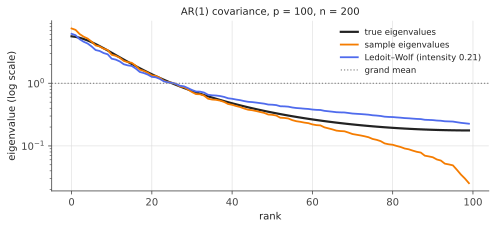

# Ledoit–Wolf linear shrinkage

!!! tldr "TL;DR"
    Replace the sample covariance $S$ by a convex combination with a simple target:
    $$\hat\Sigma = (1-\rho)\,S + \rho\,mI,\qquad m = \tfrac1p\tr S .$$
    The best intensity $\rho$ (in expected Frobenius loss) is **noise / (noise + signal)**: $\rho^* = \beta^2/(\alpha^2 + \beta^2)$, where $\beta^2 = \E\|S - \Sigma\|^2$ is the estimation noise and $\alpha^2 = \|\Sigma - mI\|^2$ is the true dispersion.
    Ledoit and Wolf showed that both quantities can be estimated consistently from the data, giving a tuning-free estimator that is always well-conditioned, invertible even when $p > n$, and
    much better than $S$ whenever $p/n$ is not small. It is the James–Stein idea applied to covariance matrices.

## Why care?

The [Marchenko–Pastur](marchenko-pastur.md) note showed that sample eigenvalues are too dispersed, and [Markowitz](markowitz-estimation-error.md) showed that inverting such a matrix amplifies its noise. Something has to
be done, and it has to be done automatically, because there are thousands of covariance matrices to estimate (every rebalance, every asset universe, every class in a Gaussian classifier).

Ledoit–Wolf (2003–2004) is the default answer. It's in `sklearn.covariance.LedoitWolf`, it's the baseline in every covariance-cleaning paper, and it's often used directly in production risk models. It is also the clearest worked
example of the bias–variance logic of [James–Stein](james-stein.md): pull a noisy high-dimensional estimate toward a low-dimensional target, with the pull chosen from the data.

## Building blocks

**Norm.** We use the scaled Frobenius norm $\|A\|^2 = \frac1p\tr(AA^\top)$, so that $\|I\| = 1$ and quantities stay $O(1)$ as $p$ grows. It comes from the inner product $\langle A, B\rangle = \frac1p\tr(AB^\top)$.

**Data.** $x_1,\dots,x_n\in\R^p$ i.i.d. with mean zero (in practice, demean) and covariance $\Sigma$. $S = \frac1n\sum_kx_kx_k^\top$, so $\E S = \Sigma$.

**The target.** The simplest target is $\mu I$ with $\mu = \frac1p\tr\Sigma = \langle\Sigma, I\rangle$, a matrix that has the right average variance and no correlations. It is the projection of $\Sigma$ onto multiples of the identity.
(For stock returns, Ledoit–Wolf also proposed a single-index market-model target and a constant-correlation target. The theory is the same.)

**Eigenvalue view.** $\hat\Sigma = (1-\rho)S + \rho mI$ has the **same eigenvectors** as $S$ and eigenvalues

$$
\hat\lambda_i = (1-\rho)\lambda_i + \rho m,
$$

each pulled linearly toward the grand mean. Large eigenvalues come down and small ones go up, which is exactly the opposite of the MP distortion. The smallest eigenvalue is at least $\rho m > 0$, so $\hat\Sigma$ is always invertible.

## The main result

### The oracle: a Pythagorean computation

Treat $\mu$ as known for the moment, and define three numbers:

$$
\alpha^2 = \|\Sigma - \mu I\|^2\ \ (\text{dispersion of the truth}),\qquad
\beta^2 = \E\|S - \Sigma\|^2\ \ (\text{estimation noise}),\qquad
\delta^2 = \E\|S - \mu I\|^2 .
$$

Because $\E S = \Sigma$, the cross term $\E\langle S - \Sigma,\ \Sigma - \mu I\rangle$ vanishes, so $\delta^2 = \alpha^2 + \beta^2$. Noise adds to the apparent dispersion. This is the matrix version of "sample eigenvalues are more spread out than the true ones".

!!! theorem "Theorem (oracle linear shrinkage)"
    Over all estimators $\Sigma_\rho = (1-\rho)S + \rho\mu I$,

    $$
    \E\|\Sigma_\rho - \Sigma\|^2 = (1-\rho)^2\beta^2 + \rho^2\alpha^2,
    $$

    which is minimized at

    $$
    \rho^* = \frac{\beta^2}{\alpha^2 + \beta^2} = \frac{\beta^2}{\delta^2},\qquad\text{with risk}\qquad\frac{\alpha^2\beta^2}{\alpha^2+\beta^2} < \min(\alpha^2, \beta^2).
    $$

**Proof.** $\Sigma_\rho - \Sigma = (1-\rho)(S - \Sigma) + \rho(\mu I - \Sigma)$. Expand the squared norm. The cross term has zero expectation because $\E(S - \Sigma) = 0$. Minimizing the convex quadratic $(1-\rho)^2\beta^2 + \rho^2\alpha^2$ gives $\rho^*$. $\square$

The optimal estimator beats **both** the sample covariance (risk $\beta^2$) and the target (risk $\alpha^2$). The intensity has the same form as the Bayes/James–Stein factor $\frac{\sigma^2}{\sigma^2+\tau^2}$: shrink a lot when noise dominates
signal ($\beta^2\gg\alpha^2$), and little when the truth is very dispersed relative to the noise.

### Estimating the oracle from data

The quantities $\mu$, $\alpha^2$ and $\beta^2$ depend on $\Sigma$, but each has a natural sample counterpart. The key observation is that, since $S$ is an average of the i.i.d. matrices $x_kx_k^\top$,

$$
\beta^2 = \E\|S - \Sigma\|^2 = \frac1n\,\E\|x_1x_1^\top - \Sigma\|^2,
$$

and that can be estimated by how much the individual outer products scatter around $S$:

$$
m = \tfrac1p\tr S,\qquad d^2 = \|S - mI\|^2,\qquad\bar b^2 = \frac{1}{n^2}\sum_{k=1}^n\|x_kx_k^\top - S\|^2,\qquad b^2 = \min(\bar b^2, d^2).
$$

!!! theorem "Theorem (Ledoit & Wolf, 2004)"
    The estimator

    $$
    \hat\Sigma_{\text{LW}} = \frac{b^2}{d^2}\,mI + \Big(1 - \frac{b^2}{d^2}\Big)S
    $$

    is consistent for the oracle as $n\to\infty$ with $p/n$ allowed to stay bounded (even $p > n$), under finite fourth moments. Its expected loss converges to that of the oracle, so it is asymptotically optimal among all
    linear combinations of $S$ and $I$.

In practice this is 10 lines of code (below) with no tuning parameter.

### The MP connection: how much shrinkage to expect

For Gaussian data, $\beta^2 = \frac1n\big[\frac1p\tr\Sigma^2 + p\mu^2\big]\approx q\,\mu^2$ when $p/n\to q$ (Exercise 5). So

$$
\rho^*\approx\frac{q\,\mu^2}{\alpha^2 + q\,\mu^2}:
$$

the intensity grows with $q$ and shrinks with the true dispersion (in units of $\mu^2$). For $\Sigma = I$, $\alpha = 0$ and the oracle shrinks fully to the identity, which is correct. As $n\to\infty$ with $p$ fixed, $q\to0$ and the intensity vanishes.

### What linear shrinkage cannot do

All eigenvalues get the **same** affine map. The MP distortion is not affine: small sample eigenvalues are deflated much more, proportionally, than large ones are inflated, and eigenvalues in a dense part of the spectrum
behave differently from isolated ones. In the figure below, LW fixes the top of the spectrum reasonably well but over-lifts the smallest eigenvalues. The fix is to shrink each eigenvalue by its own amount:
[rotationally invariant estimators](rotational-invariant-estimators.md) and [nonlinear shrinkage](nonlinear-shrinkage.md). Ledoit–Wolf is the first-order, one-parameter version of these.

{ .fig }

## Examples

### Frobenius error and portfolio risk

True covariance: an AR(1) correlation matrix ($\Sigma_{ij} = 0.7^{|i-j|}$, eigenvalues from 0.18 to 5.7), $p = 100$.

```python
import numpy as np
rng = np.random.default_rng(0)

def ledoit_wolf(X):
    """X: n x p data (rows = observations, assumed mean zero). Returns (Sigma_hat, intensity)."""
    n, p = X.shape
    S = X.T @ X / n
    m = np.trace(S) / p
    d2 = np.sum((S - m * np.eye(p)) ** 2) / p                       # ||S - mI||^2   (norm: tr(AA')/p)
    b2_bar = sum(np.sum((np.outer(x, x) - S) ** 2) for x in X) / p / n**2
    b2 = min(b2_bar, d2)
    rho = b2 / d2                                                    # shrinkage intensity
    return (1 - rho) * S + rho * m * np.eye(p), rho

p = 100
Sigma = 0.7 ** np.abs(np.subtract.outer(np.arange(p), np.arange(p)))   # AR(1) correlation: eigenvalues 0.18 ... 5.7
L = np.linalg.cholesky(Sigma)
w_opt = np.linalg.solve(Sigma, np.ones(p)); w_opt /= w_opt.sum(); r_opt = w_opt @ Sigma @ w_opt

def minvar(C):
    w = np.linalg.solve(C, np.ones(p)); return w / w.sum()

for n in [50, 100, 200, 1000]:
    X = rng.standard_normal((n, p)) @ L.T
    S = X.T @ X / n
    LW, rho = ledoit_wolf(X)
    err = lambda C: np.sum((C - Sigma) ** 2) / p
    risk_S = (lambda w: w @ Sigma @ w / r_opt)(minvar(S)) if n > p else np.inf
    risk_LW = (lambda w: w @ Sigma @ w / r_opt)(minvar(LW))
    print(f"n = {n:4d} (q = {p/n:.2f})  intensity {rho:.2f}   Frobenius error: S {err(S):.3f}  LW {err(LW):.3f}   "
          f"min-var risk / optimal: S {risk_S:.2f}  LW {risk_LW:.2f}   cond(LW) {np.linalg.cond(LW):.0f}")
# n =   50 (q = 2.00)  intensity 0.52   Frobenius error: S 1.947  LW 0.997   min-var risk / optimal: S inf  LW 1.22   cond(LW) 11
# n =  100 (q = 1.00)  intensity 0.32   Frobenius error: S 1.177  LW 0.686   min-var risk / optimal: S inf  LW 1.30   cond(LW) 21
# n =  200 (q = 0.50)  intensity 0.23   Frobenius error: S 0.470  LW 0.408   min-var risk / optimal: S 1.80  LW 1.15   cond(LW) 22
# n = 1000 (q = 0.10)  intensity 0.05   Frobenius error: S 0.098  LW 0.093   min-var risk / optimal: S 1.11  LW 1.08   cond(LW) 39
```

Three things stand out:

- When $n\le p$ the sample covariance is singular or nearly so, and the min-variance portfolio can't be formed. LW works fine, with a portfolio only 22% riskier than the true optimum at $q = 2$.
- At $q = 0.5$ the plug-in portfolio is 80% riskier than optimal ($\approx1/(1-q) = 2$ from the [Markowitz theorem](markowitz-estimation-error.md)), versus 15% for LW.
- The intensity adapts automatically, from $0.52$ at $q = 2$ to $0.05$ at $q = 0.1$, and the LW matrix is always well conditioned (the true condition number is about 32).

## Exercises

!!! question "Exercise 1 · warm-up: condition number"
    Show that $\hat\Sigma = (1-\rho)S + \rho mI$ has condition number at most $\frac{(1-\rho)\lambda_{\max}(S) + \rho m}{\rho m}$. Why does this matter for optimization and for Gaussian classifiers (LDA/QDA)?

    ??? success "Solution"
        Its eigenvalues are $(1-\rho)\lambda_i + \rho m$, and the smallest is at least $\rho m$ since $\lambda_i\ge0$. Hence $\kappa\le\frac{(1-\rho)\lambda_{\max} + \rho m}{\rho m}$. Algorithms that invert $\hat\Sigma$ (portfolio optimization, LDA's $\hat\Sigma^{-1}(\mu_1 - \mu_0)$,
        Mahalanobis distances, Gaussian likelihoods) amplify errors by up to $\kappa$. Bounding $\kappa$ bounds the damage, and with $p > n$ it makes the computation possible at all.

!!! question "Exercise 2 · the Pythagorean identity"
    Prove $\E\|S - \mu I\|^2 = \|\Sigma - \mu I\|^2 + \E\|S - \Sigma\|^2$ and interpret it in terms of eigenvalue dispersion.

    ??? success "Solution"
        Write $S - \mu I = (S - \Sigma) + (\Sigma - \mu I)$. Expanding, the cross term is $2\E\langle S - \Sigma, \Sigma - \mu I\rangle = 2\langle\E S - \Sigma, \Sigma - \mu I\rangle = 0$. Since $\|A - \frac{\tr A}{p}I\|^2$ is the variance of the eigenvalues of $A$ (for symmetric $A$),
        and $m\approx\mu$: **sample-eigenvalue variance ≈ true-eigenvalue variance + estimation noise.** For $\Sigma = I$ this is MP's "variance $q$" from the [MP note](marchenko-pastur.md).

!!! question "Exercise 3 · the noise level for white data"
    For $x_k\sim N(0, I_p)$, compute $\beta^2 = \E\|S - I\|^2$ exactly (with $\|A\|^2 = \frac1p\tr AA^\top$). What does the oracle intensity equal?

    ??? success "Solution"
        $S_{ii}$ has variance $2/n$ and $S_{ij}$ ($i\neq j$) has variance $1/n$. So $\E\|S - I\|^2 = \frac1p\big[p\cdot\frac2n + p(p-1)\cdot\frac1n\big] = \frac{p+1}{n}\approx q$. With $\alpha^2 = 0$, $\rho^* = 1$: the oracle returns exactly $I$. The data estimator gets close to 1
        but not exactly, because $b^2$ and $d^2$ are noisy.

!!! question "Exercise 4 · shrinkage is ridge for portfolios"
    Show that the minimum-variance portfolio computed with $\hat\Sigma = (1-\rho)S + \rho mI$ solves $\min_w\,w^\top Sw + \lambda\|w\|^2$ subject to $w^\top\mathbf 1 = 1$, with $\lambda = \frac{\rho m}{1-\rho}$. Interpret.

    ??? success "Solution"
        $w^\top\hat\Sigma w = (1-\rho)\big[w^\top Sw + \frac{\rho m}{1-\rho}\|w\|^2\big]$. The positive factor $(1-\rho)$ doesn't change the minimizer. So covariance shrinkage toward the identity is the same as an $\ell_2$ ([ridge](ridge.md)) penalty on portfolio weights, which pushes toward the
        equal-weight $1/N$ portfolio (the minimizer of $\|w\|^2$ under the budget constraint). This explains why shrinkage portfolios sit between the noisy optimizer and naive diversification.

!!! question "Exercise 5 · stretch: intensity in the proportional regime"
    For Gaussian $x_k\sim N(0,\Sigma)$, show $\E\|x x^\top - \Sigma\|^2 = \frac1p\big[\tr(\Sigma^2) + (\tr\Sigma)^2\big]$. Deduce $\beta^2\approx q\mu^2 + \frac1n\cdot\frac1p\tr\Sigma^2$ and $\rho^*\approx\frac{q\mu^2}{\alpha^2 + q\mu^2}$ for $p/n\to q$.
    For the AR(1) example ($\mu = 1$, $\alpha^2 = \frac1p\tr\Sigma^2 - 1\approx\frac{1+0.49}{1-0.49} - 1\approx1.92$), what intensity does this predict at $n = 200$?

    ??? success "Solution"
        $\|xx^\top - \Sigma\|^2 = \frac1p\big[(x^\top x)^2 - 2x^\top\Sigma x + \tr\Sigma^2\big]$. For Gaussians, $\E(x^\top x)^2 = (\tr\Sigma)^2 + 2\tr\Sigma^2$ and $\E x^\top\Sigma x = \tr\Sigma^2$. So the expectation is $\frac1p[(\tr\Sigma)^2 + \tr\Sigma^2]$.
        Divide by $n$: $\beta^2 = \frac{p\mu^2}{n} + \frac1n\frac{\tr\Sigma^2}{p}\approx q\mu^2$. Then $\rho^*\approx\frac{q\mu^2}{\alpha^2 + q\mu^2}$. (Strictly, $\beta^2 = q\mu^2 + O(1/n)$.)

        AR(1) with $\phi = 0.7$: $\frac1p\tr\Sigma^2\approx\sum_k\phi^{2|k|} = \frac{1+\phi^2}{1-\phi^2} = 2.92$, so $\alpha^2\approx1.92$. At $n = 200$ ($q = 0.5$): $\rho^*\approx\frac{0.5}{1.92 + 0.5}\approx0.21$, close to the data-driven $0.21$–$0.23$ in the figure and code. ✓

## Where it shows up

- **Portfolio construction and risk models.** LW (with identity, single-index or constant-correlation targets) is a standard input to minimum-variance, risk-parity and mean-variance optimizers. It is also the benchmark that newer
  methods (nonlinear shrinkage, RIE, factor models) must beat out of sample.
- **ML pipelines.** Linear and quadratic discriminant analysis with many features, Gaussian anomaly detection (Mahalanobis distances), whitening for ICA or CCA, and covariance features for EEG/BCI classification
  routinely use LW. In scikit-learn it is a one-liner (`LinearDiscriminantAnalysis(solver="lsqr", shrinkage="auto")` uses it).
- **Genomics and neuroscience.** Gene co-expression and functional-connectivity matrices with $p\gg n$ use Schäfer–Strimmer's shrinkage, a close cousin with a correlation target.
- **Second-order optimization.** Damping a curvature or gradient-covariance estimate, $\hat F + \lambda I$, in K-FAC, Shampoo or natural-gradient methods is linear shrinkage toward a multiple of the identity. Some
  implementations even use LW-style data-driven damping.
- **Ensembles and federated statistics.** Combining a local noisy covariance with a global target, with the intensity set by estimated noise, is the same mechanism in yet another setting.

## Further reading

- O. Ledoit & M. Wolf, "A well-conditioned estimator for large-dimensional covariance matrices" (*J. Multivariate Anal.*, 2004).
- O. Ledoit & M. Wolf, "Honey, I shrunk the sample covariance matrix" (*J. Portfolio Management*, 2004). The practitioner version with the constant-correlation target.
- Y. Chen, A. Wiesel, Y. Eldar & A. Hero, "Shrinkage algorithms for MMSE covariance estimation" (*IEEE TSP*, 2010). The OAS variant, better for small $n$ and Gaussian data.
- J. Schäfer & K. Strimmer, "A shrinkage approach to large-scale covariance matrix estimation" (*Stat. Appl. Genet. Mol. Biol.*, 2005).
