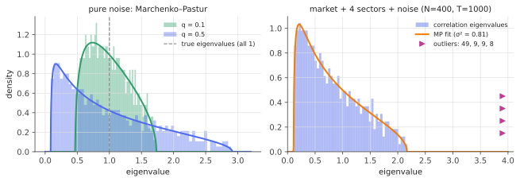

# The Marchenko–Pastur law

!!! tldr "TL;DR"
    Estimate the covariance of $N$ uncorrelated unit-variance variables from $T$ samples. Even though every true eigenvalue equals 1, the sample eigenvalues spread over
    $[(1-\sqrt q)^2,\,(1+\sqrt q)^2]$ with $q = N/T$, following the **Marchenko–Pastur density**
    
    $$\rho_q(x) = \frac{\sqrt{(\lambda_+ - x)(x - \lambda_-)}}{2\pi qx}.$$
    
    For $q > 1$ a fraction $1 - 1/q$ of the eigenvalues are exactly zero. The law comes from a two-line self-consistent equation for the Stieltjes transform, extends to any true covariance
    (the MP equation), and gives the **noise floor** against which signal eigenvalues in finance, PCA and neural-network weight matrices are judged.

## Why care?

The sample covariance matrix is the most-used estimator in multivariate statistics. In high dimension it is systematically wrong. Large eigenvalues come out too large and small ones too
small, by amounts that don't shrink unless $T\gg N$. The [Markowitz](markowitz-estimation-error.md) note showed the damage: a portfolio optimizer chases the artificially small eigenvalues.

Marchenko and Pastur (1967) computed *exactly* how much spreading pure noise produces. That turns it into a tool:

- **Signal detection.** Eigenvalues of an empirical correlation matrix inside the MP bulk are indistinguishable from noise. Those above $\lambda_+$ are signal. Laloux, Cizeau, Bouchaud & Potters (1999) found
  that about 94% of the eigenvalues of the S&P 500 correlation matrix sit in the noise band.
- **Cleaning.** Knowing the distortion lets you undo it ([clipping](clipping-factor-models.md), [RIE](rotational-invariant-estimators.md), [nonlinear shrinkage](nonlinear-shrinkage.md)).
- **ML theory.** Random weight matrices at initialization have MP singular-value spectra. The test error of least squares and ridge regression in high dimension is an MP integral, and the
  double-descent peak sits exactly where the smallest MP eigenvalue hits zero ($q = 1$).

## Building blocks

**Setting.** $X\in\R^{N\times T}$ with i.i.d. entries of mean 0 and variance 1 ($N$ variables, $T$ observations). The sample covariance is $E = \frac1TXX^\top$ ($N\times N$). As $N,T\to\infty$ with
$N/T\to q\in(0,\infty)$, we study the ESD of $E$.

**Easy moments.** $\frac1N\tr E = \frac1{NT}\sum_{i,t}X_{it}^2\to1$: the average eigenvalue is right. But (Exercise 1)

$$
\frac1N\E\tr E^2 = 1 + q + O(1/T),
$$

so the eigenvalues have **variance $q$** around their mean of 1, even though the truth has variance zero. The spread is controlled by $q$, the number of parameters per observation.

**Duality.** $XX^\top/T$ ($N\times N$) and $X^\top X/T$ ($T\times T$) have the same nonzero eigenvalues. If $N > T$ the $N\times N$ matrix has rank $T$, so at least $N - T$ of its eigenvalues are zero.

## The main result

!!! theorem "Theorem (Marchenko–Pastur, 1967)"
    As $N, T\to\infty$ with $N/T\to q$, the ESD of $E = \frac1TXX^\top$ converges almost surely to

    $$
    \mu_q = \Big(1 - \frac1q\Big)_+\delta_0 + \rho_q(x)\,dx,\qquad
    \rho_q(x) = \frac{\sqrt{(\lambda_+ - x)(x - \lambda_-)}}{2\pi qx}\,\mathbf 1_{[\lambda_-,\lambda_+]}(x),\qquad
    \lambda_\pm = (1\pm\sqrt q)^2 .
    $$

    Its Stieltjes transform $g(z) = \int\frac{\mu_q(dx)}{z - x}$ is the root with $g\sim1/z$ of

    $$
    qz\,g^2 - (z - 1 + q)\,g + 1 = 0 .
    $$

    With finite fourth moments, $\lambda_{\max}(E)\to\lambda_+$ and, for $q < 1$, $\lambda_{\min}(E)\to\lambda_-$.

### Derivation: one rank-one update at a time

Write $E = \frac1T\sum_{t=1}^Tx_tx_t^\top$, a sum of $T$ rank-one matrices, with $x_t$ the columns of $X$. Let $G = (z - E)^{-1}$ and $g_N = \frac1N\tr G$. Start from the trivial identity $(z - E)G = I$ and take normalized traces:

$$
z\,g_N - \frac1N\tr(EG) = 1 .
$$

**Sherman–Morrison.** Let $E_t = E - \frac1Tx_tx_t^\top$ and $G_t = (z - E_t)^{-1}$, which is independent of $x_t$. The rank-one update formula gives

$$
x_t^\top G = \frac{x_t^\top G_t}{1 - \frac1Tx_t^\top G_tx_t} .
$$

**Concentration.** $x_t$ has i.i.d. unit-variance entries and is independent of $G_t$, so $\frac1Tx_t^\top G_tx_t\approx\frac1T\tr G_t\approx\frac NT\,g_N = q\,g_N$, using the quadratic-form concentration from the
[Stieltjes note](stieltjes-resolvent.md) and the fact that a rank-one change barely moves the trace. Therefore

$$
\frac1N\tr(EG) = \frac{1}{NT}\sum_tx_t^\top Gx_t = \frac{1}{NT}\sum_t\frac{x_t^\top G_tx_t}{1 - \frac1Tx_t^\top G_tx_t}\approx\frac{1}{NT}\cdot T\cdot\frac{Ng}{1 - qg} = \frac{g}{1 - qg}.
$$

**Close the equation.** $zg - \frac{g}{1-qg} = 1$. Multiplying by $1 - qg$ and rearranging gives $qzg^2 - (z-1+q)g + 1 = 0$. $\square$

**From $g$ to the density.** The roots are

$$
g(z) = \frac{(z - 1 + q) - \sqrt{(z - 1 + q)^2 - 4qz}}{2qz} .
$$

The discriminant $(z-1+q)^2 - 4qz = (z - \lambda_-)(z - \lambda_+)$ is negative exactly for $z\in(\lambda_-,\lambda_+)$. There the square root is imaginary, and Stieltjes inversion gives
$\rho_q(x) = -\frac1\pi\operatorname{Im}g(x + i0) = \frac{\sqrt{(\lambda_+ - x)(x - \lambda_-)}}{2\pi qx}$. For $q > 1$, the pole of $g$ at $z = 0$ has residue $1 - 1/q$: those are the zero eigenvalues.

### General true covariance: the MP equation

If the data have covariance $\Sigma$ (columns $x_t = \Sigma^{1/2}y_t$) with eigenvalue distribution $\rho_\Sigma$, the same argument (Silverstein & Bai, 1995) gives a fixed-point equation:

$$
g_E(z) = \int\frac{\rho_\Sigma(t)\,dt}{z - t\,\big(1 - q + q\,z\,g_E(z)\big)} .
$$

For $\Sigma = I$ it reduces to the quadratic above. In general it is solved numerically (the widget below does this). It maps the **true** spectrum to the **sample** spectrum. Covariance
cleaning amounts to inverting this map: given the sample spectrum, infer the true one.

### Three consequences worth memorizing

1. **Noise floor.** Under pure noise, the largest sample eigenvalue is $\approx(1+\sqrt q)^2$. With $N = 500$ stocks and $T = 1000$ days, that is $2.91$. Correlation eigenvalues below it are not evidence of structure.
2. **Spreading is symmetric in the wrong way.** Large eigenvalues are inflated and small ones deflated. The smallest goes to $(1-\sqrt q)^2\to0$ as $q\to1$, and that drives the $1/(1-q)$ blow-ups in OLS and Markowitz.
3. **Inverse moments.** $\int\frac{\rho_q(x)}{x}dx = \frac1{1-q}$ and $\int\frac{\rho_q(x)}{x^2}dx = \frac{1}{(1-q)^3}$ for $q < 1$ (Exercise 3). These are exactly the constants in the in/out-of-sample risk of Markowitz portfolios
   and in the variance of least squares.

{ .fig }

The right panel shows the famous picture: a simulated "stock market" (one market factor, four sectors, idiosyncratic noise). The correlation spectrum is an MP bulk (rescaled to the variance the factors don't explain) plus a few outliers: one
huge market mode and three sector modes. The fourth sector direction is largely absorbed into the market mode.

## Examples

### Checking the law

```python
import numpy as np
rng = np.random.default_rng(0)
N, T = 500, 1000                                   # q = 0.5
q = N / T
X = rng.standard_normal((N, T))
lam = np.linalg.eigvalsh(X @ X.T / T)

lo, hi = (1 - np.sqrt(q)) ** 2, (1 + np.sqrt(q)) ** 2
print(f"edges: empirical [{lam.min():.3f}, {lam.max():.3f}]   MP [{lo:.3f}, {hi:.3f}]")
print(f"mean {lam.mean():.3f} (MP: 1)   second moment {np.mean(lam**2):.3f} (MP: 1+q = {1+q:.3f})")
print(f"mean of 1/λ {np.mean(1/lam):.3f} (MP: 1/(1-q) = {1/(1-q):.3f})   mean of 1/λ² {np.mean(1/lam**2):.3f} (MP: {1/(1-q)**3:.3f})")

# MP Stieltjes transform (convention g(z) = mean of 1/(z - λ)) vs the empirical one
def g_mp(z):
    r = np.sqrt(z - lo) * np.sqrt(z - hi)
    return ((z - 1 + q) - r) / (2 * q * z)
for z in [3.5, 1.0 + 0.2j]:
    print(f"z = {z}:  empirical g {np.mean(1/(z - lam)):.4f}   MP g {g_mp(z):.4f}")
# edges: empirical [0.082, 2.868]   MP [0.086, 2.914]
# mean 1.002 (MP: 1)   second moment 1.506 (MP: 1+q = 1.500)
# mean of 1/λ 1.996 (MP: 1/(1-q) = 2.000)   mean of 1/λ² 8.017 (MP: 8.000)
# z = 3.5:  empirical g 0.4542   MP g 0.4531
# z = (1+0.2j):  empirical g 0.3282-1.2077j   MP g 0.3333-1.2066j
```

The largest eigenvalue sits slightly inside $\lambda_+$, by about $N^{-2/3}$ (the [Tracy–Widom](tracy-widom.md) scale). Everything else matches to two or three digits at $N = 500$.

### Try it

Drag $q$ and switch the true covariance. With two true eigenvalue levels (1 and 4), small $q$ shows two separate bumps that merge into one blob as $q$ grows. With a single spike, the spike leaves the bulk only if it is strong enough
relative to $q$. That is the [BBP transition](bbp-spiked.md).

<div class="widget" data-widget="mp"></div>

## Exercises

!!! question "Exercise 1 · warm-up: the first two moments"
    Show that $\E\frac1N\tr E = 1$ and $\E\frac1N\tr E^2 = 1 + \frac2T + \frac{N-1}{T}\approx1 + q$ for Gaussian entries. (Expand $\tr E^2 = \frac1{T^2}\sum_{i,j}\big(\sum_tX_{it}X_{jt}\big)^2$.)

    ??? success "Solution"
        $\E\tr E = \frac1T\sum_{i,t}\E X_{it}^2 = N$. For the second moment, $\tr E^2 = \sum_{i,j}E_{ij}^2$. Diagonal terms: $E_{ii} = \frac1T\sum_tX_{it}^2$ has mean 1 and variance $2/T$, so $\E E_{ii}^2 = 1 + 2/T$.
        Off-diagonal terms: $\E E_{ij}^2 = \frac1{T^2}\sum_t\E X_{it}^2X_{jt}^2 = \frac1T$. Total: $\frac1N\E\tr E^2 = 1 + \frac2T + \frac{N-1}{T}\to1 + q$. The $N(N-1)$ small off-diagonal errors, each of size $1/\sqrt T$, add up to an $O(1)$ spread of the spectrum.

!!! question "Exercise 2 · the edges"
    Show that $(z - 1 + q)^2 - 4qz = (z - \lambda_-)(z - \lambda_+)$ with $\lambda_\pm = (1\pm\sqrt q)^2$. For $N = 1000$ assets, how many years of daily data ($252$ days per year) are needed for the MP bulk to lie within $[0.8, 1.2]$?

    ??? success "Solution"
        $(z - 1 + q)^2 - 4qz = z^2 - 2(1+q)z + (1-q)^2$, whose roots are $z = (1+q)\pm\sqrt{(1+q)^2 - (1-q)^2} = 1 + q\pm2\sqrt q = (1\pm\sqrt q)^2$ ✓.
        We need $(1+\sqrt q)^2\le1.2$, i.e. $\sqrt q\le0.0954$, so $q\le0.0091$ and $T\ge1000/0.0091\approx110{,}000$ days, about **436 years**. (The lower edge, $(1-\sqrt q)^2\ge0.8$, needs $q\le0.0111$, which is less demanding.)
        Sample covariances of large universes are therefore *always* in the high-dimensional regime, and cleaning is not optional.

!!! question "Exercise 3 · inverse moments from $g$"
    For $q < 1$, expand $g(z) = \int\frac{\rho(x)}{z - x}dx$ around $z = 0$ to show $g(0) = -m_{-1}$ and $g'(0) = -m_{-2}$, where $m_{-k} = \int x^{-k}\rho(x)dx$. Using the quadratic equation, show $m_{-1} = \frac1{1-q}$ and $m_{-2} = \frac1{(1-q)^3}$.

    ??? success "Solution"
        For $|z|$ below the support, $\frac1{z-x} = -\frac1x\cdot\frac1{1 - z/x} = -\sum_kz^kx^{-k-1}$, so $g(z) = -\sum_km_{-(k+1)}z^k$. That gives $g(0) = -m_{-1}$ and $g'(0) = -m_{-2}$.

        At $z = 0$ the equation gives $-(q-1)g_0 + 1 = 0$, so $g_0 = -\frac1{1-q}$ and $m_{-1} = \frac{1}{1-q}$. Differentiate implicitly: $qg^2 + 2qzgg' - g - (z - 1 + q)g' = 0$. At $z = 0$: $qg_0^2 - g_0 + (1-q)g_0' = 0$, so
        $g_0' = \frac{g_0 - qg_0^2}{1-q} = \frac{-\frac1{1-q} - \frac{q}{(1-q)^2}}{1-q} = -\frac{1}{(1-q)^3}$, and $m_{-2} = \frac1{(1-q)^3}$.

!!! question "Exercise 4 · how many factors?"
    You compute the correlation matrix of $N = 400$ stocks from $T = 1000$ days and find eigenvalues $49.5, 8.7, 8.5, 8.1, 2.18, 2.12, 2.10, 2.08,\dots$ Using the MP noise floor with the bulk variance reduced by the variance in the outliers,
    $\sigma^2\approx1 - \frac{1}{N}\sum_{\text{outliers}}\lambda_i$, decide which eigenvalues are signal.

    ??? success "Solution"
        $q = 0.4$. Taking the first four as outliers: $\sigma^2\approx1 - \frac{49.5 + 8.7 + 8.5 + 8.1}{400} = 1 - 0.187 = 0.813$. The rescaled upper edge is $\sigma^2(1+\sqrt{0.4})^2 = 0.813\times2.665\approx2.17$.
        The four large eigenvalues are clearly signal (market and sectors). $2.18$ sits right at the edge and the rest are inside the noise band. At this size the edge fluctuates by about $\pm0.05$ ([Tracy–Widom](tracy-widom.md)), so $2.18$
        is consistent with noise. These are the numbers from the simulated market in the figure, where the truth is "1 market + 3 effective sector modes". The rule recovers it exactly.

!!! question "Exercise 5 · stretch: duality and the atom at zero"
    Let $\underline E = \frac1TX^\top X$ ($T\times T$), with Stieltjes transform $\underline g$. Show that $T\,\underline g(z) - N\,g(z) = \frac{T - N}{z}$ (the same nonzero eigenvalues, plus $|T-N|$ zeros on one side). Deduce that for $q > 1$, $E$ has an atom of mass
    $1 - 1/q$ at zero, and relate the continuous part of $\mu_q$ to $\mu_{1/q}$.

    ??? success "Solution"
        Both matrices share the nonzero eigenvalues $\lambda_1,\dots,\lambda_r$, and the larger one has extra zeros. So $T\underline g - Ng = \sum_{\text{zeros of }\underline E}\frac1z - \sum_{\text{zeros of }E}\frac1z = \frac{T - N}{z}$.

        If $N > T$, $E$ has at least $N - T$ zero eigenvalues, a fraction $\frac{N-T}{N} = 1 - \frac1q$. The $T\times T$ matrix $\underline E = \frac1TX^\top X$ is a sample covariance in the dual direction with ratio $T/N = 1/q < 1$, but normalized by $T$ instead of $N$.
        Its nonzero spectrum is $q$ times an MP law with ratio $1/q$. Hence the continuous part of $\mu_q$ is $\frac1q\times$ (the MP$_{1/q}$ density rescaled by $q$), which matches the formula $\rho_q(x) = \frac{\sqrt{(\lambda_+-x)(x-\lambda_-)}}{2\pi qx}$, whose total mass is $1/q$ when $q > 1$.

## Where it shows up

- **Correlation-matrix cleaning in finance.** Laloux et al. (1999) and Plerou et al. (1999) showed that most of the spectrum of stock correlation matrices is MP noise. Every serious risk model now uses
  this, from eigenvalue clipping to the Bouchaud–Potters [rotationally invariant estimators](rotational-invariant-estimators.md) to Ledoit–Wolf [nonlinear shrinkage](nonlinear-shrinkage.md), which inverts the MP equation.
- **Neural-network weights.** At initialization a dense layer $W\in\R^{m\times n}$ with i.i.d. entries has $W^\top W$ spectrum MP. Martin & Mahoney's "heavy-tailed self-regularization" (and the WeightWatcher tool)
  diagnose training quality by how much trained layers depart from MP: spikes, heavy tails and the power-law exponent of the tail ([heavy-tailed RMT](heavy-tailed-rmt.md)).
- **Double descent.** The variance of least squares is $\sigma^2\int\rho_q(x)x^{-1}dx\propto\frac{q}{1-q}$, which blows up at $q = 1$, where the MP lower edge touches zero. Past $q = 1$ the minimum-norm solution sees an MP law with a
  zero atom and the risk comes back down ([ridge in high dimensions](ridge-high-dim.md)).
- **PCA in high dimension.** Deciding how many principal components are real (Onatski's tests, parallel analysis) compares sample eigenvalues with the MP edge. The [BBP transition](bbp-spiked.md) tells you when a weak factor can be
  seen at all.
- **Wireless communications.** The capacity of a MIMO channel with $N$ transmit and $T$ receive antennas is $\int\log(1 + \text{SNR}\,x)\rho_q(x)dx$. MP was used in engineering (Telatar, 1999) well before ML adopted it.

## Further reading

- V. A. Marchenko & L. A. Pastur, "Distribution of eigenvalues for some sets of random matrices" (*Math. USSR-Sbornik*, 1967).
- J.-P. Bouchaud & M. Potters, *A First Course in Random Matrix Theory* (2020), Ch. 4.
- L. Laloux, P. Cizeau, J.-P. Bouchaud & M. Potters, "Noise dressing of financial correlation matrices" (*PRL*, 1999).
- J. W. Silverstein & Z. D. Bai, "On the empirical distribution of eigenvalues of a class of large dimensional random matrices" (*J. Multivariate Anal.*, 1995).
