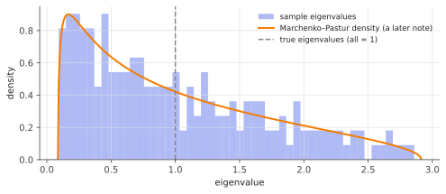
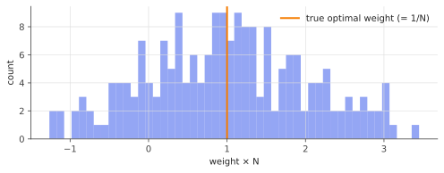

# Markowitz & the curse of estimation error

!!! tldr "TL;DR"
    Mean–variance optimization is elegant when you know the covariance matrix $\Sigma$, and dangerous when you plug in an estimate.
    With $N$ assets and $T$ observations, the plug-in minimum-variance portfolio **believes** its risk is $(1-q)$ times the true optimum
    but **realizes** $1/(1-q)$ times it, where $q = N/T$. The optimizer systematically loads on the directions where noise made risk look smallest.
    Random matrix theory explains exactly why, and motivates every covariance-cleaning method in this track.

## Why care?

Markowitz's 1952 portfolio theory won a Nobel prize and is taught in every finance course: choose weights to minimize variance for a target
return. Practitioners quickly found that optimized portfolios are unstable, concentrated in strange bets, and perform worse out of sample than
naive rules. Michaud (1989) called mean–variance optimizers **"estimation-error maximizers"**, and DeMiguel, Garlappi & Uppal (2009) found that
the equal-weight $1/N$ portfolio beats most optimized strategies out of sample.

The theory isn't wrong. The problem is that the optimizer trusts the sample covariance matrix completely, and in high dimension that matrix is
badly wrong in exactly the way that hurts. With $N = 500$ stocks and two years of daily data ($T\approx 500$), $q\approx 1$ and the sample covariance
is nearly singular. The same issue appears in ML whenever we invert an estimated covariance: whitening, Mahalanobis distances, linear discriminant
analysis, second-order optimizers, and least squares itself.

## Building blocks

**Portfolios.** Weights $w\in\R^N$ with budget constraint $w^\top\mathbf 1 = 1$ (negative weights = short positions). With return covariance $\Sigma$, the
portfolio variance ("risk") is $w^\top\Sigma w$.

**The minimum-variance portfolio.** Minimize $w^\top\Sigma w$ subject to $w^\top\mathbf 1 = 1$. The Lagrangian
$w^\top\Sigma w - 2\gamma(w^\top\mathbf 1 - 1)$ gives $\Sigma w = \gamma\mathbf 1$, so

$$
w^\star = \frac{\Sigma^{-1}\mathbf 1}{\mathbf 1^\top\Sigma^{-1}\mathbf 1},
\qquad
\mathcal R^2_{\text{true}} := w^{\star\top}\Sigma w^\star = \frac{1}{\mathbf 1^\top\Sigma^{-1}\mathbf 1}.
$$

We focus on this portfolio because it needs no expected returns, which are much harder still to estimate (see the remark below). It isolates the
role of the covariance.

**The eigen-view: why small eigenvalues matter.** Write $\Sigma = \sum_k\lambda_k u_ku_k^\top$. Then

$$
w^\star \;\propto\; \Sigma^{-1}\mathbf 1 = \sum_k \frac{u_k^\top\mathbf 1}{\lambda_k}\,u_k .
$$

The portfolio concentrates on **low-variance directions**, weighted by $1/\lambda_k$. That's the point of the optimization: hedge into combinations
of assets that barely move. But it also means **errors in the smallest eigenvalues get amplified the most**. If noise makes some direction look
less risky than it is, the optimizer bets heavily on it.

**The sample covariance.** Given $T$ return vectors $r_1,\dots,r_T\in\R^N$ (mean assumed zero for simplicity),

$$
E = \frac1T\sum_{t=1}^T r_t r_t^\top .
$$

$E$ is unbiased, $\E E = \Sigma$. But for $q = N/T$ not small, its eigenvalues are **systematically spread out**: the large ones are too large and
the small ones too small. Even when $\Sigma = I$ (all true eigenvalues equal to 1), the sample eigenvalues fill an interval
$[(1-\sqrt q)^2, (1+\sqrt q)^2]$. This is the [Marchenko–Pastur law](marchenko-pastur.md), which we'll derive later:

{ .fig }

For $q = 1/2$ the smallest sample eigenvalue is about $0.09$, so some directions look **11× less risky** than they are. The optimizer is drawn
straight to them.

## The main result

Let $w_E = E^{-1}\mathbf 1/(\mathbf 1^\top E^{-1}\mathbf 1)$ be the plug-in portfolio. There are three risks to compare:

- **true optimal** $\mathcal R^2_{\text{true}} = 1/(\mathbf 1^\top\Sigma^{-1}\mathbf 1)$;
- **in-sample (predicted)** $\mathcal R^2_{\text{in}} = w_E^\top E\, w_E = 1/(\mathbf 1^\top E^{-1}\mathbf 1)$, what your risk model reports;
- **out-of-sample (realized)** $\mathcal R^2_{\text{out}} = w_E^\top\Sigma\, w_E$, what you actually experience.

!!! theorem "Theorem (in- vs out-of-sample risk)"
    Suppose returns are Gaussian with covariance $\Sigma$, and $N, T\to\infty$ with $N/T\to q\in(0,1)$. Then, almost surely,

    $$
    \frac{\mathcal R^2_{\text{in}}}{\mathcal R^2_{\text{true}}} \;\to\; 1 - q,
    \qquad
    \frac{\mathcal R^2_{\text{out}}}{\mathcal R^2_{\text{true}}} \;\to\; \frac{1}{1-q}.
    $$

    The limits don't depend on $\Sigma$.

So the estimated risk is too optimistic by a factor $1-q$, the realized risk is too large by a factor $1/(1-q)$, and the ratio between what you
experience and what you were told is $1/(1-q)^2$ in variance.

### Derivation

**Step 1: reduce to white noise.** Write $r_t = \Sigma^{1/2}x_t$ with $x_t\sim N(0,I_N)$, so $E = \Sigma^{1/2}W\Sigma^{1/2}$ where
$W = \frac1T\sum_t x_tx_t^\top$ is a *white* Wishart matrix. With $v = \Sigma^{-1/2}\mathbf 1$ (so $\|v\|^2 = \mathbf 1^\top\Sigma^{-1}\mathbf 1 = 1/\mathcal R^2_{\text{true}}$):

$$
\mathbf 1^\top E^{-1}\mathbf 1 = v^\top W^{-1}v,\qquad
\mathbf 1^\top E^{-1}\Sigma E^{-1}\mathbf 1 = v^\top W^{-2}v .
$$

**Step 2: quadratic forms in rotation-invariant matrices.** $W$ is orthogonally invariant ($OWO^\top\overset d= W$), so its eigenvectors are
uniformly random, independent of $v$. By the [geometry of high dimensions](high-dim-geometry.md), a fixed vector has squared overlap $\approx\|v\|^2/N$
with each eigenvector, so for any function $f$,

$$
v^\top f(W)\,v \;\approx\; \|v\|^2\cdot\frac1N\tr f(W) \;\to\; \|v\|^2\int f(x)\,\rho_{\text{MP}}(x)\,dx .
$$

**Step 3: two Marchenko–Pastur moments.** For the MP law with ratio $q<1$:

$$
\int\frac{\rho_{\text{MP}}(x)}{x}\,dx = \frac{1}{1-q},\qquad \int\frac{\rho_{\text{MP}}(x)}{x^2}\,dx = \frac{1}{(1-q)^3}.
$$

(The first is consistent with the exact finite-sample identity $\E[W^{-1}] = \frac{T}{T-N-1}I$ for Wishart matrices. Both will drop out of the
Stieltjes transform in the MP note.)

**Step 4: assemble.**

$$
\mathcal R^2_{\text{in}} = \frac{1}{v^\top W^{-1}v}\approx\frac{1-q}{\|v\|^2} = (1-q)\,\mathcal R^2_{\text{true}},
\qquad
\mathcal R^2_{\text{out}} = \frac{v^\top W^{-2}v}{(v^\top W^{-1}v)^2}\approx\frac{\|v\|^2/(1-q)^3}{\|v\|^4/(1-q)^2} = \frac{\mathcal R^2_{\text{true}}}{1-q}. \quad\square
$$

!!! info "An exact finite-sample version"
    For Gaussian returns, a classical Wishart identity gives the in-sample result exactly:
    $\mathcal R^2_{\text{in}}/\mathcal R^2_{\text{true}}\sim\chi^2_{T-N+1}/T$, with mean $1 - q + 1/T$.
    The asymptotic theorem is the law of large numbers for this.

!!! warning "Expected returns are even worse"
    With annual volatility $20\%$, the standard error of an estimated annual mean return after $T$ years is $20\%/\sqrt T$, which is about **6%
    after 10 years**. That's the same size as the effect you're trying to measure. This is why practitioners often abandon return forecasts in the optimizer
    (minimum-variance, risk parity) or shrink them aggressively (Black–Litterman).

## Examples

### Simulation with a realistic covariance

The theorem claims independence from $\Sigma$. Let's test it with a one-factor "market" model:

```python
import numpy as np
rng = np.random.default_rng(0)

def min_var(S):
    w = np.linalg.solve(S, np.ones(len(S)))
    return w / w.sum()

N = 200
# A non-trivial "true" covariance: one market factor + idiosyncratic noise.
beta = 1 + 0.3 * rng.standard_normal(N)
Sigma = 0.04 * np.outer(beta, beta) + np.diag(rng.uniform(0.02, 0.08, N))
L = np.linalg.cholesky(Sigma)
w_true = min_var(Sigma)
risk_true = w_true @ Sigma @ w_true

for T in [2000, 800, 400, 250]:
    ins, outs = [], []
    for _ in range(20):                              # average over 20 samples
        R = L @ rng.standard_normal((N, T))          # T observations of N returns
        E = R @ R.T / T                              # sample covariance (mean known = 0)
        w = min_var(E)
        ins.append(w @ E @ w / risk_true)
        outs.append(w @ Sigma @ w / risk_true)
    q = N / T
    print(f"q={q:.2f}  in-sample {np.mean(ins):.3f} (1-q = {1-q:.3f})   "
          f"out-of-sample {np.mean(outs):.3f} (1/(1-q) = {1/(1-q):.3f})")
# q=0.10  in-sample 0.901 (1-q = 0.900)   out-of-sample 1.110 (1/(1-q) = 1.111)
# q=0.25  in-sample 0.738 (1-q = 0.750)   out-of-sample 1.332 (1/(1-q) = 1.333)
# q=0.50  in-sample 0.489 (1-q = 0.500)   out-of-sample 1.992 (1/(1-q) = 2.000)
# q=0.80  in-sample 0.215 (1-q = 0.200)   out-of-sample 4.663 (1/(1-q) = 5.000)
```

The agreement is excellent. At $q = 0.8$ finite-$N$ corrections and large fluctuations start to show: the smallest eigenvalues of $W$ get close to
zero, and $v^\top W^{-2}v$ is dominated by a few directions.

### What the weights look like

With $\Sigma = I$ the optimal portfolio is $w^\star = \mathbf 1/N$, perfectly diversified. The plug-in portfolio at $q = 1/2$ is anything but:
weights are scattered around $1/N$ and almost a fifth of them are short.

{ .fig }

### Try it

Each dot is one simulated plug-in portfolio (true $\Sigma = I$). Resample a few times. The scatter around the curves is largest near $q\to1$.

<div class="widget" data-widget="markowitz"></div>

## Exercises

!!! question "Exercise 1 · warm-up"
    Derive $w^\star$ and $\mathcal R^2_{\text{true}}$ for the minimum-variance problem using Lagrange multipliers. Why is $w^\star$ guaranteed to be the
    global minimum?

    ??? success "Solution"
        Stationarity of $w^\top\Sigma w - 2\gamma(w^\top\mathbf1 - 1)$ gives $\Sigma w = \gamma\mathbf 1$, i.e. $w = \gamma\Sigma^{-1}\mathbf 1$. The constraint
        fixes $\gamma = 1/(\mathbf 1^\top\Sigma^{-1}\mathbf 1)$. Then $w^{\star\top}\Sigma w^\star = \gamma^2\mathbf 1^\top\Sigma^{-1}\mathbf 1 = \gamma$.
        The objective is strictly convex ($\Sigma\succ0$) and the constraint is affine, so the stationary point is the unique global minimum.

!!! question "Exercise 2 · the diversification floor"
    Let all $N$ assets have variance $\sigma^2$ and pairwise correlation $\rho\ge 0$: $\Sigma = \sigma^2[(1-\rho)I + \rho\mathbf 1\mathbf 1^\top]$.
    Show that the minimum-variance portfolio is equal-weighted and that its variance is $\sigma^2\big(\rho + \frac{1-\rho}{N}\big)$. What happens as $N\to\infty$?

    ??? success "Solution"
        $\mathbf 1$ is an eigenvector of $\Sigma$ (eigenvalue $\sigma^2[1-\rho+N\rho]$), so $\Sigma^{-1}\mathbf 1\propto\mathbf 1$ and $w^\star = \mathbf 1/N$. Its variance is
        $\frac{1}{N^2}\mathbf 1^\top\Sigma\mathbf 1 = \frac{\sigma^2}{N^2}\big[N(1-\rho) + N^2\rho\big] = \sigma^2\big(\rho + \frac{1-\rho}{N}\big)$.
        As $N\to\infty$ the variance tends to $\rho\sigma^2$. Idiosyncratic risk diversifies away, but the common (market) component can't. This
        common component is the top eigenvalue, the "market mode", of real correlation matrices.

!!! question "Exercise 3 · a realistic setup"
    You estimate the covariance of $N=100$ stocks from one year of daily data ($T = 250$) and form the minimum-variance portfolio. Your risk model
    reports an annualized volatility of $10\%$. Roughly what volatility should you expect to realize?

    ??? success "Solution"
        $q = 0.4$. Predicted variance $\approx 0.6\,\mathcal R^2_{\text{true}}$, realized $\approx \mathcal R^2_{\text{true}}/0.6$, so realized/predicted variance
        $\approx 1/0.36 = 2.78$, i.e. realized/predicted **volatility** $\approx 1/(1-q) = 1.67$. Expect about $17\%$, not $10\%$. (The true optimum would
        have been about $10\%/\sqrt{0.6}\approx 12.9\%$.)

!!! question "Exercise 4 · in-sample risk is optimistic on average"
    Show, without any random matrix theory, that $\E[\mathcal R^2_{\text{in}}]\le\mathcal R^2_{\text{true}}$ for any distribution of returns with $\E E = \Sigma$.
    Also show that $\mathcal R^2_{\text{out}}\ge\mathcal R^2_{\text{true}}$ always.

    ??? success "Solution"
        $f(S) = \min_{w^\top\mathbf 1 = 1}w^\top Sw$ is a minimum of functions that are linear in $S$, hence **concave** in $S$. By Jensen,
        $\E f(E)\le f(\E E) = f(\Sigma) = \mathcal R^2_{\text{true}}$. For the second claim, $w_E$ is feasible and $w^\star$ minimizes
        $w^\top\Sigma w$ over feasible $w$, so $w_E^\top\Sigma w_E\ge\mathcal R^2_{\text{true}}$. The RMT theorem *quantifies* both gaps.

!!! question "Exercise 5 · stretch: the eigen-view of the out-of-sample loss"
    Take $\Sigma = I$ and write $E = \sum_k\hat\lambda_k\hat u_k\hat u_k^\top$. Show that

    $$
    \mathcal R^2_{\text{out}} = \frac{\sum_k(\hat u_k^\top\mathbf 1)^2/\hat\lambda_k^2}{\big(\sum_k(\hat u_k^\top\mathbf 1)^2/\hat\lambda_k\big)^2}.
    $$

    Assuming $(\hat u_k^\top\mathbf 1)^2\approx 1$ for all $k$ (why is this reasonable?), recover $\mathcal R^2_{\text{out}}/\mathcal R^2_{\text{true}}\approx 1/(1-q)$ from the
    MP moments. Which eigenvalues dominate the numerator?

    ??? success "Solution"
        $E^{-1}\mathbf 1 = \sum_k\hat\lambda_k^{-1}(\hat u_k^\top\mathbf 1)\hat u_k$, so $\|E^{-1}\mathbf 1\|^2 = \sum_k(\hat u_k^\top\mathbf 1)^2/\hat\lambda_k^2$ and
        $\mathbf 1^\top E^{-1}\mathbf 1 = \sum_k(\hat u_k^\top\mathbf 1)^2/\hat\lambda_k$. With $\Sigma = I$, $\mathcal R^2_{\text{out}} = \|w_E\|^2$, which is the ratio above.

        The eigenvectors of a white Wishart matrix are uniformly random. A uniform unit vector $\hat u$ has $\E(\hat u^\top\mathbf 1)^2 = \|\mathbf 1\|^2/N = 1$
        ([high-dim geometry](high-dim-geometry.md), Exercise 3), and the average over $k$ concentrates. Then

        $$
        \mathcal R^2_{\text{out}}\approx\frac{\sum_k\hat\lambda_k^{-2}}{(\sum_k\hat\lambda_k^{-1})^2} = \frac1N\cdot\frac{(1-q)^{-3}}{(1-q)^{-2}} = \frac{1}{N(1-q)},
        $$

        and $\mathcal R^2_{\text{true}} = 1/N$. ✓ The numerator is dominated by the **smallest** sample eigenvalues ($\hat\lambda^{-2}$ blows up near the
        lower MP edge $(1-\sqrt q)^2$). Noise-deflated eigenvalues drive the damage, which is why cleaning methods raise them.

## Where it shows up

- **Covariance cleaning in quant.** Everything in this track is a response to this note: [James–Stein](james-stein.md) and
  [Ledoit–Wolf](ledoit-wolf.md) shrinkage, [eigenvalue clipping & factor models](clipping-factor-models.md),
  [rotationally invariant estimators](rotational-invariant-estimators.md) and [nonlinear shrinkage](nonlinear-shrinkage.md). They all try to undo
  the MP spreading before inverting. Even portfolio constraints help for this reason: Jagannathan & Ma (2003) showed that a no-short-selling
  constraint acts like covariance shrinkage.
- **Least squares has the same factor.** The excess test error of OLS with $p$ features and $n$ samples is $\sigma^2 p/(n-p-1)\approx\sigma^2\frac{q}{1-q}$.
  The same $1/(1-q)$ comes from the same inverse-Wishart moment. It is the left half of the [double descent](ridge-high-dim.md) curve.
- **Whitening and second-order methods in ML.** Preconditioners built from estimated curvature or gradient covariance (K-FAC, Shampoo,
  natural gradient) invert noisy matrices. The universal fix, adding damping $\lambda I$ before inverting, is [ridge](ridge.md)-style shrinkage,
  and it is needed for exactly the reason shown here.
- **Risk model validation.** The in/out-of-sample gap means backtests of optimized portfolios must use strictly out-of-sample covariance estimates,
  and reported ex-ante risk should be inflated (or the covariance cleaned) when $q$ is not small.

## Further reading

- J.-P. Bouchaud & M. Potters, *A First Course in Random Matrix Theory* (2020), Ch. 18 ("Portfolio optimization"). The derivation above follows their treatment.
- S. Pafka & I. Kondor, "Noisy covariance matrices and portfolio optimization II" (2003).
- N. El Karoui, "High-dimensionality effects in the Markowitz problem and other quadratic programs with linear constraints" (*Ann. Stat.*, 2010).
- V. DeMiguel, L. Garlappi & R. Uppal, "Optimal versus naive diversification: how inefficient is the 1/N portfolio strategy?" (*RFS*, 2009).
