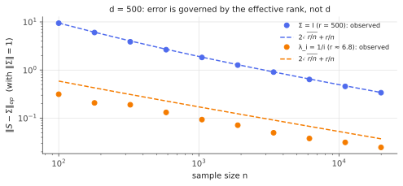

# Matrix Bernstein

!!! tldr "TL;DR"
    Scalar concentration extends to sums of independent random **matrices**. If $X_1,\dots,X_n$ are independent, mean-zero, symmetric $d\times d$ matrices with $\|X_k\|\le L$, and $\sigma^2 = \big\|\sum_k\E X_k^2\big\|$, then
    $$\P\Big(\Big\|\sum_kX_k\Big\|\ge t\Big)\le2d\,\exp\Big(-\frac{t^2/2}{\sigma^2 + Lt/3}\Big),\qquad\E\Big\|\sum_kX_k\Big\|\lesssim\sqrt{2\sigma^2\log(2d)} + \tfrac{L}{3}\log(2d).$$
    The only price for going from scalars to matrices is a factor $d$ in the tail (a $\log d$ in the expectation), and even that can be replaced by an *effective* dimension. This one inequality covers covariance estimation, randomized linear algebra, graph sparsification, matrix completion and random-feature approximations.

## Why care?

Many algorithms replace a big matrix by a random, cheaper surrogate: a sample covariance instead of the true one, a sketch $SA$ instead of $A$, a subsampled Hessian instead of the full one, a sparse graph instead of a dense one, random features instead of a kernel matrix. The surrogate is a **sum of independent random matrices** whose
expectation is the target. To trust it you need the operator-norm error $\|\sum_kX_k\|$, which by [Weyl](courant-fischer-weyl.md) and [Davis–Kahan](davis-kahan.md) controls how far eigenvalues and eigenvectors can move.

Before 2010 such bounds were bespoke and painful. Ahlswede & Winter (2002), Oliveira and, decisively, Tropp (2012) gave a *general-purpose* matrix Bernstein inequality that looks exactly like the scalar [Bernstein inequality](hoeffding-bernstein.md), so a one-page argument now replaces a paper.

## Building blocks

**Operator norm and extreme eigenvalues.** For symmetric $Y$, $\|Y\| = \max(\lambda_{\max}(Y), -\lambda_{\min}(Y))$, so it suffices to bound $\lambda_{\max}(Y)$ and apply the result to $-Y$.

**The matrix Laplace transform.** Since $e^{\theta\lambda_{\max}(Y)} = \lambda_{\max}(e^{\theta Y})\le\tr e^{\theta Y}$ (all eigenvalues of $e^{\theta Y}$ are positive), Markov's inequality gives

$$
\P(\lambda_{\max}(Y)\ge t)\le\inf_{\theta>0}e^{-\theta t}\,\E\tr e^{\theta Y}.
$$

The trace exponential plays the role of the moment generating function. The difficulty is that $e^{A+B}\neq e^Ae^B$ for non-commuting matrices, so the MGF doesn't factor over independent summands.

**Lieb's theorem** (1973) supplies the missing step. For fixed symmetric $H$, the map $A\mapsto\tr\exp(H + \log A)$ is concave on positive definite matrices. Combined with Jensen's inequality, it gives the **subadditivity of matrix cumulant generating functions**:

$$
\E\tr\exp\Big(\sum_k\theta X_k\Big)\le\tr\exp\Big(\sum_k\log\E e^{\theta X_k}\Big).
$$

## The main result

!!! theorem "Theorem (matrix Bernstein; Tropp, 2012)"
    Let $X_1,\dots,X_n$ be independent random symmetric $d\times d$ matrices with $\E X_k = 0$ and $\|X_k\|\le L$ almost surely. Let $Y = \sum_kX_k$ and $\sigma^2 = \|\E Y^2\| = \big\|\sum_k\E X_k^2\big\|$. Then for all $t\ge0$,

    $$
    \P\big(\|Y\|\ge t\big)\le2d\,\exp\Big(-\frac{t^2/2}{\sigma^2 + Lt/3}\Big),
    \qquad\text{and}\qquad
    \E\|Y\|\le\sqrt{2\sigma^2\log(2d)} + \frac L3\log(2d).
    $$

**Proof sketch.**

1. *Scalar Bernstein, in matrix form.* For a symmetric matrix with $\E X = 0$ and $\|X\|\le L$, the same power-series argument as in the scalar case (using $X^k\preceq L^{k-2}X^2$) gives the semidefinite bound
   $\E e^{\theta X}\preceq\exp\big(g(\theta)\E X^2\big)$ with $g(\theta) = \frac{\theta^2/2}{1 - \theta L/3}$ for $0 < \theta < 3/L$.
2. *Subadditivity (Lieb).* $\E\tr e^{\theta Y}\le\tr\exp\big(\sum_k\log\E e^{\theta X_k}\big)\le\tr\exp\big(g(\theta)\sum_k\E X_k^2\big)$, using that $\log$ is operator monotone and $\tr\exp$ is monotone.
3. *Trace to norm.* $\tr\exp(g(\theta)V)\le d\,e^{g(\theta)\|V\|} = d\,e^{g(\theta)\sigma^2}$, since a trace of $d$ eigenvalues is at most $d$ times the largest. **This is where the dimension factor enters.**
4. *Optimize* $\theta$ exactly as in the scalar proof. Add the same bound for $-Y$ to get the factor 2. $\square$

### Reading the bound

- **Two regimes, as in the scalar case.** For small $t$, the tail is Gaussian with variance proxy $\sigma^2$. For large $t$, it is exponential with scale $L$. With probability $1-\delta$,
  $\|Y\|\lesssim\sqrt{\sigma^2\log(d/\delta)} + L\log(d/\delta)$.
- **The variance statistic is a matrix.** $\sigma^2 = \|\sum\E X_k^2\|$ is the norm of a sum, not a sum of norms. If the summands point in "different directions" (e.g. independent rank-one matrices), $\sigma^2$ can be much smaller than $\sum\|\E X_k^2\|$.
- **The $\log d$ is necessary in general.** For diagonal matrices with independent entries, $\|Y\|$ is a maximum of $d$ independent scalar sums, which really does pick up $\sqrt{2\log d}$ ([maxima of sub-Gaussians](subgaussian-subexponential.md)). For Wigner-like matrices the truth is dimension-free, and finer tools (or the RMT notes) give sharper answers.
- **Intrinsic dimension.** Step 3 can use $\tr(V)/\|V\|$, the *effective rank* of $V = \sum\E X_k^2$, instead of $d$. That gives bounds for infinite-dimensional operators and for low-effective-rank problems.
- **Rectangular matrices** follow by applying the theorem to the symmetric dilation $\begin{pmatrix}0 & Z\\ Z^\top & 0\end{pmatrix}$ ([Courant–Fischer](courant-fischer-weyl.md), Exercise 4), with $\sigma^2 = \max(\|\sum\E Z_kZ_k^\top\|, \|\sum\E Z_k^\top Z_k\|)$.

### Covariance estimation

Let $x_k$ be i.i.d. with covariance $\Sigma$ and $\|x_k\|^2\le R$ almost surely, and $S = \frac1n\sum_kx_kx_k^\top$. Apply the theorem to $X_k = \frac1n(x_kx_k^\top - \Sigma)$: $\|X_k\|\le\frac{R + \|\Sigma\|}{n}$, and $\E X_k^2\preceq\frac{1}{n^2}\E\|x\|^2xx^\top\preceq\frac{R}{n^2}\Sigma$, so $\sigma^2\le\frac{R\|\Sigma\|}{n}$. Hence

$$
\E\|S - \Sigma\|\lesssim\sqrt{\frac{R\|\Sigma\|\log d}{n}} + \frac{R\log d}{n}.
$$

With $R\approx\tr\Sigma = r\|\Sigma\|$ (effective rank $r = \tr\Sigma/\|\Sigma\|$), the **relative** error is $\lesssim\sqrt{r\log d/n} + r\log d/n$. You need $n\gtrsim r\log d$ samples, so the effective rank, not the ambient dimension, sets the sample complexity. For Gaussian data the $\log d$ can be removed
(Koltchinskii & Lounici, 2017): $\E\|S - \Sigma\|\asymp\|\Sigma\|(\sqrt{r/n} + r/n)$.

{ .fig }

## Examples

### Same top eigenvalue, very different difficulty

```python
import numpy as np
rng = np.random.default_rng(0)
d = 1000

# Two covariances with the same top eigenvalue (1) but very different effective rank r = tr(Σ)/||Σ||.
spectra = {"flat (Σ = I)": np.ones(d), "decaying (λ_i = 1/i)": 1.0 / np.arange(1, d + 1)}
for name, lam in spectra.items():
    r = lam.sum() / lam.max()
    for n in [200, 2000, 20000]:
        X = rng.standard_normal((n, d)) * np.sqrt(lam)                 # rows ~ N(0, diag(lam))
        err = np.linalg.norm(X.T @ X / n - np.diag(lam), 2)            # operator-norm error
        print(f"{name:21s} r = {r:7.1f}  n = {n:6d}   ||S - Σ|| = {err:.3f}   "
              f"sqrt(r/n) + r/n = {np.sqrt(r / n) + r / n:.3f}")
# flat (Σ = I)          r =  1000.0  n =    200   ||S - Σ|| = 9.345   sqrt(r/n) + r/n = 7.236
# flat (Σ = I)          r =  1000.0  n =   2000   ||S - Σ|| = 1.848   sqrt(r/n) + r/n = 1.207
# flat (Σ = I)          r =  1000.0  n =  20000   ||S - Σ|| = 0.499   sqrt(r/n) + r/n = 0.274
# decaying (λ_i = 1/i)  r =     7.5  n =    200   ||S - Σ|| = 0.209   sqrt(r/n) + r/n = 0.231
# decaying (λ_i = 1/i)  r =     7.5  n =   2000   ||S - Σ|| = 0.088   sqrt(r/n) + r/n = 0.065
# decaying (λ_i = 1/i)  r =     7.5  n =  20000   ||S - Σ|| = 0.023   sqrt(r/n) + r/n = 0.020
```

Both covariances live in $d = 1000$ dimensions with $\|\Sigma\| = 1$. With a decaying spectrum ($r\approx7.5$), $n = 200$ samples already give 20% relative error. With a flat spectrum ($r = 1000$) the error is 9 times the signal. The scaling $\sqrt{r/n} + r/n$ tracks both cases up to a constant. For $\Sigma = I$ the exact constant is
the [Marchenko–Pastur](marchenko-pastur.md) edge, $\|S - I\|\to2\sqrt q + q$, which gives $9.47$ at $n = 200$ ($q = 5$). Concentration inequalities give the right *rate*, and RMT gives the exact constant.

## Exercises

!!! question "Exercise 1 · warm-up: the diagonal case"
    Let $X_k = \varepsilon_k\,e_{i_k}e_{i_k}^\top$, where $\varepsilon_k = \pm1$ are Rademacher signs and $i_k$ are uniform on $\{1,\dots,d\}$, all independent, $k = 1,\dots,n$. Compute $\sigma^2$ and $L$, and the matrix Bernstein bound on $\E\|\sum_kX_k\|$. What is $\|\sum_kX_k\|$ exactly, and why does the $\log d$ appear?

    ??? success "Solution"
        $X_k^2 = e_{i_k}e_{i_k}^\top$, so $\sum\E X_k^2 = \frac ndI$ and $\sigma^2 = n/d$, with $L = 1$. The bound is $\E\|Y\|\lesssim\sqrt{2(n/d)\log(2d)} + \frac13\log(2d)$.
        $Y$ is diagonal, with $j$-th entry the sum of the signs that landed in coordinate $j$, about $n/d$ terms. So $\|Y\| = \max_j|Y_{jj}|$, a maximum of $d$ roughly independent sums of variance $n/d$, which is about $\sqrt{2(n/d)\log d}$. The $\log d$ is genuinely there: the bound is tight for this example.

!!! question "Exercise 2 · the variance statistic for covariances"
    For $X_k = \frac1n(x_kx_k^\top - \Sigma)$ with $\|x_k\|^2\le R$, show $\E X_k^2\preceq\frac{1}{n^2}\E[\|x\|^2xx^\top]\preceq\frac{R}{n^2}\Sigma$, hence $\sigma^2\le R\|\Sigma\|/n$.

    ??? success "Solution"
        $\E(xx^\top - \Sigma)^2 = \E[xx^\top xx^\top] - \Sigma^2 = \E[\|x\|^2xx^\top] - \Sigma^2\preceq\E[\|x\|^2xx^\top]\preceq R\,\E[xx^\top] = R\Sigma$. Divide by $n^2$ and sum over $n$ terms: $\sum\E X_k^2\preceq\frac Rn\Sigma$, so $\sigma^2\le\frac{R\|\Sigma\|}{n}$.

!!! question "Exercise 3 · rectangular matrices"
    State matrix Bernstein for a sum of independent mean-zero $d_1\times d_2$ matrices $Z_k$ with $\|Z_k\|\le L$, using the dilation. What replaces $d$ and $\sigma^2$?

    ??? success "Solution"
        Apply the theorem to $X_k = \begin{pmatrix}0 & Z_k\\ Z_k^\top & 0\end{pmatrix}$, which is $(d_1+d_2)\times(d_1+d_2)$ with $\|X_k\| = \|Z_k\|$ and $X_k^2 = \diag(Z_kZ_k^\top,\ Z_k^\top Z_k)$. So
        $\P(\|\sum Z_k\|\ge t)\le(d_1 + d_2)\exp\big(-\frac{t^2/2}{\sigma^2 + Lt/3}\big)$ with $\sigma^2 = \max\big(\|\sum\E Z_kZ_k^\top\|, \|\sum\E Z_k^\top Z_k\|\big)$. It is used for matrix completion, sketched products $A^\top S^\top SB$, and cross-covariances.

!!! question "Exercise 4 · approximate matrix multiplication"
    To approximate $A^\top B$ ($A\in\R^{n\times d_1}$, $B\in\R^{n\times d_2}$), sample $m$ rows i.i.d. with probabilities $p_i\propto\|a_i\|\|b_i\|$ and form $\frac1m\sum_j\frac{a_{i_j}b_{i_j}^\top}{p_{i_j}}$. Show it is unbiased, and use matrix Bernstein to argue that $m\approx\frac{\|A\|_F\|B\|_F}{\varepsilon^2\|A\|\|B\|}\log d$ samples give relative error $\varepsilon$ (in units of $\|A\|\|B\|$), roughly.

    ??? success "Solution"
        $\E\frac{a_ib_i^\top}{p_i} = \sum_ip_i\frac{a_ib_i^\top}{p_i} = A^\top B$. With $p_i = \frac{\|a_i\|\|b_i\|}{\sum_j\|a_j\|\|b_j\|}$, each term has norm $\frac{\|a_i\|\|b_i\|}{p_i} = \sum_j\|a_j\|\|b_j\|\le\|A\|_F\|B\|_F$ (Cauchy–Schwarz), so $L\approx\frac{2\|A\|_F\|B\|_F}{m}$.
        The variance statistic is at most about $\frac{\|A\|_F\|B\|_F\,\|A\|\|B\|}{m}$. Plugging into the bound, the error is $\lesssim\sqrt{\frac{\|A\|_F\|B\|_F\|A\|\|B\|\log d}{m}} + \frac{\|A\|_F\|B\|_F\log d}{m}$. Setting this to $\varepsilon\|A\|\|B\|$ gives the stated $m$ (up to constants). The number of samples scales with **stable ranks** $\|A\|_F^2/\|A\|^2$, not with $n$.
        This is the core of randomized numerical linear algebra.

!!! question "Exercise 5 · stretch: subspace embeddings by leverage-score sampling"
    Let $U\in\R^{n\times d}$ have orthonormal columns, with leverage scores $\ell_i = \|u_i\|^2$ ($\sum_i\ell_i = d$). Sample $m$ rows with probabilities $p_i = \ell_i/d$ and form $\hat I = \frac1m\sum_j\frac{u_{i_j}u_{i_j}^\top}{p_{i_j}}$. Show that $\|\hat I - I_d\|\le\varepsilon$ with probability $\ge1 - \delta$ once $m\gtrsim\frac{d\log(d/\delta)}{\varepsilon^2}$.
    Why does this let you solve a least-squares problem with $n\gg d$ rows using only $O(d\log d)$ of them?

    ??? success "Solution"
        Let $X_j = \frac1m\big(\frac{u_{i_j}u_{i_j}^\top}{p_{i_j}} - I\big)$, which has mean zero. Since $\frac{\|u_i\|^2}{p_i} = d$, $\|X_j\|\le\frac{d+1}{m} =: L$. Also $\E\big(\frac{uu^\top}{p}\big)^2 = \sum_i\frac{\|u_i\|^2u_iu_i^\top}{p_i} = d\sum_iu_iu_i^\top = dI$, so $\sigma^2\le\frac dm$. Matrix Bernstein gives
        $\P(\|\hat I - I\|\ge\varepsilon)\le2d\exp\big(-\frac{m\varepsilon^2/2}{d(1 + \varepsilon/3)}\big)$, which is $\le\delta$ when $m\gtrsim\frac{d\log(2d/\delta)}{\varepsilon^2}$.

        If $A = UR$ (QR decomposition), then $\|SAx\|^2 = x^\top R^\top(U^\top S^\top SU)Rx\in[(1-\varepsilon), (1+\varepsilon)]\|Ax\|^2$ for **all** $x$: the sampled rows preserve the geometry of the column space. So the sampled least-squares problem has nearly the same solution as the full one. This "subspace embedding" is the basis of fast randomized regression, of sketch-and-solve, and of coreset constructions.

## Where it shows up

- **Randomized numerical linear algebra.** Row/column sampling, sketching, randomized SVD and Nyström approximations are analysed with matrix Bernstein/Chernoff. They are now standard for large-scale least squares, kernel methods and low-rank compression.
- **Graph sparsification.** Spielman & Srivastava sample edges by effective resistance, the leverage scores of the incidence matrix, to get sparse graphs that preserve all cuts and Laplacian quadratic forms. The analysis is Exercise 5.
- **Matrix completion and recommender systems.** Recovering a low-rank matrix from a few observed entries (Candès–Recht, Recht 2011) relies on matrix Bernstein to show that the sampled operator is close to its expectation on the relevant subspace.
- **Subsampled second-order optimization.** Subsampled Newton and Hessian-free methods use mini-batch Hessians. Matrix concentration says how big a batch keeps $\|H_B - H\|$ small enough for the curvature, and hence the step, to be trusted.
- **Random features and kernels.** Rahimi–Recht random Fourier features approximate a kernel matrix by a sum of independent rank-one terms. Matrix Bernstein bounds the operator-norm approximation error, which then controls the error of downstream kernel ridge regression.

## Further reading

- J. A. Tropp, "An introduction to matrix concentration inequalities" (*Found. Trends ML*, 2015). The standard reference, very clear.
- J. A. Tropp, "User-friendly tail bounds for sums of random matrices" (*Found. Comput. Math.*, 2012).
- R. Vershynin, *High-Dimensional Probability* (2018), Ch. 5.
- V. Koltchinskii & K. Lounici, "Concentration inequalities and moment bounds for sample covariance operators" (*Bernoulli*, 2017).
