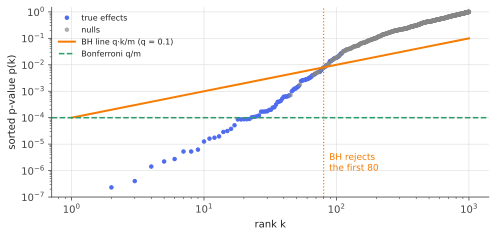

# Multiple testing, FDR & Benjamini–Hochberg

!!! tldr "TL;DR"
    Test $m$ hypotheses at level $\alpha$ each and you should expect $\alpha m_0$ false positives among the $m_0$ true nulls. **Bonferroni** ($p\le\alpha/m$) controls the chance of *any* false positive, but it is very conservative.
    The **false discovery rate**, $\text{FDR} = \E[V/\max(R,1)]$ (the expected fraction of discoveries that are false), is a more useful target when you screen many hypotheses. The **Benjamini–Hochberg** procedure (sort the $p$-values and reject
    the largest prefix with $p_{(k)}\le\alpha k/m$) controls FDR at $\pi_0\alpha$ for independent tests. The proof takes about five lines.

## Why care?

Modern data analysis tests thousands of things at once:

- **Quant research** backtests hundreds of strategies or factors and reports the best. Harvey, Liu & Zhu (2016) counted over 300 published "anomalies" and argued that a new factor needs $t > 3$, not $t > 2$, to be credible.
- **A/B testing platforms** track dozens of metrics per experiment across hundreds of experiments.
- **Genomics** tests a million genetic variants for association with a disease.
- **ML evaluation** compares models across dozens of benchmarks, and interpretability work probes thousands of neurons or features.

If each test uses $p < 0.05$, then among 1000 null strategies about 50 will look "significant" by chance alone. Without a correction, most published discoveries in such a setting can be false. This note covers how to correct, and the trade-off
between being strict (FWER) and being useful (FDR).

## Building blocks

**$p$-values.** Under a true null hypothesis $H_i$, a valid $p$-value is (super-)uniform: $\P(p_i\le t)\le t$ for all $t\in[0,1]$.

**Counting outcomes.** With $m$ hypotheses, $m_0$ of them true nulls ($\pi_0 = m_0/m$), a procedure makes $R$ rejections ("discoveries"), of which $V$ are false:

- **Family-wise error rate:** $\text{FWER} = \P(V\ge1)$.
- **False discovery proportion:** $\text{FDP} = V/\max(R,1)$, a random variable.
- **False discovery rate:** $\text{FDR} = \E[\text{FDP}]$.

Since $\text{FDP}\le\mathbf 1\{V\ge1\}$, we always have FDR $\le$ FWER. Under the global null ($m_0 = m$) every discovery is false, so $\text{FDP} = \mathbf 1\{V\ge1\}$ and the two coincide.

**Bonferroni.** Reject $H_i$ if $p_i\le\alpha/m$. By the union bound, $\text{FWER}\le\sum_{i\in H_0}\P(p_i\le\alpha/m)\le m_0\alpha/m\le\alpha$, for **any** dependence. **Holm's step-down** (compare $p_{(k)}$ with $\alpha/(m-k+1)$ and stop at the first failure) also controls FWER and is uniformly
more powerful. Both become very conservative when $m$ is large.

## The main result

**The Benjamini–Hochberg (BH) procedure** at level $q$:

1. Sort the $p$-values: $p_{(1)}\le p_{(2)}\le\dots\le p_{(m)}$.
2. Find $k^* = \max\{k : p_{(k)}\le qk/m\}$ (zero if no such $k$).
3. Reject the hypotheses with the $k^*$ smallest $p$-values.

Graphically: plot the sorted $p$-values against rank and draw the line $qk/m$. Reject everything up to the **last** crossing below the line.

{ .fig }

!!! theorem "Theorem (Benjamini & Hochberg, 1995)"
    If the null $p$-values are independent of each other and of the non-null $p$-values, then

    $$
    \text{FDR}_{\text{BH}} = \frac{m_0}{m}\,q = \pi_0\,q\;\le\;q
    $$

    (with equality for continuous uniform null $p$-values). Benjamini & Yekutieli (2001) showed that FDR $\le q$ still holds under *positive regression dependence* (PRDS), and that for **arbitrary** dependence it holds if $q$ is replaced by
    $q/\sum_{i=1}^m\frac1i\approx q/\ln m$.

**Proof (under independence).** Write $\text{FDR} = \sum_{i\in H_0}\E\big[\frac{\mathbf 1\{i\text{ rejected}\}}{\max(R,1)}\big]$. Fix a null $i$. Let $R_i$ be the number of rejections BH would make if $p_i$ were replaced by $0$. It is a function of the **other** $p$-values only.

*Key property of BH (self-consistency):* $H_i$ is rejected if and only if $p_i\le qR_i/m$, and in that case $R = R_i$. (Lowering $p_i$ to 0 doesn't change the outcome when $i$ is already rejected. Conversely, $i$ survives the step-up search exactly when its own threshold $qR_i/m$ is met.)

Then, conditioning on the other $p$-values and using that $p_i$ is uniform and independent of them,

$$
\E\Big[\frac{\mathbf 1\{p_i\le qR_i/m\}}{R_i}\Big] = \E\Big[\frac{\P(p_i\le qR_i/m\mid p_{-i})}{R_i}\Big] = \E\Big[\frac{qR_i/m}{R_i}\Big] = \frac qm .
$$

Summing over the $m_0$ nulls gives $\text{FDR} = m_0q/m$. $\square$

### Why FDR is the right target for screening

FWER asks you to make **no** mistakes. With 1000 tests that forces a threshold of $p < 5\times10^{-5}$, and real but moderate effects go undetected. FDR asks that **most** of your discoveries be real, say 90% at $q = 0.1$. That is the right
contract when discoveries are followed up (more data, an out-of-sample test, a lab experiment): you want a rich, mostly clean shortlist. FDR is also **adaptive**. When there are many true signals, BH's threshold $qk^*/m$ automatically loosens.

### Refinements

- **Adaptive BH (Storey):** BH controls FDR at $\pi_0q$, which is conservative when many nulls are false. Estimate $\hat\pi_0 = \frac{\#\{p_i > \lambda\}}{m(1-\lambda)}$ (for example $\lambda = 1/2$) and run BH at level $q/\hat\pi_0$ (Exercise 5).
- **$q$-values:** the smallest FDR level at which each hypothesis would be rejected. These are reported in genomics software.
- **Local fdr (Efron):** the posterior probability that a particular test is null given its $z$-score, via an empirical-Bayes two-group model. It is related to [James–Stein](james-stein.md) thinking.
- **Online FDR and e-values:** for experiments arriving over time (alpha-investing, LORD), and *e-values*, which combine under arbitrary dependence and optional stopping.

## Examples

### A thousand backtests

1000 strategies, each backtested over 5 years of daily data. Fifty have a true annual Sharpe ratio of 1, the rest have zero.

```python
import numpy as np
from scipy import stats
rng = np.random.default_rng(0)

def benjamini_hochberg(p, q):
    """Return a boolean mask of rejections at FDR level q."""
    m = len(p); order = np.argsort(p)
    below = p[order] <= q * np.arange(1, m + 1) / m
    k = np.max(np.nonzero(below)[0]) + 1 if below.any() else 0     # largest k with p_(k) <= qk/m
    reject = np.zeros(m, bool); reject[order[:k]] = True
    return reject

# 1000 backtested strategies, 5 years of daily returns each; 50 have a true annual Sharpe of 1, the rest 0.
m, m1, T = 1000, 50, 5 * 252
true_sr = np.r_[np.ones(m1), np.zeros(m - m1)]
alpha = 0.05
results = {"no correction": [], "Bonferroni": [], "BH (FDR 5%)": []}
for rep in range(200):
    sr_hat = true_sr + rng.standard_normal(m) / np.sqrt(T / 252)       # annualized Sharpe estimate, SE = 1/sqrt(years)
    z = sr_hat * np.sqrt(T / 252)
    p = stats.norm.sf(z)                                              # one-sided p-values
    for name, rej in [("no correction", p <= alpha), ("Bonferroni", p <= alpha / m),
                      ("BH (FDR 5%)", benjamini_hochberg(p, alpha))]:
        V = np.sum(rej[m1:]); R = rej.sum()
        results[name].append((R, R - V, V / max(R, 1), V > 0))
for name, r in results.items():
    r = np.array(r, float)
    print(f"{name:14s} discoveries {r[:,0].mean():6.1f}   true {r[:,1].mean():5.1f}   "
          f"FDR {r[:,2].mean():.3f}   P(any false) {r[:,3].mean():.2f}")
# no correction  discoveries   83.9   true  36.5   FDR 0.564   P(any false) 1.00
# Bonferroni     discoveries    2.5   true   2.5   FDR 0.023   P(any false) 0.06
# BH (FDR 5%)    discoveries    7.1   true   6.7   FDR 0.047   P(any false) 0.30
```

- **No correction:** 84 "significant" strategies, more than half of them worthless.
- **Bonferroni:** almost never wrong, but it finds only 2.5 of the 50 real strategies.
- **BH:** finds almost three times as many while keeping the false fraction at $0.047\approx\pi_0q = 0.95\times0.05$, exactly as the theorem says.

The bigger lesson is in the power. A *true* Sharpe of 1 over 5 years has $z = \sqrt5\approx2.2$, too weak to survive any honest correction with 1000 candidates. Searching over many strategies requires either much longer
samples or stronger effects. That is the logic behind the "deflated Sharpe ratio" and the $t > 3$ hurdle.

## Exercises

!!! question "Exercise 1 · warm-up: why correct at all"
    With $m = 100$ independent true nulls tested at $\alpha = 0.05$, what is the expected number of false positives, and the probability of at least one? What per-test level gives FWER $= 0.05$ exactly (Šidák)?

    ??? success "Solution"
        $\E V = 100\times0.05 = 5$. $\P(V\ge1) = 1 - 0.95^{100}\approx0.994$. Šidák: $1 - (1-\alpha')^{100} = 0.05$ gives $\alpha' = 1 - 0.95^{1/100}\approx5.13\times10^{-4}$, slightly larger than Bonferroni's $5\times10^{-4}$.

!!! question "Exercise 2 · BH by hand"
    Ten $p$-values: $0.001, 0.008, 0.012, 0.030, 0.041, 0.045, 0.20, 0.35, 0.60, 0.90$. Which hypotheses do Bonferroni, Holm and BH reject at level $0.05$?

    ??? success "Solution"
        Bonferroni: threshold $0.005$, so only $0.001$ (1 rejection).
        Holm: compare $p_{(k)}$ with $0.05/(11-k)$: $0.001\le0.005$ ✓, $0.008\le0.00556$ ✗, stop. 1 rejection.
        BH: thresholds $0.005k$: $0.001\le0.005$ ✓, $0.008\le0.010$ ✓, $0.012\le0.015$ ✓, $0.030\le0.020$ ✗, $0.041\le0.025$ ✗, $0.045\le0.030$ ✗, and the remaining ones fail. The largest $k$ with $p_{(k)}\le0.005k$ is $k = 3$, so 3 rejections.
        Note that BH is "step-up": a later success would rescue earlier failures, but there isn't one here.

!!! question "Exercise 3 · the self-consistency property"
    Prove that BH rejects $H_i$ iff $p_i\le qR_i/m$, where $R_i$ is the number of BH rejections when $p_i$ is set to $0$, and that in that case $R = R_i$.

    ??? success "Solution"
        Let $k^*$ be BH's count with the original $p$-values and $k_i^* = R_i$ the count with $p_i = 0$. Setting $p_i$ to 0 can only lower the sorted sequence, so $k_i^*\ge k^*$.

        ($\Leftarrow$) Suppose $p_i\le qk_i^*/m$. In the modified problem, the $k_i^*$ smallest values (including $p_i = 0$) satisfy the BH condition at rank $k_i^*$. Restoring $p_i$ to its value, still $\le qk_i^*/m$, keeps $k_i^*$ values all $\le qk_i^*/m$. So $p_{(k_i^*)}\le qk_i^*/m$
        in the original problem, $k^*\ge k_i^*$, hence $k^* = k_i^*$, and $p_i$ is among the rejected.

        ($\Rightarrow$) If $H_i$ is rejected, then $p_i\le p_{(k^*)}\le qk^*/m$, and setting $p_i = 0$ doesn't change which prefix satisfies the condition, so $k_i^* = k^*$. Hence $p_i\le qR_i/m$ and $R = R_i$.

!!! question "Exercise 4 · FDR under dependence"
    Why might BH fail under arbitrary dependence? Show that the Benjamini–Yekutieli correction factor $\sum_{i=1}^m1/i$ is about $7.5$ for $m = 1000$. Which kind of dependence (positive or negative) is benign, and why are test statistics in finance (correlated strategies) usually PRDS-like?

    ??? success "Solution"
        The proof used $\P(p_i\le qR_i/m\mid p_{-i}) = qR_i/m$, which needs $p_i$ independent of $R_i$. Under dependence, small null $p_i$ may tend to coincide with large $R_i$ in a way that inflates FDR. The worst case loses a factor up to $\sum_{i\le m}1/i\approx\ln m + 0.577 = 7.49$ for $m = 1000$.

        Positive dependence (test statistics that move together, such as one-sided tests on positively correlated Gaussians) is PRDS, and BH remains valid. Correlated strategies share market exposure, so their statistics are positively correlated. BH is
        then fine, though the *effective* number of independent tests is smaller than $m$.

!!! question "Exercise 5 · stretch: Storey's adaptive procedure"
    Show that $\E\#\{i : p_i > \lambda\}\ge m_0(1-\lambda)$, so $\hat\pi_0 = \frac{\#\{p_i > \lambda\}}{m(1-\lambda)}$ tends to overestimate $\pi_0$ (it is conservative). If half the hypotheses are non-null and have tiny $p$-values, roughly how much more powerful is BH at level $q/\hat\pi_0$?

    ??? success "Solution"
        Each null $p$-value is super-uniform, so $\P(p_i > \lambda)\ge1-\lambda$. Summing over nulls gives $\E\#\{\text{null } p_i > \lambda\}\ge m_0(1-\lambda)$, and non-nulls can only add to the count. Hence $\E\hat\pi_0\ge\pi_0$.

        With $\pi_0 = 1/2$ and non-null $p$-values near zero, $\hat\pi_0\approx\frac{(m/2)(1-\lambda)}{m(1-\lambda)} = 1/2$. Running BH at $2q$ doubles every threshold, recovering the full $q$ budget that plain BH wastes as $\pi_0q = q/2$. Storey's method also proves FDR control
        (with a small modification) under independence.

## Where it shows up

- **Quant: the factor zoo and backtest overfitting.** Harvey, Liu & Zhu (2016) applied FWER and FDR corrections to hundreds of published factors. Bailey & López de Prado's "deflated Sharpe ratio" adjusts reported Sharpe ratios for the number of trials. Both
  formalize "if you try enough strategies, one will look great".
- **Experimentation platforms.** Online-experiment teams apply BH across metrics and segments, or use always-valid / online FDR methods for continuous monitoring, so that dashboards don't drown in false wins.
- **Genomics and neuroscience.** GWAS uses Bonferroni-like $5\times10^{-8}$ thresholds. Expression studies and fMRI voxel analyses use BH and $q$-values.
- **Feature selection with guarantees.** [Model-X knockoffs](knockoffs.md) build FDR-controlled variable selection for complex models on the BH idea, without needing valid $p$-values.
- **ML evaluation and interpretability.** Reporting "model A beats model B on 14 of 20 benchmarks", or "these 37 neurons respond to concept X", is a multiple-testing claim and should be treated as one.

## Further reading

- Y. Benjamini & Y. Hochberg, "Controlling the false discovery rate: a practical and powerful approach to multiple testing" (*JRSS-B*, 1995).
- Y. Benjamini & D. Yekutieli, "The control of the false discovery rate in multiple testing under dependency" (*Ann. Stat.*, 2001).
- B. Efron, *Large-Scale Inference* (2010).
- C. Harvey, Y. Liu & H. Zhu, "…and the cross-section of expected returns" (*RFS*, 2016).
