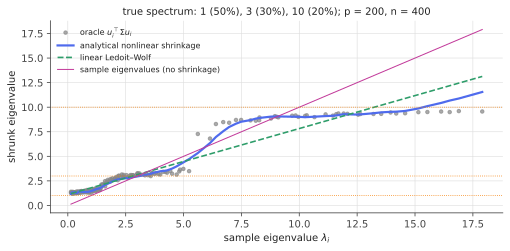

# Nonlinear shrinkage (Ledoit–Wolf 2017+)

!!! tldr "TL;DR"
    Ledoit and Wolf's **nonlinear shrinkage** keeps the sample eigenvectors and replaces each sample eigenvalue $\lambda_i$ by an estimate of the oracle $u_i^\top\Sigma u_i$. Their **analytical** version (2020) computes it in one pass from a kernel density estimate $\tilde f$ of the sample eigenvalues and its Hilbert transform $\mathcal H\tilde f$:
    $$d_i = \frac{\lambda_i}{\big(\pi q\lambda_i\tilde f(\lambda_i)\big)^2 + \big(1 - q - \pi q\lambda_i\,\mathcal H\tilde f(\lambda_i)\big)^2}.$$
    This is the same Ledoit–Péché formula as the [RIE](rotational-invariant-estimators.md), written in "real" coordinates. It is fast ($O(p^2)$ after the eigendecomposition), tuning-free, asymptotically optimal among rotation-equivariant estimators, and a standard benchmark for large covariance matrices.

## Why care?

[Linear shrinkage](ledoit-wolf.md) pulls every sample eigenvalue toward the mean by the same factor. The oracle shrinkage curve is generally **not** a straight line: where the true spectrum has clusters, the oracle forms plateaus, and near the edges it bends (see the figure). A straight line can't follow it, and the gap in performance matters most for exactly the applications that invert the covariance (portfolios, Mahalanobis distances, discriminants).

Ledoit & Wolf's programme (2012, 2017, 2020) made the oracle curve estimable in practice. The first versions inverted the Marchenko–Pastur map numerically ("QuEST"). The 2020 **analytical** version replaced that with a closed-form kernel estimator, which made nonlinear shrinkage as easy to use as linear shrinkage. It is the default "best estimator from returns alone" in much of the empirical finance literature, and it is the same mathematics as the Bouchaud–Potters RIE, developed in parallel.

## Building blocks

**Rotation equivariance and the oracle.** As in the RIE note, an estimator that has no preferred basis keeps the sample eigenvectors: $\hat\Sigma = \sum_id_iu_iu_i^\top$. Under Frobenius loss, the best possible choice is $d_i^{\text{or}} = u_i^\top\Sigma u_i$. (Under other losses, the oracle changes. Under the minimum-variance portfolio loss, Ledoit & Wolf (2017) showed the Frobenius oracle is still the right target.)

**The Ledoit–Péché limit.** As $p, n\to\infty$ with $p/n\to q < 1$, the oracle converges to a function of the sample eigenvalue,

$$
d^{\text{or}}(\lambda) = \frac{\lambda}{\big|1 - q - q\lambda\,\breve m(\lambda)\big|^2},\qquad\breve m(\lambda) = \lim_{\eta\downarrow0}\int\frac{dF(t)}{t - \lambda - i\eta},
$$

where $F$ is the limiting spectral distribution of the sample covariance. (This is the RIE formula with $\breve m = -g$.) The only unknown is the Stieltjes transform of the **sample** spectrum on the real axis, and the sample spectrum is observed.

**Real and imaginary parts.** On the real axis, a Stieltjes transform splits into the density and its Hilbert transform. With $\mathcal Hf(x) = \frac1\pi\,\mathrm{PV}\!\int\frac{f(t)}{t - x}dt$,

$$
\breve m(\lambda) = \pi\,\mathcal Hf(\lambda) + i\pi f(\lambda).
$$

Plugging in: $|1 - q - q\lambda\breve m|^2 = (1 - q - \pi q\lambda\mathcal Hf)^2 + (\pi q\lambda f)^2$, which is the denominator in the TL;DR. Estimating $f$ and $\mathcal Hf$ is a one-dimensional smoothing problem.

## The main result

**Analytical nonlinear shrinkage** (Ledoit & Wolf, 2020), for $p\le n$:

1. Eigendecompose the sample covariance: $\lambda_1,\dots,\lambda_p$ and $u_1,\dots,u_p$.
2. Estimate the density of the sample eigenvalues with the Epanechnikov kernel $K(x) = \frac{3}{4\sqrt5}\big(1 - \frac{x^2}{5}\big)_+$ and **locally adaptive** bandwidths $h_j = \lambda_jh$, $h = n^{-1/3}$:
   $\tilde f(x) = \frac1p\sum_j\frac{1}{h_j}K\big(\frac{x - \lambda_j}{h_j}\big)$.
3. Its Hilbert transform has a closed form because $K$'s does:
   $\mathcal HK(x) = -\frac{3x}{10\pi} + \frac{3}{4\sqrt5\pi}\big(1 - \frac{x^2}{5}\big)\log\Big|\frac{\sqrt5 - x}{\sqrt5 + x}\Big|$, so $\mathcal H\tilde f(x) = \frac1p\sum_j\frac1{h_j}\mathcal HK\big(\frac{x - \lambda_j}{h_j}\big)$.
4. Shrink: $d_i = \lambda_i\big/\big[(\pi q\lambda_i\tilde f(\lambda_i))^2 + (1 - q - \pi q\lambda_i\mathcal H\tilde f(\lambda_i))^2\big]$, and output $\hat\Sigma = \sum_id_iu_iu_i^\top$.

!!! theorem "Theorem (Ledoit & Wolf, 2020, informally)"
    Under the standard large-dimensional asymptotics ($p/n\to q\in(0,1)$, i.i.d. data with finite moments, a converging population spectrum), the analytical nonlinear shrinkage estimator is consistent for the oracle shrinkage function, and its loss (Frobenius, or minimum-variance portfolio loss) converges to that of the oracle. It is asymptotically optimal among rotation-equivariant estimators.

**Why bandwidths proportional to $\lambda_j$?** Sample eigenvalues near zero are densely packed and those at the top are sparse. A bandwidth proportional to the eigenvalue matches this, and it makes the estimator **scale-equivariant**: multiplying the data by $c$ multiplies every $d_i$ by $c^2$ (Exercise 2). The rate $h = n^{-1/3}$ balances smoothing bias against noise in this setting.

**The case $p > n$.** The sample covariance then has $p - n$ zero eigenvalues. Ledoit & Wolf give a separate formula for their shrunk value, based on the dual ($n\times n$) problem. The nonzero eigenvalues use the same recipe with $q$ replaced appropriately.

{ .fig }

The figure uses a true spectrum with three clusters (1, 3 and 10). The oracle curve is an S-shape with plateaus near the true levels: sample eigenvalues that come from the same cluster should all be pulled back to the same value. Nonlinear shrinkage follows it, and linear shrinkage cuts straight through.

## Examples

### Nonlinear vs linear shrinkage

```python
import numpy as np
rng = np.random.default_rng(0)
S5 = np.sqrt(5)

def nonlinear_shrinkage(E, n):
    """Analytical nonlinear shrinkage (Ledoit & Wolf, 2020), case p <= n."""
    lam, U = np.linalg.eigh(E); p = len(lam); q = p / n
    h = n ** (-1 / 3); hj = lam * h                                   # locally adaptive bandwidths
    x = (lam[:, None] - lam[None, :]) / hj[None, :]                   # x[i, j] = (λ_i - λ_j) / h_j
    K = np.where(np.abs(x) < S5, 3 / (4 * S5) * (1 - x**2 / 5), 0.0)  # Epanechnikov kernel
    with np.errstate(divide="ignore", invalid="ignore"):
        HK = -3 * x / (10 * np.pi) + 3 / (4 * S5 * np.pi) * (1 - x**2 / 5) * np.log(np.abs((S5 - x) / (S5 + x)))
    HK = np.nan_to_num(HK)
    f = (K / hj[None, :]).mean(1)                                     # density of sample eigenvalues at λ_i
    Hf = (HK / hj[None, :]).mean(1)                                   # its Hilbert transform
    d = lam / ((np.pi * q * lam * f) ** 2 + (1 - q - np.pi * q * lam * Hf) ** 2)
    return (U * d) @ U.T, lam, d, U

def ledoit_wolf_linear(E, X):
    n, p = X.shape; m = np.trace(E) / p; d2 = np.sum((E - m * np.eye(p)) ** 2) / p
    b2 = min(sum(np.sum((np.outer(x, x) - E) ** 2) for x in X) / p / n**2, d2)
    return (1 - b2 / d2) * E + b2 / d2 * m * np.eye(p)

def risk(C, S):
    w = np.linalg.solve(C, np.ones(len(S))); w /= w.sum()
    w0 = np.linalg.solve(S, np.ones(len(S))); w0 /= w0.sum()
    return (w @ S @ w) / (w0 @ S @ w0)

p = 200
for n in [400, 1000]:
    res = {k: [] for k in ["sample", "linear LW", "nonlinear", "oracle"]}
    for rep in range(10):
        t = np.sort(1 / np.linspace(0.05, 1, p)); t *= p / t.sum()
        O = np.linalg.qr(rng.standard_normal((p, p)))[0]; Sigma = (O * t) @ O.T
        X = rng.standard_normal((n, p)) @ np.linalg.cholesky(Sigma).T; E = X.T @ X / n
        NL, lam, d, U = nonlinear_shrinkage(E, n)
        orc = (U * np.einsum("ij,ik,kj->j", U, Sigma, U)) @ U.T
        for k, C in [("sample", E), ("linear LW", ledoit_wolf_linear(E, X)), ("nonlinear", NL), ("oracle", orc)]:
            res[k].append((np.linalg.norm(C - Sigma) / np.linalg.norm(Sigma), risk(C, Sigma)))
    print(f"p = {p}, n = {n} (q = {p/n:.1f}):  " + "   ".join(
        f"{k}: Frob {np.mean([a for a, _ in v]):.3f} risk {np.mean([b for _, b in v]):.3f}" for k, v in res.items()))
# p = 200, n = 400 (q = 0.5):  sample: Frob 0.494 risk 1.998   linear LW: Frob 0.409 risk 1.252   nonlinear: Frob 0.404 risk 1.229   oracle: Frob 0.399 risk 1.226
# p = 200, n = 1000 (q = 0.2):  sample: Frob 0.314 risk 1.243   linear LW: Frob 0.286 risk 1.137   nonlinear: Frob 0.283 risk 1.116   oracle: Frob 0.280 risk 1.114
```

On a smooth (power-law) true spectrum, nonlinear shrinkage is within a whisker of the oracle on both criteria. Linear shrinkage is already close in Frobenius norm (a smooth spectrum is "nearly linear" to shrink) but noticeably worse for portfolio risk, which is dominated by the small eigenvalues, where curvature matters. With clustered spectra, as in the figure, the gap widens.

## Exercises

!!! question "Exercise 1 · warm-up: matching the RIE"
    Using $\breve m = \pi\mathcal Hf + i\pi f$ (with $\breve m(\lambda) = \int\frac{dF(t)}{t - \lambda - i0}$), show that the Ledoit–Wolf denominator equals $|1 - q - q\lambda\breve m(\lambda)|^2$. Relate $\breve m$ to the Bouchaud–Potters $g(\lambda - i0) = \int\frac{dF(t)}{\lambda - i0 - t}$ used in the [RIE note](rotational-invariant-estimators.md).

    ??? success "Solution"
        $1 - q - q\lambda(\pi\mathcal Hf + i\pi f) = (1 - q - \pi q\lambda\mathcal Hf) - i\pi q\lambda f$, whose squared modulus is the stated denominator. Since $\frac{1}{t - \lambda - i0} = -\frac{1}{\lambda + i0 - t}$, we have $\breve m(\lambda) = -g(\lambda + i0) = -\overline{g(\lambda - i0)}$. Thus $|1 - q - q\lambda\breve m| = |1 - q + q\lambda\,g(\lambda - i0)|$, the RIE denominator. Two research groups, two notations, one formula.

!!! question "Exercise 2 · scale equivariance"
    Show that if the data are multiplied by $c > 0$ (so $\lambda_j\to c^2\lambda_j$), then with bandwidths $h_j = h\lambda_j$ the shrunk eigenvalues satisfy $d_i\to c^2d_i$. Would a fixed bandwidth $h_j = h$ preserve this?

    ??? success "Solution"
        Under $\lambda\to c^2\lambda$: $x_{ij} = \frac{\lambda_i - \lambda_j}{h\lambda_j}$ is unchanged, $\tilde f(\lambda_i)\to\tilde f(\lambda_i)/c^2$ (from the $1/h_j$ factor) and likewise $\mathcal H\tilde f$. Hence $\lambda_i\tilde f(\lambda_i)$ and $\lambda_i\mathcal H\tilde f(\lambda_i)$ are invariant, the denominator is invariant, and $d_i\to c^2d_i$ ✓. With a fixed $h$, the kernel arguments would change with $c$, and the estimator's shape would depend on the units of measurement, which is undesirable.

!!! question "Exercise 3 · no noise, no shrinkage"
    As $q\to0$ (many more observations than variables), show that $d_i\to\lambda_i$. Interpret.

    ??? success "Solution"
        As $q\to0$, the denominator $\to(0)^2 + (1)^2 = 1$ (since $\tilde f$ and $\mathcal H\tilde f$ stay bounded), so $d_i\to\lambda_i$. With abundant data the sample covariance is consistent ([MP](marchenko-pastur.md) spreading vanishes as $q\to0$), and the optimal correction disappears.

!!! question "Exercise 4 · Hilbert transform of the semicircle"
    For the semicircle density $f(t) = \frac{1}{2\pi}\sqrt{4 - t^2}$, the Hilbert transform (with this note's convention) is $\mathcal Hf(x) = -\frac{x}{2\pi}$ for $|x| < 2$. Verify that $\breve m = \pi\mathcal Hf + i\pi f$ is consistent with the semicircle's Stieltjes transform from the [Stieltjes note](stieltjes-resolvent.md).

    ??? success "Solution"
        For $|x| < 2$, $g(x - i0) = \frac{x - \sqrt{(x - i0)^2 - 4}}{2} = \frac x2 + \frac i2\sqrt{4 - x^2}$ (the branch with $\operatorname{Im}g > 0$ below the axis). Then $\breve m(x) = -\overline{g(x - i0)} = -\frac x2 + \frac i2\sqrt{4 - x^2}$. Meanwhile $\pi\mathcal Hf + i\pi f = -\frac x2 + \frac i2\sqrt{4-x^2}$ ✓. The real part of a Stieltjes transform on the real axis is (up to $\pi$) the Hilbert transform of the density.

!!! question "Exercise 5 · stretch: different losses, different oracles"
    Under **Stein's loss** $L(\hat\Sigma,\Sigma) = \tr(\hat\Sigma\Sigma^{-1}) - \log\det(\hat\Sigma\Sigma^{-1}) - p$, show that for fixed eigenvectors the optimal eigenvalues are $d_i = 1/(u_i^\top\Sigma^{-1}u_i)$. Argue that this generally differs from $u_i^\top\Sigma u_i$, and explain what that means for "the" optimal shrinkage.

    ??? success "Solution"
        With $\hat\Sigma = \sum d_iu_iu_i^\top$: $\tr(\hat\Sigma\Sigma^{-1}) = \sum_id_i\,u_i^\top\Sigma^{-1}u_i$ and $\log\det(\hat\Sigma\Sigma^{-1}) = \sum_i\log d_i - \log\det\Sigma$. Minimizing $\sum_i[d_iu_i^\top\Sigma^{-1}u_i - \log d_i]$ coordinate-wise gives $d_i = 1/(u_i^\top\Sigma^{-1}u_i)$.
        By Jensen (in the eigenbasis of $\Sigma$), $u^\top\Sigma u\ge1/(u^\top\Sigma^{-1}u)$, with equality only if $u$ is an eigenvector of $\Sigma$. So Stein-optimal shrinkage is *more* aggressive downward. There is no loss-free optimum. Ledoit & Wolf derive the matching formula for each loss (Frobenius, Stein, inverse Stein, minimum variance), and the choice should reflect how the estimate will be used.

## Where it shows up

- **Portfolio construction.** Nonlinear shrinkage is a strong default covariance input for minimum-variance and mean-variance portfolios in large universes. In out-of-sample studies it typically improves on the sample covariance, linear shrinkage and simple factor models when only return data are used.
- **Benchmarking new estimators.** Papers on covariance estimation, including deep-learning-based estimators, routinely compare against analytical nonlinear shrinkage as the state-of-the-art rotation-equivariant baseline.
- **Dynamic models.** DCC-NL (Engle, Ledoit & Wolf, 2019) combines a dynamic conditional correlation model with nonlinear shrinkage of the long-run correlation target, making large-dimensional dynamic correlation models feasible.
- **Beyond finance.** Signal processing (beamforming), genomics, neuroimaging and ML pipelines that whiten or invert covariances can drop in the same estimator, since the method is tuning-free and only needs the eigendecomposition.
- **Factor-plus-shrinkage hybrids.** Combining factor models (for eigenvector information) with nonlinear shrinkage (for eigenvalues) addresses the limitation that any rotation-equivariant method can't fix noisy eigenvectors.

## Further reading

- O. Ledoit & M. Wolf, "Analytical nonlinear shrinkage of large-dimensional covariance matrices" (*Ann. Stat.*, 2020).
- O. Ledoit & M. Wolf, "Nonlinear shrinkage of the covariance matrix for portfolio selection: Markowitz meets Goldilocks" (*RFS*, 2017).
- O. Ledoit & M. Wolf, "Nonlinear shrinkage estimation of large-dimensional covariance matrices" (*Ann. Stat.*, 2012).
- R. Engle, O. Ledoit & M. Wolf, "Large dynamic covariance matrices" (*JBES*, 2019).
