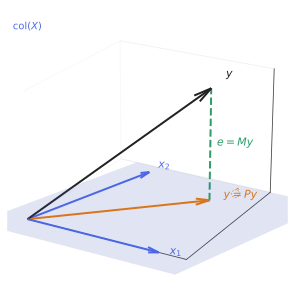
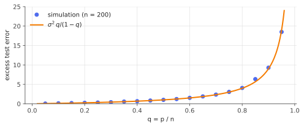

# OLS & Gauss–Markov: the geometric view

!!! tldr "TL;DR"
    Ordinary least squares is an **orthogonal projection** of $y$ onto the column space of $X$. From that one picture you can read off
    almost everything: the normal equations, the $n-p$ degrees of freedom of the residuals, the Frisch–Waugh–Lovell "partialling-out" theorem,
    leverage and leave-one-out shortcuts. Gauss–Markov adds the optimality statement: under uncorrelated, equal-variance noise, OLS has the
    smallest covariance among all **linear unbiased** estimators. Both qualifiers matter, and dropping them is the starting point of shrinkage.

## Why care?

Linear regression is the hydrogen atom of statistics and ML. You'll meet it as:

- the **linear probe** used to ask what a neural network's hidden layer "knows";
- the **readout layer** of random-feature models, reservoir computers, and the last layer of any network trained with squared loss;
- the **factor regression** behind every beta in quant finance (CAPM, Fama–French, risk-model exposures);
- the inner step of **double/debiased machine learning**, which is the Frisch–Waugh–Lovell theorem applied with ML models.

Almost every later note in the regression track, including ridge, LASSO, and high-dimensional asymptotics, modifies OLS in one specific way.
To see what each modification buys, you need to know exactly what OLS does and what it guarantees.

## Building blocks

**The model.** Observations $y\in\R^n$, design matrix $X\in\R^{n\times p}$ with full column rank $p\le n$, and

$$
y = X\beta + \varepsilon,\qquad \E[\varepsilon] = 0,\qquad \Cov(\varepsilon) = \sigma^2 I_n .
$$

**Least squares.** $\hat\beta = \arg\min_b\|y - Xb\|^2$. Setting the gradient $-2X^\top(y - Xb)$ to zero gives the **normal equations**

$$
X^\top(y - X\hat\beta) = 0 \quad\Longrightarrow\quad \hat\beta = (X^\top X)^{-1}X^\top y .
$$

Read geometrically, the normal equations say: **the residual is orthogonal to every column of $X$.**

**The hat matrix.** The fitted values are $\hat y = X\hat\beta = Py$ with

$$
P = X(X^\top X)^{-1}X^\top,\qquad M = I - P .
$$

$P$ is symmetric and idempotent ($P^2 = P$), so it is the orthogonal projector onto $\operatorname{col}(X)$, and $M$ projects onto the orthogonal
complement. Its eigenvalues are $p$ ones and $n-p$ zeros, so $\tr P = p$ and $\tr M = n-p$.

{ .fig }

The decomposition $y = Py + My$ is orthogonal, so Pythagoras gives $\|y\|^2 = \|\hat y\|^2 + \|e\|^2$. With an intercept in the model, the same
holds after centring, and $R^2 = \|\hat y - \bar y\mathbf 1\|^2/\|y - \bar y\mathbf 1\|^2$ is the squared cosine of the angle between the centred
$y$ and the model space.

## The main results

### Sampling properties from geometry

Substituting $y = X\beta + \varepsilon$:

$$
\hat\beta - \beta = (X^\top X)^{-1}X^\top\varepsilon,\qquad e = My = M\varepsilon \quad(\text{since } MX = 0).
$$

So $\E\hat\beta = \beta$ and $\Cov(\hat\beta) = \sigma^2(X^\top X)^{-1}$. For the residuals,

$$
\E\|e\|^2 = \E[\varepsilon^\top M\varepsilon] = \sigma^2\tr M = \sigma^2(n-p),
$$

which is why $s^2 = \|e\|^2/(n-p)$ is the unbiased variance estimate. The $p$ "lost" degrees of freedom are the dimensions of the subspace that
OLS projects onto. If in addition $\varepsilon\sim N(0,\sigma^2I)$, then $P\varepsilon$ and $M\varepsilon$ are projections of a spherical Gaussian onto
orthogonal subspaces, hence **independent**, with $\|M\varepsilon\|^2/\sigma^2\sim\chi^2_{n-p}$. That independence is the entire basis of $t$- and $F$-tests.

### Gauss–Markov

!!! theorem "Theorem (Gauss–Markov)"
    Under $\E\varepsilon = 0$ and $\Cov(\varepsilon) = \sigma^2I$, for every estimator $\tilde\beta = Cy$ that is linear in $y$ and unbiased
    ($\E\tilde\beta = \beta$ for all $\beta$),

    $$
    \Cov(\tilde\beta) - \Cov(\hat\beta) \succeq 0 .
    $$

    OLS is the **Best Linear Unbiased Estimator** (BLUE). In particular, $\operatorname{Var}(a^\top\tilde\beta)\ge\operatorname{Var}(a^\top\hat\beta)$ for every $a$.

**Proof.** Write $C = (X^\top X)^{-1}X^\top + D$. Unbiasedness for all $\beta$ means $CX = I$, i.e. $DX = 0$. Then

$$
\Cov(\tilde\beta) = \sigma^2CC^\top = \sigma^2\big[(X^\top X)^{-1} + (X^\top X)^{-1}X^\top D^\top + DX(X^\top X)^{-1} + DD^\top\big] = \sigma^2(X^\top X)^{-1} + \sigma^2DD^\top,
$$

and $DD^\top\succeq0$. $\square$

Geometrically, any linear unbiased estimator equals OLS plus "noise" $D\varepsilon$ that is uncorrelated with it. Adding uncorrelated noise can only increase variance.

!!! warning "What Gauss–Markov does *not* say"
    It compares OLS only with **linear** and **unbiased** estimators. A biased estimator can have much smaller mean squared error. Exercise 5 shows that
    ridge regression with a small enough penalty *always* beats OLS in MSE, and the [James–Stein](james-stein.md) note shows that even for the simplest
    Gaussian mean problem, unbiasedness is a costly restriction in dimension $\ge 3$. Without equal variances (heteroskedasticity) OLS is no longer
    best, and its textbook standard errors are wrong (see [sandwich standard errors](delta-sandwich.md)).

### Frisch–Waugh–Lovell: regression as partialling out

Split $X = [X_1\; X_2]$ and let $M_1$ be the projector onto the orthogonal complement of $\operatorname{col}(X_1)$.

!!! theorem "Theorem (Frisch–Waugh–Lovell)"
    The OLS coefficient on $X_2$ in the regression of $y$ on $[X_1\;X_2]$ equals the coefficient in the regression of $M_1y$ on $M_1X_2$:

    $$
    \hat\beta_2 = (X_2^\top M_1X_2)^{-1}X_2^\top M_1y .
    $$

**Proof.** Write $y = X_1\hat\beta_1 + X_2\hat\beta_2 + e$ with $e\perp\operatorname{col}(X)$. Apply $M_1$: it kills $X_1\hat\beta_1$ and leaves $e$ unchanged
(since $e\perp\operatorname{col}(X_1)$). So $M_1y = M_1X_2\hat\beta_2 + e$, and $e\perp M_1X_2$ because $M_1X_2\in\operatorname{col}(X)$. These are
exactly the normal equations for regressing $M_1y$ on $M_1X_2$. $\square$

"Controlling for $X_1$" means: remove from both $y$ and $X_2$ whatever $X_1$ can linearly explain, then regress what's left on what's left. This
is the template of [double/debiased ML](double-ml.md), where the two residualizations are done with flexible ML models.

### Leverage

The diagonal $h_{ii} = P_{ii}\in[0,1]$ is the **leverage** of observation $i$: how much $\hat y_i$ depends on $y_i$ itself. It sums to $p$, so the
average leverage is $p/n$. Two useful facts:

- $\operatorname{Var}(e_i) = \sigma^2(1 - h_{ii})$: high-leverage points have small residuals, because the fit is pulled towards them.
- **Leave-one-out for free.** The prediction error at $i$ of the model fitted without observation $i$ is $e_i/(1-h_{ii})$ (Exercise 4). This gives
  exact LOO cross-validation from a single fit, and it is reused by [jackknife+](jackknife-plus.md).

### What happens when $p$ is not small

For a new point $x$, the prediction error variance is $\sigma^2(1 + x^\top(X^\top X)^{-1}x)$. With i.i.d. Gaussian rows $x_i\sim N(0,I_p)$, the
expected excess term is exactly

$$
\sigma^2\,\E\big[x^\top(X^\top X)^{-1}x\big] = \sigma^2\,\frac{p}{n-p-1}\;\approx\;\sigma^2\frac{q}{1-q},\qquad q = p/n.
$$

This is the same inverse-Wishart moment that inflated [Markowitz](markowitz-estimation-error.md) risk by $1/(1-q)$. OLS's variance explodes as
$p\to n$: unbiasedness is affordable only when there's lots of data per parameter.

{ .fig }

## Examples

### FWL and the LOO shortcut, numerically

```python
import numpy as np
rng = np.random.default_rng(0)
n = 500
z = rng.standard_normal(n)                        # a confounder
x = 0.8 * z + rng.standard_normal(n)              # treatment correlated with z
y = 2.0 * x - 1.5 * z + rng.standard_normal(n)

ones = np.ones(n)
X = np.column_stack([ones, z, x])
beta = np.linalg.lstsq(X, y, rcond=None)[0]

# Frisch–Waugh–Lovell: residualize x and y on (1, z), then regress residual on residual.
Z = np.column_stack([ones, z])
M = lambda v: v - Z @ np.linalg.lstsq(Z, v, rcond=None)[0]
fwl = (M(x) @ M(y)) / (M(x) @ M(x))
print(f"full regression coef on x: {beta[2]:.6f}   FWL: {fwl:.6f}")

# Leverage and the leave-one-out shortcut.
H = X @ np.linalg.solve(X.T @ X, X.T)
h = np.diag(H)
e = y - H @ y
i = 7
mask = np.arange(n) != i
b_loo = np.linalg.lstsq(X[mask], y[mask], rcond=None)[0]
print(f"trace(H) = {h.sum():.6f}   LOO residual: direct {y[i] - X[i] @ b_loo:.6f}  shortcut {e[i] / (1 - h[i]):.6f}")
# full regression coef on x: 1.973100   FWL: 1.973100
# trace(H) = 3.000000   LOO residual: direct 0.136339  shortcut 0.136339
```

If you omitted $z$ and regressed $y$ on $x$ alone, you'd get a badly biased coefficient (omitted-variable bias, Exercise 3). FWL shows that
including $z$ is equivalent to removing its influence from both sides.

### A worked toy: simple regression

With $X = [\mathbf 1\;x]$, FWL with $X_1 = \mathbf 1$ says the slope is the regression of centred $y$ on centred $x$:

$$
\hat\beta_1 = \frac{\sum_i(x_i - \bar x)(y_i - \bar y)}{\sum_i(x_i - \bar x)^2} = \frac{\widehat{\Cov}(x,y)}{\widehat{\Var}(x)} .
$$

That is a CAPM beta: the covariance of the asset with the market divided by the market variance.

## Exercises

!!! question "Exercise 1 · warm-up"
    Show that $P = X(X^\top X)^{-1}X^\top$ is symmetric and idempotent, that $\tr P = p$, and that $PX = X$, $MX = 0$.

    ??? success "Solution"
        Symmetry is immediate from $(X^\top X)^{-1}$ being symmetric. $P^2 = X(X^\top X)^{-1}X^\top X(X^\top X)^{-1}X^\top = P$.
        $\tr P = \tr\big((X^\top X)^{-1}X^\top X\big) = \tr I_p = p$ by cyclicity. $PX = X(X^\top X)^{-1}X^\top X = X$, so $MX = X - X = 0$.

!!! question "Exercise 2 · $R^2$ never decreases"
    Show that adding a column to $X$ can never decrease $R^2$ (with an intercept included). Why does this make $R^2$ a poor model-selection criterion?

    ??? success "Solution"
        Adding a column enlarges $\operatorname{col}(X)$. The projection onto a bigger subspace is at least as close to $y$, so $\|e\|^2$ can only
        go down, and $R^2 = 1 - \|e\|^2/\|y - \bar y\mathbf 1\|^2$ can only go up. Even a column of pure noise increases $R^2$ by about $1/n$ in
        expectation. So $R^2$ rewards complexity regardless of out-of-sample value, which is why we use adjusted $R^2$, information criteria, or
        cross-validation.

!!! question "Exercise 3 · omitted-variable bias"
    Suppose the truth is $y = x\beta + z\gamma + \varepsilon$ (scalars per observation, everything centred), but you regress $y$ on $x$ alone.
    Show that $\E[\hat\beta_{\text{short}}\mid x,z] = \beta + \gamma\,\frac{x^\top z}{x^\top x}$. In the code example above, what value would you
    expect for the short-regression coefficient?

    ??? success "Solution"
        $\hat\beta_{\text{short}} = \frac{x^\top y}{x^\top x} = \beta + \gamma\frac{x^\top z}{x^\top x} + \frac{x^\top\varepsilon}{x^\top x}$, and the last term has
        conditional mean zero. In the example, $x = 0.8z + u$ with $\Var z = \Var u = 1$, so $\Cov(x,z) = 0.8$ and $\Var x = 1.64$. With $\gamma = -1.5$, the bias
        is $-1.5\cdot 0.8/1.64\approx -0.73$, so $\hat\beta_{\text{short}}\approx 2 - 0.73 = 1.27$ instead of $2$.

!!! question "Exercise 4 · leave-one-out residuals"
    Let $\hat\beta_{(i)}$ be the OLS fit without row $i$. Using the Sherman–Morrison formula
    $(A - uu^\top)^{-1} = A^{-1} + \frac{A^{-1}uu^\top A^{-1}}{1 - u^\top A^{-1}u}$, show $y_i - x_i^\top\hat\beta_{(i)} = \frac{e_i}{1 - h_{ii}}$.

    ??? success "Solution"
        Let $A = X^\top X$, so $h_{ii} = x_i^\top A^{-1}x_i$. Then $\hat\beta_{(i)} = (A - x_ix_i^\top)^{-1}(X^\top y - x_iy_i)$. With Sherman–Morrison:

        $$
        x_i^\top(A - x_ix_i^\top)^{-1} = x_i^\top A^{-1} + \frac{h_{ii}\,x_i^\top A^{-1}}{1 - h_{ii}} = \frac{x_i^\top A^{-1}}{1 - h_{ii}} .
        $$

        So $x_i^\top\hat\beta_{(i)} = \frac{x_i^\top\hat\beta - h_{ii}y_i}{1 - h_{ii}}$, and

        $$
        y_i - x_i^\top\hat\beta_{(i)} = \frac{(1-h_{ii})y_i - x_i^\top\hat\beta + h_{ii}y_i}{1-h_{ii}} = \frac{y_i - \hat y_i}{1 - h_{ii}} = \frac{e_i}{1-h_{ii}} .
        $$

!!! question "Exercise 5 · stretch: a little bias always helps"
    Let $\hat\beta_\lambda = (X^\top X + \lambda I)^{-1}X^\top y$ (ridge) and $\operatorname{MSE}(\lambda) = \E\|\hat\beta_\lambda - \beta\|^2$. Using the
    eigendecomposition $X^\top X = \sum_j d_jv_jv_j^\top$ and $\theta_j = v_j^\top\beta$, show

    $$
    \operatorname{MSE}(\lambda) = \sum_j\frac{\sigma^2d_j + \lambda^2\theta_j^2}{(d_j + \lambda)^2},
    $$

    and that $\operatorname{MSE}'(0) < 0$. Conclude that some $\lambda > 0$ beats OLS, for every $\beta$ (Hoerl & Kennard, 1970).

    ??? success "Solution"
        In the eigenbasis, $v_j^\top\hat\beta_\lambda = \frac{d_j}{d_j+\lambda}\big(\theta_j + \frac{v_j^\top X^\top\varepsilon}{d_j}\big)$, and $v_j^\top X^\top\varepsilon$
        has variance $\sigma^2d_j$. The bias is $-\frac{\lambda}{d_j+\lambda}\theta_j$ and the variance is $\frac{\sigma^2d_j}{(d_j+\lambda)^2}$. Summing bias² + variance gives the formula.

        Differentiating: $\frac{d}{d\lambda}\frac{\sigma^2d_j + \lambda^2\theta_j^2}{(d_j+\lambda)^2} = \frac{2\lambda\theta_j^2(d_j+\lambda) - 2(\sigma^2d_j + \lambda^2\theta_j^2)}{(d_j+\lambda)^3}$.
        At $\lambda = 0$ this is $-2\sigma^2/d_j^2$. So $\operatorname{MSE}'(0) = -2\sigma^2\sum_j d_j^{-2} < 0$. The MSE decreases as soon as we leave $\lambda = 0$,
        whatever the true $\beta$. Gauss–Markov is not violated, because ridge is biased. This is the bias–variance trade-off that motivates the [ridge](ridge.md) note.

## Where it shows up

- **Linear probes in interpretability.** Regressing a property (say, a token's part of speech or a board-game state) on hidden activations
  is OLS or logistic regression. The high-dimensional variance blow-up above is why probes on 4096-dimensional activations need regularization
  and held-out evaluation.
- **Factor models in quant.** Asset betas, style exposures and Fama–MacBeth regressions are OLS. FWL explains what "controlling for the market"
  means in an alpha regression.
- **Causal ML.** Double/debiased ML (Chernozhukov et al.) is FWL with the linear projections replaced by ML predictions, plus cross-fitting.
- **Data attribution.** Leverage and LOO residuals are the exact linear-model ancestors of the influence functions used to attribute model
  predictions to training examples (e.g. TRAK-style methods for large networks).
- **Last-layer methods.** Random-feature models, extreme learning machines and "linear evaluation" of self-supervised representations all fit an
  OLS (or ridge) readout on top of fixed features.

## Further reading

- T. Hastie, R. Tibshirani & J. Friedman, *The Elements of Statistical Learning*, §3.2.
- R. Davidson & J. MacKinnon, *Econometric Theory and Methods*, Ch. 2. The geometric treatment of OLS and FWL.
- A. E. Hoerl & R. W. Kennard, "Ridge regression: biased estimation for nonorthogonal problems" (*Technometrics*, 1970).
