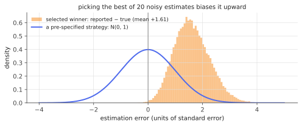

# Post-selection inference

!!! tldr "TL;DR"
    If you use the data to choose *what* to test (the best strategy, the variables the LASSO selected, the most significant effect) and then test it on the **same** data with textbook formulas, the results are biased: estimates are inflated (the winner's curse) and confidence intervals undercover, often badly. There are three main fixes.
    **Data splitting** selects on one half and infers on the other: simple, valid, and it costs half the data. **Selective inference** conditions on the selection event. For Gaussian data and polyhedral selection rules (including the LASSO), the conditional law of a contrast is a **truncated normal**, which gives exact selective $p$-values and intervals. **Simultaneous inference** (PoSI) protects against every possible selection at once, at the price of wider intervals.

## Why care?

This is one of the most common errors in applied statistics and ML:

- a quant backtests 20 strategies, picks the best, and reports its Sharpe ratio and $t$-statistic;
- an ML team tries many prompts or checkpoints, picks the one with the best validation score, and reports that score as its expected performance;
- an analyst fits a LASSO, then runs OLS on the selected variables and reports the usual $p$-values;
- a study reports the strongest of many subgroup effects.

In each case the reported number was chosen *because* it looked good, so part of its apparent size is luck. In the simulation below, the "winner" overstates its true performance by 1.6 standard errors on average, and nominal 90% intervals cover only 55% of the time. [Multiple testing](multiple-testing-fdr.md) controls how many discoveries are false. Post-selection inference asks how to make valid **statements about the selected effects** themselves.

## Building blocks

**The problem in one line.** Let $\hat M = \hat M(y)$ be a data-dependent choice (a model, a variable, a winner) and $\theta_{\hat M}$ the quantity we then want to estimate. Classical intervals satisfy $\P(\theta_M\in CI_M) = 1-\alpha$ for each **fixed** $M$, but $\P(\theta_{\hat M}\in CI_{\hat M})$ can be far below $1-\alpha$, because $y$ was used twice.

**Selective coverage.** The natural target is coverage **conditional on the selection**:

$$
\P\big(\theta_M\in CI_M\ \big|\ \hat M = M\big)\ge1-\alpha\quad\text{for every }M .
$$

Averaging over selections then gives coverage of the selected parameter too, and the guarantee holds for whatever model you ended up studying.

**Data splitting.** Split the sample into two independent parts, choose $\hat M$ using the first, and do classical inference on the second. Conditional on the first part, the second is fresh data, so selective coverage holds exactly. The costs: less data for both selection and inference, and results that depend on the random split.

## The main result

The key observation for selective inference is that many selection procedures carve out a **polyhedron** in data space. Selecting "the largest coordinate" is $\{y : y_{j^*}\ge y_k\ \forall k\}$. The LASSO selecting a particular active set with particular signs is also a set of linear inequalities in $y$ (from its [KKT conditions](convexity-kkt.md)).

!!! theorem "Theorem (polyhedral lemma; Lee, Sun, Sun & Taylor, 2016)"
    Let $y\sim N(\mu,\Sigma)$, let the selection event be $\{Ay\le b\}$, and let $\eta$ be a fixed contrast (e.g. picking out one coordinate or regression coefficient). With $c = \Sigma\eta/(\eta^\top\Sigma\eta)$ and $z = (I - c\eta^\top)y$ (the part of $y$ independent of $\eta^\top y$),

    $$
    \{Ay\le b\} = \big\{\mathcal V^-(z)\le\eta^\top y\le\mathcal V^+(z),\ \mathcal V^0(z)\ge0\big\}
    $$

    for explicit functions $\mathcal V^\pm,\mathcal V^0$ of $z$. Consequently,

    $$
    \eta^\top y\ \big|\ \{Ay\le b,\ z\}\ \sim\ \mathrm{TN}\big(\eta^\top\mu,\ \eta^\top\Sigma\eta;\ [\mathcal V^-, \mathcal V^+]\big),
    $$

    a normal distribution truncated to an interval. The truncated-normal CDF evaluated at the observed $\eta^\top y$ is therefore exactly $\mathrm{Unif}(0,1)$ under the true $\eta^\top\mu$, and inverting it in $\eta^\top\mu$ gives an interval with exact selective coverage.

**Proof idea.** Decompose $y = c\,(\eta^\top y) + z$, where $z$ is independent of $\eta^\top y$ (both are jointly Gaussian and uncorrelated by construction). For fixed $z$, each constraint $(Ay)_i\le b_i$ becomes a linear inequality in the scalar $\eta^\top y$: an upper bound if $(Ac)_i > 0$, a lower bound if $(Ac)_i < 0$, and a condition on $z$ alone if $(Ac)_i = 0$. The tightest bounds are $\mathcal V^+$ and $\mathcal V^-$. Conditioning a Gaussian on lying in an interval, independent of $z$, gives a truncated Gaussian. $\square$

**Example: the winner.** If $y_j\sim N(\mu_j, 1)$ independently and we select $j^* = \arg\max_jy_j$, then for $\eta = e_{j^*}$, conditioning on the other coordinates, the selection event is $y_{j^*}\ge\max_{k\neq j^*}y_k$. So $y_{j^*}$ is $N(\mu_{j^*},1)$ **truncated to $[\max_{k\neq j^*}y_k,\infty)$**, which is what the code below inverts.

### Comparing the approaches

- **Data splitting**: simple and valid for any selection rule, even humans eyeballing plots. It loses power from using half the data for each task. *Data carving* and *randomized* versions (adding noise to the selection step) recover much of it.
- **Selective (conditional) inference**: uses all the data, is exact under Gaussianity, and is implemented for the LASSO, forward stepwise, marginal screening and others. When the selection was a close call, the truncation is severe and intervals can be very long, which is an honest reflection of how little information is left after conditioning.
- **PoSI** (Berk, Brown, Buja, Zhang & Zhao, 2013): intervals valid simultaneously over all models one might select, by widening the critical value from $1.96$ to a constant that grows like $\sqrt{p}$. It is valid for arbitrary (even adversarial) selection, and conservative.

{ .fig }

## Examples

### Reporting the best of 20 strategies

```python
import numpy as np
from scipy import stats, optimize
rng = np.random.default_rng(0)

def trunc_cdf(x, mu, a):
    """CDF at x of N(mu, 1) truncated to [a, inf), computed stably in log space."""
    num = stats.norm.logsf(x - mu); den = stats.norm.logsf(a - mu)
    return 1 - np.exp(num - den)

def selective_ci(y, a, alpha=0.1):
    """CI for mu from y ~ N(mu,1) conditioned on y >= a, by inverting the truncated-normal pivot."""
    f = lambda mu, target: trunc_cdf(y, mu, a) - target
    left = y - 20 - 10 / max(y - a, 1e-6)          # if y barely clears a, the interval extends far left
    lo = optimize.brentq(f, left, y + 20, args=(1 - alpha / 2,))
    hi = optimize.brentq(f, left, y + 20, args=(alpha / 2,))
    return lo, hi

# 20 strategies, each with a noisy performance estimate y_j ~ N(mu_j, 1) (think: Sharpe in units of its SE).
m, reps, alpha = 20, 4000, 0.1
mu = np.linspace(-1, 1, m)                       # true values
z = stats.norm.ppf(1 - alpha / 2)
cover = {"naive": [], "data splitting": [], "selective": []}; length = {k: [] for k in cover}
for _ in range(reps):
    y = mu + rng.standard_normal(m)
    j = np.argmax(y)                             # report the winner
    cover["naive"].append(abs(y[j] - mu[j]) <= z); length["naive"].append(2 * z)
    # data splitting: two independent halves of the data, each with variance 2 (half the sample)
    y1 = mu + np.sqrt(2) * rng.standard_normal(m); y2 = mu + np.sqrt(2) * rng.standard_normal(m)
    k = np.argmax(y1)
    cover["data splitting"].append(abs(y2[k] - mu[k]) <= z * np.sqrt(2)); length["data splitting"].append(2 * z * np.sqrt(2))
    # selective: given the other y's, y_j was selected iff y_j >= max of the others -> truncated normal
    lo, hi = selective_ci(y[j], np.max(np.delete(y, j)), alpha)
    cover["selective"].append(lo <= mu[j] <= hi); length["selective"].append(hi - lo)
for k in cover:
    print(f"{k:15s} coverage {np.mean(cover[k]):.3f} (target {1-alpha})   median length {np.median(length[k]):.2f}")
bias = []
for _ in range(4000):
    y = mu + rng.standard_normal(m); j = np.argmax(y); bias.append(y[j] - mu[j])
print(f"winner's curse: mean of (reported - true) for the selected strategy = {np.mean(bias):+.2f} SE units")
# naive           coverage 0.550 (target 0.9)   median length 3.29
# data splitting  coverage 0.904 (target 0.9)   median length 4.65
# selective       coverage 0.896 (target 0.9)   median length 9.12
# winner's curse: mean of (reported - true) for the selected strategy = +1.61 SE units
```

The naive interval, the one people actually report, covers the truth only **55%** of the time instead of 90%, because the winner's estimate is inflated by 1.6 standard errors on average. Both corrections restore coverage. Here data splitting gives shorter intervals: with 20 closely spaced candidates, the winner often wins narrowly, and conditioning on "beat the runner-up" leaves little information.
Selective inference shines when selection is clear-cut, and its intervals shrink back to classical ones as the winning margin grows.

## Exercises

!!! question "Exercise 1 · warm-up: how big is the winner's curse?"
    For $m$ i.i.d. $N(0,1)$ estimates of identical true values ($\mu_j = 0$), approximate $\E\max_jy_j$ for $m = 20$ and $m = 1000$. What does this imply for the best of 1000 backtests of worthless strategies?

    ??? success "Solution"
        $\E\max\approx\sqrt{2\log m}$ minus lower-order terms ([sub-Gaussian maxima](subgaussian-subexponential.md)). For $m = 20$, $\sqrt{2\log20} = 2.45$, and the exact value is about $1.87$. For $m = 1000$, $\sqrt{2\log1000} = 3.72$ (exact about $3.24$). The best of 1000 worthless strategies typically shows a $t$-statistic above 3: "significant" at any conventional level, and pure noise.

!!! question "Exercise 2 · one-dimensional selection"
    You report an effect only if its estimate exceeds a threshold, $y > c$, with $y\sim N(\mu, 1)$. Write the selective density of $y$ given selection, and show that the conditional MLE of $\mu$ is smaller than $y$. What happens to the selective interval when $y$ is just above $c$?

    ??? success "Solution"
        Conditional density $\frac{\varphi(y - \mu)}{1 - \Phi(c - \mu)}$ on $(c,\infty)$. The log-likelihood in $\mu$ is $-\frac12(y-\mu)^2 - \log(1 - \Phi(c - \mu))$, with derivative $(y - \mu) - \frac{\varphi(c-\mu)}{1-\Phi(c-\mu)}$. At $\mu = y$ the derivative is negative, so the maximizer lies below $y$: the conditional estimate shrinks the observation to undo the selection bias.

        When $y\downarrow c$, an observation barely past the threshold is consistent with very negative $\mu$ (which would make *any* selected $y$ sit near $c$), so the lower end of the selective interval runs off toward $-\infty$. There is very little evidence in a barely-selected effect.

!!! question "Exercise 3 · data splitting validity"
    Prove that classical inference on the second half is valid conditional on any selection made from the first half, and quantify the cost in interval width for a mean estimated from $n/2$ instead of $n$ observations.

    ??? success "Solution"
        The halves are independent, so conditioning on the first half (and hence on $\hat M$) leaves the second half's distribution unchanged. Any procedure valid for a fixed model is valid for $\hat M$, given the first half. Width scales like $1/\sqrt{\text{sample size}}$, so using $n/2$ multiplies it by $\sqrt2\approx1.41$ (the $4.65$ vs $3.29$ in the simulation). Selection also gets noisier, so the chosen model may be worse.

!!! question "Exercise 4 · reporting a validation score"
    You evaluate 50 checkpoints on a validation set of 2000 examples and report the best accuracy, 81.3%. Accuracies are around 80% with standard error $\approx\sqrt{0.8\cdot0.2/2000}\approx0.9$ points. Roughly how much optimism might be in that number, and what is the clean fix?

    ??? success "Solution"
        If many checkpoints have similar true accuracy, the maximum of 50 noisy estimates exceeds the truth by about $\E\max$ of 50 standard normals $\approx2.25$ SE (somewhat less, since the estimates are positively correlated on the same validation set). That is roughly $1.5$–$2$ points. The reported 81.3% could reflect true performance around 79.5%.
        Fix: select on the validation set and report on an untouched **test set** (data splitting), or correct with selective-inference ideas. Repeatedly "peeking" at the test set reintroduces the same bias, the adaptive-data-analysis problem behind holdout reuse guidelines.

!!! question "Exercise 5 · stretch: the truncation limits"
    In the polyhedral lemma, show that $\mathcal V^- = \max_{i:(Ac)_i<0}\frac{b_i - (Az)_i}{(Ac)_i}$ and $\mathcal V^+ = \min_{i:(Ac)_i>0}\frac{b_i - (Az)_i}{(Ac)_i}$.

    ??? success "Solution"
        With $y = c(\eta^\top y) + z$, the $i$-th constraint reads $(Az)_i + (Ac)_i\,\eta^\top y\le b_i$. If $(Ac)_i > 0$, dividing gives $\eta^\top y\le\frac{b_i - (Az)_i}{(Ac)_i}$, an upper bound. If $(Ac)_i < 0$, dividing flips the inequality, giving a lower bound $\eta^\top y\ge\frac{b_i - (Az)_i}{(Ac)_i}$. If $(Ac)_i = 0$, the constraint involves only $z$ ($\mathcal V^0$). Taking the tightest bounds over $i$ gives the formulas. The event is an interval in $\eta^\top y$ for each fixed $z$, which is what makes the conditional law a truncated normal.

## Where it shows up

- **LASSO inference.** The `selectiveInference` R package computes exact selective $p$-values and intervals for LASSO-selected coefficients via the polyhedral lemma. The alternative strategy is [debiasing](debiased-lasso.md), which targets all coefficients rather than only the selected ones.
- **Quant research.** Reporting the best of many backtests calls for out-of-sample validation (splitting by time), deflated Sharpe ratios, or selection-adjusted inference. The winner's curse explains much of the decay in live performance relative to backtests.
- **ML evaluation.** Hyperparameter search, checkpoint selection, prompt tuning and benchmark "SOTA chasing" all select on noisy scores. Clean held-out test sets, reusable-holdout schemes from adaptive data analysis, and selection-aware reporting are the cures.
- **Genomics and medicine.** Effect sizes of top GWAS hits are inflated (the winner's curse) and need correction before use in risk scores. Subgroup analyses in trials face the same issue.
- **A/B testing.** Shipping the best of several variants and reporting its observed lift overstates the true lift. Empirical-Bayes shrinkage ([James–Stein](james-stein.md)) and selective intervals give honest numbers.

## Further reading

- J. Lee, D. Sun, Y. Sun & J. Taylor, "Exact post-selection inference, with application to the lasso" (*Ann. Stat.*, 2016).
- J. Taylor & R. Tibshirani, "Statistical learning and selective inference" (*PNAS*, 2015). A short overview.
- R. Berk, L. Brown, A. Buja, K. Zhang & L. Zhao, "Valid post-selection inference" (*Ann. Stat.*, 2013).
- W. Fithian, D. Sun & J. Taylor, "Optimal inference after model selection" (2014). Data carving.
