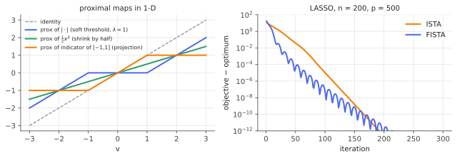

# Proximal operators, ISTA & FISTA

!!! tldr "TL;DR"
    The **proximal operator** $\operatorname{prox}_{\lambda g}(v) = \arg\min_x\,g(x) + \frac{1}{2\lambda}\|x - v\|^2$ generalizes projection: it moves $v$ toward lower values of $g$ without going far. For many nonsmooth $g$ it has a closed form. The $\ell_1$ norm gives soft-thresholding, a constraint set gives Euclidean projection, the nuclear norm gives singular-value thresholding.
    To minimize $f + g$ with $f$ smooth, alternate a gradient step on $f$ with a prox step on $g$. That is **ISTA**, with an $O(1/k)$ error rate. Adding Nesterov momentum gives **FISTA**, with the optimal $O(1/k^2)$ rate. These few lines solve the LASSO, sparse and low-rank problems, and constrained problems at scale.

## Why care?

The [convexity note](convexity-kkt.md) told us *what* the solutions of nonsmooth problems look like (subgradients, KKT). We also need to *compute* them for $p$ in the thousands or millions, where interior-point methods are too slow and plain (sub)gradient descent converges painfully, at $O(1/\sqrt k)$ for nonsmooth objectives.

Most objectives in this curriculum are of the form **smooth loss + simple nonsmooth regularizer**: [LASSO](lasso.md) ($\frac12\|y - X\beta\|^2 + \lambda\|\beta\|_1$), [elastic net](elastic-net.md), group LASSO, matrix completion with a nuclear-norm penalty, constrained portfolios. Proximal methods handle the smooth part with gradients and the nonsmooth part exactly through its prox. They converge as fast as gradient descent does on smooth problems, and each step costs about one matrix–vector product.

The same idea shows up in deep learning too: decoupled weight decay (AdamW) is a prox step, proximal SGD trains sparse networks, and "plug-and-play" methods use a learned denoiser in place of a prox.

## Building blocks

**Definition.** For a closed convex function $g$ and $\lambda > 0$,

$$
\operatorname{prox}_{\lambda g}(v) = \arg\min_x\Big\{g(x) + \frac{1}{2\lambda}\|x - v\|^2\Big\}.
$$

The objective is strongly convex, so the minimizer exists and is unique. By the [optimality condition](convexity-kkt.md), $x = \operatorname{prox}_{\lambda g}(v)\iff\frac{v - x}{\lambda}\in\partial g(x)$, i.e. $x = (I + \lambda\partial g)^{-1}(v)$ (the "resolvent" of $\partial g$).

**A small zoo.**

| $g(x)$ | $\operatorname{prox}_{\lambda g}(v)$ |
|---|---|
| $\lVert x\rVert_1$ | soft-thresholding: $\operatorname{sign}(v_i)(\lvert v_i\rvert - \lambda)_+$ |
| $\frac12\lVert x\rVert^2$ | $v/(1+\lambda)$ (ridge-like shrinkage) |
| indicator of a convex set $C$ | Euclidean projection $\Pi_C(v)$ |
| $\lVert x\rVert_2$ (group norm) | block soft-thresholding: $\big(1 - \frac{\lambda}{\lVert v\rVert}\big)_+v$ |
| nuclear norm $\lVert X\rVert_*$ | singular-value thresholding: $U\operatorname{diag}((\sigma_i - \lambda)_+)V^\top$ |
| $\lVert x\rVert_1 + \frac\alpha2\lVert x\rVert^2$ (elastic net) | $\frac{1}{1+\lambda\alpha}\operatorname{soft}(v,\lambda)$ |

**Key property: firm nonexpansiveness.** $\|\operatorname{prox}(u) - \operatorname{prox}(v)\|^2\le\langle\operatorname{prox}(u) - \operatorname{prox}(v), u - v\rangle$. In particular, prox maps are 1-Lipschitz, so they never amplify errors. This is what makes proximal iterations stable.

**Moreau envelope.** $M_{\lambda g}(v) = \min_x g(x) + \frac{1}{2\lambda}\|x - v\|^2$ is a smooth (differentiable, $\frac1\lambda$-smooth) approximation of $g$ with $\nabla M_{\lambda g}(v) = \frac{v - \operatorname{prox}_{\lambda g}(v)}{\lambda}$. The Huber loss is the Moreau envelope of $k|\cdot|$ ([robust regression](robust-m-estimators.md), Exercise 5).

## The main results

### Proximal gradient (ISTA)

To minimize $F(x) = f(x) + g(x)$ with $f$ convex and $L$-smooth ($\nabla f$ is $L$-Lipschitz) and $g$ convex with an easy prox, iterate

$$
x_{k+1} = \operatorname{prox}_{g/L}\Big(x_k - \frac1L\nabla f(x_k)\Big).
$$

There are two ways to read it: a gradient step on $f$ followed by a prox step on $g$, or exact minimization of the **quadratic upper bound** $f(x_k) + \nabla f(x_k)^\top(x - x_k) + \frac L2\|x - x_k\|^2 + g(x)$ (majorize–minimize). For the LASSO, the prox step is soft-thresholding, which gives the **iterative shrinkage-thresholding algorithm** (ISTA). If $g = 0$ it is gradient descent, and if $g$ is an indicator it is projected gradient descent.

!!! theorem "Theorem (convergence of ISTA and FISTA; Beck & Teboulle, 2009)"
    With step $1/L$, ISTA satisfies

    $$
    F(x_k) - F^*\le\frac{L\,\|x_0 - x^*\|^2}{2k}.
    $$

    **FISTA** adds momentum: $x_{k+1} = \operatorname{prox}_{g/L}\big(z_k - \frac1L\nabla f(z_k)\big)$, $t_{k+1} = \frac{1+\sqrt{1+4t_k^2}}{2}$, $z_{k+1} = x_{k+1} + \frac{t_k - 1}{t_{k+1}}(x_{k+1} - x_k)$, with $t_1 = 1$. It satisfies

    $$
    F(x_k) - F^*\le\frac{2L\,\|x_0 - x^*\|^2}{(k+1)^2},
    $$

    which is optimal among first-order methods for this problem class (Nemirovski–Yudin, Nesterov). If $F$ is $\mu$-strongly convex, ISTA converges linearly at rate $1 - \mu/L$, and FISTA with restarts at rate about $1 - \sqrt{\mu/L}$.

**Proof sketch for ISTA.** The descent lemma ($f(y)\le f(x) + \nabla f(x)^\top(y - x) + \frac L2\|y-x\|^2$) and the prox optimality condition give the key inequality, for any $u$:

$$
F(x_{k+1})\le F(u) + \frac L2\big(\|x_k - u\|^2 - \|x_{k+1} - u\|^2\big).
$$

With $u = x_k$ the iterates are monotone, $F(x_{k+1})\le F(x_k)$. With $u = x^*$ and summing over $k$, the right side telescopes: $\sum_{j=1}^k(F(x_j) - F^*)\le\frac L2\|x_0 - x^*\|^2$. Monotonicity then gives $k(F(x_k) - F^*)\le\frac L2\|x_0 - x^*\|^2$. $\square$ (FISTA's proof builds an "estimate sequence" with the $t_k$ weights. It is shorter than its reputation suggests, but still a page.)

### Practical notes

- **Unknown $L$:** use backtracking. Start with a guess and double it until the quadratic upper bound holds at the new point.
- **FISTA is not monotone.** It overshoots and ripples (visible in the figure below). **Adaptive restart** (reset the momentum $t_k = 1$ whenever $F$ increases) removes the ripples and recovers linear convergence on strongly convex problems.
- **Coordinate descent** (cycling through coordinates, each updated by its own 1-D prox) is often faster still for the LASSO (glmnet). It is the same prox idea applied one coordinate at a time.
- **ADMM and Douglas–Rachford** handle sums of several nonsmooth terms, or $g(Ax)$, using only individual proxes.

{ .fig }

## Examples

### Solving the LASSO, and certifying the solution

```python
import numpy as np
rng = np.random.default_rng(0)

def soft(v, t):                                    # prox of t*||.||_1
    return np.sign(v) * np.maximum(np.abs(v) - t, 0.0)

# LASSO: min 0.5||y - Xb||^2 + lam ||b||_1  with a sparse truth.
n, p, k = 200, 500, 10
X = rng.standard_normal((n, p)) / np.sqrt(n)
b_true = np.zeros(p); b_true[:k] = rng.choice([-3, 3], k)
y = X @ b_true + 0.1 * rng.standard_normal(n)
lam = 0.3                                          # ≈ σ·sqrt(2 log p): the usual theory-guided scale
L = np.linalg.norm(X, 2) ** 2                      # Lipschitz constant of the smooth part's gradient
F = lambda b: 0.5 * np.sum((y - X @ b) ** 2) + lam * np.sum(np.abs(b))

def ista(iters):
    b = np.zeros(p); hist = []
    for _ in range(iters):
        b = soft(b - X.T @ (X @ b - y) / L, lam / L); hist.append(F(b))
    return b, hist

def fista(iters):
    b = z = np.zeros(p); t = 1.0; hist = []
    for _ in range(iters):
        b_new = soft(z - X.T @ (X @ z - y) / L, lam / L)
        t_new = (1 + np.sqrt(1 + 4 * t * t)) / 2
        z = b_new + (t - 1) / t_new * (b_new - b)     # Nesterov momentum
        b, t = b_new, t_new; hist.append(F(b))
    return b, hist

b_star, _ = fista(20000); F_star = F(b_star)
_, h_ista = ista(500); _, h_fista = fista(500)
for it in [10, 25, 50, 100]:
    print(f"iter {it:3d}:  ISTA gap {h_ista[it-1] - F_star:.2e}   FISTA gap {h_fista[it-1] - F_star:.2e}")
g = X.T @ (y - X @ b_star)                         # KKT: g_j = lam*sign(b_j) on support, |g_j| <= lam off it
supp = np.abs(b_star) > 1e-8
print(f"support size {supp.sum()} (true {k});  max |g_j - lam sign(b_j)| on support {np.max(np.abs(g[supp] - lam*np.sign(b_star[supp]))):.1e};  "
      f"max |g_j| off support {np.max(np.abs(g[~supp])):.4f} <= lam = {lam}")
# iter  10:  ISTA gap 4.41e+00   FISTA gap 1.56e+00
# iter  25:  ISTA gap 9.37e-01   FISTA gap 6.82e-03
# iter  50:  ISTA gap 4.00e-02   FISTA gap 3.70e-05
# iter 100:  ISTA gap 1.06e-05   FISTA gap 6.42e-08
# support size 14 (true 10);  max |g_j - lam sign(b_j)| on support 1.8e-15;  max |g_j| off support 0.2971 <= lam = 0.3
```

FISTA reaches a given accuracy in far fewer iterations early on. Later, both methods speed up to a **linear** rate: once the support is identified, the problem restricted to those 14 coordinates is strongly convex (with $p > n$ the full problem isn't), so ISTA catches up. The last line is a **certificate**. The KKT conditions of the LASSO hold
to machine precision, which proves the computed point is optimal, independently of how it was found.

## Exercises

!!! question "Exercise 1 · warm-up: three proxes"
    Derive $\operatorname{prox}_{\lambda|\cdot|}$, $\operatorname{prox}_{\lambda\iota_{[a,b]}}$ (where $\iota$ is the indicator of the interval: 0 inside, $+\infty$ outside), and $\operatorname{prox}_{\frac{\lambda}{2}\|\cdot\|^2}$.

    ??? success "Solution"
        $|\cdot|$: the condition $\frac{v - x}{\lambda}\in\partial|x|$ gives soft-thresholding $\operatorname{sign}(v)(|v| - \lambda)_+$ ([KKT note](convexity-kkt.md)). Indicator: minimize $\frac1{2\lambda}(x - v)^2$ over $[a,b]$, which gives $\operatorname{clip}(v, a, b)$, the projection, for any $\lambda$. Quadratic: $\frac\lambda2x^2 + \frac12(x - v)^2$ is minimized at $x = v/(1+\lambda)$.

!!! question "Exercise 2 · singular-value thresholding"
    Show that $\operatorname{prox}_{\lambda\|\cdot\|_*}(V) = U\operatorname{diag}((\sigma_i - \lambda)_+)W^\top$ for $V = U\operatorname{diag}(\sigma)W^\top$. (Hint: the nuclear norm and the Frobenius norm are unitarily invariant, so the problem reduces to the singular values.)

    ??? success "Solution"
        By von Neumann's trace inequality, $\|X - V\|_F^2\ge\sum_i(\sigma_i(X) - \sigma_i(V))^2$, with equality when $X$ shares $V$'s singular vectors. Since $\|X\|_*$ depends only on singular values, the minimizer shares them, and the problem reduces to $\min_{s\ge0}\sum_i[\lambda s_i + \frac12(s_i - \sigma_i)^2]$, solved by $s_i = (\sigma_i - \lambda)_+$.
        Proximal gradient with this prox is the SVT algorithm for matrix completion (Cai, Candès & Shen, 2010).

!!! question "Exercise 3 · the Moreau decomposition"
    For a norm $\|\cdot\|$ with dual norm $\|\cdot\|_*$, the conjugate of $g = \|\cdot\|$ is the indicator of the dual-norm unit ball. Use the identity $v = \operatorname{prox}_g(v) + \operatorname{prox}_{g^*}(v)$ to compute $\operatorname{prox}_{\|\cdot\|_1}$ from the projection onto the $\ell_\infty$ ball.

    ??? success "Solution"
        $g = \|\cdot\|_1$ has $g^* = \iota_{\{\|z\|_\infty\le1\}}$, whose prox is the projection $\operatorname{clip}(v, -1, 1)$ coordinatewise. So $\operatorname{prox}_{\|\cdot\|_1}(v) = v - \operatorname{clip}(v,-1,1) = \operatorname{sign}(v)(|v| - 1)_+$, soft-thresholding at level 1 ✓. The identity generalizes orthogonal decomposition onto a subspace and its complement, and it is how many proxes are computed in practice.

!!! question "Exercise 4 · weight decay as a prox step"
    Show that applying $\operatorname{prox}_{\eta\frac\lambda2\|\cdot\|^2}$ after a gradient step gives $w\leftarrow\frac{1}{1+\eta\lambda}(w - \eta\nabla L(w))$, which is approximately "decoupled" weight decay $w\leftarrow(1 - \eta\lambda)w - \eta\nabla L(w)$. Why does this differ from adding $\frac\lambda2\|w\|^2$ to the loss when the gradient step is preconditioned (as in Adam)?

    ??? success "Solution"
        From Exercise 1, the prox of $\frac{\eta\lambda}2\|\cdot\|^2$ divides by $1 + \eta\lambda\approx1 - \eta\lambda$ for small $\eta\lambda$. If instead the penalty is in the loss, its gradient $\lambda w$ goes through the preconditioner ($\lambda w$ divided by $\sqrt{\hat v}$ in Adam), so weights with large gradient variance get *less* decay. Decoupling (AdamW) applies the decay as a separate prox step outside the preconditioner, restoring
        uniform $\ell_2$ shrinkage. That is the proximal-gradient view of Loshchilov & Hutter's fix.

!!! question "Exercise 5 · stretch: the key inequality"
    Prove that one ISTA step $x^+ = \operatorname{prox}_{g/L}(x - \frac1L\nabla f(x))$ satisfies $F(x^+)\le F(u) + \frac L2(\|x - u\|^2 - \|x^+ - u\|^2)$ for every $u$, using (i) the descent lemma, (ii) convexity of $f$, and (iii) the prox optimality condition $L(x - x^+) - \nabla f(x)\in\partial g(x^+)$.

    ??? success "Solution"
        (i) $f(x^+)\le f(x) + \nabla f(x)^\top(x^+ - x) + \frac L2\|x^+ - x\|^2$. (ii) $f(x)\le f(u) - \nabla f(x)^\top(u - x)$. (iii) With $s = L(x - x^+) - \nabla f(x)\in\partial g(x^+)$: $g(x^+)\le g(u) - s^\top(u - x^+)$. Adding the three:

        $$F(x^+)\le F(u) + \nabla f(x)^\top(x^+ - u) + \frac L2\|x^+ - x\|^2 - [L(x - x^+) - \nabla f(x)]^\top(u - x^+).$$

        The gradient terms cancel, leaving $F(u) + \frac L2\|x^+ - x\|^2 + L(x - x^+)^\top(x^+ - u)$. Now expand
        $\|x - u\|^2 = \|(x - x^+) + (x^+ - u)\|^2 = \|x - x^+\|^2 + 2(x - x^+)^\top(x^+ - u) + \|x^+ - u\|^2$, so
        $\frac L2\big(\|x - u\|^2 - \|x^+ - u\|^2\big) = \frac L2\|x - x^+\|^2 + L(x - x^+)^\top(x^+ - u)$, which is exactly the remaining expression. $\square$

## Where it shows up

- **Sparse and structured regression.** LASSO, elastic net, group LASSO, fused LASSO and sparse logistic regression are solved by proximal gradient or coordinate descent (glmnet, scikit-learn). [LARS](lars.md) gives the whole path for the plain LASSO.
- **Low-rank estimation.** Matrix completion for recommender systems (SVT), robust PCA (low-rank plus sparse, with two proxes), and nuclear-norm regularized covariance estimation.
- **Signal and image processing.** Compressed sensing reconstruction (ISTA/FISTA were popularized here), total-variation denoising, and MRI reconstruction. "Plug-and-play" and unrolled networks (LISTA) replace the prox with a learned denoiser, and diffusion-model "posterior sampling" methods borrow the same split structure.
- **Deep learning optimizers.** Decoupled weight decay (AdamW) is a prox step (Exercise 4). Proximal SGD with $\ell_1$ or group penalties trains sparse or pruned networks, and projection steps enforce constraints (norm-bounded weights, simplex-constrained mixture weights).
- **Portfolio optimization.** Projected gradient onto the budget/long-only simplex ([KKT note](convexity-kkt.md)), and ADMM for portfolios with turnover, leverage and sector constraints, scale to large universes.

## Further reading

- N. Parikh & S. Boyd, "Proximal algorithms" (*Found. Trends Optim.*, 2014). Short, clear, free online.
- A. Beck & M. Teboulle, "A fast iterative shrinkage-thresholding algorithm for linear inverse problems" (*SIAM J. Imaging Sci.*, 2009).
- A. Beck, *First-Order Methods in Optimization* (2017).
- B. O'Donoghue & E. Candès, "Adaptive restart for accelerated gradient schemes" (*Found. Comput. Math.*, 2015).
