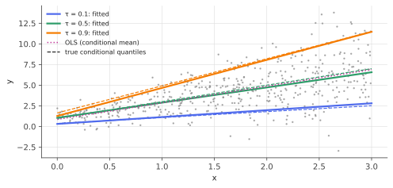

# Quantile regression

!!! tldr "TL;DR"
    Least squares models the conditional **mean**. Quantile regression models conditional **quantiles** $Q_\tau(y\mid x) = x^\top\beta_\tau$ by minimizing the asymmetric **pinball loss** $\rho_\tau(u) = u\,(\tau - \mathbf 1\{u < 0\})$. It is a linear program, it is robust to outliers in $y$, and fitting several $\tau$'s shows how the whole
    conditional distribution changes with $x$ (spread, skew, tails), not just its centre. At the optimum, a fraction $\approx\tau$ of the residuals is negative. That subgradient condition is the elicitation property behind VaR estimation, conformalized quantile regression and distributional RL.

## Why care?

The mean is often the wrong summary:

- **Risk management** cares about tails. Value-at-Risk *is* a quantile of the loss distribution, and its dependence on volatility, market state or leverage is a quantile regression problem (Engle & Manganelli's CAViaR).
- **Forecasting with uncertainty**: energy demand, delivery times, prices and weather are reported as quantile bands (P10/P50/P90). Gradient-boosting libraries and forecasting competitions all ship a "quantile loss".
- **Heteroskedastic effects**: a variable may barely move the median but widen the spread a lot (wages vs education, returns vs volatility regime). OLS hides this.
- **Robustness**: the median is far less sensitive to outliers than the mean, and median regression inherits this.

It also supplies the building blocks for [conformalized quantile regression](conformalized-quantile-regression.md) and for distributional reinforcement learning (QR-DQN).

## Building blocks

**Quantiles as minimizers.** For a random variable $Y$ with CDF $F$ and $\tau\in(0,1)$, consider the **pinball (check) loss**

$$
\rho_\tau(u) = \begin{cases}\tau\,u & u\ge0\\ (\tau - 1)\,u & u < 0\end{cases}
$$

It is convex and piecewise linear, with slope $\tau$ on the right and $\tau - 1$ on the left. Then

$$
\frac{d}{dq}\E\rho_\tau(Y - q) = -\tau\,\P(Y > q) + (1-\tau)\,\P(Y < q) = F(q) - \tau
$$

(for continuous $F$), which vanishes at $q = F^{-1}(\tau)$. **The $\tau$-quantile minimizes expected pinball loss**, just as the mean minimizes expected squared loss. For $\tau = 1/2$ it is $\frac12|u|$ and gives the median.

**The empirical version.** $\min_q\sum_i\rho_\tau(y_i - q)$ is solved by the empirical $\tau$-quantile. The subgradient condition $0\in\sum_i\partial\rho_\tau(y_i - q)$ says that the number of observations below $q$ is at most $n\tau$ and the number at or below is at least $n\tau$ ([KKT note](convexity-kkt.md)).

## The main result

**Linear quantile regression** (Koenker & Bassett, 1978):

$$
\hat\beta_\tau = \arg\min_{\beta\in\R^p}\sum_{i=1}^n\rho_\tau\big(y_i - x_i^\top\beta\big).
$$

!!! theorem "Theorem (structure and asymptotics of quantile regression)"
    1. **Linear program.** Writing $y - X\beta = u - v$ with $u, v\ge0$, the problem is $\min\ \tau\mathbf 1^\top u + (1-\tau)\mathbf 1^\top v$ subject to $X\beta + u - v = y$. An optimal solution interpolates at least $p$ data points (a vertex of the polytope).
    2. **Residual signs.** If $X$ contains an intercept, then at the optimum $\#\{i : y_i < x_i^\top\hat\beta_\tau\}\le n\tau\le\#\{i : y_i\le x_i^\top\hat\beta_\tau\}$.
    3. **Asymptotics.** If $Q_\tau(y\mid x) = x^\top\beta_\tau$ and the conditional density $f(\cdot\mid x)$ of $y$ is positive at the quantile, then

    $$
    \sqrt n\,(\hat\beta_\tau - \beta_\tau)\Rightarrow N\big(0,\ \tau(1-\tau)\,D_1^{-1}D_0D_1^{-1}\big),\qquad D_0 = \E[xx^\top],\quad D_1 = \E\big[f(x^\top\beta_\tau\mid x)\,xx^\top\big].
    $$

**Proof of (2).** Perturb the intercept by $\pm\delta$. Moving the fitted plane up by $\delta$ changes the objective by $\delta\big[(1-\tau)\#\{\text{below or on}\} - \tau\#\{\text{above}\}\big] + o(\delta)$, which must be $\ge0$ at the optimum. Moving it down gives the mirror condition. Rearranging gives the two inequalities.
(For (3), the score $\psi = x(\tau - \mathbf 1\{y < x^\top\beta\})$ has variance $\tau(1-\tau)D_0$, and its derivative is $-D_1$. The result is the [sandwich formula](delta-sandwich.md).) $\square$

**Reading (3).** The precision of a quantile estimate depends on the **density at that quantile**. Where data are sparse (extreme $\tau$, heavy tails), quantiles are poorly estimated: $1/f$ is the "sparsity function". Estimating $D_1$ needs a density estimate or a bootstrap, which is the main practical difficulty of inference here.

### Practical points

- **Equivariance.** Quantiles commute with monotone transformations: $Q_\tau(h(y)\mid x) = h(Q_\tau(y\mid x))$ for increasing $h$. Fit on $\log y$ and exponentiate, which you can't do with means.
- **Robustness.** Moving an observation further away *on the same side of the fit* doesn't change $\hat\beta_\tau$. Gross outliers in $y$ have bounded influence. (Outliers in $x$, i.e. leverage points, can still hurt.)
- **Quantile crossing.** Separately fitted quantile lines can cross in regions with little data. Remedies include joint fitting with non-crossing constraints, or rearrangement (sorting the predicted quantiles).
- **Beyond linear.** The pinball loss works with any model: gradient boosting, neural networks with multiple quantile heads, random forests (quantile regression forests).

{ .fig }

## Examples

### Fanning quantiles and robustness to outliers

```python
import numpy as np
from scipy.optimize import linprog
from scipy import stats
rng = np.random.default_rng(0)

def quantile_regression(X, y, tau):
    """min sum rho_tau(y - X b) as an LP:  y - X b = u - v,  u, v >= 0,  cost tau*u + (1-tau)*v."""
    n, p = X.shape
    c = np.r_[np.zeros(p), tau * np.ones(n), (1 - tau) * np.ones(n)]
    A_eq = np.hstack([X, np.eye(n), -np.eye(n)])
    bounds = [(None, None)] * p + [(0, None)] * (2 * n)
    res = linprog(c, A_eq=A_eq, b_eq=y, bounds=bounds, method="highs")
    return res.x[:p]

# Heteroskedastic data: y = 1 + 2x + (0.5 + x) * eps,  eps ~ N(0,1),  x in [0, 3].
n = 500
x = rng.uniform(0, 3, n); X = np.column_stack([np.ones(n), x])
y = 1 + 2 * x + (0.5 + x) * rng.standard_normal(n)
for tau in [0.1, 0.5, 0.9]:
    b = quantile_regression(X, y, tau)
    z = stats.norm.ppf(tau)                                  # true conditional quantile: (1 + 0.5 z) + (2 + z) x
    frac_below = np.mean(y < X @ b)
    print(f"tau = {tau}:  intercept {b[0]:.2f} (true {1 + 0.5*z:.2f})   slope {b[1]:.2f} (true {2 + z:.2f})   "
          f"fraction of points below the line {frac_below:.3f}")

# Robustness: corrupt 5% of responses with huge values; compare median regression with OLS.
y_bad = y.copy(); idx = rng.choice(n, 25, replace=False); y_bad[idx] += 50
b_ols = np.linalg.lstsq(X, y_bad, rcond=None)[0]
b_med = quantile_regression(X, y_bad, 0.5)
print(f"with 5% outliers:  OLS slope {b_ols[1]:.2f}   median-regression slope {b_med[1]:.2f}   (true median slope 2.00)")
# tau = 0.1:  intercept 0.31 (true 0.36)   slope 0.83 (true 0.72)   fraction of points below the line 0.100
# tau = 0.5:  intercept 1.04 (true 1.00)   slope 1.84 (true 2.00)   fraction of points below the line 0.498
# tau = 0.9:  intercept 1.27 (true 1.64)   slope 3.40 (true 3.28)   fraction of points below the line 0.898
# with 5% outliers:  OLS slope 1.33   median-regression slope 1.90   (true median slope 2.00)
```

The slopes differ a lot across quantiles (0.83, 1.84, 3.40): $x$ shifts the upper tail far more than the lower one, which a single OLS line can't show. The fractions below each line equal $\tau$, as the theorem says. Corrupting 5% of the responses moves the OLS slope from about 1.9 to 1.33, while median regression barely moves.

## Exercises

!!! question "Exercise 1 · warm-up: quantiles minimize pinball loss"
    For a discrete distribution putting mass $0.2, 0.5, 0.3$ on $\{0, 1, 3\}$, compute $\E\rho_\tau(Y - q)$ as a function of $q$ for $\tau = 0.9$, and find its minimizer. Check that it is the $0.9$-quantile.

    ??? success "Solution"
        The CDF is $0.2$ on $[0,1)$, $0.7$ on $[1,3)$, and $1$ from $3$ on. The derivative $F(q) - \tau = F(q) - 0.9$ is negative for $q < 3$ and positive for $q\ge3$, so the expected loss decreases until $q = 3$ and then increases. The minimizer is $q = 3 = F^{-1}(0.9)$. For a median ($\tau = 0.5$), $F(q) - 0.5$ changes sign at $q = 1$.

!!! question "Exercise 2 · LAD regression and outliers"
    Show that median regression (LAD) solutions are unchanged if you move any data point vertically **away** from the fitted line (keeping it on the same side). Why does this not hold for OLS? Does LAD resist outliers in $x$?

    ??? success "Solution"
        The subgradient condition depends on the residuals only through their signs (plus the points with zero residual). Moving a point further away on the same side keeps its sign, so $\hat\beta$ remains optimal. OLS weighs residuals by their size, so every move changes the fit.
        An outlier in $x$ (a high-leverage point) can tilt the line so as to sit on it (a zero residual), so LAD is **not** robust to leverage points. That needs bounded-influence methods or trimming.

!!! question "Exercise 3 · equivariance"
    Show that if $Q_\tau(y\mid x) = x^\top\beta_\tau$ for $y = \log w$, then $Q_\tau(w\mid x) = \exp(x^\top\beta_\tau)$. Give an example showing that the analogous statement for conditional means is false.

    ??? success "Solution"
        For increasing $h$, $\P(h(y)\le h(q)\mid x) = \P(y\le q\mid x)$, so quantiles map through $h$. Means don't: if $\log w\mid x\sim N(\mu,\sigma^2)$, then $\E[w\mid x] = e^{\mu+\sigma^2/2}\neq e^{\E\log w}$ (Jensen). Exponentiating a regression for $\log$-wages gives the conditional **median** wage, not the mean.

!!! question "Exercise 4 · the precision of an extreme quantile"
    The asymptotic variance of the sample $\tau$-quantile is $\frac{\tau(1-\tau)}{nf(q_\tau)^2}$. For daily returns modelled as Student-$t$ with 4 degrees of freedom, scaled to 1% volatility, compare the standard errors of the estimated 50% and 1% quantiles with $n = 500$ days. (The $t_4$ density at its 1% quantile, $-3.75$, is about $0.0087$, and at $0$ it is $0.375$, before scaling.)

    ??? success "Solution"
        Scaling: the $t_4$ variance is 2, so returns are $r = 0.01\,t/\sqrt2$, and the density of $r$ at $r = 0.01q_t/\sqrt2$ is $f_t(q_t)\cdot\sqrt2/0.01$.
        Median: $f_r = 0.375\times141.4 = 53.0$, so SE $= \sqrt{0.25/500}/53.0 = 0.000422$, about $0.04\%$.
        1% quantile: $f_r = 0.0087\times141.4 = 1.23$, so SE $= \sqrt{0.0099/500}/1.23 = 0.0036$, about $0.36\%$, while the quantile itself is $0.01\times(-3.75)/\sqrt2\approx-2.65\%$.
        The 1% VaR has about a 14% relative standard error from two years of data, which is why VaR backtests and conformal/quantile calibration need a lot of data.

!!! question "Exercise 5 · stretch: distributional RL"
    QR-DQN represents the distribution of returns $Z(s,a)$ by $N$ quantiles $\theta_1,\dots,\theta_N$ at levels $\tau_i = \frac{2i-1}{2N}$, trained with the pinball loss against samples of the Bellman target $r + \gamma Z(s',a')$. Explain why minimizing $\sum_i\E\rho_{\tau_i}(T - \theta_i)$ recovers the target's quantiles, and why the 1-Wasserstein distance is the natural metric here.

    ??? success "Solution"
        Each term is minimized separately at the $\tau_i$-quantile of the target distribution (Exercise 1), so the $N$ outputs converge to a quantile representation of the target. The Bellman operator is a contraction in the (maximal) $p$-Wasserstein metric between return distributions, and for distributions on $\R$, $W_1(\mu,\nu) = \int_0^1|F_\mu^{-1}(u) - F_\nu^{-1}(u)|du$ compares quantile functions directly. A uniform
        quantile grid with pinball loss is the projection onto $N$-atom distributions that minimizes $W_1$ (Dabney et al., 2018). Quantile regression is how distributional RL learns the whole return distribution, which also enables risk-sensitive policies (CVaR objectives).

## Where it shows up

- **Value-at-Risk and expected shortfall.** CAViaR models (Engle & Manganelli, 2004) fit autoregressive conditional quantiles directly. Expected shortfall can be estimated jointly with VaR using consistent scoring functions (Fissler & Ziegel, 2016).
- **Probabilistic forecasting.** Energy (GEFCom competitions), retail demand, logistics ETAs and weather post-processing report quantiles trained with pinball loss. LightGBM, XGBoost and many deep forecasting models (e.g. temporal fusion transformers) have quantile objectives built in.
- **Conformalized quantile regression.** CQR wraps quantile regression in [conformal calibration](conformal-prediction.md) to get adaptive intervals with finite-sample coverage ([next UQ note](conformalized-quantile-regression.md)).
- **Distributional RL.** QR-DQN and IQN learn quantiles of the return distribution (Exercise 5), improving Atari performance and enabling risk-aware agents.
- **Economics and medicine.** Wage inequality studies, quantile treatment effects and growth charts (paediatric height and weight percentiles) are all conditional quantiles.

## Further reading

- R. Koenker, *Quantile Regression* (2005). The standard monograph.
- R. Koenker & K. Hallock, "Quantile regression" (*J. Economic Perspectives*, 2001). A short, accessible overview.
- R. Engle & S. Manganelli, "CAViaR: conditional autoregressive value at risk by regression quantiles" (*JBES*, 2004).
- W. Dabney, M. Rowland, M. Bellemare & R. Munos, "Distributional reinforcement learning with quantile regression" (AAAI 2018).
