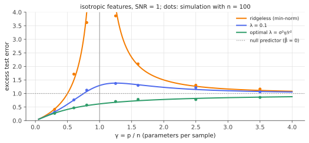

# Ridge in high dimensions & double descent

!!! tldr "TL;DR"
    When the number of features $p$ and samples $n$ grow together ($p/n\to\gamma$), the test error of ridge regression converges to an **exact formula** built from the effective regularization $\kappa$ of the [deterministic-equivalents](deterministic-equivalents.md) note.
    For the minimum-norm interpolator ($\lambda\to0$), the error **explodes at $\gamma = 1$**, where the model can just barely fit the data, and then **decreases again** as the model gets more overparametrized: the **double descent** curve. Optimally tuned ridge has no peak at all. When the signal sits in high-variance directions, interpolating noisy data can be nearly optimal (**benign overfitting**). These exactly solvable results are the cleanest explanation of why huge, interpolating models can generalize.

## Why care?

Classical statistics teaches the U-shaped bias–variance curve: as model size grows, test error first falls and then rises, so we should stop before we overfit. Modern deep learning flatly contradicts this. Networks with far more parameters than training examples, trained to zero training error, generalize well, and making them *bigger* often helps.

Belkin, Hsu, Ma & Mandal (2019) named the reconciling picture **double descent**: past the interpolation threshold, test error descends a second time. Linear regression in high dimension is the simplest model where all of this happens *exactly*, so every piece of the phenomenon can be computed:

- why there is a peak (variance blows up when the smallest nonzero singular value of $X$ vanishes, the [MP](marchenko-pastur.md) lower edge touching zero at $\gamma = 1$);
- why it comes down again (the minimum-norm solution behaves like ridge with a positive *implicit* penalty);
- when interpolation is harmless (enough "spare" low-variance directions to absorb the noise);
- why the optimal penalty can be zero or even negative.

The same mathematics, with a few more ingredients, describes random-feature models and kernel ridge regression, and provides solvable models of neural scaling laws.

## Building blocks

**Setting.** $y = X\beta + \varepsilon$, with rows $x_i\sim N(0,\Sigma)$ in $\R^p$, noise variance $\sigma^2$, $p/n\to\gamma$. Ridge with the normalized objective $\frac1n\|y - X\beta\|^2 + \lambda\|\beta\|^2$, and **min-norm least squares** as the $\lambda\to0^+$ limit (the solution gradient descent from zero converges to, [ridge note](ridge.md), Exercise 5). Test error: $\E(y_{\text{new}} - x_{\text{new}}^\top\hat\beta)^2 = \sigma^2 + \|\hat\beta - \beta\|_\Sigma^2$.

**Effective regularization.** From the deterministic-equivalents note, $\kappa = \kappa(\lambda)$ solves $\kappa - \lambda = \frac\kappa n\tr\Sigma(\Sigma + \kappa)^{-1}$, and the second-order degrees of freedom are $\operatorname{df}_2 = \tr\Sigma^2(\Sigma + \kappa)^{-2}$.

## The main result

!!! theorem "Theorem (asymptotic ridge risk; Dobriban & Wager 2018, Hastie, Montanari, Rosset & Tibshirani 2022, among others)"
    In the proportional limit, the excess test error of ridge regression satisfies

    $$
    \|\hat\beta_\lambda - \beta\|_\Sigma^2\ \to\ \frac{\overbrace{\kappa^2\,\beta^\top\Sigma(\Sigma + \kappa I)^{-2}\beta}^{\text{bias}}\ +\ \overbrace{\sigma^2\,\operatorname{df}_2(\kappa)/n}^{\text{variance}}}{1 - \operatorname{df}_2(\kappa)/n}.
    $$

    For isotropic features ($\Sigma = I$), a signal of norm $\|\beta\| = r$ and $\gamma = p/n$, with $\kappa = \frac{(\lambda + \gamma - 1) + \sqrt{(\lambda + \gamma - 1)^2 + 4\lambda}}{2}$:

    $$
    \text{excess risk} = \frac{\kappa^2r^2 + \sigma^2\gamma}{(1+\kappa)^2 - \gamma}.
    $$

**The ridgeless limit.** As $\lambda\to0$:

- **$\gamma < 1$** (underparametrized): $\kappa\to0$, and the risk is $\sigma^2\frac{\gamma}{1-\gamma}$, the [OLS variance blow-up](ols-gauss-markov.md). No bias.
- **$\gamma > 1$** (overparametrized): $\kappa\to\gamma - 1$, and the risk is

    $$
    \underbrace{r^2\Big(1 - \frac1\gamma\Big)}_{\text{bias: signal outside the row space}} + \underbrace{\frac{\sigma^2}{\gamma - 1}}_{\text{variance}} .
    $$

Both terms blow up at $\gamma = 1$ through the variance. In the overparametrized regime the variance **decreases** as $\gamma$ grows, because the min-norm solution spreads the noise over more and more directions. The bias increases toward $r^2$ (predicting zero). The second descent is the variance falling faster than the bias rises.

**Optimal ridge removes the peak.** For an isotropic prior on $\beta$, the Bayes-optimal penalty is $\lambda^* = \sigma^2\gamma/r^2$ ([ridge note](ridge.md): noise-to-signal ratio), and the optimally tuned risk is **monotone in $\gamma$**: no peak, ever. The peak is not a mystery of high dimensions but a symptom of un-regularized interpolation exactly at the threshold.

### Benign overfitting and negative penalties

With anisotropic $\Sigma$, the overparametrized min-norm solution acts like population ridge with penalty $\kappa_0$ solving $\operatorname{df}_1(\kappa_0) = n$. If $\Sigma$ has a few large eigenvalues carrying the signal plus **many** small ones, $\kappa_0$ is small relative to the large eigenvalues (the strong directions are barely shrunk) but large relative to the small ones (the noise is spread thin over them). Interpolation is then nearly optimal: **benign overfitting** (Bartlett, Long, Lugosi & Tsigler, 2020).
In such settings the implicit $\kappa_0$ can already be *too large*, and the best explicit penalty is **negative** (Kobak, Lomond & Sanchez, 2020): one wants to *undo* some of the implicit regularization.

{ .fig }

## Examples

### Double descent, computed and simulated

```python
import numpy as np
rng = np.random.default_rng(0)
sigma, r = 1.0, 1.0                                       # noise level, signal norm ||beta||

def kappa(lam, g):                                        # effective regularization, isotropic Σ = I, γ = p/n
    return ((lam + g - 1) + np.sqrt((lam + g - 1) ** 2 + 4 * lam)) / 2

def excess_risk(lam, g):                                  # E||beta_hat - beta||^2 (= excess test MSE for Σ = I)
    k = kappa(lam, g); df2 = g / (1 + k) ** 2
    return (k**2 * r**2 / (1 + k) ** 2 + sigma**2 * df2) / (1 - df2)

def simulate(lam, n, p, reps=20):
    out = []
    for _ in range(reps):
        X = rng.standard_normal((n, p)); beta = rng.standard_normal(p) * r / np.sqrt(p)
        y = X @ beta + sigma * rng.standard_normal(n)
        # ridge with (1/n)||y - Xb||^2 + lam ||b||^2, in the dual (n x n) form; lam = 0 gives min-norm least squares
        b = X.T @ np.linalg.solve(X @ X.T + n * lam * np.eye(n), y) if p > n else np.linalg.solve(X.T @ X + n * lam * np.eye(p), X.T @ y)
        out.append(np.sum((b - beta) ** 2))
    return np.mean(out)

n = 200
for g in [0.5, 0.9, 1.1, 2.0, 4.0]:
    p = int(g * n); lam_opt = sigma**2 * g / r**2
    print(f"gamma = {g:3.1f}:  ridgeless  sim {simulate(1e-9, n, p):6.3f}  theory {excess_risk(1e-12, g):6.3f}   |   "
          f"optimal ridge (lam = {lam_opt:.2f})  sim {simulate(lam_opt, n, p):.3f}  theory {excess_risk(lam_opt, g):.3f}")
# gamma = 0.5:  ridgeless  sim  0.982  theory  1.000   |   optimal ridge (lam = 0.50)  sim 0.433  theory 0.414
# gamma = 0.9:  ridgeless  sim  9.927  theory  9.000   |   optimal ridge (lam = 0.90)  sim 0.595  theory 0.588
# gamma = 1.1:  ridgeless  sim  9.246  theory 10.091   |   optimal ridge (lam = 1.10)  sim 0.662  theory 0.644
# gamma = 2.0:  ridgeless  sim  1.532  theory  1.500   |   optimal ridge (lam = 2.00)  sim 0.772  theory 0.781
# gamma = 4.0:  ridgeless  sim  1.092  theory  1.083   |   optimal ridge (lam = 4.00)  sim 0.888  theory 0.883
```

The asymptotic formula is accurate already at $n = 200$. Near the peak the ridgeless error is enormous and highly variable across draws, so 20 repetitions only roughly match. Optimal ridge is 15 to 20 times better there.

### Try it

<div class="widget" data-widget="doubledescent"></div>

## Exercises

!!! question "Exercise 1 · warm-up: the underparametrized side"
    Using the isotropic formula with $\lambda\to0$ and $\gamma < 1$, recover $\sigma^2\gamma/(1-\gamma)$. Compare with the exact finite-sample OLS formula $\sigma^2\frac{p}{n - p - 1}$.

    ??? success "Solution"
        $\kappa\to0$, so the risk is $\frac{\sigma^2\gamma}{1 - \gamma}$. The exact formula $\sigma^2\frac{p}{n-p-1} = \sigma^2\frac{\gamma}{1 - \gamma - 1/n}$ converges to the same limit. That is the [OLS](ols-gauss-markov.md) blow-up, coming from the inverse-Wishart moment ([MP](marchenko-pastur.md), Exercise 3).

!!! question "Exercise 2 · more data can hurt"
    With $p = 100$ features, SNR $r^2/\sigma^2 = 1$, and min-norm least squares, compare the excess risk with $n = 50$ samples and with $n = 105$ samples. Explain the paradox, and how ridge resolves it.

    ??? success "Solution"
        $n = 50$: $\gamma = 2$, risk $= r^2(1 - \frac12) + \frac{\sigma^2}{1} = 1.5\sigma^2$. $n = 105$: $\gamma = 0.952$, risk $= \sigma^2\frac{0.952}{0.048}\approx19.8\sigma^2$. **Doubling the data made the interpolator 13 times worse**, because $n\approx p$ puts it right at the interpolation threshold, where $X^\top X$ is nearly singular.
        With optimal ridge the risk is monotone in $n$: more data always helps. Sample-wise double descent was observed in deep networks too (Nakkiran et al., 2020).

!!! question "Exercise 3 · the optimal penalty"
    Show that, for an isotropic Gaussian prior $\beta\sim N(0, \frac{r^2}{p}I)$ and the normalized objective, the posterior mean is ridge with $\lambda^* = \sigma^2\gamma/r^2$. Explain why its risk can't have a peak at $\gamma = 1$.

    ??? success "Solution"
        The posterior mean minimizes $\frac{1}{2\sigma^2}\|y - X\beta\|^2 + \frac{p}{2r^2}\|\beta\|^2$. Multiplying by $\frac{2\sigma^2}{n}$ gives $\frac1n\|y - X\beta\|^2 + \frac{\sigma^2p}{nr^2}\|\beta\|^2$, so $\lambda^* = \sigma^2\gamma/r^2$.
        It is Bayes-optimal, so its average risk at sample size $n$ is at most that of the Bayes procedure that discards the extra observation, which is the Bayes risk at $n - 1$. Hence the Bayes risk is non-increasing in $n$ (for fixed $p$) and can't spike at $n = p$.

!!! question "Exercise 4 · decomposing the overparametrized risk"
    For $\gamma > 1$ and $\Sigma = I$, interpret the two terms of $r^2(1 - 1/\gamma) + \sigma^2/(\gamma - 1)$ geometrically. (Hint: the min-norm solution lies in the row space of $X$, a random $n$-dimensional subspace of $\R^p$.)

    ??? success "Solution"
        Bias: min-norm least squares can only recover the projection of $\beta$ onto the row space of $X$, a uniformly random $n$-dimensional subspace, so on average a fraction $n/p = 1/\gamma$ of $\|\beta\|^2$ is captured and $r^2(1 - 1/\gamma)$ is lost.
        Variance: the noise is fitted exactly, through $X^+\varepsilon$, whose squared norm is $\sigma^2\tr(XX^\top)^{-1}\approx\sigma^2\frac{n}{p - n}$ (an inverse-Wishart trace) $= \frac{\sigma^2}{\gamma - 1}$. More dimensions mean the same noise is spread over more directions, so less of it lands where it hurts.

!!! question "Exercise 5 · stretch: benign overfitting in a spiked model"
    Let $\Sigma$ have $k$ eigenvalues equal to $1$ (carrying all of $\beta$, with $\|\beta\| = r$) and $p - k$ "weak" eigenvalues equal to $\epsilon$, with $k\ll n\ll p$. For the min-norm interpolator:

    1. Assuming $\epsilon\ll\kappa_0\ll1$, use $\operatorname{df}_1(\kappa_0) = n$ to show $\kappa_0\approx\frac{(p-k)\epsilon}{n-k}$.
    2. Show that the bias is $\approx\kappa_0^2r^2$, and that the variance has a strong-direction part $\approx\sigma^2k/n$ and a weak-direction part $\approx\sigma^2n/(p-k)$.
    3. Deduce conditions under which interpolation is asymptotically optimal ("benign").

    ??? success "Solution"
        1. $\operatorname{df}_1(\kappa) = \frac{k}{1+\kappa} + \frac{(p-k)\epsilon}{\epsilon + \kappa}\approx k + \frac{(p-k)\epsilon}{\kappa}$ when $\epsilon\ll\kappa\ll1$. Setting it to $n$ gives $\kappa_0\approx\frac{(p-k)\epsilon}{n-k}$.
        2. Bias: $\kappa_0^2\sum_{\text{strong}}\frac{\beta_i^2}{(1+\kappa_0)^2}\approx\kappa_0^2r^2$. For the variance, $\operatorname{df}_2 = \frac{k}{(1+\kappa_0)^2} + \frac{(p-k)\epsilon^2}{(\epsilon+\kappa_0)^2}\approx k + \frac{(p-k)\epsilon^2}{\kappa_0^2} = k + \frac{(n-k)^2}{p-k}$. Dividing by $n$ (and noting $\operatorname{df}_2/n\ll1$) gives the variance $\approx\sigma^2\big(\frac kn + \frac{n}{p-k}\big)$ to leading order.
        3. All three terms vanish when (a) $k\ll n$ (few strong directions), (b) $p - k\gg n$ (many weak directions, so the fitted noise is spread thin), and (c) $(p-k)\epsilon\ll n$ (small total weak variance, so $\kappa_0\ll1$ and the strong directions are barely shrunk). These are compatible, e.g. with $\epsilon$ small enough, and they match the two-part condition of Bartlett et al. (2020): the weak part must have large *effective rank* but small *total variance*. Then the interpolator, which fits the noisy training labels exactly, has excess risk tending to zero.

## Where it shows up

- **Understanding deep learning.** Double descent appears in neural networks as a function of width, training time and sample size (Nakkiran et al., 2020). Linear and random-feature models give exactly solvable versions, and the lazy/NTK regime of wide networks reduces to kernel ridge(less) regression, where these formulas apply.
- **Scaling laws.** With power-law covariance spectra and power-law signal coefficients, the bias–variance formula gives power-law learning curves in $n$ and $p$. These are standard solvable models of neural scaling laws and of compute-optimal trade-offs.
- **Choosing regularization.** The theory explains why tuned ridge is never worse than interpolation, why the optimal $\lambda$ can be tiny or negative in benign settings, and why GCV/LOO remain reliable tuning methods in high dimension.
- **Finance.** Regressions of returns on thousands of characteristics or random features (Kelly, Malamud & Zhou, "The virtue of complexity in return prediction", 2024) show double-descent-like behaviour, with heavily overparametrized ridge models outperforming small ones out of sample.
- **Random features and kernels.** Random-feature regression (Mei & Montanari, 2022) adds a second effective-regularization term from the nonlinearity, giving double descent in the number of features. Kernel ridge regression in high dimension has analogous multiple-descent curves.

## Further reading

- M. Belkin, D. Hsu, S. Ma & S. Mandal, "Reconciling modern machine-learning practice and the classical bias–variance trade-off" (*PNAS*, 2019).
- T. Hastie, A. Montanari, S. Rosset & R. Tibshirani, "Surprises in high-dimensional ridgeless least squares interpolation" (*Ann. Stat.*, 2022).
- P. Bartlett, P. Long, G. Lugosi & A. Tsigler, "Benign overfitting in linear regression" (*PNAS*, 2020).
- E. Dobriban & S. Wager, "High-dimensional asymptotics of prediction: ridge regression and classification" (*Ann. Stat.*, 2018).
