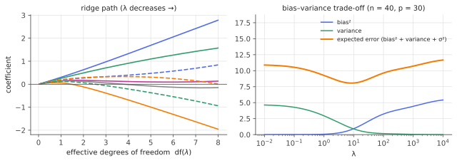

# Ridge regression & Tikhonov regularization

!!! tldr "TL;DR"
    Ridge regression adds a penalty $\lambda\|\beta\|^2$ to least squares: $\hat\beta_\lambda = (X^\top X + \lambda I)^{-1}X^\top y$. In the SVD basis it
    **shrinks each principal direction by the factor $d_j^2/(d_j^2+\lambda)$**. Low-variance directions, where OLS is noisiest, are damped the most.
    The same estimator is the posterior mean under a Gaussian prior, the best *linear* estimator when $\Cov\beta = \tau^2 I$, a smooth version of
    early-stopped gradient descent, and the reason "weight decay" works. $\lambda$ can be tuned by exact leave-one-out at the cost of one fit.

## Why care?

The [OLS](ols-gauss-markov.md) note ended with two warnings: OLS variance explodes as $p\to n$ (as $\sigma^2q/(1-q)$), and a little bias always reduces MSE.
Ridge is the simplest estimator that acts on both. It appears all over:

- **Weight decay** in neural networks is an $\ell_2$ penalty on the weights, and in a linear model it *is* ridge.
- **Ill-posed inverse problems** such as deblurring an image, reconstructing a CT scan, or calibrating a volatility surface are solved with Tikhonov regularization,
  the general form of ridge.
- **Covariance inversion** in quant: replacing $\Sigma^{-1}$ by $(\Sigma + \lambda I)^{-1}$ in a portfolio optimizer is ridge in disguise, and the simplest cure for
  the [Markowitz](markowitz-estimation-error.md) noise amplification.
- **High-dimensional ML theory**: ridge regression with $p\sim n$ is the exactly solvable model behind [double descent](ridge-high-dim.md), and kernel ridge
  regression is the infinite-width limit of neural networks trained in the "lazy" regime.

## Building blocks

**Where OLS goes wrong.** Write the thin SVD $X = UDV^\top$, with singular values $d_1\ge\dots\ge d_r > 0$. Then

$$
\hat\beta_{\text{OLS}} = VD^{-1}U^\top y = \sum_j\frac{u_j^\top y}{d_j}\,v_j,
\qquad
\Cov(\hat\beta_{\text{OLS}}) = \sigma^2\sum_j\frac{v_jv_j^\top}{d_j^2}.
$$

Directions with small $d_j$ are those in which the data barely vary, for example combinations of nearly collinear features. OLS divides by $d_j$ there,
so it amplifies noise in exactly those directions. Its total variance $\sigma^2\sum_jd_j^{-2}$ is dominated by the smallest singular values.

**The ridge estimator.** For $\lambda > 0$,

$$
\hat\beta_\lambda = \arg\min_b\;\|y - Xb\|^2 + \lambda\|b\|^2 = (X^\top X + \lambda I)^{-1}X^\top y .
$$

$X^\top X + \lambda I\succeq\lambda I$ is always invertible, so ridge exists even when $p > n$ or the features are perfectly collinear. That is the original
motivation of Hoerl & Kennard (1970). By Lagrange duality it is equivalent to least squares subject to $\|b\|^2\le t$ for some $t = t(\lambda)$.

!!! info "Practical conventions"
    The intercept is not penalized (centre $y$ and the columns of $X$ first), and features are standardized so the penalty treats them equally. The scale of $\lambda$
    depends on whether the loss is $\|y - Xb\|^2$ or $\frac1n\|y-Xb\|^2$. This note uses the former.

## The main results

### Ridge shrinks principal components

Plugging the SVD in:

$$
\hat\beta_\lambda = \sum_j\frac{d_j}{d_j^2+\lambda}\,(u_j^\top y)\,v_j,
\qquad
\hat y_\lambda = X\hat\beta_\lambda = \sum_j\underbrace{\frac{d_j^2}{d_j^2+\lambda}}_{\text{shrinkage factor}}\,(u_j^\top y)\,u_j .
$$

OLS keeps each component $u_j^\top y$ fully. Ridge multiplies it by a factor in $(0,1)$ that is close to $1$ for high-variance directions ($d_j^2\gg\lambda$)
and close to $0$ for low-variance ones ($d_j^2\ll\lambda$). It is a **soft version of principal-component regression**, which keeps the top $k$ components
exactly and drops the rest.

The **effective degrees of freedom** count how many directions survive:

$$
\operatorname{df}(\lambda) = \tr H_\lambda = \sum_j\frac{d_j^2}{d_j^2+\lambda},\qquad H_\lambda = X(X^\top X + \lambda I)^{-1}X^\top,
$$

which decreases smoothly from $\operatorname{rank}(X)$ at $\lambda = 0$ to $0$ as $\lambda\to\infty$.

{ .fig }

### Ridge is the best linear estimator under an isotropic prior

!!! theorem "Theorem (ridge as linear Bayes)"
    Suppose $\beta$ is random with $\E\beta = 0$ and $\Cov\beta = \tau^2I$, independent of the noise $\varepsilon$, with $\E\varepsilon = 0$ and $\Cov\varepsilon = \sigma^2I$.
    Among all linear estimators $\tilde\beta = Ay$, the average squared error $\E\|Ay - \beta\|^2$ (over both $\beta$ and $\varepsilon$) is minimized by ridge
    with $\lambda = \sigma^2/\tau^2$. If in addition $\beta$ and $\varepsilon$ are Gaussian, ridge is the posterior mean $\E[\beta\mid y]$, and hence optimal among
    **all** estimators.

**Proof.** $Ay - \beta = (AX - I)\beta + A\varepsilon$, and the two terms are uncorrelated, so

$$
\E\|Ay - \beta\|^2 = \tau^2\|AX - I\|_F^2 + \sigma^2\|A\|_F^2 .
$$

This is a convex quadratic in $A$. Setting the gradient $2\tau^2(AX - I)X^\top + 2\sigma^2A$ to zero gives $A(XX^\top + \lambda I) = X^\top$ with $\lambda = \sigma^2/\tau^2$, so

$$
A = X^\top(XX^\top + \lambda I)^{-1} = (X^\top X + \lambda I)^{-1}X^\top,
$$

where the last step is the **push-through identity** (Exercise 4). For the Gaussian case, the log-posterior is
$-\frac1{2\sigma^2}\|y - X\beta\|^2 - \frac1{2\tau^2}\|\beta\|^2 + \text{const}$. Its maximizer (which is also the mean, since the posterior is Gaussian) solves the
ridge problem with $\lambda = \sigma^2/\tau^2$. $\square$

So $\lambda$ is a **noise-to-signal ratio**: a large prior variance (strong signal) means little shrinkage, and heavy noise means a lot.

### Ridge and early stopping

Run gradient descent on $\frac12\|y - Xb\|^2$ from $b_0 = 0$ with step size $\eta$. In the SVD basis each coordinate evolves independently, and after $t$ steps

$$
X b_t = \sum_j\Big[1 - (1 - \eta d_j^2)^t\Big](u_j^\top y)\,u_j .
$$

Compare the filters $1 - (1-\eta d^2)^t$ and $\frac{d^2}{d^2+\lambda}$. Both are $\approx 1$ for large $d$ and $\approx 0$ for small $d$, with the cross-over at
$d^2\approx 1/(\eta t)\approx\lambda$. **Stopping gradient descent early is (approximately) ridge with $\lambda\approx 1/(\eta t)$.** Directions with large singular values
are learned first, and noise in weak directions is only fitted late. This is the simplest instance of the *implicit regularization* of gradient-based training.

### Choosing $\lambda$: leave-one-out for free

Ridge is a linear smoother, $\hat y = H_\lambda y$, and the [OLS leave-one-out shortcut](ols-gauss-markov.md) carries over unchanged:

$$
y_i - \hat y_{(-i)} = \frac{y_i - \hat y_i}{1 - (H_\lambda)_{ii}},
\qquad
\text{LOO}(\lambda) = \frac1n\sum_i\Big(\frac{y_i - \hat y_i}{1 - (H_\lambda)_{ii}}\Big)^2 .
$$

Generalized cross-validation (GCV) replaces each $(H_\lambda)_{ii}$ by its average $\operatorname{df}(\lambda)/n$. With one SVD, both can be evaluated on a whole grid of $\lambda$'s
almost for free.

### Tikhonov regularization

The general form penalizes $\|\Gamma b\|^2$ for a chosen matrix $\Gamma$: $\hat b = (X^\top X + \lambda\Gamma^\top\Gamma)^{-1}X^\top y$. With $\Gamma$ a finite-difference operator it
favours **smooth** solutions. This is the standard tool for ill-posed inverse problems (deconvolution, tomography, implied-volatility surfaces), where the
forward operator $X$ has singular values decaying to zero and naive inversion is hopeless.

## Examples

### Ridge with more features than samples

```python
import numpy as np
rng = np.random.default_rng(0)
n, p = 100, 120                                   # more features than samples
X = rng.standard_normal((n, p))
beta = rng.standard_normal(p) / np.sqrt(p)
y = X @ beta + 1.0 * rng.standard_normal(n)

U, d, Vt = np.linalg.svd(X, full_matrices=False)  # works for any n, p

def ridge(lam):
    return Vt.T @ (d / (d**2 + lam) * (U.T @ y))

def loo_error(lam):
    # Exact leave-one-out residuals of ridge from one fit: e_i / (1 - H_ii)
    H = (U * (d**2 / (d**2 + lam))) @ U.T
    e = y - H @ y
    return np.mean((e / (1 - np.diag(H))) ** 2)

lams = np.logspace(-3, 3, 61)
best = lams[np.argmin([loo_error(l) for l in lams])]
Xte = rng.standard_normal((5000, p)); yte = Xte @ beta + 1.0 * rng.standard_normal(5000)
for lam in [1e-3, best, 1e3]:
    print(f"lambda = {lam:8.3f}   LOO MSE = {loo_error(lam):.3f}   test MSE = {np.mean((yte - Xte @ ridge(lam))**2):.3f}")

# Check the LOO shortcut against brute force at the selected lambda.
i = 0; m = np.arange(n) != i
b = np.linalg.solve(X[m].T @ X[m] + best * np.eye(p), X[m].T @ y[m])
H = (U * (d**2 / (d**2 + best))) @ U.T
print(f"LOO residual: brute force {y[i] - X[i] @ b:.6f}   shortcut {(y - H @ y)[i] / (1 - H[i, i]):.6f}")
# lambda =    0.001   LOO MSE = 3.415   test MSE = 4.862
# lambda =   79.433   LOO MSE = 1.558   test MSE = 1.614
# lambda = 1000.000   LOO MSE = 1.775   test MSE = 1.736
# LOO residual: brute force 1.279254   shortcut 1.279254
```

Near-zero $\lambda$ essentially interpolates the data and has test error $4.9$, three times the noise level. LOO picks $\lambda\approx 79$, close to the Bayes-optimal
$\sigma^2/\tau^2 = 1/(1/p) = 120$ from the theorem, and cuts the test error to $1.6$, near the irreducible $\sigma^2 = 1$.

### Try it

Twenty Gaussian bumps fitted to 25 noisy points. Slide $\lambda$ from overfitting to underfitting and watch $\operatorname{df}(\lambda)$ and the weight norm.

<div class="widget" data-widget="ridge"></div>

## Exercises

!!! question "Exercise 1 · warm-up: ridge as augmented OLS"
    Show that $\hat\beta_\lambda$ is the OLS estimate for the augmented data $\tilde X = \begin{pmatrix}X\\ \sqrt\lambda I_p\end{pmatrix}$, $\tilde y = \begin{pmatrix}y\\ 0\end{pmatrix}$.
    Interpret the $p$ extra "observations".

    ??? success "Solution"
        $\|\tilde y - \tilde Xb\|^2 = \|y - Xb\|^2 + \|0 - \sqrt\lambda b\|^2 = \|y-Xb\|^2 + \lambda\|b\|^2$. Equivalently $\tilde X^\top\tilde X = X^\top X + \lambda I$ and
        $\tilde X^\top\tilde y = X^\top y$. Each extra row is a pseudo-observation saying "$\beta_j\approx 0$" with weight $\lambda$: prior information encoded as fake data.
        This view also lets any least-squares solver compute ridge.

!!! question "Exercise 2 · orthonormal design"
    If $X^\top X = I_p$, show that $\hat\beta_\lambda = \hat\beta_{\text{OLS}}/(1+\lambda)$ and $\operatorname{df}(\lambda) = p/(1+\lambda)$. Contrast with the LASSO, which in the same setting
    soft-thresholds each coordinate (preview of the [LASSO](lasso.md) note).

    ??? success "Solution"
        $\hat\beta_\lambda = (I + \lambda I)^{-1}X^\top y = \hat\beta_{\text{OLS}}/(1+\lambda)$, since $\hat\beta_{\text{OLS}} = X^\top y$. All $d_j = 1$, so $\operatorname{df} = \sum_j\frac1{1+\lambda}$.
        Ridge scales every coefficient by the same factor and never sets one exactly to zero. The LASSO subtracts a constant from each $|\hat\beta_j|$ and truncates
        at zero, which produces sparse solutions.

!!! question "Exercise 3 · noise injection is ridge"
    Suppose you train least squares on inputs corrupted with fresh noise, $x_i + \xi_i$ with $\xi_i\sim N(0, s^2I_p)$ independent. Show that the expected loss is
    $\E_\xi\sum_i(y_i - (x_i+\xi_i)^\top b)^2 = \|y - Xb\|^2 + ns^2\|b\|^2$. Which $\lambda$ does this correspond to?

    ??? success "Solution"
        $(y_i - x_i^\top b - \xi_i^\top b)^2$ has expectation $(y_i - x_i^\top b)^2 + \E(\xi_i^\top b)^2$, since the cross term has mean zero, and $\E(\xi_i^\top b)^2 = s^2\|b\|^2$. Summing over $i$
        gives the claim, i.e. ridge with $\lambda = ns^2$ (Bishop, 1995). Data augmentation with input noise is a regularizer. Dropout in linear regression gives a similar
        penalty, with weights depending on each feature's scale (Wager et al., 2013).

!!! question "Exercise 4 · the push-through identity"
    Prove $(X^\top X + \lambda I_p)^{-1}X^\top = X^\top(XX^\top + \lambda I_n)^{-1}$. Why is the right-hand side preferable when $p\gg n$? Show that predictions then depend on the
    data only through inner products $x_i^\top x_j$ and $x^\top x_i$ (the kernel trick).

    ??? success "Solution"
        Start from $X^\top(XX^\top + \lambda I) = (X^\top X + \lambda I)X^\top$, which holds since both sides equal $X^\top XX^\top + \lambda X^\top$. Multiply on the left by $(X^\top X+\lambda I)^{-1}$
        and on the right by $(XX^\top + \lambda I)^{-1}$.

        The right side inverts an $n\times n$ matrix instead of $p\times p$, which is much cheaper for $p\gg n$. A prediction is
        $x^\top\hat\beta = x^\top X^\top(XX^\top + \lambda I)^{-1}y = k(x)^\top(K + \lambda I)^{-1}y$ with $K_{ij} = x_i^\top x_j$ and $k(x)_i = x^\top x_i$. Replacing
        inner products by a kernel $k(x, x')$ gives **kernel ridge regression**, which works with infinite-dimensional feature maps.

!!! question "Exercise 5 · stretch: gradient descent vs ridge"
    Derive the gradient-descent formula $Xb_t = \sum_j[1 - (1-\eta d_j^2)^t](u_j^\top y)u_j$ (from $b_0 = 0$, with $0 < \eta < 1/d_1^2$). Then show that, as $\lambda\to0^+$, ridge converges to
    the **minimum-norm** least-squares solution $X^+y$, and that gradient descent from zero converges to the same point as $t\to\infty$.

    ??? success "Solution"
        $b_{t+1} = b_t + \eta X^\top(y - Xb_t)$. Write $b_t = \sum_j c_j(t)v_j + (\text{component in }\ker X)$. The kernel component starts at $0$ and never changes,
        because the update $X^\top(\cdot)$ lies in the row space. For $c_j$: $c_j(t+1) = (1 - \eta d_j^2)c_j(t) + \eta d_j\,u_j^\top y$, whose solution from $c_j(0) = 0$ is
        $c_j(t) = \frac{1 - (1-\eta d_j^2)^t}{d_j}u_j^\top y$. Multiplying by $X v_j = d_ju_j$ gives the formula.

        As $t\to\infty$ (with $|1 - \eta d_j^2| < 1$), $c_j\to u_j^\top y/d_j$, so $b_\infty = \sum_jd_j^{-1}(u_j^\top y)v_j = X^+y$, and it has no component in $\ker X$. Among all
        least-squares solutions this is the one of minimum norm. Ridge gives $\frac{d_j}{d_j^2+\lambda}\to\frac1{d_j}$, the same limit. When $p > n$ both converge to the
        **minimum-norm interpolator**, the object at the centre of benign overfitting and double descent.

## Where it shows up

- **Weight decay and AdamW.** For SGD, adding $\frac\lambda2\|w\|^2$ to the loss and multiplying weights by $(1-\eta\lambda)$ each step are the same thing. For Adam they are
  not, because the penalty gradient gets rescaled by the adaptive preconditioner. Loshchilov & Hutter's AdamW "decouples" weight decay to restore the ridge-like
  shrinkage, and it is now the default optimizer for training transformers.
- **Kernel and lazy-regime theory.** Kernel ridge (Exercise 4) is the exact predictor of an infinitely wide network trained by gradient flow on squared loss in the
  neural-tangent-kernel regime. Early stopping plays the role of $\lambda$, as in the early-stopping section above.
- **Covariance shrinkage and portfolios.** The minimum-variance portfolio with an $\ell_2$ penalty on weights, $\min w^\top\Sigma w + \lambda\|w\|^2$, is the plug-in portfolio
  for $\Sigma + \lambda I$: shrinkage of all eigenvalues toward a common level, the idea that [Ledoit–Wolf](ledoit-wolf.md) makes optimal.
- **Signal combination in quant.** Regressing future returns on hundreds of correlated signals is badly conditioned. Ridge (or its Bayesian cousin,
  Black–Litterman-style priors) is the standard workhorse.
- **High-dimensional asymptotics.** For $p, n\to\infty$ with $p/n$ fixed, the test error of ridge has an exact formula. It explains why the optimal $\lambda$ can be
  zero or even negative and why interpolation can generalize, the subject of [ridge in high dimensions](ridge-high-dim.md).

## Further reading

- T. Hastie, R. Tibshirani & J. Friedman, *The Elements of Statistical Learning*, §3.4.1.
- A. N. Tikhonov & V. Y. Arsenin, *Solutions of Ill-Posed Problems* (1977).
- I. Loshchilov & F. Hutter, "Decoupled weight decay regularization" (ICLR 2019).
- G. H. Golub, M. Heath & G. Wahba, "Generalized cross-validation as a method for choosing a good ridge parameter" (*Technometrics*, 1979).
