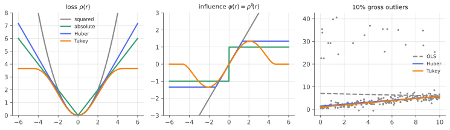

# Robust regression & M-estimators

!!! tldr "TL;DR"
    Least squares lets every residual pull with force proportional to its size, so one wild point can drag the fit anywhere. **M-estimators** replace the squared loss by a function $\rho$ that grows more slowly. **Huber** is quadratic near zero and linear in the tails. **Tukey's biweight** levels off completely, so gross outliers are ignored.
    They are fitted by iteratively reweighted least squares, using a robust scale estimate (the MAD). Huber's loss gives up about 5% efficiency on clean Gaussian data in exchange for bounded influence, and it is minimax-optimal against contamination. Huber is also the "smooth L1" loss of deep learning, and the [sandwich](delta-sandwich.md) gives valid standard errors.

## Why care?

Real data are messy: fat-fingered prices, sensor glitches, mislabelled examples, flash crashes, earnings surprises. In finance, daily returns have tails far heavier than Gaussian ([sub-Gaussian note](subgaussian-subexponential.md)), so "outliers" aren't errors, they are part of the distribution, but they can still dominate a least-squares estimate. A
single bad tick can change an OLS beta substantially. Robust methods give estimates that reflect the **bulk** of the data and degrade gracefully when a fraction is corrupted.

In ML the same ideas reappear as the Huber/smooth-L1 loss in DQN and object detection, gradient clipping for heavy-tailed gradient noise, median-of-means estimators, and the modern theory of robust learning under adversarial corruption.

## Building blocks

**M-estimators.** Given a loss $\rho$ (convex or not), estimate

$$
\hat\beta = \arg\min_\beta\sum_i\rho\Big(\frac{y_i - x_i^\top\beta}{\hat s}\Big),
$$

with $\hat s$ a robust scale estimate. The estimating equation is $\sum_i\psi(r_i/\hat s)\,x_i = 0$ with $\psi = \rho'$. OLS is $\rho(r) = r^2/2$, so $\psi(r) = r$, and the influence is unbounded. LAD/median regression is $\rho = |r|$, $\psi = \operatorname{sign}$.

**Huber and Tukey.**

$$
\rho_k^{\text{Huber}}(r) = \begin{cases}r^2/2 & |r|\le k\\ k|r| - k^2/2 & |r| > k\end{cases},\qquad
\psi_k(r) = \operatorname{clip}(r, -k, k);
\qquad
\psi_c^{\text{Tukey}}(r) = r\big(1 - (r/c)^2\big)^2\mathbf 1\{|r| < c\}.
$$

Huber's $\psi$ is bounded, so outliers have limited pull. Tukey's is **redescending**: beyond $c$ the pull is zero. Standard tuning constants $k = 1.345$ and $c = 4.685$ give 95% efficiency at the Gaussian.

**Robust scale.** Residuals must be standardized by a scale that isn't itself wrecked by outliers. The **MAD**, $\hat s = \operatorname{median}_i|r_i - \operatorname{median}(r)|/0.6745$, estimates $\sigma$ consistently for Gaussian data and tolerates up to 50% contamination.

**Measuring robustness.**

- **Influence function** $\mathrm{IF}(z)$: the effect on the estimate of an infinitesimal amount of contamination at the point $z$. For a location M-estimator, $\mathrm{IF}(z) = \psi(z)/\E\psi'$. The mean has $\mathrm{IF}(z) = z$, unbounded. Huber's is bounded by $k/\E\psi'$.
- **Breakdown point**: the largest fraction of arbitrarily bad data the estimator can tolerate before it can be carried off to infinity. Mean: $0$. Median: $50\%$. Regression M-estimators with *y*-outliers: high. With bad leverage points ($x$-outliers): $0$, unless using S-, MM- or LTS-estimators.

## The main results

!!! theorem "Theorem (asymptotics of M-estimators of location)"
    Let $x_1,\dots,x_n$ be i.i.d. from a distribution symmetric about $\theta$, and let $\hat\theta$ solve $\sum_i\psi(x_i - \hat\theta) = 0$ with $\psi$ odd, bounded and monotone. Then

    $$
    \sqrt n(\hat\theta - \theta)\Rightarrow N\Big(0,\ \frac{\E\psi(X - \theta)^2}{\big(\E\psi'(X - \theta)\big)^2}\Big).
    $$

This is the [sandwich formula](delta-sandwich.md) with "bread" $\E\psi'$ and "meat" $\E\psi^2$. For regression, the analogue is $\Cov(\hat\beta)\approx\frac{\E\psi^2}{(\E\psi')^2}(X^\top X)^{-1}s^2$ under homoskedastic errors.

!!! theorem "Theorem (Huber, 1964: minimax robustness)"
    Let $\mathcal F_\varepsilon = \{(1-\varepsilon)\Phi + \varepsilon H : H\text{ symmetric}\}$ be the set of $\varepsilon$-contaminated normal distributions. Among all location M-estimators, the one minimizing the **worst-case** asymptotic variance over $\mathcal F_\varepsilon$ is Huber's, with $k$ determined by $\varepsilon$ through
    $\frac{2\varphi(k)}{k} - 2\Phi(-k) = \frac{\varepsilon}{1-\varepsilon}$.

The least favourable distribution is Gaussian in the middle with exponential tails, and Huber's estimator is the MLE for it. That is why the loss is quadratic-then-linear. ($\varepsilon\approx5\%$ corresponds to $k\approx1.4$.)

### Fitting: iteratively reweighted least squares

Write $\psi(r) = w(r)\,r$ with weights $w(r) = \psi(r)/r$: Huber's is $\min(1, k/|r|)$, Tukey's is $(1 - (r/c)^2)_+^2$. The estimating equation becomes $\sum_iw_i(y_i - x_i^\top\beta)x_i = 0$, the normal equations of **weighted least squares**. Iterate:

1. compute residuals $r_i$ and the scale $\hat s$ (MAD);
2. set weights $w_i = w(r_i/\hat s)$;
3. solve the weighted least-squares problem for $\beta$.

For convex $\rho$ (Huber) this converges to the unique solution. For redescending $\rho$ (Tukey) the objective is non-convex, so start from a robust, convex fit (Huber or LAD) to avoid bad local minima. That is the idea behind MM-estimation.

{ .fig }

## Examples

### Efficiency vs robustness

```python
import numpy as np
rng = np.random.default_rng(0)

def weights(r, kind):
    a = np.abs(r)
    if kind == "huber":  k = 1.345; return np.minimum(1.0, k / np.maximum(a, 1e-12))
    if kind == "tukey":  c = 4.685; return np.where(a < c, (1 - (a / c) ** 2) ** 2, 0.0)

def m_regression(X, y, kind, iters=100):
    b = np.linalg.lstsq(X, y, rcond=None)[0]                       # start from least squares...
    if kind == "tukey":                                            # ...or, for a redescending loss, from Huber
        b = m_regression(X, y, "huber")
    for _ in range(iters):
        r = y - X @ b
        s = np.median(np.abs(r - np.median(r))) / 0.6745           # robust scale (MAD)
        w = weights(r / s, kind)
        b = np.linalg.solve(X.T @ (w[:, None] * X), X.T @ (w * y))  # IRLS step: weighted least squares
    return b

# 1) Location: efficiency at the Gaussian vs robustness under 10% contamination (variance of n=100 estimates, x n).
X1 = np.ones((100, 1))
for name, draw in [("clean N(0,1)", lambda: rng.standard_normal(100)),
                   ("10% from N(0, 10^2)", lambda: np.where(rng.uniform(size=100) < 0.1, 10, 1) * rng.standard_normal(100))]:
    est = np.array([[x.mean(), np.median(x), m_regression(X1, x, "huber")[0]] for x in (draw() for _ in range(3000))])
    v = 100 * est.var(0)
    print(f"{name:20s} n·Var:  mean {v[0]:6.2f}   median {v[1]:5.2f}   Huber {v[2]:5.2f}")

# 2) Regression with 10% gross outliers in y (a 'bad data' scenario).
n = 200
x = rng.uniform(0, 10, n); X = np.column_stack([np.ones(n), x])
y = 1 + 0.5 * x + rng.standard_normal(n)
bad = rng.choice(n, 20, replace=False); y[bad] = 30 + 5 * rng.standard_normal(20)
for kind in ["ols", "huber", "tukey"]:
    b = np.linalg.lstsq(X, y, rcond=None)[0] if kind == "ols" else m_regression(X, y, kind)
    print(f"{kind:6s} intercept {b[0]:6.2f}   slope {b[1]:5.2f}   (truth: 1.00, 0.50)")
# clean N(0,1)         n·Var:  mean   1.04   median  1.63   Huber  1.10
# 10% from N(0, 10^2)  n·Var:  mean  11.19   median  1.82   Huber  1.43
# ols    intercept   5.08   slope  0.19   (truth: 1.00, 0.50)
# huber  intercept   1.22   slope  0.47   (truth: 1.00, 0.50)
# tukey  intercept   0.88   slope  0.50   (truth: 1.00, 0.50)
```

On clean Gaussian data, Huber loses only about 5% efficiency relative to the mean, while the median loses about 36% (theory: $\pi/2 = 1.57$). With 10% contamination, the mean's variance jumps tenfold and Huber's barely moves. That is the insurance trade-off, with a cheap premium. In regression, OLS is wrecked by 10% bad responses, Huber
mostly recovers, and Tukey, which assigns zero weight to the far-away points, recovers the truth almost exactly.

## Exercises

!!! question "Exercise 1 · warm-up: Huber's weights"
    Derive $\psi_k$ from $\rho_k^{\text{Huber}}$ and show that the IRLS weight is $w(r) = \min(1, k/|r|)$. What weight does a residual of $5k$ get?

    ??? success "Solution"
        For $|r|\le k$: $\rho = r^2/2$ and $\psi = r$. For $|r| > k$: $\rho = k|r| - k^2/2$ and $\psi = k\operatorname{sign}(r)$. So $\psi = \operatorname{clip}(r, -k, k)$ and $w = \psi(r)/r = 1$ inside, $k/|r|$ outside. A residual of $5k$ gets weight $1/5$. It still counts, but its pull is capped at $k$, the same as a residual of exactly $k$.

!!! question "Exercise 2 · Huber's efficiency at the Gaussian"
    Using the asymptotic variance $\E\psi^2/(\E\psi')^2$ with $X\sim N(0,1)$, compute the efficiency $1/\text{variance}$ of Huber's estimator for $k = 1.345$. (Use $\E\psi_k' = 2\Phi(k) - 1$ and $\E\psi_k^2 = (2\Phi(k) - 1) - 2k\varphi(k) + 2k^2\Phi(-k)$.)

    ??? success "Solution"
        $\Phi(1.345) = 0.9107$, $\varphi(1.345) = 0.1618$, $\Phi(-1.345) = 0.0893$. So $\E\psi' = 0.8214$ and $\E\psi^2 = 0.8214 - 2(1.345)(0.1618) + 2(1.809)(0.0893) = 0.8214 - 0.4352 + 0.3231 = 0.7093$. Variance $= 0.7093/0.8214^2 = 1.051$, efficiency $\approx95\%$ ✓. The simulation above gives the ratio $1.10/1.04\approx1.06$, consistent up to Monte Carlo error.

!!! question "Exercise 3 · influence functions"
    Compute the influence function of the mean, the median and Huber's estimator at $N(0,1)$, and sketch them. Which ones have bounded gross-error sensitivity $\sup_z|\mathrm{IF}(z)|$?

    ??? success "Solution"
        Mean: $\mathrm{IF}(z) = z$, unbounded. Median: $\mathrm{IF}(z) = \frac{\operatorname{sign}(z)}{2\varphi(0)} = \operatorname{sign}(z)\sqrt{\pi/2}$, bounded by $1.25$. Huber: $\mathrm{IF}(z) = \frac{\operatorname{clip}(z,-k,k)}{2\Phi(k)-1}$, bounded by $1.345/0.8214 = 1.64$, and linear near 0, which is what preserves efficiency.
        The median minimizes gross-error sensitivity, the mean maximizes efficiency, and Huber trades between them optimally (Hampel's optimality).

!!! question "Exercise 4 · breakdown points"
    Show that the sample mean has breakdown point $0$ (one bad point suffices) and the sample median has $\lfloor(n-1)/2\rfloor/n\to1/2$. Why does Huber regression still have breakdown point $0$ against bad leverage points?

    ??? success "Solution"
        Mean: moving one $x_i\to\infty$ sends $\bar x\to\infty$. Median: it stays within the range of the uncorrupted points as long as fewer than half are corrupted. For regression, a bad leverage point (extreme $x$ with wrong $y$) can rotate the fit so as to sit near it, which makes its own residual small. A small residual gets full weight, so bounded-$\psi$ methods don't down-weight it.
        Down-weighting by $x$-position (GM-estimators) or using high-breakdown estimators (LTS, S, MM) fixes this.

!!! question "Exercise 5 · stretch: Huber is a Moreau envelope"
    Show that $\rho_k^{\text{Huber}}(x) = \min_z\big\{\frac12(x - z)^2 + k|z|\big\}$, and identify the minimizing $z$. Interpret: Huber's loss is "squared loss after allowing each residual a sparse correction". What connection does this suggest with the [LASSO](lasso.md) and with [proximal operators](proximal-operators.md)?

    ??? success "Solution"
        The inner problem is solved by soft-thresholding ([KKT note](convexity-kkt.md)): $z^* = \operatorname{sign}(x)(|x| - k)_+$. If $|x|\le k$, $z^* = 0$ and the value is $x^2/2$. If $|x| > k$, $x - z^* = k\operatorname{sign}(x)$ and the value is $\frac{k^2}{2} + k(|x| - k) = k|x| - \frac{k^2}{2}$ ✓.
        So Huber regression is equivalent to $\min_{\beta,z}\frac12\|y - X\beta - z\|^2 + k\|z\|_1$: least squares with an explicit **sparse outlier vector** $z$ penalized by an $\ell_1$ norm. The nonzero $z_i$ flag the outliers. Huber's loss is the Moreau envelope of $k|\cdot|$, and its gradient $\operatorname{clip}(x, -k, k)$ equals $x$ minus the proximal operator of $k|\cdot|$, which links robust statistics, the LASSO and proximal methods.

## Where it shows up

- **Deep learning losses.** DQN's "smooth L1" (Huber) loss stabilizes TD learning against large errors. Object detectors use it for bounding-box regression. Huberized and clipped losses are standard whenever targets have heavy tails.
- **Heavy-tailed SGD.** Gradient clipping is a Huber-style $\psi$ applied to gradients, and median-of-means and trimmed-mean aggregators give robust distributed and federated learning (resistant to Byzantine workers).
- **Finance.** Robust betas and factor exposures (Huber or Tukey regressions), winsorization of returns before estimation, and robust covariance estimators (Tyler's M-estimator, combined with shrinkage for $p\sim n$) cope with fat tails and data errors.
- **Robust statistics in high dimension.** Recent work gives computationally efficient estimators of means and covariances that tolerate an $\varepsilon$-fraction of adversarial corruption with near-optimal error (Diakonikolas & Kane). This matters for data poisoning in ML.
- **Robust PCA.** Decomposing a matrix into low-rank plus **sparse** corruptions (Candès et al., 2011) is the matrix version of Exercise 5: Huber-like robustness via an $\ell_1$-penalized outlier term.

## Further reading

- P. J. Huber & E. Ronchetti, *Robust Statistics* (2nd ed., 2009).
- F. Hampel, E. Ronchetti, P. Rousseeuw & W. Stahel, *Robust Statistics: The Approach Based on Influence Functions* (1986).
- R. Maronna, D. Martin, V. Yohai & M. Salibián-Barrera, *Robust Statistics: Theory and Methods (with R)* (2nd ed., 2019).
- I. Diakonikolas & D. Kane, *Algorithmic High-Dimensional Robust Statistics* (2023).
