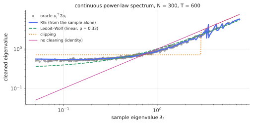

# Rotationally invariant estimators (Bouchaud–Potters)

!!! tldr "TL;DR"
    If you have no prior information about the eigenvectors of the true covariance, the natural estimators keep the **sample eigenvectors** and only change the eigenvalues: $\hat\Sigma = \sum_i\xi_iu_iu_i^\top$. The best possible choice (the oracle) is $\xi_i = u_i^\top\Sigma u_i$, the true variance along each sample eigenvector.
    That looks unknowable, but Ledoit & Péché (2011) showed that in high dimension it can be computed from the sample spectrum alone:
    
    $$\xi_i\approx\frac{\lambda_i}{\big|1 - q + q\,z_i\,g(z_i)\big|^2},\qquad z_i = \lambda_i - i\eta,$$
    
    with $g$ the sample Stieltjes transform. This **rotationally invariant estimator** (RIE), developed into a practical tool by Bun, Bouchaud & Potters, contains clipping and Ledoit–Wolf as crude approximations and essentially matches the oracle.

## Why care?

The covariance-cleaning methods so far each fixed one symptom of the [Marchenko–Pastur](marchenko-pastur.md) distortion. [Ledoit–Wolf](ledoit-wolf.md) pulls all eigenvalues toward the mean by the same factor. [Clipping](clipping-factor-models.md) keeps the outliers and flattens the bulk. The [BBP](bbp-spiked.md) note showed that even outliers should be shrunk, because their eigenvectors are tilted.
What is the **best** thing one can do, and can it be done without knowing $\Sigma$?

The RIE answers both questions. It is the optimal *nonlinear* shrinkage of eigenvalues, it adapts to any true spectrum (a few spikes, a continuum, power laws), and it uses only the observed eigenvalues. In finance it gives some of the best out-of-sample risk forecasts available from returns alone. More broadly it shows how RMT turns from a diagnostic into an estimator.

## Building blocks

**Rotational invariance.** An estimator is rotationally invariant if rotating the data rotates the estimate: $\hat\Sigma(OX) = O\hat\Sigma(X)O^\top$. Absent any preferred basis (no sector labels, no factor structure known in advance), this is a natural requirement. It forces $\hat\Sigma$ to share the sample eigenvectors, $\hat\Sigma = \sum_i\xi_iu_iu_i^\top$, with eigenvalues $\xi_i$ that depend on the data only through the spectrum.

**The oracle.** For fixed eigenvectors, the Frobenius loss $\|\sum_i\xi_iu_iu_i^\top - \Sigma\|_F^2$ is minimized coordinate-wise by

$$
\xi_i^{\text{oracle}} = u_i^\top\Sigma u_i ,
$$

the true variance of a portfolio pointing along the $i$-th sample eigenvector (Exercise 1). It is an oracle because $\Sigma$ is unknown, but it sets the benchmark: no rotationally invariant estimator can beat it.

**What the oracle looks like.** For pure noise ($\Sigma = I$), every $u_i^\top\Sigma u_i = 1$: all the sample spreading is undone. For a spike, it is $1 + \theta|\langle u, v\rangle|^2$ ([BBP](bbp-spiked.md), Exercise 4), *smaller* than the sample eigenvalue. In general it is a smooth, increasing function of $\lambda_i$, much flatter than the identity (see the figure).

## The main result

!!! theorem "Theorem (Ledoit & Péché, 2011)"
    Let $E = \Sigma^{1/2}W\Sigma^{1/2}$ be a sample covariance ($W$ white Wishart, $N/T\to q$), with sample eigenpairs $(\lambda_i, u_i)$ and limiting Stieltjes transform $g(z) = \lim\frac1N\tr(z - E)^{-1}$. For eigenvalues $\lambda$ in the bulk,

    $$
    u_i^\top\Sigma u_i\;\longrightarrow\;\xi(\lambda_i),\qquad
    \xi(\lambda) = \frac{\lambda}{\big|1 - q + q\,\lambda\,g(\lambda - i0^+)\big|^2},
    $$

    uniformly in a suitable averaged sense. The right-hand side involves only the spectrum of $E$, which is observable.

**Where it comes from (sketch).** The mixed resolvent $\frac1N\tr\big[(z - E)^{-1}\Sigma\big]$ encodes, through Stieltjes inversion, the overlaps $\sum_iu_i^\top\Sigma u_i\,\delta(\lambda - \lambda_i)$. A [free-probability](free-probability-s.md) subordination computation, or the same Sherman–Morrison argument used for the [MP law](marchenko-pastur.md), expresses this mixed resolvent through $g(z)$ alone (the precise identity is derived in Bun, Bouchaud & Potters, 2017). Taking its imaginary part just below the real axis and dividing by the density gives $\xi(\lambda)$. The denominator measures how strongly the neighbouring eigenvalues "pushed" $\lambda$ away from its true position. Where the spectrum is dense, the push is large and so is the correction.

### Making it work in practice

1. **Estimate $g$ from the sample.** $g(z_i) = \frac1N\sum_j\frac{1}{z_i - \lambda_j}$, evaluated slightly below the real axis at $z_i = \lambda_i - i\eta$, with $\eta\approx N^{-1/2}$ (the resolution trade-off from the [Stieltjes note](stieltjes-resolvent.md)).
2. **Outliers.** For eigenvalues isolated above the bulk, drop the self-term $j = i$ and evaluate on the real axis. Otherwise the term $\frac{1}{-i\eta}$, multiplied by the large $z_i$, contaminates the estimate.
3. **Small eigenvalues.** Near the lower edge, the finite-$N$ estimate of $g$ is biased, and the raw formula *under*-estimates the oracle. Bun, Bouchaud & Potters correct this by computing the same formula's bias for a pure-noise MP spectrum, $\Gamma_i$, and multiplying by $\max(1,\Gamma_i)$.
4. **Normalize** so that $\sum_i\xi_i = \sum_i\lambda_i$ (the oracle preserves the trace exactly, Exercise 3).

For correlation matrices, apply the RIE to the sample correlation matrix and rescale by the estimated volatilities.

{ .fig }

The figure uses a true covariance with a **continuous** (power-law) spectrum, where there is no clean signal/noise split. The RIE follows the oracle across the whole range. Ledoit–Wolf, a straight line in these coordinates, under-lifts the small eigenvalues. Clipping's step function is too crude.

## Examples

### RIE vs everything else

```python
import numpy as np
rng = np.random.default_rng(0)

def rie(E, q):
    """Rotationally invariant estimator (Ledoit–Péché / Bouchaud–Potters) with the Bun et al. small-eigenvalue fix."""
    lam, U = np.linalg.eigh(E); N = len(lam)
    out = lam > 1.05 * lam.mean() * (1 + np.sqrt(q)) ** 2              # isolated outliers (above the bulk)
    z = np.where(out, lam, lam - 1j / np.sqrt(N))                      # bulk: just below the real axis, eta = N^{-1/2}
    D = z[:, None] - lam[None, :]
    D[out, np.flatnonzero(out)] = np.inf                               # outliers: drop the self-term, evaluate on the real axis
    g = (1 / D).mean(1)                                                # sample Stieltjes transform g(z_i)
    xi = lam / np.abs(1 - q + q * z * g) ** 2                          # RIE: estimate of u_i' Σ u_i
    s2 = lam[0] / (1 - np.sqrt(q)) ** 2                                # MP "null" matched at the bottom edge
    lo, hi = s2 * (1 - np.sqrt(q)) ** 2, s2 * (1 + np.sqrt(q)) ** 2
    g0 = ((z - s2 * (1 - q)) - np.sqrt(z - lo) * np.sqrt(z - hi)) / (2 * q * s2 * z)
    xi = np.where(out, xi, xi * np.maximum(1, s2 * np.abs(1 - q + q * z * g0) ** 2 / lam))  # undo the bias at small λ
    xi *= lam.sum() / xi.sum()                                         # keep the trace
    return (U * xi) @ U.T, lam, xi, U

def clip(E, q):
    lam, U = np.linalg.eigh(E); keep = lam > (1 + np.sqrt(q)) ** 2
    return (U * np.where(keep, lam, lam[~keep].mean())) @ U.T

def lw(E, X):
    n, p = X.shape; m = np.trace(E) / p; d2 = np.sum((E - m * np.eye(p)) ** 2) / p
    b2 = min(sum(np.sum((np.outer(x, x) - E) ** 2) for x in X) / p / n**2, d2)
    return (1 - b2 / d2) * E + b2 / d2 * m * np.eye(p)

def risk(C, S):
    w = np.linalg.solve(C, np.ones(len(S))); w /= w.sum()
    w0 = np.linalg.solve(S, np.ones(len(S))); w0 /= w0.sum()
    return (w @ S @ w) / (w0 @ S @ w0)

N, T = 300, 600; q = N / T
spectra = {"factor model (1 + 5 spikes)": np.r_[np.full(N - 6, 0.8), [2, 3, 4, 6, 8, 40]],
           "continuous power law":        np.sort(1 / np.linspace(0.05, 1, N))}
for name, t in spectra.items():
    t = t / t.mean()
    O = np.linalg.qr(rng.standard_normal((N, N)))[0]; Sigma = (O * t) @ O.T          # random eigenvectors
    X = rng.standard_normal((T, N)) @ np.linalg.cholesky(Sigma).T; E = X.T @ X / T
    R, lam, xi, U = rie(E, q)
    oracle = (U * np.einsum("ij,ik,kj->j", U, Sigma, U)) @ U.T                   # best estimator with sample eigenvectors
    ests = {"sample": E, "Ledoit-Wolf": lw(E, X), "clipping": clip(E, q), "RIE": R, "oracle": oracle}
    print(name)
    print("  risk / optimal:  " + "  ".join(f"{k} {risk(v, Sigma):.3f}" for k, v in ests.items()))
    print("  Frobenius err:   " + "  ".join(f"{k} {np.linalg.norm(v - Sigma) / np.linalg.norm(Sigma):.3f}" for k, v in ests.items()))
# factor model (1 + 5 spikes)
#   risk / optimal:  sample 1.819  Ledoit-Wolf 1.489  clipping 1.010  RIE 1.010  oracle 1.009
#   Frobenius err:   sample 0.278  Ledoit-Wolf 0.267  clipping 0.173  RIE 0.165  oracle 0.164
# continuous power law
#   risk / optimal:  sample 2.159  Ledoit-Wolf 1.227  clipping 1.432  RIE 1.192  oracle 1.194
#   Frobenius err:   sample 0.492  Ledoit-Wolf 0.404  clipping 0.513  RIE 0.415  oracle 0.395
```

- **Factor-model truth** (flat bulk + spikes): clipping is already near-optimal, because its "flatten the bulk" assumption is true. The RIE matches it and the oracle, with no knowledge of the structure.
- **Continuous spectrum**: clipping's assumption is false and it does badly (43% excess risk). The RIE stays at the oracle's level (19%), slightly better than Ledoit–Wolf on risk and about equal on Frobenius error.
- In both cases the **oracle itself** leaves some excess risk: with only sample eigenvectors to work with, the eigenvector noise can't be removed. Rotationally invariant cleaning has a hard floor, and beating it needs information about eigenvectors (factor models, structure, priors).

## Exercises

!!! question "Exercise 1 · warm-up: the oracle"
    Show that for fixed orthonormal $u_1,\dots,u_N$, $\min_\xi\big\|\sum_i\xi_iu_iu_i^\top - \Sigma\big\|_F^2$ is attained at $\xi_i = u_i^\top\Sigma u_i$.

    ??? success "Solution"
        In the basis $\{u_i\}$, $\sum_i\xi_iu_iu_i^\top$ is diagonal with entries $\xi_i$, and $\Sigma$ has entries $\Sigma'_{ij} = u_i^\top\Sigma u_j$. The squared Frobenius norm is basis-invariant: $\sum_i(\xi_i - \Sigma'_{ii})^2 + \sum_{i\neq j}(\Sigma'_{ij})^2$. Only the first sum depends on $\xi$, and it is minimized at $\xi_i = \Sigma'_{ii}$. The off-diagonal remainder is the oracle's irreducible error.

!!! question "Exercise 2 · pure noise"
    For $\Sigma = I$, the oracle is $\xi_i\equiv1$. Check that the RIE formula gives $\xi(\lambda) = 1$ in the bulk when $g$ is the exact MP Stieltjes transform. (Hint: for real $\lambda$ in the bulk, $g$ and $\bar g$ are the two roots of the MP quadratic. Use Vieta's formulas.)

    ??? success "Solution"
        For real $\lambda$ inside the bulk, the MP quadratic $q\lambda g^2 - (\lambda - 1 + q)g + 1 = 0$ has real coefficients and complex roots, so its two roots are $g$ and $\bar g$. By Vieta, $|g|^2 = g\bar g = \frac{1}{q\lambda}$ and $2\operatorname{Re}g = g + \bar g = \frac{\lambda - 1 + q}{q\lambda}$. Then, with $a = 1 - q + q\lambda g$:

        $$|a|^2 = (1-q)^2 + 2(1-q)q\lambda\operatorname{Re}g + q^2\lambda^2|g|^2 = (1-q)^2 + (1-q)(\lambda - 1 + q) + q\lambda = (1-q)\lambda + q\lambda = \lambda .$$

        So $\xi = \lambda/|a|^2 = 1$ exactly: with the exact MP transform the RIE undoes all the spreading. With the *sample* transform at finite $N$ the middle of the spectrum gives values very close to 1, and the edges deviate, which is why the small-eigenvalue correction is needed.

!!! question "Exercise 3 · the oracle preserves the trace"
    Show $\sum_iu_i^\top\Sigma u_i = \tr\Sigma$, and that $\E\tr E = \tr\Sigma$. Why is it reasonable to normalize $\sum_i\xi_i = \sum_i\lambda_i$?

    ??? success "Solution"
        $\sum_iu_i^\top\Sigma u_i = \tr(U^\top\Sigma U) = \tr\Sigma$, since $U$ is orthogonal. And $\E E = \Sigma$, so $\E\tr E = \tr\Sigma$. The sample trace is an unbiased (and, for large $N$, very precise) estimate of the oracle's trace, so normalizing removes an overall scale error without biasing the shape of the shrinkage curve.

!!! question "Exercise 4 · spikes: RIE vs BBP"
    For a spiked model ($\Sigma = I + \theta vv^\top$) above the BBP threshold, the RIE at the outlier (real axis, self-term dropped) should estimate $1 + \theta|\langle u,v\rangle|^2 = 1 + \theta\frac{1 - q/\theta^2}{1 + q/\theta}$. For $q = 0.5$, $\theta = 2$, compare this with the sample eigenvalue $\hat\lambda$ and the true spike.

    ??? success "Solution"
        Overlap $= \frac{1 - 0.125}{1.25} = 0.70$, so the oracle is $1 + 2\times0.70 = 2.40$. The sample outlier is $\hat\lambda = 3\times1.25 = 3.75$ and the true spike is $3$. Clipping would keep $3.75$ (too high by 56%), and BBP de-biasing alone would give $3$ (too high by 25%, because it ignores the tilt). The RIE targets $2.40$, the variance a portfolio along $\hat u$ actually has.

!!! question "Exercise 5 · stretch: Ledoit–Wolf as the linear approximation"
    Suppose you restrict $\xi(\lambda) = a + b\lambda$ (linear in the sample eigenvalue) and choose $a, b$ to minimize $\sum_i(\xi(\lambda_i) - u_i^\top\Sigma u_i)^2$. Show that the solution is a regression of the oracle values on the sample eigenvalues, and argue that its slope is $\approx1 - \rho^*$ with $\rho^*$ the [Ledoit–Wolf](ledoit-wolf.md) intensity.

    ??? success "Solution"
        Minimizing over $(a, b)$ is OLS of $o_i = u_i^\top\Sigma u_i$ on $\lambda_i$: $b = \frac{\widehat\Cov(o,\lambda)}{\widehat\Var(\lambda)}$ and $a = \bar o - b\bar\lambda$. Since $\sum_io_i = \tr\Sigma\approx\sum\lambda_i$, $\bar o\approx\bar\lambda = m$, so $\xi = m + b(\lambda - m) = (1-b)m + b\lambda$, which is LW's form with intensity $1 - b$.
        $\widehat\Var(\lambda)\approx\alpha^2 + \beta^2$ (true dispersion plus noise), and $\widehat\Cov(o,\lambda) = \frac1N\sum_i(\lambda_i - m)(u_i^\top\Sigma u_i - m) = \frac1N\tr[(E - mI)(\Sigma - mI)]\approx\frac1N\tr(\Sigma - mI)^2 = \alpha^2$, since the noise $E - \Sigma$ is uncorrelated with $\Sigma - mI$. So $b\approx\frac{\alpha^2}{\alpha^2 + \beta^2} = 1 - \rho^*$ ✓. Ledoit–Wolf is the best *linear* fit to the oracle curve, and the RIE is the full nonlinear curve.

## Where it shows up

- **Quant risk models and portfolio construction.** RIE-type cleaning (developed at Capital Fund Management by Bouchaud, Potters, Bun and collaborators) gives better out-of-sample risk forecasts than clipping or linear shrinkage when estimated from returns alone. It is particularly useful for large universes and short windows.
- **Nonlinear shrinkage.** Ledoit & Wolf's analytic nonlinear shrinkage (2017, 2020) estimates the *same* oracle curve, with a kernel estimate of $g$ instead of the raw resolvent ([next note](nonlinear-shrinkage.md)). The RIE and nonlinear shrinkage are two implementations of one idea.
- **Signal processing and genomics.** Covariance and correlation matrices for beamforming, EEG/MEG source localization and gene co-expression networks benefit from the same eigenvalue-wise optimal shrinkage when $N$ is comparable to $T$.
- **ML.** Whitening and Mahalanobis-based methods (anomaly detection, Gaussian discriminants, feature-space OOD detectors), and second-order optimizers that estimate curvature from finite batches, can all substitute RIE/nonlinear shrinkage for raw sample covariances when the dimension is large.
- **Beyond rotational invariance.** When eigenvector information exists (sectors, factor exposures, time structure), it should be used. Hybrid methods combine factor models for eigenvectors with RIE for eigenvalues, and dynamic versions handle non-stationarity.

## Further reading

- J. Bun, J.-P. Bouchaud & M. Potters, "Cleaning large correlation matrices: tools from random matrix theory" (*Physics Reports*, 2017). The comprehensive reference, including the practical fixes used above.
- O. Ledoit & S. Péché, "Eigenvectors of some large sample covariance matrix ensembles" (*Probab. Theory Relat. Fields*, 2011).
- J. Bun, R. Allez, J.-P. Bouchaud & M. Potters, "Rotational invariant estimator for general noisy matrices" (*IEEE Trans. Inf. Theory*, 2016).
- J.-P. Bouchaud & M. Potters, *A First Course in Random Matrix Theory* (2020), Ch. 19–20.
