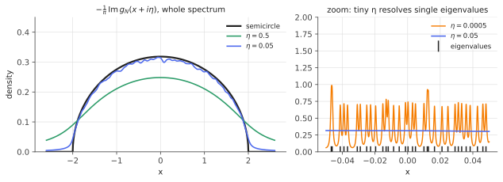

# The Stieltjes transform & the resolvent

!!! tldr "TL;DR"
    The Stieltjes transform $g(z) = \int\frac{\rho(x)}{z - x}\,dx$ encodes a spectral density as an analytic function off the real line. For a matrix, it is the normalized
    trace of the **resolvent**, $g_N(z) = \frac1N\tr(z - A)^{-1}$. The density comes back from the imaginary part, $\rho(x) = -\frac1\pi\lim_{\eta\downarrow0}\operatorname{Im}g(x+i\eta)$.
    Convergence of spectra is equivalent to pointwise convergence of $g$. Resolvents also have algebraic identities (Schur complements, quadratic-form
    concentration) that turn random-matrix problems into **fixed-point equations for $g$**. This is the main computational tool of the RMT track.

## Why care?

Suppose you want the eigenvalue distribution of a large random matrix, such as a sample covariance, a Wigner matrix, or a neural-network Hessian. Diagonalizing
symbolically is hopeless. Moments ($\frac1N\tr A^k$) are computable in principle, but they lead to messy combinatorics and don't always determine the
distribution.

The Stieltjes transform is the way out. It packages all moments into one analytic function, it is stable under limits, and for the matrices we care about it
satisfies a **simple algebraic equation** that you can solve by hand. The semicircle law, the Marchenko–Pastur law, free convolutions, the BBP transition,
covariance cleaning and the deterministic equivalents behind ridge regression's test error are all derived this way.

It is also practical. Smoothed spectral densities of enormous Hessians are computed numerically from resolvent-like quantities (stochastic Lanczos
quadrature), and the ridge regression of the previous notes is secretly a Stieltjes transform evaluated at $z = -\lambda$ (Exercise 4).

## Building blocks

**Definition.** For a probability density (or measure) $\rho$ on $\R$ and $z\in\mathbb C\setminus\operatorname{supp}\rho$,

$$
g(z) = \int\frac{\rho(x)}{z - x}\,dx .
$$

(Some authors use $m(z) = \int\frac{\rho(x)}{x - z}dx = -g(z)$. We follow the convention of Bouchaud & Potters, which matches the matrix formula below.)

**For a symmetric matrix.** If $A$ has eigenvalues $\lambda_1,\dots,\lambda_N$ and empirical spectral distribution $\rho_N = \frac1N\sum_i\delta_{\lambda_i}$, then

$$
g_N(z) = \frac1N\sum_{i=1}^N\frac{1}{z - \lambda_i} = \frac1N\tr\,G(z),\qquad G(z) = (zI - A)^{-1}\;\;\text{(the resolvent)}.
$$

The trace of the resolvent can often be computed or estimated **without diagonalizing**, using linear solves and random probe vectors, and that is what makes it practical.

**Basic properties.**

1. *Analytic* in $z$ off the support, with poles at the eigenvalues for a finite matrix.
2. *Behaviour at infinity:* $g(z)\sim 1/z$ as $|z|\to\infty$, from the total mass $1$.
3. *Moment expansion:* for $|z|$ larger than the support, expanding $\frac1{z-x} = \sum_k x^k/z^{k+1}$ gives

    $$
    g(z) = \sum_{k\ge0}\frac{m_k}{z^{k+1}},\qquad m_k = \int x^k\rho(x)\,dx .
    $$

    So $g$ is a generating function of the moments.
4. *Sign:* $\operatorname{Im}g(z) < 0$ when $\operatorname{Im}z > 0$, and $|g(z)|\le1/\operatorname{Im}z$ (Exercise 2).

## The main results

### Inversion: getting the density back

!!! theorem "Theorem (Stieltjes inversion)"
    For $x$ where $\rho$ is continuous,

    $$
    \rho(x) = -\frac1\pi\lim_{\eta\downarrow0}\operatorname{Im}\,g(x + i\eta).
    $$

    More generally, for every $\eta > 0$, $-\frac1\pi\operatorname{Im}g(x + i\eta) = (\rho * P_\eta)(x)$, where $P_\eta(u) = \frac1\pi\frac{\eta}{u^2 + \eta^2}$ is the Cauchy (Lorentzian) kernel.

**Proof.** $\operatorname{Im}\frac{1}{x + i\eta - y} = \frac{-\eta}{(x-y)^2 + \eta^2}$, so

$$
-\frac1\pi\operatorname{Im}g(x+i\eta) = \int\rho(y)\,\frac1\pi\frac{\eta}{(x-y)^2+\eta^2}\,dy = (\rho * P_\eta)(x).
$$

$P_\eta$ is a probability density that concentrates at $0$ as $\eta\to0$ (an approximate identity), so the convolution converges to $\rho(x)$ at continuity points. $\square$

The parameter $\eta$ is a **resolution**. For a finite matrix, $-\frac1\pi\operatorname{Im}g_N(x+i\eta)$ is a sum of Lorentzian bumps of width $\eta$, one per eigenvalue. Too large an $\eta$ blurs the density,
and too small an $\eta$ (below the eigenvalue spacing, $\sim1/N$ in the bulk) resolves individual eigenvalues. The useful window is $1/N\ll\eta\ll1$.

{ .fig }

### Convergence: limits of spectra are limits of $g$

!!! theorem "Theorem (Stieltjes continuity)"
    Let $\rho_N$, $\rho$ be probability measures on $\R$. Then $\rho_N\to\rho$ weakly if and only if $g_N(z)\to g(z)$ for every $z$ with $\operatorname{Im}z > 0$. For random $\rho_N$, convergence
    of $g_N(z)$ almost surely (or in probability) for each $z$ gives almost sure (or in probability) weak convergence.

Proving a spectral limit law therefore comes down to two steps: (i) show $g_N(z)$ concentrates around its mean, and (ii) find an equation that the limit $g(z)$ must satisfy.

### The algebraic toolkit

Three identities do almost all the work.

**1. Resolvent identity.** For any two matrices, $G_A(z) - G_B(z) = G_A(z)\,(A - B)\,G_B(z)$. It controls how $g$ responds to perturbations, and it implies that a rank-one change moves
$g_N$ by only $O(1/(N\eta))$. For instance, removing one row and column barely changes $g_N$.

**2. Schur complement.** Split $A = \begin{pmatrix}a_{11} & a^\top\\ a & A^{(1)}\end{pmatrix}$, with $A^{(1)}$ the matrix with the first row and column removed. The block-inverse formula gives

$$
G_{11}(z) = \frac{1}{z - a_{11} - a^\top\big(z - A^{(1)}\big)^{-1}a} .
$$

A diagonal entry of the resolvent is expressed through a **quadratic form** in the resolvent of a smaller matrix.

**3. Quadratic forms concentrate.** If $a$ has independent mean-zero entries of variance $\sigma^2/N$ and is independent of $B$, then

$$
a^\top B\,a\;\approx\;\frac{\sigma^2}{N}\tr B,
$$

with fluctuations $O(\|B\|_F/N)$. This is a consequence of [high-dimensional concentration](high-dim-geometry.md): a random vector "sees" only the trace of $B$.

Combining 2 and 3: for a Wigner matrix, $G_{11}\approx 1/(z - g(z))$. Averaging over all diagonal entries gives the closed equation $g = 1/(z - g)$, i.e.
$g^2 - zg + 1 = 0$, whose solution is the **semicircle law**. The full derivation is in the [next RMT note](wigner-semicircle.md). The same three identities give the
Marchenko–Pastur law and its generalizations.

### Worked transforms

| density $\rho$ | $g(z)$ |
|---|---|
| point mass at $a$ | $\dfrac{1}{z-a}$ |
| $\frac12(\delta_{-1} + \delta_{1})$ | $\dfrac{z}{z^2-1}$ |
| semicircle on $[-2,2]$: $\frac{1}{2\pi}\sqrt{4-x^2}$ | $\dfrac{z - \sqrt{z^2-4}}{2}$ |
| uniform on $[-1,1]$ | $\dfrac12\log\dfrac{z+1}{z-1}$ |

The branch of the square root must be chosen so that $g(z)\sim1/z$ at infinity. Numerically, write $\sqrt{z^2-4} = \sqrt{z-2}\,\sqrt{z+2}$ with principal branches.

## Examples

### Checking the semicircle transform on a random matrix

```python
import numpy as np
rng = np.random.default_rng(0)
N = 1000
G = rng.standard_normal((N, N))
H = (G + G.T) / np.sqrt(2 * N)                  # Wigner matrix, spectrum ≈ [-2, 2]
lam = np.linalg.eigvalsh(H)

def g_emp(z):                                   # (1/N) tr (z - H)^{-1}
    return np.mean(1.0 / (z - lam))

def g_sc(z):                                    # semicircle: root of g^2 - z g + 1 = 0 with g ~ 1/z
    r = np.sqrt(z - 2) * np.sqrt(z + 2)         # branch with r ~ z at infinity
    return (z - r) / 2

for z in [3.0 + 0j, 0.5 + 0.1j, -1.0 + 0.5j]:
    print(f"z = {z:.1f}:  empirical g = {g_emp(z):.4f}   semicircle g = {g_sc(z):.4f}")

# Recover the density at x = 0 by Stieltjes inversion, for several eta.
for eta in [0.5, 0.1, 0.01]:
    print(f"eta = {eta:<5}  -Im g(0 + i eta)/pi = {-g_emp(1j * eta).imag / np.pi:.4f}   (semicircle density at 0: {1/np.pi:.4f})")
# z = 3.0+0.0j:  empirical g = 0.3820+0.0000j   semicircle g = 0.3820+0.0000j
# z = 0.5+0.1j:  empirical g = 0.2367-0.9225j   semicircle g = 0.2371-0.9196j
# z = -1.0+0.5j:  empirical g = -0.3628-0.6623j   semicircle g = -0.3629-0.6618j
# eta = 0.5    -Im g(0 + i eta)/pi = 0.2484   (semicircle density at 0: 0.3183)
# eta = 0.1    -Im g(0 + i eta)/pi = 0.3032   (semicircle density at 0: 0.3183)
# eta = 0.01   -Im g(0 + i eta)/pi = 0.3422   (semicircle density at 0: 0.3183)
```

Far from the real axis the empirical and limiting transforms agree to 3–4 digits, because $g$ averages over all eigenvalues and is very stable. Close to the axis
the estimate is a trade-off. $\eta = 0.5$ is biased downward by smoothing, while $\eta = 0.01$ is only about three eigenvalue spacings wide, so it is noisy
and happens to overshoot. With $N = 1000$, $\eta\approx0.05$–$0.1$ is a good compromise, consistent with $1/N\ll\eta\ll1$.

## Exercises

!!! question "Exercise 1 · warm-up: two atoms"
    Compute $g(z)$ for $\rho = \frac12(\delta_{-1} + \delta_1)$, and check the moment expansion against the moments of $\rho$. Then apply the inversion formula
    to $g(x + i\eta)$ and describe what you get as $\eta\to0$.

    ??? success "Solution"
        $g(z) = \frac12\big(\frac1{z+1} + \frac1{z-1}\big) = \frac{z}{z^2-1} = \frac1z\cdot\frac1{1 - z^{-2}} = \sum_{k\ge0}z^{-2k-1}$. So $m_{2k} = 1$ and $m_{2k+1} = 0$, matching
        $\E X^{2k} = 1$ for $X = \pm1$. Inversion gives $\frac12[P_\eta(x+1) + P_\eta(x-1)]$: two Lorentzians of width $\eta$ that sharpen into the two atoms as $\eta\to0$.

!!! question "Exercise 2 · sign and size"
    Show that $\operatorname{Im}g(z) < 0$ for $\operatorname{Im}z > 0$ and that $|g(z)|\le1/\operatorname{Im}z$. Why does this make $g$ a good object to take limits of (compared, say, with moments)?

    ??? success "Solution"
        For $z = u + i\eta$: $\operatorname{Im}\frac{1}{z - x} = \frac{-\eta}{(u-x)^2+\eta^2} < 0$, and integrating against $\rho\ge0$ keeps the sign. Also $|z - x|\ge\eta$, so
        $|g(z)|\le\int\frac{\rho(x)}{|z-x|}dx\le\frac1\eta$.

        So $g_N(z)$ is uniformly bounded for each fixed $z$ off the axis, whatever the matrix. Bounded analytic functions have convergent subsequences (Montel's theorem), and
        the limit is again a Stieltjes transform. Moments, by contrast, can be unbounded and need not determine the distribution. The bound also makes concentration
        arguments easy.

!!! question "Exercise 3 · Catalan numbers from a quadratic"
    The semicircle transform satisfies $g^2 - zg + 1 = 0$. Plug in $g = \sum_km_kz^{-k-1}$ and show that the even moments satisfy $m_{2k+2} = \sum_{j=0}^{k}m_{2j}m_{2k-2j}$ with $m_0 = 1$,
    so $m_{2k}$ are the Catalan numbers $1, 1, 2, 5, 14, \dots$

    ??? success "Solution"
        $g^2 = \sum_{a,b}m_am_bz^{-a-b-2}$ and $zg = \sum_km_kz^{-k}$. Matching the coefficient of $z^{-n}$ in $zg = g^2 + 1$ gives $m_0 = 1$ (from $n = 0$), $m_1 = 0$ (from $n = 1$), and for $n\ge2$:
        $m_n = \sum_{a+b=n-2}m_am_b$. Odd moments vanish by induction, and for even $n = 2k+2$: $m_{2k+2} = \sum_{j=0}^km_{2j}m_{2k-2j}$, which is the Catalan recursion.
        Moments of the semicircle count non-crossing pairings, which is the combinatorial (moment-method) proof of Wigner's law.

!!! question "Exercise 4 · ridge regression is a Stieltjes transform"
    Let $S = X^\top X$ ($p\times p$) with eigenvalues $d_1^2,\dots,d_p^2$ and $g_S(z) = \frac1p\tr(z - S)^{-1}$. Show that the ridge effective degrees of freedom satisfy

    $$
    \operatorname{df}(\lambda) = \sum_j\frac{d_j^2}{d_j^2+\lambda} = p\,\big(1 + \lambda\,g_S(-\lambda)\big).
    $$

    Conclude that if the spectrum of $S$ has a deterministic limit, so does $\operatorname{df}(\lambda)/p$.

    ??? success "Solution"
        $g_S(-\lambda) = \frac1p\sum_j\frac{1}{-\lambda - d_j^2} = -\frac1p\sum_j\frac1{d_j^2+\lambda}$. Then $p(1 + \lambda g_S(-\lambda)) = \sum_j\big(1 - \frac{\lambda}{d_j^2+\lambda}\big) = \sum_j\frac{d_j^2}{d_j^2+\lambda}$. ✓

        Ridge quantities are traces of $(S + \lambda)^{-1}$ and its powers, i.e. Stieltjes transforms (and derivatives) evaluated on the **negative real axis**, where everything is
        smooth and needs no $\eta\to0$ limit. When $X$ has i.i.d. rows, $S/n$ follows a [Marchenko–Pastur](marchenko-pastur.md)-type law, which is how one obtains exact formulas
        for ridge's risk in high dimensions ([deterministic equivalents](deterministic-equivalents.md)).

!!! question "Exercise 5 · stretch: the trace of a resolvent without diagonalizing"
    Let $v$ have i.i.d. entries $\pm1$ (Rademacher). Show that $\E[v^\top Bv] = \tr B$ for any matrix $B$, and $\Var(v^\top Bv) = 2\sum_{i\neq j}B_{ij}^2$ for symmetric $B$ (Hutchinson's estimator).
    Explain how to estimate $g_N(z)$ for a $10^6\times10^6$ sparse matrix (or a Hessian you can only multiply by) using a few linear solves.

    ??? success "Solution"
        $v^\top Bv = \sum_{i,j}B_{ij}v_iv_j$ and $\E v_iv_j = \delta_{ij}$, so the expectation is $\sum_iB_{ii}$. For the variance, the diagonal terms are constant ($v_i^2 = 1$), and
        $\Var\big(\sum_{i\neq j}B_{ij}v_iv_j\big) = \sum_{i\neq j}\sum_{k\neq l}B_{ij}B_{kl}\E[v_iv_jv_kv_l]$. The expectation is $1$ iff $\{k,l\} = \{i,j\}$, so this equals $2\sum_{i\neq j}B_{ij}^2$.

        To estimate $g_N(z) = \frac1N\tr(z - A)^{-1}$: draw $m$ probe vectors $v$, solve $(z - A)w = v$ by an iterative method that only needs matrix–vector products (for example GMRES/MINRES,
        or conjugate gradients on the normal equations), and average $v^\top w/N$. Stochastic Lanczos quadrature refines this idea and gives the spectral density at all $x$ at once.
        Ghorbani, Krishnan & Xiao (2019) used it to plot the full Hessian spectrum of ImageNet-scale networks.

## Where it shows up

- **Every RMT limit law in this track.** Semicircle, Marchenko–Pastur, free convolutions (via the R- and S-transforms, which are functional inverses of $g$), spiked models
  and outlier locations, and the edge behaviour behind Tracy–Widom.
- **Covariance cleaning.** The Ledoit–Péché formula and the [rotationally invariant estimators](rotational-invariant-estimators.md) of Bouchaud–Potters compute the optimal
  shrunk eigenvalues from $g$ evaluated just below each sample eigenvalue, $g(\lambda_i - i\eta)$, estimated directly from data.
- **Spectral analysis of deep networks.** Hessian and Fisher spectra of large models are estimated with stochastic Lanczos quadrature and kernel polynomial methods,
  which are numerical versions of Stieltjes inversion. The bulk-plus-outliers shapes they reveal guide optimizer and learning-rate design.
- **High-dimensional regression theory.** The test error of ridge, random features and kernel regression for $p, n\to\infty$ is a rational function of Stieltjes transforms at
  $z = -\lambda$ (Exercise 4), the starting point of the double-descent analyses.
- **Physics and graphs.** $G(z)$ is the Green's function. Local densities of states, random walks on graphs (where $G_{ii}(z)$ generates return probabilities) and linear-response
  theory are all resolvent computations.

## Further reading

- J.-P. Bouchaud & M. Potters, *A First Course in Random Matrix Theory* (2020), Ch. 2–3. The conventions used here.
- T. Tao, *Topics in Random Matrix Theory*, §2.4. The Stieltjes-transform proof of the semicircle law.
- Z. Bai & J. Silverstein, *Spectral Analysis of Large Dimensional Random Matrices*, Ch. 2–3.
- B. Ghorbani, S. Krishnan & Y. Xiao, "An investigation into neural net optimization via Hessian eigenvalue density" (ICML 2019).
