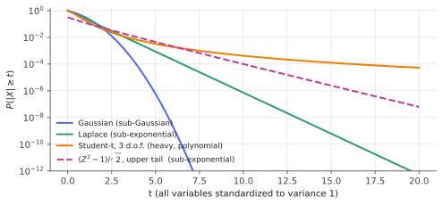

# Sub-Gaussian & sub-exponential tails

!!! tldr "TL;DR"
    A random variable is **sub-Gaussian** if its tails decay at least as fast as a Gaussian's, $\P(|X|\ge t)\le2e^{-t^2/K^2}$, and **sub-exponential** if they decay at least
    exponentially, $\P(|X|\ge t)\le2e^{-t/K}$. Tail bounds, moment growth and moment-generating-function bounds turn out to be equivalent ways of saying the same thing.
    The classes are closed under the right operations: sums of independent sub-Gaussians are sub-Gaussian, and squares and products of sub-Gaussians are sub-exponential.
    The maximum of $n$ sub-Gaussians is only $\sigma\sqrt{2\log n}$. These facts are the raw material of every concentration inequality in this track.

## Why care?

Concentration results such as "the sample mean is within $\varepsilon$ of the truth", "random projections preserve distances", or "the sample covariance is close to the
true one in operator norm" are usually proved first for Gaussians. In practice data are bounded, discrete, skewed or mildly heavy-tailed. We need a class of distributions
that behaves *like* the Gaussian for concentration purposes and is easy to verify.

The sub-Gaussian class is that class. It includes bounded variables (Rademacher signs, Bernoulli labels, clipped gradients), Gaussian mixtures and much more. Sub-exponential
variables cover the next tier: squares and products, for example the entries of a sample covariance or $\|x\|^2$. Knowing which class your quantities belong to tells you which
concentration inequality applies, how many samples you need, and when to worry. **Financial returns, gradient noise in SGD and LLM activation outliers are often in neither class**,
which is why heavy tails need their own tools.

## Building blocks

**The Chernoff method.** For any $\lambda > 0$, Markov's inequality applied to $e^{\lambda X}$ gives

$$
\P(X\ge t)\le e^{-\lambda t}\,\E e^{\lambda X},\qquad\text{so}\qquad\P(X\ge t)\le\inf_{\lambda>0}e^{-\lambda t}M_X(\lambda).
$$

Tail bounds reduce to bounding the moment generating function $M_X(\lambda) = \E e^{\lambda X}$.

**The Gaussian benchmark.** For $Z\sim N(0,\sigma^2)$, $M_Z(\lambda) = e^{\lambda^2\sigma^2/2}$. Chernoff gives $\P(Z\ge t)\le\inf_\lambda e^{-\lambda t + \lambda^2\sigma^2/2} = e^{-t^2/(2\sigma^2)}$, with
the optimum at $\lambda = t/\sigma^2$. This is within a polynomial factor of the truth ($\P(Z\ge t)\sim\frac{\sigma}{t\sqrt{2\pi}}e^{-t^2/2\sigma^2}$).

**Moments.** For $Z\sim N(0,1)$, $(\E|Z|^p)^{1/p}\asymp\sqrt p$. The $L^p$ norms grow like $\sqrt p$. For an exponential variable they grow like $p$, and for a Student-$t$ with $\nu$ degrees of freedom they are infinite once $p\ge\nu$.

## The main results

### Four equivalent definitions

!!! theorem "Theorem (characterizations of sub-Gaussianity)"
    For a random variable $X$, the following are equivalent, with constants $K_1,\dots,K_4$ that differ from each other by at most an absolute factor:

    1. **Tails:** $\P(|X|\ge t)\le2\exp(-t^2/K_1^2)$ for all $t\ge0$.
    2. **Moments:** $(\E|X|^p)^{1/p}\le K_2\sqrt p$ for all $p\ge1$.
    3. **Orlicz:** $\E\exp(X^2/K_3^2)\le2$.
    4. **MGF** (if $\E X = 0$): $\E e^{\lambda X}\le\exp(\lambda^2K_4^2)$ for all $\lambda\in\R$.

    The smallest $K_3$ is the **sub-Gaussian norm** $\|X\|_{\psi_2}$. We say $X$ is **$\sigma$-sub-Gaussian** if $\E e^{\lambda(X - \E X)}\le e^{\lambda^2\sigma^2/2}$, the Gaussian MGF with variance proxy $\sigma^2$.

**Proof of the key implications.**

*4 ⇒ 1 (Chernoff).* $\P(X\ge t)\le e^{-\lambda t + \lambda^2K_4^2}$. Optimize at $\lambda = t/(2K_4^2)$ to get $e^{-t^2/(4K_4^2)}$, and do the same for $-X$.

*1 ⇒ 2 (integrate the tail).* Using $\E|X|^p = \int_0^\infty pt^{p-1}\P(|X|\ge t)\,dt$:

$$
\E|X|^p\le2p\int_0^\infty t^{p-1}e^{-t^2/K_1^2}dt = pK_1^p\,\Gamma(p/2)\le pK_1^p(p/2)^{p/2},
$$

and taking the $p$-th root gives $(\E|X|^p)^{1/p}\le CK_1\sqrt p$.

*2 ⇒ 4 (Taylor-expand the MGF).* With $\E X = 0$, $\E e^{\lambda X} = 1 + \sum_{p\ge2}\frac{\lambda^p\E X^p}{p!}\le1 + \sum_{p\ge2}\frac{(|\lambda|K_2\sqrt p)^p}{p!}$. Using $p!\ge(p/e)^p$, the sum is
dominated by a geometric-type series in $\lambda^2K_2^2$, giving $\E e^{\lambda X}\le e^{C\lambda^2K_2^2}$ for small $|\lambda|K_2$. Large $|\lambda|$ needs a separate (easy) argument. $\square$

**Examples.** Gaussians, with $\|X\|_{\psi_2}\asymp\sigma$. **Any bounded variable**: by Hoeffding's lemma, if $a\le X\le b$ then $X - \E X$ is $\frac{b-a}{2}$-sub-Gaussian (proved in the
[next note](hoeffding-bernstein.md)). Rademacher signs, with $\E e^{\lambda\varepsilon} = \cosh\lambda\le e^{\lambda^2/2}$. Not sub-Gaussian: exponential, Poisson, Student-$t$, and log-normal variables.

### Sums: independence adds variance proxies

If $X_1,\dots,X_n$ are independent, mean zero and $\sigma_i$-sub-Gaussian, then by independence the MGFs multiply:

$$
\E e^{\lambda\sum_ia_iX_i} = \prod_i\E e^{\lambda a_iX_i}\le\prod_ie^{\lambda^2a_i^2\sigma_i^2/2} = e^{\lambda^2\sum_ia_i^2\sigma_i^2/2}.
$$

So $\sum_ia_iX_i$ is sub-Gaussian with variance proxy $\sum_ia_i^2\sigma_i^2$, exactly like a Gaussian. With Chernoff:

$$
\P\Big(\Big|\sum_ia_iX_i\Big|\ge t\Big)\le2\exp\Big(-\frac{t^2}{2\sum_ia_i^2\sigma_i^2}\Big)\qquad\text{(general Hoeffding inequality)}.
$$

For the sample mean of $n$ i.i.d. $\sigma$-sub-Gaussian variables: $\P(|\bar X - \mu|\ge t)\le2e^{-nt^2/(2\sigma^2)}$. The deviation is $O(\sigma/\sqrt n)$ with Gaussian-quality tails, **non-asymptotically**.

### Maxima: only $\sqrt{2\log n}$

!!! theorem "Theorem (maximum of sub-Gaussians)"
    If $X_1,\dots,X_n$ are mean-zero and $\sigma$-sub-Gaussian (**not necessarily independent**), then

    $$
    \E\max_{i\le n}X_i\le\sigma\sqrt{2\log n},\qquad\P\Big(\max_{i\le n}X_i\ge\sigma\sqrt{2\log n} + t\Big)\le e^{-t^2/(2\sigma^2)}.
    $$

**Proof.** For $\lambda > 0$, by Jensen's inequality and then bounding the max by the sum,

$$
e^{\lambda\E\max_iX_i}\le\E e^{\lambda\max_iX_i}\le\sum_i\E e^{\lambda X_i}\le n\,e^{\lambda^2\sigma^2/2}.
$$

Take logs: $\E\max_iX_i\le\frac{\log n}{\lambda} + \frac{\lambda\sigma^2}{2}$. Choosing $\lambda = \sqrt{2\log n}/\sigma$ gives $\sigma\sqrt{2\log n}$. The tail bound follows from a union bound with Chernoff. $\square$

This is why **union bounds are cheap**. Controlling $n$ events costs only a $\sqrt{\log n}$ factor, so you can afford to control exponentially many things at once (all pairwise distances
in [Johnson–Lindenstrauss](johnson-lindenstrauss.md), all points of a net on the sphere in matrix concentration, all hypotheses in a finite class in learning theory).

### Sub-exponential: the next tier

$X$ (mean zero) is **sub-exponential** with parameters $(\nu, b)$ if $\E e^{\lambda X}\le e^{\lambda^2\nu^2/2}$ for $|\lambda|\le1/b$. The MGF is Gaussian-like only near $0$. Chernoff then gives a **two-regime tail**:

$$
\P(X\ge t)\le\exp\Big(-\min\Big\{\frac{t^2}{2\nu^2},\,\frac{t}{2b}\Big\}\Big):
$$

Gaussian-like for small deviations ($t\le\nu^2/b$) and exponential for large ones. Equivalent forms parallel the theorem above, with moments $\lesssim Kp$ and $\|X\|_{\psi_1} = \inf\{K : \E e^{|X|/K}\le2\}$.

The key closure property: **if $X, Y$ are sub-Gaussian then $XY$ is sub-exponential**, with $\|XY\|_{\psi_1}\le\|X\|_{\psi_2}\|Y\|_{\psi_2}$. In particular $X^2$ is sub-exponential. The canonical example is
$Z^2 - 1$ for $Z\sim N(0,1)$. Its MGF $\frac{e^{-\lambda}}{\sqrt{1-2\lambda}}$ blows up at $\lambda = 1/2$, so it cannot be sub-Gaussian, but it is sub-exponential with $(\nu,b) = (2,4)$ (Exercise 4). Sample covariances, squared norms and
chi-square statistics all live here, and their concentration is governed by **Bernstein's inequality** ([next note](hoeffding-bernstein.md)).

{ .fig }

## Examples

### Maxima of many variables

```python
import numpy as np
rng = np.random.default_rng(0)

# Expected maximum of n sub-Gaussian(σ=1) variables vs the bound sqrt(2 log n).
for n in [10, 100, 1000, 10000]:
    gauss = rng.standard_normal((2000, n)).max(axis=1).mean()
    rade = rng.choice([-1.0, 1.0], size=(2000, n, 16)).sum(axis=2).max(axis=1).mean() / 4   # sums of 16 signs / 4: 1-sub-Gaussian
    t3 = (rng.standard_t(3, size=(2000, n)) / np.sqrt(3)).max(axis=1).mean()                 # variance 1, but heavy-tailed
    print(f"n = {n:5d}   bound {np.sqrt(2 * np.log(n)):.2f}   Gaussian {gauss:.2f}   Rademacher sum {rade:.2f}   Student-t(3) {t3:.2f}")
# n =    10   bound 2.15   Gaussian 1.53   Rademacher sum 1.52   Student-t(3) 1.42
# n =   100   bound 3.03   Gaussian 2.50   Rademacher sum 2.43   Student-t(3) 3.68
# n =  1000   bound 3.72   Gaussian 3.24   Rademacher sum 3.05   Student-t(3) 8.09
# n = 10000   bound 4.29   Gaussian 3.85   Rademacher sum 3.53   Student-t(3) 17.42
```

All three variables have variance 1. The two sub-Gaussian ones respect the $\sqrt{2\log n}$ bound, which is asymptotically tight for Gaussians. The Student-$t$ maximum grows like $n^{1/3}$, a
polynomial rate. **Variance alone tells you nothing about extremes. The tail class does.** That matters for daily returns (Student-$t$-like with 3–5 degrees of freedom), where "6-sigma" days
happen every few years instead of once in the life of the universe.

## Exercises

!!! question "Exercise 1 · warm-up: Rademacher signs"
    Show that $\cosh\lambda\le e^{\lambda^2/2}$ for all $\lambda$, so a Rademacher variable is $1$-sub-Gaussian. Deduce $\P(|\varepsilon_1 + \dots + \varepsilon_n|\ge t)\le2e^{-t^2/(2n)}$.

    ??? success "Solution"
        Compare Taylor series: $\cosh\lambda = \sum_k\frac{\lambda^{2k}}{(2k)!}$ and $e^{\lambda^2/2} = \sum_k\frac{\lambda^{2k}}{2^kk!}$. Since $(2k)!\ge2^kk!$ (the product $(2k)(2k-1)\cdots(k+1)\ge2^k$), the claim holds termwise. Sums add variance proxies:
        $\sum\varepsilon_i$ is $\sqrt n$-sub-Gaussian, and Chernoff gives the bound. A simple random walk is within $O(\sqrt{n\log(1/\delta)})$ of $0$ with probability $1-\delta$.

!!! question "Exercise 2 · tails to moments"
    Suppose $\P(|X|\ge t)\le2e^{-t^2}$. Show $\E X^2\le2$ and $\E X^4\le4$, and in general $\E|X|^p\le p\,\Gamma(p/2)$.

    ??? success "Solution"
        $\E|X|^p = \int_0^\infty pt^{p-1}\P(|X|\ge t)dt\le2p\int_0^\infty t^{p-1}e^{-t^2}dt$. Substituting $u = t^2$: $2p\cdot\frac12\int u^{p/2-1}e^{-u}du = p\Gamma(p/2)$.
        $p = 2$: $2\Gamma(1) = 2$. $p = 4$: $4\Gamma(2) = 4$. Since $\Gamma(p/2)\le(p/2)^{p/2}$, $(\E|X|^p)^{1/p}\lesssim\sqrt p$, which is characterization 2.

!!! question "Exercise 3 · maxima of absolute values"
    Using the theorem, bound $\E\max_{i\le n}|X_i|$ for mean-zero $\sigma$-sub-Gaussian $X_i$. Apply it to $\|g\|_\infty$ for $g\sim N(0,I_d)$, and compare with $\|g\|_2\approx\sqrt d$.

    ??? success "Solution"
        $\max_i|X_i| = \max(X_1,\dots,X_n,-X_1,\dots,-X_n)$, a maximum of $2n$ sub-Gaussians, so $\E\max_i|X_i|\le\sigma\sqrt{2\log(2n)}$. For a Gaussian vector: $\|g\|_\infty\lesssim\sqrt{2\log(2d)}$, while
        $\|g\|_2\approx\sqrt d$. A random vector's energy is spread out ("delocalized"): no coordinate is much bigger than $\sqrt{\log d}$. Compressed sensing and the [LASSO](lasso.md) analysis use exactly this bound,
        $\|X^\top\varepsilon\|_\infty\lesssim\sigma\sqrt{n\log p}$, to choose the penalty level.

!!! question "Exercise 4 · the chi-square is sub-exponential"
    For $Z\sim N(0,1)$, show $\E e^{\lambda(Z^2-1)} = \frac{e^{-\lambda}}{\sqrt{1-2\lambda}}$ for $\lambda < 1/2$, and that this is at most $e^{2\lambda^2}$ for $|\lambda|\le1/4$. Conclude a tail bound for $\frac1n\sum_iZ_i^2 - 1$.

    ??? success "Solution"
        $\E e^{\lambda Z^2} = \int\frac{1}{\sqrt{2\pi}}e^{-(1-2\lambda)z^2/2}dz = (1-2\lambda)^{-1/2}$. For the bound, take logs: $f(\lambda) = -\lambda - \frac12\log(1-2\lambda) = \sum_{k\ge2}\frac{(2\lambda)^k}{2k}$.
        Writing $k = j+2$, $f(\lambda) = \lambda^2\sum_{j\ge0}(2\lambda)^j\frac{2}{j+2}$. For $|\lambda|\le1/4$, $|2\lambda|\le1/2$ and $\frac{2}{j+2}\le1$, so
        $f(\lambda)\le\lambda^2\sum_{j\ge0}2^{-j} = 2\lambda^2$. So $Z^2 - 1$ is sub-exponential with $(\nu, b) = (2, 4)$.

        A sum of $n$ independent copies is sub-exponential with $(2\sqrt n, 4)$, and with the two-regime tail,
        $\P\big(\frac1n\sum Z_i^2 - 1\ge t\big)\le\exp\big(-n\min(t^2/8, t/8)\big)$. This is the concentration of $\|g\|^2/d$ used in the [Gaussian annulus](high-dim-geometry.md).

!!! question "Exercise 5 · stretch: products of sub-Gaussians"
    Show that if $X, Y$ are sub-Gaussian (not necessarily independent), then $\|XY\|_{\psi_1}\le\|X\|_{\psi_2}\|Y\|_{\psi_2}$. Hint: use $|xy|\le\frac{x^2+y^2}{2}$ after rescaling, then Cauchy–Schwarz or convexity of $\exp$.

    ??? success "Solution"
        By homogeneity assume $\|X\|_{\psi_2} = \|Y\|_{\psi_2} = 1$, so $\E e^{X^2}\le2$ and $\E e^{Y^2}\le2$. Then
        $\E e^{|XY|}\le\E e^{(X^2+Y^2)/2} = \E\big[e^{X^2/2}e^{Y^2/2}\big]\le\frac12\E\big[e^{X^2} + e^{Y^2}\big]\le2$, using $ab\le\frac{a^2+b^2}2$ for $a = e^{X^2/2}$, $b = e^{Y^2/2}$. So $\|XY\|_{\psi_1}\le1$.

        Consequence: each term $x_{ij}x_{ik}$ of a sample covariance built from sub-Gaussian data is sub-exponential, which is why covariance estimation uses Bernstein-type (not Hoeffding-type)
        bounds, with the two regimes $\sqrt{p/n}$ and $p/n$.

## Where it shows up

- **Generalization bounds.** Uniform convergence over a hypothesis class uses sub-Gaussian concentration of empirical losses (Hoeffding for bounded losses) together with a union bound or
  chaining. The $\sqrt{\log|\mathcal H|/n}$ rate is the $\sqrt{2\log n}$ maximum in disguise. Rademacher complexity is literally the expected maximum of a Rademacher process.
- **Bandits and RL.** UCB and Thompson-sampling analyses assume sub-Gaussian rewards. The width of a confidence bonus $\sqrt{2\sigma^2\log(1/\delta)/n}$ comes straight from Hoeffding.
- **Random projections and sketching.** Gaussian or Rademacher sketching matrices are sub-Gaussian, and that is all the [Johnson–Lindenstrauss](johnson-lindenstrauss.md) proof needs, which is why sparse
  $\pm1$ sketches work as well as Gaussian ones.
- **Heavy tails in deep learning.** Stochastic-gradient noise often looks heavy-tailed (Şimşekli et al., 2019), and transformer activations contain extreme outlier features (Dettmers et al., 2022)
  that break naive 8-bit quantization. Gradient clipping and outlier-aware quantization are ways of handling variables that aren't sub-Gaussian.
- **Finance.** Daily equity returns have tail exponents around 3–5, so sub-Gaussian risk models underestimate crash probabilities by orders of magnitude, as the Student-$t$ column above shows.
  This is a recurring theme in [heavy-tailed RMT](heavy-tailed-rmt.md) and robust statistics ([M-estimators](robust-m-estimators.md)).

## Further reading

- R. Vershynin, *High-Dimensional Probability* (2018), Ch. 2. The standard modern treatment, with all the equivalences.
- M. Wainwright, *High-Dimensional Statistics* (2019), Ch. 2.
- S. Boucheron, G. Lugosi & P. Massart, *Concentration Inequalities* (2013).
