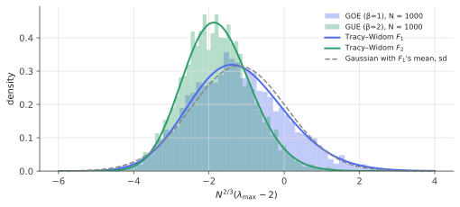

# Tracy–Widom: fluctuations at the edge

!!! tldr "TL;DR"
    The largest eigenvalue of a large random matrix sits at the spectral edge, give or take a fluctuation of order $N^{-2/3}$, much smaller than the $N^{-1/2}$ of the CLT. Rescaled, it follows the **Tracy–Widom distribution** $F_\beta$, a skewed, non-Gaussian law
    defined by a Fredholm determinant (or a Painlevé II equation). It is universal: GOE/GUE, Wigner matrices, and sample covariance matrices (with Johnstone's explicit centering and scaling) all give it. It is the correct null distribution for "is the top eigenvalue signal?", and it shows that the naive
    threshold "exceeds the MP edge" has a false-positive rate around 15%.

## Why care?

The [Marchenko–Pastur](marchenko-pastur.md) note gave a noise band $[\lambda_-,\lambda_+]$ for sample covariance eigenvalues and suggested "eigenvalues above $\lambda_+$ are signal". For finite $N$ the largest noise eigenvalue fluctuates around $\lambda_+$. Sometimes it lands above,
sometimes below. To make a **test** (PCA: how many components are real? finance: is this the market mode or a sector or noise? ML: is this outlier in the Hessian or weight spectrum significant?) you need the **distribution** of the largest eigenvalue under the null.

That distribution turned out to be one of the most remarkable objects in probability. Tracy and Widom found it in 1994, and since then it has appeared in the longest increasing subsequence of a random permutation, in random growth models (KPZ universality), in the totally asymmetric exclusion process, in
polymers and in queues. Johnstone (2001) brought it to statistics.

## Building blocks

**Why $N^{-2/3}$?** Near the upper edge, the semicircle density behaves like $\rho(x)\approx\frac1\pi\sqrt{2 - x}$ (in the $[-2,2]$ normalization). The expected number of eigenvalues within $\varepsilon$ of the edge is

$$
N\int_{2-\varepsilon}^2\rho(x)\,dx\approx N\cdot\tfrac{2}{3\pi}\varepsilon^{3/2}.
$$

The largest eigenvalue's typical distance from the edge is where this count is $O(1)$, i.e. $\varepsilon\sim N^{-2/3}$. Square-root vanishing at the edge is generic, so $N^{-2/3}$ is generic. (In the bulk the spacing is $1/N$, and the CLT scale for linear statistics would be $N^{-1/2}$. Edge statistics are a different regime.)

**Eigenvalue repulsion matters.** The $\lambda_i$ are strongly correlated (the [Coulomb gas](gaussian-ensembles.md)), so the maximum is not the maximum of independent variables, and Gumbel/Fréchet extreme-value theory doesn't apply. The repulsion from the bulk pushes the top eigenvalue's left tail to decay very fast,
$\sim e^{-|s|^3/12}$ (for $\beta = 2$). The right tail is lighter than Gaussian too, $\sim e^{-\frac43s^{3/2}}$.

## The main result

!!! theorem "Theorem (Tracy & Widom 1994, 1996)"
    For the Gaussian ensembles normalized so that the spectrum fills $[-2,2]$ ($\E|H_{ij}|^2 = 1/N$),

    $$
    N^{2/3}\big(\lambda_{\max} - 2\big)\;\Rightarrow\;\mathrm{TW}_\beta,\qquad\beta\in\{1, 2, 4\},
    $$

    where, for $\beta = 2$, $F_2(s) = \det(I - K_{\mathrm{Ai}})_{L^2(s,\infty)}$ with the Airy kernel $K_{\mathrm{Ai}}(x,y) = \frac{\mathrm{Ai}(x)\mathrm{Ai}'(y) - \mathrm{Ai}'(x)\mathrm{Ai}(y)}{x - y}$. Equivalently,

    $$
    F_2(s) = \exp\Big(-\int_s^\infty(x - s)\,q(x)^2\,dx\Big),\qquad q'' = sq + 2q^3,\quad q(s)\sim\mathrm{Ai}(s)\ (s\to\infty),
    $$

    with $q$ the Hastings–McLeod solution of Painlevé II. $F_1$ and $F_4$ have similar expressions. Universality holds for Wigner matrices with enough moments (Soshnikov; Erdős–Yau–Yin; Tao–Vu).

| | mean | std. dev. | skewness | 95% quantile |
|---|---|---|---|---|
| $\mathrm{TW}_1$ (real) | $-1.21$ | $1.27$ | $0.29$ | $0.98$ |
| $\mathrm{TW}_2$ (complex) | $-1.77$ | $0.90$ | $0.22$ | $-0.23$ |

Both distributions sit **below** zero on average: the largest eigenvalue is typically slightly inside the limiting edge, as we saw in the MP note.

### Sample covariance matrices (Johnstone)

For real Gaussian data $X\in\R^{N\times T}$ with identity covariance, let $\ell_1$ be the largest eigenvalue of $XX^\top$ (unnormalized). Johnstone (2001) showed that

$$
\frac{\ell_1 - \mu_{NT}}{\sigma_{NT}}\Rightarrow\mathrm{TW}_1,\qquad
\mu_{NT} = \big(\sqrt{T-1} + \sqrt N\big)^2,\quad
\sigma_{NT} = \big(\sqrt{T-1} + \sqrt N\big)\Big(\frac{1}{\sqrt{T-1}} + \frac1{\sqrt N}\Big)^{1/3},
$$

as $N, T\to\infty$ with $N/T$ fixed, and the approximation is already good for $N, T$ around 10. (The $-1$ is a finite-sample refinement. Use $T$ in place of $T-1$ if the mean is known.) This is the null distribution of **Roy's largest root** test, which tests for a spiked covariance against $\Sigma = I$.

### Computing $F_\beta$

Fredholm determinants can be computed to machine precision with a few lines of code (Bornemann, 2010). Discretize the integral operator with Gauss–Legendre quadrature on $(s, s + L)$ and take $\det(\delta_{ij} - \sqrt{w_i}K(x_i,x_j)\sqrt{w_j})$. For $\beta = 1$ a convenient kernel is $K_1(x,y) = \frac12\mathrm{Ai}\big(\frac{x+y}{2}\big)$. The code below does exactly this.

{ .fig }

## Examples

### A test for the largest eigenvalue

```python
import numpy as np
from scipy.special import airy
rng = np.random.default_rng(0)

def tw1_cdf(s, m=60, length=14.0):
    """Tracy–Widom (GOE) CDF via Bornemann's method: F1(s) = det(I - K) with K(x,y) = Ai((x+y)/2)/2 on (s, inf)."""
    x, w = np.polynomial.legendre.leggauss(m)
    x = s + (x + 1) * length / 2; w = w * length / 2
    K = 0.5 * airy((x[:, None] + x[None, :]) / 2)[0]
    return np.linalg.det(np.eye(m) - np.sqrt(w)[:, None] * K * np.sqrt(w)[None, :])

# Null: N = 100 variables, T = 400 observations, no structure. Largest eigenvalue of X X^T (unnormalized).
N, T, reps = 100, 400, 4000
mu = (np.sqrt(T - 1) + np.sqrt(N)) ** 2                              # Johnstone (2001) centering
sigma = (np.sqrt(T - 1) + np.sqrt(N)) * (1 / np.sqrt(T - 1) + 1 / np.sqrt(N)) ** (1 / 3)
lmax = np.array([np.linalg.eigvalsh((X := rng.standard_normal((N, T))) @ X.T)[-1] for _ in range(reps)])
z = (lmax - mu) / sigma
print(f"standardized λ_max: mean {z.mean():.3f} (TW1: -1.207)   sd {z.std():.3f} (TW1: 1.268)")
for s in [-2.0, 0.0, 0.98, 2.0]:
    print(f"P(z <= {s:5.2f}): simulated {np.mean(z <= s):.3f}   Tracy-Widom {tw1_cdf(s):.3f}")
edge = T * (1 + np.sqrt(N / T)) ** 2
print(f"fraction of pure-noise samples whose λ_max exceeds the MP edge λ+: {np.mean(lmax > edge):.3f}")
# standardized λ_max: mean -1.238 (TW1: -1.207)   sd 1.248 (TW1: 1.268)
# P(z <= -2.00): simulated 0.278   Tracy-Widom 0.274
# P(z <=  0.00): simulated 0.836   Tracy-Widom 0.832
# P(z <=  0.98): simulated 0.954   Tracy-Widom 0.950
# P(z <=  2.00): simulated 0.993   Tracy-Widom 0.990
# fraction of pure-noise samples whose λ_max exceeds the MP edge λ+: 0.146
```

At $N = 100$, $T = 400$ the Tracy–Widom approximation is accurate to within a percentage point across the distribution. The last line carries the practical lesson: **a pure-noise covariance matrix produces a top eigenvalue above the MP edge 15% of the time.** A test at level 5% must use the TW 95% quantile, $\ell_1 > \mu_{NT} + 0.98\,\sigma_{NT}$.

## Exercises

!!! question "Exercise 1 · warm-up: the edge scaling"
    Using $\rho(x)\approx\frac1\pi\sqrt{2-x}$ near $x = 2$, show that the expected number of eigenvalues above $2 - \varepsilon$ is $\approx\frac{2N}{3\pi}\varepsilon^{3/2}$, and deduce the $N^{-2/3}$ scale. For $N = 1000$, how far below 2 is the largest eigenvalue typically?

    ??? success "Solution"
        $\int_{2-\varepsilon}^2\frac1\pi\sqrt{2-x}\,dx = \frac{1}{\pi}\cdot\frac23\varepsilon^{3/2}$. Setting $N\frac{2}{3\pi}\varepsilon^{3/2}\approx1$ gives $\varepsilon\approx(3\pi/2N)^{2/3}\propto N^{-2/3}$. With the TW$_1$ mean $\approx-1.21$, $\lambda_{\max}\approx2 - 1.21\cdot1000^{-2/3} = 2 - 0.012$, with standard deviation $1.27\times0.01\approx0.013$.

!!! question "Exercise 2 · a factor test"
    $N = 50$ standardized asset returns, $T = 250$ days. The largest eigenvalue of the sample correlation matrix (normalized to have trace $N$) is $1.90$. Is there evidence of a common factor at the 5% level? (Use $\ell_1 = T\times$ eigenvalue and Johnstone's formulas. Correlations instead of covariances change little at this size.)

    ??? success "Solution"
        $\sqrt{T-1} + \sqrt N = 15.78 + 7.07 = 22.85$, so $\mu = 522.2$ and $\sigma = 22.85\cdot(0.0634 + 0.1414)^{1/3} = 22.85\times0.5895 = 13.47$. Then $\ell_1 = 250\times1.90 = 475$ and $z = (475 - 522.2)/13.47 = -3.5$. This is far below the 95% quantile $0.98$, so there is no evidence.
        The MP edge is $(1 + \sqrt{0.2})^2 = 2.09$, and $1.90$ is comfortably inside the noise band. (Real equity correlation matrices have a top eigenvalue of 10–30 or more for $N = 50$, which would be overwhelmingly significant.)

!!! question "Exercise 3 · Gaussian approximation is wrong"
    Using the table, compute the probability that a $\mathrm{TW}_1$ variable exceeds its mean by 2 standard deviations, and compare with the Gaussian $0.023$. Which way does the skewness push the error, and why does it matter for tests?

    ??? success "Solution"
        Mean $+2$ sd $= -1.21 + 2.54 = 1.33$. Since $F_1(0.98) = 0.95$ and $F_1(2)\approx0.99$, $1 - F_1(1.33)\approx0.03$, slightly *more* than the Gaussian $0.023$, because of the positive skewness (a longer right tail). A Gaussian approximation calibrated to the mean and sd under-rejects at moderate levels and has the wrong shape in the left tail.
        Exact TW quantiles are cheap, so there is no reason to approximate.

!!! question "Exercise 4 · from $\beta = 2$ to longest increasing subsequences"
    Baik, Deift & Johansson (1999) showed that the length $L_n$ of the longest increasing subsequence of a uniform random permutation of $n$ elements satisfies $\frac{L_n - 2\sqrt n}{n^{1/6}}\Rightarrow\mathrm{TW}_2$. For $n = 10^6$, what are the approximate mean and standard deviation of $L_n$? Why is it surprising that a random-matrix law appears here?

    ??? success "Solution"
        $2\sqrt n = 2000$ and $n^{1/6} = 10$. Mean $\approx2000 - 1.77\times10 = 1982$, standard deviation $\approx0.90\times10 = 9$.
        There is no matrix in the problem at all: it is a purely combinatorial question about permutations. The connection goes through the Robinson–Schensted correspondence and determinantal point processes, and it is one of the most striking instances of universality, linking random matrices to KPZ growth and interacting particle systems.

!!! question "Exercise 5 · stretch: TW at the threshold of detectability"
    In a spiked covariance $\Sigma = I + \theta vv^\top$ with $\theta$ just below the [BBP](bbp-spiked.md) threshold $\sqrt q$, the top eigenvalue still follows TW. Above the threshold it becomes Gaussian with fluctuations of order $T^{-1/2}$. Explain why the transition between the two regimes is not a sharp jump at finite $N$, and what this implies for the power of the largest-root test for weak factors.

    ??? success "Solution"
        Near the threshold, the outlier's distance from the edge is comparable to the TW scale $N^{-2/3}$. In a critical window $\theta = \sqrt q + O(N^{-1/3})$ there is a family of interpolating distributions (Baik–Ben Arous–Péché, 2005), so at finite $N$ a slightly supercritical spike only shifts the TW law a little, and a test has limited power.
        Well above the threshold, the outlier separates by $O(1)$ and power quickly goes to 1. Below it, no test based on the largest eigenvalue (or, in many models, any test) has power beyond chance, which is the fundamental limit of detecting weak factors. Factors near the noise level are genuinely hard to detect, and tests based on the whole spectrum (likelihood ratios) can do slightly better than the largest root.

## Where it shows up

- **How many factors / principal components?** Sequential largest-root tests with TW critical values (Johnstone; Onatski; Kritchman & Nadler) are standard tools for selecting the number of components in PCA, for factor models in finance and for signal detection in array processing.
- **Covariance cleaning.** Eigenvalue clipping places its cut slightly above the MP edge to account for TW fluctuations. In practice the edge is set at $\lambda_+ + c\,N^{-2/3}$ to avoid mistaking the largest noise eigenvalue for signal ([clipping & factor models](clipping-factor-models.md)).
- **Spectral diagnostics in deep learning.** Deciding whether an outlier in a weight matrix's or Hessian's spectrum is "real" (versus edge noise) can be framed as a TW test. That matters when interpreting spikes in weight spectra or Hessian outliers.
- **Wireless and signal processing.** Detecting the presence of a signal in multi-antenna noise ("eigenvalue-based spectrum sensing") uses Roy's largest root with TW thresholds.
- **Physics and combinatorics.** KPZ interface growth, TASEP, directed polymers and longest increasing subsequences all have TW fluctuations. It is one of the most widely shared universality classes outside the Gaussian.

## Further reading

- C. Tracy & H. Widom, "Level-spacing distributions and the Airy kernel" (*Comm. Math. Phys.*, 1994).
- I. M. Johnstone, "On the distribution of the largest eigenvalue in principal components analysis" (*Ann. Stat.*, 2001).
- F. Bornemann, "On the numerical evaluation of distributions in random matrix theory: a review" (*Markov Processes Relat. Fields*, 2010).
- J. Baik, G. Ben Arous & S. Péché, "Phase transition of the largest eigenvalue for nonnull complex sample covariance matrices" (*Ann. Probab.*, 2005).
