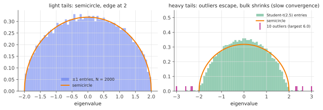

# Wigner's semicircle law

!!! tldr "TL;DR"
    Take a large symmetric matrix with independent mean-zero entries of variance $1/N$. Its eigenvalue histogram converges to the **semicircle** $\rho(x) = \frac{1}{2\pi}\sqrt{4-x^2}$ on $[-2,2]$,
    whatever the entry distribution, as long as the variance is finite. There are two classical proofs. The **moment method** counts closed walks on trees and gets the Catalan numbers.
    The **Stieltjes method** uses a Schur complement and a law of large numbers to get the self-consistent equation $g = 1/(z-g)$. The semicircle is the null model for "symmetric
    noise", and the threshold beyond which a planted signal pokes out of it is the prototype of every detectability transition.

## Why care?

The semicircle is to random matrices what the Gaussian is to random variables. It is the universal limit for symmetric noise, it plays the role of the Gaussian in free probability
(the "free central limit theorem"), and almost every other spectral law can be derived from it.

In practice it is the **null hypothesis** for symmetric matrices. Is there community structure in this network's adjacency matrix? Is this Hessian's spectrum a structured bulk or random?
Is there a planted signal in this noisy similarity matrix? You answer these by comparing with the semicircle and looking for eigenvalues that stick out past $\pm2$. Exercise 5 computes
exactly when a planted signal becomes visible.

## Building blocks

**Wigner matrices.** $X = A/\sqrt N$ where $A$ is $N\times N$ symmetric with $\{A_{ij}\}_{i\le j}$ independent, $\E A_{ij} = 0$, $\E A_{ij}^2 = 1$ for $i\neq j$, and diagonal entries with bounded variance.
The GOE of the [Gaussian ensembles](gaussian-ensembles.md) note is the Gaussian special case. Coin flips $A_{ij} = \pm1$ are the other classic.

**Why divide by $\sqrt N$?** $\frac1N\tr X^2 = \frac{1}{N^2}\sum_{i,j}A_{ij}^2\approx1$. With this scaling the *average squared eigenvalue* is $1$, and the spectrum stays bounded.

**Empirical spectral distribution (ESD).** $\rho_N = \frac1N\sum_i\delta_{\lambda_i(X)}$, a random probability measure. Its moments are traces: $\int x^k\,d\rho_N = \frac1N\tr X^k$.

**The target.** The semicircle density $\rho_{sc}(x) = \frac1{2\pi}\sqrt{(4-x^2)_+}$ has moments $m_{2k+1} = 0$ and $m_{2k} = C_k = \frac{1}{k+1}\binom{2k}{k}$, the **Catalan numbers** $1, 1, 2, 5, 14, 42,\dots$
Its Stieltjes transform is $g_{sc}(z) = \frac{z - \sqrt{z^2-4}}{2}$ ([Stieltjes note](stieltjes-resolvent.md)).

## The main result

!!! theorem "Theorem (Wigner, 1955–58)"
    For a Wigner matrix $X = A/\sqrt N$ as above, the empirical spectral distribution converges weakly, almost surely, to the semicircle law:

    $$
    \frac1N\#\{i : \lambda_i(X)\in[a,b]\}\;\longrightarrow\;\int_a^b\frac{1}{2\pi}\sqrt{(4-x^2)_+}\,dx\qquad\text{for all } a < b .
    $$

    If moreover $\E A_{12}^4 < \infty$, the extreme eigenvalues converge too: $\lambda_{\max}(X)\to2$ and $\lambda_{\min}(X)\to-2$ (Bai–Yin). Without a fourth moment, outlier eigenvalues escape to infinity.

### Proof 1: the moment method (counting walks)

Expand the trace as a sum over closed walks $i_1\to i_2\to\dots\to i_k\to i_1$ on $\{1,\dots,N\}$:

$$
\E\frac1N\tr X^k = \frac{1}{N^{1+k/2}}\sum_{i_1,\dots,i_k}\E\big[A_{i_1i_2}A_{i_2i_3}\cdots A_{i_ki_1}\big].
$$

Since entries are independent with mean zero, a walk contributes only if **every edge it uses is traversed at least twice**. A walk of length $k$ then uses at most $k/2$ distinct edges.
Its edges form a connected graph, which has at most $k/2+1$ distinct vertices, so there are at most $N^{k/2+1}$ choices of labels. Compared with the prefactor $N^{-1-k/2}$:

- Walks with fewer than $k/2+1$ vertices contribute $O(1/N)$ in total and vanish.
- The surviving walks have exactly $k/2+1$ vertices and $k/2$ edges (so $k$ must be **even**). Their graph is a **tree**, each edge is traversed exactly twice (once each way), and each contributes
  $\prod\E A_{ij}^2 = 1$.

Such walks, with labels removed, are in bijection with **Dyck paths** of length $k$ (step up when exploring a new edge, step down when backtracking), equivalently with non-crossing pairings of
$k$ points. There are $C_{k/2}$ of them. Hence $\E\frac1N\tr X^{2m}\to C_m$ and odd moments $\to0$. These are the semicircle moments. A variance computation of the same kind shows
$\Var(\frac1N\tr X^k) = O(N^{-2})$, which gives almost sure convergence by Borel–Cantelli. Since the semicircle has compact support, its moments determine it. $\square$

Only the second moments of the entries ever appeared: **universality** in the moment method.

### Proof 2: the Stieltjes method (a self-consistent equation)

Let $G(z) = (z - X)^{-1}$ and $g_N(z) = \frac1N\tr G(z)$. The Schur complement formula for the first diagonal entry gives

$$
G_{11}(z) = \frac{1}{z - X_{11} - x^\top G^{(1)}(z)\,x},
$$

where $x\in\R^{N-1}$ is the first column of $X$ without its diagonal entry, and $G^{(1)}$ is the resolvent of $X$ with row and column 1 removed. Now apply three facts:

1. $X_{11} = A_{11}/\sqrt N\to0$.
2. $x$ has independent entries of variance $1/N$ and is **independent of $G^{(1)}$**, so the quadratic form concentrates: $x^\top G^{(1)}x\approx\frac1N\tr G^{(1)}$.
3. Removing one row and column changes the normalized trace by $O(1/N)$: $\frac1N\tr G^{(1)}\approx g_N(z)$.

So $G_{11}\approx\frac{1}{z - g_N(z)}$. The same holds for every diagonal entry, and averaging over $i$:

$$
g(z) = \frac{1}{z - g(z)}\qquad\Longleftrightarrow\qquad g^2 - zg + 1 = 0 .
$$

The root with $g\sim1/z$ at infinity is $g(z) = \frac{z - \sqrt{z^2-4}}{2}$. For $x\in(-2,2)$, $\sqrt{(x+i0)^2 - 4} = i\sqrt{4-x^2}$, so Stieltjes inversion gives
$\rho(x) = -\frac1\pi\operatorname{Im}g(x+i0) = \frac1{2\pi}\sqrt{4-x^2}$. $\square$

The Stieltjes argument is the one that generalizes: covariance matrices, matrices with variance profiles, sums and products of random matrices, and the resolvent methods behind
[deterministic equivalents](deterministic-equivalents.md) all follow the same three steps.

### When does the semicircle fail?

- **Infinite variance** (Lévy-type entries): a different limit, with heavy-tailed spectrum ([heavy-tailed RMT](heavy-tailed-rmt.md)).
- **Finite variance but no fourth moment**: the ESD is still semicircular in the limit, but the largest eigenvalues escape, driven by the few largest entries, and convergence is slow.
- **Sparse matrices** (each row has $d$ nonzeros, like a random $d$-regular graph or Erdős–Rényi with mean degree $d$): the semicircle appears only as $d\to\infty$. For fixed $d$ one gets other laws, such as
  Kesten–McKay.
- **Correlated entries / variance profiles**: other laws, computable by generalizations of the self-consistent equation.

{ .fig }

## Examples

### Moments of three ensembles

```python
import numpy as np
rng = np.random.default_rng(0)
N = 2000

def wigner(sampler):
    A = sampler((N, N))
    X = np.triu(A, 1)
    X = X + X.T + np.diag(np.diag(A))
    return X / np.sqrt(N)                                    # off-diagonal variance 1/N

ensembles = {
    "Gaussian":          lambda s: rng.standard_normal(s),
    "Rademacher ±1":     lambda s: rng.choice([-1.0, 1.0], size=s),
    "Student-t, ν=2.5":  lambda s: rng.standard_t(2.5, size=s) / np.sqrt(5.0),   # variance 1, no 4th moment
}
catalan = [1, 2, 5, 14]                                      # m_2, m_4, m_6, m_8 of the semicircle
for name, sampler in ensembles.items():
    lam = np.linalg.eigvalsh(wigner(sampler))
    moments = [np.mean(lam ** (2 * k)) for k in range(1, 5)]
    print(f"{name:17s} moments m2..m8: " + " ".join(f"{m:6.2f}" for m in moments) +
          f"   (Catalan: 1 2 5 14)   largest eigenvalue: {lam.max():.2f}")
# Gaussian          moments m2..m8:   1.00   2.00   5.00  14.00   (Catalan: 1 2 5 14)   largest eigenvalue: 1.98
# Rademacher ±1     moments m2..m8:   1.00   2.00   5.01  14.06   (Catalan: 1 2 5 14)   largest eigenvalue: 2.00
# Student-t, ν=2.5  moments m2..m8:   0.95   3.62  65.83 2064.78   (Catalan: 1 2 5 14)   largest eigenvalue: 6.02
```

Gaussian and coin-flip entries give the Catalan numbers to two decimals. With heavy-tailed entries, the high moments are dominated by a handful of outlier eigenvalues (the largest is $6$, three
times the edge), even though most of the spectrum still looks roughly semicircular.

### Try it

Switch the entry distribution and the size. Rademacher entries look just like Gaussian ones, sparse entries break the law, and heavy tails create outliers.

<div class="widget" data-widget="wigner"></div>

## Exercises

!!! question "Exercise 1 · warm-up: the second moment"
    Compute $\E\frac1N\tr X^2$ exactly for a Wigner matrix with off-diagonal variance $1/N$ and diagonal variance $2/N$ (the GOE). What does it converge to?

    ??? success "Solution"
        $\frac1N\tr X^2 = \frac1N\sum_{i,j}X_{ij}^2$. Its expectation is $\frac1N\big[N\cdot\frac2N + N(N-1)\cdot\frac1N\big] = \frac{2}{N} + \frac{N-1}{N} = 1 + \frac1N$. It converges to $1 = C_1$, the semicircle variance.

!!! question "Exercise 2 · semicircle moments by integration"
    Verify directly that $\int_{-2}^2x^2\rho_{sc}(x)dx = 1$ and $\int x^4\rho_{sc} = 2$. (Substitute $x = 2\cos\theta$.)

    ??? success "Solution"
        With $x = 2\cos\theta$: $\rho_{sc}(x)dx = \frac{1}{2\pi}\cdot2\sin\theta\cdot2\sin\theta\,d\theta = \frac{2}{\pi}\sin^2\theta\,d\theta$ on $[0,\pi]$. Then
        $m_{2k} = \frac{2}{\pi}\int_0^\pi4^k\cos^{2k}\theta\sin^2\theta\,d\theta$. For $k = 1$: $\frac{8}{\pi}\int\cos^2\sin^2 = \frac8\pi\cdot\frac\pi8 = 1$. For $k=2$: $\frac{32}{\pi}\int\cos^4\sin^2 = \frac{32}{\pi}\cdot\frac{\pi}{16} = 2$. ✓

!!! question "Exercise 3 · counting walks for $k = 4$"
    List the shapes of closed walks of length 4 that contribute to $\E\frac1N\tr X^4$ at leading order, and check you get $C_2 = 2$. Which walk shape involves $\E A_{ij}^4$, and why does it not matter?

    ??? success "Solution"
        Leading-order walks have 3 distinct vertices and 2 edges forming a tree (a path $j - i - k$), each edge traversed twice. Starting at $i_1$, the shapes are $i\to j\to i\to k\to i$ (centre at the start) and
        $j\to i\to k\to i\to j$ (start at a leaf). With labels, each has $\approx N^3$ choices, times $N^{-3}$, giving $1 + 1 = 2$ ✓.

        The walk $i\to j\to i\to j\to i$ uses one edge four times and contributes $\E A_{ij}^4$. It has only 2 vertices, so $N^2$ choices times $N^{-3}$ gives $O(1/N)$. The fourth moment affects only lower-order terms,
        which is why the bulk law is universal.

!!! question "Exercise 4 · reading off the edge"
    From $g^2 - zg + 1 = 0$, show that $z = g + 1/g$. Using that $g$ is real and decreasing on $(2,\infty)$ with $g\to0$ at $\infty$, show that $g(2) = 1$ and that $2$ is the smallest $z$ at which a real solution exists.
    (This "$z = g + 1/g$" form is the R-transform view of the [next free-probability note](free-probability-r.md).)

    ??? success "Solution"
        Divide the quadratic by $g$: $z = g + 1/g$. For real $z > 2$, $g\in(0,1)$ solves it (the other root $1/g > 1$ violates $g\sim1/z$). The function $h(g) = g + 1/g$ on $(0,1]$ is decreasing with minimum $h(1) = 2$.
        So real solutions with $g\le1$ exist iff $z\ge2$, with $g(2) = 1$. Below $2$ the solution becomes complex, and its imaginary part is the density. The edge is where $h'(g) = 1 - 1/g^2 = 0$.

!!! question "Exercise 5 · stretch: when does a planted signal become visible?"
    Let $Y = X + \theta vv^\top$ with $\|v\| = 1$ and $\theta > 0$ (a spiked Wigner matrix, the toy model of community detection). Show that $z$ is an eigenvalue of $Y$ outside the spectrum of $X$ iff $\theta\,v^\top(z - X)^{-1}v = 1$.
    Using $v^\top(z-X)^{-1}v\approx g(z)$ for large $N$, show that an outlier appears iff $\theta > 1$, at location $\theta + 1/\theta$.

    ??? success "Solution"
        $\det(z - X - \theta vv^\top) = \det(z - X)\,\big(1 - \theta v^\top(z-X)^{-1}v\big)$ (matrix determinant lemma). For $z$ outside the spectrum of $X$, $\det(z-X)\neq0$, so $z$ is an eigenvalue of $Y$ iff $\theta v^\top G(z)v = 1$.

        A fixed unit vector sees the resolvent through its normalized trace (by rotational invariance or quadratic-form concentration), so the condition becomes $g(z) = 1/\theta$ for $z > 2$. Since $g$ maps $(2,\infty)$ onto
        $(0,1)$, a solution exists iff $1/\theta < 1$, i.e. $\theta > 1$. Then $z = g + 1/g = \frac1\theta + \theta$.

        For $\theta\le1$ the spike is swallowed by the bulk: the top eigenvalue sticks to $2$ and no spectral method can detect the signal. This is the Wigner version of the [BBP transition](bbp-spiked.md). It is also the
        Kesten–Stigum-type threshold of community detection in dense graphs.

## Where it shows up

- **Detecting structure in networks.** The adjacency matrix of a dense random graph, centred and scaled, has a semicircle spectrum. Communities appear as outliers once their signal exceeds the
  threshold of Exercise 5. That gives fundamental limits for spectral clustering and community detection.
- **Loss-landscape models.** Pennington & Bahri (2017) modelled neural-network Hessians as sums of Wishart and Wigner-like pieces, and used free probability to predict how the fraction of
  negative curvature directions depends on the loss value. Semicircle-like bulks with outliers are what Hessian-spectrum studies of real networks observe.
- **Initialization and signal propagation.** Symmetric random weight matrices at initialization have semicircular spectra. The theory of dynamical isometry asks the analogous question for
  products of non-symmetric weight matrices, using the free-probability toolkit that starts here.
- **Free probability.** The semicircle is the "free Gaussian". Sums of many free random matrices converge to it, just as sums of independent variables converge to a Gaussian.
  [Free probability I](free-probability-r.md) makes this precise.
- **Physics.** Wigner introduced the law for nuclear energy levels. Its local refinements (GOE/GUE statistics) are signatures of quantum chaos.

## Further reading

- G. W. Anderson, A. Guionnet & O. Zeitouni, *An Introduction to Random Matrices* (2010), Ch. 2. Both proofs in full.
- T. Tao, *Topics in Random Matrix Theory* (2012), §2.4. The moment, Stieltjes and free-probability proofs side by side.
- J. Pennington & Y. Bahri, "Geometry of neural network loss surfaces via random matrix theory" (ICML 2017).
- Z. D. Bai & Y. Q. Yin, "Necessary and sufficient conditions for almost sure convergence of the largest eigenvalue of a Wigner matrix" (*Ann. Probab.*, 1988).
